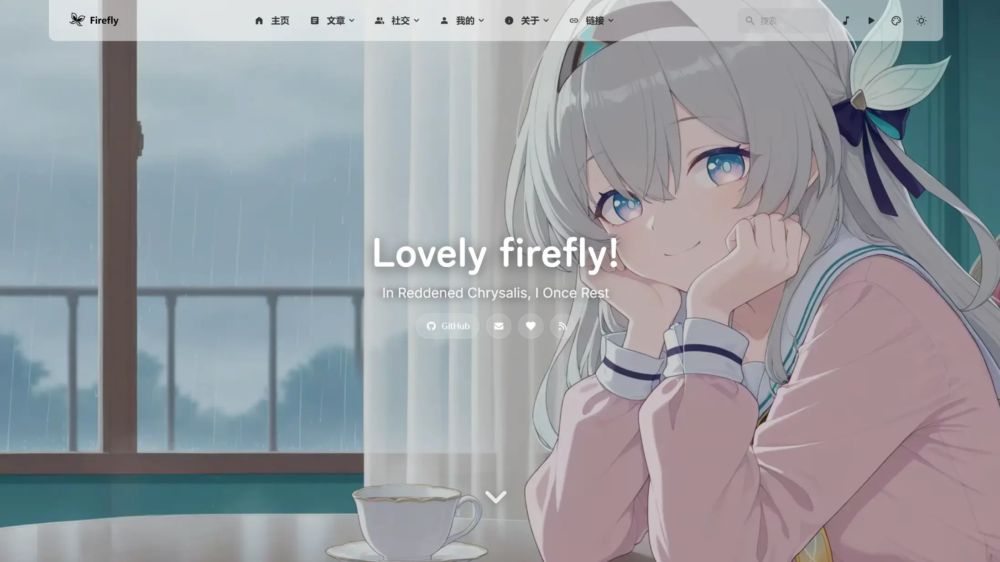

<div align="center">

# Firefly
> 美しくモダンな Astro 静的ブログテーマテンプレート
> 
>  


>
> [](https://github.com/CuteLeaf/Firefly/stargazers)
[](https://github.com/CuteLeaf/Firefly/network/members)
[](https://github.com/CuteLeaf/Firefly/issues)
> 
> [](https://ko-fi.com/Z8Z41NQALY)
>
> **QQ交流群：[1087127207](https://qm.qq.com/q/ZGsFa8qX2G)**
> 
> 
[](https://deepwiki.com/CuteLeaf/Firefly)
[](https://ifdian.net/a/cuteleaf)

</div>


---
📖 README：
**[简体中文](../README.md)** | **[繁體中文](README.zh-TW.md)** | **[English](../README.en.md)** | **[日本語](README.ja.md)** | **[한국어](README.ko.md)**

🚀 クイックガイド：
[**🖥️ライブデモ**](https://firefly.cuteleaf.cn/) /
[**📝ドキュメント**](https://docs-firefly.cuteleaf.cn/) /
[**🍀私のブログ**](https://blog.cuteleaf.cn)

⚡ 静的サイト生成：Astro ベースの超高速読み込み速度と SEO 最適化

🎨 モダンデザイン：シンプルで美しいインターフェース、カスタマイズ可能なテーマカラー

📱 モバイルフレンドリー：完璧なレスポンシブ体験、モバイル専用最適化

🔧 高度にカスタマイズ可能：ほとんどの機能モジュールは設定ファイルでカスタマイズ可能

<table width="100%" align="center">
  <tr>
    <td colspan="3" align="center">
      
      <br>バナーモード</td>
    </td>
  </tr>
  <tr>
    <td align="center"><br>オーバーレイモード</td>
    <td align="center"><br>全画面壁紙モード</td>
    <td align="center"><br>ソリッドカラーモード</td>
  </tr>
</table>


>[!TIP]
>
>Firefly は、Astro フレームワークと Fuwari テンプレートをベースに開発された、清新で美しくモダンな個人ブログテーマテンプレートです。技術愛好家やコンテンツクリエイター向けに設計されており、モダンな Web 技術スタックを統合し、豊富な機能モジュールと高いカスタマイズ性を備えたインターフェースで、プロフェッショナルで美しい個人ブログを手軽に構築できます。
>
>**Firefly コンポーネント設計や関連コードを参考または利用する場合は、出典として Firefly を明記してください。**
>
>Firefly はオリジナルの fuwari レイアウトも保持しており、設定ファイルで好みに応じて自由に切り替えられます。
>
>**レイアウト設定とデモの詳細については、[Firefly レイアウトシステム詳解](https://firefly.cuteleaf.cn/posts/guide/firefly-layout-system/)をご覧ください**
>
>Firefly は i18n の多言語 UI をサポートしていますが、簡体字中国語以外の言語は AI 翻訳です。誤りがある場合は、[Pull Request](https://github.com/CuteLeaf/Firefly/pulls) の提出を歓迎します。

## ✨ 機能

### コア機能

- [x] **Astro + Tailwind CSS** - モダンな技術スタックベースの超高速静的サイト生成
- [x] **スムーズなアニメーション** - Swup ページトランジションアニメーションで滑らかなブラウジング体験
- [x] **レスポンシブデザイン** - デスクトップ、タブレット、モバイルデバイスに完璧に対応
- [x] **多言語サポート** - i18n 国際化UI、簡体字中国語、繁体字中国語、英語、日本語、ロシア語、韓国語をサポート
- [x] **全文検索** - Pagefind ベースのクライアントサイド検索、記事コンテンツのインデックスをサポート

### パーソナライゼーション
- [x] **動的サイドバー** - シングルサイドバー、デュアルサイドバー設定をサポート
- [x] **記事レイアウト** - リスト（単列）、グリッド（多列/メーソンリー）レイアウトをサポート
- [x] **フォント管理** - カスタムフォントをサポート、豊富なフォントセレクター
- [x] **フッター設定** - HTMLコンテンツ注入、完全カスタマイズ可能
- [x] **ライト/ダークモード** - ライト/ダーク/システム追従の3モードをサポート
- [x] **ナビゲーションバーのカスタマイズ** - ロゴ、タイトル、リンクを完全カスタマイズ
- [x] **壁紙モード切り替え** - バナー壁紙、フルスクリーン壁紙、フルスクリーン透明壁紙、単色背景
- [x] **テーマカラーのカスタマイズ** - 360° 色相調整


便利な機能や最適化があれば、[Pull Request](https://github.com/CuteLeaf/Firefly/pulls)を提出してください

## 🚀 クイックスタート

### 環境要件

- Node.js ≥ 22
- pnpm ≥ 11

### ローカル開発

1. **リポジトリのクローン：**
   ```bash
   git clone https://github.com/Cuteleaf/Firefly.git
   cd Firefly
   ```
   
   **まず自分のリポジトリに[Fork](https://github.com/CuteLeaf/Firefly/fork)してからクローン（推奨）。クローンする前に Star をクリックするのを忘れずに！**

   ```bash
   git clone https://github.com/you-github-name/Firefly.git
   cd Firefly
   ```
3. **依存関係のインストール：**
   ```bash
   # pnpmがインストールされていない場合、まずインストール
   npm install -g pnpm
   
   # プロジェクトの依存関係をインストール
   pnpm install
   ```

4. **ブログの設定：**
   - `src/config/`ディレクトリ内の設定ファイルを編集してブログをカスタマイズ

5. **開発サーバーの起動：**
   ```bash
   pnpm dev
   ```
   ブログは`http://localhost:4321`で利用可能になります

### プラットフォームホスティングデプロイ
- **[公式ガイド](https://docs.astro.build/ja/guides/deploy/)を参照して、Vercel、Netlify、Cloudflare Pages、EdgeOne Pages などにブログをデプロイしてください。**
- **Vercel**、**Netlify** などの主要プラットフォームは自動デプロイに対応し、環境に応じて適切なアダプターが自動的に選択されます。

   フレームワークプリセット： `Astro`

   ルートディレクトリ： `./`

   出力ディレクトリ： `dist`

   ビルドコマンド： `pnpm run build`

   インストールコマンド： `pnpm install`

   [](https://vercel.com/new/clone?repository-url=https://github.com/CuteLeaf/Firefly&project-name=Firefly&repository-name=Firefly)
   [](https://app.netlify.com/start/deploy?repository=https://github.com/CuteLeaf/Firefly)

## 📖 設定説明

> 📚 **詳細な設定ドキュメント**：[Fireflyドキュメント](https://docs-firefly.cuteleaf.cn/)で完全な設定ガイドを確認してください

### ウェブサイトの言語設定

ブログのデフォルト言語を設定するには、`src/config/siteConfig.ts`ファイルを編集します：

```typescript
// サイト言語を定義
const SITE_LANG = "zh_CN";
```

**サポートされている言語コード：**
- `zh_CN` - 簡体字中国語
- `zh_TW` - 繁体字中国語
- `en` - 英語
- `ja` - 日本語
- `ru` - ロシア語
- `ko` - 韓国語

### 設定ファイル構造

```
src/
├── config/
│   ├── index.ts                  # 設定インデックスファイル
│   ├── siteConfig.ts             # サイト基本設定
│   ├── analyticsConfig.ts        # アナリティクス設定
│   ├── announcementConfig.ts     # お知らせ設定
│   ├── backgroundWallpaper.ts    # 背景壁紙設定
│   ├── commentConfig.ts          # コメントシステム設定
│   ├── coverImageConfig.ts       # カバー画像設定
│   ├── displaySettingsConfig.ts  # パネル構成の設定
│   ├── dynamicConfig.ts          # モーメントページ設定
│   ├── effectsConfig.ts          # アニメーションエフェクト設定（桜など）
│   ├── expressiveCodeConfig.ts   # コードハイライト設定
│   ├── fontConfig.ts             # フォント設定
│   ├── footerConfig.ts           # フッター設定
│   ├── friendsConfig.ts          # 友人リンク設定
│   ├── galleryConfig.ts          # ギャラリー設定
│   ├── licenseConfig.ts          # ライセンス設定
│   ├── musicConfig.ts            # 音楽プレーヤー設定
│   ├── navBarConfig.ts           # ナビゲーションバー設定
│   ├── pioConfig.ts              # マスコット設定
│   ├── mermaidConfig.ts          # Mermaid 図表設定
│   ├── plantumlConfig.ts         # PlantUML 図表設定
│   ├── profileConfig.ts          # ユーザープロフィール設定
│   ├── sidebarConfig.ts          # サイドバーレイアウト設定
│   └── sponsorConfig.ts          # スポンサー設定
```

## ⚙️ 記事のFrontmatter

```yaml
---
title: My First Blog Post
published: 2023-09-09
description: This is the first post of my new Astro blog.
image: ./cover.jpg  # または「api」を使用してランダムカバー画像を有効化
tags: [Foo, Bar]
category: Front-end
draft: false
lang: zh-CN      # 記事の言語が `siteConfig.ts` のサイト言語と異なる場合のみ設定
pinned: false    # 記事を固定
comment: true    # コメントを有効化
---
```

## モーメント

モーメントは `src/content/dynamic/` に保存され、1つの Markdown ファイルが1件のモーメントに対応します。次のコマンドで作成できます：

```bash
pnpm new-d 今日はとても良い天気です
```

`pnpm new-dynamic <content>` も同じ機能の完全なコマンドです。

```yaml
---
published: 2026-07-15 16:15:29
pinned: true  # 記事を固定
location: China # 場所
---

本文では Markdown を使用できます。
```

[Memos](https://www.usememos.com/) をデータソースとして接続することもできます。`src/config/dynamicConfig.ts` の `memos` オプションを設定すると、ピン留めの同期や画像添付ファイルの表示に対応したリアルタイムデータ取得が可能です。詳細は[モーメントドキュメント](https://docs-firefly.cuteleaf.cn/en/guide/dynamic.html)をご参照ください。

## 🧩 Markdown拡張

Astro がデフォルトで対応している[GitHub Flavored Markdown](https://github.github.com/gfm/)に加えて、いくつかの追加の Markdown 機能があります：

- Admonitions（予告ブロック） - GitHub、Obsidian、VitePress、Docusaurus の4つのテーマ設定をサポート ([プレビューと使用方法](https://firefly.cuteleaf.cn/posts/markdown-extended/))
- GitHub リポジトリカード ([プレビューと使用方法](https://firefly.cuteleaf.cn/posts/markdown-extended/))
- Expressive Code ベースの強化コードブロック ([プレビュー](http://firefly.cuteleaf.cn/posts/code-examples/) / [ドキュメント](https://expressive-code.com/))

## 🧞 コマンド

すべてのコマンドはプロジェクトルートディレクトリで実行する必要があります：

| Command                    | Action                                          |
| :------------------------- | :---------------------------------------------- |
| `pnpm install`             | 依存関係をインストール                          |
| `pnpm dev`                 | `localhost:4321`でローカル開発サーバーを起動    |
| `pnpm build`               | `./dist/`にサイトをビルド                       |
| `pnpm preview`             | ビルドされたサイトをローカルでプレビュー        |
| `pnpm check`               | コード内のエラーをチェック                      |
| `pnpm format`              | Biome を使用してコードをフォーマット            |
| `pnpm new-post <filename>` | 新しい記事を作成                                |
| `pnpm new-d <content>`     | 新しいモーメントを作成                          |
| `pnpm new-dynamic <content>` | 新しいモーメントを作成（完全なコマンド）      |
| `pnpm astro ...`           | `astro add`、`astro check` などのコマンドを実行 |
| `pnpm astro --help`        | Astro CLI ヘルプを表示                          |

## 🙏 謝辞

[fuwari](https://github.com/saicaca/fuwari) テンプレートを開発した[saicaca](https://github.com/saicaca)に深く感謝します。Firefly はこのテンプレートをベースに二次開発されています。

蛍関連の画像素材の著作権はゲーム[「崩壊：スターレイル」](https://sr.mihoyo.com/)の開発元 [miHoYo](https://www.mihoyo.com/) に帰属します。

### 技術スタック

- [Astro](https://astro.build) 
- [Tailwind CSS](https://tailwindcss.com) 
- [Iconify](https://iconify.design)

### インスピレーションプロジェクト

- [fuwari](https://github.com/saicaca/fuwari)
- [hexo-theme-shoka](https://github.com/amehime/hexo-theme-shoka)
- [astro-koharu](https://github.com/cosZone/astro-koharu)
- [Mizuki](https://github.com/matsuzaka-yuki/Mizuki)

### その他の参考
- ブロガー`霞葉`の [Bangumi コレクション](https://kasuha.com/posts/fuwari-enhance-ep2/) ページコンポーネント
- Bilibili クリエイター `公公的日常` のQ版 [蛍看板娘 Spine モデル](https://www.bilibili.com/video/BV1fuVzzdE5y)

## 📝 ライセンス

本プロジェクトは [MIT license](https://mit-license.org/) の下で公開されています。詳細は [LICENSE](../LICENSE) ファイルをご覧ください。

最初は [saicaca/fuwari](https://github.com/saicaca/fuwari) からフォークされました。元の作者の貢献に感謝します。

**著作権表示：**
- Copyright (c) 2024 [saicaca](https://github.com/saicaca) - [fuwari](https://github.com/saicaca/fuwari)
- Copyright (c) 2025 [CuteLeaf](https://github.com/CuteLeaf) - [Firefly](https://github.com/CuteLeaf/Firefly)

MIT ライセンスに基づき、コードの自由な使用、変更、配布が許可されていますが、上記の著作権表示を保持する必要があります。

## 🍀 貢献者

このプロジェクトに貢献してくれた以下の貢献者に感謝します。質問や提案がある場合は、[Issue](https://github.com/CuteLeaf/Firefly/issues)または[Pull Request](https://github.com/CuteLeaf/Firefly/pulls)を提出してください。

><a href="https://github.com/CuteLeaf/Firefly/graphs/contributors">
>  
></a>

このプロジェクトの基盤を築いた元のプロジェクト[fuwari](https://github.com/saicaca/fuwari)に貢献してくれた以下の貢献者に感謝します。

><a href="https://github.com/saicaca/fuwari/graphs/contributors">
>  
></a>

## ⭐ Star History

[](https://star-history.com/#CuteLeaf/Firefly&Date)


<!-- ALL-CONTRIBUTORS-LIST:START - Do not remove or modify this section -->
<!-- prettier-ignore-start -->
<!-- markdownlint-disable -->

<!-- markdownlint-restore -->
<!-- prettier-ignore-end -->

<!-- ALL-CONTRIBUTORS-LIST:END -->
