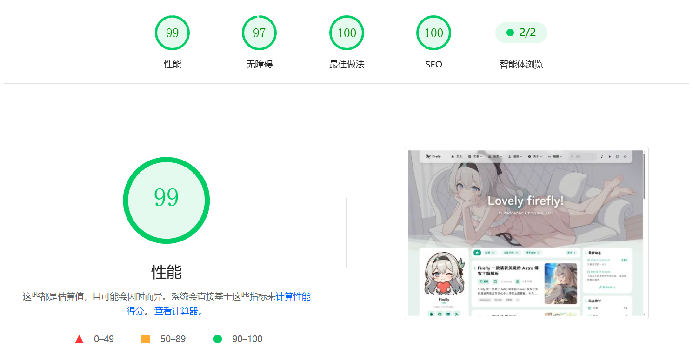

<div align="center">

# Firefly
> 산뜻하고 아름다운 Astro 정적 블로그 테마 템플릿
>
> 


>
> [](https://github.com/CuteLeaf/Firefly/stargazers)
[](https://github.com/CuteLeaf/Firefly/network/members)
[](https://github.com/CuteLeaf/Firefly/issues)
>
> [](https://ko-fi.com/Z8Z41NQALY)
>
> **QQ 커뮤니티: [1087127207](https://qm.qq.com/q/ZGsFa8qX2G)**
>
> 
[](https://deepwiki.com/CuteLeaf/Firefly)
[](https://ifdian.net/a/cuteleaf)
</div>


---
📖 README:
**[简体中文](../README.md)** | **[繁體中文](README.zh-TW.md)** | **[English](../README.en.md)** | **[日本語](README.ja.md)** | **[한국어](README.ko.md)**

🚀 빠른 안내:
[**🖥️온라인 데모**](https://firefly.cuteleaf.cn/) /
[**📝문서**](https://docs-firefly.cuteleaf.cn/) /
[**🍀내 블로그**](https://blog.cuteleaf.cn)

⚡ 정적 사이트 생성: Astro 기반의 매우 빠른 로딩 속도와 SEO 최적화

🎨 현대적인 디자인: 테마 색상을 사용자 지정할 수 있는 깔끔하고 아름다운 인터페이스

📱 모바일 친화적: 모바일에 최적화된 완벽한 반응형 환경

🔧 높은 구성 자유도: 대부분의 기능을 구성 파일에서 사용자 지정 가능

<table width="100%" align="center">
  <tr>
    <td colspan="3" align="center">
      
      <br>배너 모드</td>
    </td>
  </tr>
  <tr>
    <td align="center"><br>오버레이 모드</td>
    <td align="center"><br>전체 화면 배경화면 모드</td>
    <td align="center"><br>단색 모드</td>
  </tr>
</table>


>[!TIP]
>
>Firefly는 Astro 프레임워크와 Fuwari 템플릿을 기반으로 개발된 산뜻하고 아름다운 현대식 개인 블로그 테마 템플릿입니다. 기술 애호가와 콘텐츠 제작자를 위해 설계되었으며, 현대적인 웹 기술 스택과 다양한 기능 모듈, 자유롭게 사용자 지정할 수 있는 인터페이스를 제공하여 전문적이고 보기 좋은 개인 블로그를 손쉽게 만들 수 있습니다.
>
>**Firefly의 컴포넌트 디자인이나 관련 코드를 참고하거나 사용하는 경우, 출처가 Firefly임을 밝혀 주세요.**
>
>Firefly는 원본 fuwari 레이아웃도 유지하고 있어 구성 파일에서 취향에 맞게 자유롭게 전환할 수 있습니다.
>
>**더 많은 레이아웃 구성과 데모는 [Firefly 레이아웃 시스템 상세 안내](https://firefly.cuteleaf.cn/posts/guide/firefly-layout-system/)를 확인해 주세요.**
>
>Firefly는 i18n 다국어 UI를 지원하지만, 중국어 간체를 제외한 언어는 AI로 번역되었습니다. 오류를 발견하면 [Pull Request](https://github.com/CuteLeaf/Firefly/pulls)를 보내 개선에 참여해 주세요.

## ✨ 기능

### 핵심 기능

- [x] **Astro + Tailwind CSS** - 현대적인 기술 스택을 기반으로 한 초고속 정적 사이트 생성
- [x] **부드러운 애니메이션** - Swup 페이지 전환 애니메이션으로 매끄러운 탐색 환경 제공
- [x] **반응형 디자인** - 데스크톱, 태블릿, 모바일 기기에 완벽하게 대응
- [x] **다국어 지원** - i18n 국제화 UI로 중국어 간체, 중국어 번체, 영어, 일본어, 러시아어, 한국어 지원
- [x] **전문 검색** - Pagefind 기반 클라이언트 검색과 게시물 콘텐츠 색인 지원

### 개인화
- [x] **동적 사이드바** - 단일 및 이중 사이드바 구성 지원
- [x] **게시물 레이아웃** - 목록(단일 열) 및 그리드(다중 열/메이슨리) 레이아웃 지원
- [x] **글꼴 관리** - 사용자 지정 글꼴과 다양한 글꼴 선택기 지원
- [x] **푸터 구성** - HTML 콘텐츠 삽입을 통한 완전한 사용자 지정
- [x] **라이트/다크 모드** - 라이트, 다크, 시스템 설정 따르기 모드 지원
- [x] **내비게이션 바 사용자 지정** - 로고, 제목, 링크를 자유롭게 사용자 지정
- [x] **배경화면 모드 전환** - 배너, 전체 화면, 전체 화면 투명 배경화면 및 단색 배경 지원
- [x] **테마 색상 사용자 지정** - 360° 색조 조절


유용한 기능이나 개선 사항이 있다면 [Pull Request](https://github.com/CuteLeaf/Firefly/pulls)를 보내 주세요.

## 🚀 빠른 시작

### 요구 사항

- Node.js ≥ 22
- pnpm ≥ 11

### 로컬 개발

1. **저장소 복제:**
   ```bash
   git clone https://github.com/CuteLeaf/Firefly.git
   cd Firefly
   ```

   **먼저 자신의 저장소로 [Fork](https://github.com/CuteLeaf/Firefly/fork)한 다음 복제하는 것을 권장합니다. Fork 전에 Star를 누르는 것도 잊지 마세요!**

   ```bash
   git clone https://github.com/you-github-name/Firefly.git
   cd Firefly
   ```
3. **의존성 설치:**
   ```bash
   # Install pnpm if not installed
   npm install -g pnpm

   # Install project dependencies
   pnpm install
   ```

4. **블로그 구성:**
   - `src/config/` 디렉터리의 구성 파일을 편집하여 블로그 설정을 사용자 지정합니다.

5. **개발 서버 시작:**
   ```bash
   pnpm dev
   ```
   블로그는 `http://localhost:4321`에서 이용할 수 있습니다.

### 호스팅 플랫폼에 배포
- **[공식 가이드](https://docs.astro.build/en/guides/deploy/)를 참고하여 블로그를 Vercel, Netlify, Cloudflare Pages, EdgeOne Pages 등에 배포하세요.**
- **Vercel**, **Netlify** 등 주요 플랫폼에서는 환경에 맞는 어댑터를 자동으로 선택하여 배포합니다.

   프레임워크 프리셋: `Astro`

   루트 디렉터리: `./`

   출력 디렉터리: `dist`

   빌드 명령: `pnpm run build`

   설치 명령: `pnpm install`

   [](https://vercel.com/new/clone?repository-url=https://github.com/CuteLeaf/Firefly&project-name=Firefly&repository-name=Firefly)
   [](https://app.netlify.com/start/deploy?repository=https://github.com/CuteLeaf/Firefly)

## 📖 구성 안내

> 📚 **상세 구성 문서**: 전체 구성 안내는 [Firefly 문서](https://docs-firefly.cuteleaf.cn/)를 확인하세요.

### 웹사이트 언어 설정

블로그의 기본 언어를 설정하려면 `src/config/siteConfig.ts` 파일을 편집하세요.

```typescript
// Define site language
const SITE_LANG = "zh_CN";
```

**지원하는 언어 코드:**
- `zh_CN` - 중국어 간체
- `zh_TW` - 중국어 번체
- `en` - 영어
- `ja` - 일본어
- `ru` - 러시아어
- `ko` - 한국어

### 구성 파일 구조

```
src/
├── config/
│   ├── index.ts                  # Configuration index file
│   ├── siteConfig.ts             # Site basic configuration
│   ├── analyticsConfig.ts        # Analytics configuration
│   ├── announcementConfig.ts     # Announcement configuration
│   ├── backgroundWallpaper.ts    # Background wallpaper configuration
│   ├── commentConfig.ts          # Comment system configuration
│   ├── coverImageConfig.ts       # Cover image configuration
│   ├── displaySettingsConfig.ts  # Settings panel configuration
│   ├── dynamicConfig.ts          # Moments page configuration
│   ├── effectsConfig.ts          # Animation effects config (sakura, etc.)
│   ├── expressiveCodeConfig.ts   # Code highlighting configuration
│   ├── fontConfig.ts             # Font configuration
│   ├── footerConfig.ts           # Footer configuration
│   ├── friendsConfig.ts          # Friend links configuration
│   ├── galleryConfig.ts          # Gallery configuration
│   ├── licenseConfig.ts          # License configuration
│   ├── musicConfig.ts            # Music player configuration
│   ├── navBarConfig.ts           # Navbar configuration
│   ├── pioConfig.ts              # Mascot configuration
│   ├── mermaidConfig.ts          # Mermaid diagram configuration
│   ├── plantumlConfig.ts         # PlantUML diagram configuration
│   ├── profileConfig.ts          # User profile configuration
│   ├── sidebarConfig.ts          # Sidebar layout configuration
│   └── sponsorConfig.ts          # Sponsor configuration
```


## ⚙️ 게시물 Frontmatter

```yaml
---
title: My First Blog Post
published: 2023-09-09
description: This is the first post of my new Astro blog.
image: ./cover.jpg  # Or use "api" to enable random cover images
tags: [Foo, Bar]
category: Front-end
draft: false
lang: zh-CN      # Only set when article language differs from site language in `siteConfig.ts`
pinned: false    # Pin article
comment: true    # Enable comments
---
```

## 일상

일상 파일은 `src/content/dynamic/`에 저장되며, 하나의 Markdown 파일이 하나의 일상에 해당합니다. 다음 명령으로 만들 수 있습니다.

```bash
pnpm new-d The weather is lovely today
```

`pnpm new-dynamic <content>`는 같은 기능을 하는 전체 명령입니다.

```yaml
---
published: 2026-07-15 16:15:29
pinned: true  # Pin article
location: China # Location
---

일상 내용은 Markdown을 지원합니다.
```

[Memos](https://www.usememos.com/)를 데이터 소스로 사용할 수도 있습니다. `src/config/dynamicConfig.ts`의 `memos` 옵션을 구성하면 고정 항목 동기화와 이미지 첨부 표시를 지원하면서 Memos의 일상을 실시간으로 가져옵니다. 자세한 내용은 [일상 문서](https://docs-firefly.cuteleaf.cn/en/guide/dynamic.html)를 확인하세요.

## 🧩 Markdown 확장 문법

Astro가 기본으로 지원하는 [GitHub Flavored Markdown](https://github.github.com/gfm/) 외에도 다음과 같은 Markdown 기능을 제공합니다.

- 알림 블록(Admonitions) - GitHub, Obsidian, VitePress, Docusaurus 테마 구성 지원 ([미리 보기 및 사용법](https://firefly.cuteleaf.cn/posts/markdown-extended/))
- GitHub 저장소 카드 ([미리 보기 및 사용법](https://firefly.cuteleaf.cn/posts/markdown-extended/))
- Expressive Code 기반의 향상된 코드 블록 ([미리 보기](http://firefly.cuteleaf.cn/posts/code-examples/) / [문서](https://expressive-code.com/))

## 🧞 명령

모든 명령은 프로젝트 루트 디렉터리에서 실행해야 합니다.

| Command                    | Action                                              |
|:---------------------------|:----------------------------------------------------|
| `pnpm install`             | 의존성 설치                                         |
| `pnpm dev`                 | `localhost:4321`에서 로컬 개발 서버 시작            |
| `pnpm build`               | 사이트를 `./dist/`에 빌드                           |
| `pnpm preview`             | 빌드된 사이트를 로컬에서 미리 보기                  |
| `pnpm check`               | 코드 오류 검사                                      |
| `pnpm format`              | Biome으로 코드 서식 정리                            |
| `pnpm new-post <filename>` | 새 게시물 생성                                      |
| `pnpm new-d <content>`     | 새 일상 생성                                        |
| `pnpm new-dynamic <content>` | 새 일상 생성(전체 명령)                           |
| `pnpm astro ...`           | `astro add`, `astro check` 및 기타 명령 실행         |
| `pnpm astro --help`        | Astro CLI 도움말 표시                               |

## 🙏 감사의 말

Firefly의 2차 개발 기반이 된 [fuwari](https://github.com/saicaca/fuwari) 템플릿을 개발한 [saicaca](https://github.com/saicaca) 님께 특별히 감사드립니다.

Firefly 관련 이미지 에셋의 저작권은 게임 ["붕괴: 스타레일"](https://sr.mihoyo.com/)의 개발사인 [miHoYo](https://www.mihoyo.com/)에 있습니다.

### 기술 스택

- [Astro](https://astro.build)
- [Tailwind CSS](https://tailwindcss.com)
- [Iconify](https://iconify.design)

### 영감을 받은 프로젝트

- [fuwari](https://github.com/saicaca/fuwari)
- [hexo-theme-shoka](https://github.com/amehime/hexo-theme-shoka)
- [astro-koharu](https://github.com/cosZone/astro-koharu)
- [Mizuki](https://github.com/matsuzaka-yuki/Mizuki)

### 기타 참고 자료
- 블로거 `霞葉`의 [Bangumi Collection](https://kasuha.com/posts/fuwari-enhance-ep2/) 페이지 컴포넌트
- Bilibili 크리에이터 `公公的日常`의 Q 버전 [Firefly 마스코트 Spine 모델](https://www.bilibili.com/video/BV1fuVzzdE5y)

## 📝 라이선스

이 프로젝트는 [MIT 라이선스](https://mit-license.org/)에 따라 배포됩니다. 자세한 내용은 [LICENSE](../LICENSE) 파일을 확인하세요.

원래 [saicaca/fuwari](https://github.com/saicaca/fuwari)에서 fork되었습니다. 기여해 주신 원작자에게 감사드립니다.

**저작권 고지:**
- Copyright (c) 2024 [saicaca](https://github.com/saicaca) - [fuwari](https://github.com/saicaca/fuwari)
- Copyright (c) 2025 [CuteLeaf](https://github.com/CuteLeaf) - [Firefly](https://github.com/CuteLeaf/Firefly)

MIT 라이선스에 따라 코드를 자유롭게 사용, 수정 및 배포할 수 있지만 위 저작권 고지는 반드시 유지해야 합니다.

## 🍀 기여자

이 프로젝트에 기여해 주신 모든 분께 감사드립니다. 질문이나 제안이 있다면 [Issue](https://github.com/CuteLeaf/Firefly/issues) 또는 [Pull Request](https://github.com/CuteLeaf/Firefly/pulls)를 보내 주세요.

><a href="https://github.com/CuteLeaf/Firefly/graphs/contributors">
>  
></a>

이 프로젝트의 기반을 마련한 원본 프로젝트 [fuwari](https://github.com/saicaca/fuwari)에 기여해 주신 모든 분께도 감사드립니다.

><a href="https://github.com/saicaca/fuwari/graphs/contributors">
>  
></a>

## ⭐ Star 기록

[](https://star-history.com/#CuteLeaf/Firefly&Date)


<!-- ALL-CONTRIBUTORS-LIST:START - Do not remove or modify this section -->
<!-- prettier-ignore-start -->
<!-- markdownlint-disable -->

<!-- markdownlint-restore -->
<!-- prettier-ignore-end -->

<!-- ALL-CONTRIBUTORS-LIST:END -->
