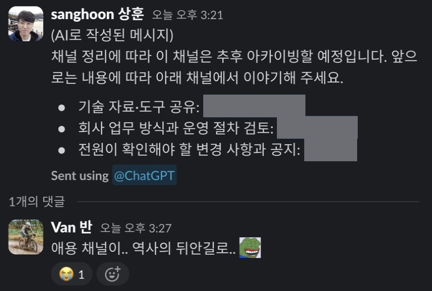

사내에서 AI와 자동화 이야기를 나누던 채널을 아카이빙한다는 공지가 올라왔다. 새 도구를 발견하면 링크를 올리고 써보다 막히면 질문하던 곳이었다. 내가 만든 작은 도구를 공유하기도 했다.

기록을 다시 보면서 내가 AI를 어떻게 활용해 왔는지 정리해 보고 싶어졌다. 새 모델 소식이나 사용량 이야기 사이에는 내가 해결하려던 문제들도 남아 있었다. IDE에서 보고 있는 코드를 에이전트에게 전달하는 일, 여러 작업 중 다음에 할 일을 고르는 일, 새 도구가 실제로 도움이 되는지 판단하는 일이었다.

## IDE에서 보던 코드를 에이전트에게 전달하기

2026년 2월에는 JetBrains IDE에서 선택한 코드의 위치를 터미널 쪽으로 쉽게 전달하고 싶었다. 코드를 가리키려면 파일 경로와 줄 번호가 필요했다. 이를 한 번에 복사하는 플러그인 [Copy Selection Context](https://github.com/hon454/copy-selection-context)를 만들고 채널에 공유했다.

> 연휴 마지막날에 Jetbrains IDE에서 사용가능한 플러그인 하나 말아봤습니다.
>
> IDE에서 TUI 쪽으로 선택 라인에 대한 컨텍스트 쉽게 전달하고 싶어서 만들어 봤어요.

— 2026년 2월 18일, Slack 메시지 발췌

플러그인은 파일 경로와 선택한 줄 범위를 클립보드에 넣는다. 필요하면 선택한 코드도 함께 담을 수 있다. 예를 들어 파일 경로와 줄 범위를 넘기면 에이전트에게 어느 부분을 보고 있는지 설명할 수 있다. 현재 공개 저장소에는 출력 형식과 사용법도 정리되어 있다.

## 반복하던 요청을 스킬로 만들기

코드의 위치를 전달하는 일 외에도 도구 사이에서 반복하던 요청이 있었다. Codex에서 계획을 세우고 Claude Code에 검토를 맡기는 일이었다. 3월에는 이 흐름을 스킬로 만들어 공유했다. 이후 도구 비교를 요청받았을 때도 이 사용 경험을 설명했다.

두 도구를 같이 쓴다고 연결이 저절로 매끄러워지지는 않았다. 당시에도 이런 조합을 쓰려면 연계를 위한 스킬이나 별도의 작업 구성이 필요하다고 적었다. 모델별 결과에 대한 체감과 함께 실제로 연결해 쓰는 데 필요한 구성도 선택 기준이었다.

5월에는 다른 반복 작업을 스킬로 묶었다. 작업하다가 다음에 무엇을 해야 할지 확인하는 일이었다. 현재 브랜치와 로컬 변경, 최근 커밋, PR과 이슈를 함께 살펴보는 [`now-what`](https://github.com/hon454/grimoire/blob/53a719e2bfdabe7c49523a6ec0237811a239ff4a/plugins/grimoire/skills/now-what/SKILL.md)을 만들었다.

> 최근 만들고 애용하는 `now-what` 스킬을 공유드립니다.
>
> 작업하다가 “근데 이제 뭐함?” 싶은 순간에 쓰려고 만든 스킬입니다.
> 현재 작업 중인 브랜치, 로컬 변경사항, 최근 커밋, 연결된 PR/이슈 등을 확인해서 지금 다음에 무엇을 하면 좋을지 추천 해줍니다.

— 2026년 5월 28일, Slack 메시지 발췌

공유할 때는 내가 사용하던 출력 예시도 붙였다. 진행 중인 작업과 다른 작업을 막고 있는 의존 관계, 이미 끝난 PR의 상태를 보고 이어갈 작업과 먼저 확인할 항목을 제안하는 예시였다.

추천 문장보다 근거가 중요했다. 지금 작업 중인 브랜치에 변경이 쌓여 있는지, 연결된 PR이 이미 병합됐는지에 따라 다음 행동이 달라졌다. 스킬에는 그런 상태를 확인하도록 반복 요청을 정리해 넣었다.

동료도 자신의 업무에 필요하겠다는 반응을 남겼다.

## 검색이 빠르다는 말도 나눠서 확인하기

직접 만든 도구 외에 기존 도구를 작업 환경에 붙여 쓰는 방법도 공유했다. 6월에 소개한 CodeGraph는 에이전트가 코드를 탐색할 때 사용하는 도구였다. 새 worktree에 인덱스가 없어 초기화가 필요한 경우를 설명하고 worktree 설정 스크립트와 탐색 지침을 함께 정리했다.

설정 방법과 함께 기존에 쓰던 `rg`와의 비교 보고서도 첨부했다. 한 worktree에서 심볼을 찾는 여덟 가지 과제를 비교했다. 각 쿼리는 한 번 준비 실행하고 아홉 번 측정했으며 CLI를 시작하는 시간도 포함했다.

| 비교 항목 | CodeGraph | `rg` |
| --- | ---: | ---: |
| 과제별 지연시간 중앙값의 중앙값 | 144.98 ms | 14.37 ms |
| 기대한 파일이 첫 번째에 나온 과제 | 8 / 8 | 4 / 8 |
| 기대한 파일이 세 번째 이내에 나온 과제 | 8 / 8 | 6 / 8 |

명령 실행 시간은 `rg`가 짧았다. CodeGraph는 기대한 구현 파일을 결과의 앞부분에 놓았다. 정확한 문자열이 드문 경우에는 `rg`도 바로 원하는 파일을 찾았고, 흔한 이름을 검색할 때는 구현 위치와 관계 정보를 함께 보는 쪽에 이점이 있었다.

기대 파일을 미리 선정한 여덟 과제에서 원하는 파일을 얼마나 먼저 찾는지 비교했다. `rg`의 출력 순서는 의미상 관련도를 매긴 순위가 아니며, 전체 에이전트 작업 완료 시간은 측정하지 않았다.

당시 공유한 작업 방식에서도 둘을 함께 쓰도록 했다. CodeGraph로 관련 심볼과 호출 관계, 변경 영향을 살펴본 뒤 텍스트 검색과 직접 읽기로 확인한다. 동작은 타입 검사와 테스트로 검증한다. 탐색 결과만으로 수정이 맞다고 판단하지 않도록 지침에도 적었다.

## 사내 논의를 함께 쓸 수 있는 도구로 옮기기

채널에서는 각자 쓰는 도구를 소개하다가 회사에서 함께 활용할 방법도 이야기했다. 그해 4월에는 채널에서 활발히 활동하던 사람들과 사내 AI 활용 방식을 논의하자는 요청을 받았다.

회의 다음 날에는 이야기했던 세션 코치를 만들어 공유했다. 에이전트가 만든 코드의 품질보다 사용자가 에이전트에게 일을 맡기는 방식을 돌아보는 도구였다. 작업 전에는 프로젝트의 지침과 설정을 확인하고 작업 후에는 프롬프트, 작업 분해, 검증 습관과 대화 흐름을 살펴보도록 구성했다.

> 어제 이야기한 세션 코치 만들어 봤어요

— 2026년 4월 14일, Slack 메시지 발췌

동료가 만든 사내 마켓에도 올려 달라는 요청을 받아 같은 날 플러그인과 두 스킬을 등록했다.

등록 과정에는 내 실수도 있었다. PR로 올려 달라는 안내에서 별도 리뷰어가 필요 없다는 부분만 읽고 `main`에 직접 넣었다가 동료에게 지적받았다. 빨리 만들어 올렸어도 공유 저장소의 절차는 지켰어야 했다.

## 공유한 설명을 다시 고친 기록

공유한 도구뿐 아니라 사용법을 설명한 글에도 후속 대화가 이어졌다. 내 이해가 틀린 경우도 있었고, 새 기능이 나오면서 전에 적은 설명을 고쳐야 할 때도 있었다.

7월 13일에는 서브에이전트에 모델과 추론 수준을 지정하는 방식을 잘못 이해하고 있었다는 글을 올렸다. 프롬프트에 원하는 모델 이름을 쓰는 것과 실제 실행 인자로 전달하는 것을 구분해 설명했다.

> 서브에이전트 모델 라우팅과 관련해 제가 잘못 이해하고 있던 부분이 있어 공유합니다.
>
> 저는 프롬프트에서 특정 모델과 추론 수준을 지정하면 `spawn_agent`가 해당 조건의 서브에이전트를 동적으로 생성한다고 생각했습니다.

— 2026년 7월 13일, Slack 메시지 발췌

다음 날에는 별도 작업을 생성하는 방식까지 포함해 내용을 보완했다. 서브에이전트를 만드는 호출과 앱에서 독립 작업을 만드는 호출을 나눠 설명했다.

> 다만 Codex 앱 전체로 범위를 넓히면 create_thread라는 별도 선택지가 있습니다.

— 2026년 7월 14일, Slack 메시지 발췌

7월 24일에는 「Codex 서브에이전트 모델 라우팅 업데이트 — 7/13 공유 내용 정정」이라는 글을 올렸다. 기존 글을 연결하고 새 버전에서 달라진 내용을 덧붙였다.

> 최신 Codex 0.145.0 / Multi-agent V2 기준으로는 이 결론이 바뀌었습니다. 이제 Custom Agent 파일 없이도 개별 spawn_agent 호출마다 model과 reasoning_effort를 지정할 수 있습니다.

— 2026년 7월 24일, Slack 메시지 발췌

이런 수정은 새 버전이 나왔을 때만 하지는 않았다. 동료가 비슷해 보이는 채팅 기능의 차이를 물으면 각 기능에서 다루는 작업 맥락을 나눠 설명했다. 나도 그 대화에서 모르던 단축키나 설정을 배웠다. 사용해 본 내용을 올리고 질문을 받으면 다시 확인한 내용을 같은 대화에 덧붙였다.

아카이빙을 앞두고 채널을 다시 읽으니 새 도구 소식 사이에 이런 대화들이 남아 있었다. 처음에는 내가 쓰다가 불편했던 일에서 출발했는데, 동료와 나누는 동안 함께 써볼 도구와 다시 확인할 내용이 생겼다. 이 채널에서 내가 배우고 만든 것들은 그렇게 쌓였다.

## 덧붙임: 활동 분석과 사례별 기록

활동 분석 보고서 펼쳐보기

Slack 기록과 공개 구현물을 바탕으로 AI가 정리한 분석의 공개용 발췌다. 집계 기준일은 2026년 9월 4일이다.

**활동에서 드러난 역할**

수집한 사례에서는 업무 중 발견한 문제를 도구로 만들고, 사용 경험과 비교 자료를 공유하는 활동이 반복됐다. Copy Selection Context와 now-what은 공개 구현물이 남아 있고, 세션 코치는 사내 공용 마켓에 추가한 커밋이 있다. CodeGraph 비교에서는 지연시간과 검색 결과의 노출 순서를 구분했다.

도구 비교 의견을 요청받거나 AI 활용 논의에 초대된 기록은 동료들이 사용 경험을 참고했다는 근거가 된다. 설정 안내 뒤 인식이 달라졌다는 답변, 재시작 제안 뒤 정상 동작했다는 답변도 있었다. 질문에 답하는 것과 함께 동료에게 사용법을 배우고 설명을 보완한 과정도 보인다.

이 자료에서 확인되는 역할은 작업 흐름 구성, 동료의 선택·탐색 지원, 공동 학습 참여다. 전사 AI 도입을 주도했다거나 동료들의 생산성을 정량적으로 높였다는 결론까지 뒷받침하지는 않는다.

**수집 범위**

| 항목 | 결과 |
| --- | ---: |
| 메시지 관찰 기간 | 2025-07-30~2026-09-04 |
| 내가 작성한 메시지 | 363건 |
| 시작글 / 답글 | 119 / 244건 |
| 메시지를 남긴 날짜 | 109일 |
| 연결된 대화 묶음 | 166개 |
| 대화 전문 메시지 | 777건: 내 메시지 363 + 다른 작성자 414 |
| 동료 답글이 있는 내 시작글 | 49 / 119개, 약 41.2% |
| 내 시작글에 답한 다른 작성자 | 18명 |
| 이모지 반응이 기록된 내 메시지 | 120건 |
| 검색 결과에서 텍스트 본문이 빈 메시지 | 19건 |
| 별도로 검색한 멘션 결과 | 13건 |

메시지 검색 19페이지를 끝까지 조회한 뒤 연결된 대화와 대조했다. 검색된 내 메시지 363건과 대화 전문에서 찾은 내 메시지의 ID가 일치했다. 대화 묶음에는 단독 시작글도 포함되며, 추가 멘션 검색에는 중복이 있어 777건에 가산하지 않았다.

**월별 활동**

| 월 (KST) | 메시지 | 시작글 | 답글 |
| --- | ---: | ---: | ---: |
| 2025-07 | 3 | 0 | 3 |
| 2025-08 | 0 | 0 | 0 |
| 2025-09 | 15 | 1 | 14 |
| 2025-10 | 5 | 1 | 4 |
| 2025-11 | 9 | 2 | 7 |
| 2025-12 | 14 | 6 | 8 |
| 2026-01 | 15 | 9 | 6 |
| 2026-02 | 75 | 11 | 64 |
| 2026-03 | 45 | 8 | 37 |
| 2026-04 | 53 | 19 | 34 |
| 2026-05 | 29 | 17 | 12 |
| 2026-06 | 33 | 15 | 18 |
| 2026-07 | 53 | 19 | 34 |
| 2026-08 | 9 | 8 | 1 |
| 2026-09 | 5 | 3 | 2 |

2026년 2월과 3월에는 답글 중심의 참여가 많았고, 4월부터 7월까지는 매달 15~19개의 시작글이 있었다. 플러그인 제작, 사용 후기, 구성 방법과 비교 보고서 등 공유 내용도 다양했다. 다만 짧은 답글을 여러 개로 나눠 쓴 대화가 있어 메시지 수를 기여의 크기나 역량 성장으로 해석하지 않았다. 2026년 9월은 4일까지의 기록이다.

**수치를 읽을 때의 범위**

- 관리자 내보내기가 아닌 연결 도구의 검색·대화 조회 결과다. 삭제되거나 접근할 수 없는 메시지는 포함하지 못했고, 수정 이력 전체를 확보하지는 않았다.
- 잡담·링크·첨부 메시지도 집계에 포함된다. 반응 120건은 반응을 받은 메시지 수이며, 이를 읽은 사람 수가 아니다. 답글 비율도 유익함이나 도입률을 뜻하지 않는다.
- 전체 채널의 메시지와 구성원별 활동을 수집하지 않아 기여 점유율·순위·네트워크 중심성은 계산하지 않았다.
- CodeGraph 보고서의 텍스트는 읽었지만 이미지와 ZIP을 일괄 판독·실행하지는 않았다. AI 답변을 옮기거나 ChatGPT로 게시한 메시지도 포함돼 있어 문장이 상세하다는 이유만으로 직접 조사·검증한 지식으로 간주하지 않았다.
- 설치·사용 사례, 추천 이후의 작업 결과, 비교 실험의 원시 로그가 추가된다면 실제 활용 효과를 더 구체적으로 설명할 수 있다. 현재 분석은 제작·공유·등록과 대화에서 확인되는 후속 반응까지를 다룬다.

14개 사례와 Slack 원문 발췌 펼쳐보기

각 사례의 행동과 후속 기록을 함께 정리했다. 인용은 내가 당시 남긴 메시지에서 발췌했으며, 당시 도구의 사용법을 현재 버전의 안내로 옮긴 것은 아니다. 동료 개인정보와 내부 업무 식별자를 포함한 원본 파일은 첨부하지 않았다.

**01. IDE 코드 위치 전달 플러그인 제작**

2026-02-18 · 업무 문제의 도구화

IDE에서 선택한 코드의 맥락을 터미널의 AI 도구에 전달하기 위한 플러그인을 제작하고 공개했다.

> IDE에서 TUI 쪽으로 선택 라인에 대한 컨텍스트 쉽게 전달하고 싶어서 만들어 봤어요.

— 2026-02-18, Slack 메시지 발췌

공개 저장소에서 파일 경로·줄 번호·선택 코드 복사 기능과 사용법을 확인했다. 동료의 설치 여부나 시간 절약은 측정하지 않았다.

[Copy Selection Context 공개 저장소](https://github.com/hon454/copy-selection-context)

---

**02. Codex 계획을 Claude Code가 검토하는 스킬**

2026-03-06 · 작업 흐름 설계

서로 다른 AI 도구를 연결해 계획을 검토하는 스킬을 만들어 공유하고 이후 비교 의견에서도 활용 경험을 설명했다.

> 코덱스에서 클로드 코드에게 플랜 리뷰를 맡기는 스킬 만들어 봤습니다.

— 2026-03-06, Slack 메시지 발췌

스킬 ZIP 첨부와 이후 사용 경험 설명이 남아 있다. 첨부 코드를 실행하거나 리뷰 품질 개선을 측정한 자료는 아니다.

---

**03. CTO 요청에 도구 선택 기준 제공**

2026-03-30 · 의사결정 지원

CTO의 비교 요청에 비용, 사용자 특성, 작업 연계와 결과의 체감을 나눠 설명했다.

> 섞어서 사용할 때도 있었는데 저는 스킬을 활용해서 codex에서 구축한 plan을 claude code가 검토하게 하도록 했습니다. 다만 이 경우 연계가 부드럽게 되려면 일반적인 스킬보다는 고수준의 스킬을 구축해야 합니다.

— 2026-03-30, Slack 메시지 발췌

양쪽 도구를 사용한 경험자로 비교 의견을 요청받았고, 다른 동료가 답변의 일부를 인용했다. 당시의 주관적 사용 경험이며 최종 구매·도입 결정에 미친 영향은 확인하지 못했다.

---

**04. AI 활용 논의 초대와 세션 코치 사내 등록**

2026-04-09~14 · 조직의 공용 도구 기여

활발한 채널 참여자로 사내 AI 활용 논의에 초대됐고, 회의 다음 날 세션 코치를 공유해 요청에 따라 사내 마켓에 등록했다.

> 어제 이야기한 세션 코치 만들어 봤어요

— 2026-04-14, Slack 메시지 발췌

4월 9일 논의 초대, 14일 오전 구현물 공유, 같은 날 사내 마켓 추가 커밋과 등록 메시지가 이어졌다. 마켓의 기획·운영은 동료의 기여다. 등록 때 PR 절차를 놓쳤으며 설치·사용 효과는 측정하지 않았다.

---

**05. 영어 프롬프트 코칭 스킬 제작·업데이트**

2026-04-30 · 활용 방법의 도구화

동료의 메시지를 계기로 프롬프트를 검토하는 스킬을 만들어 배포하고 업데이트 위치를 안내했다.

> 영어로 Claude에게 프롬프트 쓸 때 문법 + 명확성 + 구조 + 출력 포맷을 한 번에 검수해주는 도구입니다.

— 2026-04-30, Slack 메시지 발췌

입출력 예시와 ZIP을 공유했고, 파일 위치를 묻는 질문에 업데이트 버전을 댓글에 올렸다고 답했다. 영어가 항상 더 좋은 결과를 낸다는 비교 실험이나 사용 효과 측정은 아니다.

---

**06. now-what 스킬과 실제 업무 출력 공유**

2026-05-28 · 맥락 확인과 다음 작업 선택

작업 상태를 종합해 다음 행동을 추천하는 스킬을 만들어 사용하고 업무 예시와 함께 공유했다.

> 최근 만들고 애용하는 `now-what` 스킬을 공유드립니다.
>
> 작업하다가 “근데 이제 뭐함?” 싶은 순간에 쓰려고 만든 스킬입니다.

— 2026-05-28, Slack 메시지 발췌

업무 출력 예시와 동료의 필요 공감이 있었고, 공개 스킬에서 브랜치·변경·PR·이슈를 확인하는 구성을 확인했다. 추천의 정확성이나 동료의 실제 도입은 측정하지 않았다.

[now-what 공개 소스](https://github.com/hon454/grimoire/blob/53a719e2bfdabe7c49523a6ec0237811a239ff4a/plugins/grimoire/skills/now-what/SKILL.md)

---

**07. CodeGraph 환경 통합과 한계를 포함한 비교**

2026-06-04 · 검증과 작업 환경 구성

새 worktree의 인덱스 초기화 방법과 탐색 지침을 공유하고, 검색 지연시간·결과 노출 순서를 비교한 보고서를 함께 제공했다.

> 추가로 제 로컬 AGENTS.md에 아래와 같은 지침을 추가했습니다.

— 2026-06-04, Slack 메시지 발췌

초기화 스크립트와 탐색 지침, 비교 보고서를 함께 공유했다. 보고서는 8과제에서 준비 실행 1회와 측정 9회를 진행했다. CLI 지연시간 중앙값의 중앙값은 CodeGraph 144.98 ms, rg 14.37 ms였다. 기대 파일의 첫 번째 노출은 8/8 대 4/8이었다. 원시 실행 로그와 재실행 결과를 확보한 것은 아니며, 개발 시간이나 토큰 절감 실험도 아니다.

---

**08. 모델 라우팅 설명 보완·정정**

2026-07-13~24 · 공유 정보 유지·수정

자신의 오해와 설명 범위를 공개하고 후속 설명과 변경된 기능에 대한 정정 글을 남겼다.

> Codex 서브에이전트 모델 라우팅 업데이트 — 7/13 공유 내용 정정

— 2026-07-24, Slack 메시지 발췌

7월 13일 오해 설명, 14일 독립 작업 생성 방식 보완, 24일 이전 글을 연결한 업데이트가 남아 있다. 이 사례는 설명을 유지·수정한 과정에 관한 것이다. 과거 환경을 재현하거나 메시지의 모든 기술 설명을 독립 검증하지는 않았다.

---

**09. 동료에게 필요한 설정 정보 전달**

2026-05-15 · 동료의 탐색 지원

특정 동료에게 Windows 원격 연결 설정 안내를 전달했고, 동료는 지원을 기다리며 포기하고 있었다고 응답했다.

> codex 모바일 신규 지원되는데 윈도우는 설정 켜야 한다고 하네요.

— 2026-05-15, Slack 메시지 발췌

설정 안내와 공식 문서 링크를 전달한 뒤, 동료가 지원을 기다리며 포기하고 있었다고 답했다. 실제 연결 성공까지 확인된 사례는 아니다.

---

**10. 실행 장애 질문에 대응**

2026-07-14 · 동료 문제 대응

동료가 요청이 가지 않는다고 하자 재시작 등 확인 방법을 제안했고, 동료는 앱을 껐다 켜니 동작한다고 답했다.

> codex가 고장나면 해결 방법
> 1. 코덱스 껏다 키기

— 2026-07-14, Slack 메시지 발췌

14:03 질문, 14:04 재시작 제안, 14:10 앱을 껐다 켜니 동작한다는 답변이 이어졌다. 재시작 뒤 정상 동작했다는 작은 범위의 결과이며 근본 원인 분석은 아니다.

---

**11. 비슷한 채팅 기능을 구분해 설명**

2026-07-29 · 사용 경험 해설·공동 학습

기능 팁을 공유하고 동료의 질문에 대화 맥락 공유 여부를 기준으로 차이를 설명했다.

> ChatGPT 사이드 바에 열어줘
> • 이건 사이드 챗이 아니라 인앱 브라우저를 사이드 패널에 띄우고 ChatGPT를 웹 접속 하는 것

— 2026-07-29, Slack 메시지 발췌

기능 팁을 공유한 뒤 질문에 답했고, 동료들도 추가 조사와 설명을 보탰다. 같은 대화에서 나온 모든 설명을 한 사람의 기여로 합치지 않았다.

---

**12. 도구 개발자에게 전달할 구체적 질문 구성**

2026-02-26~03-03 · 학습 의제 제시

서브에이전트 활용과 스킬 관리에 대한 질문을 제시했고, 동료는 관련 두 주제에 대해 받아온 답변을 채널에 공유했다.

> Q2. Skills의 목록과 설명은 항상 로드되는 구조로 알고 있는데, Skills 수가 많아질 경우 어떻게 대응하시나요? 프로젝트별로 Skills를 분리해서 운용하시는지, 혹은 필요한 시점에 지연 로딩(lazy loading)하는 방식을 사용하시는지 궁금합니다(애초에 이게 가능한건지?). 아니면 Skills 목록/설명 로드 부하는 실용적으로 크게 신경 쓰지 않아도 되는 수준인가요?

— 2026-02-26, Slack 메시지 발췌

질문 목록에는 서브에이전트 활용과 스킬 관리에 관한 세 가지 질문이 있었다. 이후 동료가 관련 두 주제에 대해 받아온 답변을 공유했다. 질문 현장은 확인하지 않았으며 답변을 가져온 역할은 동료에게 있다.

---

**13. 요청받은 펫 제공과 후속 공유 대화**

2026-05-14~06-10 · 참여·교류 지원

동료의 요청에 맞춰 펫 파일을 제공했고, 같은 스레드에서 다른 동료들의 요청과 자체 제작물 공유가 이어졌다.

> 요청해주신 도로롱 코덱스 펫입니다.

— 2026-05-14, Slack 메시지 발췌

ZIP 제공 뒤 사용해 보겠다는 답변과 다른 동료들의 요청·제작물 공유가 이어졌다. 이미지로 설치 성공을 판독한 것은 아니며 다른 사람이 만든 펫은 해당 동료의 결과물이다.

---

**14. 플러그인 탐색 뒤 사용 후기 회수**

2026-06-26~27 · 실험과 경험 공유

새 플러그인을 써보겠다고 공유한 뒤 같은 날 개인 리뷰 흐름에 사용한 후기를 남겼다.

> 특히 리뷰 기능은 바로 개인 리뷰 프로세스에 병합하여 사용했을때 이질감 없고 굉장히 조언 느낌도 좋은 것 같습니다.

— 2026-06-26, Slack 메시지 발췌

써보겠다는 공유 뒤 같은 날 개인 리뷰 흐름에 사용한 후기를 남겼고, 다음 날에도 리뷰용으로 사용한다고 설명했다. 주관적 사용 후기이며 리뷰 품질 향상을 입증하는 비교는 아니다.

