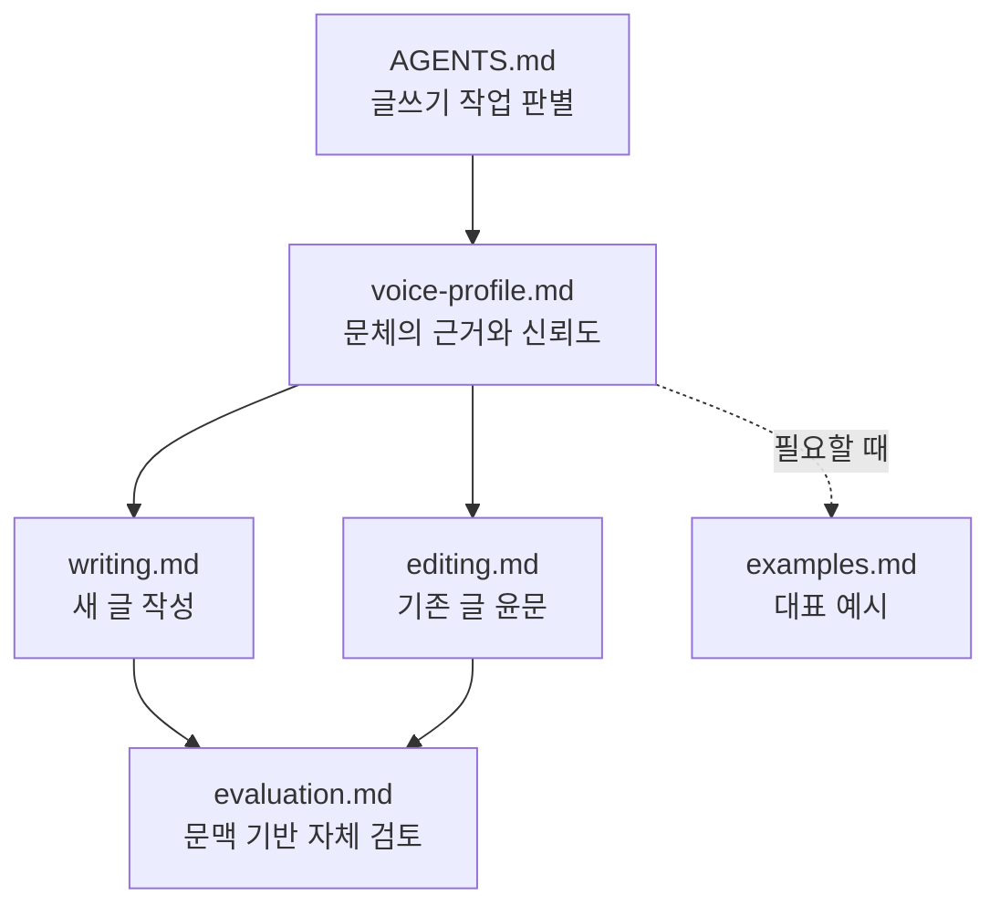

블로그 글을 AI로 쓰기 위한 지침을 만들면서 내 말투부터 정리해 보기로 했다. 이전 손글에서는 자주 쓰는 표현과 글의 흐름을 찾았다. Slack 메시지는 설명 순서와 판단 강도를 확인하는 보조 자료로 삼았다.

초기 지침을 기존 TDD 글에 적용하는 과정에서 다른 문제가 드러났다. 문장은 자연스러워졌지만 `접했다`가 `적용했다`로 바뀌는 식으로 원래 경험의 강도가 달라진 곳이 있었다. 이때부터 문체 특징과 윤문하면서 바꾸면 안 되는 경계를 지침에 함께 남겼다.

## 어떤 글을 문체의 근거로 쓸 것인가

Slack 워크스페이스 구성원에게 공개된 채널에서 내가 작성한 메시지를 먼저 분류했다. AI가 관여한 메시지를 제외하려 했지만 실제로는 어떤 메시지에 AI가 쓰였는지 확실하게 가르기 어려웠다. 공개 채널의 글이라고 해도 동료의 이름이나 업무 맥락이 섞일 수 있어 원문을 그대로 문체 예시로 남기는 것도 적절하지 않았다.

그래서 이전에 직접 작성한 로컬 블로그 글과 대체로 직접 작성한 [Velog 글](https://velog.io/@hon454/posts)을 주된 근거로 삼았다. 짧은 문제 해결 글과 장문 기술 설명, 개인 경험 글을 함께 보면서 반복되는 설명 순서, 단정의 강도와 문장 리듬을 찾았다.

Slack은 낮은 가중치의 보조 자료로만 사용했다. 특정 표현은 문체에 곧바로 반영하지 않았다. 한 메시지 안에서 문제를 설명하는 순서와 사실·추론을 표현하는 강도만 살폈다. 메시지 원문과 사람·채널·업무를 식별할 수 있는 정보는 지침에 옮기지 않았다.

현재 근거는 기술 문제 해결 글에 치우쳐 있다. 기술 글의 설명 방식은 비교적 신뢰할 수 있지만 개인 에세이나 다른 장르까지 같은 기준으로 쓰기에는 아직 표본이 부족하다는 점도 문체 프로필에 표시했다.

기존 `humanize-korean`의 한국어 AI 윤문 지침도 함께 검토했다. 그중 번역투, 기계적으로 맞춘 병렬 구조, 의례적인 결론과 과한 강조를 찾는 기준은 도움이 됐다. 이 Skill 자체를 글쓰기 과정에 내포하거나 항상 실행하지는 않았다. 필요한 기준만 저장소 지침에 반영했다.

`-다`체나 기능적인 목록은 기존 글에도 자주 나왔으므로 제거 대상으로 삼지 않았다. `것 같다`처럼 판단을 유보하는 표현도 실제 불확실성을 담고 있다면 유지했다. 번역투와 반복은 줄이되 특정 표현을 금지어로 만들지는 않았다.

## 독립 Skill 대신 저장소에 지침을 두기

처음에는 블로그 글쓰기용 독립 Skill을 작성하는 방향으로 진행했다. 이후 독립 Skill을 유지하지 않고 블로그 저장소의 지침을 필요할 때 읽어 사용하는 방식으로 바꿨다. Skill과 저장소 양쪽에 같은 규칙을 두면 어느 쪽이 최신인지 알기 어렵다. frontmatter나 글 경로처럼 이 블로그에만 해당하는 문맥도 별도로 맞춰야 했다.

`AGENTS.md`의 블로그 글쓰기 항목에는 작업을 판별하는 짧은 라우터만 두고 실제 지침은 저장소의 `.agents/docs/blog-writing/` 아래에 나눠 두었다.

에이전트는 작업에 필요한 문서만 읽고 마지막에 `evaluation.md`로 결과를 검토한다. 문체 규칙은 이 저장소 문서에만 두었다. 독립 Skill이 다시 필요해지더라도 규칙을 복사하지 않고 이 문서들을 읽도록 연결할 생각이다. 전체 구조는 [글쓰기 지침 PR](https://github.com/hon454/hon454.github.io/pull/72)에 남겨 두었다.

### 문체 검사기는 만들지 않았다

`verify-blog-style.py`로 문장 길이, 특정 표현의 횟수나 원문 대비 변경 비율을 확인하는 방안도 검토했다. 이번에는 추가하지 않았다.

짧은 문제 해결 메모와 긴 경험 글은 필요한 문장 길이부터 다르다. 실제 불확실성을 나타내는 완곡한 표현이나 정보를 전달하는 목록도 문맥에 따라 필요하다. 이런 요소를 횟수로 제한하면 오탐이 생기고 글마다 다른 리듬을 하나의 형식으로 맞출 가능성이 크다.

문체와 의미 보존은 `evaluation.md`에 따라 문맥으로 검토한다. 나중에 frontmatter, 파일명, 깨진 링크처럼 결과가 결정적인 규칙이 늘어나면 `validate-post.py` 같은 별도 검사를 고려할 수 있다. 자동 판정은 구조 규칙에만 사용하고 문체는 자동 검사의 대상에서 제외했다.

## TDD 글에 직접 적용해 보기

첫 적용 대상은 기존의 [게임 개발자가 Rust와 AI 에이전틱 코딩에서 다시 본 TDD](/posts/tdd-game-development-rust-ai-agent/) 글이었다.

도입부의 반복을 줄이고 교과서처럼 들리는 설명을 실제 경험 중심으로 바꿨다. 격언처럼 분리했던 문장은 `내 경우 AI 에이전트를 쓰면서 TDD가 덜 필요해진 것이 아니라 오히려 더 실용적으로 느껴졌다`는 개인 경험으로 돌려놓았다. 마지막 `마치며`는 `이후에도 가져갈 기준`으로 바꾸고 앞에서 이미 말한 내용을 다시 요약하던 부분을 줄였다.

frontmatter와 URL, Rust·Mermaid 코드, 식별자, 수치, 표와 목록이 보존됐는지 확인했다. 윤문 뒤에는 `pnpm check`, `pnpm type-check`, `pnpm build`와 `git diff --check`를 실행했다. 전체 변경은 [TDD 글 윤문 PR](https://github.com/hon454/hon454.github.io/pull/73)에서 확인할 수 있다.

### 자연스러운 문장이 항상 충실한 윤문은 아니었다

최종 PR에는 남지 않은 초기 윤문안을 원문과 다시 대조했을 때 읽기는 자연스럽지만 원문의 판단을 바꾼 문장이 세 곳 있었다.

1. `TDD 주기를 자주 접했다`를 `TDD를 자주 적용했다`로 바꾸면서 관찰과 경험을 적극적인 실행으로 강화했다. 최종 문장은 `TDD 주기를 자주 경험했다`로 조정했다.
2. AI가 TDD를 더 실용적으로 만들었다는 경험을 TDD를 더 자주 적용하게 됐다는 뜻으로 바꾸면서 원문에 없던 빈도 변화를 만들었다. 최종본에서는 `더 실용적으로 느껴졌다`는 판단을 유지했다.
3. `어디에 적용할 때 가장 값어치가 큰지`를 `어디부터 시작할지`로 고치면서 적용 적합성에 대한 기준을 실행 순서의 문제로 좁혔다. 이 부분은 원래 기준으로 되돌렸다.

세 문장 모두 표면만 보면 어색하지 않았다. 하지만 행동의 강도, 변화의 종류와 판단 기준이 달라졌다. 이 검토를 거치며 윤문의 우선순위도 분명해졌다. 문장을 자연스럽게 만드는 것보다 원문의 주장, 조건과 인과관계를 보존하는 일이 먼저였다.

한 번의 분석과 한 편의 적용으로 내 문체가 완성됐다고 보기는 어렵다. 지금 문서는 완성된 문체의 지문이라기보다 다음 글에서도 같은 판단을 반복하기 위한 기준이다. 특히 개인적인 글은 표본이 더 쌓이기 전까지 낮은 신뢰도로 다루려 한다.

앞으로는 AI가 만든 초안과 내가 직접 고친 최종본을 함께 비교할 수 있다. 어떤 문장을 지웠는지, 어디에서 단정을 낮췄는지, 문단 순서를 왜 바꿨는지가 쌓이면 완성된 글만 분석할 때보다 실제 윤문 습관을 더 정확히 볼 수 있다. 이 글도 같은 지침으로 만든 초안이다. 이후 직접 고친 결과를 다음 지침에 다시 반영할 생각이다.
