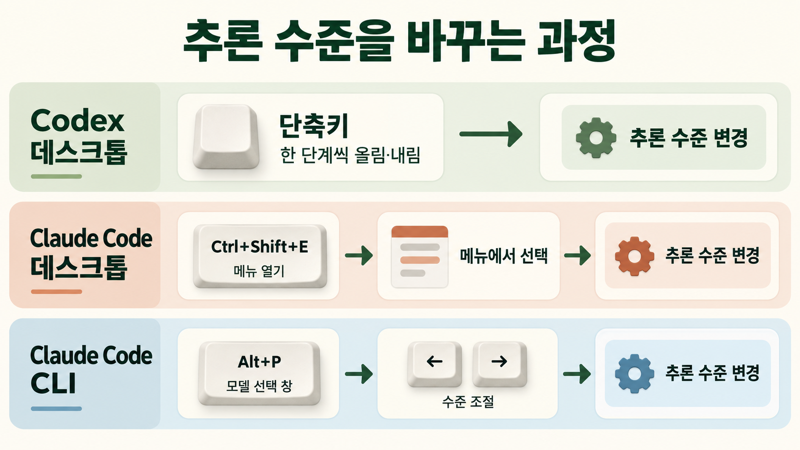
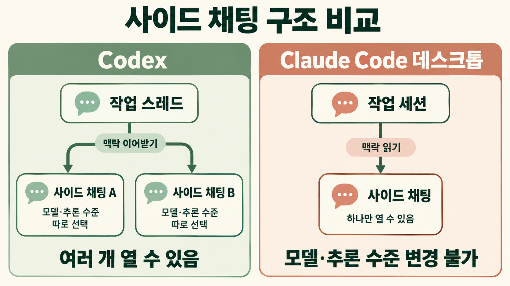

9월 29일부터 Claude Code 데스크톱 앱을 다시 쓰고 있다. 원래는 Codex를 더 선호했지만, 개인 계정으로 쓰기 시작한 뒤 사용량이 부족해서 Claude Max로 옮겼다.

Claude Code CLI와 데스크톱 앱은 예전에도 써봤다. 다만 한동안 Codex에 익숙해져 있었기 때문에 다시 쓰니 편한 점과 아쉬운 점이 눈에 들어왔다. 이번 글에서는 Codex 데스크톱 앱과 비교하며 느낀 장단점을 적어 둔다.

8월 31일에 회사를 퇴사하고 9월 중순쯤 개인 계정으로 Codex를 쓰려고 가입하려 했는데 200달러 플랜을 고를 수 없었다. OpenAI가 9월 10일(미국 시간)부터 [GPT-6 Astra 수요로 용량이 부족하다며 200달러 Pro 플랜의 신규 가입과 업그레이드를 멈춘](https://www.cio.com/article/4221092/openai-pauses-200-pro-tier-as-astra-demand-strains-capacity.html) 상태였다. 새로 가입하는 사람이 고를 수 있는 가장 높은 플랜은 100달러 플랜이었다.

울며 겨자 먹기로 100달러 플랜을 썼지만 역시나 사용량이 부족했다. 게다가 Astra는 토큰을 너무 빨리 썼다. 나만 그런 건 아닌지 Codex 저장소에도 [Astra의 토큰 사용량이 비정상적으로 많다는 이슈](https://github.com/openai/codex/issues/48765)가 올라와 있었다. 사용량 압박이 너무 심해서 9월 29일에 Claude Max 20x(200달러)를 결제했다.

그런데 다음 날 새벽, OpenAI DevDay에 맞춰 200달러 플랜 가입이 다시 열렸다. 호구가 되어버렸다..

다만 다시 열린 200달러 플랜은 예전 그대로가 아니었다. [새로 가입하면 API 사용 금액 기준으로 기존 200달러 플랜의 절반 정도를 쓸 수 있고](https://www.unite.ai/openai-reopens-chatgpt-pro-200-sign-ups-with-new-usage-calculation/), 대신 5시간 사용 제한은 다시 도입하지 않는다고 한다.

어쨌든 한 달은 Claude Code를 써야 한다. 한동안 Codex에 익숙해져 있었기 때문에 다시 적응하는 중이다. Codex 데스크톱 앱은 지금은 ChatGPT 데스크톱 앱의 Codex 모드로 통합되어 있지만 이 글에서는 편의상 Codex 데스크톱 앱이라고 부른다.

## 좋았던 점

### 세션을 삭제할 수 있다

Claude Code 데스크톱 앱은 세션을 보관하는 것뿐 아니라 바로 삭제할 수도 있다. Codex는 채팅 메뉴에서 보관만 할 수 있다. 완전히 지우려면 보관한 다음 설정의 보관된 채팅 목록에서 다시 삭제해야 한다.

### 모델 성능과 토큰 소모량

Max 20x 플랜에서 Sonnet 5.5와 Opus 5.5를 쓰고 있는데 성능과 토큰 소모량 모두 만족스럽다. 직전에 쓰던 Astra는 토큰 소모가 너무 빨랐기 때문에 차이가 더 크게 느껴진다.

Anthropic도 [Opus 5.5가 일반적인 작업에서 Opus 5보다 비용이 40% 적게 든다](https://www.anthropic.com/claude-opus-5-5)고 발표했다. 다만 Opus 5.5는 9월 22일, Sonnet 5.5는 9월 28일에 나온 모델이라 아직 써본 기간은 짧다.

### 앱이 더 빠르게 느껴진다

Claude Code 데스크톱 앱을 쓰면 Codex 데스크톱 앱을 쓸 때보다 모든 것이 좀 더 빠르게 반응한다. 실제 작업도 더 빨리 끝나는 느낌이다. 모델 성능과는 별개로 앱 자체에서 받는 인상이다.

## 아쉬운 점

### 단축키를 바꿀 수 없다

Codex 데스크톱 앱은 설정에서 단축키를 바꿀 수 있다. Claude Code CLI도 `~/.claude/keybindings.json`으로 대부분의 단축키를 바꿀 수 있다. 그런데 Claude Code 데스크톱 앱은 정해진 단축키만 쓸 수 있다. 데스크톱 앱에서 단축키 변경을 지원해 달라는 [이슈](https://github.com/anthropics/claude-code/issues/33034)는 4월에 not planned로 닫혔다.

이 간단한 걸 왜..?

### 추론 수준을 바로 올리고 내릴 수 없다

Codex에서는 단축키로 추론 수준을 한 단계씩 바로 올리고 내릴 수 있다. Claude Code 데스크톱 앱에서는 `Ctrl+Shift+E`로 추론 수준 메뉴를 연 다음 골라야 한다.

CLI에서는 단축키로 됐던 것으로 기억하는데, 현재 문서 기준으로는 CLI도 `Alt+P`로 모델 선택 창을 연 뒤 좌우 화살표로 조절하는 방식이다. 어느 쪽이든 창을 한 번 거쳐야 해서 Codex처럼 바로 바꾸는 것보다 번거롭다.

### 이미지 생성 모델이 없다

Codex에서는 [`gpt-image-2`를 이용한 이미지 생성](https://learn.chatgpt.com/docs/image-generation)을 앱 안에서 바로 쓸 수 있다. Claude는 이미지를 이해할 수는 있지만 생성하지는 못한다. SVG나 HTML로 다이어그램을 그리는 정도는 가능하다.

그래서 블로그 글 작성 같은 작업은 Codex가 더 유리하다고 생각한다. 생성형 이미지를 활용할 수 있으니까 말이다.

### 사이드 채팅이 하나뿐이다

[[eli5-skill-and-my-codex-workflow|ELI5 스킬 글]]에서 적었듯이 Codex에서는 작업 스레드 옆에 사이드 채팅을 열어 PR이나 리뷰 내용을 이해하는 데 자주 썼다. Codex의 사이드 채팅은 현재 대화의 맥락을 이어받으면서 모델과 추론 수준을 따로 고를 수 있다. 여러 개를 열 수도 있어서 일종의 포크처럼 쓸 수 있다.

Claude Code 데스크톱 앱에도 `Ctrl+;`나 `/btw`로 여는 사이드 채팅이 있다. 하지만 하나만 열 수 있고 사이드 채팅 안에서 모델이나 추론 수준을 바꿀 수 없다. 포크처럼 쓰던 Codex 쪽이 더 편했다.

### 여러 폴더를 묶는 과정이 어색하다

Codex는 [프로젝트](https://learn.chatgpt.com/docs/projects)를 먼저 만들고 거기에 여러 폴더를 붙이는 흐름으로 UX가 잡혀 있다. 기본 폴더를 정해 두면 새 채팅이 그 폴더에서 시작하고 나머지 폴더도 함께 읽고 수정할 수 있다.

Claude Code에서도 여러 폴더를 다루는 것이 불가능하지는 않지만 이 과정이 살짝 어색하다. Claude Code에도 Projects라는 기능이 있지만 이름만 같고 성격이 다르다. 관련된 작업을 하나의 대화로 맡기면 Claude가 클라우드 세션 스레드로 나눠 병렬로 실행하는 기능이고 아직 퍼블릭 베타다. 로컬 폴더 여러 개를 묶어 두고 작업하는 Codex의 프로젝트를 대신하지는 않는다.

### 외부 도구를 들여오는 속도가 느리게 느껴진다

OpenAI는 9월 29일 DevDay에서 [Dots](https://techcrunch.com/2026/09/29/openai-launches-dots-its-bubbly-agentic-avatar/)와 [ChatGPT Space](https://techcrunch.com/2026/09/29/openai-takes-on-microsoft-with-the-launch-of-what-feels-a-whole-lot-like-chatgpts-own-office-suite/)를 발표했다. Dots는 백그라운드에서 계속 일하는 에이전트로 Codex에서도 실행할 수 있다. Space는 페이지와 파일을 함께 두고 협업하는 작업 공간이다. 둘 다 Codex만의 기능은 아니고 ChatGPT 전반에 들어오는 기능이다.

아직 발표만 봤지만 Codex 쪽은 외부 도구와 업무 흐름을 자기 안으로 빠르게 끌어들이기 시작한 것 같다. 그에 비해 Claude Code는 한 발짝씩 늦어지는 느낌이다.

일단 한 달은 Claude Code를 쓰면서 다시 적응해 보려 한다.
