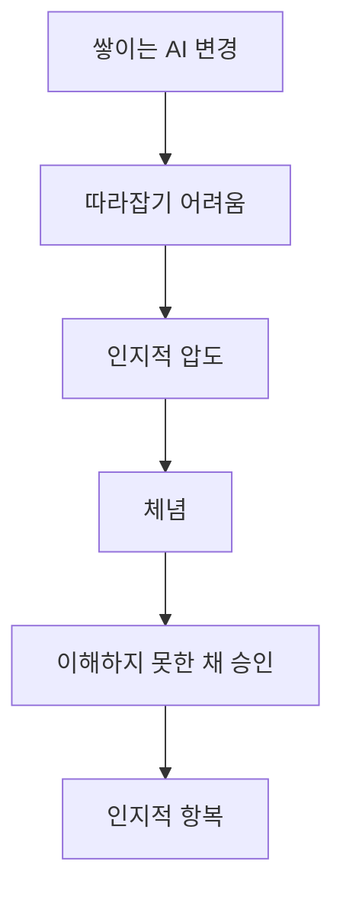

`인지적 압도(Cognitive Overload)`와 `인지적 항복(Cognitive Surrender)`이라는 말을 함께 알게 됐다.

두 단어의 정확한 정의를 설명해보라고 하면 아직 자신이 없다. 그런데 이 표현들을 처음 접했을 때, AI 에이전틱 코딩을 하면서 느꼈던 불편함을 꽤 정확하게 설명해주는 말이라고 생각했다.

나는 언리얼 엔진과 유니티를 기반으로 C++과 C#을 주로 다뤄온 게임 개발자다. 그런데 마지막으로 담당했던 프로젝트는 Rust와 Bevy, React와 TypeScript를 기반으로 하고 있었다.

내게 익숙한 게임 개발과 맞닿은 부분도 있었지만, 기술적으로는 낯선 영역이 많았다. AI가 코드를 수정할 때마다 변경 내용을 이해하려면 시간이 필요했다. 특히 프론트엔드 변경이 들어오면 수정량도 많았고, 내가 잘 모르는 도메인의 전문적인 코드도 한꺼번에 추가됐다.

처음에는 하나씩 이해해보려고 했다. 하지만 변경은 계속 쌓였다. 내가 하나를 이해하는 동안 AI는 그보다 훨씬 많은 코드를 만들어냈다.

어느 순간부터는 따라잡을 수 없다는 생각이 들었다.

그리고 그냥 승인했다.

이해할 수 없는 코드를 승인하는 일은 불안하고 불쾌했다. 내가 무엇을 승인하는지 제대로 설명할 수 없는데, 관리에 대한 책임은 여전히 나에게 있다는 생각이 들었기 때문이다.

AI가 코드를 작성했다고 해서 책임까지 AI에게 넘어가는 것은 아니다. 결국 그 코드를 프로젝트에 받아들인 것은 나였다.

## 압도되는 것과 항복하는 것

두 단어를 내 경험에 대입해보면, 변경량과 낯선 코드 앞에서 따라잡을 수 없다고 느낀 상태가 ‘인지적 압도’였던 것 같다.

“이걸 언제 다 이해하지?”

그런 생각이 반복되면서 이해하려는 시도 자체를 포기하고 승인하게 됐다. 그게 내게는 ‘인지적 항복’에 가까웠다. 적어도 내 경우에는 압도는 상황이었고, 항복은 체념하며 취한 태도였다.

내 경험을 순서대로 놓아보면 이랬다.

물론 모든 코드를 이해해야 한다는 이야기는 아니다. 현대의 소프트웨어는 한 사람이 전부 이해할 수 없을 만큼 복잡하다. 나 역시 내부 구현을 전부 알지 못하는 라이브러리와 프레임워크를 사용한다. 다른 사람이 작성한 코드도 어느 정도는 신뢰해야 한다.

AI가 작성한 코드도 테스트가 통과하고 원하는 대로 동작한다면 충분하지 않느냐는 말에도 어느 정도 공감한다.

그래서 더 어려운 질문이 남는다.

우리는 코드를 어디까지 이해해야 하는가?

솔직히 아직 답을 찾지 못했다. 모든 줄을 설명할 수 있어야 한다는 기준은 지나치다. 그렇다고 실행만 되면 충분하다고 생각하기도 어렵다.

지금 내가 가진 잠정적인 기준은 이 정도다.

코드를 승인하기 전에 적어도 다음 세 가지는 내 말로 설명할 수 있어야 하지 않을까.

- 현재 어떤 상황이나 문제가 있는가?
- 코드는 무엇을 수정하는가?
- 그 수정은 어떤 영향을 주는가?

이 정도도 설명할 수 없다면, 나는 그 코드를 정말 승인한 것일까? 아니면 그저 AI가 만든 변경에 통과 도장을 찍은 것일까?

다만 앞으로 AI가 만든 방대한 변경을 마주하면, 승인하기 전에 한 번은 스스로에게 물어보려고 한다.

> 나는 현재 문제와 변경 내용, 그리고 그 영향을 설명할 수 있는가?

다음에는 적어도 이 질문을 그냥 넘기지 않으려고 한다.
