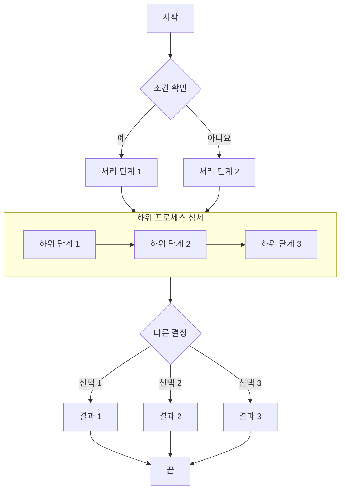

## 글의 잠금이 해제되었습니다!

이 내용을 볼 수 있다면 올바른 비밀번호를 입력해 글이 정상적으로 복호화된 것입니다.

### 기능 설명

- **빌드 시 암호화**: 글 내용은 빌드할 때 AES-256-GCM 알고리즘으로 암호화되며 페이지 소스에 평문이 포함되지 않습니다.
- **클라이언트 복호화**: 방문자가 올바른 비밀번호를 입력하면 브라우저가 Web Crypto API를 통해 로컬에서 복호화합니다.
- **세션 캐시**: 같은 브라우저 세션에서는 비밀번호가 `sessionStorage`에 저장되어 새로 고쳐도 다시 입력할 필요가 없습니다.
- **브라우저 종료 시 만료**: 브라우저를 닫으면 캐시가 지워져 다음 방문 때 비밀번호를 다시 입력해야 합니다.

> 비밀번호는 `123456`이며 테스트 용도로만 사용합니다.

## 이미지


## GitHub 저장소 카드

::github{repo="CuteLeaf/Firefly"}

## 알림 상자

> [!NOTE] NOTE
> 사용자가 참고해야 할 정보를 강조합니다.

> [!TIP] TIP
> 작업을 더 원활하게 진행하는 데 도움이 되는 선택 정보입니다.

> [!NOTE] 사용자 지정 제목
> 사용자 지정 제목이 있는 예시입니다.

## 수식
### 인라인 수식 (Inline)

오일러 공식 $e^{i\pi} + 1 = 0$은 수학에서 가장 아름다운 공식 가운데 하나입니다.

질량-에너지 등가식 $E = mc^2$도 널리 알려져 있습니다.

### 블록 수식 (Block)

블록 수식은 `$$` 기호 두 쌍으로 감싸며 가운데 정렬됩니다.

$$
\int_{-\infty}^{\infty} e^{-x^2} dx = \sqrt{\pi}
$$

$$
x = \frac{-b \pm \sqrt{b^2 - 4ac}}{2a}
$$

### 화학 방정식 (Chemical Equations)

$$
\ce{CH4 + 2O2 -> CO2 + 2H2O}
$$

## 코드 블록
#### 일반 구문 강조

```js
console.log('이 코드는 구문 강조가 적용됩니다!')
```

#### ANSI 이스케이프 시퀀스 렌더링

```ansi
ANSI colors:
- Regular: Red Green Yellow Blue Magenta Cyan
- Bold:    Red Green Yellow Blue Magenta Cyan
- Dimmed:  Red Green Yellow Blue Magenta Cyan

256 colors (showing colors 160-177):
160 161 162 163 164 165
166 167 168 169 170 171
172 173 174 175 176 177

Full RGB colors:
ForestGreen - RGB(34, 139, 34)

Text formatting: Bold Dimmed Italic Underline
```


## 흐름도


