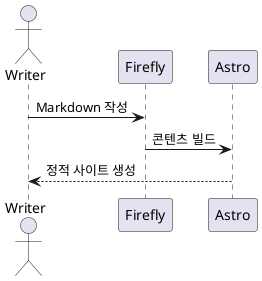

이 블로그는 Astro 기반 테마인 [Firefly](https://github.com/CuteLeaf/Firefly)를 사용한다. 처음에는 테마 기능을 확인하기 위한 예제 글을 그대로 두었지만, 개인 글보다 예제 글이 아카이브의 대부분을 차지하는 모습이 점점 어색해졌다.

예제를 전부 없애면 나중에 문법과 설정을 다시 찾아야 하고, 그대로 두면 블로그의 성격이 흐려진다. 그래서 실제로 참고할 내용만 이 글 하나에 모으고 나머지 기본 예제는 정리하기로 했다. 상세한 최신 설정은 [Firefly 공식 문서](https://docs-firefly.cuteleaf.cn)를 기준으로 하고, 이 글은 내가 이 저장소에서 자주 확인할 내용을 위한 빠른 안내서로 사용한다.

::github{repo="CuteLeaf/Firefly"}

## 새 글 만들기

글은 `src/content/posts/` 아래에 Markdown 또는 MDX 파일로 작성한다. 스크립트를 사용하면 기본 Frontmatter가 들어간 파일을 만들 수 있다.

```bash
pnpm new-post my-new-post
```

직접 파일을 만들 때는 다음 정도로 시작하면 충분하다.

```yaml
---
title: 새 글 제목
published: 2026-08-24
description: 글 목록과 검색 결과에 표시할 짧은 설명
image: ./images/cover.avif
tags: [개발, 기록]
category: 개발
draft: false
slug: my-new-post
---
```

자주 사용하는 필드는 다음과 같다.

| 필드 | 용도 |
| --- | --- |
| `title` | 글 제목 |
| `published` | 최초 발행일 |
| `updated` | 내용을 수정한 날짜 |
| `description` | 목록 카드와 메타데이터에 사용할 요약 |
| `image` | 원격 URL, `public` 절대 경로 또는 글 기준 상대 경로의 표지 이미지 |
| `tags` | 여러 글을 주제별로 연결하는 태그 |
| `category` | 글의 대표 분류 |
| `pinned` | 글을 일반적인 날짜 정렬보다 위에 고정 |
| `draft` | `true`이면 프로덕션에서 비공개 |
| `comment` | 글별 댓글 사용 여부 |
| `slug` | 파일 이름과 다른 공개 URL이 필요할 때 지정 |
| `password` | 빌드 시 글 내용을 암호화할 비밀번호 |
| `passwordHint` | 비밀번호 입력 화면에 표시할 힌트 |
| `series` | 여러 글을 같은 시리즈로 묶는 이름 |
| `seriesOrder` | 시리즈 안에서 글을 표시할 순서 |

`slug`는 한 번 공개한 뒤 바꾸면 기존 링크가 깨질 수 있으므로 짧은 영문과 하이픈 조합으로 처음부터 정해 두는 편이 좋다.

## 글을 시리즈로 묶기

연속해서 읽을 글은 같은 `series` 이름을 지정하고 `seriesOrder`로 순서를 정한다.

```yaml
series: Unreal Engine 네트워킹
seriesOrder: 1
```

시리즈가 지정된 글에는 같은 시리즈의 글 목록이 표시된다. `/series/`에서는 전체 시리즈를 글 수가 많은 순서로 보여 주며, 각 시리즈 안에서는 `seriesOrder`가 작은 글부터 정렬한다. `seriesOrder`를 생략한 글은 순서를 지정한 글 뒤에 배치된다.

## 프로젝트 작성하기

프로젝트는 블로그 글과 별도로 `src/content/projects/` 아래에 `.md` 또는 `.mdx` 파일로 작성한다. [프로젝트 목록](/projects/)의 카드와 상세 상단은 Frontmatter를 사용하고, 상세 하단에는 Markdown 본문을 README처럼 표시한다. 페이지 사용 여부는 `src/config/siteConfig.ts`의 `pages.projects`로 정한다.

이 절은 upstream의 프로젝트 작성 예제를 한국어로 옮겨 통합한 내용이다. 실제 파일 구성은 [Copy Selection Context](/projects/copy-selection-context/)의 `src/content/projects/copy-selection-context.md`와 `src/content/projects/images/copy-selection-context.webp`를 참고하면 된다.

### 프로젝트 Frontmatter

| 필드 | 타입 | 용도 |
| --- | --- | --- |
| `title` | string | 필수. 프로젝트 이름 |
| `slug` | string | 파일 이름과 다른 공개 URL 지정 |
| `published` | date | 필수. 날짜와 정렬 기준 |
| `draft` | boolean | 프로덕션에서 숨길지 여부 |
| `order` | number | 수동 정렬 순서 |
| `description` | string | 카드·상세·메타데이터의 설명 |
| `image` | string | 목록과 상세의 표지 이미지 |
| `tags` | string[] | 목록과 상세에 표시할 태그 |
| `link` | array | 외부 링크 버튼 목록 |
| `status` | string | 프로젝트 상태 |
| `lang` | string | 페이지 언어 |

`title`과 `published`를 제외한 필드는 선택 사항이다. `slug`는 글과 마찬가지로 파일 이름과 다른 공개 URL이 필요할 때 지정한다. 날짜는 `2025-10-01` 형식으로 쓴다.

`draft`의 기본값은 `false`다. `true`로 바꾸면 프로덕션 목록과 상세에서 제외되며, `pnpm dev`에서는 확인할 수 있다.

`order`는 값이 클수록 먼저 표시한다. 생략한 프로젝트는 값을 지정한 프로젝트 뒤에 배치한다. 값이 같거나 둘 다 없으면 `published`가 최신인 순서로, 날짜까지 같으면 제목으로 정렬한다. `order: 0`도 순서를 지정한 값으로 취급한다.

`image`는 전체 URL, `public` 루트 경로(`/images/cover.png`), 프로젝트 파일 기준 상대 경로(`images/cover.png`)를 지원한다. 비워 두면 목록은 기본 아이콘을 표시하고 상세는 표지를 생략한다.

`link`의 각 항목은 `{ label, icon, value }` 형식이다. `label`은 표시 이름, `value`는 연결할 URL이다. `icon`에는 `fa7-brands:github` 같은 astro-icon 이름이나 이미지 URL을 넣는다. 비워 두면 `label`의 첫 글자를 아이콘 대신 표시한다.

`status`는 아래의 표준 키를 사용하며 생략하면 상태를 표시하지 않는다. `lang`에는 `ko`, `zh_CN` 같은 언어 코드를 넣고, 비우면 사이트 언어를 사용한다.

### 프로젝트 파일 예시

다음은 Copy Selection Context 프로젝트의 주요 Frontmatter다. 본문은 마지막 `---` 아래에 이어서 작성한다.

```yaml
---
title: "Copy Selection Context"
published: 2026-02-18
draft: false
description: "JetBrains IDE에서 파일 경로, 줄 번호와 코드를 함께 복사하는 플러그인. AI에 전달할 코드 문맥을 준비할 때 사용한다."
image: "images/copy-selection-context.webp"
lang: ko
tags:
  - jetbrains-plugin
  - developer-tools
link:
  - label: "GitHub"
    icon: "fa7-brands:github"
    value: "https://github.com/hon454/copy-selection-context"
  - label: "JetBrains Marketplace"
    value: "https://plugins.jetbrains.com/plugin/30262-copy-selection-context"
---
```

### 프로젝트 상태와 검색

`status`는 번역한 문구 대신 표준 키를 넣는다. 화면에는 사이트 언어에 맞는 이름과 상태별 색상·아이콘이 표시된다.

| 키 | 한국어 표시 | 의미 |
| --- | --- | --- |
| `planning` | 계획 중 | 구상하거나 준비하는 프로젝트 |
| `developing` | 개발 중 | 개발을 진행하는 프로젝트 |
| `published` | 출시됨 | 공개한 프로젝트 |
| `archived` | 보관됨 | 보관 상태로 전환한 프로젝트 |

예를 들어 공개한 프로젝트는 `status: "published"`로 작성한다. 표준 키가 아닌 문자열은 회색으로 원문 그대로 표시되며, 해당 문자열에 대응하는 상태 필터는 생성되지 않는다. ‘전체’ 목록에서는 계속 볼 수 있다.

목록 상단에서는 상태별로 필터링하고 이름·설명·태그로 검색할 수 있다. 상태와 검색어를 함께 지정하면 두 조건에 모두 맞는 프로젝트만 표시한다.

## Markdown과 MDX

대부분의 글은 `.md`로 충분하다. 제목, 목록, 인용문, 표, 링크, 이미지와 코드 블록 같은 일반적인 Markdown 문법을 그대로 사용할 수 있다.

```markdown
## 소제목

- 첫 번째 항목
- 두 번째 항목

> 인용문

[링크](https://example.com)

```

Astro나 Svelte 컴포넌트를 글 안에서 직접 사용해야 할 때만 `.mdx`를 선택한다. MDX 파일에서는 컴포넌트를 가져온 뒤 JSX 형태로 배치할 수 있다.

```mdx
import Badge from "@components/common/Badge.astro";

<Badge>MDX에서 렌더링한 배지</Badge>
```

:::note
단순한 글을 MDX로 만들면 작성과 유지보수 비용만 늘어날 수 있다. 인터랙션이나 재사용 컴포넌트가 필요한 경우에만 MDX를 사용한다.
:::

## 알림 상자와 확장 요소

중요한 설명은 Admonition 문법으로 강조할 수 있다.

```markdown
:::tip[작은 팁]
독자가 바로 실행할 수 있는 내용을 짧게 적는다.
:::

:::warning
되돌리기 어렵거나 주의가 필요한 내용을 적는다.
:::
```

`note`, `tip`, `info`, `warning`, `danger` 유형을 사용할 수 있다. 모양은 `src/config/siteConfig.ts`의 Markdown 관련 설정에서 GitHub, Obsidian, VitePress, Docusaurus 테마 중 하나로 선택한다.

GitHub 저장소 카드는 저장소 주소를 반복해서 설명하는 대신 다음처럼 넣는다.

```markdown
::github{repo="CuteLeaf/Firefly"}
```

긴 설명을 접어 둘 때는 HTML의 `details` 요소도 유용하다.

```html
<details>
  <summary>자세히 보기</summary>

  접혀 있을 내용
</details>
```

## 코드 블록

Firefly의 코드 블록은 Expressive Code를 기반으로 한다. 언어 이름만 붙여도 구문 강조가 적용되고, 제목·줄 번호·강조·추가와 삭제 표시를 함께 사용할 수 있다.

````markdown
```ts title="example.ts" showLineNumbers {2} ins={3}
const message = "Firefly";
console.log(message);
export default message;
```
````

긴 코드의 일부는 `collapse`로 접을 수 있다.

````markdown
```ts collapse={1-5, 20-30}
// 긴 예제 코드
```
````

여러 언어 또는 패키지 관리자 명령을 나란히 보여 줄 때는 MDX의 탭 컴포넌트를 사용할 수 있지만, 한두 개의 짧은 명령이라면 일반 코드 블록이 읽기 쉽다.

## 수식

KaTeX 문법으로 인라인 수식과 블록 수식을 작성할 수 있다. 문장 안에서는 `$E = mc^2$`처럼 쓰고, 독립된 식은 `$$`로 감싼다.

```markdown
원의 넓이는 $A = \pi r^2$이다.

$$
\int_{-\infty}^{\infty} e^{-x^2} dx = \sqrt{\pi}
$$
```

실제 렌더링 결과는 다음과 같다.

원의 넓이는 $A = \pi r^2$이다.

$$
\int_{-\infty}^{\infty} e^{-x^2} dx = \sqrt{\pi}
$$

## Mermaid와 PlantUML 다이어그램

간단한 흐름도나 문서에 가까운 다이어그램은 Mermaid가 편하다.

````markdown

````


UML 표기나 복잡한 소프트웨어 구조를 표현할 때는 PlantUML을 사용할 수 있다.

````markdown

````

다이어그램은 한 글에 너무 많이 넣으면 빌드 시간과 가독성이 모두 나빠질 수 있다. 본문을 보조하는 한두 개의 핵심 그림에 사용하는 편이 좋다.

## Wiki Link로 글 연결하기

Obsidian에서 글을 관리한다면 Wiki Link 문법을 그대로 사용할 수 있다.

```markdown
[[cognitive-surrender]]
[[cognitive-surrender|AI와 함께 코딩하며 느낀 점]]
[[cognitive-surrender#압도되는-것과-항복하는-것|관련 문단으로 이동]]
```

파일 경로나 파일 이름을 기준으로 연결하며, 표시 제목과 제목 앵커도 지정할 수 있다. 현재 페이지 안의 제목으로 이동할 때는 `[[#제목|표시 문구]]` 형태를 사용한다.

이미지 첨부를 뜻하는 Obsidian의 `![[image.png]]` 문법은 지원 대상이 아니므로 일반 Markdown 이미지 문법을 사용한다.

## 이미지와 동영상

글과 함께 관리하는 이미지는 글 파일을 기준으로 상대 경로를 사용한다.

```markdown

```

`public` 아래의 파일은 `/images/example.avif`처럼 루트 경로로 참조한다. 중요한 글자나 로고가 있는 표지는 목록과 그리드 양쪽에서 잘리지 않도록 중앙에 충분한 여백을 둔다.

YouTube처럼 임베드 코드를 제공하는 서비스는 HTML을 Markdown에 직접 넣을 수 있다.

```html
<iframe
  width="100%"
  height="468"
  src="https://www.youtube.com/embed/VIDEO_ID"
  title="YouTube video player"
  allowfullscreen
></iframe>
```

외부 플레이어는 개인정보 보호, 자동 재생, 모바일 크기와 로딩 비용을 함께 확인해야 한다.

## 비밀번호로 글 보호하기

Frontmatter에 `password`를 넣으면 Firefly가 빌드 과정에서 본문을 암호화한다.

```yaml
password: "긴 비밀번호"
passwordHint: "나만 알아볼 수 있는 힌트"
```

방문자가 올바른 비밀번호를 입력하면 브라우저에서 내용을 복호화한다. 비밀번호 자체를 저장소에 커밋하는 구조이므로 진짜 비밀이나 민감한 자료를 보관하는 용도로 생각해서는 안 된다. 제한적으로 공유할 글을 가볍게 가리는 기능에 가깝다.

## 레이아웃 설정

사이트 전체 설정은 주로 `src/config`에서 관리한다.

- `siteConfig.ts`: 사이트 정보, 글 목록, 내비게이션과 페이지 기능
- `sidebarConfig.ts`: 사이드바 위치와 위젯 구성
- `backgroundWallpaper.ts`: 배경 이미지와 전체 화면 효과
- `commentConfig.ts`: 댓글 제공자와 글별 댓글 동작
- `fontConfig.ts`: 글꼴과 로딩 방식

사이드바는 왼쪽, 오른쪽 또는 양쪽에 둘 수 있다.

```ts
// src/config/sidebarConfig.ts
export const sidebarLayoutConfig = {
  enable: true,
  position: "left",
  noSidebarContentWidth: 0.6,
};
```

표시할 위젯이 없는 사이드바 열은 접힌다. `noSidebarContentWidth`는 사이드바가 없는 페이지의 본문 너비 비율이며, 생략하거나 1 이상으로 설정하면 전체 너비를 사용한다.

글 목록은 목록형과 그리드형을 선택할 수 있다.

```ts
// src/config/siteConfig.ts
postListLayout: {
  defaultMode: "grid",
  mobileDefaultMode: "list",
  coverPosition: "right",
  grid: {
    masonry: true,
    columnWidth: 320,
  },
},
```

설정을 바꿀 때는 타입 정의와 실제 설정 모듈을 함께 확인한다. 스크롤이나 전체 화면 배경 효과는 모바일 성능에 직접 영향을 주므로 시각적인 변화만 보고 값을 크게 올리지 않는다.

## 발행 전 확인

글을 추가하거나 설정을 바꾼 뒤에는 다음 명령을 순서대로 실행한다.

```bash
pnpm check
pnpm type-check
pnpm build
```

`pnpm dev`로 목록형과 그리드형 카드, 모바일 너비, 글 상세 페이지의 목차와 이미지 잘림도 확인한다. 글 표지나 생성 이미지가 바뀌었다면 `pnpm lqips`가 갱신한 `src/constants/lqips.json`도 함께 검토한다.

## 정리

이 글은 Firefly의 모든 기능을 복제한 문서가 아니다. 내 블로그에서 실제로 사용하는 작성 흐름과 잊기 쉬운 문법을 한곳에 모은 개인 메모다. 테마가 업데이트되면서 세부 옵션이 달라질 수 있으므로 다음 순서로 확인한다.

1. 현재 저장소의 `src/config`와 타입 정의
2. [Firefly 공식 문서](https://docs-firefly.cuteleaf.cn)
3. [Firefly GitHub 저장소](https://github.com/CuteLeaf/Firefly)
4. Astro 자체 동작은 [Astro 공식 문서](https://docs.astro.build)

예제 글 여러 개가 아카이브를 채우는 대신, 앞으로는 이 글을 실제 사용 경험에 맞춰 조금씩 고쳐 나갈 생각이다.
