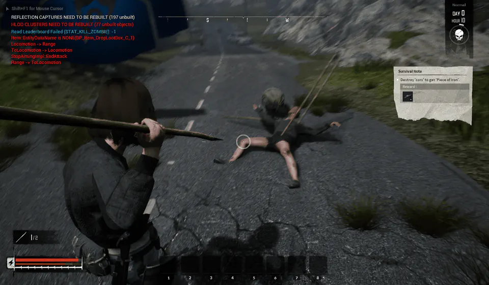

> 이 글은 2021년 5월의 **Unreal Engine 4.26·PhysX** 프로젝트에서 관찰한 문제를 당시 기준으로 옮긴 기록이다. 모든 scale 변경에서 발생하는 일반 법칙이 아니라, 거의 0까지 축소했던 Skeletal Mesh를 복원한 뒤 physics simulation을 켜는 특정 흐름의 해결 사례다.

Zombie가 땅에서 기어 나오는 애니메이션에서 한 frame이 튀는 현상을 가리기 위해, spawn 직후 Actor의 Skeletal Mesh scale을 `0.001`로 줄였다가 약 0.5초 뒤 원래 크기로 복원했다.

그 뒤 사망 처리에서 ragdoll을 활성화하면 physics body가 비정상적으로 충돌하며 시체가 심하게 떨거나 뒤틀렸다.



## 문제의 조건

당시에는 아래 순서로 문제가 재현됐다.

1. Skeletal Mesh scale을 거의 0에 가깝게 줄인다.
2. 잠시 뒤 시각적 scale을 원래 크기로 복원한다.
3. 사망 시 `SetAllBodiesSimulatePhysics(true)`로 ragdoll을 켠다.
4. physics body가 복원된 mesh 크기와 맞지 않는 듯한 충돌이 발생한다.

Scale을 `KINDA_SMALL_NUMBER`, 즉 `0.0001` 부근 이하로 설정하면 warning도 확인됐다.

```text
Scale3D is (nearly) zero
```

이 warning의 정확한 경계에 의존해서 코드를 작성하기보다, physics와 collision이 있는 Component를 거의 0으로 축소하는 흐름 자체를 피하는 편이 안전하다.

## Physics State를 다시 만든다

당시에는 scale을 복원하고 simulation을 시작하기 전에 Skeletal Mesh Component의 physics state를 다시 만들어 문제를 해결했다.

```cpp
USkeletalMeshComponent* Mesh = GetMesh();
if (!Mesh)
{
    return;
}

Mesh->SetRelativeScale3D(OriginalScale);
Mesh->RecreatePhysicsState();
Mesh->SetAllBodiesSimulatePhysics(true);
```

UE 4.27의 `UActorComponent::RecreatePhysicsState()` 구현은 아래와 같았다.

```cpp
void UActorComponent::RecreatePhysicsState()
{
    DestroyPhysicsState();

    if (IsRegistered())
    {
        CreatePhysicsState();
    }
}
```

기존 PhysX state를 제거한 뒤, Component가 등록된 상태라면 현재 Component 설정과 transform을 기준으로 다시 생성하는 구조다. 이 사례에서는 축소된 시점의 body state가 남아 있던 문제를 scale 복원 이후의 상태로 재구성했다.

## 호출 순서

원래 scale로 돌린 **뒤**, physics simulation을 켜기 **전**에 호출해야 한다.

```cpp
void AZombieCharacter::EnableRagdoll()
{
    USkeletalMeshComponent* Mesh = GetMesh();
    if (!Mesh)
    {
        return;
    }

    Mesh->SetRelativeScale3D(OriginalMeshScale);
    Mesh->SetCollisionProfileName(TEXT("Ragdoll"));
    Mesh->RecreatePhysicsState();
    Mesh->SetAllBodiesSimulatePhysics(true);
}
```

**최종 scale과 collision 설정이 반영된 state를 만든 뒤 simulation을 시작해야 한다.**

## 주의할 점

`RecreatePhysicsState()`는 가벼운 transform update가 아니다. body를 파괴하고 다시 만들기 때문에 사용 범위를 좁혀야 한다.

- Tick마다 호출하지 않는다.
- 기존 velocity, constraint와 접촉 상태를 이어 가야 하는 도중에는 사용하지 않는다.
- Component가 등록되지 않았다면 함수는 state를 다시 만들지 않는다.
- multiplayer라면 server와 client 중 어느 쪽에서 physics를 실제로 simulation하는지 구분한다.
- scale 변경만으로 문제가 재현되지 않는다면 무조건 이 함수를 추가하지 않는다.

이 해결책은 이미 어긋난 physics state를 복구하는 방법이다. 원래 문제였던 frame popping은 scale을 거의 0으로 만들기보다 animation pose·visibility·spawn 연출을 조정해 해결하는 편이 근본적이다. 다만 당시 프로젝트처럼 해당 흐름을 즉시 바꾸기 어려운 상황에서는 simulation 직전의 `RecreatePhysicsState()`가 유효한 우회책이었다.

## 참고 자료

- [Epic Games: `UActorComponent::RecreatePhysicsState` — UE 4.27](https://dev.epicgames.com/documentation/en-us/unreal-engine/API/Runtime/Engine/Components/UActorComponent/RecreatePhysicsState?application_version=4.27)
