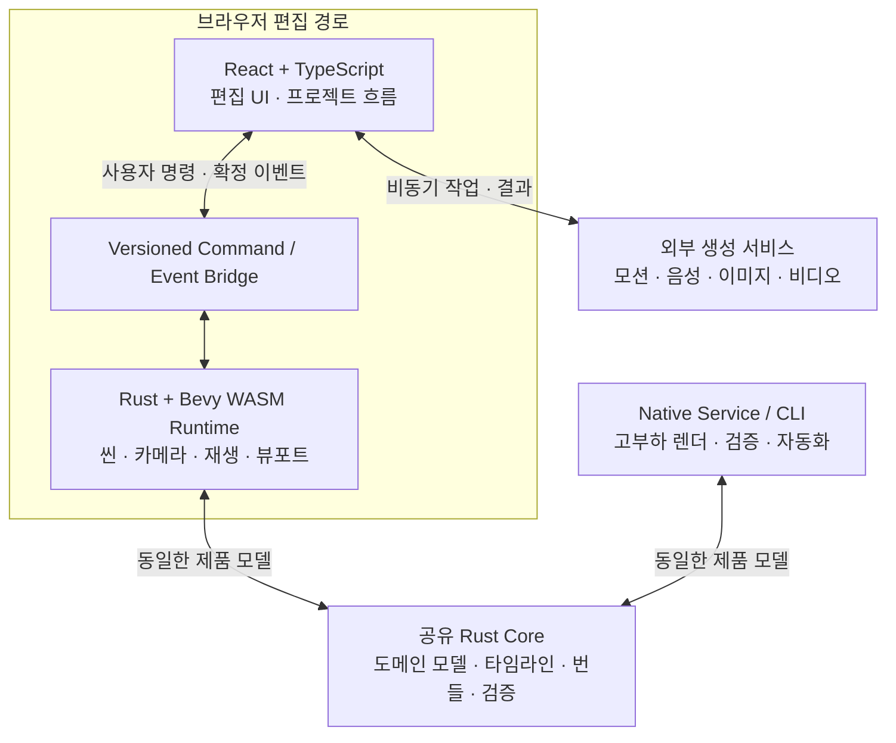

CineV Studio는 Unreal Engine 기반의 시네마틱 편집 도구였다. 높은 수준의 그래픽스와 애니메이션 기능을 활용해 캐릭터, 카메라와 타임라인을 직접 편집할 수 있었지만, 제품이 웹·생성형 AI 중심의 제작 환경으로 확장되면서 기존 구조의 운영 비용과 확장 한계가 커졌다.

Shotloom은 CineV Studio의 핵심 가치였던 **제어 가능한 시네마틱 제작**을 계승하면서 이를 브라우저 기반의 샷 편집 시스템으로 재구성한 프로젝트다. 전환의 목적은 Unreal Engine의 기능을 다른 엔진으로 그대로 옮기는 것이 아니라, 제품이 해결할 문제와 각 계층의 책임을 다시 정의하는 것이었다.

| 항목           | CineV Studio                  | Shotloom                              |
| -------------- | ----------------------------- | ------------------------------------- |
| 제품 역할      | 네이티브 3D 시네마틱 편집기   | 생성 파이프라인을 위한 샷 제어 레이어 |
| 기본 실행 환경 | Unreal Engine·Pixel Streaming | Browser·WASM·WebGPU                   |
| 편집 UI        | 엔진 내부 UI                  | React·TypeScript                      |
| 씬 런타임      | Unreal Engine                 | Rust·Bevy                             |
| 콘텐츠 모델    | 사전 제작 에셋 중심           | 개방형 포맷·생성·점진적 개선          |
| 고부하 작업    | 편집 세션과 같은 엔진 경로    | Native Service·CLI로 분리             |

## 이 글에서 다루는 나의 역할

나는 CineV Studio에서 Action·Prop 데이터 규칙과 Sequencer·MovieScene 기반 편집·재생, 생성 모션 연동과 headless 자동화를 담당했다. 이후 Shotloom 초기 개발에서는 Rust 코어, Bevy 런타임, React·Tauri 편집기 사이의 명령·상태 경계와 외부 AI 서비스 통합을 구현했다.

이 글은 완성된 두 기술 스택을 사후 비교한 기록이 아니다. 두 경로를 직접 개발하면서 어떤 책임이 제품의 핵심이고, 어떤 책임이 엔진과 인프라에 불필요하게 묶여 있었는지를 정리한 기술적 회고다.

## 기존 구조에서 확인한 문제

### 콘텐츠 확장 비용

CineV Studio에서는 스테이지, 캐릭터 리그, 소품과 모션을 높은 완성도로 제작한 뒤 엔진에 통합해야 했다. 콘텐츠 라이브러리를 확장할 때마다 아티스트와 엔진 개발자의 선행 작업이 필요했고, 사용 가능한 콘텐츠의 범위가 제작 인력과 일정에 직접 종속됐다.

생성형 AI 기반 제작에서는 상세 에셋을 모두 준비한 뒤 작업을 시작하는 방식보다, 레이아웃과 샷 구조를 먼저 만들고 필요한 콘텐츠를 이후에 생성·보강하는 방식이 더 적합했다.

### Pixel Streaming 운영 부담

웹 사용자가 CineV Studio를 이용하려면 원격 Windows GPU 인스턴스에서 Unreal Engine을 실행하고 화면을 스트리밍해야 했다. 이에 따라 편집 기능과 직접 관련이 없는 다음 요소가 운영 범위에 포함됐다.

- GPU 인스턴스와 동시 사용자 수 관리
- 스트리밍 세션 생성, 종료와 재접속
- 네트워크 지연과 화면 품질 대응
- 네이티브 워커의 배포와 장애 복구
- 클라우드별 인프라와 비용 관리

사용자의 편집 세션이 서버 GPU 자원과 일대일에 가깝게 연결되는 구조는 제품 확장성과 비용 효율 측면에서 제약이 됐다.

### 웹 기반 생성 서비스와의 결합

CineV의 제작 흐름은 Story-to-Movie(S2M), 모션·음성 생성, 이미지·비디오 생성과 후처리 서비스로 확장됐다. 이들 서비스는 HTTP API, 비동기 작업, 파일 전송과 상태 관리가 중심이다.

네이티브 엔진 애플리케이션 내부에서 이러한 책임까지 소유하면 편집 UI, 씬 런타임과 서비스 오케스트레이션의 경계가 불명확해진다. 서비스 통합과 사용자 흐름은 웹 애플리케이션이 소유하고, 3D 런타임은 장면 평가와 렌더링에 집중할 필요가 있었다.

### 전환 판단을 만든 경험

CineV Studio에서도 headless Commandlet과 Remote Control API를 이용해 S2M 입력으로 프로젝트를 만들고 샷을 편집하는 경로를 자동화할 수 있었다. 비동기 모션 생성 결과를 받아 자체 스켈레톤에 적용하는 흐름도 구축했다.

개별 기능은 구현할 수 있었지만 제작 파이프라인이 확장될 때마다 네이티브 워커, 패키징 설정, 프로젝트 파일과 실행 중인 엔진 상태까지 함께 관리해야 했다. 문제는 Unreal Engine으로 구현할 수 있느냐가 아니라, 새로운 제작 흐름을 추가할 때마다 사용자의 편집 세션이 네이티브 엔진의 실행 문맥을 계속 부담해야 하느냐였다.

이 경험을 겪고 기술 평가 질문을 바꿨다. 최종 렌더링 품질이 필요한 작업과 샷을 구성·수정하는 작업을 같은 실행 환경에서 제공할 필요가 있는가? 기본 편집과 프리뷰는 브라우저가 담당하고, 네이티브 실행 환경은 실제로 고부하 렌더링과 자동화가 필요할 때만 사용하는 편이 제품 구조에 더 적합했다.

### 생성 결과의 제어 가능성

생성 모델은 높은 품질의 결과를 만들 수 있지만 다음 요구를 안정적으로 해결하지는 못한다.

- 특정 카메라 구도와 공간 관계 유지
- 프레임 단위의 포즈와 타이밍 조정
- 장면 상태를 유지한 부분 수정
- 동일한 입력에 대한 반복 가능한 프리뷰

제품의 경쟁력은 자체 최종 렌더러보다 생성 전후에 사용자가 의도를 구조화하고 수정할 수 있는 편집 계층에 있다고 판단했다.

## 기술 선택보다 먼저 정한 기준

| 판단 기준   | 우선한 가치                                                          |
| ----------- | -------------------------------------------------------------------- |
| 사용자 가치 | 최종 렌더링 충실도보다 반복 가능한 제어와 부분 수정                  |
| 실행 환경   | 별도 설치와 상시 서버 GPU 세션 없이 접근 가능한 편집 흐름            |
| 상태 일관성 | Web·Native·CLI가 동일하게 해석하는 버전형 프로젝트 모델              |
| 확장 비용   | 생성 서비스가 추가돼도 편집 UI와 3D 런타임의 책임이 섞이지 않는 구조 |

Rust, Bevy, WASM과 React는 이 기준을 만족시키기 위한 결과였다. 기술을 먼저 정하고 제품을 맞춘 것이 아니라 제품의 제약을 정한 뒤 각 책임에 필요한 기술을 배치했다.

## Shotloom의 제품 범위

Shotloom의 역할을 범용 DCC나 Unreal Engine 대체재가 아닌 **샷 단위의 제어 및 수정 시스템**으로 제한했다.

핵심 책임은 이렇다.

- 캐릭터와 카메라 배치
- 포즈, 모션과 대사 타이밍 구성
- 프레임 기반 타임라인 평가
- 결정론적 재생과 스크러빙
- 편집 가능한 씬 상태의 저장과 복구
- 생성·렌더 파이프라인에 전달할 구조화된 번들 생성

반대로 범용 메시·리깅 저작, Unreal Engine 수준의 최종 렌더링, 구형 브라우저를 포함한 범용 호환성은 기본 범위에서 제외했다. CineV Studio 프로젝트 파일을 직접 호환하는 대신 필요한 에셋을 glTF와 VRM 등 개방형 포맷으로 가져오는 경로를 선택했다.

범위를 이렇게 정하니 렌더링 기능의 폭보다 카메라, 타임라인, 저장과 서비스 연동의 신뢰성에 우선순위를 둘 수 있었다.

## 아키텍처와 책임 경계

React는 타임라인, 인스펙터, 아웃라이너, 에셋 브라우저와 프로젝트 흐름을 담당한다. Bevy는 3D 씬, 카메라, 애니메이션, picking, gizmo와 렌더링을 담당한다.

React가 ECS 상태를 직접 수정하지 않도록 두 계층 사이에는 버전형 명령·이벤트 계약을 뒀다. 사용자의 의도를 명령으로 전달하고, Rust 런타임이 이를 검증·적용한 뒤 확정된 결과를 이벤트로 반환한다.

저장 포맷은 Bevy ECS를 그대로 직렬화하지 않고 제품이 소유하는 버전형 번들로 정의했다. 덕분에 엔진 버전과 사용자 데이터의 수명 주기를 분리했다.

## Rust를 선택한 이유

Rust는 브라우저와 네이티브 실행 경로에서 동일한 도메인·타임라인 코어를 공유하기 위해 선택했다.

- WASM과 Native를 지원하는 단일 코드베이스
- 장면과 타임라인 평가 결과의 차이 최소화
- 타입·메모리 안전성과 명시적 오류 처리
- 크레이트 의존성으로 강제되는 아키텍처 경계
- 서비스, CLI와 테스트 하네스에서 동일한 제품 모델 재사용

브라우저 프리뷰와 네이티브 렌더러가 서로 다른 구현을 사용하면 같은 번들을 다르게 해석하거나 프레임 평가가 달라질 가능성이 커진다. Rust 코어를 공유해 이 차이를 줄였다.

Rust의 학습 곡선과 컴파일 비용을 고려해 UI까지 Rust로 구현하지 않고 런타임과 제품 코어에 적용 범위를 제한했다.

## Bevy를 선택한 이유

Bevy는 Rust 기반 3D 런타임에 필요한 ECS, wgpu 렌더링, glTF 로딩, 애니메이션, 카메라와 picking 기반을 제공한다.

Raw wgpu와 자체 ECS를 구축하는 방식은 제어력은 높지만 제품 차별성과 무관한 기반 구현 비용이 크다. Bevy를 사용해 런타임 기반을 재사용하고 샷 편집, 타임라인, 번들과 서비스 경계에 개발 역량을 집중했다.

Bevy가 1.0 이전이라는 위험은 다음 방식으로 제한했다.

- 도메인 모델에서 Bevy 의존성 제거
- 엔진 특화 코드의 별도 크레이트 격리
- 제품 번들과 raw ECS 상태 분리
- React와 ECS 사이의 직접 결합 차단

## WASM과 WebGPU를 선택한 이유

WASM으로 Rust 런타임을 브라우저에서 직접 실행한다. 장면과 타임라인 로직을 JavaScript로 별도 구현하지 않고 Web과 Native가 동일한 제품 코어를 사용한다.

WebGPU는 사용자 기기의 GPU에서 브라우저 3D 프리뷰를 실행하기 위해 선택했다. wgpu는 WebGPU와 Native의 Vulkan, Metal, D3D 계열 백엔드를 같은 렌더링 기반으로 연결한다.

초기 범위에서는 WebGL2 이중 지원보다 WebGPU 경로의 안정화에 집중했다. 최신 브라우저, HTTPS, WASM 로딩 크기와 브라우저 메모리 한계는 명시적인 제약으로 수용했다.

브라우저가 모든 작업을 담당하도록 하지는 않았다. 브라우저는 편집과 프리뷰를 담당하고, 대규모 렌더링이나 자동화처럼 고부하·장시간 실행이 필요한 작업은 네이티브 서비스와 CLI가 담당한다.

## React와 TypeScript를 선택한 이유

Shotloom의 비뷰포트 UI는 게임 HUD보다 생산성 편집 애플리케이션에 가깝다. 타임라인, 인스펙터, 검색, 에셋 브라우저와 프로젝트 흐름은 React 생태계와 DOM 기반 테스트를 활용하는 편이 효율적이었다.

React는 사용자 입력과 화면 구성을, Bevy는 3D 런타임 상태를 소유하도록 분리했다. 새로운 상호작용을 추가할 때마다 브리지 계약을 함께 관리해야 하는 비용이 생기지만, UI와 엔진을 독립적으로 발전시키고 상태의 최종 소유자를 명확히 할 수 있었다.

## AI 에이전트 코딩의 발전으로 더 적합해진 스택

AI 에이전트 활용은 Shotloom의 기술 스택을 처음 선택한 이유는 아니었다. 그러나 프로젝트를 시작하고 실제 기능을 구현하는 동안 에이전트가 코드를 탐색하고, 여러 파일에 걸친 변경을 계획하며, 빌드와 테스트 결과를 바탕으로 스스로 수정하는 능력은 빠르게 발전했다. 그 변화 속에서 Rust·Bevy·React·TypeScript로 구성한 스택은 처음 예상했던 것보다 에이전트 주도 개발에 훨씬 더 적합한 선택이 됐다.

그 적합성은 특정 언어나 프레임워크의 유행보다 에이전트가 **문맥을 읽고, 변경하고, 결과를 검증하는 전체 루프**에서 나왔다.

| 에이전트 개발에 필요한 조건  | Shotloom에서 제공한 근거                                                                            | 실제 이점                                                                                              |
| ---------------------------- | --------------------------------------------------------------------------------------------------- | ------------------------------------------------------------------------------------------------------ |
| 저장소에서 읽을 수 있는 문맥 | Rust·TypeScript 소스, JSON 스키마, OpenAPI 계약, ADR과 명세를 텍스트로 관리                         | 검색만으로 데이터 구조, 설계 의도와 영향 범위를 함께 파악할 수 있다.                                   |
| 빠르고 구체적인 실패 피드백  | `cargo check`·테스트·Clippy, TypeScript 타입 검사, Biome·Vitest, WASM 빌드와 브라우저 스모크 테스트 | 잘못된 타입, 누락된 분기, 계약 불일치와 브라우저 통합 실패를 파일·명령 단위로 확인하고 수정할 수 있다. |
| 기계적으로 강제되는 경계     | Cargo 크레이트, Rust 타입, 버전형 command/event DTO, 제품 소유 번들과 외부 서비스 스키마            | 변경이 경계를 벗어나면 컴파일이나 계약 검증에서 드러나므로 넓은 수정의 누락을 줄일 수 있다.            |
| 비대화형 실행 경로           | 빌드, 번들 검증, 변환, 렌더 자동화를 CLI와 스크립트로 제공                                          | GUI 조작에 의존하지 않고 로컬과 CI에서 같은 절차를 반복할 수 있다.                                     |
| 중복이 적은 기준 구현        | Web·Native·CLI가 같은 Rust 코어와 프로젝트 모델을 공유                                              | 브라우저와 네이티브 구현을 따로 수정하며 의미가 어긋날 가능성과 에이전트가 읽어야 할 문맥을 줄인다.    |
| 작게 나눌 수 있는 책임       | React UI, command/event 브리지, Rust 코어, Bevy 런타임과 서비스 어댑터를 분리                       | 하나의 작업을 제한된 계층과 검증 명령에 연결해 계획하고 리뷰하기 쉽다.                                 |

Rust의 장점은 단순히 안전한 코드를 생성해 준다는 데 있지 않았다. 에이전트가 여러 타입과 호출부를 함께 바꿀 때 컴파일러가 빠뜨린 경로를 구체적으로 열거하고, exhaustive match와 명시적인 오류 타입이 미완성 변경을 드러냈다. React·TypeScript 계층에서도 DOM 기반 단위 테스트와 타입 검사가 UI 변경을 3D 런타임 실행 전부터 검증했다. command/event 브리지와 제품 번들은 두 언어 사이에서 무엇을 주고받는지 명시해, 에이전트가 한쪽의 내부 상태를 추측해 직접 수정하지 않도록 제한했다.

CineV Studio에서도 Commandlet과 자동화 테스트를 만들 수 있었고 AI 에이전트가 Unreal C++ 코드를 다루는 것 자체가 불가능한 것은 아니었다. 차이는 자동화의 기본 단위였다. Unreal 경로에서는 일부 중요한 문맥이 실행 중인 에디터, 패키징 설정과 바이너리 에셋에 남고 검증에 엔진 프로세스가 필요한 경우가 많았다. Shotloom에서는 제품 모델과 계약을 텍스트로 읽을 수 있고 대부분의 검증을 컴파일러, 테스트, CLI와 브라우저 자동화에서 재현할 수 있었다. 자동화를 별도로 덧붙이지 않아도 저장소의 기본 개발 경로가 곧 에이전트가 사용할 수 있는 경로였다.

물론 이 스택이 자동으로 에이전트 친화적인 것은 아니다. Bevy의 빠른 API 변화와 Rust의 컴파일 시간은 여전히 비용이고, ECS 실행 순서나 시각적 품질처럼 타입 검사만으로 확인할 수 없는 문제도 남는다. 제품 범위, 데이터 소유권, 계층 간 계약과 최종 리뷰는 사람이 책임져야 한다. 그럼에도 코드와 명세에 문맥이 드러나고 검증 루프를 비대화형으로 실행할 수 있다는 특성 덕분에, Shotloom의 기술 전환은 웹 배포와 런타임 비용뿐 아니라 급속히 발전한 AI 에이전트의 구현 능력을 활용하는 데도 적합한 기반이 됐다.

## 트레이드오프

| 결정                    | 이점                                | 비용                        | 대응                              |
| ----------------------- | ----------------------------------- | --------------------------- | --------------------------------- |
| 웹 우선 편집            | 설치 장벽과 서버 GPU 세션 의존 제거 | 브라우저·GPU 호환성 편차    | 지원 환경 제한, Native 경로 유지  |
| Rust 코어               | Web·Native 공유와 강한 검증         | 학습·컴파일 비용            | UI는 React·TypeScript 유지        |
| Bevy                    | 3D 런타임 기반 재사용               | pre-1.0 API 변경            | 엔진 격리, 제품 모델 독립         |
| WASM                    | 동일한 Rust 코어의 브라우저 실행    | 바이너리 크기와 메모리 상한 | 프리뷰 중심, 고부하 작업 분리     |
| WebGPU                  | 현대 GPU와 Native 렌더 구조 정렬    | 최신 브라우저·HTTPS 요구    | 범용 호환을 초기 범위에서 제외    |
| UI·엔진 분리            | 독립적인 개발과 명확한 상태 소유권  | 브리지 계약 관리            | 좁고 버전형인 DTO 유지            |
| 낮은 프리뷰 충실도 수용 | 제어 기능과 반복 속도에 집중        | Unreal 대비 시각 품질 감소  | 최종 품질은 생성·후처리 단계 담당 |

이 아키텍처는 모든 지표를 개선하려는 선택이 아니다. 최종 렌더링 충실도와 범용 브라우저 지원을 일부 포기하고 웹 접근성, 부분 수정, 결정론과 서비스 통합을 우선했다.

## 전환과 검증

기존 Unreal 경로를 먼저 제거하지 않고 대체 경로를 단계적으로 검증했다.

1. **브라우저 골든 패스 검증**
   캐릭터 배치, 모션 연결, 타임라인 스크럽과 카메라 프리뷰를 브라우저에서 구현했다.

2. **제품 계약 안정화**
   번들, 저장·복구, 브리지, 에셋과 렌더링 경계를 독립적인 계약으로 정리했다.

3. **Native·Service 실행 경로 검증**
   같은 제품 코어를 사용해 번들을 검증하고 카메라 결과물을 생성하는 자동화 경로를 구성했다.

4. **CineV 연동 경계 분리**
   사용자 제작 흐름과 Shotloom 실행 책임을 분리하고 파일·작업 단위로 입력과 결과를 전달하도록 구성했다.

5. **레거시 신규 진입 차단**
   대체 경로가 동작한 뒤 신규 Unreal·Pixel Streaming 요청을 차단했다. 기존 사용자 데이터와 역사적 작업을 위한 호환 경로는 별도로 보존했다.

이 순서로 레거시 제거 자체를 목표로 삼지 않고 실제로 사용할 수 있는 대체 흐름부터 확보했다.

## 결과

- 별도 설치나 Pixel Streaming 세션 없이 브라우저에서 캐릭터, 모션, 타임라인과 카메라를 편집하는 기본 경로를 확보했다.
- `.shotloom` 번들을 단일 기준으로 두고 Web·Native·CLI가 같은 Rust 모델과 변환 규칙을 사용하도록 구성했다.
- 비동기 편집 명령이 거절되거나 시간 초과·취소돼도 UI와 ECS 상태가 어긋나지 않도록 버전형 command/event 계약과 트랜잭션 복구 경계를 마련했다.
- 프레임률 기반 타임라인과 카메라 키·보간 규칙을 제품 모델에 두어 브라우저 프리뷰와 네이티브 실행 경로가 같은 장면 상태를 평가하도록 했다.
- 외부 생성 결과를 검증한 뒤 동일한 번들 revision에 원자적으로 적용해 편집·렌더·아카이브가 같은 입력을 사용하도록 했다.
- 고부하 렌더링과 자동화를 브라우저 편집 세션에서 분리하고, 신규 Unreal·Pixel Streaming 경로를 단계적으로 종료할 근거를 확보했다.

운영 관점의 변화는 단순한 비용 절감 주장보다 자원의 사용 위치가 달라졌다는 데 있다. 이전에는 기본 편집에도 GPU 인스턴스와 스트리밍 세션이 필요했지만, 전환 후에는 사용자 기기가 편집과 프리뷰를 담당하고 네이티브 자원을 실제 렌더링과 자동화 작업에 집중할 수 있게 됐다.

## 이 전환에서 배운 점

가장 큰 결정은 Unreal Engine 대신 Bevy를 선택한 것이 아니었다. Shotloom이 최종 렌더러일 필요가 없다고 정의한 것이었다. 이 범위를 제외하고 나서야 편집 UI, 장면 런타임, 프로젝트 데이터와 생성 서비스의 책임을 각각 분리할 수 있었다.

Unreal Engine은 성숙도와 렌더링 기능에서 Bevy보다 강력하다. 그러나 목표가 서버에서 실행되는 고품질 네이티브 편집기에서 브라우저 기반의 샷 제어 시스템으로 바뀌면 기술 평가 기준도 달라진다.

두 경로를 개발하면서 네 가지를 배웠다. 엔진의 기능표보다 제품이 사용자에게 제공할 핵심 가치를 먼저 정의해야 한다. 엔진 내부 상태보다 오래 살아야 하는 데이터와 계약은 제품이 직접 소유해야 한다. 레거시 전환은 기존 경로를 제거하는 일보다 좁은 골든 패스를 대체 환경에서 끝까지 검증하는 일에서 시작해야 한다. 코드와 상태의 경계를 명시하고 자동으로 검증할 수 있는 구조는 사람뿐 아니라 빠르게 발전하는 AI 에이전트와 협업할 때도 장기적인 개발 자산이 된다.

Shotloom은 CineV Studio가 증명한 제어의 가치를 유지하되, 그 가치를 Unreal Engine의 실행 문맥과 분리했다. 그 결과 생성형 AI와 웹 중심의 제작 환경에서 반복 가능한 샷 제어를 제공하는 구조로 제품을 재구성할 수 있었다.
