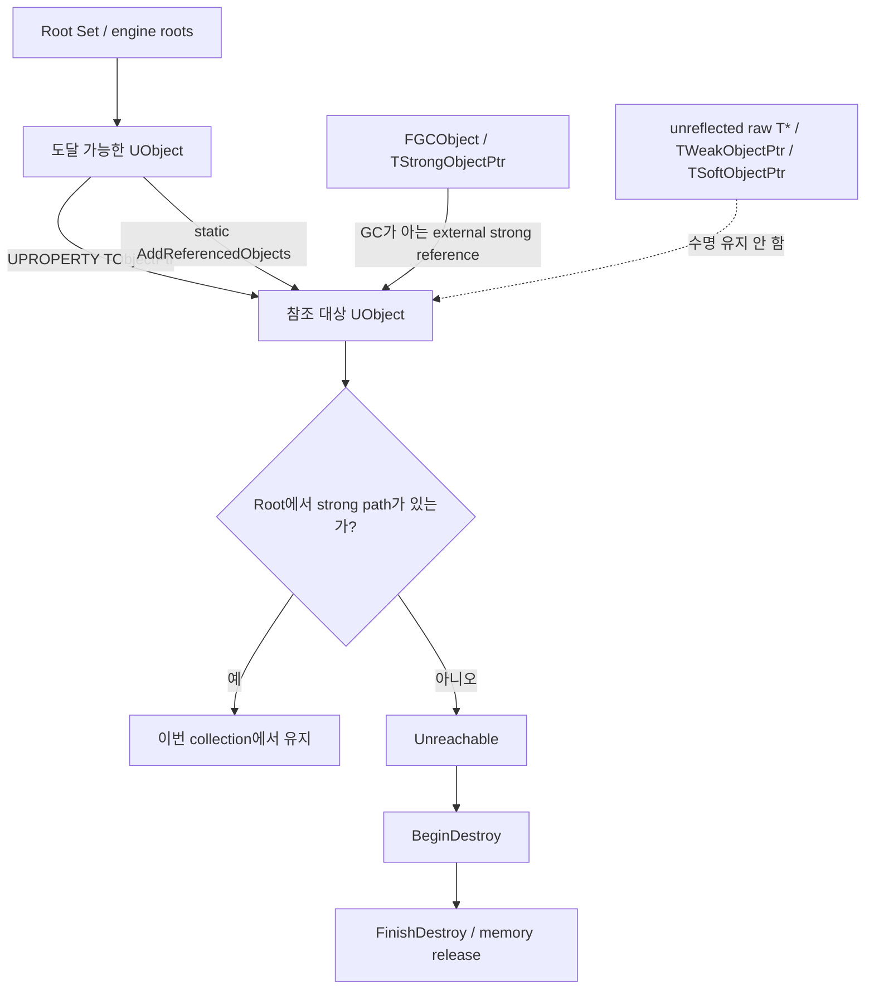

Unreal Engine의 UObject garbage collection을 이해하는 핵심은 “pointer가 몇 개인가”가 아니라 **Root Set에서 GC가 아는 strong reference를 따라 대상에 도달할 수 있는가**이다. `Outer`, C++ smart pointer, 파괴 요청, 강제 GC의 역할을 이 참조 그래프와 구분해야 한다.

## C++ 수명 관리와 UObject GC는 함께 존재한다

ISO C++에는 UObject 같은 tracing GC가 기본 제공되지 않는다. 대신 stack object, RAII, value type, `std::unique_ptr` 같은 deterministic ownership을 중심으로 설계한다. Unreal project도 이 원칙을 버리지 않는다.

| 대상                          | 수명 관리                            | 비고                                                                                 |
| ----------------------------- | ------------------------------------ | ------------------------------------------------------------------------------------ |
| `UObject`와 파생 class        | Unreal reachability GC               | `AActor`, `UActorComponent`, asset도 UObject 계열                                    |
| plain C++ class               | RAII, value, unique/shared ownership | UObject smart pointer를 섞지 않음                                                    |
| `UStruct` value 자체          | owner의 C++/UObject lifetime         | Enclosing field까지 reflected되거나 명시적으로 report될 때 내부 UObject field를 순회 |
| stack local과 container value | C++ scope/owner                      | UObject GC가 value의 destructor를 대신하지 않음                                      |

`U`나 `A` prefix는 Unreal naming convention이다. prefix 자체가 GC 대상을 만드는 것이 아니라 실제 `UObject` inheritance와 reflection 정보가 중요하다.

## Reference graph와 collection lifecycle

GC는 root와 engine-known reference에서 시작해 strong edge를 추적한다. 도달한 object는 이번 collection에서 유지되고, 도달하지 못한 object는 unreachable이 되어 destruction lifecycle로 들어간다.



Reference count와 달리 서로를 가리키는 cycle도 root에서 끊겨 있으면 함께 수거할 수 있다. 반대로 아무 gameplay 가치가 없어도 root나 long-lived owner에서 strong path가 하나 남아 있으면 계속 유지된다. GC가 memory leak을 “항상 막아 준다”는 표현보다 **unintended retention도 graph 문제**라고 이해하는 편이 정확하다.

일반 collection은 reachability를 계산하는 동안 UObject processing/gameplay를 일시 중단할 수 있지만, mark work 자체는 `gc.AllowParallelGC`로 collector worker에 나눌 수 있다. Parallel GC와 여러 frame에 걸쳐 mark하는 incremental reachability는 서로 다른 기능이다.

## UObject를 올바르게 생성하기

UObject는 `new`/`delete`로 생성·해제하지 않는다.

| 상황                                      | API                                           |
| ----------------------------------------- | --------------------------------------------- |
| UObject constructor에서 default subobject | `CreateDefaultSubobject<T>()`                 |
| Runtime의 일반 UObject                    | `NewObject<T>()`                              |
| Runtime Actor                             | `UWorld::SpawnActor<T>()` 또는 deferred spawn |
| 기존 object 복제                          | `DuplicateObject<T>()`                        |

`CreateDefaultSubobject`는 constructor-only API다. Runtime에 임의 UObject를 만드는 `NewObject`의 대체가 아니다.

### `Outer`와 lifetime owner를 구분한다

`NewObject<T>(Outer)`의 `Outer`는 object name path, containment, serialization context에 중요하다. 그러나 Outer가 임의 child를 자동으로 strong-reference하는 일반 lifetime-owner 계약은 아니다.

```cpp
// GcOwner.h
#pragma once

#include "UObject/Object.h"
#include "UObject/ObjectPtr.h"
#include "UObject/UObjectGlobals.h"
#include "GcOwner.generated.h"

UCLASS()
class MYGAME_API UGcChild final : public UObject
{
    GENERATED_BODY()
};

UCLASS()
class MYGAME_API UGcOwner final : public UObject
{
    GENERATED_BODY()

public:
    void CreateChild()
    {
        Child = NewObject<UGcChild>(this);
    }

    void ReleaseChild()
    {
        Child = nullptr;
    }

private:
    UPROPERTY(Transient)
    TObjectPtr<UGcChild> Child;
};
```

`this`를 Outer로 정하는 것과 `Child`를 살리는 strong edge는 별개다. 위에서는 도달 가능한 owner의 reflected `Child` property가 target을 유지한다. `Child = nullptr` 뒤 다른 strong path가 없다면 target은 다음 collection에서 수거 대상이 될 수 있다.

## UObject pointer 결정표

Persistent reference와 function-local view를 같은 type으로 강제하지 않는다.

| 의도                               | 선택                           | Keepalive | 주의                                          |
| ---------------------------------- | ------------------------------ | --------- | --------------------------------------------- |
| parameter, return, 짧은 local      | raw `T*`                       | 없음      | lifetime invariant가 scope 안에서 명확해야 함 |
| reflected persistent strong field  | `UPROPERTY() TObjectPtr<T>`    | 있음      | owner도 reachable이어야 함                    |
| 장기 non-owning cache              | `TWeakObjectPtr<T>`            | 없음      | 매 사용 전에 `Get`/`IsValid`                  |
| path 기반 on-demand asset          | `TSoftObjectPtr<T>`            | 없음      | load 완료 뒤 별도 strong ownership 필요       |
| non-UObject owner나 짧은 pin       | `TStrongObjectPtr<T>`          | 있음      | 항상 strong, hidden retention과 cycle 주의    |
| UObject의 special unreflected edge | static `AddReferencedObjects`  | 조건부    | owner가 reachable할 때 outgoing edge를 report |
| non-UObject native owner           | `FGCObject`                    | 있음      | global registration과 주소 안정성 필요        |
| 정말 전역인 manual root            | `AddToRoot` / `RemoveFromRoot` | 있음      | remove 누락은 사실상 permanent retention      |

Persistent reflected field를 왜 `TObjectPtr`로 쓰는지는 [`TObjectPtr` 글](/posts/tobjectptr-in-unreal-engine/)에서 UFUNCTION, container, serialization과 함께 설명했다.

### Bare `TObjectPtr`는 자동 strong reference가 아니다

`TObjectPtr` wrapper만 member로 선언해서는 GC가 자동으로 찾지 못한다. 도달 가능한 `UCLASS`/`USTRUCT`의 `UPROPERTY` graph에 있거나, custom reference collector가 명시적으로 report해야 한다. Container도 element뿐 아니라 container member 자체가 reflected되어야 한다.

```cpp
UPROPERTY()
TObjectPtr<UObject> Current;

UPROPERTY()
TArray<TObjectPtr<UObject>> History;
```

UE 5.4부터 experimental incremental reachability는 `TObjectPtr` assignment write barrier를 사용한다. 그래서 incremental mode에서는 non-editor build라고 wrapper가 raw pointer와 완전히 같은 assignment cost와 type property를 가진다고 단정할 수 없다.

## Weak, soft, strong pointer의 역할

### `TWeakObjectPtr`

Weak pointer는 target을 살리지 않는다. Target이 수거되거나 destruction 상태가 되면 `Get()`이 null을 반환할 수 있으므로 사용할 때마다 확인한다.

Game thread의 짧은 use라면 다음처럼 쓴다.

```cpp
if (UObject* Object = WeakObject.Get())
{
    UseObject(Object);
}
```

UE 5.5+에서 lifetime을 잠시 고정해야 한다면 `Pin()`으로 strong guard를 얻을 수 있다.

```cpp
#include "UObject/StrongObjectPtrTemplates.h"
#include "UObject/WeakObjectPtrTemplates.h"

if (TStrongObjectPtr<UObject> Pinned = WeakObject.Pin())
{
    // Pinned가 살아 있는 동안 GC lifetime은 유지된다.
    // UObject API 자체의 thread safety는 별도 계약이다.
    UseObject(Pinned.Get());
}
```

`Pin`이 object method를 worker-thread-safe하게 만들지는 않는다.

### `TSoftObjectPtr`

Soft pointer는 asset path와 weak semantics를 제공한다. Sync/async load 시점을 선택할 수 있지만 load가 끝난 object를 계속 살려 두지는 않는다. `FStreamableManager`가 completion callback까지 hard reference를 잡더라도, 이후에는 도달 가능한 `UPROPERTY() TObjectPtr<T>`나 명시적으로 관리되는 handle에 넘겨야 한다.

### `TStrongObjectPtr`

`TStrongObjectPtr`는 UPROPERTY 없이 GC가 아는 strong reference를 만들 수 있다. 비-UObject owner나 짧은 pin에는 유용하지만 persistent reflected member의 기본 선택은 아니다.

- 생성·해제와 reference tracking 비용이 있다.
- GC graph/debugging에서 source가 일반 UPROPERTY보다 덜 명확할 수 있다.
- UObject가 자기 자신이나 서로를 strong pointer로 잡는 cycle은 wrapper destructor에 도달하지 못해 영구 retention이 될 수 있다.
- `TStrongObjectPtr`는 `UPROPERTY` type이 아니다.

## Native owner에서 reference를 report하기

### Non-UObject owner는 `FGCObject`

```cpp
#include "UObject/GCObject.h"
#include "UObject/Object.h"
#include "UObject/ObjectPtr.h"
#include "UObject/UObjectGlobals.h"

class FNativeOwner final : public FGCObject
{
public:
    void SetObject(UObject* InObject)
    {
        Object = InObject;
    }

    void AddReferencedObjects(FReferenceCollector& Collector) override
    {
        Collector.AddReferencedObject(Object);
    }

    FString GetReferencerName() const override
    {
        return TEXT("FNativeOwner");
    }

private:
    TObjectPtr<UObject> Object;
};
```

`FGCObject`는 non-UObject native owner용이다. UObject와 동시에 derive하거나, 주소가 이동할 수 있는 `TArray<FNativeOwner>` 같은 value container에 넣지 않는다. 필요하면 `TUniquePtr<FNativeOwner>`로 native wrapper의 주소를 안정적으로 소유한다. 이 `TUniquePtr`는 UObject가 아니라 wrapper의 C++ lifetime을 관리한다.

### UObject의 특별한 unreflected edge는 static collector

일반 field는 UPROPERTY가 가장 읽기 쉽다. Engine-level special case에서만 UObject의 static `AddReferencedObjects`를 사용한다. 이 함수는 owner를 독립적으로 root에 올리지 않는다. Owner가 이미 reachable해서 collector가 방문할 때, owner에서 나가는 추가 edge를 report한다.

```cpp
// ManualReferenceOwner.h
#pragma once

#include "UObject/Object.h"
#include "UObject/ObjectPtr.h"
#include "ManualReferenceOwner.generated.h"

UCLASS()
class MYGAME_API UManualReferenceOwner final : public UObject
{
    GENERATED_BODY()

public:
    static void AddReferencedObjects(
        UObject* InThis,
        FReferenceCollector& Collector);

    void SetReference(UObject* InObject)
    {
        NativeReference = InObject;
    }

private:
    TObjectPtr<UObject> NativeReference; // intentionally unreflected
};
```

```cpp
// ManualReferenceOwner.cpp
#include "ManualReferenceOwner.h"

#include "UObject/UObjectGlobals.h"

void UManualReferenceOwner::AddReferencedObjects(
    UObject* InThis,
    FReferenceCollector& Collector)
{
    UManualReferenceOwner* This =
        CastChecked<UManualReferenceOwner>(InThis);

    Collector.AddReferencedObject(This->NativeReference, This);
    Super::AddReferencedObjects(InThis, Collector);
}
```

Reference 누락은 조기 수거를, `Super` 누락은 base-class reference 파손을 만든다. Incremental reachability write barrier 때문에 manually reported storage도 `TObjectPtr`를 사용한다.

## 파괴를 요청하는 API와 GC destruction을 구분한다

일반 UObject를 더 이상 쓰지 않는다면 strong reference를 해제하고 GC에 맡긴다. `ConditionalBeginDestroy()`를 gameplay destruction이나 “GC 힌트”로 직접 호출하지 않는다. 이 함수는 GC가 이미 파괴하기로 결정한 object의 destruction lifecycle을 진행하는 내부 경계다.

| 대상              | 정상적인 외부 요청    | 실제 memory release                         |
| ----------------- | --------------------- | ------------------------------------------- |
| 일반 `UObject`    | strong reference 해제 | 이후 GC lifecycle                           |
| `AActor`          | `Destroy()`           | end-of-tick 처리 후 GC 가능 상태, 이후 GC   |
| `UActorComponent` | `DestroyComponent()`  | unregister/cleanup 뒤 GC 가능 상태, 이후 GC |

`AActor::Destroy()`는 latent이며 보통 tick 끝에 처리된다. Gameplay 연결 해제는 `EndPlay`, native resource release는 `BeginDestroy`/`FinishDestroy` override의 contract에 맞춘다. 모든 override에서 필요한 `Super` 호출을 보존한다.

Null test와 UObject validity도 구분한다.

```cpp
if (IsValid(Object))
{
    UseObject(Object);
}
```

`IsValid`는 null과 garbage/pending-destruction 상태를 함께 확인할 때 유용하다. 그러나 이미 수명이 끝난 untracked raw address를 safe handle로 바꾸지는 않는다. Long-lived non-owning field에는 `TWeakObjectPtr`를 사용해야 한다.

## GC cluster는 root가 아니다

Cluster는 여러 object를 reachability unit으로 묶어 per-object scanning 비용을 줄이는 고급 최적화다. Cluster root가 global Root Set이라는 뜻은 아니다.

- Cluster root 자격은 `CanBeClusterRoot`, member 자격은 `CanBeInCluster`, 실제 구성은 `CreateCluster`와 project setting에 달려 있다.
- Cluster member 하나가 외부 strong reference로 reachable하면 cluster 전체가 유지될 수 있다.
- 큰 cluster나 merged cluster는 over-retention과 일괄 unhash/destruction hitch를 만들 수 있다.
- “같은 level”이나 “subobject”라는 사실만으로 무조건 자동 cluster가 된다고 가정하지 않는다.

먼저 Unreal Insights와 GC analytics로 root traversal, cluster, destruction 비용을 측정하고, 실제 object graph와 lifetime이 함께 움직이는 대상을 묶는다.

### `DisregardForGC`는 gameplay opt-in이 아니다

Disregard pool은 초기 load 단계의 engine/bootstrap object를 cooked-build permanent pool로 다루는 최적화다. `CloseDisregardForGC()` 뒤 생성되는 일반 gameplay object를 “평생 쓰는 Blueprint”라는 이유로 임의 등록하는 일상적인 수명 관리 API가 아니다.

일반적인 게임플레이 코드에서는 root, UPROPERTY, weak/soft reference를 기준으로 객체 수명을 먼저 설계하고, `MaxObjectsNotConsideredByGC` 같은 permanent-pool 설정은 엔진 시작 단계의 메모리 검사가 필요한 고급 조정으로 분리한다.

## Parallel, incremental, destruction 설정을 분리한다

이 설정들은 모두 pause와 관련 있어 보이지만 서로 다른 단계를 제어한다.

| Setting                              | 나누는 작업                                                      |
| ------------------------------------ | ---------------------------------------------------------------- |
| `gc.AllowParallelGC`                 | 한 collection의 reachability work를 여러 collector thread로 분할 |
| `gc.AllowIncrementalReachability`    | mark/reachability를 여러 frame으로 분할                          |
| `gc.AllowIncrementalGather`          | unreachable object gather를 여러 frame으로 분할                  |
| `gc.IncrementalBeginDestroyEnabled`  | `BeginDestroy` processing을 time slice                           |
| `gc.MultithreadedDestructionEnabled` | 지원되는 object memory free를 worker thread에서 실행             |

하나를 켰다고 나머지가 자동으로 켜지거나 thread-safe해지는 것은 아니다.

## 점진적 도달 가능성 분석은 Experimental 기능이다

UE 5.4는 incremental reachability와 incremental gather를 Experimental로 도입했다. mark와 unreachable object gather를 여러 frame으로 나눠 긴 pause를 줄이는 대신, write barrier와 target별 검증이 필요하다.

공식 예제는 아래처럼 설정한다.

```ini
[ConsoleVariables]
gc.AllowIncrementalReachability=1
gc.AllowIncrementalGather=1
gc.IncrementalReachabilityTimeLimit=0.002
```

`0.002`는 2 ms의 예시 budget일 뿐 보편적인 권장값이나 보장된 hard limit가 아니다. 실제 frame 비용을 측정해 project와 target에 맞게 조정한다.

활성화하려면 아래 조건부터 만족해야 한다.

1. GC-exposed `UPROPERTY` raw UObject pointer를 `TObjectPtr`로 전환한다.
2. UObject static `AddReferencedObjects`와 `FGCObject` storage도 `TObjectPtr`로 바꾼다.
3. Async/task code의 object lifetime과 API thread safety를 별도로 검사한다.
4. PIE뿐 아니라 target server/client build에서 stress test한다.
5. GC verification과 reference tracking으로 barrier 누락을 찾는다.

## Manual GC는 마지막 수단이다

Automatic GC를 기본으로 둔다.

- `gc.CollectGarbageEveryFrame N`은 매 N frame마다 collection/full-purge request를 넣는 debug stress command다. Production optimization이 아니다.
- `GEngine->ForceGarbageCollection(true)`는 그 line에서 즉시 memory를 비우지 않는다. 다음 가능한 시점에 full purge를 요청한다.
- `CollectGarbage(...)` 직접 호출은 다른 thread의 UObject lock을 기다리고 큰 hitch를 만들 수 있다.

Manual collection이 정당한 경우는 loading screen처럼 hitch를 숨길 수 있거나, 측정 결과 page swapping/OOM 위험 직전에 collection하는 편이 낫다는 증거가 있을 때다. Routine gameplay tick에서 강제하지 않는다.

성능 개선 순서는 다음이 안전하다.

1. Unreal Insights와 `gc.DumpAnalyticsToLog`로 mark, gather, purge, cluster 비용을 구분한다.
2. 불필요한 persistent strong edge와 root를 제거한다.
3. 짧게 쏟아지는 transient UObject 생성 churn을 줄이거나 적절히 pool한다.
4. UObject가 제공하는 reflection, serialization, replication, editor 기능이 필요 없는 data만 value/plain C++ type으로 옮긴다.
5. Cluster와 incremental setting은 target별 측정 뒤 적용한다.

“Blueprint macro가 function보다 runtime UObject를 항상 더 많이 만든다”거나 “C++로 옮기면 GC object가 자동으로 줄어든다”는 식의 일반화는 editor graph node와 cooked runtime object를 혼동한다. 실제 runtime allocation을 profile한다.

## 최종 점검표

- 대상이 UObject인지 plain C++ value인지 먼저 구분했는가?
- Root에서 target까지 의도한 strong path를 그릴 수 있는가?
- Persistent strong field는 `UPROPERTY() TObjectPtr<T>`인가?
- `Outer`를 owner-to-child keepalive로 오해하지 않는가?
- Long-lived non-owning field는 `TWeakObjectPtr`인가?
- Soft load 완료 뒤 필요한 strong ownership을 넘겼는가?
- `TStrongObjectPtr`의 hidden retention과 cycle을 검토했는가?
- Custom `AddReferencedObjects`가 모든 edge와 `Super`를 처리하는가?
- 일반 UObject에 `ConditionalBeginDestroy()`를 직접 호출하지 않는가?
- Actor와 Component는 각각 public `Destroy` API를 쓰는가?
- Cluster를 root나 자동 subobject group으로 오해하지 않는가?
- Disregard pool을 gameplay opt-in으로 사용하지 않는가?
- Parallel mark, incremental mark, BeginDestroy slicing, memory free를 구분했는가?
- Incremental mode 전 모든 GC-reported pointer를 `TObjectPtr`로 전환했는가?
- Forced GC는 측정된 loading/memory boundary에만 있는가?

## 참고 자료

- [Epic Games: Object Pointers](https://dev.epicgames.com/documentation/en-us/unreal-engine/object-pointers-in-unreal-engine)
- [Epic Games: Incremental Garbage Collection](https://dev.epicgames.com/documentation/en-us/unreal-engine/incremental-garbage-collection-in-unreal-engine)
- [Epic Games: Unreal Object Handling](https://dev.epicgames.com/documentation/en-us/unreal-engine/unreal-object-handling-in-unreal-engine)
- [Epic Games: Objects](https://dev.epicgames.com/documentation/en-us/unreal-engine/objects-in-unreal-engine)
- [Epic Games: Creating Objects](https://dev.epicgames.com/documentation/en-us/unreal-engine/creating-objects-in-unreal-engine)
- [Epic Games: Garbage Collection Settings](https://dev.epicgames.com/documentation/en-us/unreal-engine/garbage-collection-settings-in-the-unreal-engine-project-settings)
- [Epic Games: Console Variables Reference](https://dev.epicgames.com/documentation/en-us/unreal-engine/unreal-engine-console-variables-reference)
- [Epic Games: Memory and CPU Performance Considerations](https://dev.epicgames.com/documentation/en-us/unreal-engine/common-memory-and-cpu-performance-considerations-in-unreal-engine)
- [Epic Games: `FGCObject`](https://dev.epicgames.com/documentation/en-us/unreal-engine/API/Runtime/CoreUObject/FGCObject)
- [Epic Games: `FReferenceCollector::AddReferencedObject`](https://dev.epicgames.com/documentation/en-us/unreal-engine/API/Runtime/CoreUObject/FReferenceCollector/AddReferencedObject)
- [Epic Games: `AddToRoot`](https://dev.epicgames.com/documentation/en-us/unreal-engine/API/Runtime/CoreUObject/UObjectBaseUtility/AddToRoot)
- [Epic Games: `AActor::Destroy`](https://dev.epicgames.com/documentation/en-us/unreal-engine/API/Runtime/Engine/AActor/Destroy)
- [Epic Games: Actor Lifecycle](https://dev.epicgames.com/documentation/en-us/unreal-engine/unreal-engine-actor-lifecycle)
- [Epic Games: `CollectGarbage`](https://dev.epicgames.com/documentation/en-us/unreal-engine/API/Runtime/CoreUObject/CollectGarbage)
- [Epic Games: `UEngine::ForceGarbageCollection`](https://dev.epicgames.com/documentation/en-us/unreal-engine/API/Runtime/Engine/UEngine)
- [Epic Games: Async Asset Loading](https://dev.epicgames.com/documentation/en-us/unreal-engine/asynchronous-asset-loading-in-unreal-engine)
- [Epic Games: Smart Pointers for plain C++ objects](https://dev.epicgames.com/documentation/en-us/unreal-engine/smart-pointers-in-unreal-engine)
- [Epic Games: UE 5.4 Release Notes](https://dev.epicgames.com/documentation/en-us/unreal-engine/unreal-engine-5-4-release-notes?application_version=5.4)
- [Epic Games: UE 5.5 Release Notes](https://dev.epicgames.com/documentation/en-us/unreal-engine/unreal-engine-5-5-release-notes?application_version=5.5)
- [Garbage collection in Unity and Unreal Engine](https://youtu.be/Pjad5TVfWrU?si=E7mOJ_pNfSQ4hqx2)
- [언리얼 가비지 컬렉터(GC) 심화 정리](https://koreanfoodie.me/1041)
- [How to register disregard for GC objects](https://dev.epicgames.com/community/learning/knowledge-base/dPae/unreal-engine-how-to-register-disregard-for-gc-objects)
- [[UE5] Garbage Collection](https://scahp.tistory.com/114)
