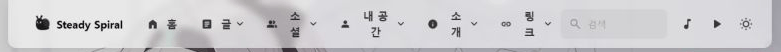
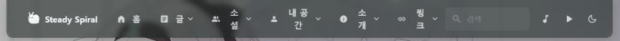

블로그 이름을 **Steady Spiral**로 바꿨다. 홈 화면의 문구는 **Just Keep Pedaling**로 남겼다.

둘은 같은 방향을 바라본다. 빠르지 않아도 계속 움직이는 것, 한 바퀴를 돌 때마다 조금씩 앞으로 나아가는 것이다. 새 이름을 정하고 나니 기존의 Firefly 로고 대신 이 의미를 담은 작은 상징이 필요해졌다.

그때 GitHub에서 [`s1dashu/ip-as-logo-skill`](https://github.com/s1dashu/ip-as-logo-skill)을 발견했다. 2026년 8월 18일 공개된 저장소인데, 8월 24일 확인했을 때 이미 3,869 stars와 186 forks를 기록하고 있었다. 단순히 로고 이미지를 모아 둔 프로젝트가 아니라 AI 에이전트가 단순한 IP 캐릭터를 생성하도록 제약을 제공하는 **Agent Skill**이었다.

마침 블로그 로고를 바꾸려던 시점이었다. 트렌딩 저장소를 구경하는 데서 끝내지 않고 실제 블로그에 적용해 보기로 했다.

## Agent Skill로 취향을 전달한다는 것

이미지 모델에 “귀여운 달팽이 로고를 만들어 줘”라고 말하는 것만으로도 이미지는 나온다. 하지만 귀엽다는 말의 범위는 너무 넓고, 로고로 사용하기 어려울 만큼 디테일이 많아질 수도 있다.

`ip-as-logo-skill`은 이 선택지를 의도적으로 좁힌다.

- 32×32에서도 알아볼 수 있는 단순한 실루엣
- 4~7개의 크고 둥근 기본 형태
- 캐릭터 두 색과 배경 한 색
- 왼쪽 또는 오른쪽 아래에서 등장하는 구도
- 세 가지 방향을 먼저 정하고 여섯 개 후보를 독립 생성
- 텍스트, 워터마크, 장식과 지나친 3D 표현 제외

코드를 실행하는 도구라기보다 이미지 모델에 전달할 **디자인 판단의 묶음**에 가깝다. 설치는 Agent Skills CLI를 사용했다.

```bash
npx skills@latest add s1dashu/ip-as-logo-skill --global
```

설치 후 에이전트에게 블로그의 이름과 문구, 현재 Firefly 테마, 달팽이라는 소재를 전달했다. 색상은 나중에 바꿀 수 있으므로 특정 팔레트에 고정하지 않았다.

## 달팽이를 선택한 이유

달팽이는 빠름과는 거리가 멀다. 그래서 오히려 **Steady Spiral**과 잘 맞았다.

껍질의 나선은 블로그 이름을 직접 보여 주고, 느리지만 멈추지 않는 움직임은 `Just Keep Pedaling`과 연결된다. 개발과 일상에서 배운 것을 꾸준히 남기려는 블로그의 태도도 설명할 수 있었다.

요구사항은 다음처럼 정리했다.

- 소재는 달팽이로 고정한다.
- 껍질의 나선이 작은 크기에서도 보여야 한다.
- 복잡한 일러스트보다 둥글고 단순한 실루엣을 우선한다.
- 후보는 정사각형 이미지로 생성한다.
- 최종 결과는 32px favicon과 28px 네비게이션 로고로 사용한다.
- 라이트 모드와 다크 모드에서 모두 형태가 무너지지 않아야 한다.

## 세 가지 방향과 여섯 번의 독립 생성

스킬은 달팽이라는 같은 소재를 세 가지 방식으로 나눴다.

| 방향 | 연결한 의미 | 시각적 특징 |
| --- | --- | --- |
| A · Steady Shell | 느리더라도 쌓이는 꾸준함 | 크고 안정적인 껍질과 차분한 표정 |
| B · Pedaling Spiral | 계속 앞으로 가는 리듬 | 바퀴처럼 읽히는 둥근 껍질과 전진하는 자세 |
| C · Verdant Firefly | 기존 Firefly 테마와의 연결 | 밝은 몸체, 초록 껍질과 친근한 표정 |

각 방향은 왼쪽 아래와 오른쪽 아래 구도로 한 장씩 생성했다. 하나의 이미지에 여섯 후보를 합치는 방식이 아니라, 모두 별도의 정사각형 이미지로 생성했다.

### A · Steady Shell


짙은 초록 몸체와 아이보리 껍질을 사용했다. 커다란 껍질이 안정감을 주고, 두꺼운 더듬이와 작은 얼굴이 32px에서도 비교적 쉽게 남을 수 있는 방향이었다. 다만 황금색 배경까지 함께 보면 블로그보다는 독립적인 캐릭터 브랜드에 가까운 인상이 강했다.

### B · Pedaling Spiral


낮고 길게 뻗은 몸체와 라임색 껍질로 움직임을 강조했다. 껍질을 바퀴처럼 읽을 수 있어 `Just Keep Pedaling`과 가장 직접적으로 연결됐다. 짙은 청록 배경과 밝은 껍질의 대비도 분명했다.

### C · Verdant Firefly


기존 Firefly 테마와 가장 자연스럽게 이어진 방향이다. 밝은 몸체와 초록 껍질을 사용해 어두운 배경에서도 형태가 쉽게 분리됐다. 모서리에서 얼굴을 내미는 구도도 개인 블로그의 작은 마스코트로 쓰기에 부담이 적었다.

생성 결과는 모두 1254×1254 RGB PNG였다. 결과를 비교한 뒤에는 C 방향을 유지하면서 껍질의 나선, 얼굴과 더듬이가 favicon 크기에서도 남는 결과를 최종안으로 골랐다.

## C1 Verdant Firefly를 최종안으로


최종 선택 기준은 큰 화면에서 얼마나 화려한지가 아니었다. 실제 사용 크기에서 무엇이 남는지를 봤다.

- 검은 실루엣만으로도 달팽이임을 알아볼 수 있는가?
- 32px에서 껍질의 나선이 뭉개지지 않는가?
- 28px에서 얼굴이 점처럼 사라지지 않는가?
- 배경을 제거해도 외곽선이 자연스러운가?
- 단색으로 바꿔도 형태가 유지되는가?

선택한 이미지는 **C1 Verdant Firefly**라고 이름 붙였다. 생성 이미지의 배경을 제거하고 투명 PNG로 정리한 다음 용도별 자산을 만들었다.

| 용도 | 처리 |
| --- | --- |
| 컬러 로고 | Verdant Firefly 색상 유지 |
| 라이트 모드 네비게이션 | M1 Near Black 단색 버전 |
| 다크 모드 네비게이션 | M2 Soft White 버전 |
| favicon | 32·128·180·192px PNG |

## Astro와 Firefly에 적용하기

Firefly의 사이트 설정에는 favicon 배열과 네비게이션 로고의 라이트·다크 경로를 지정할 수 있다. 최종 자산은 다음처럼 연결했다.

```ts
favicon: [
  { src: "/favicon/steady-spiral-192.png", sizes: "192x192" },
  { src: "/favicon/steady-spiral-180.png", sizes: "180x180" },
  { src: "/favicon/steady-spiral-128.png", sizes: "128x128" },
  { src: "/favicon/steady-spiral-32.png", sizes: "32x32" },
],

navbar: {
  logo: {
    type: "image",
    value: "/assets/images/logo/steady-spiral-light.png",
    valueDark: "/assets/images/logo/steady-spiral-dark.png",
    alt: "Steady Spiral logo",
  },
  title: "Steady Spiral",
},
```

사이트 제목과 설명도 함께 변경했다.

```ts
title: "Steady Spiral",
description:
  "느리더라도 멈추지 않고, 개발과 일상의 배움을 꾸준히 기록하는 공간입니다.",
```

홈 대문의 `Just Keep Pedaling`과 두 줄의 부제목은 그대로 남겼다.

> Life is like riding a bicycle.<br>
> To keep your balance, you must keep moving.

## 라이트 모드와 다크 모드 확인



라이트 모드에서는 M1 Near Black을 사용했다. 컬러 로고를 그대로 축소하는 것보다 텍스트 및 네비게이션 아이콘과 시각적 무게가 잘 맞았다.



다크 모드에서는 검은 로고를 CSS로 단순 반전하지 않고 M2 Soft White 이미지를 별도로 사용했다. 몸체는 흰색에 가깝게, 껍질은 부드러운 회색으로 남겨 형태를 구분했다.

마지막으로 브라우저에서 28px 네비게이션 표시와 32px favicon을 확인하고 다음 검증을 실행했다.

```bash
pnpm check
pnpm type-check
pnpm build
```

## 생성보다 선택과 적용에 더 많은 판단이 필요했다

Agent Skill을 사용하면 결과가 자동으로 브랜드가 되는 것은 아니다. 여섯 장을 만드는 일보다 어떤 방향이 블로그의 이름과 태도를 설명하는지 고르는 일이 더 중요했다. 선택한 뒤에도 배경 제거, 색상 변형, 작은 크기 검증, 테마별 자산 분리와 실제 코드 적용이 남아 있었다.

그럼에도 스킬은 출발점을 빠르게 만들어 줬다. 막연히 “귀여운 달팽이”를 요청하는 대신 크기, 형태, 색상 수와 구도를 제한했고, 비교할 수 있는 후보를 같은 규칙 안에서 얻었다. 프롬프트 한 번의 우연한 결과보다 반복 가능한 제작 과정에 가까웠다.

새 로고가 거창한 선언을 하지는 않는다. 작고 느린 달팽이 한 마리가 네비게이션 왼쪽에 있을 뿐이다. 그래도 블로그를 열 때마다 내가 정한 이름을 다시 보여 준다.

느리더라도 멈추지 말 것. 한 바퀴씩 계속 나아갈 것.

**Just Keep Pedaling.**

## 참고

- [s1dashu/ip-as-logo-skill](https://github.com/s1dashu/ip-as-logo-skill)
- [ip-as-logo-skill MIT License](https://github.com/s1dashu/ip-as-logo-skill/blob/main/LICENSE)
