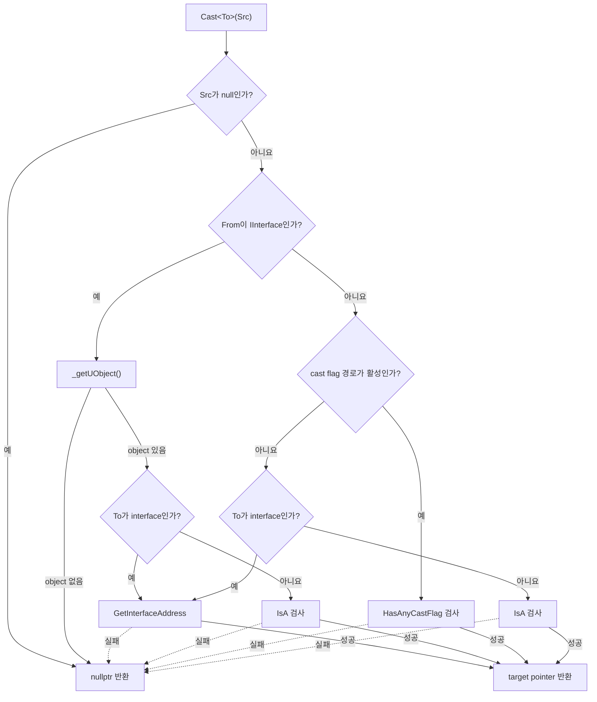

Unreal C++에서 `UObject*`를 구체적인 type으로 확인할 때는 보통 `dynamic_cast`가 아니라 `Cast<T>`를 사용한다.

```cpp
UObject* Candidate = GetCandidateObject();

if (AMyActor* Actor = Cast<AMyActor>(Candidate))
{
    Actor->ActivateFeature();
}
```

둘 다 실패 가능한 runtime cast처럼 보이지만 type information의 출처가 다르다.

- 표준 `dynamic_cast`: compiler가 생성한 C++ RTTI와 polymorphic class hierarchy 사용
- Unreal `Cast<T>`: `UClass`, `UStruct`, interface table 같은 Unreal reflection metadata 사용

그래서 native class와 Blueprint-generated subclass를 같은 UObject hierarchy로 판별하면서도 C++ RTTI를 요구하지 않는다. 다만 `Cast`는 type 관계만 검사한다. raw pointer가 pending kill인지, GC lifetime이 유효한지, gameplay state가 사용할 수 있는지는 별도 문제다.

아래 구현 설명은 Unreal Engine 5의 `Casts.h`를 기준으로 한다. Unreal Engine 4의 내부 dispatcher는 다르므로 사용하는 engine branch의 source와 함께 읽어야 한다.

## 먼저 API를 고르는 기준

| 의도                                               | API                                         | 실패 의미와 주의점                                                   |
| -------------------------------------------------- | ------------------------------------------- | -------------------------------------------------------------------- |
| compile time에 보장된 derived→base upcast          | 일반 implicit conversion                    | cast가 필요 없음                                                     |
| mismatch가 정상적으로 가능한 UObject 입력          | `Cast<T>` + null 검사                       | null 입력이나 불일치면 null                                          |
| 성공이 programmer invariant                        | `CastChecked<T>`                            | check 설정에 따라 type 검사가 제거될 수 있어 외부 입력 검증용이 아님 |
| subclass를 허용하지 않고 정확한 runtime `UClass`만 | `ExactCast<T>`                              | subclass면 null                                                      |
| pointer가 필요 없고 관계만 확인                    | `Object && Object->IsA<T>()`                | raw null object에서 member를 호출하지 않음                           |
| Blueprint 구현까지 가능한 Unreal interface 호출    | `ImplementsInterface` + `I...::Execute_...` | Blueprint-only 구현은 native interface pointer가 없음                |
| native C++ interface pointer가 반드시 필요         | `Cast<I...>`                                | Blueprint-only 구현에는 null일 수 있음                               |
| `FField`·`FProperty` hierarchy                     | `CastField<T>`                              | UObject `Cast`와 다른 hierarchy                                      |
| UObject가 아닌 native C++ hierarchy                | 표준 C++ cast                               | checked downcast에는 RTTI/ABI 조건 필요                              |

raw pointer가 gameplay 관점에서도 살아 있어야 한다면 먼저 `IsValid(Object)`를 확인한다. `Cast`가 non-null을 반환했다는 사실만으로 destroy 예정 object까지 사용할 수 있다는 뜻은 아니다.

## UE5 `Cast<T>`의 큰 흐름

`Cast<T>`는 source와 destination이 완전한 type인지 compile time에 확인한 뒤, null과 Unreal interface 여부, cast flag 사용 가능 여부를 차례로 나눈다.



### Source가 Unreal interface인 경우

`From`이 `IInterface` 계열이면 먼저 `_getUObject()`로 owning UObject를 찾는다.

- `To`도 interface면 `GetInterfaceAddress`로 native interface 주소를 찾는다.
- UObject target이면 `IsA<To>()`로 class 관계를 검사한다.

owning object를 얻지 못하거나 관계가 맞지 않으면 null이다.

### Source가 UObject 계열인 경우

UObject 계열에서는 다음 세 경로 중 compile-time 설정과 target type에 맞는 경로를 사용한다.

- common engine type에 대한 cast flag bit test
- Unreal interface table에서 native interface 주소 검색
- `IsA<To>()`를 통한 `UClass`/`UStruct` hierarchy 검사

public `Cast<T>`의 의미는 같아도 이 분기를 구성하는 helper와 macro는 engine branch에 따라 달라질 수 있다.

## `EClassCastFlags`는 모든 class의 고유 ID가 아니다

`UClass::ClassCastFlags`는 common engine type cast를 빠르게 판별하기 위한 `EClassCastFlags` bit mask다. `AActor`, `USceneComponent`, `UBlueprint` 같은 제한된 engine category에 flag가 정의되어 있고 superclass의 flag가 subclass로 상속된다.

중요한 한계가 있다.

- 64-bit mask의 모든 bit를 임의의 game class마다 하나씩 배정하지 않는다.
- `TCastFlags_V<T>`의 기본은 `CASTCLASS_None`이다.
- custom game type 대부분은 target-specific bit가 없어 `IsA` path를 사용한다.
- flag가 있다고 정확한 class equality를 뜻하지 않는다. 해당 category 또는 descendant 관계를 나타낸다.

application code가 이 내부 flag를 직접 선택하거나 확장하기보다 `Cast`, `IsA`, `ExactCast`의 공개 의미에 의존해야 한다.

## `IsA`는 raw UObject와 `FObjectPtr`를 구분해서 읽어야 한다

raw UObject 계열의 canonical path는 `UObjectBaseUtility::IsA`다. 개념적으로 다음 관계를 확인한다.

```cpp
Object->GetClass()->IsChildOf(TargetClass)
```

target `UClass*`가 null이면 의미 있는 class 관계를 검사할 수 없다. `Object`가 null인 상태에서 member function을 호출하는 것도 C++ undefined behavior이므로 다음처럼 guard한다.

```cpp
bool IsMyActor(const UObject* Object)
{
    return Object && Object->IsA<AMyActor>();
}
```

`ObjectPtr.cpp`의 `FObjectPtr::IsA`는 raw UObject의 member 구현과 구분해야 한다. `FObjectPtr` path는 handle resolve와 access tracking을 포함할 수 있는 별도 overload다. 결과의 class 관계는 같아도 raw pointer 비용을 분석할 때 해당 구현을 그대로 대입하면 안 된다.

## `IsChildOf`의 두 구현

`UStruct::IsChildOf`는 자신이 target `UStruct`와 같거나 descendant인지 판단한다. engine의 compile-time 설정에 따라 두 구현 중 하나를 사용할 수 있다.

| 구현         | query 비용 | 추가 비용·특징                                      |
| ------------ | ---------: | --------------------------------------------------- |
| outer walk   |       O(h) | 자기 자신부터 super chain을 순회                    |
| struct array |       O(1) | type마다 ancestor chain을 O(h) 공간으로 저장·초기화 |

여기서 `h`는 inheritance depth다. 어떤 build가 어느 구현과 cast flag 경로를 선택하는지는 해당 engine branch의 macro 설정을 확인한다. editor 여부만으로 모든 branch의 값을 단정하지 않는다.

## 경로별 복잡도

`Cast` 전체를 무조건 O(1) 또는 무조건 비싸다고 설명할 수 없다.

| 경로                     |                 대략적인 query 비용 | 비고                                        |
| ------------------------ | ----------------------------------: | ------------------------------------------- |
| `HasAnyCastFlag`         |                                O(1) | common flagged engine type                  |
| outer walk `IsChildOf`   |                                O(h) | inheritance depth에 비례                    |
| struct-array `IsChildOf` |                                O(1) | type당 O(h) ancestor storage/initialization |
| raw `ExactCast`          |                                O(1) | exact `UClass*` equality만 비교             |
| interface address lookup | class depth와 interface 목록에 비례 | Blueprint/native 구현 여부 분기 포함        |
| `FObjectPtr` overload    |     class check 외 handle 비용 가능 | raw pointer path와 별도 측정                |

interface search나 object handle resolve까지 포함해 “모든 Unreal cast는 bit test 하나”라고 일반화하면 안 된다. 반대로 game hierarchy 깊이는 보통 제한적이므로 cast 몇 번만 보고 architecture를 바꿀 이유도 없다. hot path는 Unreal Insights나 platform profiler로 실제 빈도와 target을 측정한다.

## `Cast`, `CastChecked`, `ExactCast`, `IsA`

### 실패가 정상이라면 `Cast`

```cpp
void TryActivate(UObject* Candidate)
{
    if (!IsValid(Candidate))
    {
        return;
    }

    if (AMyActor* Actor = Cast<AMyActor>(Candidate))
    {
        Actor->ActivateFeature();
    }
}
```

subclass도 허용하며 mismatch는 null이다. network payload, user selection, optional component처럼 실제 type이 달라질 수 있는 입력에 적합하다.

### 실패가 programmer bug라면 `CastChecked`

```cpp
AMyActor* Actor = CastChecked<AMyActor>(KnownActorObject);
```

check가 활성화된 build에서는 null 또는 mismatch를 진단한다. `ECastCheckedType::NullAllowed`를 사용하면 null만 허용할 수 있지만 non-null mismatch는 여전히 invariant 위반이다.

check가 compile out되는 build에서는 `CastChecked`의 진단도 같은 형태로 남는다고 기대하면 안 된다. 그래서 untrusted runtime input의 보안·유효성 검사로 사용하지 않는다. 실패가 정상일 수 있다면 `Cast`와 null branch를 쓴다.

### 정확한 class만 허용한다면 `ExactCast`

```cpp
if (UMyExactAsset* Asset = ExactCast<UMyExactAsset>(Object))
{
    // UMyExactAsset의 subclass는 여기 들어오지 않는다.
}
```

raw pointer 구현은 `Object->GetClass() == UMyExactAsset::StaticClass()` 형태다. O(1)이지만 “Cast보다 빠르다”는 이유만으로 선택하지 않는다. subclass를 의도적으로 거부하는 semantics가 필요할 때만 쓴다.

### bool만 필요하면 `IsA`

```cpp
if (Object && Object->IsA<UMyAsset>())
{
    // type relation만 확인
}
```

그 뒤 같은 pointer를 다시 cast해서 사용한다면 `Cast` 한 번으로 pointer와 branch를 함께 얻는 편이 낫다.

## Unreal interface의 Blueprint-only 함정

Blueprint가 C++로 선언된 Unreal interface를 구현해도 native C++ `IInterface` subobject가 생기는 것은 아니다. Blueprint-only 구현에는 object pointer만 있고 native interface pointer는 없을 수 있다.

이 때문에 다음 코드는 Blueprint-only implementation에서 null일 수 있다.

```cpp
if (IInteractable* NativeInterface = Cast<IInteractable>(Object))
{
    NativeInterface->InteractNativeOnly();
}
```

Blueprint 구현과 override까지 호출해야 한다면 reflection path를 사용한다.

```cpp
void TryInteract(UObject* Object, AActor* Instigator)
{
    if (!IsValid(Object) ||
        !Object->GetClass()->ImplementsInterface(
            UInteractable::StaticClass()))
    {
        return;
    }

    IInteractable::Execute_Interact(Object, Instigator);
}
```

[`Interfaces in Unreal Engine`](https://dev.epicgames.com/documentation/unreal-engine/interfaces-in-unreal-engine?lang=en-US)는 `Execute_` wrapper가 C++ 구현과 Blueprint override를 모두 호출하기 위한 path라고 설명한다. native interface pointer 자체가 필요한 API에서만 `Cast<IInteractable>`을 사용한다.

## Blueprint Cast node는 C++ template 호출과 동일하지 않다

Blueprint의 **Cast To** node도 Unreal reflection 관계를 검사하지만 C++ `Cast<T>` template을 그대로 instantiate하는 것은 아니다.

1. Kismet compiler가 class→class, interface→class, class→interface, interface→interface 조합에 맞는 cast statement를 만든다.
2. class cast bytecode에는 target `UClass` literal이 들어간다.
3. VM은 class target이면 `IsA`, interface target이면 `ImplementsInterface`와 script-interface path를 사용한다.

Blueprint node에는 VM dispatch 비용이 더해지고 target class reference가 asset dependency에 참여할 수 있다. 이는 class hierarchy query 자체의 비용과 별도 축이다. cast node 하나의 CPU 비용, 반복 횟수, target Blueprint의 load dependency를 섞어서 “Cast To는 항상 비싸다”라고 결론 내리지 않는다.

## C++ RTTI와의 경계

Unreal `Cast`는 `UObjectBase` 또는 Unreal interface 계열을 대상으로 한다. plain C++ class hierarchy에는 `UClass`가 없으므로 사용할 수 없다.

```cpp
struct INativeService
{
    virtual ~INativeService() = default;
};

struct FConcreteService final : INativeService
{
};
```

이 hierarchy의 checked downcast는 표준 `dynamic_cast`와 native RTTI 영역이다. UE module에서 필요하면 [Module Properties](https://dev.epicgames.com/documentation/en-us/unreal-engine/module-properties-in-unreal-engine)의 `bUseRTTI`와 platform ABI를 검토한다. RTTI를 끈 build가 `dynamic_cast`를 `static_cast`로 바꾸어 주지는 않는다. 표준 cast의 자세한 전제는 [C++ 캐스팅 글](/posts/cpp-cast-operators-explained/)에서 다룬다.

`FField`와 `FProperty`도 UObject hierarchy가 아니므로 `CastField<T>`를 사용한다.

```cpp
if (FStructProperty* StructProperty =
        CastField<FStructProperty>(Property))
{
    const UScriptStruct* Struct = StructProperty->Struct;
}
```

## 결론

`Cast<T>`는 C++ RTTI의 값싼 복제품이 아니다. Unreal reflection이 이미 유지하는 `UClass` hierarchy와 interface metadata를 이용하는 UObject 전용 cast다. source와 target의 종류에 따라 cast flag, interface address, `IsA` 중 맞는 경로를 선택한다.

성능은 선택된 경로와 `IsChildOf` 구현 방식에 따라 다르다. outer walk는 inheritance depth에 비례하고, struct-array query와 cast flag, exact class 비교는 O(1)이다. interface와 object pointer는 추가 비용이 있을 수 있다. 그래서 API는 micro-optimization보다 의미로 고른다.

- mismatch가 정상: `Cast`와 null 검사
- mismatch가 invariant 위반: `CastChecked`
- exact runtime class만: `ExactCast`
- bool만: guarded `IsA`
- Blueprint-capable interface: `ImplementsInterface` + `Execute_`
- non-UObject: 표준 C++ type system과 RTTI 정책

`Cast` 성공은 object lifetime, ownership, network authority, gameplay readiness를 보장하지 않는다. type check와 object validity를 분리해서 검증해야 한다.

## 참고 자료

- [Epic Games: `Cast`](https://dev.epicgames.com/documentation/unreal-engine/API/Runtime/CoreUObject/Cast?lang=en-US)
- [Epic Games: `CastChecked`](https://dev.epicgames.com/documentation/unreal-engine/API/Runtime/CoreUObject/CastChecked?lang=en-US)
- [Epic Games: `ExactCast`](https://dev.epicgames.com/documentation/unreal-engine/API/Runtime/CoreUObject/ExactCast)
- [Epic Games: `UObjectBaseUtility::IsA`](https://dev.epicgames.com/documentation/unreal-engine/API/Runtime/CoreUObject/UObjectBaseUtility/IsA)
- [Epic Games: `UStruct::IsChildOf`](https://dev.epicgames.com/documentation/unreal-engine/API/Runtime/CoreUObject/UStruct/IsChildOf?lang=en-US)
- [Epic Games: `EClassCastFlags`](https://dev.epicgames.com/documentation/unreal-engine/API/Runtime/CoreUObject/EClassCastFlags?lang=en-US)
- [Epic Games: Interfaces in Unreal Engine](https://dev.epicgames.com/documentation/unreal-engine/interfaces-in-unreal-engine?lang=en-US)
- [Epic Games: `FScriptInterface`](https://dev.epicgames.com/documentation/unreal-engine/API/Runtime/CoreUObject/FScriptInterface?lang=en-US)
- [Epic Games: `CastField`](https://dev.epicgames.com/documentation/unreal-engine/API/Runtime/CoreUObject/CastField?lang=en-US)
- [Epic Games: Module Properties](https://dev.epicgames.com/documentation/en-us/unreal-engine/module-properties-in-unreal-engine)
