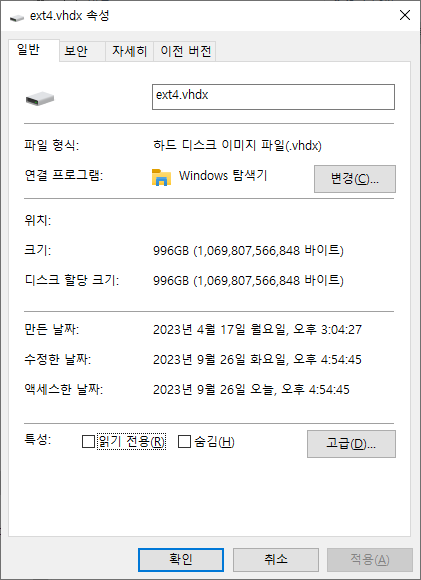
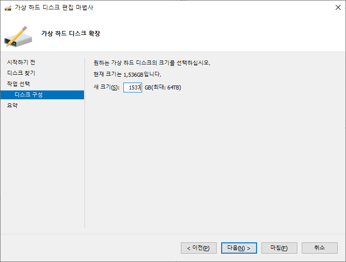
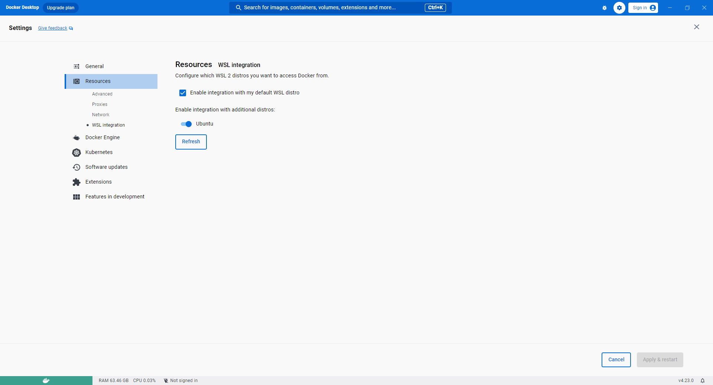
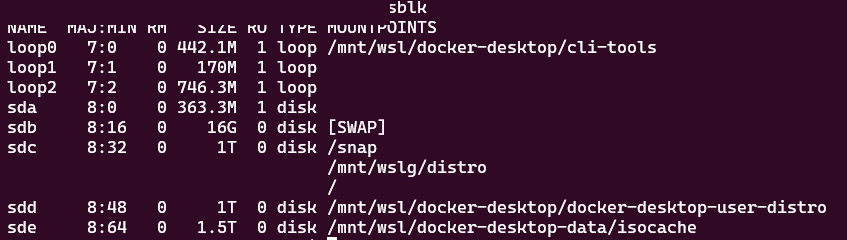

Docker Desktop의 WSL2 backend에서 운영하던 서비스의 PostgreSQL과 Elasticsearch가 `No space left on device`로 중단됐다. host drive에는 여유 공간이 있었지만 Linux filesystem이 들어 있는 VHDX의 한계에 도달한 상태였다.

## 문제 현상

container를 재시작해도 회복되지 않았고 database write와 index allocation은 계속 실패했다. Windows 탐색기의 여유 공간만 봐서는 원인을 놓치기 쉽다.



## 적용 범위

Docker Desktop이 WSL2 distribution의 virtual disk에 container data를 저장하는 Windows 환경을 다룬다. 처음 문제를 발견한 곳은 JetBrains Space On-Premises였지만 다른 Docker workload도 원리는 같다.

## 원인

Windows host volume의 남은 공간과 WSL2 ext4 filesystem의 크기는 별개다. 오래된 환경에서는 virtual disk의 최대 크기 또는 partition/filesystem 크기가 먼저 한계에 닿기도 한다. 이미지, volume, database WAL과 search index가 계속 늘면서 Linux 쪽 사용률이 100%가 됐다.

## 재현 및 진단

PowerShell과 WSL에서 각기 다른 층을 확인한다.

```powershell
wsl --list --verbose
wsl --system -d <distribution> df -h
```

Docker가 사용하는 distribution 이름과 data location은 Docker Desktop 버전에 따라 달라지기도 한다. VHDX 경로를 추측해 수정하지 말고 Docker Desktop 설정과 `wsl --list`로 먼저 식별한다.

## 해결 방법

최근 WSL에서는 지원되는 resize 명령부터 사용한다.

```powershell
wsl --shutdown
wsl --manage <distribution> --resize 1536GB
```

명령이 지원되지 않는 구버전은 WSL을 업데이트하는 편이 우선이다. 불가피하게 수동으로 처리할 때는 backup을 만든 뒤 VHDX를 확장하고 내부 partition과 ext4 filesystem까지 별도로 늘려야 한다.







디스크를 늘린 다음에는 사용하지 않는 image·build cache·volume을 찾아 보존 정책에 맞게 정리한다. database volume은 서비스 backup을 확보하기 전에 삭제하지 않는다.

## 검증 방법

- WSL의 `df -h`와 block device 크기가 모두 늘었는지 확인해 본다.
- Docker Desktop과 대상 container를 시작해 database recovery log를 점검한다.
- 쓰기·index 생성과 backup 복구 시험을 수행해 본다.
- 며칠간 disk growth와 alert threshold를 모니터링한다.

## 주의점

VHDX 확장은 host filesystem, virtual disk, partition과 ext4 filesystem을 함께 다루는 작업이다. 중간에 전원을 끄거나 잘못된 distribution의 disk를 수정하면 데이터가 손상될 위험이 있다. 확장만 반복하지 말고 log·artifact·volume retention도 함께 고친다.

## 참고 자료

- [Microsoft Learn: How to manage WSL disk space](https://learn.microsoft.com/en-us/windows/wsl/disk-space)
