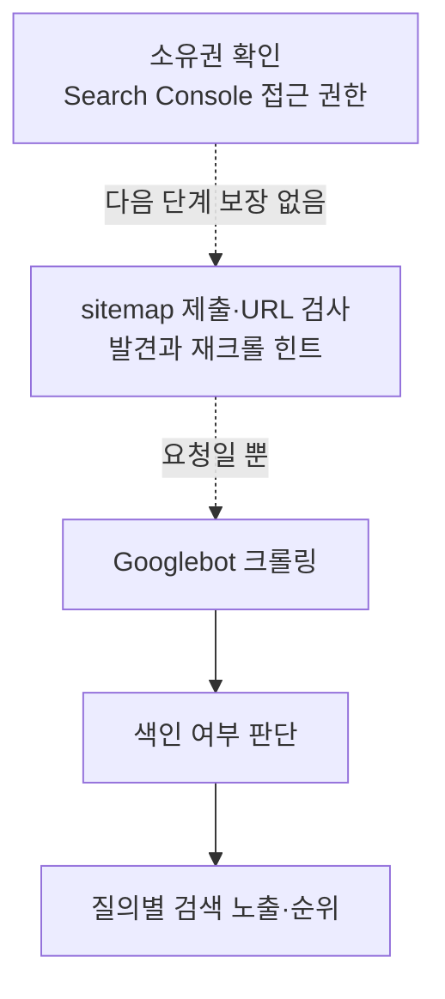

Jekyll과 Chirpy로 만든 블로그를 Google Search Console의 **URL-prefix 속성**에 추가하고 HTML meta tag로 소유권을 확인하는 과정을 정리한다.

소유권 확인은 검색 노출 완료와 다르다. Search Console을 사용할 권한을 증명할 뿐이며, Google이 URL을 발견하고 크롤링하고 색인한 다음 검색 결과에 보여 주는 과정은 각각 별개다. sitemap 제출과 색인 생성 요청도 다음 단계를 보장하지 않는다.



## 먼저 공개 상태 확인하기

Search Console은 잘못된 배포를 고쳐 주지 않는다. 실제 공개 URL에서 다음을 먼저 확인한다.

| 점검 항목           | 정상 상태                                                        | 흔한 실패                                                |
| ------------------- | ---------------------------------------------------------------- | -------------------------------------------------------- |
| HTTP 응답           | 공개할 페이지가 로그인 없이 `200 OK`                             | 잘못된 GitHub Pages 경로로 404, redirect loop, 인증 필요 |
| robots meta         | 색인할 페이지가 `index, follow`                                  | theme이나 frontmatter가 의도치 않게 `noindex`            |
| `robots.txt`        | Googlebot이 필요한 HTML·CSS·JS를 읽을 수 있음                    | 필요한 페이지나 리소스를 차단                            |
| canonical           | 실제 공개 URL과 일치하는 absolute self-canonical                 | localhost, 잘못된 domain·base path·trailing slash        |
| sitemap             | 공개할 canonical URL을 포함                                      | 404, redirect, 중복 URL을 함께 제출                      |
| HTTPS와 host 일관성 | 내부 링크·canonical·sitemap이 같은 HTTPS host를 사용             | custom domain과 `github.io` 주소가 섞임                  |
| 본문 접근성         | 핵심 정보가 처음 받은 HTML 또는 렌더링 가능한 페이지에 들어 있음 | 상호작용 뒤에만 핵심 내용을 표시                         |

`robots.txt`는 크롤링 제어 파일이다. 검색 결과에서 확실히 제외하려면 crawler가 페이지를 읽을 수 있는 상태에서 `noindex`를 사용한다.

## URL-prefix 속성 만들기

1. [Google Search Console](https://search.google.com/search-console)에 로그인한다.
2. **속성 추가 → URL 접두어**를 선택한다.
3. 블로그의 최종 공개 주소를 입력한다.

```text
https://example.github.io/
```

`http`와 `https`, `www` 유무, subdomain, path가 다르면 다른 URL-prefix 범위다. GitHub project site라면 `/repository-name/`까지 실제 배포 주소와 일치시킨다.

DNS를 직접 관리하는 custom domain이라면 Domain 속성과 DNS TXT 확인을 사용할 수도 있다. `github.io` 주소처럼 host의 DNS를 관리할 수 없다면 URL-prefix와 HTML tag 또는 HTML file 방식이 알맞다.

## HTML tag로 소유권 확인하기

### 1. meta tag의 `content` 값 복사

소유권 확인 창에서 **HTML 태그**를 선택하면 다음 형태의 meta tag를 받는다.

```html
<meta name="google-site-verification" content="SEARCH_CONSOLE에서_받은_값" />
```

전체 tag가 아니라 `content` 속성의 값만 복사한다. verification token은 공개 HTML에 들어가는 값이지만, 다른 계정 정보나 화면 전체를 함께 공유할 필요는 없다.

### 2. Jekyll 설정에 token 추가

이 글에서 사용한 Chirpy 설정은 `_config.yml`의 `google_site_verification` 값을 `<head>`의 meta tag로 출력한다.

```yaml
# _config.yml
google_site_verification: 'SEARCH_CONSOLE에서_받은_값'
```

theme마다 설정 이름이 다를 수 있으므로, 사용 중인 layout이 최종 HTML에 다음 tag를 만드는지 확인한다.

```html
<meta name="google-site-verification" content="SEARCH_CONSOLE에서_받은_값" />
```

### 3. 배포 후 페이지 소스 확인

설정을 push하고 GitHub Pages 배포가 끝날 때까지 기다린다. 그다음 블로그 홈페이지의 **페이지 소스 보기**에서 `google-site-verification`을 검색한다.

로컬 파일이나 브라우저 extension이 바꾼 DOM이 아니라, Google이 접근할 공개 URL의 `<head>`에 tag가 있어야 한다. URL-prefix가 redirect된다면 최종 도착 페이지에서도 tag를 읽을 수 있어야 한다.

### 4. Search Console에서 확인

배포된 tag를 확인한 뒤 소유권 확인 창의 **확인**을 누른다. 확인에 성공한 뒤에도 meta tag를 지우지 않는다. Google이 token을 다시 확인할 수 있기 때문이다.

## canonical과 sitemap 점검하기

Jekyll의 공개 URL은 `_config.yml`의 `url`, `baseurl`, permalink 설정에 영향을 받는다.

```yaml
url: 'https://example.github.io'
baseurl: ''
```

GitHub user site는 보통 root `/`를 사용한다. `https://example.github.io/repository/` 형태의 project site라면 `baseurl`과 내부 링크가 project 경로를 포함해야 한다.

Chirpy와 `jekyll-sitemap`을 사용하는 사이트라면 배포 뒤 다음 URL을 직접 연다.

```text
https://example.github.io/robots.txt
https://example.github.io/sitemap.xml
```

아래 항목을 확인한다.

- 두 URL이 `200 OK`로 열리는가?
- sitemap 안의 host와 path가 실제 공개 URL과 일치하는가?
- 각 URL이 공개 페이지로 열리고 올바른 canonical을 갖는가?
- localhost나 이전 domain, 잘못된 base path가 남아 있지 않은가?
- `robots.txt`가 색인할 페이지를 막지 않는가?

Search Console의 **Sitemaps** 화면에는 `sitemap.xml`을 제출한다. sitemap은 Google에 URL 목록을 알려 주는 힌트이며 다운로드, 크롤링, 색인을 보장하지 않는다.

## URL Inspection으로 글 확인하기

새 글을 배포한 다음 Search Console 상단의 **URL 검사**에 canonical URL을 입력한다.

1. Google이 알고 있는 색인 상태를 확인한다.
2. user-declared canonical과 Google-selected canonical이 같은지 본다.
3. **실제 URL 테스트**로 검사 도구가 페이지에 접근할 수 있는지 확인한다.
4. 중요한 새 페이지나 크게 바꾼 페이지라면 **색인 생성 요청**을 한 번 사용한다.

실제 URL 테스트 성공은 접근 가능하다는 뜻일 뿐, 중복 선택과 content quality를 포함한 모든 색인 조건을 통과했다는 뜻은 아니다. 같은 URL을 반복 제출한다고 더 빨라지는 것도 아니다. URL이 많다면 하나씩 요청하지 말고 sitemap을 사용한다.

## 검색 노출 확인하기

`site:example.github.io` 검색 결과 개수만으로 전체 색인 상태를 판단하지 않는다. Search Console의 각 report가 답하는 질문을 구분한다.

| 질문                            | Search Console 화면           | 확인할 값                                              |
| ------------------------------- | ----------------------------- | ------------------------------------------------------ |
| Google이 sitemap을 읽었는가?    | Sitemaps                      | fetch 상태, 마지막 읽기, 발견한 URL 수                 |
| 특정 URL이 색인됐는가?          | URL Inspection                | index 상태, crawl 시각, user/Google canonical          |
| 전체 URL의 색인 추세는 어떤가?  | Page indexing                 | indexed/not indexed 이유와 추세                        |
| 실제 검색 결과에 나타났는가?    | Performance → Search results  | impressions, clicks, CTR, query, page, country, device |
| 방문 뒤 사용자는 무엇을 했는가? | Google Analytics 등 별도 도구 | session과 site 내부 행동. Search Console의 역할이 아님 |

새 속성은 report data가 쌓이는 데 시간이 걸릴 수 있다. Search Console report의 수치와 `site:` 결과가 다르다고 바로 색인 장애로 결론 내리지 않는다.

## 문제별 진단표

| 증상                               | 먼저 확인할 것                                                                               |
| ---------------------------------- | -------------------------------------------------------------------------------------------- |
| HTML tag 확인 실패                 | 정확한 URL-prefix, 공개 `<head>`, 200 응답, redirect 최종 페이지, token 오타, 배포 완료 여부 |
| sitemap을 가져오지 못함            | absolute URL, 200 응답, XML 문법, robots, 잘못된 base path, 이전 domain                      |
| Crawled - currently not indexed    | 중복·얇은 내용·canonical·soft 404·내부 링크                                                  |
| Discovered - currently not indexed | server 안정성, 내부 링크, sitemap 상태                                                       |
| Google canonical이 다른 URL        | redirect, 내부 링크, canonical, sitemap 등 신호 불일치                                       |
| 색인됐지만 impression이 없음       | 실제 검색 수요, query 의도, 제목·본문의 관련성, 경쟁도                                       |

## 체크리스트

- 공개 URL이 로그인 없이 200으로 열리는가?
- 색인할 페이지가 `index, follow`이고 `robots.txt`에 막히지 않았는가?
- canonical, 내부 링크, sitemap의 protocol·host·path가 일치하는가?
- GitHub user site와 project site의 base path 차이를 반영했는가?
- 관리하는 주소에 맞춰 URL-prefix 또는 Domain 속성을 선택했는가?
- verification meta tag를 확인 뒤에도 유지하는가?
- sitemap을 제출하고 fetch 상태를 확인했는가?
- 중요한 URL만 실제 URL 테스트와 색인 생성 요청을 사용했는가?
- Page indexing과 Performance를 구분해 측정하는가?

소유권 확인만으로 끝나지 않는다. 실제 검색 상태를 관리하려면 crawl 가능한 페이지, 일관된 canonical, 올바른 sitemap과 robots 정책, URL Inspection과 Page indexing report를 함께 봐야 한다. 검색 결과에 실제로 나타났는지는 Performance의 impression과 query로 확인한다.

## 참고 자료

- [Jekyll 테마에서 구글 검색 노출 등록하기](https://www.irgroup.org/posts/jekyll-google-search/)
- [Google Search Console](https://search.google.com/search-console)
- [Search Console 소유권 확인](https://support.google.com/webmasters/answer/9008080)
- [Search Console Sitemaps report](https://support.google.com/webmasters/answer/7451001)
- [Search Console URL Inspection](https://support.google.com/webmasters/answer/9012289)
