## Markdown의 Mermaid 다이어그램 완벽 가이드

이 글은 Markdown 문서에서 Mermaid로 흐름도, 시퀀스 다이어그램, ER 다이어그램, 클래스 다이어그램, 상태 다이어그램, XY 차트, 간트 차트, 마인드맵 등 여러 복잡한 다이어그램을 만드는 방법을 보여 줍니다.

> Mermaid 다이어그램은 [Merman](https://github.com/Latias94/merman)으로 구현됩니다. Firefly는 Astro 빌드 단계에서 라이트·다크 테마용 정적 SVG를 생성하므로 브라우저에서 Mermaid 렌더링 런타임을 불러올 필요가 없습니다. [Merman Playground](http://frankorz.com/merman/)에서 문법을 실시간으로 편집하고 결과를 미리 볼 수 있습니다.

## 흐름도 예시

흐름도는 프로세스나 알고리즘 단계를 표현하는 데 적합합니다.


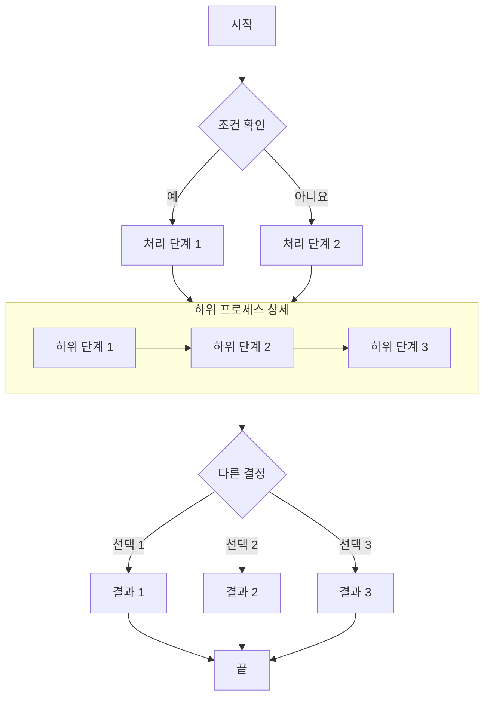

## 시퀀스 다이어그램 예시

시퀀스 다이어그램은 시간에 따른 객체 간 상호 작용을 보여 줍니다.

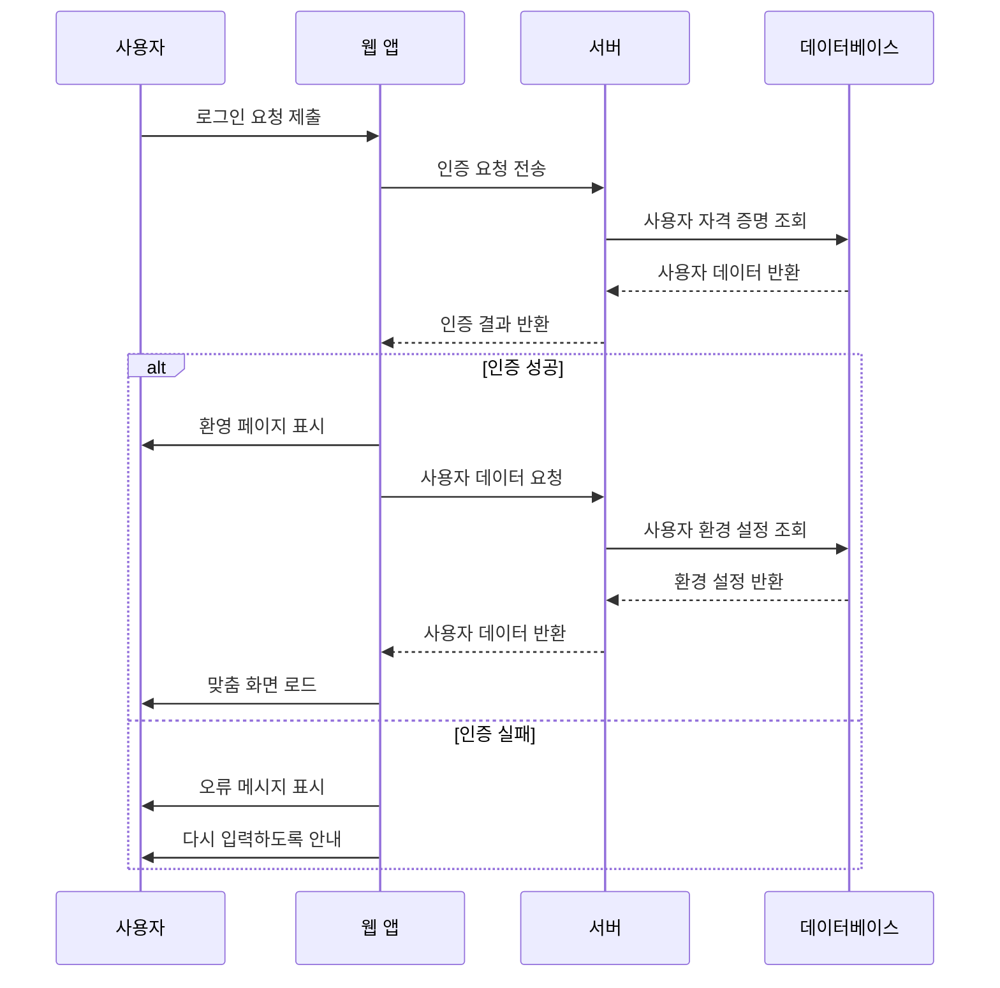

## ER 다이어그램 예시

ER 다이어그램(개체 관계도)은 데이터베이스 구조를 표현하는 데 적합합니다.

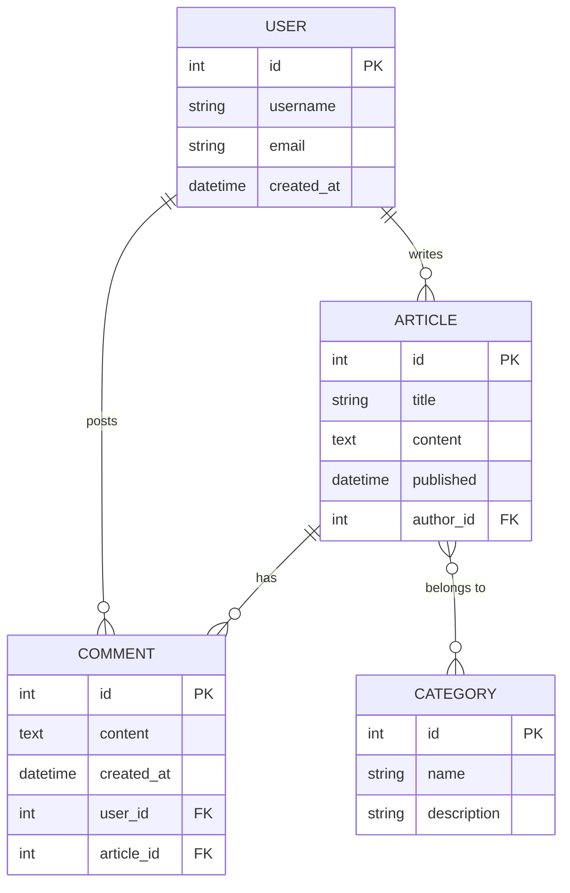

## 클래스 다이어그램 예시

클래스 다이어그램은 클래스, 속성, 메서드와 그 관계를 포함한 시스템의 정적 구조를 보여 줍니다.

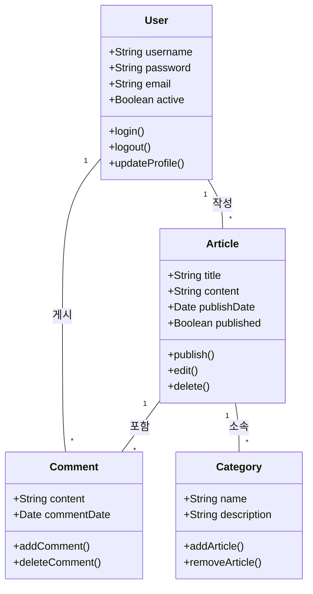

## 상태 다이어그램 예시

상태 다이어그램은 객체가 수명 주기 동안 거치는 상태의 흐름을 보여 줍니다.

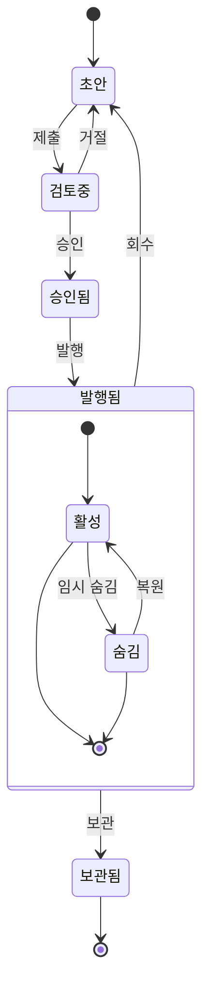

## XY 차트 예시

XY 차트는 추세와 비교 데이터를 보여 주는 데 적합합니다.

```mermaid
xychart-beta
    title "월별 방문 추세"
    x-axis [1월, 2월, 3월, 4월, 5월, 6월]
    y-axis "방문 수" 0 --> 5000
    bar [2500, 3200, 4100, 3800, 4500, 4800]
    line [2500, 3200, 4100, 3800, 4500, 4800]
```

## 원형 차트 예시

원형 차트는 각 부분이 전체에서 차지하는 비율을 직관적으로 보여 줍니다.

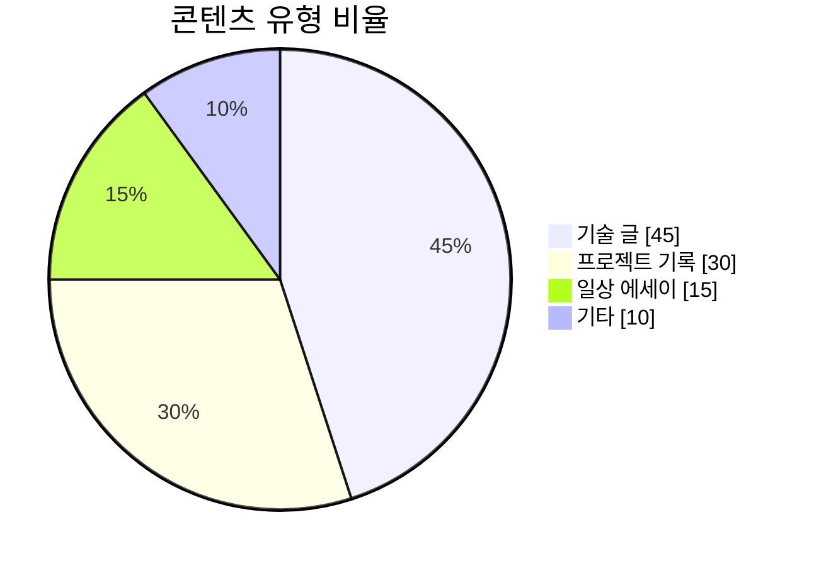

## 간트 차트 예시

간트 차트는 시간축에 따라 프로젝트 단계, 작업 의존성, 현재 진행 상황을 보여 줍니다.

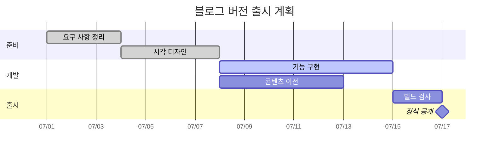

## 마인드맵 예시

마인드맵은 주제 계층과 지식 구조를 정리하는 데 적합합니다.

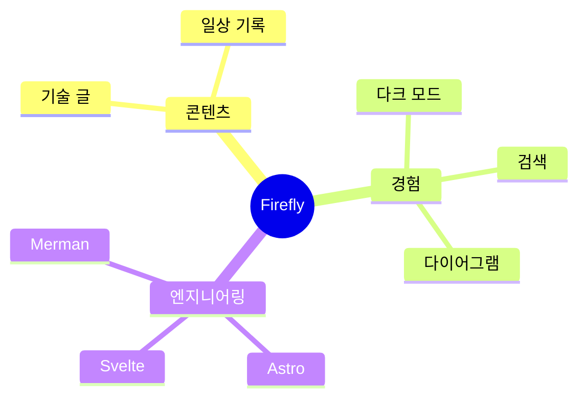

## 타임라인 예시

타임라인은 프로젝트의 중요한 사건을 연도나 단계별로 보여 줍니다.

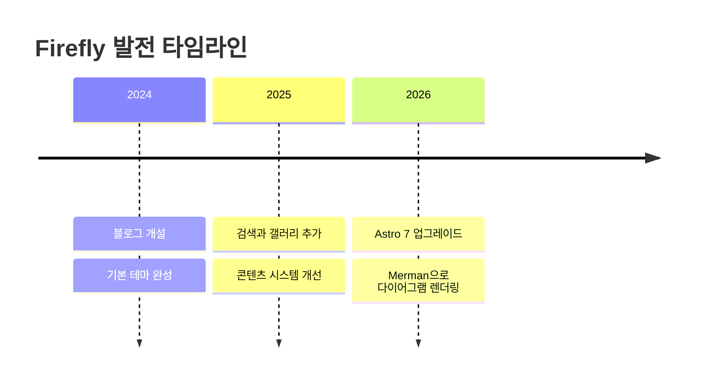

## 사용자 여정 지도 예시

사용자 여정 지도는 단계별 사용자의 행동과 경험 점수를 설명합니다.

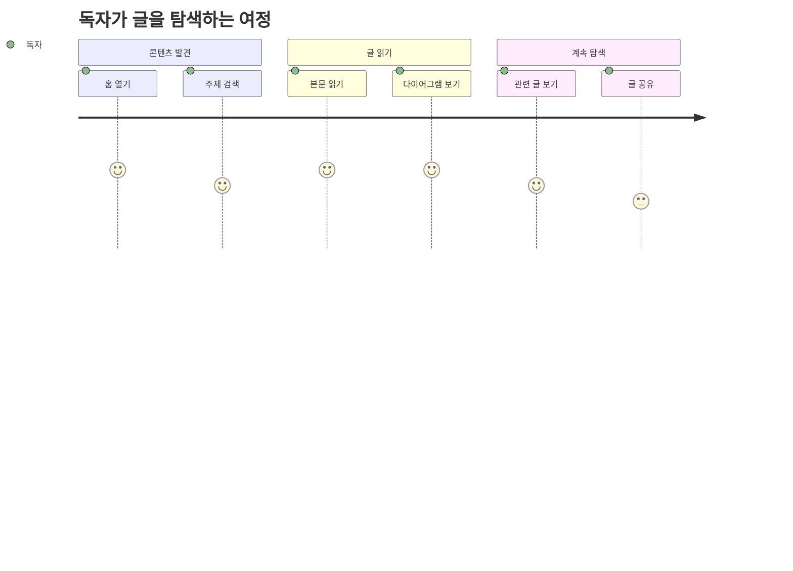

## Git 그래프 예시

Git 그래프는 브랜치, 커밋, 병합 기록을 명확하게 보여 줍니다.

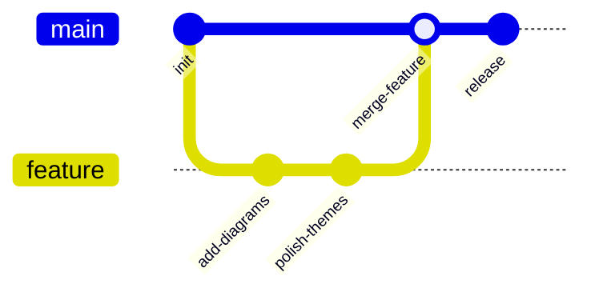

## 칸반 예시

칸반은 작업 단계별 태스크 분포를 보여 주는 데 적합합니다.

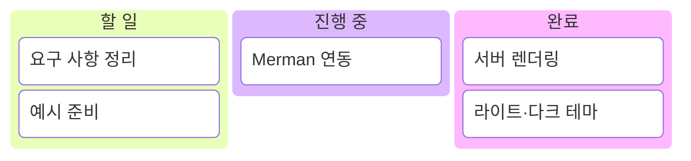

## Sankey 다이어그램 예시

Sankey 다이어그램은 연결선 너비로 노드 사이의 흐름을 보여 줍니다.

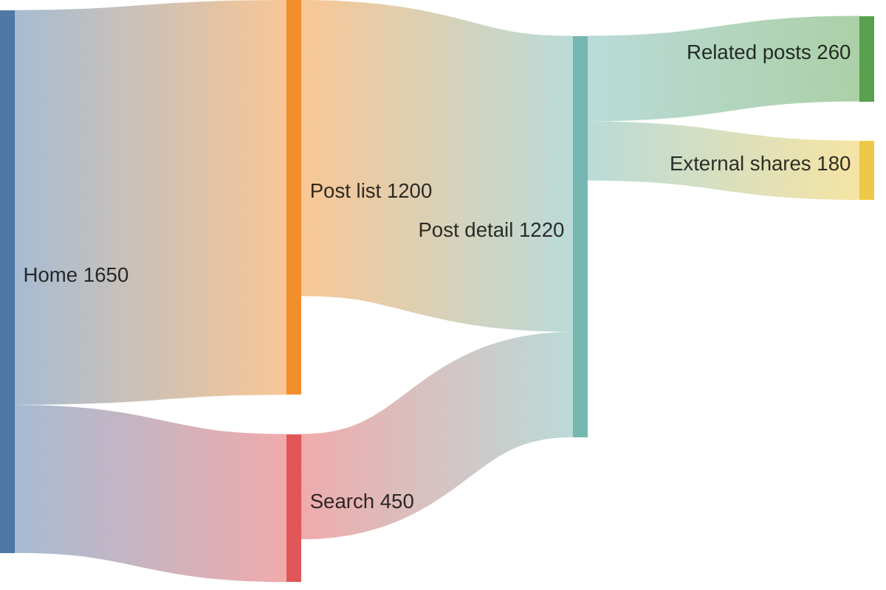

## 정리

Mermaid는 Markdown 문서에서 여러 유형의 다이어그램을 만드는 강력한 도구입니다. 이 글에서는 흐름도, 시퀀스·ER·클래스·상태 다이어그램, XY·원형·간트 차트, 마인드맵, 타임라인, 사용자 여정 지도, Git 그래프, 칸반, Sankey 다이어그램을 살펴봤습니다. 이런 시각화는 복잡한 개념과 프로세스, 데이터 구조를 더 명확하게 표현하는 데 도움을 줍니다.

Mermaid를 사용하려면 코드 블록 언어를 mermaid로 지정하고 간결한 텍스트 문법으로 다이어그램을 설명하면 됩니다. 빌드할 때 SVG로 자동 렌더링되므로 클라이언트 JavaScript를 불러올 필요가 없습니다.

[Merman Playground](http://frankorz.com/merman/)에서 더 많은 문법을 시험한 뒤 다이어그램 코드를 글에 붙여 넣어 보세요.
