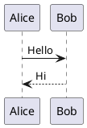
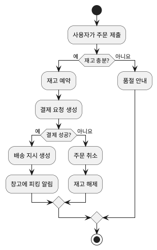
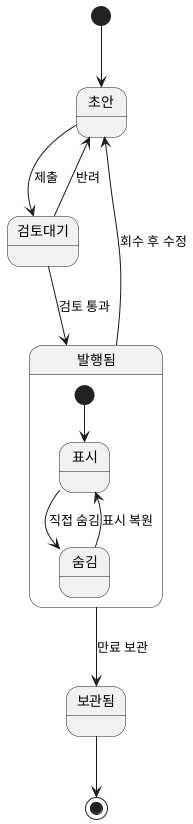
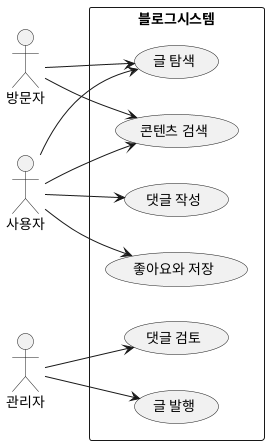
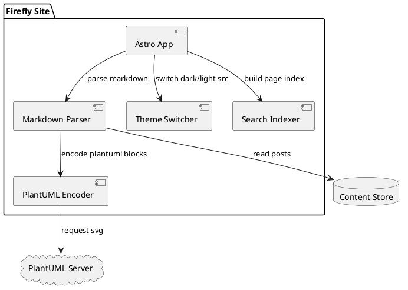
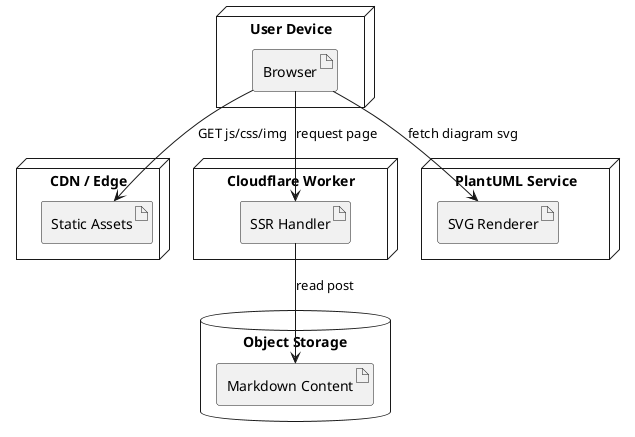
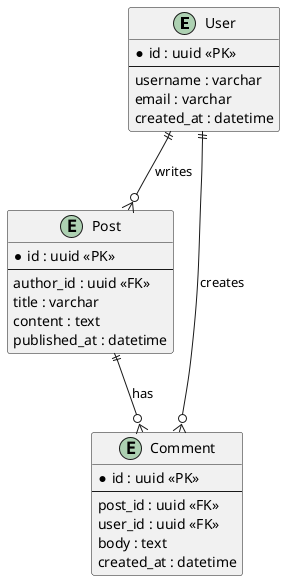
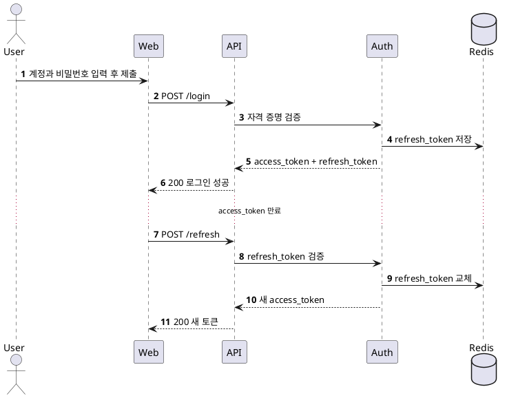

## Markdown의 PlantUML 다이어그램 가이드

PlantUML은 일반 텍스트로 다이어그램을 설명하는 도구입니다. 구조화된 문법만 작성하면 시퀀스, 클래스, 유스케이스, 활동 다이어그램 같은 일반적인 엔지니어링 다이어그램을 만들 수 있습니다.

기술 블로그와 프로젝트 문서에 특히 적합합니다.

- 다이어그램과 본문을 함께 버전 관리해 협업과 검토가 쉽습니다.
- 텍스트만 바꾸면 다이어그램을 수정할 수 있어 잦은 반복 작업에 적합합니다.
- Markdown과 자연스럽게 결합되어 문서의 일관성을 유지합니다.

Firefly에서는 `plantuml` 코드 블록을 빌드 단계에서 인코딩해 서버 SVG 주소를 생성합니다. 페이지는 라이트·다크 테마에 따라 이미지 소스를 자동 전환하며 확대·축소, 드래그, 전체 화면 기능을 지원합니다.

빠르게 시작하려면 다음 최소 템플릿을 기억하세요.



## 활동 다이어그램 예시



## 상태 다이어그램 예시



## 유스케이스 다이어그램 예시



## 컴포넌트 다이어그램 예시



## 배포 다이어그램 예시



## ER 다이어그램 예시



## 시퀀스 다이어그램 예시(로그인과 토큰 갱신)



## C4 스타일 컨테이너 다이어그램 예시

```plantuml
@startuml
!includeurl https://raw.githubusercontent.com/plantuml-stdlib/C4-PlantUML/master/C4_Container.puml

Person(user, "블로그 방문자", "글 읽기와 콘텐츠 검색")

System_Boundary(system, "Firefly Blog") {
	Container(web, "Web App", "Astro + Svelte", "페이지 렌더링과 상호 작용")
	Container(worker, "SSR Worker", "Cloudflare Workers", "서버 렌더링 요청 처리")
	ContainerDb(content, "Content Store", "Markdown / Object Storage", "글과 리소스 메타데이터 저장")
	Container(search, "Search Index", "Pagefind", "전체 텍스트 검색 제공")
}

System_Ext(plantuml, "PlantUML Server", "SVG 다이어그램 생성")

Rel(user, web, "방문", "HTTPS")
Rel(web, worker, "SSR 페이지 요청", "HTTPS")
Rel(worker, content, "글 읽기")
Rel(web, search, "검색어 조회")
Rel(web, plantuml, "다이어그램 SVG 요청")

LAYOUT_LEFT_RIGHT()
@enduml
```
