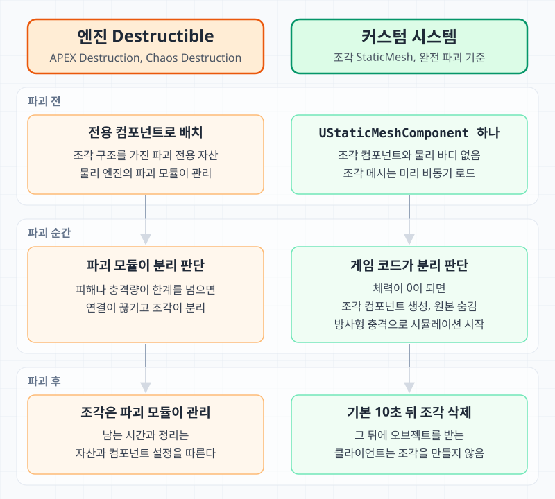
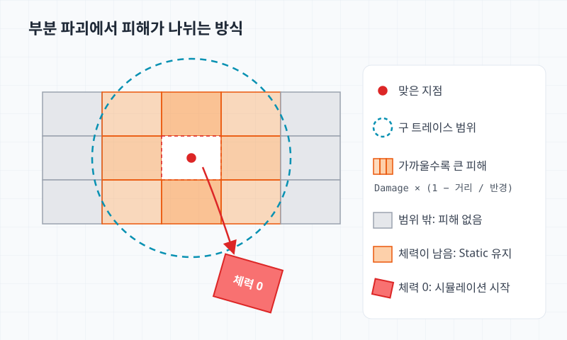

[Night of the Dead](/projects/night-of-the-dead/)의 월드에는 부술 수 있는 오브젝트가 많다. 나무와 덤불 같은 식생, 필드에 놓인 오브젝트, 던전의 구조물이 무기나 차량에 맞아 부서진다. 차량과 일부 아이템도 부서질 때 파편을 남긴다.

UE4에서는 PhysX 기반의 APEX Destruction으로 이 오브젝트들을 처리했는데, 원인을 알 수 없는 에러가 너무 많이 발생했다. 그래서 우리가 직접 제어할 수 있도록 필요한 기능만 최소한으로 구현한 파괴 시스템으로 바꿨고([개발 업데이트 #10](https://steamcommunity.com/games/1377380/announcements/detail/3711572693139781185)), 실제로 파괴할 때의 프레임 저하도 많이 줄었다.

이후 [개발 업데이트 #15](https://store.steampowered.com/news/app/1377380/view/3888357282609115394)에서 UE5로 이전하면서 물리 엔진이 PhysX에서 Chaos로 바뀌었다. UE5에는 PhysX와 함께 APEX Destruction도 빠졌고, 엔진의 파괴 기능은 Chaos Destruction이 맡는다. 하지만 당시 Chaos Destruction은 다루기 어려웠고 성능 문제도 있었다. 그래서 Chaos Destruction으로 옮기지 않고 UE4에서 만든 시스템을 그대로 가져갔다. 이 시스템의 조각은 일반 `UStaticMeshComponent`이고 코드가 APEX나 PhysX API를 직접 호출하지 않아서, 물리 엔진이 바뀌어도 파괴 로직을 다시 짤 필요가 없었다.

이 글은 엔진 Destructible과 커스텀 시스템의 구조를 일반화해 비교하고, 프레임 저하가 줄어든 이유를 구조에서 짚어 본다.

## 엔진 Destructible과 커스텀 시스템

APEX Destruction과 Chaos Destruction은 구현이 다르지만 큰 흐름은 비슷하다. 원본 메시를 에디터에서 미리 분할해 파괴 전용 자산을 만든다. UE4는 Destructible Mesh, UE5는 Geometry Collection이다. 조각들은 이 자산과 전용 컴포넌트 하나에 묶여 배치되고, 어떤 조각이 언제 떨어질지는 물리 엔진의 파괴 모듈이 정한다.

Chaos Destruction의 경우 Geometry Collection을 처음에 하나의 강체 클러스터로 시뮬레이션한다. 조각 사이에는 연결 그래프와 strain 값이 있고, 충돌이나 Physics Field가 연결 한계를 넘는 충격량을 가하면 연결이 끊어진다. APEX Destruction은 컴포넌트에 가한 피해가 자산에 설정한 피해 한계를 넘으면 조각을 분리한다.

커스텀 시스템은 이 역할을 게임 코드로 가져왔다.

| 항목 | 엔진 Destructible (APEX, Chaos) | 커스텀 시스템 |
| --- | --- | --- |
| 조각 자산 | 에디터에서 분할한 전용 자산 하나 | Blender에서 나눈 조각 StaticMesh 목록 |
| 파괴 전 배치 | 조각 구조를 가진 전용 컴포넌트 | 원본 `UStaticMeshComponent` 하나 |
| 조각 분리 판단 | 파괴 모듈 (피해 한계, 연결 strain) | 게임 코드 (조각별 체력과 거리 감쇠) |
| 조각의 물리 | 파괴 모듈이 관리하는 강체 | `UStaticMeshComponent`의 물리 시뮬레이션 |
| 파괴 후 조각 | 자산과 컴포넌트 설정에 따른다 | 일정 시간 뒤 조각 컴포넌트 삭제 |
| 물리 엔진 교체 | 파괴 모듈 자체가 바뀐다 (APEX에서 Chaos로) | 조각 코드는 그대로 |

엔진 방식은 분할과 분리 판단을 엔진에 맡기는 대신, 문제가 생기면 원인이 엔진 모듈 안에 있을 수 있다. 커스텀 시스템은 필요한 기능만 두고, 조각이 생기고 움직이고 사라지는 시점을 모두 게임 코드에서 정한다.



## 조각 데이터

조각은 Blender에서 원본 메시를 미리 잘라 만든 StaticMesh다. 조각마다 다음 정보를 둔다.

```cpp
USTRUCT()
struct FFragmentData
{
	GENERATED_BODY()

	UPROPERTY(EditAnywhere)
	TSoftObjectPtr<UStaticMesh> Mesh;

	// 부분 파괴에서 이 체력이 0이 되면 조각이 떨어져 나간다.
	UPROPERTY(EditAnywhere)
	float MaxHealth = 20.f;

	// 피해와 충격을 받지 않고 제자리에 남는 조각
	UPROPERTY(EditAnywhere)
	bool bIgnoreDamage = false;

	// 부분 파괴에서는 움직이지 않고 완전 파괴 때만 시뮬레이션하는 조각
	UPROPERTY(EditAnywhere)
	bool bSimulateOnlyOnFullDestruction = true;

	UPROPERTY(EditAnywhere)
	float MassScale = 1.f;
};
```

조각 메시는 소프트 레퍼런스로 두고, 액터가 월드에 들어오면 높은 우선순위로 비동기 로드한다. 파괴되는 순간에는 메시가 이미 메모리에 있다.

## 완전 파괴

부분 파괴를 켜지 않은 오브젝트는 체력이 다 닳았을 때 한 번에 부서진다. 이런 오브젝트는 파괴 전에 조각 컴포넌트를 만들지 않는다. 월드에 있는 동안은 원본 `UStaticMeshComponent` 하나다.

체력이 0이 되면 그때 조각 데이터로 `UStaticMeshComponent`를 만들어 붙이고, 원본 메시의 표시와 충돌을 끈다. 이후 조각에 물리 시뮬레이션을 켜고 조각 전체의 바운드 중심에서 방사형 충격을 준다.

```cpp
void UFragmentDestructionComponent::DestructAll()
{
	if (bDestructed)
	{
		return;
	}
	bDestructed = true;

	for (UFragmentMeshComponent* Fragment : Fragments)
	{
		Fragment->SetMobility(EComponentMobility::Movable);
		Fragment->SetVisibility(true);
		Fragment->SetCollisionEnabled(ECollisionEnabled::QueryAndPhysics);
		// 캐릭터는 조각에 막히지 않는다.
		Fragment->SetCollisionResponseToChannel(ECC_Pawn, ECR_Ignore);
		Fragment->SetCullDistance(FragmentCullDistance);

		if (!Fragment->IgnoresDamage())
		{
			Fragment->SetSimulatePhysics(true);
			Fragment->AddRadialImpulse(ImpulseOrigin, ImpulseRadius, ImpulseStrength, RIF_Linear);
		}
	}
}
```

캐릭터는 조각과 충돌하지 않는다. 오브젝트에 따라 조각끼리의 충돌도 끌 수 있고, 조각의 컬링 거리도 따로 지정할 수 있다.

조각은 기본 10초 동안 남는다. 그 뒤 서버가 모든 클라이언트에 조각 삭제를 멀티캐스트하고, 복제되는 파괴 상태 값을 켠다. 그 뒤에 이 오브젝트를 처음 받는 클라이언트는 이 값만 보고 원본 메시를 숨기며, 조각은 만들지 않는다.

조각 컴포넌트는 복제되지 않는다. 서버는 파괴 시점과 충격 위치만 알리고, 각 클라이언트가 자기 조각을 따로 시뮬레이션한다.

## 부분 파괴

맞은 부분만 떨어져 나가야 하는 오브젝트는 부분 파괴를 켠다. 이 경우에는 메시를 로드한 직후 조각 컴포넌트를 미리 만들고 원본 메시를 숨긴다. 조각은 `Static` 모빌리티에 물리 시뮬레이션이 꺼진 상태로 시작한다.

서버가 피해를 받으면 맞은 위치와 법선, 피해량을 멀티캐스트한다. 각 머신은 그 위치에서 `ECC_Destructible` 채널로 구 트레이스를 한 번 하고, 걸린 조각 중 이 오브젝트의 조각에만 피해를 나눈다.



```cpp
void UFragmentDestructionComponent::DestructPartially(const FVector& HitPoint, const FVector& HitNormal, float Damage)
{
	TArray<FHitResult> Hits;
	SweepFragments(HitPoint, HitNormal, PartialRadius, Hits);

	for (const FHitResult& Hit : Hits)
	{
		auto* Fragment = Cast<UFragmentMeshComponent>(Hit.GetComponent());
		if (Fragment == nullptr || Hit.GetActor() != GetOwner())
		{
			continue;
		}

		// 맞은 지점에서 멀수록 피해가 선형으로 줄어든다.
		const float Falloff = 1.f - FVector::Dist(Hit.ImpactPoint, HitPoint) / PartialRadius;
		const float FragmentDamage = Damage * Falloff;
		Fragment->ApplyDamage(FragmentDamage);

		// 체력이 0이 된 조각만 떨어져 나간다.
		if (Fragment->CanDetach())
		{
			Fragment->SetMobility(EComponentMobility::Movable);
			Fragment->SetSimulatePhysics(true);

			const float Strength = FMath::Min(FragmentDamage * DamageToImpulse, MaxPartialImpulse);
			Fragment->AddRadialImpulse(ImpulseOrigin, ImpulseRadius, Strength, RIF_Constant);
		}
	}
}
```

`CanDetach()`는 피해를 무시하는 조각, 완전 파괴 때만 움직이는 조각, 체력이 남은 조각을 걸러 낸다. 충격의 세기는 피해량에 비례하되 상한을 둔다. 조각 컴포넌트는 `AddImpulse()`도 재정의해서, 속도가 기준(기본 초속 26m) 이상인 조각에는 그 경로로 들어오는 충격을 더하지 않는다.

## 연출 전용 파편

차량과 부서지는 아이템은 같은 조각 컴포넌트를 연출 전용 경로로 쓴다. 이 경로는 클라이언트에서만 동작한다.

- 아이템이 부서졌다는 이벤트를 받거나 차량이 파괴되면, 클라이언트가 로컬에서 복제되지 않는 파편 액터를 스폰한다.
- 파편 액터가 조각 컴포넌트를 만들고 바로 완전 파괴를 실행한다.
- Dedicated Server와 렌더링 디테일이 낮음인 클라이언트에서는 파편을 만들지 않는다.
- 조각 메시를 미리 비동기 로드해 두고, 파괴 시점까지 로드가 끝나지 않았으면 설정에 따라 동기 로드하거나 연출을 건너뛴다.

파편이 남는 시간은 게임 상황을 보고 정한다.

```cpp
float ACosmeticDebrisActor::GetLifeSpanFor(const FOptimizeStatus& Status, float DefaultLifeSpan) const
{
	// 프레임이 크게 떨어졌거나 웨이브 규모가 크면 파편을 만들지 않는다.
	if (Status.FPS <= 15 || IsLargeWave(Status))
	{
		return 0.f;
	}

	return DefaultLifeSpan;
}
```

결과가 0이면 조각을 만들지 않고 파편 액터를 바로 제거한다. 그렇지 않으면 기본 10초의 수명을 두고 조각을 만든다.

## 프레임 저하가 줄어든 이유

### 부서지지 않은 오브젝트가 가볍다

월드의 파괴 오브젝트는 대부분 부서지지 않은 상태로 놓여 있다. 커스텀 시스템에서 이 상태의 오브젝트는 `UStaticMeshComponent` 하나다. 완전 파괴만 쓰는 오브젝트는 조각 컴포넌트도, 조각의 물리 바디도 아직 없다.

엔진 Destructible은 파괴 전부터 조각 구조를 가진 전용 컴포넌트로 배치된다. UE4의 `UDestructibleComponent`는 `USkinnedMeshComponent`를 상속해 조각을 본처럼 그린다. 같은 오브젝트라도 스킨드 메시보다 일반 스태틱 메시로 그리는 쪽이 렌더링 비용이 낮고, 오브젝트 수가 많을수록 이 차이가 커진다.

### 조각 비용이 상한을 가진다

완전 파괴의 조각은 부서진 오브젝트에만 생기고 기본 10초 뒤 삭제된다. 그래서 동시에 시뮬레이션되는 조각 수는 대체로 최근에 부서진 오브젝트 수에 묶인다. 조각이 삭제된 뒤 오브젝트를 받은 클라이언트는 조각을 만들지 않는다.

조각이 캐릭터와 충돌하지 않고 필요하면 조각끼리도 충돌하지 않으므로, 조각이 늘어도 접촉 계산이 그만큼 늘지 않는다. 조각의 물리 시뮬레이션과 접촉 계산은 CPU 비용이므로, 파괴가 몰리는 순간의 CPU 비용도 이 범위 안에 묶인다.

### 분리 판단이 단순하다

부분 파괴의 분리 판단은 구 트레이스 한 번과 조각별 체력 비교다. 연결 그래프나 strain을 평가하지 않는다. 조각이 떨어지기 전까지는 `Static` 모빌리티에 시뮬레이션이 꺼져 있어 시뮬레이션 비용이 들지 않는다.

### 부하가 큰 상황에서는 연출을 생략한다

서버는 연출 전용 파편을 만들지 않는다. 클라이언트도 저사양 설정이나 프레임이 떨어진 상황, 큰 웨이브에서는 파편을 만들지 않는다. 파괴 순간에는 조각 메시가 이미 로드되어 있어 로딩으로 인한 정지도 피한다.

## 참고 자료

- [Destruction Overview in Unreal Engine](https://dev.epicgames.com/documentation/unreal-engine/destruction-overview)
- [Creating a Destructible Object in Unreal Engine 4 & Blender - Kids With Sticks](https://kidswithsticks.com/creating-a-destructible-object-in-unreal-engine-4-blender/)
