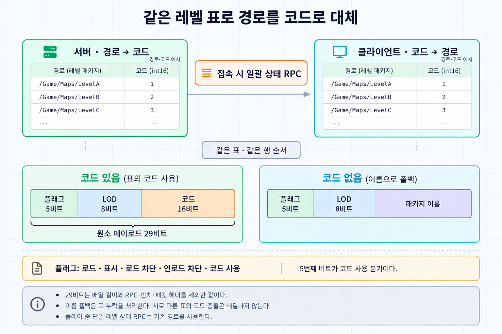
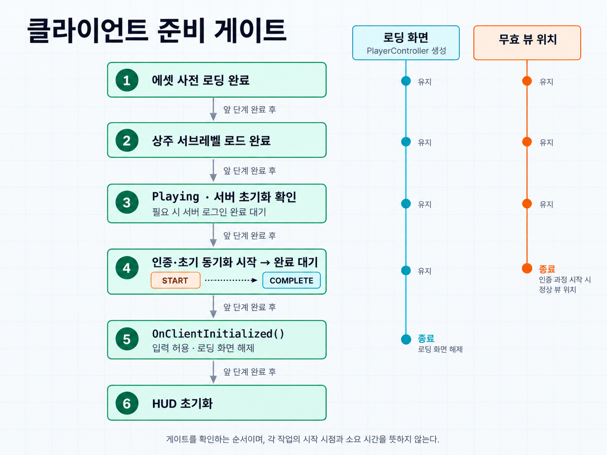

클라이언트가 서버에 접속하면 엔진은 현재 스트리밍 레벨들의 상태를 한 번에 알려 준다. `AGameModeBase::ReplicateStreamingStatus()`가 월드의 모든 스트리밍 레벨을 순회하며 상태 배열을 만들고, `ClientUpdateMultipleLevelsStreamingStatus()`라는 Reliable Client RPC로 보낸다.

배열의 원소는 `FUpdateLevelStreamingLevelStatus`다. 로드 여부와 표시 여부 같은 플래그 몇 개, LOD 인덱스, 그리고 레벨의 패키지 이름(`FName`)이 들어 있다. 패키지 이름은 `/Game/Maps/...`로 시작하는 긴 경로이고 네트워크에서는 문자열로 전송된다.

[Night of the Dead](/projects/night-of-the-dead/)는 오픈월드라 스트리밍 레벨 수가 많았다. 접속할 때마다 레벨 수만큼의 경로 문자열이 Reliable RPC 하나에 실렸다. 이 RPC가 여러 번치로 쪼개져 접속 직후의 Reliable 버퍼를 차지하면서 실제로 버퍼가 넘쳤다. 내용 대부분은 서버와 클라이언트가 이미 똑같이 알고 있는 문자열이어서, 반복해서 보내는 경로를 코드로 대체했다.

이 글의 코드는 구조를 설명하기 위해 새로 작성한 예시이며 프로젝트의 실제 코드와는 이름과 세부가 다르다.

## 경로 대신 코드를 보낸다

스트리밍 레벨의 목록은 빌드에 고정돼 있다. 양쪽이 같은 표를 가지고 있으면 경로 대신 표의 번호만 보내면 된다.

레벨 에셋을 한 행에 하나씩 담은 DataTable을 만들고, 게임 인스턴스 서브시스템이 시작할 때 이 표를 읽어 양방향 맵을 만든다. 코드는 행 순서에 1을 더한 값이다. 0은 "코드 없음"으로 남겨 둔다.

```cpp
void ULevelStatusCoderSubsystem::BuildCodeMaps(const UDataTable* Table)
{
	TArray<FLevelCodeRow*> Rows;
	Table->GetAllRows(FString(), Rows);

	NameToCode.Empty(Rows.Num());
	CodeToName.Empty(Rows.Num());

	for (int32 Index = 0; Index < Rows.Num(); ++Index)
	{
		if (Rows[Index]->Level.IsNull())
		{
			continue;
		}

		const int16 Code = static_cast<int16>(Index + 1);
		const FName PackageName(*Rows[Index]->Level.GetLongPackageName());

		NameToCode.Add(PackageName, Code);
		CodeToName.Add(Code, PackageName);
	}
}
```

## 전송용 구조체

엔진의 구조체를 직접 고칠 수는 없으므로 같은 내용을 담는 전송용 구조체를 따로 두고 커스텀 `NetSerialize`를 붙였다.

```cpp
USTRUCT()
struct FCodedLevelStatus
{
	GENERATED_BODY()

	UPROPERTY()
	FName PackageName;

	UPROPERTY()
	int16 Code = 0;

	UPROPERTY()
	int8 LODIndex = 0;

	UPROPERTY()
	bool bShouldBeLoaded = false;

	UPROPERTY()
	bool bShouldBeVisible = false;

	UPROPERTY()
	bool bShouldBlockOnLoad = false;

	UPROPERTY()
	bool bShouldBlockOnUnload = false;

	bool NetSerialize(FArchive& Ar, UPackageMap* Map, bool& bOutSuccess)
	{
		const bool bHasCode = Ar.IsSaving() && Code != 0;

		uint8 Flags = 0;
		Flags |= bShouldBeLoaded << 0;
		Flags |= bShouldBeVisible << 1;
		Flags |= bShouldBlockOnLoad << 2;
		Flags |= bShouldBlockOnUnload << 3;
		Flags |= bHasCode << 4;
		Ar.SerializeBits(&Flags, 5);

		bShouldBeLoaded = (Flags & (1 << 0)) != 0;
		bShouldBeVisible = (Flags & (1 << 1)) != 0;
		bShouldBlockOnLoad = (Flags & (1 << 2)) != 0;
		bShouldBlockOnUnload = (Flags & (1 << 3)) != 0;

		Ar << LODIndex;

		if ((Flags & (1 << 4)) != 0)
		{
			Ar << Code;
			if (Ar.IsLoading())
			{
				PackageName = NAME_None;
			}
		}
		else
		{
			Ar << PackageName;
			if (Ar.IsLoading())
			{
				Code = 0;
			}
		}

		bOutSuccess = true;
		return true;
	}
};

template<>
struct TStructOpsTypeTraits<FCodedLevelStatus> : public TStructOpsTypeTraitsBase2<FCodedLevelStatus>
{
	enum
	{
		WithNetSerializer = true,
	};
};
```

원소 하나의 `NetSerialize`가 쓰는 내용은 다음과 같다.

| 필드 | 크기 |
| --- | --- |
| 플래그 넷과 "코드 사용" 비트 | 5비트 |
| LOD 인덱스 | 8비트 |
| 코드가 있을 때: 레벨 코드 | 16비트 |
| 코드가 없을 때: 패키지 이름 | 문자열 |

코드가 있는 원소의 페이로드는 29비트다. 배열 길이와 RPC, 번치, 패킷의 헤더는 제외한 값이며, 전체 전송량이나 측정된 절감률을 뜻하지 않는다. 바뀐 부분은 각 원소에서 긴 경로 문자열을 16비트 코드로 대체한 것이다.



엔진의 LOD 인덱스는 `int32`지만 전송용 구조체에서는 `int8`로 줄였다. 실제 `Encode()`는 상한을 넘는 값을 `MAX_int8`로 제한한다. 원래 값을 그대로 보존하려면 사용하는 LOD 값이 `int8` 범위 안에 있어야 한다.

### 표에 없는 레벨은 그대로 보낸다

다섯 번째 비트는 표에 없는 레벨을 처리하기 위한 분기다. 표에 등록되지 않은 레벨은 코드가 0이고, 이때는 원래대로 패키지 이름을 보낸다. 레벨을 추가하고 표 갱신을 잊으면 그 레벨만 압축되지 않는다. 서버는 코드가 없는 레벨을 만나면 경고 로그를 남겨 누락을 알 수 있게 했다. 이 폴백은 표에 없는 이름을 처리할 뿐, 양쪽 표에서 같은 코드가 서로 다른 레벨을 가리키는 문제까지 해결하지는 않는다.

표를 갖추지 않은 맵으로 테스트할 때를 위해 이 경고를 끄는 설정도 두었다.

## 엔진 함수 교체

`ReplicateStreamingStatus()`는 가상 함수다. 엔진 구현을 그대로 옮긴 뒤 RPC를 호출하는 부분만 바꿨다.

```cpp
void AMyGameMode::ReplicateStreamingStatus(APlayerController* PC)
{
	// ... 엔진 구현과 동일하게 LevelStatuses를 채운다 ...

	if (AMyPlayerController* MyPC = Cast<AMyPlayerController>(PC))
	{
		TArray<FCodedLevelStatus> Coded;
		Coded.Reserve(LevelStatuses.Num());
		for (const FUpdateLevelStreamingLevelStatus& Status : LevelStatuses)
		{
			Coded.Add(Coder->Encode(Status));
		}

		MyPC->ClientUpdateCodedLevelStatuses(Coded);
	}
	else
	{
		PC->ClientUpdateMultipleLevelsStreamingStatus(LevelStatuses);
	}

	PC->ClientFlushLevelStreaming();
}
```

클라이언트는 받은 배열을 엔진의 구조체로 되돌린 뒤 엔진의 처리 함수를 그대로 호출한다. 레벨 스트리밍 로직 자체는 건드리지 않는다.

```cpp
void AMyPlayerController::ClientUpdateCodedLevelStatuses_Implementation(const TArray<FCodedLevelStatus>& Coded)
{
	TArray<FUpdateLevelStreamingLevelStatus> Decoded;
	Decoded.Reserve(Coded.Num());
	for (const FCodedLevelStatus& Status : Coded)
	{
		Decoded.Add(Coder->Decode(Status));
	}

	ClientUpdateMultipleLevelsStreamingStatus_Implementation(Decoded);
}
```

바꾼 범위는 접속 시의 일괄 전송 하나다. 플레이 중 레벨 하나의 상태가 바뀔 때 가는 RPC는 엔진 경로를 그대로 쓴다.

## 주의할 점

- 코드는 DataTable의 행 순서에 따라 정해진다. 같은 표와 같은 행 순서를 양쪽 빌드에 포함해야 한다. 표가 다르면 같은 코드로 다른 레벨을 복원할 수 있으므로, 호환되지 않는 빌드의 접속은 별도로 막아야 한다.
- 엔진 함수를 통째로 옮겼기 때문에 엔진을 올릴 때 원본의 변경을 직접 따라가야 한다. `FUpdateLevelStreamingLevelStatus`에 필드가 추가되면 전송용 구조체에도 반영해야 한다.
- 코드의 타입은 `int16`이다. 1부터 시작하는 양수 코드를 유지하려면 표의 행 수는 32,767 이하이어야 한다. 원본은 `int32`로 만든 코드를 전송용 필드에 대입하므로, 이 범위는 표를 검증할 때 확인해야 한다.

## 접속 과정에서의 위치

이 RPC는 접속 과정의 한 단계일 뿐이다. 클라이언트가 실제로 플레이할 수 있게 되기까지는 다음 조건을 순서대로 통과해야 했다. PlayerController가 매 틱 플래그를 확인하고, 앞 단계가 끝나지 않았으면 뒤 단계로 넘어가지 않는다.

1. 에셋 사전 로딩 완료
2. 상주 서브레벨 로드 완료
3. 클라이언트 초기화: Playing 상태와 서버 초기화 플래그를 확인하고, 필요한 경우 서버 로그인 완료를 기다린다.
4. 인증·초기 동기화 과정 시작과 완료 대기
5. `OnClientInitialized()`에서 입력 허용과 로딩 화면 해제
6. HUD 초기화

로딩 화면은 PlayerController가 만들어지는 시점부터 띄우고 5번에서 내린다. 뷰 위치를 무효한 값으로 돌려주는 기간은 이보다 짧다. 게임용 PlayerController에서 `LoginAuthComponent->IsProcessBegun()`이 참이 될 때까지 무효한 위치를 반환하고, 인증·초기 동기화가 시작되면 정상 뷰 위치를 사용한다. 임시 스폰 위치를 기준으로 주변 레벨이 스트리밍되거나 주변 액터가 복제 대상으로 잡히는 일을 막기 위한 처리다.



### 에셋 사전 로딩

1번 게이트는 플레이 중 첫 사용 시점에 생기던 로딩을 접속 시점으로 옮기는 단계다. 소프트 참조로 둔 애니메이션과 이펙트를 좀비가 처음 등장하거나 처음 피격되는 순간에 로드하면 끊김이 생긴다.


레벨에 배치한 프리로더 액터가 네 단계를 비동기로 이어서 처리한다.

1. 데이터 테이블에서 수집한 이펙트, 사운드, 플레이어 애니메이션
2. `UPreloadDataAsset`에 명시한 에셋과 블루프린트 클래스. 목록 에셋을 하나씩 순서대로 처리하되, 각 목록 안의 에셋과 클래스는 `LoadAssetList()`로 함께 요청한다.
3. 2번에서 로드된 에셋이 다시 참조하는 2차 에셋. 해당 에셋 타입이 "내가 필요로 하는 에셋 목록"을 돌려주는 인터페이스를 구현한다.
4. 2번에서 로드된 클래스의 CDO가 지연 로딩하는 에셋. 클래스를 하나씩 처리하고, 각 CDO가 필요한 에셋 목록을 비동기로 로드한다. 좀비 클래스가 자기 공격, 피격 애니메이션 목록을 직접 알려 주는 식이다.

1·3단계는 수집한 경로 목록을 묶어 비동기 로드를 요청한다. 로드된 객체는 프리로더가 하드 참조로 쥐고 있어 GC에 수거되지 않는다. 첫 사용 시점의 로딩을 줄이는 대신 접속 대기 시간과 상주 메모리를 부담하는 선택이며, 총 로딩 작업량을 줄이는 방법은 아니다.

Dedicated Server는 2단계에 별도의 목록을 쓴다. 서버에 필요한 목록을 분리해 클라이언트용 에셋이 그대로 로드되는 일을 줄일 수 있다. 다만 1단계의 이펙트·사운드·플레이어 애니메이션 수동 수집은 별도 설정으로 제어하므로, 서버용 목록을 쓴다는 이유만으로 모든 시각·음향 에셋이 제외되지는 않는다. 서버는 GameMode의 `BeginPlay()`에서 프리로더를 돌린 뒤 게임을 시작한다.

클라이언트에는 사전 로딩 수준 옵션이 있다. `UPreloadDataAsset`에 지정한 `MinPreloadLevel`보다 옵션이 낮으면 해당 목록 전체를 건너뛴다. 개별 에셋마다 적용하는 필터는 아니며, Dedicated Server는 이 수준 필터를 적용하지 않는다.

2단계의 진행률은 완료한 목록 수를 전체 목록 수로 나눈 값이다. 목록 하나가 끝날 때마다 로딩 화면을 갱신하지만, 그 안의 개별 에셋 크기나 로딩 시간을 반영한 진행률은 아니다.

## 참고 자료

- [Level Streaming in Unreal Engine](https://dev.epicgames.com/documentation/en-us/unreal-engine/level-streaming-in-unreal-engine)
- [Asynchronous Asset Loading in Unreal Engine](https://dev.epicgames.com/documentation/en-us/unreal-engine/asynchronous-asset-loading-in-unreal-engine)
