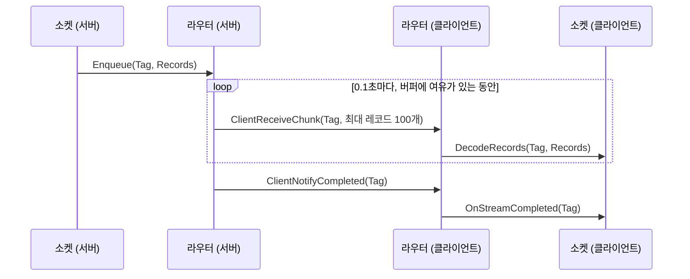
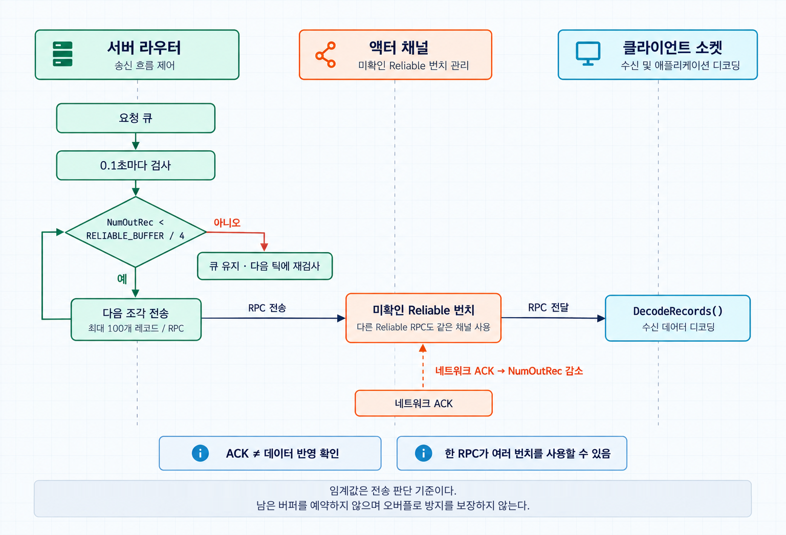
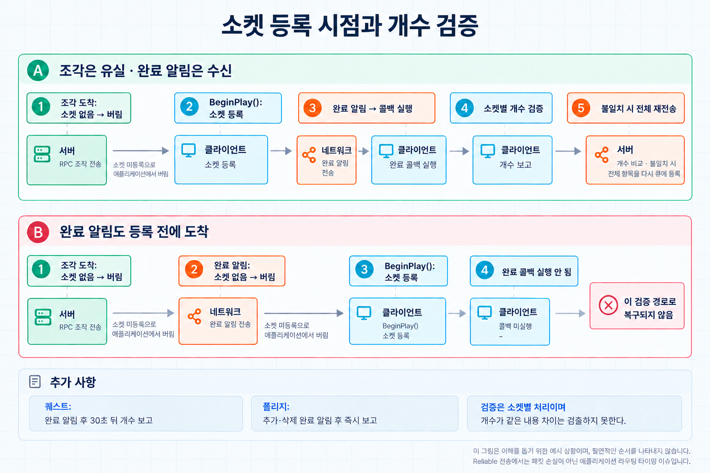

[Night of the Dead](/projects/night-of-the-dead/)에는 플레이어 한 명에게만 필요하고, 플레이할수록 계속 쌓이는 데이터가 있었다. 퀘스트 진행도, 해금한 건물, 지도에 찍은 마커, 걷어 낸 지도 안개 같은 것들이다. 접속할 때는 누적된 내용을 한꺼번에 받아야 하고, 이후에는 조금씩 바뀐다.


이 데이터를 Reliable RPC 하나에 담아 보내면 문제가 생긴다. 엔진은 액터 채널마다 아직 수신 확인을 받지 못한 Reliable 번치를 정해진 개수(`RELIABLE_BUFFER`)까지만 쌓아 둔다. 큰 RPC는 여러 개의 부분 번치로 쪼개져 이 버퍼를 차지하고, 버퍼가 넘치면 엔진은 복구하지 않고 연결을 닫는다.

그래서 데이터를 잘게 나누고, 버퍼에 여유가 있을 때 다음 조각을 보내는 전송 경로를 만들었다. 누적 데이터의 크기보다 한 번에 쌓이는 전송량을 제어하는 데 초점을 뒀다. 이 글의 코드는 구조를 설명하기 위해 새로 작성한 예시이며 프로젝트의 실제 코드와는 이름과 세부가 다르다.

## 구조

구성 요소는 셋이다.

- 라우터: 플레이어 캐릭터에 붙는 컴포넌트다. 서버에서는 전송 요청을 큐에 쌓아 나눠 보내고, 클라이언트에서는 받은 조각을 태그에 맞는 소켓으로 넘긴다.
- 소켓: 데이터를 실제로 가진 컴포넌트가 구현하는 인터페이스다. 자기 데이터를 바이트 배열로 인코딩하고, 받은 바이트 배열을 디코딩한다.
- 레코드: 항목 하나를 직렬화한 바이트 배열이다. 라우터는 내용을 해석하지 않는다.

```cpp
USTRUCT()
struct FStreamRecord
{
	GENERATED_BODY()

	UPROPERTY()
	TArray<uint8> Bytes;
};

class IStreamSocket
{
	GENERATED_BODY()

public:
	// 이 소켓이 처리하는 태그 목록
	virtual const TArray<FGameplayTag>& GetStreamTags() const = 0;

	// 클라이언트: 레코드 묶음을 받아 자기 상태에 반영한다.
	virtual void DecodeRecords(const FGameplayTag& Tag, const TArray<FStreamRecord>& Records) = 0;

	// 클라이언트: 해당 태그의 전송이 끝났다.
	virtual void OnStreamCompleted(const FGameplayTag& Tag) = 0;
};
```

라우팅 키는 `FGameplayTag`다. 퀘스트 컴포넌트는 진행, 완료, 포기 태그를, 마커 컴포넌트는 추가, 수정, 삭제, 초기화 태그를 등록한다. 태그가 곧 "이 레코드를 어떻게 해석할 것인가"를 정하므로 레코드 안에 종류 구분을 넣을 필요가 없다.

소켓은 소유자 역할이 Authority이거나 Autonomous Proxy일 때만 라우터에 등록한다. 다른 플레이어의 캐릭터에서는 등록하지 않으므로 이 경로는 서버에서 소유 클라이언트로만 흐른다.



## 전송 루프

서버의 라우터는 요청마다 "몇 번째 조각까지 보냈는가"만 기억한다. 프로젝트 코드의 기본 설정은 0.1초 간격의 틱과 조각당 최대 100개 레코드다. 틱에서 큐를 돌며 보낼 수 있는 만큼 보낸다.

```cpp
struct FStreamRequest
{
	FGameplayTag Tag;
	TArray<FStreamRecord> Records;
	int32 ChunksSent = 0;

	int32 GetNumChunks(int32 ChunkSize) const
	{
		return FMath::DivideAndRoundUp(Records.Num(), ChunkSize);
	}
};

void UStreamRouterComponent::TickComponent(float DeltaTime, ELevelTick TickType, FActorComponentTickFunction* ThisTickFunction)
{
	Super::TickComponent(DeltaTime, TickType, ThisTickFunction);

	if (GetOwnerRole() != ROLE_Authority)
	{
		return;
	}

	UNetConnection* Connection = GetOwner()->GetNetConnection();
	const UActorChannel* Channel = Connection ? Connection->FindActorChannelRef(GetOwner()) : nullptr;
	if (Channel == nullptr)
	{
		return;
	}

	const int32 ChunkSize = 100;
	const int32 OutRecLimit = RELIABLE_BUFFER / 4;

	for (FStreamRequest& Request : Requests)
	{
		const int32 NumChunks = Request.GetNumChunks(ChunkSize);
		while (Request.ChunksSent < NumChunks && Channel->NumOutRec < OutRecLimit)
		{
			const int32 Start = Request.ChunksSent * ChunkSize;
			const int32 Count = FMath::Min(ChunkSize, Request.Records.Num() - Start);

			ClientReceiveChunk(Request.Tag, TArray<FStreamRecord>(Request.Records.GetData() + Start, Count));
			++Request.ChunksSent;
		}
	}

	for (int32 Index = Requests.Num() - 1; Index >= 0; --Index)
	{
		if (Channel->NumOutRec >= OutRecLimit)
		{
			break;
		}

		if (Requests[Index].ChunksSent >= Requests[Index].GetNumChunks(ChunkSize))
		{
			ClientNotifyCompleted(Requests[Index].Tag);
			Requests.RemoveAt(Index);
		}
	}
}
```

`ClientReceiveChunk`와 `ClientNotifyCompleted`는 라우터 컴포넌트의 Reliable Client RPC다. 컴포넌트의 RPC는 소유 액터의 채널로 나가므로 라우터가 확인하는 채널과 실제로 번치가 쌓이는 채널이 같다.

### 흐름 제어에 쓰는 값

`UActorChannel::NumOutRec`은 그 채널에서 보냈지만 아직 수신 확인을 받지 못한 Reliable 번치의 수다. 네트워크 ACK를 받으면 줄어든다. 별도의 ack RPC 없이 전송 큐의 밀린 정도를 볼 수 있지만, 클라이언트가 레코드를 디코딩하거나 게임 상태에 반영했는지는 알 수 없다.

전송을 멈추는 임계값은 버퍼 전체가 아니라 4분의 1로 잡았다. 같은 채널로 캐릭터의 다른 Reliable RPC도 나가기 때문이다. 스트리밍이 버퍼를 다 채우면 그 순간 발생한 게임플레이 RPC가 연결을 끊는 원인이 된다. 낮은 임계값은 다른 RPC가 들어올 여유를 두기 위한 선택이며, 나머지 4분의 3을 예약하는 기능은 아니다.

ACK가 늦게 오는 연결에서는 `NumOutRec`이 천천히 줄고, 그만큼 다음 조각도 늦게 나간다. 고정된 틱 간격과 조각 크기 안에서 전송을 계속할지를 채널 상태로 판단한다.

다만 확인하는 것은 이미 큐에 쌓인 번치 수다. 다음 RPC가 몇 바이트이고 몇 개 번치로 나뉠지는 계산하지 않는다. 큰 조각 하나가 임계값을 넘어 버퍼를 채울 수도 있으므로 이 방식만으로 오버플로를 완전히 막을 수는 없다. 작은 레코드를 묶어 보내는 조건에서 순간적인 전송 집중을 완화하는 흐름 제어다.



### 전송 자체는 엔진에 맡긴다

이 구조에는 시퀀스 번호, 재조립 버퍼, 재전송 타이머가 없다. 같은 액터 채널의 Reliable RPC 순서와 재전송은 엔진에 맡기고 라우터는 "언제 보낼 것인가"를 정한다. 조각 하나는 최대 레코드 100개를 그대로 담은 RPC 한 번이라 클라이언트는 조각이 도착하는 대로 바로 디코딩할 수 있다. 나눠 보내는 것만으로 총 전송량이 줄어드는 것은 아니며, RPC 호출마다 전송 부가 정보도 붙는다.

접속 시의 일괄 전송과 플레이 중의 변경도 같은 경로를 쓴다. 소켓은 바뀐 항목을 버퍼에 모아 두었다가 틱에서 라우터에 넘긴다. 접속 시에는 버퍼에 전체가 들어 있고, 플레이 중에는 방금 바뀐 몇 개만 들어 있다는 차이뿐이다.

## 소켓 쪽 인코딩

레코드에는 항목을 복원하는 데 필요한 최소한만 넣는다. 퀘스트 진행도라면 퀘스트 ID, 목표 ID, 진행 수치다. 구조체의 `NetSerialize`를 `FMemoryWriter`에 대고 호출해 바이트 배열을 만든다.

```cpp
TArray<FStreamRecord> UQuestComponent::EncodePendingProgress()
{
	TArray<FStreamRecord> Records;
	Records.Reserve(PendingProgress.Num());

	for (FQuestProgressNet& Progress : PendingProgress)
	{
		FStreamRecord& Record = Records.AddDefaulted_GetRef();
		FMemoryWriter Writer(Record.Bytes);

		bool bSuccess = true;
		Progress.NetSerialize(Writer, nullptr, bSuccess);
	}

	PendingProgress.Reset();
	return Records;
}
```

클라이언트의 `DecodeRecords()`는 같은 구조체를 `FMemoryReader`로 읽어 조회용 맵에 반영한다. 지도 마커는 원래 복제 프로퍼티 배열이었는데 이 경로로 옮기면서 추가, 수정, 삭제를 각각의 태그로 나눴다.

## 개수로 검증하고 다시 보내기

Reliable RPC의 재전송은 도착한 조각을 애플리케이션이 반영하는 것까지 보장하지는 않는다. 클라이언트의 라우터는 태그에 등록된 소켓이 없으면 조각을 버린다. 소켓은 `BeginPlay()`에서 등록되므로, 등록 전에 도착한 조각은 사라진다. 완료 알림도 같은 방식으로 버린다.

퀘스트 소켓은 완료 알림을 받은 뒤 다음과 같이 개수를 확인한다.

1. 클라이언트는 `OnStreamCompleted()`를 받으면 30초 뒤 항목 수를 서버에 보고하도록 타이머를 등록한다.
2. 서버는 자신의 항목 수와 비교한다.
3. 다르면 전체 항목을 다시 버퍼에 채운다. 다음 틱에 같은 경로로 재전송된다.

내용을 비교하지 않고 개수만 본다. 해시나 항목별 비교에 비해 검출력은 낮지만, 조각이 빠져 항목 수가 달라진 경우는 검출할 수 있다. 폴리지 리스폰 포인트 소켓은 추가·삭제 태그의 완료 알림을 받으면 지연 없이 개수를 보고하고, 불일치하면 서버가 전체 새로고침 데이터를 보낸다. 반면 지도 마커 소켓의 완료 콜백은 비어 있고, 지도 안개 소켓은 받은 내용을 그리는 데 쓴다. 검증은 라우터의 공통 기능이 아니라 소켓별 처리다.

소켓이 등록되기 전에 일부 조각을 잃었더라도 완료 알림이 등록 후에 도착하면 이 검증에 진입할 수 있다. 완료 알림까지 등록 전에 버려지면 콜백이 실행되지 않으므로 이 경로만으로 복구되지 않는다.



## 같은 기준으로 피격 전파 고르기


`NumOutRec`을 읽는 방식은 스트리밍 밖에서도 썼다. 좀비가 피격될 때의 연출 전파다.

웨이브에서는 수많은 좀비가 동시에 맞는다. 이것을 Reliable Multicast로 보내면 모든 클라이언트의 Reliable 버퍼가 피격 이벤트로 채워진다. 전부 Unreliable로 보내면 바로 앞에서 때린 좀비의 피격 반응이 빠질 수 있다.

그래서 Multicast 대신 서버가 플레이어를 순회하며 거리와 채널 상태로 연결마다 따로 판단했다. 아래 표의 거리와 임계값은 프로젝트 코드의 기본 설정이다. 예시는 RPC가 나가는 수신자 캐릭터의 채널을 확인하도록 작성했다.

| 조건 | 처리 |
| --- | --- |
| 피격 대상과 300m 이상 떨어져 있음 | 보내지 않음 |
| 150m 미만이고 수신자 채널의 `NumOutRec`이 버퍼의 4분의 1 이하 | Reliable |
| 그 외 | Unreliable |

```cpp
void AMyCharacter::BroadcastHit(const FHitInfoNet& HitInfo)
{
	const int32 OutRecLimit = RELIABLE_BUFFER / 4;
	const double ReliableDistSq = FMath::Square(15000.0);
	const double SkipDistSq = FMath::Square(30000.0);

	for (FConstPlayerControllerIterator It = GetWorld()->GetPlayerControllerIterator(); It; ++It)
	{
		APlayerController* PlayerController = It->Get();
		AMyCharacter* Receiver = PlayerController ? Cast<AMyCharacter>(PlayerController->GetPawn()) : nullptr;
		UNetConnection* Connection = PlayerController ? PlayerController->GetNetConnection() : nullptr;
		if (Receiver == nullptr || Connection == nullptr)
		{
			continue;
		}

		const double DistSq = FVector::DistSquared(Receiver->GetActorLocation(), GetActorLocation());
		if (DistSq >= SkipDistSq)
		{
			continue;
		}

		const UActorChannel* Channel = Connection->FindActorChannelRef(Receiver);
		const bool bHasRoom = Channel && Channel->NumOutRec <= OutRecLimit;

		if (DistSq < ReliableDistSq && bHasRoom)
		{
			Receiver->ClientHandleHit_Reliable(this, HitInfo);
		}
		else
		{
			Receiver->ClientHandleHit_Unreliable(this, HitInfo);
		}
	}
}
```

RPC는 피격된 좀비가 아니라 수신자 자신의 캐릭터에서 호출한다. Client RPC는 소유 연결로만 가므로, 수신자가 소유한 액터를 통해야 연결마다 다른 신뢰성을 고를 수 있다. 피격 대상은 RPC의 인자로 넘긴다.

프로젝트 원본은 `PlayerController`의 채널을 확인하고 RPC는 `PlayerCharacter`에서 호출한다. 두 액터의 채널은 다르므로 원본의 값이 실제 피격 RPC가 쌓이는 큐를 나타내지는 않는다. 위 예시에서 `Receiver`의 채널을 확인한 것은 이 차이를 바로잡은 설명용 수정이며, 프로젝트에 적용한 변경으로 제시하는 것은 아니다.

선택 기준은 가까운 피격을 가능한 한 Reliable로 보내되, 검사한 채널의 버퍼가 차오르면 Unreliable로 낮추는 것이다. 피격 연출의 일부 유실을 허용하고 Reliable 전송이 계속 쌓이는 것을 피하려 했다. 이 연결별 Client RPC 경로는 몽타주 재생 경로와도 다르다. 몽타주의 일부 Multicast 경로는 가까운 플레이어가 한 명이라도 있으면 전체 호출을 Reliable로 고른다.

## 남은 제약

- 조각 크기를 레코드 개수로만 정한다. 퀘스트처럼 ID와 수치를 담는 작은 레코드에서는 다루기 쉽지만, 큰 레코드까지 지원하려면 조각의 바이트 크기와 다음 RPC가 사용할 번치 수를 고려해야 한다.
- 큐 앞쪽의 요청이 막히면 뒤쪽도 함께 기다린다. 태그별 우선순위가 없다.
- 검증은 개수만 본다. 개수가 같고 내용이 다른 경우는 잡지 못한다.
- 소켓 등록 전에 도착한 조각과 완료 알림을 잠시 보관했다가 등록 시점에 넘기면 이 등록 순서로 인한 유실을 피할 수 있다. 개수 검증과 별도로 보완할 부분이다.

## 참고 자료

- [Remote Procedure Calls in Unreal Engine](https://dev.epicgames.com/documentation/en-us/unreal-engine/remote-procedure-calls-in-unreal-engine)
- [Replicated Object Execution Order in Unreal Engine](https://dev.epicgames.com/documentation/en-us/unreal-engine/replicated-object-execution-order-in-unreal-engine)
- [UChannel API](https://dev.epicgames.com/documentation/en-us/unreal-engine/API/Runtime/Engine/UChannel)
