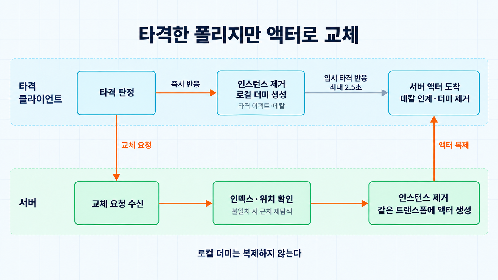
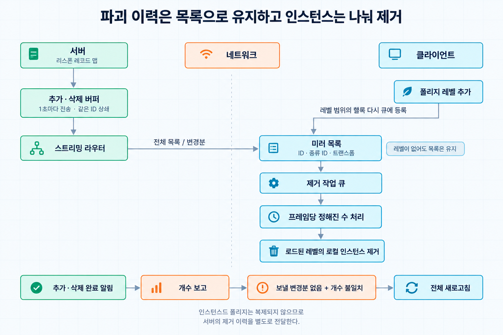
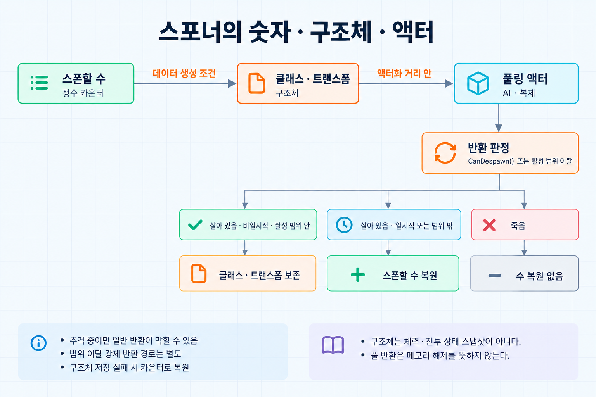
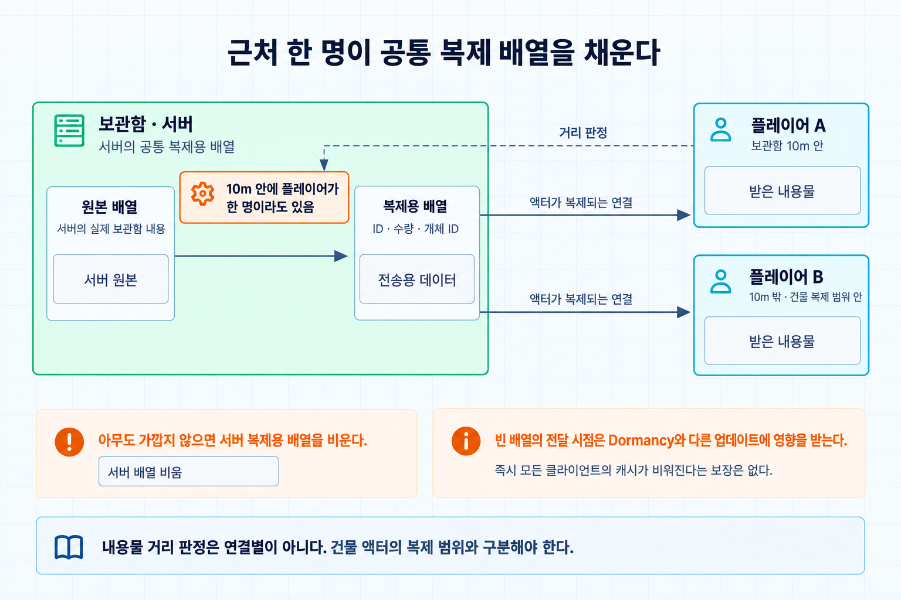

[Night of the Dead](/projects/night-of-the-dead/)의 맵에는 캘 수 있는 나무와 바위, 곳곳의 좀비 스포너, 플레이어가 지은 보관함과 농장이 있다. 이것들을 모두 복제되는 액터로 두면 서버의 액터 수는 플레이어 수와 무관하게 맵 크기에 비례해 늘어난다. 액터마다 틱, 복제 대상 검사, 채널 비용이 붙는다.

실제로 플레이어가 상호작용하는 것은 그중 일부다. 그래서 세 종류 모두 같은 방향으로 처리했다. 평소에는 가장 싼 표현으로 두고, 플레이어가 가까이 오거나 건드릴 때만 액터나 복제 데이터로 올린다.

| 대상 | 평소 | 필요할 때 |
| --- | --- | --- |
| 자연물 | 인스턴스드 폴리지의 인스턴스 | 타격받은 것만 액터 |
| 파괴된 자연물 | 매니저 맵의 구조체 | 리스폰 시 다시 액터 |
| 스포너의 좀비 | 정수 카운터, 구조체 | 플레이어 근처에서만 풀링 액터 |
| 보관함 내용물 | 서버에만 있는 배열 | 플레이어 근처에서만 복제용 배열 |

## 자연물: 인스턴스, 액터, 구조체


### 타격받은 것만 액터로

나무와 바위는 인스턴스드 폴리지로 배치했다. 인스턴스는 액터가 아니므로 서버에 복제 비용이 없고, 클라이언트는 레벨을 로드하면서 같은 인스턴스를 이미 가지고 있다.

서버에서 인스턴스가 타격을 받으면 그 인스턴스를 제거하고 같은 트랜스폼에 파괴 가능한 액터를 스폰한다. 교체는 타격이 확정된 뒤에 한다. 조준한 대상이 상호작용 가능한지 판정할 때는 액터가 필요 없다. 맞은 컴포넌트의 스태틱 메시가 교체 대상인지만 보고 포커스 UI를 띄운다. 근접 공격, 투사체, 기계 장비, 파트너의 자동 채집은 모두 같은 교체 함수로 모인다.

채집형 폴리지는 예외다. 상호작용 대상을 고르는 트레이스는 상호작용 인터페이스를 구현한 액터만 후보로 삼기 때문에 인스턴스 상태로는 주울 수 없다. 그래서 이 트레이스에 채집형 인스턴스가 걸리고 플레이어와의 거리가 일정 범위 안이면, 타격 없이 서버에 교체를 요청한다. 코드의 기본 거리는 2.5m다.

### 서버의 교체

어떤 스태틱 메시가 어떤 액터 클래스로 바뀌는지는 데이터 테이블에서 읽는다. 행마다 스태틱 메시, 파괴 가능 액터 클래스, 클라이언트용 더미 클래스와 폴리지 ID가 있다. 서브시스템은 초기화 때 이를 메시에서 액터 클래스로, 액터 클래스에서 더미 클래스로, 폴리지 ID에서 메시로 찾는 맵으로 만들어 둔다. 폴리지 ID는 행 이름의 해시로 정해지며, 뒤에 나오는 미러링 목록에서 폴리지 종류를 가리키는 값으로도 쓴다.

클라이언트가 교체를 요청할 때는 맞은 컴포넌트와 인스턴스 인덱스, 그리고 자기 화면에서 본 인스턴스의 위치를 보낸다. 인덱스만으로는 서버와 같은 인스턴스라는 보장이 없다. 인스턴스를 제거하면 다른 인스턴스의 인덱스가 바뀔 수 있는데, 서버와 클라이언트는 제거 순서가 다를 수 있다. 클라이언트는 타격 즉시 자기 인스턴스를 지우고, 파괴된 자연물의 인스턴스는 여러 프레임에 나눠 지운다. 그래서 서버는 인덱스가 가리키는 인스턴스가 클라이언트가 본 위치에 있는지 먼저 확인하고, 다르면 그 위치 근처에서 인스턴스를 다시 찾는다.

```cpp
ADestructibleFoliage* UFoliageSwapSubsystem::SwapToActor(
	UFoliageInstancedStaticMeshComponent* Component,
	int32 InstanceIndex,
	const FVector& ClientInstanceLocation)
{
	const TSubclassOf<ADestructibleFoliage>* ActorClass = ActorClassByMesh.Find(Component->GetStaticMesh());
	if (ActorClass == nullptr)
	{
		return nullptr;
	}

	FTransform InstanceTransform;
	const bool bSameInstance = Component->GetInstanceTransform(InstanceIndex, InstanceTransform, /*bWorldSpace=*/true)
		&& InstanceTransform.GetLocation().Equals(ClientInstanceLocation, MatchTolerance);

	if (bSameInstance == false)
	{
		InstanceIndex = FindNearestInstance(Component, ClientInstanceLocation);
		if (InstanceIndex == INDEX_NONE)
		{
			return nullptr;
		}

		Component->GetInstanceTransform(InstanceIndex, InstanceTransform, true);
	}

	Component->RemoveInstance(InstanceIndex);

	// 인스턴스가 있던 트랜스폼에 그대로 세운다. 충돌 때문에 위치를 옮기거나 스폰을 포기하지 않는다.
	FActorSpawnParameters SpawnParams;
	SpawnParams.SpawnCollisionHandlingOverride = ESpawnActorCollisionHandlingMethod::AlwaysSpawn;
	return GetWorld()->SpawnActor<ADestructibleFoliage>(*ActorClass, InstanceTransform, SpawnParams);
}
```

`FindNearestInstance()`는 `GetInstancesOverlappingSphere()`로 후보를 받아 허용 거리 안에서 가장 가까운 인스턴스를 고른다. 폴리지 컴포넌트는 메시 종류마다 따로 있으므로 같은 컴포넌트 안에서만 찾으면 메시도 자연히 같다. 이미 다른 요청으로 교체된 인스턴스라면 후보가 없으므로 아무것도 하지 않는다.

교체된 액터는 복제되지만 틱이 없고 `DORM_DormantAll`로 시작한다. 체력과 부분 파괴 상태는 이때부터 이 액터가 가진다.

### 클라이언트의 더미

클라이언트에서 타격 판정이 나면 서버에 교체를 요청하는 동시에 자기 인스턴스를 지우고, 같은 트랜스폼에 로컬 더미 액터를 세운다. 더미는 복제되지 않으며 같은 스태틱 메시와 타격 이펙트, 데칼만 가지고 2.5초 뒤에 스스로 사라진다. 서버의 액터가 도착하기 전까지 타격 반응이 비지 않게 하는 용도다. 한 번의 공격 판정에서 요청이 중복되지 않도록, 이미 처리한 폴리지 컴포넌트는 기억해 두고 건너뛴다.

서버의 액터가 복제되어 오면 `BeginPlay()`에서 남은 인스턴스를 정리한다. 직접 타격하지 않은 다른 클라이언트에는 그 자리에 인스턴스가 아직 있으므로, 액터와 같은 위치에 있는 같은 메시의 인스턴스를 찾아 지운다.

```cpp
void ADestructibleFoliage::BeginPlay()
{
	Super::BeginPlay();

	if (RemoveOverlappedInstance(TraceFromPivot()) == false)
	{
		RemoveOverlappedInstance(TraceBounds());
	}

	if (GetNetMode() == NM_Client)
	{
		TakeOverLocalDummy();
	}
}

bool ADestructibleFoliage::RemoveOverlappedInstance(const TArray<FHitResult>& Hits)
{
	for (const FHitResult& Hit : Hits)
	{
		auto* Component = Cast<UFoliageInstancedStaticMeshComponent>(Hit.GetComponent());
		if (Component == nullptr || Component->GetStaticMesh() != MeshComponent->GetStaticMesh())
		{
			continue;
		}

		// 인스턴스드 메시 컴포넌트에서 Hit.Item은 인스턴스 인덱스다.
		FTransform InstanceTransform;
		Component->GetInstanceTransform(Hit.Item, InstanceTransform, true);
		if (InstanceTransform.GetLocation().Equals(GetActorLocation(), MatchTolerance))
		{
			Component->RemoveInstance(Hit.Item);
			return true;
		}
	}

	return false;
}
```

먼저 피벗에서 위로 짧은 라인 트레이스를 쏘고, 찾지 못했을 때만 바운딩 박스 전체로 박스 트레이스를 한다. `TakeOverLocalDummy()`는 같은 자리의 더미에 붙어 있던 데칼을 액터로 옮긴 뒤 더미를 파괴한다. 폴리지 레벨이 스트리밍으로 나중에 로드되면, 그 레벨 범위에 있는 액터가 같은 정리를 다시 한다.



### 다시 인스턴스로

반대 방향도 있다. 서버에서 폴리지 레벨이 스트리밍 아웃되어 GC되면, 다음에 그 레벨을 로드할 때 인스턴스가 다시 만들어진다. 그래서 서버는 GC 시점에 로드된 폴리지 레벨 어디에도 속하지 않는 파괴 가능 액터를 파괴한다. 남은 체력과 부분 파괴 상태는 이때 버려지고, 자연물은 온전한 인스턴스로 돌아온다. 세이브 로드에서도 액터의 상태를 되살리지 않는다. 체력이 0인 액터만 리스폰 레코드로 넘기고 나머지는 파괴한다.

### 파괴된 것은 구조체 하나로

완전히 파괴된 액터는 리스폰 매니저에 자신을 등록하고 사라진다. 매니저에는 구조체 하나만 남는다.

```cpp
USTRUCT()
struct FRespawnRecord
{
	GENERATED_BODY()

	UPROPERTY()
	FGuid RespawnId;

	UPROPERTY()
	TSoftClassPtr<AActor> ActorClass;

	UPROPERTY()
	FGameplayTag RespawnTag;

	UPROPERTY()
	FTransform Transform;

	UPROPERTY()
	double RequestedGameTime = 0.0;
};
```

리스폰 조건은 경과 시간과 조건 에셋이다. 조건 에셋은 난이도 옵션과, 리스폰 위치에 플레이어 건물이 겹치는지를 박스 트레이스로 확인한다. 트레이스가 들어가므로 등록된 레코드 전체를 매 프레임 검사할 수 없다. 매니저는 서버에서만 틱하고, 한 프레임에 정해진 수만 돌아가며 검사한다.

```cpp
void ARespawnManager::Tick(float DeltaSeconds)
{
	Super::Tick(DeltaSeconds);

	const int32 NumRecords = RecordIds.Num();
	const int32 NumToProcess = FMath::Min(MaxProcessPerTick, NumRecords);

	for (int32 Step = 0; Step < NumToProcess; ++Step)
	{
		// Cursor는 틱 사이에 유지되므로 다음 틱은 이어서 검사한다.
		Cursor = (Cursor + 1) % NumRecords;

		const FRespawnRecord& Record = Records[RecordIds[Cursor]];
		if (IsTimeElapsed(Record) && CanRespawn(Record))
		{
			PendingRespawns.Add(Record.RespawnId);
		}
	}

	// 순회 중에는 레코드를 지우지 않고 모아 두었다가 한 번에 리스폰한다.
	FlushPendingRespawns();
}
```

이 방식은 레코드 수가 많아질수록 각 항목의 검사 주기가 길어진다. 즉시 반응해야 하는 전투 판정과 달리, 자연물의 리스폰은 검사 지연을 허용할 수 있어 작업을 나눴다. 매니저의 맵은 세이브에도 들어간다.

### 클라이언트의 인스턴스 정리

액터가 살아 있는 동안에는 복제된 액터가 클라이언트의 인스턴스를 지운다. 완전히 파괴되어 액터가 사라지면 이 정리를 맡을 대상이 없다. 인스턴스드 폴리지 자체는 복제되지 않으므로, 따로 알려 주지 않으면 나중에 접속했거나 그 레벨을 아직 로드하지 않았던 클라이언트는 이미 파괴된 나무를 그대로 보게 된다.

그래서 서버의 리스폰 레코드 집합을 클라이언트에 미러링했다. 클라이언트는 `(리스폰 ID, 폴리지 종류 ID, 트랜스폼)` 목록을 받아 해당 위치의 로컬 인스턴스를 제거한다. 전송은 [스트리밍 라우터](/posts/notd-reliable-rpc-data-streaming/)를 통한다. 접속 시에는 누적된 전체가, 플레이 중에는 변경분이 간다.

이 경로에는 세 가지 처리가 더 붙었다.

서버는 등록과 해제를 바로 보내지 않고 추가 버퍼와 삭제 버퍼에 모았다가 1초마다 내보낸다. 버퍼에 있는 동안 같은 레코드의 추가와 삭제가 만나면 서로 지운다.

```cpp
void UFoliageMirrorComponent::OnRecordRegistered(const FRespawnRecord& Record)
{
	// 아직 보내지 않은 삭제가 있으면 둘 다 버리고, 없으면 추가로 쌓는다.
	if (PendingRemovals.Remove(Record.RespawnId) == 0)
	{
		PendingAdditions.Add(Record.RespawnId, MakeMirrorEntry(Record));
	}
}

void UFoliageMirrorComponent::OnRecordUnregistered(const FGuid& RespawnId)
{
	// 아직 보내지 않은 추가가 있으면 둘 다 버리고, 없으면 삭제로 쌓는다.
	if (PendingAdditions.Remove(RespawnId) == 0)
	{
		PendingRemovals.Add(RespawnId);
	}
}
```

클라이언트는 받은 목록을 한 번에 처리하지 않는다. 인스턴스 제거는 위치로 인스턴스를 찾는 작업이라 접속 직후의 전체 목록을 한 프레임에 처리하면 끊긴다. 작업 큐에 넣고 프레임당 정해진 수만 처리한다.

폴리지가 들어 있는 레벨은 스트리밍으로 나중에 로드될 수 있다. 목록을 받은 시점에 해당 레벨이 없으면 지울 인스턴스도 없다. 클라이언트는 목록을 버리지 않고 맵으로 유지하다가, 폴리지 레벨이 추가될 때마다 그 레벨의 범위에 들어가는 항목을 다시 작업 큐에 넣는다.

이 폴리지 경로에서는 추가·삭제 전송의 완료 통지를 받으면 클라이언트가 가진 항목 수를 서버에 보고한다. 서버에 아직 보낼 변경분이 없는데도 수가 다르면 전체를 다시 받는다. 이 재전송 경로를 시험하기 위해 클라이언트가 일부러 0을 보고하게 하는 개발용 설정을 두었다. 개수 비교이므로 내용까지 같은지는 확인하지 않는다. 수신 컴포넌트가 등록되기 전에 완료 통지까지 버려진 경우에는 이 검사도 실행되지 않는다.



## 스포너의 좀비: 숫자, 구조체, 액터

맵 곳곳의 스포너는 서버에만 있다. 클라이언트에서는 `BeginPlay()`에서 스스로 파괴한다. 스포너가 관리하는 좀비는 플레이어와의 거리를 기준으로 생성 단계를 나눈다.

| 단계 | 형태 | 조건 |
| --- | --- | --- |
| 1 | 스폰해야 할 수(정수) | 스포너 활성 거리 안 |
| 2 | 클래스와 트랜스폼을 가진 구조체 | 데이터 생성 거리 안 |
| 3 | 오브젝트 풀에서 꺼낸 액터 | 액터화 거리 안 |

1단계에서는 위치조차 정하지 않는다. 2단계에서 스폰 위치를 탐색해 구조체로 확정하고, 3단계에서 풀의 액터를 사용한다. 액터화 거리가 가장 짧으므로 맵 전체의 좀비를 항상 활성 액터로 유지할 필요가 없다.

반대 방향도 있다. 다만 멀어졌다는 이유만으로 곧바로 반환하지는 않는다. 좀비의 `CanDespawn()`은 추격 중이면 반환을 막고, 기본 AI 판정은 플레이어와의 거리, 시야, 원래 위치로 복귀했는지를 확인한다. 스포너 활성 범위를 벗어난 액터를 강제로 반환하는 경로도 별도로 있다.

다음 예시는 액터를 구조체로 되돌리는 경로다. 살아 있고 일시적인 대상이 아니며 스포너 활성 범위 안에 있는 경우만 다룬다. 원본에서는 범위를 벗어났거나 일시적인 대상이면 위치를 남기는 대신 스폰할 수만 증가시키고, 죽은 대상은 수를 복원하지 않는다.

```cpp
void AZombieSpawner::DemoteEligibleCharacters()
{
	// RemoveAtSwap()으로 지우므로 뒤에서부터 순회한다.
	for (int32 Index = SpawnedCharacters.Num() - 1; Index >= 0; --Index)
	{
		ACharacter* Character = SpawnedCharacters[Index];
		ISpawnableAI* Spawnable = Cast<ISpawnableAI>(Character);
		if (Spawnable == nullptr || Spawnable->CanDespawn() == false)
		{
			continue;
		}

		// 원본에서는 따로 처리하는 경우다. 이 예시에서는 생략했다.
		if (Spawnable->IsAlive() == false || Spawnable->IsTransient()
			|| IsOutsideSpawnerActivationRange(Character))
		{
			continue;
		}

		SpawnedData.Add(FSpawnedZombieData(Character->GetClass(), Character->GetActorTransform()));
		Spawnable->OnDespawned();
		SpawnedCharacters.RemoveAtSwap(Index);
		Pool->ReturnActor(Character);
	}
}
```

이 구조체가 보존하는 것은 클래스와 트랜스폼이다. 다시 액터화할 위치는 남지만 체력이나 진행 중인 전투 상태까지 저장한 스냅샷은 아니다. 풀 반환 역시 액터의 메모리가 해제됐다는 뜻은 아니다. 반환된 객체를 풀에 유지한다면 메모리는 남으므로, 활성 액터의 AI 처리와 복제 비용을 줄이는 것과 전체 메모리 사용량을 줄이는 것은 구분해야 한다.



비용을 한 프레임에 몰지 않기 위한 처리도 함께 있다. 아래 처리 수와 주기는 코드의 기본값이다.

- 거리 검사는 틱이 아니라 1초 타이머로 돌린다. 첫 실행을 0~2초 사이의 난수만큼 늦춰 스포너들이 같은 프레임에 깨어나지 않게 한다.
- 구조체 생성은 한 번에 5개까지만 하고 나머지는 0.1초 뒤에 이어서 처리한다. 스폰 위치 탐색이 연달아 실패하면 간격을 열 배로 늘린다.
- 스폰할 클래스는 `BeginPlay()`에서 비동기로 미리 로드해 둔다.

스포너가 속한 레벨이 스트리밍으로 언로드되면 스포너 액터도 사라진다. 이때 카운터와 구조체는 별도 매니저의 맵으로 옮겨 보관하고, 레벨이 다시 로드되면 돌려받는다. 스폰된 좀비는 스포너의 레벨이 아니라 퍼시스턴트 레벨에 속하게 해서 스포너와 수명이 엮이지 않게 했다.

## 보관함 내용물: 가까울 때만 복제


보관함, 농장, 전기 설비 같은 건물은 액터 자체가 컬 거리 안에서 계속 복제 대상이다. 하지만 내용물 배열은 상자를 열 만큼 가까이 있을 때만 필요하다. 플레이어 기지에는 이런 건물이 많이 모이고, 기지에 들어서는 순간 모든 내용물이 한꺼번에 내려가면 그 자체로 부담이다.

### 복제용 배열을 분리

서버는 원본 배열과 복제용 배열을 따로 가진다. 복제용 배열만 복제된다. 원본에서 복제용으로 옮길 때 근처에 플레이어가 있는지 확인하고, 없으면 복제용 배열을 비운다.

```cpp
void FItemContainer::RefreshReplicatedItems(const AActor* Owner)
{
	// 거리 제한 인터페이스를 구현하지 않은 소유자는 항상 복제한다.
	const IDistanceGatedReplication* Gate = Cast<IDistanceGatedReplication>(Owner);
	if (Gate && IsAnyPlayerWithin(Owner->GetActorLocation(), Gate->GetReplicationDistance()) == false)
	{
		ReplicatedItems.Empty();
		return;
	}

	// 행 전체 대신 ID와 수량만 옮긴다.
	ReplicatedItems.SetNum(Items.Num());
	for (int32 Index = 0; Index < Items.Num(); ++Index)
	{
		ReplicatedItems[Index] = FReplicatedItem(Items[Index]);
	}
}
```

코드의 기본 거리는 보관함과 농장이 10m, 상점이 50m다. 전기 설비는 조건이 하나 더 있어서 근처의 플레이어가 전선 연결 도구를 들고 있을 때만 연결 목록을 채운다.

이 건물들은 평소 휴면 상태다. 보관함과 농장의 거리 검사 기본 주기는 1초이고, 전기 설비는 0.5초다. 농장은 복제용 배열에 내용이 있을 때 `FlushNetDormancy()`를 호출해 업데이트를 허용한다. 보관함 컴포넌트도 `FlushNetDormancy()`와 `ForceNetUpdate()`를 감싼 함수에서 배열을 갱신한다.

여기에는 원본 구현과 현재 권장 사용법의 차이가 있다. 원본은 복제용 배열을 수정한 뒤 휴면을 해제하지만, [Epic의 Dormancy 문서](https://dev.epicgames.com/documentation/en-us/unreal-engine/actor-network-dormancy-in-unreal-engine)는 복제 프로퍼티를 수정하기 전에 소유 액터에 `FlushNetDormancy()` 등을 호출하도록 안내한다. 수정 후 호출이 동작하는 것은 구현 세부에 의존하며, Fast Array에서는 변경분이 전달되지 않는 경우도 있다. 같은 구조를 적용할 때는 갱신할 필요를 먼저 판정하고, 소유 액터의 휴면을 해제한 다음 복제용 배열을 수정해야 한다.

### 행 전체 대신 ID

원본 배열의 원소는 데이터 테이블 행을 통째로 가지고 있다. 이름, 설명 텍스트, 에셋 경로가 들어 있다. 클라이언트에도 같은 테이블이 있으므로 이것을 보낼 이유가 없다. 복제용 구조체에는 테이블을 조회할 ID와 수량, 개체 ID만 둔다.

```cpp
USTRUCT()
struct FReplicatedItem
{
	GENERATED_BODY()

	UPROPERTY()
	int32 EntityId = 0; // 데이터 테이블을 조회할 ID다.

	UPROPERTY()
	int32 Amount = 0;

	UPROPERTY()
	FGuid ItemId; // 아이템 개체를 구분하는 ID다.
};
```

클라이언트는 `OnRep`에서 ID로 테이블을 조회해 원본과 같은 형태의 배열을 다시 만든다. 이 규칙은 인벤토리뿐 아니라 퀘스트, 탄창, 전기 소켓 연결처럼 복제되는 구조체 전반에 같은 접미사를 붙여 적용했다.

### 한계

거리 판정은 연결별이 아니다. 한 명이 보관함에 다가가면 그 건물이 복제되는 모든 연결에 내용물이 전송된다. 서버 쪽 배열 자체를 비우고 채우는 방식이라 구현은 단순하지만, 같은 기지에 여러 명이 있을 때는 필요 없는 연결에도 내용물이 간다.



원본은 복제용 배열을 비울 때 휴면을 해제하지 않는다. 다른 업데이트가 없다면 멀어진 클라이언트에는 마지막으로 받은 내용이 남는다. 하지만 다른 경로에서 액터의 휴면이 해제되면 빈 배열이 전달될 수도 있으므로, 이 캐시가 항상 유지된다고 가정할 수는 없다. 다시 가까워졌을 때 서버의 원본 배열을 기준으로 갱신해야 한다.

## 공통점

세 경우 모두 서버가 원본 상태를 가장 가벼운 형태로 쥐고 있고, 액터나 복제 데이터는 그 상태를 일시적으로 펼친 것이다. 이렇게 두면 다음이 함께 풀린다.

- 저장: 자연물과 스포너는 세이브에 넣을 것이 구조체 맵이다.
- 레벨 스트리밍: 액터가 언로드돼도 상태는 매니저에 남는다.
- 늦은 접속: 파괴된 자연물의 이력은 목록이므로 일괄 전송 경로를 그대로 쓸 수 있다.

대신 형태를 바꾸는 지점마다 비용이 생긴다. 인스턴스를 액터로 바꿀 때는 스폰이, 구조체를 액터로 되돌릴 때는 풀 처리가, 거리 검사에는 주기적인 플레이어 순회가 따른다. 위에서 본 프레임당 처리 수 제한과 타이머 분산은 모두 이 비용을 한 프레임에 몰지 않기 위한 것이다.

## 참고 자료

- [Foliage Mode in Unreal Engine](https://dev.epicgames.com/documentation/en-us/unreal-engine/foliage-mode-in-unreal-engine)
- [Actor Network Dormancy in Unreal Engine](https://dev.epicgames.com/documentation/en-us/unreal-engine/actor-network-dormancy-in-unreal-engine)
