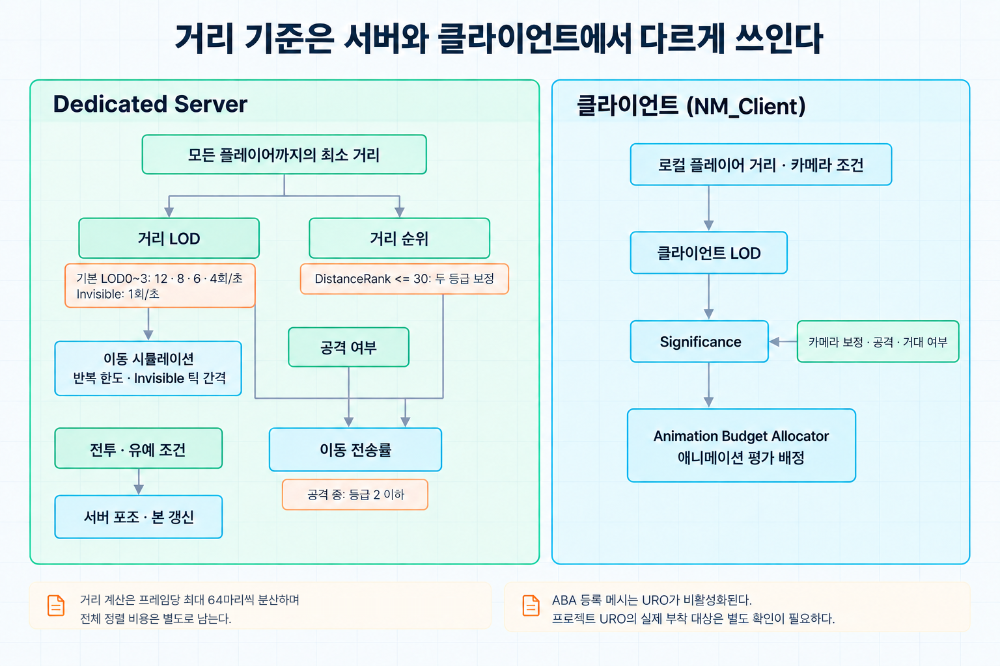
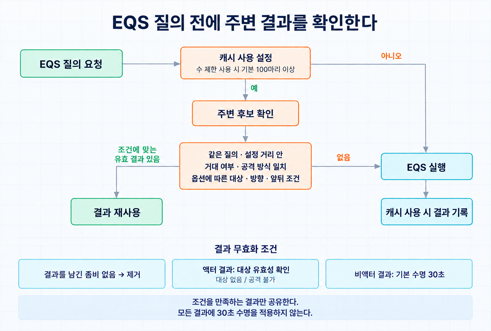

[Night of the Dead](/projects/night-of-the-dead/)의 웨이브에서는 좀비가 최대 300마리까지 동시에 기지로 몰려온다. 좀비 한 마리에는 이동 시뮬레이션, 애니메이션, AI 질의, 길찾기, 이동 동기화가 붙고 서버는 이것을 플레이어 수와 무관하게 전부 계산한다.


모든 좀비를 같은 품질로 처리할 수는 없었다. 방향은 하나였다. 플레이어에게 중요한 좀비를 골라 그쪽에 비용을 쓰고 나머지는 단계적으로 낮춘다. 이 글은 그 기준을 어떻게 만들었고 어디에 적용했는지를 정리한다.

## 기준: 거리 LOD와 거리 순위

중요도의 기준은 두 가지다.

- 거리 LOD: 가장 가까운 플레이어와의 거리로 LOD0부터 LOD3, 그리고 Invisible까지 다섯 단계를 정한다. 소스의 기본 경계는 6m, 12m, 30m, 100m다.
- 거리 순위: 전체 좀비를 가까운 순으로 정렬했을 때의 순번이다.

거리만 쓰면 웨이브가 기지 앞에 몰렸을 때 대부분의 좀비가 LOD0이 된다. 그 상황이 가장 비용이 큰 순간인데 기준이 아무것도 걸러 내지 못한다. 순위는 "가장 가까운 30마리"처럼 고품질 대상의 수를 고정해 준다.

### 서버와 클라이언트의 차이

같은 계산이 서버와 클라이언트 양쪽에서 돌지만 "가깝다"의 기준이 다르다.

- 클라이언트는 로컬 플레이어와의 거리를 쓴다. 카메라 방향과 FOV로 화면 밖이라고 판정하고 LOD1 거리보다 멀면 Invisible로 본다.
- Dedicated Server에는 카메라가 없다. 모든 플레이어 폰과의 거리 중 최솟값을 쓴다. 한 명에게라도 가까우면 그 좀비는 높은 단계를 유지한다.

### 한 프레임에 계산하는 수를 고정

좀비마다 틱에서 모든 플레이어와의 거리를 계산하면 좀비 수와 플레이어 수의 곱만큼 비용이 든다. 계산을 GameState에 붙인 매니저 한 곳으로 모으고 한 프레임에 처리하는 수를 고정했다. 좀비는 틱에서 매니저에 갱신 요청만 등록한다.

```cpp
void UZombieOptimizeManager::UpdateDistanceRanks()
{
	const int32 NumZombies = Zombies.Num();
	const int32 NumToProcess = FMath::Min(MaxDistanceUpdatesPerFrame, NumZombies - Cursor);

	for (int32 Step = 0; Step < NumToProcess; ++Step)
	{
		FZombieEntry& Entry = Zombies[Cursor++];
		Entry.DistSq = GetMinDistSqToViewers(Entry.Location);
	}

	// 한 바퀴를 다 돌았을 때만 정렬하고 순위를 기록한다.
	if (Cursor >= NumZombies)
	{
		Zombies.Sort([](const FZombieEntry& A, const FZombieEntry& B) { return A.DistSq < B.DistSq; });
		for (int32 Rank = 0; Rank < NumZombies; ++Rank)
		{
			Zombies[Rank].Component->SetDistanceRank(Rank);
		}
		Cursor = 0;
	}
}
```

소스의 거리 계산 한도는 프레임당 64마리, 이동 관련 값 갱신 한도는 프레임당 50마리다. 대상 300마리가 유지되면 거리 계산 한 바퀴에 다섯 프레임이 걸린다. 매 프레임 최신 순위를 얻는 대신 거리 계산을 여러 프레임에 나누는 선택이다.

전체 대상을 정렬하고 순위를 기록하는 작업은 한 바퀴가 끝난 프레임에 남는다. 서버가 한 바퀴 동안 계산하는 거리의 총량도 좀비 수와 플레이어 수의 곱에 비례한다. 따라서 64라는 한도는 거리 계산을 분산하는 기준이며, 매니저 전체의 프레임 비용이 일정하다는 뜻은 아니다.

## LOD가 바꾸는 것

LOD가 바뀔 때 한 곳에서 다음을 조절한다.

| 단계 | 이동 시뮬레이션 최대 반복 수 | 메시 | 그림자 | 캡슐 Hit 이벤트 |
| --- | --- | --- | --- | --- |
| LOD0 | 4 | 표시 | 켬 | 켬 |
| LOD1 | 2 | 표시 | 끔 | 켬 |
| LOD2 | 2 | 표시 | 끔 | 끔 |
| LOD3 | 1 | 표시 | 끔 | 끔 |
| Invisible | 2 (틱 간격 1초) | 숨김, 본의 물리 갱신 생략 | 끔 | 끔 |

표는 소스에 지정한 단계별 설정이다. 이동 시뮬레이션 최대 반복 수는 `UCharacterMovementComponent::MaxSimulationIterations`로, 서버에서 한 틱의 이동을 몇 번까지 나눠 계산할지 정한다. Invisible 단계는 이동 컴포넌트의 틱 간격 자체를 1초로 늘린다. 반복 한도를 줄이면 긴 틱을 처리할 때 이동과 충돌 계산이 거칠어질 수 있으므로, 가까운 좀비에는 더 큰 한도를 둔다.

부드러운 회전은 순위와 프레임률을 함께 본다. 순위가 30 미만이고 프레임률이 30을 넘을 때만 보간한다.

### 이동 동기화 전송률

좀비의 위치는 서버가 주기적으로 클라이언트에 보낸다. 이 전송률도 같은 LOD와 순위로 정한다.

```cpp
int32 UZombieLODComponent::CalcSendRateGrade() const
{
	if (LOD == EZombieLOD::Invisible)
	{
		return InvisibleGrade;
	}

	// 등급 숫자가 작을수록 자주 보낸다. LOD0~3이 등급 0~3에 대응한다.
	int32 Grade = static_cast<int32>(LOD);

	// 거리 순위가 30 이하인 좀비는 두 등급 올린다.
	if (DistanceRank <= 30)
	{
		Grade = FMath::Max(Grade - 2, 0);
	}

	// 공격 중인 좀비는 등급 숫자를 2 이하로 제한한다.
	if (Zombie->IsAttacking())
	{
		Grade = FMath::Min(Grade, 2);
	}

	return Grade;
}
```

소스의 등급별 기본 전송률은 초당 12, 8, 6, 4, 3회이고 Invisible은 1회다. LOD0~3은 등급 0~3에 대응하므로 이 경로에서 사용하는 기본 전송률은 12, 8, 6, 4회다. 배열의 3회 설정은 이 LOD 매핑으로 선택되지 않는다. 공격 중에는 등급을 2 이하로 제한하지만 Invisible은 그대로 1회다.



## 보내지 않는 상태

전송률을 낮추는 것보다 확실한 방법은 보내지 않는 것이다.

### 좀비의 체력과 상태

기본 상태 컴포넌트의 `CharacterHealth`, `CharacterStatus`, `EquipmentStatusArray_Net`은 `COND_OwnerOnly`로 등록했다. 플레이어의 상태 컴포넌트는 서브클래스에서 이 프로퍼티들의 복제 조건을 다시 지정했다.

```cpp
void UPlayerStatusComponent::GetLifetimeReplicatedProps(TArray<FLifetimeProperty>& OutLifetimeProps) const
{
	Super::GetLifetimeReplicatedProps(OutLifetimeProps);

	// 기본 클래스의 COND_OwnerOnly를 풀어 다른 플레이어에게도 보낸다.
	RESET_REPLIFETIME_CONDITION(UCharacterStatusComponent, CharacterHealth, COND_None);
	RESET_REPLIFETIME_CONDITION(UCharacterStatusComponent, CharacterStatus, COND_None);
	RESET_REPLIFETIME_CONDITION(UCharacterStatusComponent, EquipmentStatusArray_Net, COND_None);
}
```

좀비에는 소유 연결이 없으므로 이 프로퍼티들은 클라이언트에 복제되지 않는다. 클라이언트의 피격 반응은 피격 이벤트로 전달되는 정보로 처리한다. 사망은 별도로 복제하는 `DeathInfo`와 `OnRep_DeathInfo`로 처리한다. 체력 프로퍼티를 보내지 않는 것과 사망 상태까지 보내지 않는 것은 다르다.

### 애니메이션 몽타주

엔진은 루트 모션 몽타주의 재생 상태를 `RepRootMotion`으로 복제한다. 이것을 기본 캐릭터에서 끄고 플레이어에서만 다시 켰다.

좀비의 공격과 피격 몽타주는 별도의 재생 이벤트로 보낸다. 공격 컴포넌트의 경로는 `UAnimMontage*` 에셋 참조와 재생 속도를 보낸다. 피격 컴포넌트는 `FHitAnimPlaybackData`를 보내고 그 안의 난수 시드로 양쪽에서 같은 변형을 고른다.

`LFMontageManagerComponent`에는 Gameplay Tag와 인덱스로 몽타주 묶음의 항목을 골라 보내는 Unreliable Multicast도 있다. 이 경로와 위의 공격·피격 컴포넌트 경로는 구분해야 한다.

공격·피격 몽타주의 Multicast는 플레이어 한 명이라도 가까우면 Reliable을 선택한다. 공격의 기본 기준 거리는 2m다. 수신 연결마다 고르는 방식이 아니라 해당 Multicast 전체의 신뢰성을 고른다. 연결별로 거리와 채널 상태를 확인하는 피격 정보 전파는 별도 경로이며, 그 내용은 [Reliable 버퍼 상태를 보고 대용량 데이터 나눠 보내기](/posts/notd-reliable-rpc-data-streaming/)에 적었다.

이벤트 방식의 한계는 재생 도중에 복제 범위에 들어온 클라이언트가 그 몽타주를 보지 못한다는 것이다. 이 경우를 위한 별도 처리는 두지 않았다.

## 애니메이션 비용

### 서버의 포즈 틱

Dedicated Server는 렌더링을 하지 않으므로 포즈를 계산할 이유가 없어 보인다. 하지만 좀비의 근접 공격은 애니메이션에 맞춰 판정한다. 서버가 포즈를 전혀 갱신하지 않으면 판정할 수 없다.

그래서 서버의 포즈 틱을 전투 중에만 켠다.

```cpp
void AZombie::UpdateAnimTickOption(float DeltaSeconds)
{
	const bool bInGracePeriod = AnimTickGraceElapsed < AnimTickGraceDuration;

	if (IsInCombat() || bInGracePeriod)
	{
		AnimTickGraceElapsed += DeltaSeconds;
		// 근접 공격 판정에 본 위치가 필요하므로 서버에서도 포즈와 본을 갱신한다.
		GetMesh()->VisibilityBasedAnimTickOption = EVisibilityBasedAnimTickOption::AlwaysTickPoseAndRefreshBones;
	}
	else
	{
		GetMesh()->VisibilityBasedAnimTickOption = EVisibilityBasedAnimTickOption::OnlyTickMontagesWhenNotRendered;
	}
}
```

평소에는 몽타주의 진행만 틱하고 본은 갱신하지 않는다. 유예 시간은 전투가 끝난 직후나 특정 동작 직전에 본 갱신이 필요한 경우를 위해 외부에서 요청할 수 있게 둔 것이다.

### 클라이언트: Significance와 애니메이션 예산

클라이언트에서는 엔진의 Significance Manager에 좀비를 등록하고, 계산한 값을 Animation Budget Allocator용 메시 컴포넌트(`USkeletalMeshComponentBudgeted`)에 넘겼다. 예산 할당기는 이 값이 높은 메시부터 애니메이션 평가를 배정하고 예산이 부족하면 낮은 쪽의 갱신 빈도를 줄인다.

좀비의 Significance는 거리 구간을 따로 두지 않고 위의 LOD를 재사용해 계산한다.

```cpp
float AZombie::CalcSignificance(const FTransform& ViewTransform) const
{
	float Value = BaseSignificanceByLOD[LOD];
	const float MinValue = MinSignificanceByLOD[LOD];

	// 리슨 서버와 스탠드얼론에서는 거리 순위도 반영한다.
	if (GetNetMode() != NM_Client)
	{
		Value *= 1.f - GetNormalizedDistanceRank();
	}
	Value = FMath::Max(Value, MinValue);

	// 최소값 보정 다음에 카메라 방향에 따른 보정을 적용한다.
	if (const APlayerCameraManager* Camera = GetLocalCameraManager())
	{
		Value = FMath::Max(Value - CalcViewPenalty(Camera), 0.f);
	}

	if (IsAttacking())
	{
		Value += 2.f;
	}

	if (IsGiant())
	{
		Value += 1.f;
	}
	return Value;
}
```

최소값 보정은 카메라 보정보다 먼저 적용하므로 최종 값이 LOD별 최소값보다 낮아질 수 있다. 공격 중인 좀비와 거대 좀비에는 추가 점수를 준다. Significance 등록은 Dedicated Server에서 건너뛴다. 서버의 기준은 앞의 LOD이고 Significance는 화면에 그리는 쪽의 기준이다.

Update Rate Optimization은 별도 컴포넌트로 감쌌다. 약 1초 간격의 타이머로 조건을 다시 평가하며 평균 프레임률이 기준보다 높으면 URO를 끈다. 프레임에 여유가 있을 때는 품질을 낮출 이유가 없기 때문이다. 탑승이나 특수 연출처럼 애니메이션을 덮어쓰는 동안에도 끈다.

Animation Budget Allocator에 등록한 메시는 엔진이 URO를 비활성화한다. 두 기법은 적용 대상에 따라 구분해야 한다. 프로젝트의 URO 컴포넌트는 소유 액터의 스킨드 메시 전체를 대상으로 설정하며 예산 할당기에 등록된 메시를 제외하는 검사는 없다. 실제 Blueprint의 부착 대상은 이번에 확인한 C++ 코드에 없으므로, URO의 적용 범위는 별도로 확인해야 한다.

## 길찾기 비용

### 네비게이션 인보커

오픈월드라 내비메시는 인보커 주변에만 동적으로 생성했다. 인보커가 많고 넓을수록 서버가 내비메시 타일을 만드는 비용이 커진다. 모든 AI의 인보커를 기본으로 꺼 두고, 켜는 조건을 대상별로 정했다.

| 대상 | 켜는 조건 |
| --- | --- |
| 웨이브 좀비 | 이동 태스크가 시작되고, 바닥에 서 있을 때 |
| 플레이어 건물 | 웨이브가 진행 중이고 500m 안에 플레이어가 있을 때 |
| 스포너 | 스폰이 가능한 상태이고 플레이어가 확인 거리 안에 있을 때 |
| 웨이브 경로 | 좀비가 지나갈 웨이포인트에 인보커 전용 액터를 배치 |

웨이브 좀비는 스폰 직후에는 인보커가 꺼져 있고, 이동을 시작할 때 켠다. 좀비가 지나갈 웨이포인트에는 인보커 전용 액터를 미리 놓아 경로 주변의 내비메시를 먼저 만들어 둔다. 틱이 없고 복제되지 않는 액터다. 지나간 웨이포인트의 인보커는 제거하고 웨이브가 끝나면 전부 없앤다.

건물의 조건은 1초 타이머로 확인한다. 첫 실행을 난수만큼 늦춰 건물들이 같은 프레임에 검사하지 않게 했다.

### 웨이브 좀비의 인지

웨이브 좀비는 스폰될 때 AI Perception 컴포넌트를 제거한다. 웨이브 좀비는 주변을 살펴 대상을 찾을 필요가 없다. 대신 AI 컨트롤러가 0.5초 간격의 틱에서 가장 가까운 플레이어나 추종자를 대상으로 넣어 준다.

### EQS 결과 공유

웨이브의 좀비들은 같은 기지를 향해 거의 같은 EQS 질의를 반복한다. 어느 건물을 공격할지, 대상에게 어떻게 접근할지를 묻는 질의다. 바로 옆의 좀비가 방금 얻은 답은 대부분 나에게도 맞다.

좀비가 질의를 실행하기 전에 주변 좀비의 최근 결과를 먼저 찾는다. 다음 조건을 만족하는 결과가 있으면 질의를 건너뛰고 그 결과를 쓴다.

- 같은 EQS 질의의 결과이며, 결과를 가진 좀비가 설정한 거리 안에 있다.
- 거대 좀비 여부와 공격 방식(근접, 원거리)이 같다.
- 질의의 옵션에 따라 같은 주 대상·대체 대상을 요구하거나, 같은 대상을 향하는 방향과 앞뒤 위치를 확인한다.

캐시를 남긴 좀비가 없으면 결과를 지운다. 액터 결과는 대상이 없거나 공격 가능한 대상이 아니게 되면 지우고 위치 같은 비액터 결과에는 기본 30초의 수명을 둔다. 모든 결과를 30초 뒤에 지우는 것은 아니다.



캐시 사용 여부와 좀비 수 제한은 각각 설정으로 제어한다. 수 제한을 켠 경우 기본 기준은 100마리다. 적은 수에서도 무조건 공유하기보다 질의가 많이 겹치는 상황에 재사용 범위를 제한하는 선택이다.

적용 효과를 확인할 수 있도록 질의 종류별로 캐시 적중과 실패 횟수, 평균 시간을 기록하고 치트 명령으로 출력하게 했다.

## 정리

| 대상 | 기준 | 줄인 것 |
| --- | --- | --- |
| 이동 시뮬레이션 | LOD | 최대 반복 수, 틱 간격 |
| 이동 동기화 | LOD, 순위, 공격 여부 | 전송률 |
| 체력과 상태 | 소유 연결 없음 | 지정한 상태 프로퍼티의 복제 |
| 몽타주 | 거리 | 루트 모션 복제 제외, 재생 이벤트의 신뢰성 |
| 서버 포즈 | 전투 여부 | 본 갱신 |
| 클라이언트 애니메이션 | Significance | 평가 빈도 |
| 내비메시 | 웨이브, 플레이어 거리 | 인보커 수 |
| 인지 | 웨이브 좀비 여부 | Perception |
| EQS | 좀비 수, 주변 결과 | 질의 횟수 |

LOD와 순위는 이동 시뮬레이션, 이동 동기화와 애니메이션에서 재사용했다. 전투 판정에 필요한 서버 포즈와 사망 상태는 별도 경로로 유지했다.

## 참고 자료

- [Animation Budget Allocator in Unreal Engine](https://dev.epicgames.com/documentation/en-us/unreal-engine/animation-budget-allocator-in-unreal-engine)
- [Significance Manager in Unreal Engine](https://dev.epicgames.com/documentation/en-us/unreal-engine/significance-manager-in-unreal-engine)
- [Using Navigation Invokers in Unreal Engine](https://dev.epicgames.com/documentation/en-us/unreal-engine/using-navigation-invokers-in-unreal-engine)
- [Environment Query System in Unreal Engine](https://dev.epicgames.com/documentation/en-us/unreal-engine/environment-query-system-in-unreal-engine)
