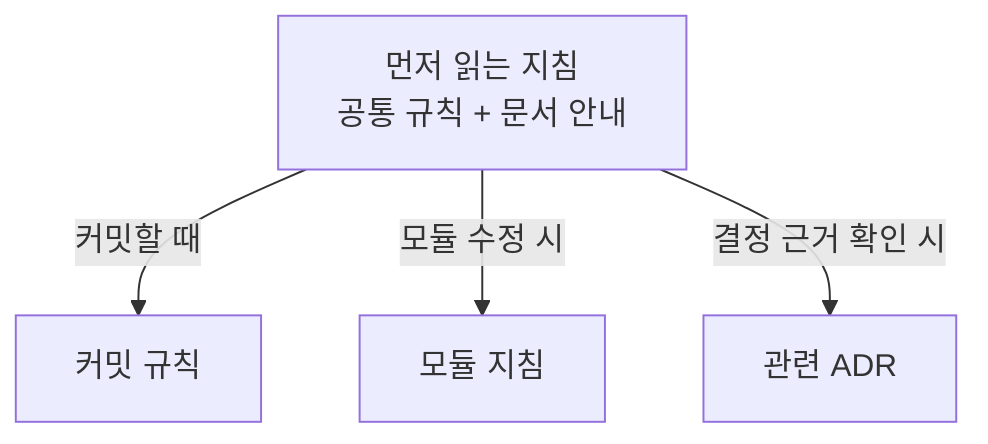

점진적 노출(Progressive Disclosure)은 필요한 정보를 처음부터 전부 보여주지 않고 필요해지는 시점에 더 자세히 제공하는 방식이다. AI 코딩 에이전트에게 적용하면, 모든 프로젝트 지침을 한꺼번에 읽히는 대신 현재 작업에 필요한 문서를 찾아 읽게 하는 것이다.

예를 들어 커밋할 때는 커밋 규칙을, 특정 모듈을 수정할 때는 그 모듈의 설계와 주의사항을 읽게 한다. 처음에는 무엇이 어디 있는지 알 수 있는 안내를 제공한다.

요즘 주로 사용하는 Codex의 [공식 가이드](https://learn.chatgpt.com/guides/best-practices#make-guidance-reusable-with-agentsmd)에서도 `AGENTS.md`가 커지면 본문은 간결하게 유지하고 작업별 상세 지침은 별도 Markdown 파일로 분리해 참조하라고 권한다.



> 커밋 메시지 하나 쓰는데 프로젝트의 역사를 전부 읽을 필요는 없다.

이 표현은 Anthropic이나 OpenAI의 에이전트 지침 작성 안내에서 처음 접한 것 같다. 이후 GeekNews에서도 관련 팁을 자주 봤다. 참고할 만한 글로 [「좋은 Claude.md 작성법」](https://news.hada.io/topic?id=24744)이 있다. 이 글의 [원문](https://www.humanlayer.dev/blog/writing-a-good-claude-md)은 세부 지침을 별도 파일로 나누고 루트 지침에는 설명과 읽을 경로를 남기는 구성을 제안한다.

## CINEV Studio: 지침이 너무 커졌다

CINEV Studio는 내가 Cinamon에서 개발에 참여했던 Unreal Engine 기반의 시네마틱 편집 도구다.

CINEV Studio에 처음 `AGENTS.md`나 `CLAUDE.md` 같은 지침 파일을 적용했을 때는 얼마 지나지 않아 내용이 크게 늘었다. 특정 모듈의 기록과 결정사항까지 한 파일에 쌓이니 읽기도, 수정하기도 어려웠다. 그 내용이 매 세션 로드되면서 컨텍스트 부담도 생겼다.

에이전트에게 일을 잘 시키려고 쓴 지침인데, 지침 관리도 슬슬 일이 되고 있었다.

그래서 가끔 필요한 모듈별 기록과 결정사항을 별도 문서로 옮겼다. 원래 지침에는 “이 상황에서는 이 파일을 읽어라”라는 매핑을 남겼다.

아래는 이미 지침을 나눠 운영하던 2026년 1월의 프로젝트 폴더 안 `AGENTS.md`에서 발췌·번역한 예시다. 최초 도입 시점을 뜻하는 것은 아니며, 경로는 설명용으로 단순화했다.

```md title="CINEV Studio — AGENTS.md 일부 (2026년 1월)"
## 외부 지침은 필요할 때 읽기

참조 문서를 미리 전부 읽지 않는다.
현재 작업에 필요한 문서만 읽고 해당 지침을 따른다.

- Unreal Engine 코딩 규칙 → standards/coding.md
- 커밋 메시지 지침 → standards/commit.md
- Merge Request 지침 → standards/merge-request.md
```

중요한 규칙까지 모두 밖으로 뺀 것은 아니다. 이 버전에도 런타임에서 `UMovieSceneSection`을 수정한 뒤 `MarkAsChanged()`를 호출해야 한다는 제약은 바로 적혀 있다. 가끔 찾아볼 문서를 나누는 것과 놓치면 안 되는 규칙을 남기는 것은 별개의 일이었다.

바꾸고 나서 가장 먼저 체감한 것은 눈에 보이는 컨텍스트 길이였다. 문서를 작성하는 방식도 편해졌다. 거대한 파일 전체를 신경 쓰는 대신, 위키 글을 쓰듯 문서 하나의 내용에 집중할 수 있었다.

## Shotloom: 처음부터 찾아 읽을 수 있게

이후 같은 회사에서 CINEV Studio의 후속 프로젝트인 Shotloom 개발에 참여했다. Shotloom은 브라우저에서 장면과 샷을 편집하는 도구다.

이 프로젝트는 시작부터 AI 에이전트와 코딩할 것을 전제로 구조를 잡았다. 지침을 나중에 분리하는 것에서 한발 더 나아가, 장기적으로 유지하는 프로젝트 문서를 마련했다. 작업이 끝나도 필요한 지식과 결정 근거를 남겨 다시 참조할 수 있게 했다.

- Spec에는 어떤 동작을 기대하는지 남긴다.
- ADR에는 무엇을 결정했고 왜 그렇게 결정했는지 남긴다.
- TechDebt에는 알고도 남겨둔 구조적 문제와 정리할 조건을 남긴다.

`AGENTS.md`는 공통 규칙과 진입점을 안내하고 `MAP.md`는 질문을 해당 문서에 연결한다. 공통으로 읽어야 할 문서도 있으므로, 파일이 분리되어 있다는 이유만으로 모두 선택 사항은 아니다.

2026년 3월 초기 커밋의 `AGENTS.md`에도 문서 구조와 탐색 경로가 들어 있다. 문서 관련 부분만 발췌·번역하면 다음과 같다.

```md title="Shotloom — 초기 AGENTS.md 일부 (2026년 3월)"
## 문서 구조

docs/
  specs/      # 제품 요구사항과 기술 스펙
  adr/        # 설계 결정 기록
  tech-debt/  # 기술 부채 기록

## 주요 링크

- 문서 탐색 인덱스 → MAP.md
- 기여·커밋 규칙 → CONTRIBUTING.md
```

두 예시는 각 프로젝트의 해당 시기를 보여준다. 지금의 CINEV Studio에도 ADR과 기술 부채 문서 체계가 있으므로, 현재 어느 쪽이 더 잘 갖춰졌는지를 비교하려는 것은 아니다.

이 구조는 에이전트뿐 아니라 나에게도 도움이 됐다. 다른 스펙을 쓰거나 이전 결정의 근거가 필요할 때, 기억을 더듬는 대신 기록을 다시 확인할 수 있었다. 평소에는 그 내용을 전부 기억하고 있을 필요가 없었다.

내 기억력이 좋아진 것은 아니다. 잊어도 되는 범위가 넓어졌을 뿐이다.

## 스킬에도 같은 방식이 쓰인다

점진적 노출은 `AGENTS.md`나 `CLAUDE.md`에만 쓰는 기법은 아니다. [Codex 공식 문서](https://learn.chatgpt.com/docs/customization/overview#skills)에 따르면 스킬의 이름과 설명이 먼저 제공된다. 사용할 스킬이 선택되면 `SKILL.md` 전체를 읽고 추가 참조 문서는 필요할 때 읽는다.

스킬을 작성할 때도 `SKILL.md`에는 핵심 절차와 참조 조건을 두고 긴 예시나 세부 규칙은 별도 문서로 나눌 수 있다. 본문에 전부 넣어두면 스킬을 선택한 순간 다시 많은 내용을 읽게 된다.

## 파일만 나눈다고 끝나지는 않는다

예전에는 에이전트가 필요한 문서를 놓치는 경우도 있었다. 중요한 매핑의 우선순위를 높여 `AGENTS.md` 상단으로 옮긴 기억도 있다. 요즘은 꽤 나아진 것 같고 모델 개선의 영향도 있어 보이지만 이 부분은 내 체감이다.

문서 경로만 나열하는 것으로는 부족하다. 어떤 내용이 들어 있고 언제 읽어야 하는지도 함께 안내해야 한다. 현재 두 프로젝트 모두 문서나 코드 위치가 바뀌면 관련 안내를 함께 갱신하도록 정하고 있다. 찾아갈 주소가 틀리면 문서를 잘 써둔 보람이 없다.

프로젝트의 모든 사정을 매번 펼쳐놓을 필요는 없었다. 필요한 순간에 다시 찾을 수 있으면 됐다. 덕분에 나도 평소에는 좀 잊고 지낸다.
