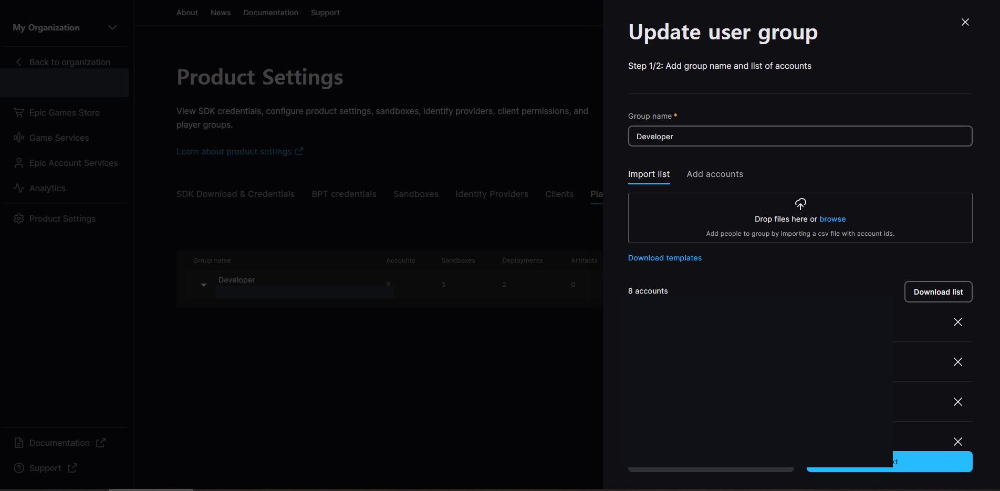
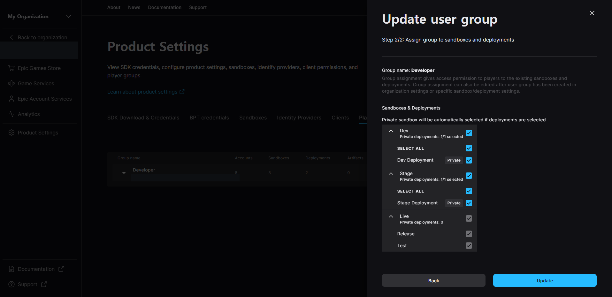

Steam 계정으로 Epic Online Services 로그인을 시도하면 Private Sandbox에서만 실패했다. 티켓은 아래 코드로 요청했다.

```cpp
SteamAPICall_t Call = SteamUser()->GetAuthTicketForWebApi("epiconlineservices");
```

## 문제 현상

개발 환경에서는 Steam Web API ticket 발급까지 성공했다. 그러나 EOS 인증에 넘기면 특정 private sandbox에 로그인하지 못했다. 처음에는 `GetAuthTicketForWebApi`가 반환한 handle이나 ticket 생성 자체를 원인으로 의심했다.

## 적용 범위

Steam external credential을 EOS Connect 또는 Auth 흐름에 연결하는 경우다. Epic Developer Portal에서 공개되지 않은 sandbox와 deployment를 운영할 때 적용된다.

## 원인

Epic Developer Portal에서 해당 계정은 Player Group에 속해 있었고 target sandbox도 허용된 상태였다. 하지만 그 안에서 실제로 사용하는 deployment가 빠져 있었다. Private Sandbox는 sandbox 이름만 맞춰서는 접근하지 못하며 계정 그룹이 필요한 deployment까지 사용할 수 있어야 했다.





## 재현 및 진단

1. Steam API call handle과 `GetTicketForWebApiResponse_t` callback을 구분해 기록한다.
2. callback의 result, ticket byte length와 service identity 문자열을 점검한다.
3. EOS 로그를 보고 credential 검증 실패인지 sandbox/deployment 접근 거부인지 구분한다.
4. Product Settings의 Player Group에 테스트 계정이 포함됐는지 살핀다.
5. 그룹의 sandbox뿐 아니라 실제 deployment 권한도 대조한다.

## 해결 방법

target sandbox와 deployment를 테스트 계정의 Player Group에 모두 추가했다. 권한 반영을 기다린 다음 새 ticket으로 로그인 흐름을 다시 시작하자 인증이 완료됐다.

Steam의 `GetAuthTicketForWebApi`는 비동기 요청 handle을 반환한다. 이 값만으로 ticket 유효성을 판정하지 않는다. callback 결과와 실제 ticket payload까지 확인해야 한다. 이번 사례는 Steam ticket 생성 코드가 아니라 EOS 접근 제어 설정을 고쳐 해결했다.

## 검증 방법

- 권한이 있는 계정과 없는 계정으로 각각 로그인해 접근 제어가 의도대로 동작하는지 확인한다.
- 다른 sandbox/deployment 조합으로 바꿔 교차 시험한다.
- ticket 재사용이나 만료를 피하려면 매 시도에서 새 ticket을 발급한다.
- client 로그에는 ticket 본문, Steam ID, product secret을 남기지 않는다.

## 주의점

Player Group에 모든 사용자를 넣으면 문제는 가려지지만 production 접근 범위가 넓어진다. 테스트 그룹에는 최소 권한만 부여한다. 스크린샷과 로그를 공유하기 전에는 계정·제품명·식별자를 제거한다.

## 참고 자료

- [Steamworks: ISteamUser::GetAuthTicketForWebApi](https://partner.steamgames.com/doc/api/ISteamUser?language=english)
- [Steamworks Web API: AuthenticateUserTicket](https://partner.steamgames.com/doc/webapi/isteamuserauth)
