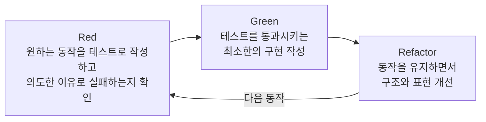
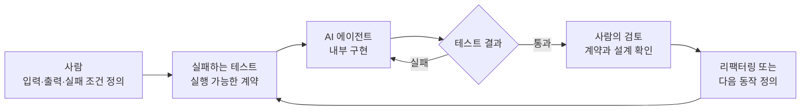

나는 Unreal Engine을 중심으로 게임과 실시간 3D 애플리케이션을 개발해 왔고 Unity를 사용한 프로젝트도 경험했다. 보통 기능부터 구현했다. 이어 에디터나 게임을 실행해 입력을 직접 재현하고 화면과 로그를 확인했다.

[CineV Studio에서 Shotloom으로 전환](/posts/from-cinev-studio-to-shotloom/)하면서 Rust와 Bevy를 본격적으로 사용하게 됐다. 언어와 엔진이 바뀐 것보다 더 낯설었던 건 테스트를 대하는 순서였다.

실패하는 테스트가 출발점이었다. 성공해야 하는 입력과 실패해야 하는 입력, 각각의 출력을 정한 뒤 내부 구현은 블랙박스로 둔 채 테스트가 통과할 때까지 코드를 작성했다. 구현한 뒤 테스트를 추가하는 것이 아니라 외부에서 관찰할 동작을 먼저 정하고 구현을 나중에 채웠다.

모든 게임 개발 방식을 비교하려는 글은 아니다. Unreal Engine을 가장 오래 사용한 개발자인 내가 Shotloom을 만들며 TDD(Test-Driven Development)를 새롭게 이해한 과정과 Rust, AI 에이전틱 코딩이 그 방식을 실용적으로 만든 이유를 돌아본다. 그 배움을 이후 게임 개발에 어떻게 적용할지도 함께 생각해 본다.

## 테스트가 없었던 것이 아니라 시작점이 달랐다

물론 게임 엔진에도 자동화 테스트가 있다. Unreal Engine은 단위·기능·콘텐츠 스트레스 테스트를 지원하고 Unity에도 Edit Mode와 Play Mode 테스트를 실행하는 Test Framework가 있다.

하지만 내가 가장 많이 경험한 Unreal Engine 중심의 개발에서는 테스트가 일상적인 구현의 출발점이라기보다, 필요할 때 별도의 실행 문맥을 준비해 사용하는 도구에 가까웠다.

Unreal Engine의 Automation Test는 엔진 시스템과 함께 다양한 수준의 테스트를 지원한다. 일부 테스트는 관련 플러그인을 활성화하고 에디터를 다시 시작해야 하며, 엔진 시스템에 의존하는 테스트는 순수한 단위 테스트보다 실행 문맥이 크다. 자세한 분류와 실행 방법은 [Unreal Engine Automation Test Framework](https://dev.epicgames.com/documentation/unreal-engine/automation-test-framework-in-unreal-engine?lang=en-US)에 정리되어 있다.

Unity의 Test Framework도 테스트를 Edit Mode와 Play Mode로 구분한다. Edit Mode는 에디터의 업데이트 루프에서 실행되고 Play Mode는 실제 런타임에 가까운 환경에서 게임 코드를 실행한다. 테스트의 실행 위치부터 나뉘는 이유는 게임 코드가 씬, 에디터와 프레임 업데이트에 밀접하게 연결되어 있기 때문이다. [Unity Test Framework의 Edit Mode와 Play Mode 설명](https://docs.unity3d.com/kr/Packages/com.unity.test-framework%402.0/manual/edit-mode-vs-play-mode-tests.html)

Godot, 자체 엔진이나 데이터 중심 런타임을 사용하는 팀은 테스트 흐름이 다를 수 있다. 같은 Unreal Engine과 Unity 안에서도 프로젝트 구조와 팀 문화에 따라 자동화 수준은 달라진다. 아래 비교는 엔진이나 업계 전체의 우열이 아니라 내가 경험한 에디터 중심 개발과 Shotloom의 개발 흐름 사이에서 느낀 차이다.

내 작업은 대체로 이런 순서였다.

1. 기능을 구현한다.
2. 에디터를 실행하거나 Play 모드에 진입한다.
3. 필요한 맵과 오브젝트를 준비한다.
4. 입력을 직접 재현한다.
5. 화면, 로그와 상태를 확인한다.

이 반복은 충분히 빠르다. 특히 시각적 결과를 계속 조정해야 하는 엔진 기반 개발에는 잘 맞는다. 다만 확인 결과가 자동화된 계약으로 남지 않으면 다음 변경에서도 같은 동작을 다시 수동으로 재현해야 한다.

Rust에서는 함수에 `#[test]`를 붙이고 `cargo test`를 실행하는 경로가 공식 도구 체계 안에 들어 있다. Cargo가 테스트용 실행 파일의 빌드와 실행, 성공·실패 보고까지 담당한다. 별도의 테스트 실행기를 고르는 일보다 원하는 동작을 함수로 표현하는 일에 바로 집중할 수 있었다. [The Rust Programming Language의 테스트 작성 안내](https://doc.rust-lang.org/stable/book/ch11-01-writing-tests.html)

웹 개발에서도 비슷한 인상을 받았다. 예를 들어 Node.js는 자체 테스트 실행기인 [`node:test`](https://nodejs.org/api/test.html)를 제공한다. 모든 Rust나 웹 프로젝트가 TDD를 사용한다는 뜻은 아니다. 내가 체감한 차이는 TDD의 보편성보다 테스트를 시작하기까지의 거리에 있었다.

| 관점 | 내가 경험한 엔진 중심 개발 | Rust·웹 개발에서의 경험 |
| --- | --- | --- |
| 피드백의 시작점 | 에디터·게임 실행 | 테스트 함수·명령 실행 |
| 준비할 문맥 | 맵, 오브젝트, 에셋, 프레임 상태 | 분리된 입력과 상태 |
| 결과 확인 | 화면, 로그, 디버거 | 자동화된 성공·실패 |
| 재현 방법 | 같은 조작을 다시 수행 | 같은 테스트를 다시 실행 |
| 회귀 확인 | 이전 동작을 기억하고 다시 확인 | 기존 테스트가 계약을 보존 |
| 구현 순서 | 구현한 뒤 동작 확인 | 동작을 정의한 뒤 구현 |

게임 로직도 엔진 의존성을 분리하면 충분히 단위 테스트가 가능하다. 반대로 웹 UI나 비동기 시스템도 브라우저와 외부 서비스가 결합되면 테스트 비용이 커진다. 두 분야를 테스트가 어려운 환경과 쉬운 환경으로 단순히 나누기는 어렵다.

Rust에서 테스트는 별도로 도입하는 절차보다 구현과 같은 위치에서 바로 시작하는 기본 개발 도구에 가까웠다. 덕분에 테스트를 구현 이후의 검증이 아니라 구현 이전의 설계로 사용하기가 한결 자연스러웠다.

## Red-Green-Refactor는 구현 순서를 바꾼다

TDD를 설명할 때 흔히 쓰는 흐름이 Red-Green-Refactor다.



### Red: 원하는 동작을 먼저 실패시킨다

아직 구현되지 않은 동작을 테스트로 작성한다. 테스트가 단순히 실패하는지만 봐서는 안 된다. 내가 추가하려는 동작이 없어서 실패하는지 확인해야 한다. 잘못된 설정이나 무관한 오류로 실패한다면 유효한 Red 상태가 아니다.

### Green: 계약을 만족하는 최소 구현을 만든다

테스트를 통과시키는 데 필요한 만큼만 구현한다. 처음부터 가장 아름다운 구조를 만들 필요는 없다. 앞에서 정의한 동작이 실제로 성립하게 만드는 것이 우선이다.

### Refactor: 동작을 유지한 채 구조를 정리한다

테스트가 통과하는 상태에서 중복을 제거하고 이름과 책임을 다듬는다. 기존 테스트는 내부 구조가 바뀌어도 외부 동작이 유지되는지 확인하는 안전망이다. 정리가 끝나면 다음 동작을 위한 Red 단계로 돌아간다.

## 명령 처리의 입력과 출력을 먼저 정하기

Shotloom에서는 명령 처리처럼 입력, 결과와 상태 변화가 분명한 영역에서 TDD 주기를 자주 접했다. 아래 코드는 실제 구현이 아니라 당시 구조를 단순화한 예시다.

편집기의 재생 위치를 변경하는 명령이 있다고 가정한다.

```rust
#[derive(Default)]
struct EditorState {
    playhead_frame: i32,
}

enum Command {
    SetPlayhead { frame: i32 },
}

#[derive(Debug, PartialEq)]
enum CommandError {
    NegativeFrame(i32),
}

fn execute(
    state: &mut EditorState,
    command: Command,
) -> Result<(), CommandError> {
    todo!("아직 명령 처리를 구현하지 않았다")
}
```

정상 입력과 실패 입력의 동작부터 테스트로 정의한다.

```rust
#[cfg(test)]
mod tests {
    use super::*;

    #[test]
    fn set_playhead_updates_current_frame() {
        let mut state = EditorState::default();

        let result = execute(
            &mut state,
            Command::SetPlayhead { frame: 120 },
        );

        assert_eq!(result, Ok(()));
        assert_eq!(state.playhead_frame, 120);
    }

    #[test]
    fn negative_frame_is_rejected_without_changing_state() {
        let mut state = EditorState::default();

        let result = execute(
            &mut state,
            Command::SetPlayhead { frame: -1 },
        );

        assert_eq!(result, Err(CommandError::NegativeFrame(-1)));
        assert_eq!(state.playhead_frame, 0);
    }
}
```

테스트는 내부 구현 방법을 지정하지 않는다. 외부에서 관찰할 수 있는 계약만 정한다.

- `120`을 입력하면 명령이 성공하고 현재 프레임이 변경된다.
- `-1`을 입력하면 오류가 반환된다.
- 실패한 명령은 기존 상태를 변경하지 않는다.

이 상태에서 테스트를 실행하면 `todo!()`에 도달해 실패한다. 구현할 동작과 실패 이유를 확인했으니 Red 상태가 만들어졌다.

Green 단계에서는 이 계약을 만족하는 최소 구현을 추가한다.

```rust
fn execute(
    state: &mut EditorState,
    command: Command,
) -> Result<(), CommandError> {
    match command {
        Command::SetPlayhead { frame } if frame < 0 => {
            Err(CommandError::NegativeFrame(frame))
        }
        Command::SetPlayhead { frame } => {
            state.playhead_frame = frame;
            Ok(())
        }
    }
}
```

이후 검증 로직을 별도 타입이나 함수로 분리해도 기존 테스트의 입력과 기대 결과는 유지된다. 테스트가 바라보는 것은 `match`문의 구조가 아니라 명령 실행 결과와 상태 변화다. 내부 구현을 블랙박스로 취급한다는 말은 이런 의미다.

## AI 에이전틱 코딩이 TDD의 비용을 바꿨다

AI 에이전틱 코딩을 본격적으로 사용하기 전까지만 해도 TDD는 부담스러웠다. 구현해야 할 기능을 두고 실제 코드보다 테스트를 먼저 만들고, 실패를 확인한 다음 구현으로 돌아가는 과정이 일을 두 번 하는 것처럼 보이기도 했다.

에디터에서 결과를 빠르게 확인하고 수정하는 데 익숙하다 보니, 아직 존재하지 않는 기능의 입력과 출력을 먼저 정리하는 일은 구현을 늦추는 절차처럼 느껴졌다.

AI 에이전트와 함께 구현하기 시작하자 생각이 달라졌다.

모든 구현을 직접 작성할 때는 테스트 설계와 실제 구현이 모두 추가 작업이었다. AI 에이전트가 구현과 반복 작업을 빠르게 처리하면서, 사람이 입력·출력·실패 조건을 먼저 정의하는 시간은 부담이 아닌 안전장치가 됐다. 빠른 구현이 잘못된 방향으로 흐르는 것을 막아줬다.



사람과 AI의 역할도 비교적 명확해졌다.

- 사람은 허용할 입력을 정한다.
- 성공했을 때의 결과를 정한다.
- 잘못된 입력을 처리할 방법을 정한다.
- 상태가 변경돼도 되는 조건과 유지돼야 하는 조건을 정한다.
- AI 에이전트는 이 계약을 만족하는 구현을 만들고 테스트 결과에 따라 수정한다.

자연어로만 “이 명령을 처리해줘”라고 요청하면 구현의 완료 조건이 모호하다. 테스트가 있으면 AI 에이전트는 성공과 실패를 직접 확인한다. 테스트 결과가 구현 루프에 객관적인 피드백을 주는 셈이다.

테스트는 단순한 검증 코드를 넘어 사람과 AI 사이의 실행 가능한 계약이 된다. 내부 구현 방식은 AI가 선택하더라도 외부에서 관찰되는 동작은 사람이 테스트로 통제한다.

코드가 빨리 쌓일수록 테스트의 가치도 커졌다. 사람이 매번 모든 코드를 처음부터 검토하지 않아도 먼저 합의한 동작이 유지되는지 자동으로 확인할 수 있기 때문이다.

> AI가 TDD를 덜 필요하게 만든 것이 아니라, 오히려 더 실용적으로 만들었다.

## 명령 계약이 단단해진다는 장점

Shotloom에서 가장 크게 와닿은 변화는 명령의 입력과 출력 계약이 명확해진 일이었다.

명령을 구현하기 전에 이런 질문을 피할 수 없었다.

- 어떤 명령과 입력을 받을 것인가?
- 성공하면 어떤 상태가 변경되는가?
- 실패하면 어떤 오류를 반환하는가?
- 실패한 명령은 기존 상태를 그대로 유지하는가?
- 같은 입력은 반복 가능한 결과를 만드는가?

질문에 답하다 보면 코드를 쓰기 전부터 기능의 경계와 예외가 드러났다. 테스트는 이미 결정한 요구사항을 확인하면서 아직 결정하지 않은 부분까지 발견하는 설계 도구가 됐다.

명령 계약은 Rust 런타임 내부에만 머물지 않았다. Shotloom처럼 React·TypeScript UI와 Rust·Bevy 런타임 사이에 명령 경계가 있으면 허용하는 입력과 실패 결과가 다른 계층과 공유하는 API가 된다. 명령 테스트는 함수 하나의 정확성뿐 아니라 계층 사이의 책임까지 고정했다.

## 모든 결과를 `assert_eq!`로 표현할 수는 없다

명령 처리는 TDD와 잘 맞지만 게임과 실시간 3D 애플리케이션의 모든 기능이 같은 형태는 아니다. 렌더링, 애니메이션과 기즈모 조작처럼 결과가 시각적이거나 연속적인 기능은 무엇을 성공으로 볼지 단일 값으로 정의하기 어렵다.

### 렌더링

렌더링 결과는 픽셀로 나타나므로 기준 이미지와 비교한다. 그러나 픽셀이 일치한다고 장면이 의도한 미적 결과를 만들었다고 단정하기는 어렵다.

GPU, 드라이버, 렌더링 백엔드와 부동소수점 계산의 차이로 일부 픽셀이 달라졌다고 기능이 잘못됐다고 단정하기도 어렵다. 허용 오차를 적용한 스크린샷 비교는 회귀를 발견하는 데 유용하지만 최종 품질까지 판단하지는 못한다.

### 애니메이션

애니메이션은 시간에 따라 값이 연속적으로 변한다. 특정 프레임에서 본의 위치와 회전이 기대 범위에 들어오는지는 테스트할 수 있지만, 동작이 자연스러운지, 발이 미끄러져 보이지 않는지, 캐릭터의 무게감이 적절한지는 숫자만으로 판단하기 어렵다.

자동화가 가능한 범위는 분명했다.

- 같은 시간 입력에 같은 포즈가 계산되는가
- 애니메이션 시작과 종료 상태가 올바른가
- 블렌딩 가중치가 유효 범위를 벗어나지 않는가
- 존재하지 않는 클립이나 본 입력을 안전하게 거부하는가

하지만 “움직임이 자연스러운가”는 여전히 눈으로 확인해야 한다.

### 기즈모

기즈모는 화면의 포인터 입력을 카메라와 월드 좌표로 변환한다. 이어 축을 선택하고 오브젝트 상태를 바꾼 뒤 결과를 다시 렌더링한다.

기즈모 전체의 사용감을 하나의 단위 테스트로 검증하기는 어렵다. 그래도 내부 계약은 분리 가능하다.

```rust
#[test]
fn dragging_x_axis_changes_only_x_position() {
    let before = Vec3::new(1.0, 2.0, 3.0);

    let after = apply_axis_drag(
        before,
        Axis::X,
        4.0,
    );

    assert_eq!(after, Vec3::new(5.0, 2.0, 3.0));
}
```

이 테스트는 기즈모가 화면에서 보기 좋은지 확인하지 않는다. X축을 드래그했을 때 Y축과 Z축이 변경되지 않아야 한다는 계약만 고정한다.

| 검증 대상 | 적합한 방법 |
| --- | --- |
| 포인터와 월드 좌표 사이의 계산 | 단위 테스트 |
| 선택한 축에 따른 이동 제한 | 단위 테스트 |
| 명령 생성과 상태 변경 | 명령·통합 테스트 |
| Undo·Redo 기록 | 상태 전이 테스트 |
| 핸들의 표시와 선택 상태 | 스크린샷·통합 테스트 |
| 드래그 감도와 조작감 | 사람의 직접 검토 |

여기서 TDD의 한계도 선명해졌다. 시각적 완성도와 조작감을 억지로 숫자로 환원하면 테스트는 실제 품질을 설명하지 못하고 유지보수 비용만 키울 수 있다.

그래서 시각적 기능 전체보다 주변의 결정적인 경계를 검증했다.

- 렌더링 결과 전체보다 렌더러에 전달되는 장면 데이터
- 애니메이션의 자연스러움보다 특정 시간의 포즈 계산
- 기즈모의 조작감보다 축 제한과 명령 생성
- 최종 화면 전체보다 상태 변경과 이벤트 계약

## AI와 TDD를 함께 사용할 때의 주의점

테스트가 통과한다고 구현이 반드시 올바른 것은 아니다. 사람이 잘못된 계약을 정의하면 AI는 그 잘못된 계약을 충실하게 구현할 가능성이 있다. 테스트에 적힌 사례만 통과하도록 과도하게 맞추거나, 테스트가 확인하지 않는 경로에서 잘못된 동작을 만들기도 한다.

AI 에이전트에게 테스트 실행을 맡기더라도 사람은 아래 내용을 검토해야 한다.

- 테스트가 실제 요구사항을 표현하는가
- 정상 사례뿐 아니라 실패와 경계 조건을 포함하는가
- 내부 구현에 지나치게 결합되지 않았는가
- 테스트를 통과하기 위한 하드코딩이나 우회가 없는가
- 단위 테스트 밖의 통합·시각적 검증이 필요한가

사람의 역할은 사라지지 않는다. 모든 구현을 직접 작성하는 대신 올바른 계약과 경계를 설계하고 결과를 검토한다.

## 게임 개발에 TDD를 적용하며 정한 기준

Shotloom에서 효과를 본 방식을 게임 개발에 옮긴다면, 모든 기능에 같은 수준의 TDD를 요구하기보다 검증 가능한 경계부터 적용하는 편이 현실적이다.

1. 명령, 상태 전이와 직렬화처럼 입력과 출력이 분명한 로직부터 시작한다.
2. 내부 함수 호출 순서보다 외부에서 관찰할 동작을 테스트한다.
3. 성공 사례와 함께 실패할 입력과 상태 불변 조건을 정한다.
4. AI 에이전트가 구현 전후로 관련 테스트를 직접 실행하게 한다.
5. 엔진 통합은 기능 테스트, 시각적 결과는 스크린샷과 사람의 검토를 조합한다.
6. 프로토타이핑 단계에서는 빠른 탐색을 허용하고 계약이 확정되는 시점에 테스트로 고정한다.

이 목록은 TDD를 강제하는 규칙이 아니다. 어디에 적용할 때 가장 값어치가 큰지 판단하는 기준이다.

## 다시 게임을 개발한다면

Shotloom의 경험은 Rust 프로젝트에서만 유효한 개발 방식으로 남지 않았다. 앞으로 어떤 엔진이나 자체 런타임으로 게임을 만들더라도 무엇을 런타임 안에 두고 무엇을 독립적으로 검증할지 먼저 생각할 것 같다.

과거에는 엔진이 제공하는 오브젝트와 컴포넌트부터 만들고 프레임 생명주기 안에서 기능을 확장하는 방식이 자연스러웠다. Unreal Engine의 Actor·Component나 Unity의 GameObject·MonoBehaviour가 대표적인 예다. 화면에 결과를 빨리 띄우기에는 좋지만 게임 규칙이 프레임 업데이트, 씬 오브젝트와 에디터 상태에 섞이기 시작하면 간단한 동작 하나를 확인할 때도 전체 실행 문맥이 필요하다.

다음 게임 프로젝트에서는 모든 코드를 엔진에서 떼어내기보다 반복해서 검증해야 하는 규칙부터 엔진 독립적인 경계로 꺼내고 싶다.

후보는 여럿이다.

- 아이템 사용, 장착과 소모 조건
- 체력, 피해와 상태 이상 계산
- 스킬 재사용 대기시간과 자원 소비
- 퀘스트와 게임 진행 상태 전이
- 턴, 라운드와 승패 조건
- 고정된 시간 입력에 대한 결정적 시뮬레이션 결과
- 저장 데이터의 검증과 마이그레이션
- 네트워크 요청에 대한 서버 권한 규칙

이 영역에서는 화면 표시보다 어떤 입력에서 어떤 상태로 바뀌는지가 중요하다. 엔진은 사용자 입력, 물리, 렌더링과 생명주기를 맡고 게임 규칙은 명령을 받아 상태와 이벤트를 반환하도록 나눌 수 있다.

### 기능보다 명령 계약부터 생각하기

새 기능을 만들 때도 “어떤 엔진 오브젝트를 만들어야 하는가?”에 앞서 몇 가지를 물어볼 수 있다.

- 플레이어가 전달하려는 의도는 어떤 명령인가?
- 명령을 실행하기 위해 필요한 입력은 무엇인가?
- 성공하면 어떤 상태와 이벤트가 만들어지는가?
- 거부해야 하는 입력과 실패 이유는 무엇인가?
- 클라이언트, 서버와 저장 데이터가 공유해야 할 규칙은 무엇인가?

아이템 사용 기능이라면 UI 버튼이나 애니메이션보다 `UseItem` 명령의 입력과 성공 결과, 수량 부족이나 잘못된 대상 같은 실패 조건부터 정의한다. 이 계약을 테스트로 고정한 뒤 AI 에이전트와 구현하면 UI, 네트워크와 엔진 표현이 달라져도 핵심 규칙은 같은 기준으로 검증된다.

Shotloom에서 배운 것은 특정 테스트 프레임워크의 사용법보다 이런 질문을 구현 전에 던지는 습관이었다.

### 프로토타이핑과 계약 확정을 구분하기

게임 기능 중에는 직접 만져봐야 요구사항이 드러나는 것도 많다. 캐릭터 이동, 카메라, 전투 감각과 애니메이션 연출을 처음 탐색하는 단계에서 모든 동작을 테스트로 고정하면 오히려 변경을 방해한다.

프로토타입 단계에서는 빠른 구현과 수동 검증을 허용하되, 동작이 제품의 규칙으로 굳어지는 시점을 구분하려 한다. 저장, 네트워크, 다른 시스템이나 여러 UI가 같은 규칙에 의존하기 시작하면 테스트 가능한 계약으로 옮긴다.

여기서 TDD는 아이디어를 발견하는 도구보다 발견한 규칙을 잃지 않는 도구에 가깝다.

### AI에는 구현보다 먼저 완료 조건을 전달하기

AI 에이전트와 게임 기능을 구현할 때도 자연어 요청만 전달하지 않고 최소한 세 가지를 먼저 정한다.

1. 성공해야 하는 대표 시나리오
2. 실패해야 하는 경계 입력
3. 실패해도 유지돼야 하는 상태

이 조건을 테스트로 표현한 뒤 구현과 테스트 실행, 수정은 AI 에이전트가 반복하도록 한다. 사람은 테스트가 실제 게임 규칙을 표현하는지, 구현이 엔진 구조와 성능 제약에 맞는지 검토한다.

AI가 만드는 코드가 많아질수록 각 줄을 직접 작성했는지보다 변경이 따라야 할 계약이 있는지가 중요해진다. Shotloom에서 겪은 TDD는 이후 게임 개발에서도 AI의 속도를 통제하는 현실적인 방법이 될 수 있다고 느꼈다.

### 검증 방법도 기능의 성격에 맞게 나누기

다음 게임을 개발할 때 모든 검증을 단위 테스트 수로 평가하고 싶지는 않다. 순수한 게임 규칙은 빠른 단위 테스트로 확인한다. 엔진과의 연결은 기능·통합 테스트로, 렌더링과 조작감은 캡처 비교와 직접 플레이로 확인하는 편이 맞다.

자동화 테스트와 수동 검증 중 하나만 선택할 이유는 없다. 실패 비용이 크고 결과를 결정적으로 표현할 수 있는 영역은 자동화하고, 사람의 감각과 맥락이 필요한 영역에는 직접 검토할 시간을 남긴다.

Shotloom에서 가져가고 싶은 것은 “게임도 무조건 TDD로 개발해야 한다”는 규칙이 아니다. 게임의 규칙과 엔진의 표현을 구분하고, 사람이 결정한 계약을 테스트로 남긴 뒤, AI의 구현 속도를 그 경계 안에서 활용하는 방식이다.

## 마치며

게임 개발에서 익숙했던 빠른 에디터 피드백과 수동 검증은 여전히 중요하다. 렌더링 품질, 애니메이션의 자연스러움과 기즈모의 조작감은 테스트 결과만으로 판단할 수 없다.

Shotloom에서 Rust와 AI 에이전틱 코딩을 함께 사용하며 명령과 상태 경계에서는 다른 가능성을 확인했다. 구현 전에 입력, 출력과 실패 조건을 정해 테스트로 남기자 빠르게 작성되는 코드가 따라야 할 방향이 선명해졌다. 그 영향은 Rust 프로젝트의 구현 방식에 머물지 않고 이후 게임의 구조를 어떻게 나눌 것인지에도 이어졌다.

과거에는 테스트를 먼저 만드는 시간이 구현을 늦추는 비용처럼 보였다. 구현 속도가 크게 올라간 지금은 제품의 계약을 단단하게 만드는 투자에 가깝다.

> 결정적인 로직과 명령 계약은 TDD로 보호하고, 엔진 통합은 기능 테스트로 확인하며, 시각적 품질과 조작감은 사람의 눈과 손으로 검토한다.

TDD는 게임 개발 전체를 대신하는 방법이 아니었다. 하지만 사람과 AI가 함께 코드를 작성할 때 서로가 따라야 할 동작을 명확하게 공유하는 방법으로는 이전보다 훨씬 실용적으로 느껴졌다.
