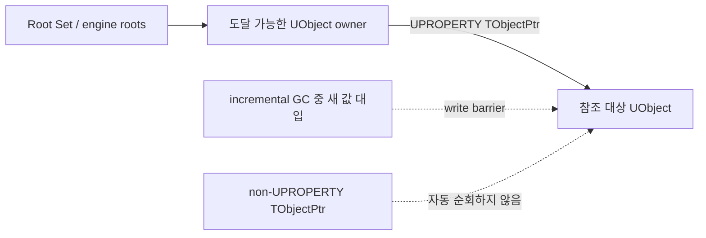

UE5는 raw UObject pointer member의 대체재로 `TObjectPtr`를 도입했다. 사용할 때 먼저 구분할 점은 두 가지다.

1. `TObjectPtr`라는 wrapper만 사용한다고 대상 UObject가 자동으로 살아남지는 않는다.
2. Editor의 optional late resolution은 `TSoftObjectPtr`처럼 asset을 요청할 때 load하는 public lazy-loading API가 아니다.

핵심부터 말하면 이렇다.

> 오래 보관하는 reflected UObject member에는 `UPROPERTY() TObjectPtr<T>`를 기본으로 사용하고, 함수의 borrowed parameter·return과 짧은 local에는 raw `T*`를 사용한다.

## 먼저 포인터의 목적을 고른다

`TObjectPtr`는 모든 UObject pointer를 대체하는 단일 정답이 아니다.

| 상황                                               | 기본 선택                     | 대상을 GC에서 살려 두는가?   | asset on-demand load |
| -------------------------------------------------- | ----------------------------- | ---------------------------- | -------------------- |
| 함수 parameter·return, 짧은 local                  | `T*`                          | 그 자체로는 아님             | 아님                 |
| 도달 가능한 `UCLASS`/`USTRUCT`의 지속 strong field | `UPROPERTY() TObjectPtr<T>`   | 예                           | 아님                 |
| 오래 보관하는 non-owning cache                     | `TWeakObjectPtr<T>`           | 아니오                       | 아님                 |
| 경로로 asset을 참조하고 필요할 때 load             | `TSoftObjectPtr<T>`           | load 뒤에도 그 자체로는 아님 | 예                   |
| non-UObject owner나 짧은 lifetime pin              | `TStrongObjectPtr<T>`         | 예                           | 아님                 |
| plain C++ object의 소유권                          | `TUniquePtr`, `TSharedPtr` 등 | UObject GC와 별개            | 아님                 |

`TSharedPtr<UObject>`나 `TUniquePtr<UObject>`로 UObject 수명을 소유하면 안 된다. Unreal의 reference-counted smart pointer library는 plain C++ object용이고, UObject는 reflection 기반 reachability graph에서 관리한다.

## `TObjectPtr`가 해결하는 문제

`TObjectPtr<T>`는 `UObject` 계열 object pointer를 담는 64-bit-sized wrapper다. 평범한 읽기와 대입에서는 raw pointer처럼 사용할 수 있지만, engine이 다음 기능을 끼워 넣을 자리를 제공한다.

- Editor의 object-handle access tracking과 optional late resolution
- cook-time dependency tracking
- reflected property serialization과 network serialization
- UE 5.4부터 experimental incremental reachability를 위한 assignment write barrier

내부 표현을 “주소 또는 table index라는 정확히 두 상태”로 영구 계약처럼 다루면 안 된다. build configuration과 engine version에 따라 handle 기능이 달라질 수 있고, application code가 의존해야 할 것은 `Get()`, 대입, 비교, reflected property라는 public contract다.

`TObjectPtr`는 raw pointer member의 실용적인 교체재이지 다음 기능은 아니다.

- reference counting owner
- weak reference
- soft asset path
- thread-safety guard
- `UPROPERTY`를 대신하는 GC registration

## `UPROPERTY`가 strong reference를 만든다

도달 가능한 owner의 reflected property라야 GC가 reference graph를 자동 순회한다. 아래에서 `Current`와 `Entries`는 strong reference지만, 같은 `TObjectPtr`를 `UPROPERTY` 없이 member로 두면 자동 순회 대상이 아니다.



점선은 그 경로만으로 수명이 유지되지 않음을 뜻한다. 대상은 다른 strong path가 있으면 계속 살아 있을 수 있다.

## 지속 member와 함수 경계를 함께 설계하기

다음 class는 저장에는 `TObjectPtr`, reflected API에는 raw pointer를 사용한다.

```cpp
// TargetRegistry.h
#pragma once

#include "CoreMinimal.h"
#include "UObject/Object.h"
#include "UObject/ObjectPtr.h"
#include "TargetRegistry.generated.h"

UCLASS()
class MYGAME_API UTargetRegistry final : public UObject
{
    GENERATED_BODY()

public:
    UFUNCTION(BlueprintCallable)
    void SetCurrent(UObject* InObject);

    UFUNCTION(BlueprintPure)
    UObject* GetCurrent() const { return Current.Get(); }

    UObject* Find(FName Key) const;
    UObject* FindFirstValidStoredObject() const;
    void VisitStoredObjects() const;

private:
    UPROPERTY()
    TObjectPtr<UObject> Current = nullptr;

    UPROPERTY()
    TMap<FName, TObjectPtr<UObject>> Entries;

    UPROPERTY()
    TArray<TObjectPtr<UObject>> StoredObjects;
};
```

```cpp
// TargetRegistry.cpp
#include "TargetRegistry.h"

void UTargetRegistry::SetCurrent(UObject* InObject)
{
    Current = InObject;
}

UObject* UTargetRegistry::Find(FName Key) const
{
    const TObjectPtr<UObject>* Found = Entries.Find(Key);
    return Found ? Found->Get() : nullptr;
}
```

컨테이너 안 element만 wrapper라고 끝이 아니다. `Entries` container member 자체도 `UPROPERTY`여야 자동 GC traversal과 property serialization의 대상이 된다. 단, plain replicated `TMap`은 지원되지 않으므로 network state에는 `TArray`/Fast Array 또는 검증된 custom representation을 사용한다.

### 왜 `UFUNCTION`은 raw pointer를 쓰는가

UHT는 `TObjectPtr`를 reflected function parameter와 return value로 허용하지 않는다.

```cpp
UFUNCTION(BlueprintCallable)
void SetTarget(UObject* InTarget); // supported

UFUNCTION(BlueprintPure)
UObject* GetTarget() const; // supported

// UFUNCTION()
// void SetTarget(TObjectPtr<UObject> InTarget); // UHT error

// UFUNCTION()
// TObjectPtr<UObject> GetTarget() const; // UHT error
```

일반 C++ 함수에는 언어 차원에서 `TObjectPtr` parameter를 사용할 수 있다. 그러나 borrowed object를 받거나 돌려주는 API는 raw pointer가 storage implementation을 숨기고 UFUNCTION과도 일관되며, 불필요한 wrapper copy를 피한다.

implicit conversion이 template deduction, conditional operator, delegate signature 같은 경계에서 맞지 않으면 의도를 명시한다.

```cpp
UseObject(Current.Get());
UObject* Raw = ToRawPtr(Current);
```

`Get()`과 `ToRawPtr()`는 lifetime을 늘리지 않는다. wrapper가 가리키는 raw address를 잠시 꺼낼 뿐이다.

## Container는 raw container와 다른 type이다

`TArray<TObjectPtr<UObject>>`는 `TArray<UObject*>`가 아니다. element access 결과와 algorithm signature를 wrapper type에 맞춘다.

```cpp
UObject* UTargetRegistry::FindFirstValidStoredObject() const
{
    const TObjectPtr<UObject>* Found =
        StoredObjects.FindByPredicate(
            [](const TObjectPtr<UObject>& Candidate)
            {
                return IsValid(Candidate.Get());
            });

    return Found ? Found->Get() : nullptr;
}

void UTargetRegistry::VisitStoredObjects() const
{
    for (const TObjectPtr<UObject>& Stored : StoredObjects)
    {
        if (UObject* Object = Stored.Get(); IsValid(Object))
        {
            UseObject(Object);
        }
    }
}
```

위 함수는 const receiver를 사용하므로 `FindByPredicate`가 `const TObjectPtr<UObject>*`를 반환한다. Non-const receiver에서는 `TObjectPtr<UObject>*`다. `TMap::Find`도 receiver constness를 따르면서 value element pointer를 반환한다.

기존 API가 raw-pointer container만 받는 경우에는 adapter를 경계에서 짧게 사용한다.

```cpp
void ReadObjects(const TArray<UObject*>& Objects);
void ReplaceObjects(TArray<UObject*>& Objects);

ReadObjects(ObjectPtrDecay(StoredObjects));
ReplaceObjects(MutableView(StoredObjects));
```

- `ObjectPtrDecay`는 const access용이다.
- `MutableView`는 호출이 끝날 때 wrapper semantics를 복구하고, object-pointer GC barrier가 활성화되어 incremental reachability가 진행 중이면 필요한 barrier action도 수행하는 scoped adapter다.
- callee가 raw reference나 pointer를 호출 뒤까지 보관하면 안 된다.
- deprecated `ToRawPtrTArrayUnsafe` 계열로 mutable storage를 노출하지 않는다.

가능하면 callee에 wrapper-aware overload를 추가해 adapter 경계를 줄인다. 단, API의 mutation·ownership contract를 먼저 확인해야 한다.

## Hard reference와 asset loading은 다른 문제다

`TObjectPtr`의 editor late resolution을 보고 “필요할 때 asset을 load하는 pointer”라고 설명하면 `TSoftObjectPtr`와 혼동된다. `UPROPERTY`로 추적·serialize되는 `TObjectPtr`는 hard object reference이고 사용자 제어 on-demand loading은 지원하지 않는다.

```cpp
#include "UObject/ObjectPtr.h"
#include "UObject/SoftObjectPtr.h"

class UTexture2D;

UPROPERTY(EditAnywhere, Category = "UI")
TSoftObjectPtr<UTexture2D> IconAsset;

UPROPERTY(Transient)
TObjectPtr<UTexture2D> LoadedIcon;
```

Header에서는 `UTexture2D`를 forward-declare할 수 있고, texture method나 object creation이 필요한 `.cpp`에서는 `Engine/Texture2D.h`를 include한다.

`IconAsset`은 soft path로 load 시점을 선택한다. async load가 끝난 뒤 `LoadedIcon = IconAsset.Get()`처럼 도달 가능한 reflected strong field로 옮기면 owner가 살아 있는 동안 target도 유지된다. soft pointer 자체는 load가 끝난 object를 계속 살려 두지 않는다.

Hard reference는 cook dependency와 package loading에도 영향을 줄 수 있다. 단지 C++ 표기만 바뀌는 문제가 아니라 content dependency graph의 선택이다.

## Forward declaration과 interface

UObject type은 persistent member의 template argument로 forward declaration할 수 있다.

```cpp
class UMyAsset;

UPROPERTY()
TObjectPtr<UMyAsset> Asset;
```

method를 호출하거나 object를 생성하는 `.cpp`에서는 complete definition header를 include한다. `TObjectPtr<int>`처럼 UObject가 아닌 type이나 `TObjectPtr<IMyInterface>` 같은 Unreal interface pointer는 올바른 대상이 아니다. Reflected interface property에는 `TScriptInterface<IMyInterface>`를 사용하고, Blueprint-only implementation까지 호출할 때는 `ImplementsInterface`와 generated `Execute_` wrapper를 사용한다.

## Null, validity, resolution은 서로 다르다

세 질문을 섞지 않는다.

| 질문                           | 예시                 | 의미                                             |
| ------------------------------ | -------------------- | ------------------------------------------------ |
| pointer가 null인가?            | `Ptr == nullptr`     | reference가 설정됐는가                           |
| UObject가 사용 가능한가?       | `IsValid(Ptr.Get())` | null이 아니고 garbage/pending-kill 상태가 아닌가 |
| object handle이 resolve됐는가? | `Ptr.IsResolved()`   | internal handle resolution 상태                  |

`IsResolved()`는 null/validity test가 아니다. unresolved hard handle도 유효한 reference일 수 있다. 반대로 이미 dangling이 된 untracked raw address에 `IsValid`를 호출한다고 안전한 weak handle로 바뀌지는 않는다. 장기 non-owning field에는 `TWeakObjectPtr`를 사용한다.

`TObjectPtr`도 object의 method와 data를 thread-safe하게 만들지 않는다. worker thread에서는 object lifetime과 object access 자체의 thread contract를 별도로 지켜야 한다.

## Serialization, replication, SaveGame

Reflected `TObjectPtr` property는 raw UObject property와 같은 object-reference serialization 경로를 사용하지만, 실제 동작은 여전히 `UPROPERTY` specifier와 owner에 의해 결정된다.

- `Transient`, `SaveGame`, `Replicated`, `ReplicatedUsing` 같은 specifier는 그대로 중요하다.
- raw `UPROPERTY UObject*`를 `TObjectPtr<UObject>`로 바꿀 때 property 이름을 동시에 바꾸지 않는다.
- 기존 asset load/save, PIE duplication, cook/package, network replication을 각각 검증한다.
- object reference가 replicated되어도 target object 자체의 class, networking support, relevancy가 자동으로 해결되는 것은 아니다.

Unreal의 property serialization과 GC가 wrapper를 이해한다는 뜻이지, 모든 저장·network policy가 자동으로 선택된다는 뜻은 아니다.

## Raw pointer member 전환 순서

대규모 전환은 단순 search-and-replace보다 다음 순서가 안전하다.

1. Persistent reflected UObject member를 식별한다.
2. `UnrealObjectPtrTool`은 먼저 preview mode로 실행하고 diff를 review한다.
3. 함수 parameter·return, local, third-party ABI는 raw pointer로 유지한다.
4. Container lookup과 range loop의 deduced type을 고친다.
5. Legacy raw-container API에는 `ObjectPtrDecay` 또는 scoped `MutableView`를 둔다.
6. UFUNCTION/RPC signature에 wrapper가 남지 않았는지 UHT build로 확인한다.
7. Editor asset load/save, cook, packaged build, replication을 검증한다.
8. Incremental GC를 사용한다면 모든 GC-reported reference path가 `TObjectPtr`인지 별도로 검사한다.

Tool이 자동으로 바꾼 code도 ownership intent를 결정해 주지는 않는다. 특히 unreflected member, static storage, `FGCObject`, custom `AddReferencedObjects`, container adapter는 사람이 review해야 한다.

## 최종 점검표

- Persistent strong member는 `UPROPERTY() TObjectPtr<T>`인가?
- Container member 자체에도 `UPROPERTY`가 있는가?
- 함수의 borrowed parameter와 return은 raw pointer인가?
- UFUNCTION/RPC에 `TObjectPtr` parameter나 return이 남지 않았는가?
- Hard reference가 필요한지, soft on-demand load가 필요한지 구분했는가?
- Long-lived non-owning cache는 `TWeakObjectPtr`인가?
- `IsResolved`를 validity test로 오용하지 않는가?
- Worker thread에서 wrapper를 thread-safety 보증처럼 사용하지 않는가?
- Container lookup 결과를 `TObjectPtr<T>*`로 받는가?
- Mutable raw-container adapter의 lifetime이 한 호출 안으로 제한되는가?
- Property 이름과 specifier를 보존하고 기존 asset/cook/network를 검사했는가?
- Incremental GC configuration에서 write-barrier path를 검증했는가?

## 참고 자료

- [Epic Games: Object Pointers](https://dev.epicgames.com/documentation/en-us/unreal-engine/object-pointers-in-unreal-engine)
- [Epic Games: UE5 Migration Guide - C++ Object Pointer Properties](https://dev.epicgames.com/documentation/en-us/unreal-engine/unreal-engine-5-migration-guide#c++objectpointerproperties)
- [Epic Games: Incremental Garbage Collection](https://dev.epicgames.com/documentation/unreal-engine/incremental-garbage-collection-in-unreal-engine?lang=en-US)
- [Epic Games: UE 5.4 Release Notes](https://dev.epicgames.com/documentation/en-us/unreal-engine/unreal-engine-5-4-release-notes?application_version=5.4)
- [Epic Developer Community: UFunctions cannot take a TObjectPtr as a parameter. Why?](https://forums.unrealengine.com/t/ufunctions-cannot-take-a-tobjectptr-as-a-parameter-why/241174)
