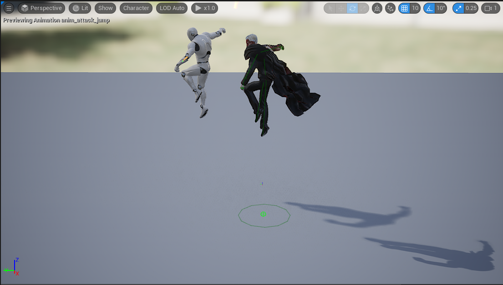
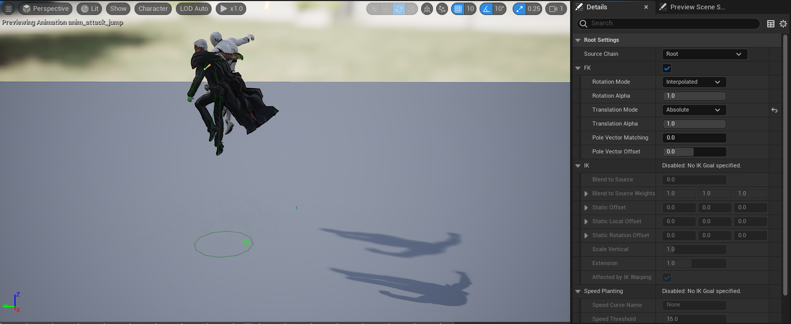

UE5 IK Retargeter로 애니메이션을 변환한 뒤 root의 상하 움직임은 남았지만 전진 이동은 사라졌다.

## 문제 현상

원본 애니메이션에는 root bone의 전진 변위가 있지만 retarget 결과는 제자리에서 재생됐다. pelvis 동작은 대체로 정상이어서 animation asset의 Root Motion 설정만 바꿔서는 문제가 해결되지 않았다.

## 적용 버전

원문은 UE5 초기 IK Rig/IK Retargeter UI를 기준으로 한다. UE 5.6 이후에는 Retarget Root, root settings, operation stack 표현이 버전에 따라 달라지므로 이름보다는 역할을 기준으로 확인한다.

## 원인

source와 target rig에 root를 담당하는 chain이 없거나 Retargeter의 chain mapping에서 root 변위가 전달되지 않았다. pelvis를 root 이동 전달용 chain처럼 별도로 매핑하면 실제 root translation과 충돌하는 경우도 있었다.

## 재현 및 진단

1. source animation에서 root bone의 월드 기준 전진 변위가 실제로 있는지 확인한다.
2. source와 target IK Rig의 Retarget Root가 올바른 pelvis 또는 root 기준점인지 확인한다.
3. 두 rig에 root bone을 포함하는 chain을 만들고 Retargeter에서 서로 매핑한다.
4. root translation mode와 scale 보정 결과를 preview에서 비교한다.
5. animation asset의 Root Motion 추출 설정과 retarget 결과를 별도로 검사한다.

## 해결 방법

원문 사례에서는 source와 target에 Root chain을 추가하고 서로 매핑했다. root chain의 translation mode를 `Globally Scaled`로 설정해 전진 변위를 복원했다. 중복으로 만들었던 Pelvis chain과 그 mapping은 제거했다.

`Globally Scaled`는 source와 target의 전체 크기 차이를 고려해 translation을 전달할 때 유용하다. 스켈레톤 비율과 원하는 이동 방식에 따라 `Absolute`나 현재 버전의 root translation 설정이 더 적절한 경우도 있다.

## 검증 방법

- preview에서 source와 target root 궤적을 함께 표시한다.
- 전진, 후진, 회전, 수직 이동이 포함된 애니메이션을 각각 시험한다.
- retarget 결과를 export한 뒤 Root Motion 추출을 켠 animation montage에서도 이동량을 확인한다.
- 서로 다른 신장의 target skeleton에서 이동 거리가 기대대로 보정되는지 비교한다.

## 주의점

Pelvis chain 제거는 모든 rig의 일반 해법이 아니다. 현재 retarget operation이 pelvis motion을 별도로 요구한다면 유지해야 한다. root 이동을 전달하는 chain과 pelvis 자세 보정이 같은 bone을 중복으로 제어하지 않도록 설정을 이해해야 한다.

## 참고 자료

- [Epic Games: Retargeting Bipeds with IK Rig](https://dev.epicgames.com/documentation/en-us/unreal-engine/retargeting-bipeds-with-ik-rig-in-unreal-engine)
- [Epic Games: Retargeting Operation Stack](https://dev.epicgames.com/documentation/unreal-engine/retargeting-operation-stack-in-unreal-engine-5-8)
- [Epic Games: Root Motion](https://dev.epicgames.com/documentation/unreal-engine/root-motion-in-unreal-engine)
