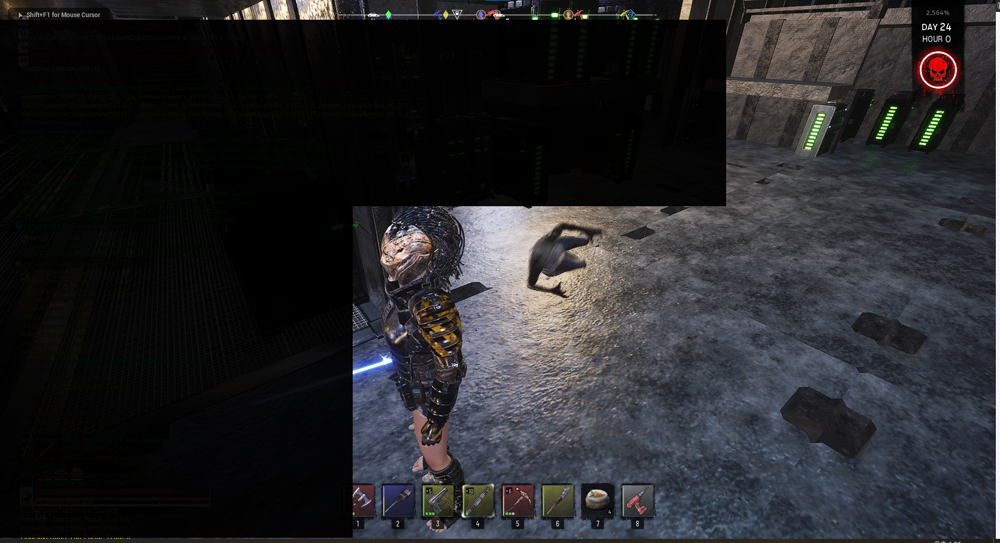
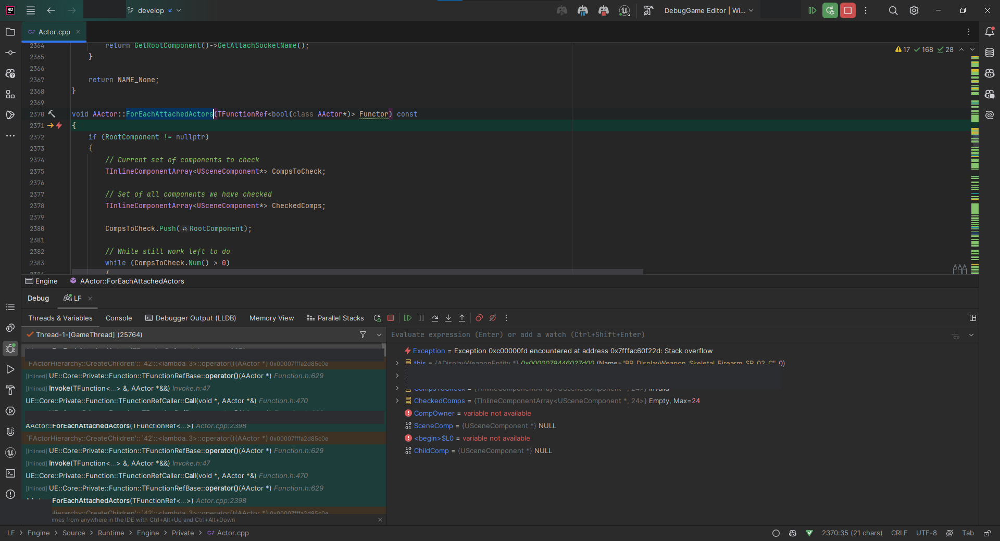

저장 데이터를 불러온 뒤 F11로 전체화면 PIE를 종료하면 editor가 `AActor::ForEachAttachedActors` 안에서 스택 오버플로를 일으키며 종료됐다.



## 문제 현상

크래시는 전체화면 전환 때 나타났지만 실제 call stack에서는 attached actor를 순회하는 동일한 프레임이 반복됐다.



## 적용 범위

대상은 런타임에 `NewObject`로 scene component를 만드는 UE 프로젝트다. 이를 다른 actor가 소유한 component나 socket에 부착하는 코드가 있었다. 종료·월드 정리 시점에만 크래시가 보인다면 생성 당시의 owner와 attachment 관계도 함께 확인할 가치가 있다.

## 원인

문제가 된 코드는 새 `UStaticMeshComponent`의 Outer를 현재 객체로 지정했다. 그런 다음 별도의 전시 actor에 owned component로 추가했다. 이 component를 또 다른 actor가 소유한 mesh에 붙이면서 UObject 소유권, actor의 owned component 목록, scene attachment 계층이 서로 다른 대상을 가리켰다.

```cpp
UStaticMeshComponent* DisplayComponent =
    NewObject<UStaticMeshComponent>(this, TEXT("RuntimeDisplayMesh"));

DisplayActor->AddOwnedComponent(DisplayComponent);
DisplayComponent->AttachToComponent(
    ItemActor->GetMesh(),
    FAttachmentTransformRules::SnapToTargetNotIncludingScale,
    SocketName);
```

이 불일치는 월드를 정리하면서 attached actor를 순회할 때 순환 관계처럼 드러났다. F11은 문제의 원인이 아니다. 숨어 있던 잘못된 계층이 종료 경로에서 노출된 계기였다.

## 재현 조건

1. 저장 데이터에서 전시 actor와 부착 대상 actor를 복원한다.
2. 런타임 component를 생성하고 대상 socket에 부착한다.
3. PIE를 전체화면으로 전환한 뒤 종료한다.
4. call stack에서 `ForEachAttachedActors`가 같은 actor들을 반복하는지 확인한다.

## 해결 방법

런타임 component의 Outer와 owner를 실제로 수명 관리할 actor로 일치시켰다. 부착 전에는 대상 component와 socket이 유효한지도 검사했다.

```cpp
if (!IsValid(DisplayActor) || !IsValid(ItemActor) ||
    !IsValid(ItemActor->GetMesh()) ||
    !ItemActor->GetMesh()->DoesSocketExist(SocketName))
{
    return;
}

UStaticMeshComponent* DisplayComponent =
    NewObject<UStaticMeshComponent>(DisplayActor, TEXT("RuntimeDisplayMesh"));

DisplayActor->AddInstanceComponent(DisplayComponent);
DisplayComponent->RegisterComponent();
DisplayComponent->AttachToComponent(
    ItemActor->GetMesh(),
    FAttachmentTransformRules::SnapToTargetNotIncludingScale,
    SocketName);
```

특정 API 이름보다 component를 소유하고 파괴할 주체를 명확히 정하는 일이 중요하다. component를 `DisplayActor`가 소유할지 `ItemActor`가 소유할지는 실제 생명주기에 맞춰 하나로 정해야 한다.

## 검증 방법

- 저장 데이터 로드 전후에 owner, Outer, attach parent와 owning actor를 로그로 비교한다.
- PIE 일반 창·전체화면 종료를 여러 번 반복한다.
- level transition, actor destroy, 저장 데이터 재로드에서도 component가 중복 등록되지 않는지 확인한다.
- `EndPlay`에서 attachment를 명시적으로 끊어야 하는 설계인지 검토한다.

## 주의점

`AddOwnedComponent`, `AddInstanceComponent`, `RegisterComponent`는 서로 완전히 같은 역할이 아니다. 생성 방식과 editor instance component로서의 저장 필요 여부에 맞게 선택해야 한다. 종료 전에 component를 강제 삭제해 call stack만 없애면 잘못된 소유 관계가 다른 경로에서 다시 나타날 여지가 있다.

## 참고 자료

- [Epic Games: AActor::ForEachAttachedActors](https://dev.epicgames.com/documentation/unreal-engine/API/Runtime/Engine/AActor/ForEachAttachedActors)
