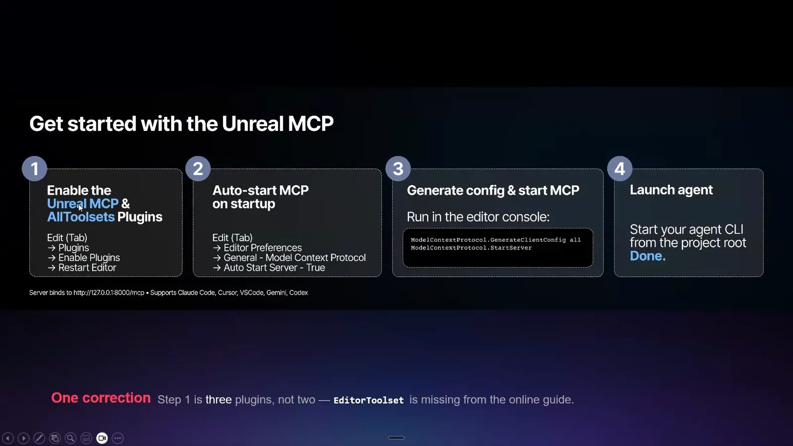
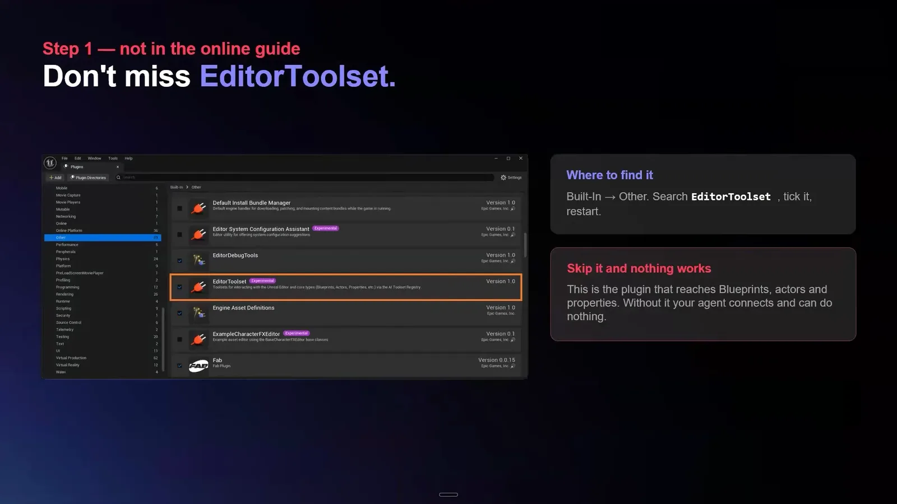
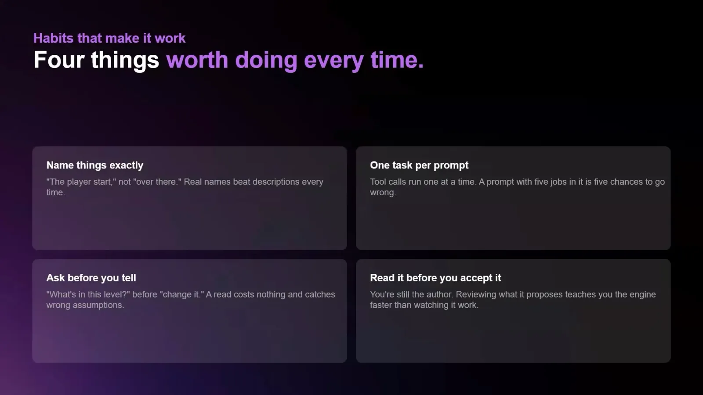
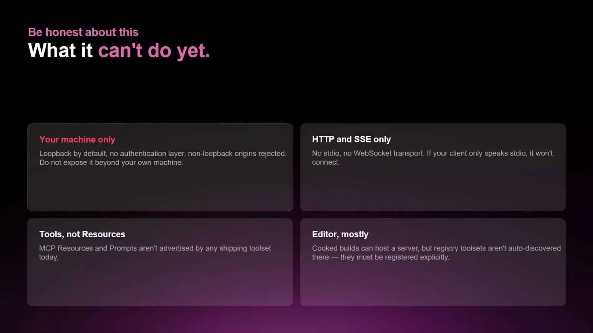
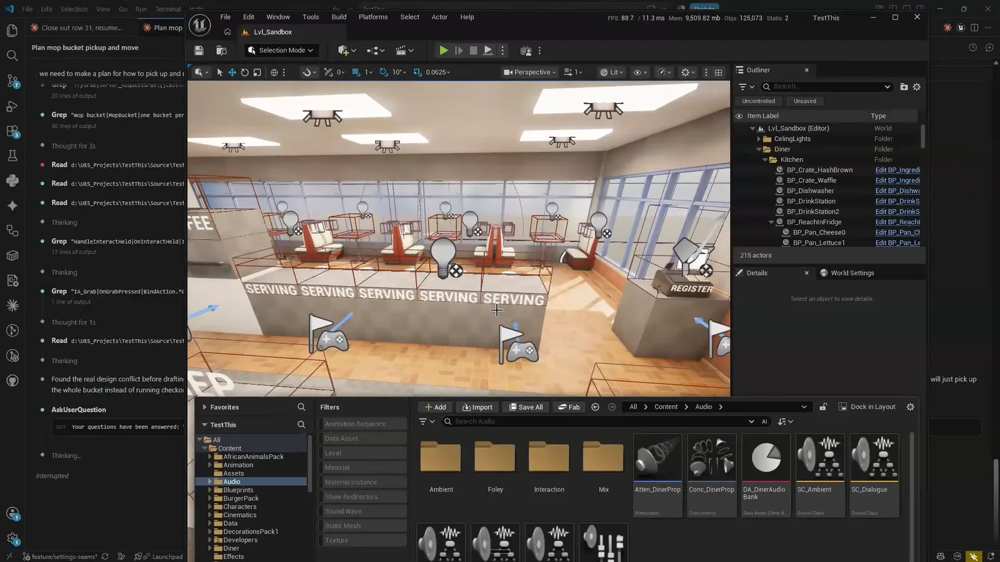

언리얼 엔진 5.8에 실험 단계 기능으로 MCP(Model Context Protocol) 플러그인이 들어왔다. 에디터 안에서 MCP 서버를 띄우고, Claude Code나 Codex 같은 에이전트가 그 서버를 통해 에디터를 조작하는 구조다.

Epic 에듀케이션 오피스 아워 세션을 한국어 자막으로 올린 [언리얼 엔진 5.8 MCP 시작하기](https://www.youtube.com/watch?v=-Bol0qjz3rw)를 보고, 삼인칭 템플릿에서 Claude Code와 Codex로 프로퍼티 일괄 수정을 시켜 봤다. 여러 프로퍼티를 자연어로 한 번에 다룰 수 있다는 점은 고무적이었다. 동시에 언리얼 개발이 에디터에 묶여 있다는 사실이 에이전틱 개발에서 어떤 제약이 되는지도 다시 보게 됐다.

## 공식 문서에 없는 `Editor Toolset`

공식 문서는 `Unreal MCP`와 `All Toolsets` 두 플러그인을 켜라고 안내한다. 영상에서는 `Editor Toolset`까지 세 개를 켜야 한다고 한다. `Editor Toolset`이 꺼져 있으면 에이전트가 서버에 연결은 되지만 사용할 툴이 없어서 에디터를 조작하지 못한다.

영상의 설정 슬라이드는 공식 문서에 실린 설정 다이어그램과 같은 그림이다. 차이는 아래에 붙은 한 줄뿐이다. 1단계는 플러그인 두 개가 아니라 세 개이고, 온라인 가이드에는 `EditorToolset`이 빠져 있다는 정정이다. 2026년 10월 6일 기준으로 공식 문서에는 아직 반영되지 않았다.

영상을 보기 전에는 이 플러그인이 필요하다는 사실을 몰랐다. 공식 문서만 따라 설정했다면 주요 에디터 기능이 왜 동작하지 않는지부터 헤맸을 것이다.

나머지 설정은 [공식 문서](https://dev.epicgames.com/documentation/en-us/unreal-engine/unreal-mcp-in-unreal-editor)를 따르면 된다.

## 일괄 작업에는 맞고, 단일 수정에는 맞지 않는다

여러 프로퍼티를 다루는 작업을 자연어로 처리할 수 있다는 점이 가장 고무적이었다. 하나하나 클릭해서 바꾸던 값을 조건으로 묶어 한 번에 맡길 수 있다.

에이전트가 한 작업을 `Ctrl+Z`로 되돌릴 수 있다는 점은 직관적이다. 에디터에서 하던 방식 그대로 되돌리면 된다. 에이전트에게 왜 그렇게 설정했는지 물어보며 에디터 사용법을 배울 수 있다는 점도 좋았다.

반대로 프로퍼티 하나를 바꾸는 일은 사람이 디테일 패널에서 직접 하는 편이 빠르다. MCP를 거치면 토큰 사용량도 비교적 많고, 직접 수정하는 것보다 시간이 더 걸리는 경우도 많다. 영상에서도 툴세트 설명을 읽어 오는 데만 머티리얼은 약 2만 6천 토큰, 나이아가라는 25만 토큰 가까이 든다고 한다. 그래서 지금은 작업을 골라서 맡겨야 한다.

## 프롬프트는 단순하고 구체적으로

영상에서 권하는 사용법은 크게 세 가지다.

- 에이전트는 한 번에 한 가지 작업만 할 수 있으니 프롬프트를 최대한 단순하게 유지한다.
- 명령이 모호하면 문제가 생기기 쉬우니 대상을 구체적으로 지정한다.
- AI 에이전트는 가정을 하고 일을 진행하는 경우가 잦으니, 사용자와 같은 이해를 갖고 있는지 먼저 확인한다.

## 현재 한계

영상에서 밝힌 한계 중 눈에 띈 것은 두 가지다.

- 로컬 머신에서만 동작한다. 인증 레이어가 없고 루프백 요청만 허용하므로 다른 머신의 에디터에 작업을 시킬 수 없다.
- 에디터 안에서만 쓸 수 있다. 출시된 게임 런타임에서 쓰는 용도가 아니다.

## AI가 게임을 다 만들어 주지는 않는다

영상 후반에는 발표자가 만든 로컬 네트워크 멀티플레이어 요리 게임이 나온다. 발표자는 이 게임을 Claude Code로 만들었다고 한다. 머티리얼, 애니메이션, 블루프린트 등 게임 제작에 쓰는 기능 대부분을 제대로 활용할 수 있는 것으로 보여서 고무적이었다.

그렇다고 "게임 만드는 법을 몰라도 AI가 다 만들어 준다"는 이야기가 맞는 것은 아니다. 영상의 답은 다음과 같다.

- AI는 많은 작업에서 90%까지는 훌륭하게 데려다준다.
- 하지만 프로젝트를 어떻게 구성하고 싶은지에 대한 기초 지식은 반드시 필요하다.
- 기능들이 어떻게 맞물려 돌아가는지 알아야 AI에게 프로젝트 구조를 제대로 지시할 수 있다.
- 머티리얼은 어떻게 만들지, 블루프린트는 어디에 둘지, 게임이 어떻게 동작해야 하는지를 시스템 지침으로 넣어 준다. 컨텍스트는 늘어나지만 원하는 결과를 얻기가 훨씬 쉬워진다.

발표자의 빌드 파이프라인이 좋은 예다. 발표자는 에이전트가 Event Tick을 쓰면 빌드가 에러를 내도록 검사를 넣었다. 그 설정 방법은 몰라서 Claude에게 안내받았다고 한다. 무엇을 막을지는 사람이 정했고, 어떻게 막을지는 에이전트의 도움을 받은 것이다.

언리얼 MCP를 가장 잘 쓰는 방법은 게임을 통째로 만들게 하는 것이 아니라 프로젝트를 올바른 구조로 잡는 데 도움을 받는 것이다. 에이전트가 만든 결과를 판단하려면 결국 그 구조를 이해하고 있어야 한다.

## 게임 개발과 에이전틱 코딩의 거리

나는 게임 개발이 웹 개발보다 AI 에이전틱 개발을 받아들이기 어려운 분야라고 생각한다. 언리얼 MCP를 써 보며 그 이유 중 하나가 에디터 의존성이라는 점이 더 분명해졌다.

MCP 서버는 에디터 프로세스 안에서 돌고 에디터마다 포트를 하나씩 차지한다. 기본 포트는 8000번이고, 여러 프로젝트나 에이전트를 동시에 띄우려면 포트를 바꿔야 한다. 에이전트를 여러 워크트리에서 병렬로 돌리려면 워크트리마다 에디터를 띄우고 포트를 따로 맞춰야 한다는 뜻이다. 에셋도 마찬가지다. `.uasset`과 `.umap`은 바이너리라서 텍스트로 병합할 수 없고, 두 워크트리에서 같은 에셋을 고치면 한쪽 결과를 버려야 한다.

웹 개발에서는 워크트리를 나누고 각자 테스트를 돌리면 에이전트 여러 개가 독립적으로 일할 수 있다. 언리얼 개발은 에셋, 레벨, 블루프린트처럼 에디터를 거쳐야 확인할 수 있는 작업이 많다. MCP가 에이전트에게 에디터를 열어 줬지만, 그 에디터가 작업 단위마다 하나씩 필요하다는 구조는 그대로다.

다만 이것이 게임이라는 분야 자체의 한계라기보다는 에디터와 바이너리 에셋 중심의 작업 방식에서 오는 제약이라고 본다. 언리얼 MCP는 그 간극을 에디터 쪽에서 메우려는 시도다. 속도가 충분히 빨라지고 토큰 비용이 충분히 줄어들면, 앞으로의 게임 개발은 이런 에디터 내장 MCP를 활용하는 방식으로 바뀔 것이라고 본다.

## 참고 자료

- [Unreal Engine KR: 언리얼 엔진 5.8 MCP 시작하기](https://www.youtube.com/watch?v=-Bol0qjz3rw)
- [Epic Games: Unreal MCP in Unreal Editor](https://dev.epicgames.com/documentation/en-us/unreal-engine/unreal-mcp-in-unreal-editor)
