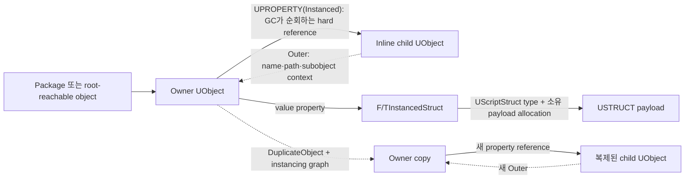

한 Asset 안에서 서로 다른 파생 type의 설정 조각을 추가하고 Details 패널에서 바로 편집하고 싶을 때가 있다. 예를 들면 아이템마다 `StackLimit`, `Cooldown`, `GrantedAbility` 규칙을 원하는 조합으로 갖게 하는 경우다.

이 글에서 사용한 Unreal Engine 5.3에서는 크게 두 계열을 선택할 수 있다.

- **Instanced UObject**: object identity, Outer, virtual/UFUNCTION, interface, delegate, GC object가 필요할 때
- **Instanced Struct**: 여러 `USTRUCT` type 중 하나를 value payload로 저장하고 복사·직렬화·DataTable에서 쓰고 싶을 때

## 무엇을 고를까

| 요구                                                              | 권장 type                                                 |
| ----------------------------------------------------------------- | --------------------------------------------------------- |
| 고정 schema의 단순 data                                           | 일반 `USTRUCT`                                            |
| 여러 native USTRUCT 파생 payload, value semantics, DataTable      | `TInstancedStruct<Base>`                                  |
| compile time에 base를 고정할 수 없는 generic property             | `FInstancedStruct` + `BaseStruct` metadata                |
| object identity, virtual function, UFUNCTION, interface, delegate | Instanced UObject                                         |
| 여러 owner가 공유하는 독립 Asset                                  | `UDataAsset` 또는 `UPrimaryDataAsset` hard/soft reference |

“UObject는 무겁고 struct는 가볍다”만으로 결정하지 않는다. 객체 행동과 identity가 모델의 일부인지, 아니면 data value의 type만 달라지는지가 먼저다.

## Ownership, GC, 복사의 관계



가장 중요한 화살표는 `Owner → UPROPERTY → Child`다. `Outer`는 이름, path, logical containment, duplication context를 정하지만 C++ RAII owner나 GC strong reference의 대체물이 아니다. child의 Outer를 owner로 설정했더라도 owner가 reflected hard reference로 child를 가리키지 않으면 그 관계만으로 child를 살려 두지 못한다.

`FInstancedStruct`는 UObject pointer가 아니라 value wrapper다. 선택된 `UScriptStruct` type과 정렬된 payload allocation을 소유하고 copy할 때 payload를 deep copy한다. payload 안의 reflected UObject reference는 wrapper가 reflected owner graph 안에 있을 때 serializer와 reference collector가 처리한다.

## Instanced UObject의 specifier

| 이름                 | 선언 위치    | 역할                                                                                             |
| -------------------- | ------------ | ------------------------------------------------------------------------------------------------ |
| `EditInlineNew`      | `UCLASS`     | Details 패널에서 해당 class instance를 inline 생성할 수 있게 함                                  |
| `DefaultToInstanced` | `UCLASS`     | 이 class type property를 기본적으로 instanced reference로 취급하며 subclass에 상속               |
| `Instanced`          | `UPROPERTY`  | persistent instance, export object, instanced reference와 EditInline metadata를 설정             |
| `Export`             | `UPROPERTY`  | text export/복사에서 reference만이 아니라 subobject block을 함께 export. `Instanced`가 이미 암시 |
| `Outer`              | UObject 관계 | object name/path와 context를 정의. GC ownership 자체는 아님                                      |

`EditInlineNew`만으로 저장, GC, 복제까지 보장되지 않는다. 반대로 `Instanced`를 명시하면 property contract가 분명해진다. 특히 array나 map 같은 container에서는 `DefaultToInstanced`만 기대하기보다 property에 `Instanced`를 직접 붙이는 편이 Details authoring까지 안전하다.

## Instanced UObject 완전 예제

```cpp
// ItemRuleObjects.h
#pragma once

#include "CoreMinimal.h"
#include "Engine/DataAsset.h"
#include "ItemRuleObjects.generated.h"

UCLASS(
    Abstract,
    BlueprintType,
    Blueprintable,
    EditInlineNew,
    DefaultToInstanced)
class MYGAME_API UItemRule : public UObject
{
    GENERATED_BODY()

public:
    UPROPERTY(EditAnywhere, BlueprintReadWrite, Category = "Rule")
    FName Label;
};

UCLASS(meta = (DisplayName = "Stack Limit"))
class MYGAME_API UStackLimitRule final : public UItemRule
{
    GENERATED_BODY()

public:
    UPROPERTY(
        EditAnywhere,
        BlueprintReadWrite,
        Category = "Rule",
        meta = (ClampMin = "1"))
    int32 MaxStack = 1;
};

UCLASS(BlueprintType)
class MYGAME_API UItemDefinition final : public UDataAsset
{
    GENERATED_BODY()

public:
    UPROPERTY(EditAnywhere, BlueprintReadOnly, Instanced, Category = "Rules")
    TArray<TObjectPtr<UItemRule>> Rules;

    UItemRule* AddRule(TSubclassOf<UItemRule> RuleClass);
};
```

```cpp
// ItemRuleObjects.cpp
#include "ItemRuleObjects.h"

UItemRule* UItemDefinition::AddRule(TSubclassOf<UItemRule> RuleClass)
{
    UClass* ChosenClass = RuleClass.Get();
    if (!ChosenClass || ChosenClass->HasAnyClassFlags(CLASS_Abstract))
    {
        return nullptr;
    }

    UItemRule* NewRule = NewObject<UItemRule>(this, ChosenClass);
    Rules.Add(NewRule);
    return NewRule;
}
```

runtime에 동적 type을 만들 때는 `NewObject<UItemRule>(this, ChosenClass)`처럼 owner를 Outer로 전달한다. 생성자에서 class가 고정된 default subobject를 만들 때는 `CreateDefaultSubobject`가 맞다.


_UE 5.3 Details 패널에서 inline object type을 고르는 모습._

### GC를 살리는 것은 reflected reference다

예제에서 child가 유지되는 핵심은 `Rules`가 `UPROPERTY`인 점이다. 같은 `TArray<TObjectPtr<UItemRule>>`를 일반 C++ member로만 선언하면 `TObjectPtr`이라는 wrapper 이름만으로 GC가 자동 순회하지 않는다. 필요한 경우 `UPROPERTY`, `FGCObject`, `AddReferencedObjects` 중 맞는 reference collection path를 제공한다.

### Save, load, duplication

inline subobject는 owner package에 함께 저장되고 owner와 함께 load될 수 있다. 그러나 “child 안의 모든 reference가 완전히 load된다”는 뜻은 아니다.

- `Transient` property는 저장되지 않는다.
- `TSoftObjectPtr`·`TSoftClassPtr` target은 soft reference 정책을 따른다.
- 외부 Asset reference는 별도 package object다.
- 잘못된 Outer나 instancing flag는 copy/paste·duplication 결과를 깨뜨릴 수 있다.

`Instanced` contract가 올바르면 `DuplicateObject`는 instancing graph를 통해 owner별 child copy를 만들 수 있다.

```cpp
UItemDefinition* Copy = DuplicateObject<UItemDefinition>(
    Source,
    GetTransientPackage());

check(Copy);
check(Copy->Rules.Num() == Source->Rules.Num());

if (!Copy->Rules.IsEmpty())
{
    check(Copy->Rules[0] != Source->Rules[0]);
    check(Copy->Rules[0]->GetOuter() == Copy);
    check(Copy->Rules[0]->Label == Source->Rules[0]->Label);
}
```

Editor tool에서 array를 code로 수정한다면 undo/redo를 위한 `Modify()`, transactional flag, package dirty 표시와 실제 save를 별도로 처리한다.

Save serialization과 network replication도 같은 기능이 아니다. replicated Actor의 inline UObject를 client에 보내려면 pointer property 표시만이 아니라 `ReplicateSubobjects` 같은 subobject replication 설계가 필요하다.

## Instanced UObject container

배열과 map을 쓸 때는 property 자체에 `Instanced`를 명시해 inline object라는 계약을 드러낸다.

```cpp
UPROPERTY(EditAnywhere, Instanced, Category = "Rules")
TArray<TObjectPtr<UItemRule>> OrderedRules;

UPROPERTY(EditAnywhere, Instanced, Category = "Rules")
TMap<FName, TObjectPtr<UItemRule>> RulesByName;
```

- 순서가 의미 있으면 `TArray`.
- lookup key가 필요하면 `FName`이나 enum 같은 stable scalar key와 object value map.
- UObject map key와 `TSet<UObject*>`는 content equality가 아니라 pointer identity이며 Details authoring도 불편하다.
- soft, weak, class reference는 owner별 inline child object가 아니므로 `Instanced` 용도가 아니다.
- 복잡한 nested container는 UHT 제한과 편집 UI를 확인하고 필요하면 중간 USTRUCT wrapper를 둔다.

## Instanced Struct setup (UE 5.3)

먼저 Plugins 창에서 experimental **Struct Utils** plugin을 활성화한다. 사용하는 module의 `{ModuleName}.Build.cs`에도 `StructUtils` dependency를 추가한다.

```csharp
PublicDependencyModuleNames.AddRange(
    new[]
    {
        "Core",
        "CoreUObject",
        "Engine",
        "StructUtils",
    }
);
```

header는 다음 경로로 include한다.

```cpp
#include "StructUtils/InstancedStruct.h"
```

`FInstancedStruct` 자체는 `BlueprintType`이며 UE 5.1부터 Blueprint Graph와 전용 library 지원이 확대됐다. 다만 native `USTRUCT` inheritance hierarchy와 `TInstancedStruct<Base>` property type을 선언하는 작업은 C++ 영역이다.

## `TInstancedStruct<Base>`와 DataTable 예제

```cpp
// ItemRuleStructs.h
#pragma once

#include "CoreMinimal.h"
#include "Engine/DataTable.h"
#include "StructUtils/InstancedStruct.h"
#include "ItemRuleStructs.generated.h"

USTRUCT(BlueprintType)
struct MYGAME_API FItemRuleData
{
    GENERATED_BODY()

    UPROPERTY(EditAnywhere, BlueprintReadWrite, Category = "Rule")
    FName Label;
};

USTRUCT(BlueprintType)
struct MYGAME_API FStackLimitRuleData : public FItemRuleData
{
    GENERATED_BODY()

    UPROPERTY(
        EditAnywhere,
        BlueprintReadWrite,
        Category = "Rule",
        meta = (ClampMin = "1"))
    int32 MaxStack = 1;
};

USTRUCT(BlueprintType)
struct MYGAME_API FItemDataRow : public FTableRowBase
{
    GENERATED_BODY()

    UPROPERTY(
        EditAnywhere,
        BlueprintReadWrite,
        Category = "Rules",
        meta = (
            BaseStruct = "ItemRuleData",
            ExcludeBaseStruct,
            ShowTreeView))
    TArray<TInstancedStruct<FItemRuleData>> Rules;
};
```

`TInstancedStruct<FItemRuleData>`의 template argument가 picker의 base struct를 정한다. 다만 UE 5.3에서 array나 map에 넣었을 때 picker가 base를 찾지 못하는 경우에는 예제처럼 `BaseStruct` metadata를 함께 지정한다. direct property에서는 template argument만으로 충분하다.


_UE 5.3에서 array element의 파생 struct type을 고르는 모습._

DataTable 전체의 row type은 여전히 하나의 `FItemDataRow`로 고정된다. 각 row가 완전히 다른 struct가 되는 것이 아니라 `Rules` column 안의 payload type만 `FStackLimitRuleData` 같은 descendant로 달라진다.

DataTable에서 사용할 때는 저장한 뒤 editor를 다시 열어 payload type과 값이 유지되는지 확인하고, CSV/JSON export가 필요한 workflow라면 round trip도 따로 검증한다.

## 생성하고 안전하게 읽기

```cpp
TInstancedStruct<FItemRuleData> Rule =
    TInstancedStruct<FItemRuleData>::Make<FStackLimitRuleData>();

FStackLimitRuleData& MutableRule =
    Rule.GetMutable<FStackLimitRuleData>();
MutableRule.MaxStack = 20;

if (const FStackLimitRuleData* StackRule =
        Rule.GetPtr<FStackLimitRuleData>())
{
    UE_LOG(
        LogTemp,
        Log,
        TEXT("MaxStack=%d"),
        StackRule->MaxStack);
}
```

API의 실패 contract를 구분한다.

| API                  | 반환                    | type이 호환되지 않을 때 |
| -------------------- | ----------------------- | ----------------------- |
| `GetScriptStruct()`  | 저장된 `UScriptStruct*` | 비어 있으면 null 가능   |
| `Get<T>()`           | `const T&`              | check/assert contract   |
| `GetPtr<T>()`        | `const T*`              | null                    |
| `GetMutable<T>()`    | `T&`                    | check/assert contract   |
| `GetMutablePtr<T>()` | `T*`                    | null                    |

mutable reference가 필요하면 `GetMutable<T>()`를 `T&`로 받고, 실패 가능한 pointer가 필요하면 `GetMutablePtr<T>()`를 쓴다.

`USTRUCT` 안에도 일반 C++ member function을 정의할 수 있다. 다만 `UFUNCTION`은 USTRUCT member에 선언할 수 없다. Blueprint-callable operation이 필요하면 `UBlueprintFunctionLibrary`나 별도 UObject API로 노출한다.

## Untyped `FInstancedStruct`

generic tool처럼 compile-time base type을 정할 수 없을 때만 untyped wrapper와 metadata를 사용한다.

```cpp
UPROPERTY(
    EditAnywhere,
    meta = (
        BaseStruct = "/Script/MyGame.ItemRuleData",
        ExcludeBaseStruct,
        ShowTreeView))
FInstancedStruct Rule;
```

정확한 path 형식은 `"/Script/ModuleName.StructName"`이다. reflected USTRUCT name에는 C++ `F` prefix가 들어가지 않는다. module 이름의 철자와 `Module.Struct` 구분자를 정확히 써야 한다.

UE 5.3에서 picker를 구성할 때는 주로 아래 metadata를 쓴다.

- `BaseStruct`: 선택 가능한 최상위 struct 지정
- `ExcludeBaseStruct`: 최상위 struct 자체는 선택지에서 제외
- `ShowTreeView`: 파생 관계를 tree로 표시

UE 5.3에서 확인한 Details 패널에서는 `InstancedStruct` property에 둔 `EditCondition`이 기대대로 동작하지 않았다. 조건부 편집에 의존한다면 실제 property 형태와 editor 화면에서 먼저 검증한다.

## Struct container 경계

- direct property와 `TArray`는 first-class editor path다.
- `TMap<FName, TInstancedStruct<FItemRuleData>>`처럼 scalar key와 instanced value를 사용할 수 있다.
- 기본 `GetTypeHash`가 없으므로 `F/TInstancedStruct`를 `TSet` element나 `TMap` key로 쓰지 않는다.
- 많은 runtime payload를 조밀하게 관리하고 Details customization이 필요 없다면 `FInstancedStructContainer`를 검토한다.
- UI에서 편집할 heterogeneous sequence에는 `TArray<FInstancedStruct>`가 더 직접적이다.

Blueprint User Defined Struct는 native USTRUCT inheritance hierarchy를 만들지 못한다. base-filtered `TInstancedStruct<NativeBase>`와 Blueprint graph 지원을 “Blueprint에서 임의의 struct 상속 tree를 만든다”는 뜻으로 해석하면 안 된다. base가 없는 `FInstancedStruct`는 User Defined Struct를 담을 수 있지만 compile-time type safety와 base filtering을 잃는다.

## Memory와 성능을 고정 byte 수로 비교하지 않기

UObject의 overhead를 고정된 byte 수로 단정할 수는 없다. 크기는 platform, build configuration, engine version에 따라 달라진다. `FInstancedStruct`도 payload bytes만 inline 저장하는 zero-overhead type이 아니다. wrapper는 script type과 payload pointer를 유지하고 payload를 정렬된 별도 allocation에 소유한다.

실제로 비교할 비용은 아래와 같다.

| Instanced UObject                                     | Instanced Struct                                         |
| ----------------------------------------------------- | -------------------------------------------------------- |
| UObject allocation, identity, Outer, GC traversal     | payload allocation, UScriptStruct metadata, deep copy    |
| virtual/UFUNCTION/interface/delegate 가능             | 값 중심, 일반 C++ member function 가능                   |
| per-object flags, subobject serialization/duplication | struct serializer, text import/export, NetSerialize 경로 |
| pointer graph와 object lifetime 관리                  | copy/move 빈도와 payload size 관리                       |

규칙 수, payload 크기, copy 빈도, editor transaction, load/cook time을 실제 project data로 profile한다. 동작 없는 작은 data라도 수천 개를 매 frame copy하면 struct가 자동으로 빠른 것은 아니며, behavior-rich object를 억지로 struct와 type switch로 바꾸면 유지보수 비용이 커질 수 있다.

## 적용 체크리스트

- object identity·behavior가 필요한지, heterogeneous value만 필요한지 먼저 결정했는가?
- inline UObject class에 `EditInlineNew`/`DefaultToInstanced`, property에 명시적 `Instanced`가 있는가?
- child의 Outer뿐 아니라 owner의 reflected hard reference가 있는가?
- soft/weak/class reference를 inline ownership으로 오해하지 않았는가?
- save/load, duplicate, copy/paste, undo/redo를 실제 Asset로 검증했는가?
- network subobject라면 serialization과 별도로 replication path를 구현했는가?
- UE 5.3 project에서 Struct Utils plugin과 Build.cs dependency를 설정했는가?
- container의 `TInstancedStruct<Base>` picker가 base를 찾지 못하면 `BaseStruct` metadata를 지정했는가?
- untyped base path가 `"/Script/Module.Struct"` 형식인가?
- DataTable의 fixed row schema와 heterogeneous field payload를 구분했는가?
- JSON/CSV round trip, cook, reload, packaged build를 test했는가?
- exact byte 수 대신 allocation, copy, GC, authoring 비용을 profile했는가?

## 참고 자료

- [Epic Games: UPROPERTY specifiers](https://dev.epicgames.com/documentation/en-us/unreal-engine/unreal-engine-uproperties)
- [Epic Games: Class specifiers](https://dev.epicgames.com/documentation/en-us/unreal-engine/class-specifiers)
- [Epic Games: Object pointers and GC](https://dev.epicgames.com/documentation/en-us/unreal-engine/object-pointers-in-unreal-engine)
- [Epic Games: Unreal Object Handling](https://dev.epicgames.com/documentation/en-us/unreal-engine/unreal-object-handling-in-unreal-engine)
- [Epic Games: `NewObject`](https://dev.epicgames.com/documentation/en-us/unreal-engine/API/Runtime/CoreUObject/NewObject)
- [Epic Games: `DuplicateObject`](https://dev.epicgames.com/documentation/en-us/unreal-engine/API/Runtime/CoreUObject/DuplicateObject)
- [Epic Games: `FObjectInstancingGraph`](https://dev.epicgames.com/documentation/en-us/unreal-engine/API/Runtime/CoreUObject/FObjectInstancingGraph)
- [Epic Games: `FInstancedStruct`](https://dev.epicgames.com/documentation/en-us/unreal-engine/API/Runtime/CoreUObject/FInstancedStruct)
- [Epic Games: `TInstancedStruct`](https://dev.epicgames.com/documentation/en-us/unreal-engine/API/Runtime/CoreUObject/TInstancedStruct)
- [Epic Games: `FInstancedStructContainer`](https://dev.epicgames.com/documentation/en-us/unreal-engine/API/Runtime/CoreUObject/FInstancedStructContainer)
- [Epic Games: `UDataTable`](https://dev.epicgames.com/documentation/en-us/unreal-engine/API/Runtime/Engine/UDataTable)
- [Epic Games UE 5.1 release notes](https://dev.epicgames.com/documentation/en-us/unreal-engine/unreal-engine-5.1-release-notes?application_version=5.1)
- [Working with Data in Unreal Engine](https://dev.epicgames.com/community/learning/tutorials/Gp9j/working-with-data-in-unreal-engine-data-tables-data-assets-uproperty-specifiers-and-more)
- [DataConfig: InstancedStruct](https://slowburn.dev/dataconfig/Extra/InstancedStruct.html#instancedstruct)
- [GenericItemization: Instanced Structs](https://github.com/mattyman174/GenericItemization#instanced-structs)
- [Polymorphic Serialization in Unreal Engine](https://slowburn.dev/blog/polymorphic-serialization-in-unreal-engine/)
