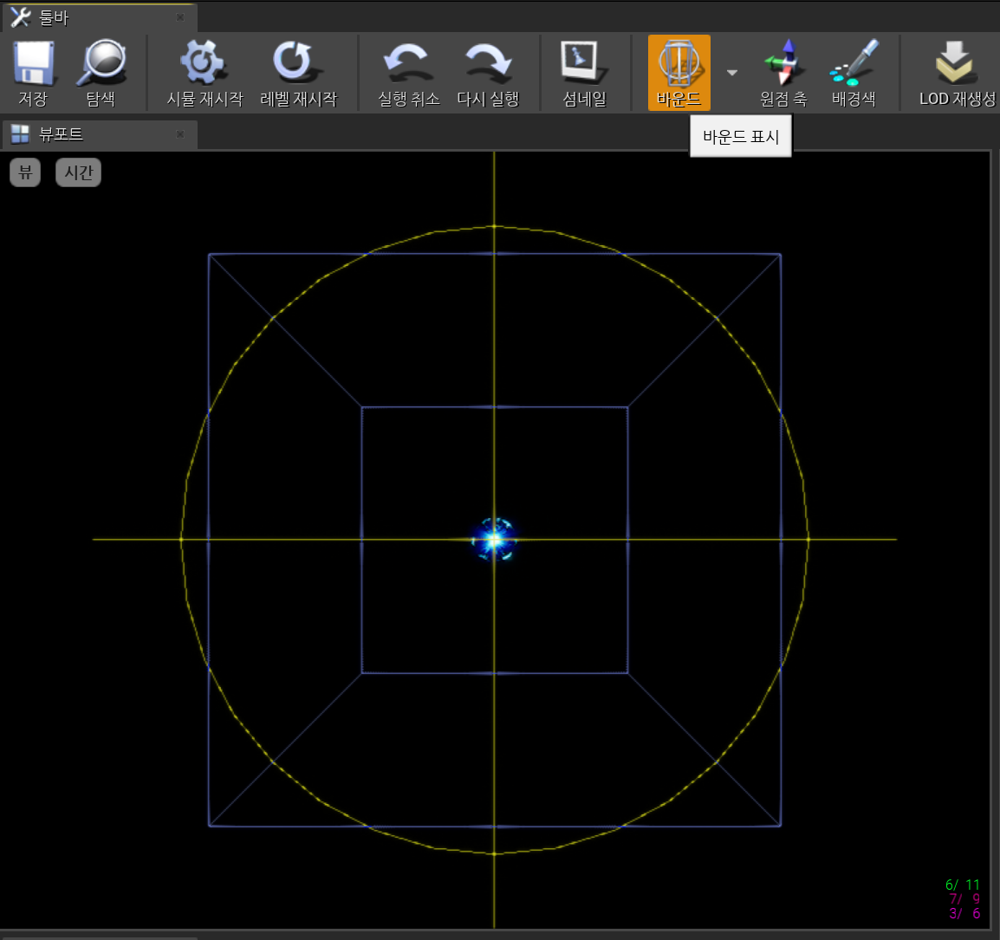
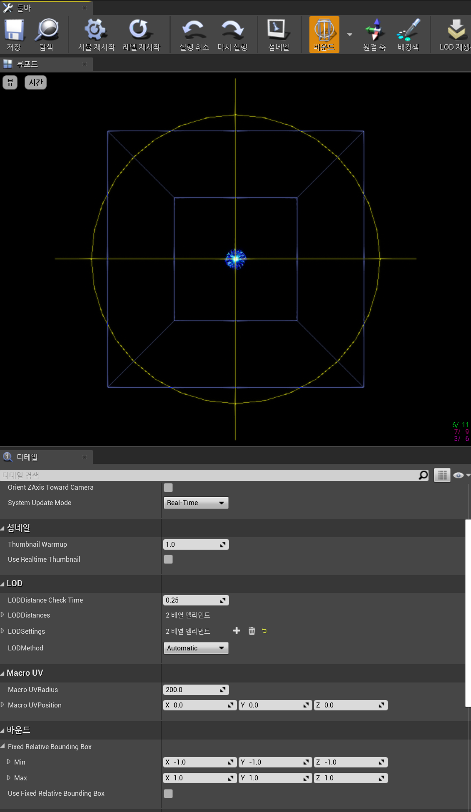
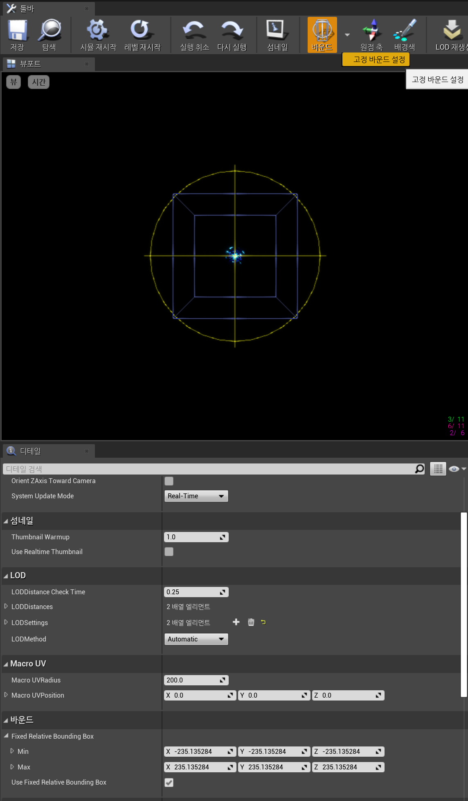

파티클이 정상 재생되다가 카메라를 특정 각도로 돌리면 갑자기 사라지는 문제가 있었다.

<iframe class="video-embed" src="https://www.youtube-nocookie.com/embed/YxA499D3f9Y" title="카메라 각도에 따라 파티클이 컬링되는 재현 영상" loading="lazy" allow="accelerometer; autoplay; clipboard-write; encrypted-media; gyroscope; picture-in-picture" allowfullscreen></iframe>

## 문제 현상

emitter의 입자는 화면 안에 남아 있었다. 하지만 component bounds가 view frustum 밖이라고 판단되는 순간 전체 particle system이 컬링됐다. 반투명·긴 trail·넓게 퍼지는 effect에서는 실제 시각 범위와 계산된 bounds가 다를 때 이 문제가 쉽게 드러난다.

## 적용 범위

UE4/UE5 프로젝트에서 Cascade `UParticleSystem`을 사용할 때 해당한다. Niagara는 bounds 설정 위치와 계산 방식이 다르다. system/emitter properties의 bounds를 별도로 확인한다.

## 원인

renderer는 모든 particle을 매 frame 개별 확인하지 않는다. component의 bounding box로 먼저 표시 여부를 판단한다. bounds가 실제 effect보다 작거나 origin에서 벗어나 있으면 카메라 각도에 따라 effect 전체가 사라진다.

## 재현 및 진단

1. Cascade viewport에서 bounds 표시를 켠다.
2. effect의 최대 수명 동안 입자·trail이 box 밖으로 나가는지 확인한다.
3. level viewport에서는 카메라를 돌리며 사라지는 순간의 bounds를 비교해 본다.
4. component scale과 parent transform이 bounds에 미치는 영향도 함께 살핀다.

## 해결 방법

Particle System의 Fixed Relative Bounding Box를 켠 뒤 effect가 실제로 도달하는 최대 범위를 포함하도록 box를 설정한다.

가장 과격한 emitter 상태, 이동하는 parent와 LOD까지 포함해 필요한 범위를 측정한다. 값은 임의로 매우 크게 잡지 않는다.

## 검증 방법

- 가까운 거리와 먼 거리, 넓은 FOV와 좁은 FOV에서 카메라를 360도 회전한다.
- effect lifetime 전체와 spawn burst 순간을 확인한다.
- list/grid가 아닌 실제 게임의 component scale과 attachment 상태에서 시험한다.
- `stat initviews` 등으로 컬링과 primitive 수가 과도하게 늘지 않는지도 살핀다.

## 주의점

너무 작은 bounds는 시각 오류를 만든다. 지나치게 큰 bounds는 보이지 않는 effect까지 렌더링 후보로 남겨 성능을 해친다. 원점이나 scale이 잘못된 effect를 bounds 확대만으로 숨기지 않는다.

## 참고 자료

- [Epic Games: Particle System Class—Fixed Relative Bounding Box](https://dev.epicgames.com/documentation/en-us/unreal-engine/particle-system-class?application_version=4.27)
