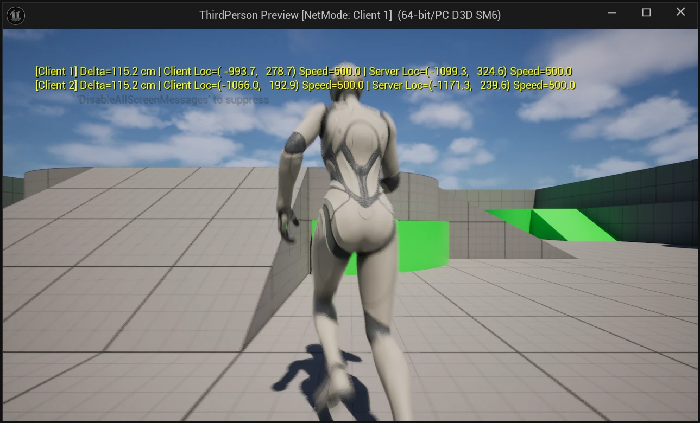
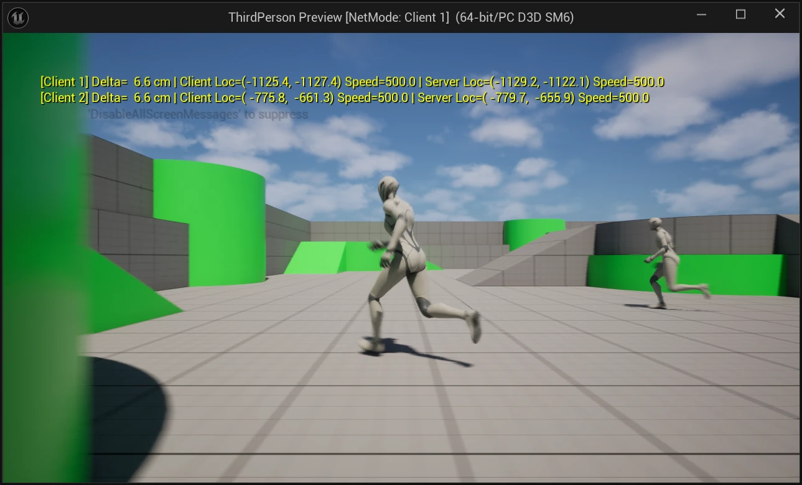
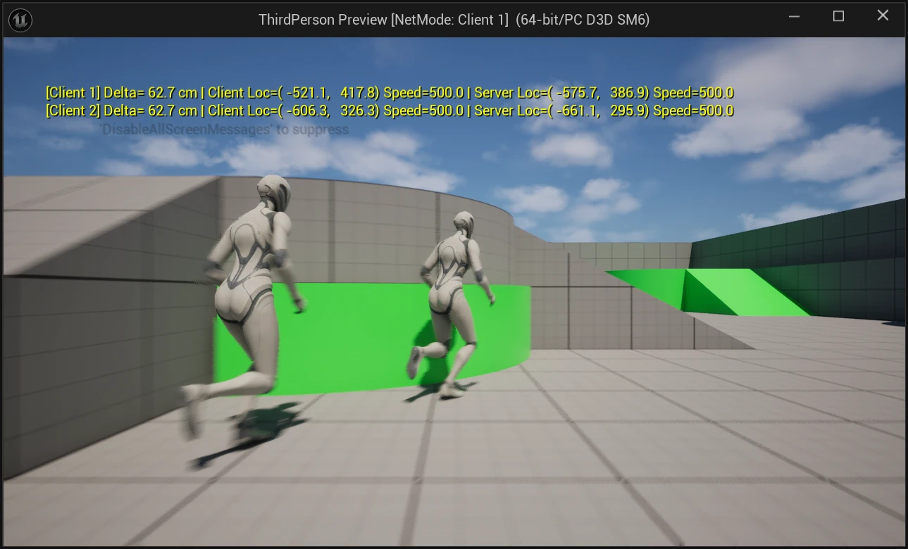
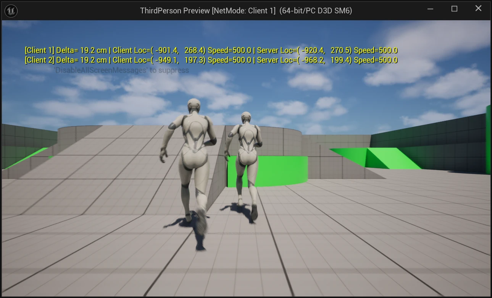

멀티플레이 디버깅을 하다 보면 클라이언트가 가진 값과 서버가 가진 값을 같은 시점에 비교해야 할 때가 있다. 서버와 클라이언트에서 각각 로그를 남기면 출력이 섞이고 두 줄이 같은 시점의 값이라는 보장도 없다.

PIE에서 `Run Under One Process`가 켜져 있으면 서버 월드와 클라이언트 월드가 한 프로세스 안에 같이 있다. 그래서 에디터 빌드에서는 클라이언트 코드가 서버 월드에 있는 같은 플레이어의 객체를 직접 읽을 수 있고 두 값을 한 줄에 같이 찍을 수 있다. Lyra 샘플의 `LyraDevelopmentStatics`에도 PIE의 권한 월드를 찾는 같은 방식의 함수가 있다.

이 글은 Third Person C++ 템플릿에서 이 방식을 직접 구현하고 네트워크 에뮬레이션으로 차이를 만들어 숫자로 확인한 기록이다.



## 환경

- 검증 버전: Unreal Engine 5.8, Third Person C++ 템플릿
- PIE `Net Mode`: Play As Client(같은 프로세스 안의 Dedicated Server), `Number of Players` 2
- `Run Under One Process` 켜짐, `Launch Separate Server` 꺼짐

## 서버 월드 찾기

PIE 월드는 `GEngine->GetWorldContexts()`에 `EWorldType::PIE`로 들어 있다. 한 PIE 세션 안에서 `NM_Client`가 아닌 월드는 Dedicated Server, Listen Server, Standalone 중 하나뿐이므로 그 월드를 찾으면 된다.

```cpp
UWorld* PIEDebug::FindAuthorityWorld()
{
#if WITH_EDITOR
	if (GEngine == nullptr)
	{
		return nullptr;
	}

	// A PIE session owns at most one world that is not a client: the dedicated or listen server, or a standalone world
	for (const FWorldContext& Context : GEngine->GetWorldContexts())
	{
		UWorld* World = Context.World();
		if (Context.WorldType == EWorldType::PIE && World != nullptr && World->GetNetMode() != NM_Client)
		{
			return World;
		}
	}
#endif
	return nullptr;
}
```

`FWorldContext::RunAsDedicated`로 Dedicated Server를 먼저 고르는 방법도 있지만 여기서는 "클라이언트가 아닌 PIE 월드"라는 조건 하나로 줄였다. 서버 월드가 다른 프로세스에 있으면 찾을 월드가 없으므로 `nullptr`이 반환된다.

## 같은 플레이어의 서버 측 PlayerController 찾기

서버 월드를 찾았으면 그 안에서 클라이언트 PlayerController와 같은 플레이어를 찾아야 한다. 객체 이름으로는 비교할 수 없다. 아래는 PIE 월드와 PlayerController를 덤프하는 콘솔 명령(`tp.Debug.DumpPIEPlayers`)의 출력이다.

```text
LogPIEDebug: Authority world: Dedicated Server
LogPIEDebug: [Dedicated Server] PIEInstance=0 RunAsDedicated=1
LogPIEDebug:     BP_ThirdPersonPlayerController_C_0 (PlayerId=256, UniqueId=NULL:DESKTOP-MH1K636-C7AC..., Pawn=BP_ThirdPersonCharacter_C_0)
LogPIEDebug:     BP_ThirdPersonPlayerController_C_1 (PlayerId=257, UniqueId=NULL:DESKTOP-MH1K636-CFD2..., Pawn=BP_ThirdPersonCharacter_C_1)
LogPIEDebug: [Client 1] PIEInstance=1 RunAsDedicated=0
LogPIEDebug:     BP_ThirdPersonPlayerController_C_0 (PlayerId=256, ...)
LogPIEDebug:         match by PlayerId -> BP_ThirdPersonPlayerController_C_0 (PlayerId=256, ...)
LogPIEDebug:         match by UniqueId -> BP_ThirdPersonPlayerController_C_0 (PlayerId=256, ...)
LogPIEDebug: [Client 2] PIEInstance=2 RunAsDedicated=0
LogPIEDebug:     BP_ThirdPersonPlayerController_C_0 (PlayerId=257, ...)
LogPIEDebug:         match by PlayerId -> BP_ThirdPersonPlayerController_C_1 (PlayerId=257, ...)
LogPIEDebug:         match by UniqueId -> BP_ThirdPersonPlayerController_C_1 (PlayerId=257, ...)
```

Client 2의 PlayerController 이름은 `_C_0`이지만 서버에서 대응하는 객체는 `_C_1`이다. 각 클라이언트 월드에는 자기 PlayerController 하나만 있기 때문이다.

대신 `PlayerState`의 값으로 비교한다. `PlayerId`는 서버가 할당해 클라이언트로 복제하므로 같은 플레이어의 두 사본은 값이 같다.

```cpp
APlayerController* PIEDebug::FindAuthorityPlayerController(const APlayerController* ClientController)
{
#if WITH_EDITOR
	UWorld* ServerWorld = FindAuthorityWorld();
	const APlayerState* ClientPlayerState = ClientController ? ClientController->PlayerState.Get() : nullptr;
	if (ServerWorld == nullptr || ClientPlayerState == nullptr)
	{
		return nullptr;
	}

	for (FConstPlayerControllerIterator It = ServerWorld->GetPlayerControllerIterator(); It; ++It)
	{
		APlayerController* ServerController = It->Get();
		const APlayerState* ServerPlayerState = ServerController ? ServerController->PlayerState.Get() : nullptr;

		// PlayerId is assigned by the server and replicated to clients, so both copies of the same player share it
		if (ServerPlayerState && ServerPlayerState->GetPlayerId() == ClientPlayerState->GetPlayerId())
		{
			return ServerController;
		}
	}
#endif
	return nullptr;
}
```

`PlayerState->GetUniqueId()`로 비교할 수도 있다. 위 덤프처럼 이 환경에서는 Null OSS가 `NULL:` ID를 채워 주기 때문에 두 방식의 결과가 같았다.

다만 `FUniqueNetIdWrapper`의 `operator==`는 두 ID가 모두 invalid이면 `true`를 반환한다(`CoreOnline.h`). 서버와 클라이언트 양쪽 UniqueId가 비어 있다면 모든 클라이언트가 서버 월드의 첫 번째 PlayerController로 매칭된다. `PlayerId` 비교에는 이 문제가 없어서 이쪽을 기본으로 두었다.

클라이언트에 `PlayerState`가 아직 복제되지 않은 시점도 있어서 null 검사를 앞에 둔다. Pawn은 서버 PlayerController에서 꺼낸다.

```cpp
template <typename T>
T* PIEDebug::FindAuthorityPawn(const APawn* ClientPawn)
{
	const APlayerController* ClientController = ClientPawn ? Cast<APlayerController>(ClientPawn->GetController()) : nullptr;
	const APlayerController* ServerController = FindAuthorityPlayerController(ClientController);
	return ServerController ? Cast<T>(ServerController->GetPawn()) : nullptr;
}
```

## 어느 월드의 로그인지 붙이기

PIE 로그는 서버와 클라이언트의 출력이 한 Output Log에 섞인다. `GetDebugStringForWorld()`는 월드의 NetMode와 PIE 인스턴스 번호로 `Dedicated Server`, `Listen Server`, `Client 1` 같은 문자열을 만들어 준다. 선언은 `UnrealEngine.h`에 있고 `WITH_EDITOR`와 상관없이 정의되어 있다.

```cpp
#define PIE_LOG(WorldContextObject, Verbosity, Format, ...) \
	UE_LOG(LogPIEDebug, Verbosity, TEXT("[%s] ") Format, *GetDebugStringForWorld((WorldContextObject)->GetWorld()), ##__VA_ARGS__)
```

## 클라이언트와 서버 값 비교

로컬 클라이언트 캐릭터의 위치·속도와 서버 측 사본의 값을 한 줄로 만든다. 화면 메시지는 매 프레임 갱신하고 로그는 0.5초 간격으로 남긴다.

```cpp
void PIEDebug::CompareWithAuthority(const ACharacter* ClientCharacter)
{
#if WITH_EDITOR
	using namespace PIEDebug::Private;

	if (!CVarCompareWithAuthority.GetValueOnGameThread() || ClientCharacter == nullptr
		|| !ClientCharacter->IsLocallyControlled() || ClientCharacter->GetNetMode() != NM_Client)
	{
		return;
	}

	const ACharacter* ServerCharacter = FindAuthorityPawn<ACharacter>(ClientCharacter);
	if (ServerCharacter == nullptr)
	{
		return;
	}

	const UWorld* ClientWorld = ClientCharacter->GetWorld();
	const int32 PIEInstance = GetPIEInstance(ClientWorld);
	const FVector ClientLocation = ClientCharacter->GetActorLocation();
	const FVector ServerLocation = ServerCharacter->GetActorLocation();
	const FString Comparison = FString::Printf(TEXT("Delta=%5.1f cm | Client Loc=(%7.1f, %7.1f) Speed=%5.1f | Server Loc=(%7.1f, %7.1f) Speed=%5.1f"),
		FVector::Dist(ClientLocation, ServerLocation),
		ClientLocation.X, ClientLocation.Y, ClientCharacter->GetVelocity().Size2D(),
		ServerLocation.X, ServerLocation.Y, ServerCharacter->GetVelocity().Size2D());

	// One keyed line per client, refreshed every frame. On-screen messages are shared by every PIE viewport
	GEngine->AddOnScreenDebugMessage(static_cast<uint64>(7000 + PIEInstance), 1.f, FColor::Yellow,
		FString::Printf(TEXT("[%s] %s"), *GetDebugStringForWorld(ClientWorld), *Comparison));

	// Log at most once per interval for each client
	static TMap<int32, double> LastLogTimes;
	double& LastLogTime = LastLogTimes.FindOrAdd(PIEInstance, 0.0);
	const double Now = ClientWorld->GetRealTimeSeconds();
	if (Now < LastLogTime || Now - LastLogTime >= CVarCompareLogInterval.GetValueOnGameThread())
	{
		LastLogTime = Now;
		PIE_LOG(ClientCharacter, Log, TEXT("%s"), *Comparison);
	}
#endif
}
```

`AddOnScreenDebugMessage`의 메시지는 모든 PIE 뷰포트가 공유한다. 그래서 키를 PIE 인스턴스마다 다르게 주면 한 창에서 Client 1과 Client 2의 줄을 함께 볼 수 있다.

호출은 캐릭터 `Tick`에서 한다.

```cpp
void AThirdPersonCharacter::Tick(float DeltaSeconds)
{
	Super::Tick(DeltaSeconds);

	// editor-only: compare the predicted client movement against the server-side copy of this character
	PIEDebug::ApplyAutoMove(this);
	PIEDebug::CompareWithAuthority(this);
}
```

`ApplyAutoMove`는 측정용 헬퍼다. `tp.Debug.AutoMove 60`을 주면 로컬 캐릭터가 초당 60도씩 방향을 바꾸며 최고 속도(500cm/s)로 원을 그린다. 손으로 조작하지 않아도 같은 조건에서 반복해 측정할 수 있다.

## 차이를 만들어 확인하기

PIE의 `Network Emulation` 설정으로 지연을 주고 등속 구간(양쪽 `Speed=500.0`)의 `Delta`만 모았다. 조건마다 약 10초, 샘플은 26~29개다.

| 조건                         | 평균 Delta | 범위            |
| ---------------------------- | ---------- | --------------- |
| 에뮬레이션 없음              | 9.5 cm     | 5.8 ~ 15.1 cm   |
| Clients Only, Outgoing 100ms | 63.2 cm    | 56.9 ~ 73.2 cm  |
| Clients Only, Outgoing 200ms | 116.2 cm   | 106.5 ~ 144.9 cm |
| Server Only, Outgoing 100ms  | 11.1 cm    | 5.6 ~ 34.4 cm   |

200ms와 Server Only 조건의 최댓값은 이동을 시작한 직후의 샘플이다.







클라이언트 송신 지연을 100ms 늘릴 때마다 평균 차이가 약 50cm씩 늘었다. 500cm/s × 0.1s = 50cm이므로 이동 속도와 지연을 곱한 값과 맞는다.

CharacterMovement는 클라이언트가 먼저 이동하고 서버는 클라이언트가 보낸 이동을 받은 뒤에 같은 이동을 재현한다. 그래서 서버 측 위치는 클라이언트→서버 지연만큼 뒤처진다. 같은 100ms를 서버 송신 쪽에 주었을 때는 기준선과 거의 같았다. 서버→클라이언트 지연은 서버 측 사본이 갱신되는 시점과 관계가 없기 때문으로 보인다.

에뮬레이션이 없을 때 남는 10cm 안팎은 측정 당시 약 80fps에서 500cm/s로 1~2프레임 이동한 거리로 보인다.

에디터가 백그라운드에 있으면 `Editor Preferences > General > Performance > Use Less CPU when in Background` 때문에 PIE가 초당 몇 프레임으로 떨어진다. 이 상태에서는 프레임 시간이 차이에 그대로 섞인다. 처음 측정할 때 에뮬레이션 없이도 62cm가 나와서 이 설정을 끄고 다시 측정했다.

## 제약

- 모든 코드는 `#if WITH_EDITOR` 안에 있다. 에디터가 아닌 게임 타깃(`ThirdPerson Win64 Development`)도 빌드해서 컴파일되는 것을 확인했고 이 빌드에서는 함수가 `nullptr`을 반환하거나 아무것도 하지 않는다.
- 서버와 클라이언트 월드가 같은 프로세스에 있을 때만 동작한다. `Run Under One Process`를 끄거나 `Launch Separate Server`를 켜면 이 전제가 깨진다.
- 클라이언트 코드가 리플리케이션을 거치지 않고 서버 객체를 읽는 방식이다. 값을 읽어 비교하는 용도로만 쓰고 서버 객체의 상태를 바꾸는 데 쓰지 않는다.
