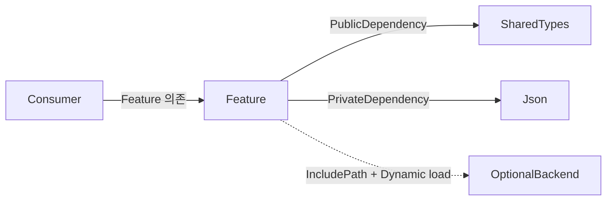

Unreal Engine 모듈에서 다른 모듈을 사용하려면 `[ModuleName].Build.cs`에 의존성을 선언한다. 가장 많이 쓰는 목록은 두 가지다.

```csharp
PublicDependencyModuleNames.Add("SharedTypes");
PrivateDependencyModuleNames.Add("Json");
```

흔히 이를 “헤더에서 쓰면 Public, cpp에서만 쓰면 Private”라고 외운다. 첫 판단에는 도움이 되지만 정확한 기준은 파일 확장자가 아니라 **현재 모듈의 공개 인터페이스를 compile하는 데 그 의존성이 필요한가**이다.

- `Public/`의 헤더가 다른 모듈의 타입 정의·compile definition·link symbol을 요구하면 Public dependency다.
- `Private/`의 header와 cpp에서만 필요하면 Private dependency다.
- Public 헤더가 타입을 전방 선언만 하고 정의를 요구하지 않으면 구현 dependency를 Private로 유지한다.
- header를 compile할 수 있다는 것, symbol을 link한다는 것, module을 runtime에 load한다는 것, DLL symbol을 export한다는 것은 서로 다른 문제다.

여기에 `PublicIncludePathModuleNames`, `PrivateIncludePathModuleNames`, `DynamicallyLoadedModuleNames`, IWYU, API macro, plugin descriptor까지 더하면 서로 다른 의존성 경계를 분리해서 볼 수 있다.

## 먼저 구분할 네 가지 축

`Public`이라는 단어가 여러 위치에서 등장하지만 모두 같은 기능은 아니다.

| 축                  | 질문                                                                    | 대표 설정                                                                     |
| ------------------- | ----------------------------------------------------------------------- | ----------------------------------------------------------------------------- |
| source 공개 범위    | 다른 module이 이 header를 include할 수 있는가?                          | `Public/`, `Private/` directory                                               |
| compile·link 의존성 | 어느 module의 public compile 환경과 import/link 관계가 전파되는가?      | `PublicDependencyModuleNames`, `PrivateDependencyModuleNames`                 |
| runtime load        | module을 언제, 어떤 조건으로 memory에 load하는가?                       | descriptor의 `LoadingPhase`, `FModuleManager`, `DynamicallyLoadedModuleNames` |
| binary symbol 공개  | modular build에서 class/function/data symbol을 DLL 밖으로 export하는가? | `MYMODULE_API`, `MinimalAPI`                                                  |

예를 들어 header를 `Public/`에 두었다고 그 class의 non-inline function이 자동으로 DLL 밖에 export되지는 않는다. 반대로 `PublicDependencyModuleNames`에 module을 추가해도 해당 module의 header가 source에 자동으로 `#include`되지는 않는다.

## 권장 module directory 구조

[Unreal Engine Modules 문서](https://dev.epicgames.com/documentation/en-us/unreal-engine/unreal-engine-modules)는 일반 C++ module을 다음처럼 나누도록 안내한다.

```text
Source/
└─ Feature/
   ├─ Feature.Build.cs
   ├─ Public/
   │  └─ Feature/
   │     └─ FeatureService.h
   └─ Private/
      ├─ FeatureModule.cpp
      └─ Feature/
         └─ FeatureService.cpp
```

- `Public/`: 이 module에 의존하는 다른 module이 include할 공개 header
- `Private/`: 현재 module 안에서만 사용할 header와 모든 cpp
- `Feature.Build.cs`: UBT가 target graph를 만들 때 읽는 compile·link 규칙

이는 C++ class member의 `public`, `private`, `protected`와 무관하다. `Private/` header에 public class가 있어도 다른 module의 include surface에는 노출되지 않는다.

## 다섯 가지 ModuleRules 목록

`ModuleRules`에서는 아래 목록을 주로 사용한다.

| 목록                            | 현재 module에 public compile 환경 제공 | 정상 import/link 관계 | downstream consumer로 전파 | module을 실제 runtime load |
| ------------------------------- | -------------------------------------: | --------------------: | -------------------------: | -------------------------: |
| `PublicDependencyModuleNames`   |                                     예 |                    예 |                         예 |      별도 load 정책에 따름 |
| `PrivateDependencyModuleNames`  |                                     예 |                    예 |                     아니요 |      별도 load 정책에 따름 |
| `PublicIncludePathModuleNames`  |                                     예 |                아니요 |                         예 |                     아니요 |
| `PrivateIncludePathModuleNames` |                                     예 |                아니요 |                     아니요 |                     아니요 |
| `DynamicallyLoadedModuleNames`  |                                 아니요 |                아니요 |                     아니요 |    **목록만으로는 아니요** |

여기서 “public compile 환경”은 단순 include directory 하나가 아니다. 대상 module이 공개한 include path, system include, public definition 같은 compile 정보를 포함한다. `DependencyModuleNames`는 이 compile 환경까지 이미 가져오므로 같은 module을 `IncludePathModuleNames`에도 중복해서 넣지 않는다.

### `PublicDependencyModuleNames`

현재 module의 **Public API를 compile하고 link하는 데 필요한** 정상 의존성이다. 이 관계는 현재 module을 사용하는 consumer가 공개 header를 compile할 수 있도록 전파된다.

대표적인 경우를 살펴보자.

- Public class가 다른 module class를 상속한다.
- Public struct가 다른 module type을 value member로 가진다.
- inline/template 구현에서 다른 module symbol을 사용한다.
- UHT가 Public header의 reflected declaration을 처리하려면 해당 type 정의가 필요하다.

Public dependency는 consumer에게 부담을 전파하므로 “혹시 필요할 것 같아서” 추가하지 않는다. 그러나 공개 계약에 정말 필요하다면 compile 시간을 이유로 억지로 Private에 두어서도 안 된다.

### `PrivateDependencyModuleNames`

현재 module의 구현을 compile·link할 때만 필요한 정상 의존성이다. 다른 module이 현재 module의 Public header를 include할 때 이 dependency의 compile 환경을 상속하지 않는다.

- cpp에서만 사용하는 `Json`, `Slate`, platform implementation
- `Private/` header에서만 사용하는 type
- Public header에서는 전방 선언만 하고 cpp에서 정의를 include하는 type

Private가 기본 선택인 이유는 “link하지 않는다”가 아니라 **불필요한 public 전파를 막는다**는 데 있다. 현재 module 자체는 해당 dependency와 정상적으로 compile·link한다.

### `PublicIncludePathModuleNames`와 `PrivateIncludePathModuleNames`

대상 module의 public header와 compile 환경은 필요하지만 정상 import/link dependency는 만들지 않는 compile-only 관계다. 흔한 사용처는 runtime에 선택적으로 load할 module의 interface header다.

- `PublicIncludePathModuleNames`: 현재 module의 Public header에서 interface가 필요해 consumer에도 compile 환경을 전파
- `PrivateIncludePathModuleNames`: 현재 module의 Private 구현에서만 interface가 필요

일반적인 class/function symbol을 직접 호출한다면 대부분 `DependencyModuleNames`가 맞다. Include-only 목록을 link error를 피하는 임시 처방으로 사용하면 안 된다.

### `DynamicallyLoadedModuleNames`

현재 module이 runtime에 추가 module을 필요로 할 수 있다고 UBT에 알리지만, 다음 작업은 하지 않는다.

- header include path를 제공하지 않는다.
- 정상 import library/link dependency를 만들지 않는다.
- `StartupModule`을 호출하거나 module을 즉시 load하지 않는다.
- plugin을 project에서 enable하지 않는다.

실제 load는 `.uplugin`·`.uproject` descriptor의 `LoadingPhase` 또는 [`FModuleManager::LoadModulePtr`](https://dev.epicgames.com/documentation/en-us/unreal-engine/API/Runtime/Core/FModuleManager/LoadModulePtr) 같은 API가 담당한다. 같은 module을 정상 dependency와 dynamic 목록 양쪽에 넣으면 의도가 서로 충돌한다.

## 세 module로 보는 전파 범위

다음 graph에서 `Feature`는 공개 data contract에는 `SharedTypes`를 노출하고, 구현에서만 `Json`을 쓴다. 선택 backend는 interface만 compile하고 runtime에 load한다.



`Consumer`가 `Feature`의 Public header를 compile할 때 `SharedTypes`의 public compile 환경은 도달하지만 `Json`은 전파되지 않는다. `OptionalBackend`와는 정상 link edge가 없고, 실제 사용 시점의 load가 별도로 필요하다.

### Public type을 value로 노출하는 경우

```cpp
// Feature/Public/Feature/FeatureService.h
#pragma once

#include "SharedTypes/SharedFeatureOptions.h"

class FEATURE_API FFeatureService
{
public:
    explicit FFeatureService(FSharedFeatureOptions InOptions);

private:
    FSharedFeatureOptions Options;
};
```

`FSharedFeatureOptions`는 data member의 complete type이어야 한다. `Feature.Build.cs`는 `SharedTypes`를 Public dependency로 선언한다.

```csharp
PublicDependencyModuleNames.AddRange(
    new[]
    {
        "Core",
        "SharedTypes",
    }
);
```

### 구현에서만 사용하는 경우

```cpp
// Feature/Public/Feature/FeatureParser.h
#pragma once

#include "Containers/UnrealString.h"
#include "Containers/StringView.h"

class FEATURE_API FFeatureParser
{
public:
    bool Parse(FStringView Text, FString& OutError);
};
```

```cpp
// Feature/Private/Feature/FeatureParser.cpp
#include "Feature/FeatureParser.h"

#include "Dom/JsonObject.h"
#include "Serialization/JsonReader.h"
#include "Serialization/JsonSerializer.h"
```

Public header에는 `Json` type이 없으므로 다음은 Private dependency면 충분하다.

```csharp
PrivateDependencyModuleNames.Add("Json");
```

전방 선언으로도 dependency를 Private에 남길 수 있다.

```cpp
class FJsonObject;

class FEATURE_API FFeatureInspector
{
public:
    void Inspect(const FJsonObject& Object);
};
```

pointer나 reference declaration은 incomplete type으로 가능한 경우가 많다. 다만 inheritance, value member, `sizeof`, 일부 template·inline body, UHT가 완전한 reflected type을 요구하는 위치에서는 정의가 필요하다. 이 public signature가 `Json` 개념을 노출한다는 architectural coupling도 사라지지 않는다. consumer가 실제 `FJsonObject`를 만들고 사용한다면 consumer도 자신의 `Json` dependency를 직접 선언해야 한다.

## 현실적인 Build.cs 예제

```csharp
using UnrealBuildTool;

public class Feature : ModuleRules
{
    public Feature(ReadOnlyTargetRules Target) : base(Target)
    {
        PCHUsage = PCHUsageMode.UseExplicitOrSharedPCHs;

        PublicDependencyModuleNames.AddRange(
            new[]
            {
                "Core",
                "SharedTypes",
            }
        );

        PrivateDependencyModuleNames.AddRange(
            new[]
            {
                "CoreUObject",
                "Engine",
                "Json",
            }
        );
    }
}
```

이 예제의 `CoreUObject`와 `Engine`이 항상 Private라는 뜻은 아니다. `Feature`의 Public class가 `UObject`나 `AActor`를 상속하거나 Public header의 reflected declaration이 해당 module을 요구한다면 Public로 이동해야 한다. Build.cs snippet을 복사하기보다 실제 Public include surface를 기준으로 분류한다.

## 선택 module을 runtime에 load하기

`OptionalBackend`의 interface header만 Private 구현에서 compile하고, backend가 있을 때 load하려면 두 목록을 함께 사용한다.

```csharp
PrivateIncludePathModuleNames.Add("OptionalBackend");
DynamicallyLoadedModuleNames.Add("OptionalBackend");
```

```cpp
#include "IOptionalBackendModule.h"
#include "Modules/ModuleManager.h"

IOptionalBackendModule* TryLoadOptionalBackend()
{
    return FModuleManager::LoadModulePtr<IOptionalBackendModule>(
        FName(TEXT("OptionalBackend"))
    );
}
```

`LoadModulePtr`은 module을 찾아 load하고 `StartupModule`을 호출하며, 찾지 못하면 `nullptr`을 반환한다. 필수 backend라면 `LoadModuleChecked`로 invariant를 표현할 수 있지만, 사용자 설치나 platform에 따라 없을 수 있는 선택 기능에는 null을 처리한다.

이 pattern에는 추가 조건이 있다.

1. interface header가 link symbol 없이 사용할 수 있도록 설계되어야 한다.
2. target이 해당 module을 build할 수 있어야 한다.
3. plugin module이라면 `.uplugin` 또는 `.uproject`에서 plugin dependency가 enable되어야 한다.
4. descriptor의 `Type`, platform allow/deny 조건, `LoadingPhase`가 현재 target과 맞아야 한다.
5. unload를 지원한다면 가져온 pointer와 delegate lifetime을 module보다 길게 보관하지 않는다.

`DynamicallyLoadedModuleNames`는 “항상 별도 DLL”이라는 뜻도 아니다. monolithic target에서는 module code가 하나의 executable에 compile될 수 있지만 `FModuleManager`가 정적으로 등록된 initializer로 module lifetime을 관리한다.

외부 vendor DLL의 delay load와 packaging은 다른 기능이다. 일반적으로 `PublicAdditionalLibraries`, `PublicDelayLoadDLLs`, `RuntimeDependencies`를 검토하며, Unreal module용 `DynamicallyLoadedModuleNames`로 third-party binary staging을 대신하지 않는다.

## Public folder와 `MYMODULE_API`는 별개다

다른 module이 header를 찾더라도 modular build에서 구현 symbol이 export되지 않으면 unresolved external이 발생한다.

```cpp
class FEATURE_API FFeatureService
{
public:
    void Start();
};
```

[`Module API Specifiers`](https://dev.epicgames.com/documentation/unreal-engine/module-api-specifiers-in-unreal-engine)는 `FEATURE_API` 같은 macro를 build 상황에 따라 다음처럼 바꾼다.

- module 자체를 modular mode로 compile할 때: export
- 다른 module이 import할 때: import
- monolithic build일 때: 빈 macro

그래서 Shipping monolithic build만 성공하고 Editor DLL build에서 link error가 나는 코드가 생길 수 있다. Public folder, Public dependency, API macro를 각각 확인해야 한다.

`UCLASS(MinimalAPI)`는 class type 정보를 제한적으로 export하는 선택지다. class가 다른 module에서 보인다고 non-inline method가 모두 외부 호출 가능해지는 것은 아니다. 외부 호출이 필요한 method에는 적절한 module API export가 필요하다.

## IWYU와 self-contained header

Private dependency를 늘리거나 줄이는 것만으로 include hygiene가 완성되지는 않는다. IWYU에서는 아래 원칙을 따른다.

1. 모든 header는 자신이 필요한 header를 직접 include한다.
2. cpp는 대응하는 자신의 header를 먼저 include한다.
3. source에서 PCH header를 직접 include하지 않는다.
4. monolithic `Engine.h`, `UnrealEd.h` 대신 필요한 header를 include한다.

`PCHUsageMode.UseExplicitOrSharedPCHs`는 PCH를 최적화 layer로 유지하면서 source가 우연히 PCH의 transitive include에 기대지 않도록 돕는다. 그러나 unity build와 shared PCH에서는 누락된 dependency가 가려질 수 있다.

변경 뒤에는 최소한 다음을 검증한다.

- consumer test module이 대상 Public header 하나만 include해도 compile되는가?
- cpp의 첫 include가 대응 header일 때 compile되는가?
- non-unity, PCH 비활성 test에서도 누락된 direct include가 드러나지 않는가?
- 제거한 Public dependency의 type이나 definition이 Public header에 남아 있지 않은가?
- modular Editor build와 monolithic target에서 모두 symbol export가 올바른가?

UE 5.2에는 Clang 기반 IWYU 도구 연동도 추가됐지만, tool을 실행하는 것과 IWYU 방식으로 header를 작성하는 것은 구분한다. UE 4.27에서도 같은 self-contained header 원칙과 non-unity/PCH-off 검증이 유효하다.

## Runtime module과 Editor module의 방향

`.Build.cs`는 compile·link edge를 정의하고, `.uplugin` 또는 `.uproject` descriptor는 module의 activation과 host type을 정의한다. 둘 중 하나만 맞춰서는 충분하지 않다.

```text
InventoryEditor  ──depends on──▶  InventoryRuntime
InventoryRuntime ──must not───▶  InventoryEditor
```

[Editor Modules 안내](https://dev.epicgames.com/documentation/en-us/unreal-engine/setting-up-editor-modules-for-customizing-the-editor-in-unreal-engine)는 runtime 기능과 editor customization을 별도 module로 나누고 Editor→Runtime 방향으로 의존하도록 권장한다. Runtime module이 `UnrealEd`, details customization 같은 Editor module을 참조하면 Shipping target에서 build할 수 없다.

[Plugins 문서](https://dev.epicgames.com/documentation/en-us/unreal-engine/plugins-in-unreal-engine)의 계층 규칙도 지켜야 한다. project module은 Engine module을 사용할 수 있지만 Engine plugin/module이 특정 project module에 아래 방향으로 의존할 수는 없다. plugin enable 여부와 module `Type`·`LoadingPhase`는 dependency 목록으로 우회할 수 없다.

## 순환 의존성은 Private로 바꿔도 해결되지 않는다

`A`가 `B`를 Private로, `B`가 `A`를 Private로 선언해도 link graph의 cycle은 그대로다. `CircularlyReferencedDependentModules`는 legacy 용도이므로 새 의존성에 사용하지 않는다.

새 cycle을 발견하면 다음 순서로 구조를 바꾼다.

- 양쪽이 공유하는 DTO·interface를 더 낮은 `SharedTypes` module로 추출한다.
- Public header의 concrete type을 forward declaration이나 작은 interface로 줄인다.
- 직접 호출을 delegate, event, subsystem 또는 `IModularFeatures` 같은 registration boundary로 바꾼다.
- 선택 backend를 include-only interface와 runtime dynamic load 뒤로 이동한다.
- Runtime과 Editor 구현을 별도 module로 분리해 dependency 방향을 한쪽으로 만든다.

## 결정 순서

새 dependency를 추가할 때 다음 질문을 위에서부터 확인하면 된다.

1. 대상 type이 현재 module의 Public header를 compile하는 데 필요한가?
   - 필요하면 `PublicDependencyModuleNames`.
2. Private header 또는 cpp에서만 compile·link하면 되는가?
   - 그렇다면 `PrivateDependencyModuleNames`.
3. 정상 import/link 없이 interface header의 compile 환경만 필요한가?
   - 공개 interface면 `PublicIncludePathModuleNames`, 구현 전용이면 `PrivateIncludePathModuleNames`.
4. runtime에 명시적으로 load할 Unreal module인가?
   - `DynamicallyLoadedModuleNames`와 descriptor/`FModuleManager` load를 함께 설계.
5. 다른 DLL에서 non-inline symbol을 호출하는가?
   - Public folder와 별도로 `MYMODULE_API` export 확인.
6. plugin activation, module type, loading phase, platform 조건이 맞는가?
7. consumer module, non-unity/PCH-off, modular/monolithic target에서 검증했는가?

핵심은 “header냐 cpp냐”보다 **누가 이 compile·link 계약을 소비하는가**이다. 공개 계약에 필요한 dependency만 Public로 전파하고 구현 세부는 Private에 가둔다. compile-only와 dynamic load가 정말 필요한 드문 경우에는 두 단계가 자동으로 연결되지 않는다는 점을 명시적으로 처리한다.

## 참고 자료

- [Epic Games: Unreal Engine Modules](https://dev.epicgames.com/documentation/en-us/unreal-engine/unreal-engine-modules)
- [Epic Games: Module Properties](https://dev.epicgames.com/documentation/unreal-engine/module-properties-in-unreal-engine)
- [Epic Games: Include What You Use](https://dev.epicgames.com/documentation/unreal-engine/include-what-you-use-iwyu-for-unreal-engine-programming?lang=en-US)
- [Epic Games UE 4.27: Include What You Use](https://dev.epicgames.com/documentation/en-us/unreal-engine/iwyu?application_version=4.27)
- [Epic Games: Module API Specifiers](https://dev.epicgames.com/documentation/unreal-engine/module-api-specifiers-in-unreal-engine)
- [Epic Games: Plugins](https://dev.epicgames.com/documentation/en-us/unreal-engine/plugins-in-unreal-engine)
- [Epic Games: Setting up Editor Modules](https://dev.epicgames.com/documentation/en-us/unreal-engine/setting-up-editor-modules-for-customizing-the-editor-in-unreal-engine)
- [Epic Games: `FModuleManager`](https://dev.epicgames.com/documentation/en-us/unreal-engine/API/Runtime/Core/FModuleManager)
- [Epic Games: `FModuleManager::LoadModulePtr`](https://dev.epicgames.com/documentation/en-us/unreal-engine/API/Runtime/Core/FModuleManager/LoadModulePtr)
- [Epic Games UE 5.2 release notes](https://dev.epicgames.com/documentation/en-us/unreal-engine/unreal-engine-5.2-release-notes?application_version=5.2)
