:::note[TL;DR]
- UE 5.8.3에서 Push Model은 기본으로 꺼져 있다. 컴파일 스위치 `bWithPushModel`, 런타임 CVar `Net.IsPushModelEnabled`, 프로퍼티별 `bIsPushBased` 등록이 모두 필요하다. `bWithPushModel`은 Editor 타깃에서만 기본으로 켜져서 패키지 빌드는 Target.cs에 넣지 않으면 조용히 폴링으로 돈다.
- `DOREPLIFETIME`과 `DOREPLIFETIME_CONDITION`으로는 push로 등록할 수 없고, 등록을 빠뜨린 프로퍼티도 push가 아닌 설정으로 자동 등록된다. 둘 다 경고가 없다.
- 마킹은 "보내라"가 아니라 "비교해 봐라"는 표시다. dirty가 아닌 push 기반 프로퍼티의 비교만 건너뛰고, 언제 복제할지는 바꾸지 않는다.
- 액터 1000개, 클라이언트 2개, 초당 1%의 액터만 값이 바뀌는 조건에서 `ServerReplicateActors`는 10회 평균으로 Push Model만 켜면 13%, skip CVar까지 켜면 26% 줄었다. 송신 바이트와 Network Profiler의 Waste는 그대로였고, 줄어든 것은 비교 횟수와 서버 CPU다.
- skip CVar는 모든 복제 프로퍼티가 push인 클래스에서만 동작한다. `ACharacter`를 상속한 클래스는 받지 못하고, unreliable multicast를 한 번 보낸 액터는 그 연결에서 영구히 받지 못한다. skip을 노리고 상태를 컴포넌트로 나누면 오히려 35% 느려졌다.
- 값이 드물게 바뀌는 액터는 Dormancy가 훨씬 싸다(0.17 ms). 액터마다 평균 초당 한 번 바뀌는 조건에서는 Push + Skip이 더 빨랐다.
- 측정한 조건 안에서는 Push Model을 켜서 느려진 경우가 없었다. 새 프로젝트에서는 직접 관리하는 복제 프로퍼티를 push로 등록하는 것을 기본 선택으로 삼는다. 다만 마킹을 빠뜨려도 오류가 나지 않으니 값을 바꾸는 경로를 setter로 모으고 검증 CVar로 확인한다.
:::

레거시 복제는 복제할 때마다 프로퍼티의 현재 값을 마지막으로 비교한 값과 비교해 바뀐 것을 찾는다. Push Model은 값을 바꾼 코드가 직접 표시하게 해서 이 비교를 건너뛴다. 그래서 "켜면 복제가 빨라진다"고 알려져 있지만, 줄어드는 것은 서버 CPU이고 송신량은 그대로다. 얼마나 줄어드는지도 클래스 구성과 별도 CVar에 따라 크게 달라진다.

이 글은 레거시 복제 시스템(Iris가 아닌 기본 복제)의 Push Model을 엔진 소스와 측정으로 정리한다. ThirdPerson 템플릿 프로젝트에 복제 프로퍼티 16개짜리 액터 1000개를 띄우고, 데디케이티드 서버의 `ServerReplicateActors` 시간을 CSV 프로파일러와 Unreal Insights로 쟀다. 클라이언트 2개, 초당 1%의 액터만 값이 바뀌는 조건에서 결과는 다음과 같았다.

| 조건 | `ServerReplicateActors` 프레임당 평균 (10회) | 비율 |
| --- | --- | --- |
| Push 끔 | 4.57 ms | 100 |
| Push 켬 | 3.97 ms | 87 |
| Push + Skip | 3.36 ms | 74 |

Push + Skip은 Push Model과 `net.PushModelSkipUndirtiedReplication`(이하 skip CVar)을 함께 켠 조건이다. Push Model만 켜면 프로퍼티 비교 비용이 줄고, skip CVar까지 켜면 연결별 작업의 일부가 줄어든다. 아래에서 각 단계를 소스 위치와 Insights 화면으로 확인하고, 같은 조건에서 [Dormancy와도 비교](#dormancy와-비교하면)한다. 소스 경로는 UE 5.8.3 기준이며 `Engine/Source/Runtime/`을 생략했다.

## 폴링 복제가 매 프레임 하는 일

기본 복제는 프로퍼티 값이 바뀌었는지를 엔진이 직접 확인한다. 서버는 복제 대상 오브젝트마다 마지막으로 비교했을 때의 값 사본(shadow state)을 둔다. 복제를 검토할 때는 현재 값과 shadow state를 비교해 다른 프로퍼티를 changelist에 기록하고, 달라진 값을 shadow state에 덮어쓴다. 이 비교가 `FRepLayout::CompareProperties`다. shadow state는 비교할 때 갱신되므로 "마지막으로 보낸 값"이 아니다. 어느 연결에 무엇을 보냈는지는 뒤에서 볼 연결별 전송 이력이 따로 관리한다.

비교는 연결마다 하지 않는다. 비교 결과는 오브젝트의 `FRepChangelistState`에 쌓이고, 같은 프레임에 같은 오브젝트를 복제하는 다른 연결은 이 결과를 재사용한다(`Engine/Private/RepLayout.cpp`). 연결별로 하는 일은 그다음이다. 각 연결의 replicator가 공유 changelist에서 아직 보내지 않은 변경을 골라 조건(`COND_OwnerOnly` 등)을 적용하고 직렬화한다.

폴링 복제의 비용은 두 층으로 나뉜다.

- 오브젝트당 한 번: 모든 복제 프로퍼티를 shadow state와 비교한다.
- 연결마다: changelist를 확인하고, 보낼 것이 있으면 직렬화한다. 보낼 것이 없어도 확인은 한다.

Push Model은 첫째 층을, skip CVar는 둘째 층의 일부를 줄인다.

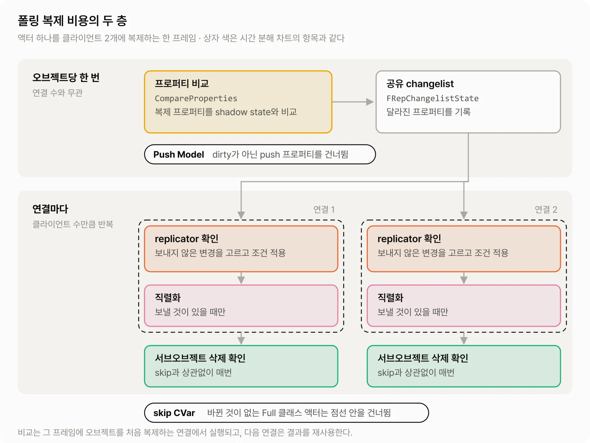

## Push Model을 켜는 세 개의 스위치

Push Model이 동작하려면 세 조건이 모두 맞아야 한다. 하나라도 빠지면 컴파일도 되고 복제도 되지만 폴링으로 동작한다. 실패해도 오류가 나지 않는다.

### 1. 컴파일 스위치 `bWithPushModel`

`WITH_PUSH_MODEL` 매크로는 Target.cs의 `bWithPushModel`로 정해진다. 기본값은 Editor 타깃일 때만 `true`다.

```csharp
// Programs/UnrealBuildTool/Configuration/Rules/TargetRules.cs
[RequiresUniqueBuildEnvironment]
public bool bWithPushModel
{
	get => bWithPushModelOverride ?? (Type == TargetType.Editor);
	set => bWithPushModelOverride = value;
}
```

PIE와 에디터 바이너리로 띄운 서버에서는 Push Model 코드가 컴파일돼 있지만, 패키지한 Game이나 Server 타깃에서는 기본적으로 빠진다. 이때 `MARK_PROPERTY_DIRTY` 계열 매크로는 빈 매크로가 되고 `Net.IsPushModelEnabled` CVar도 존재하지 않는다. PIE에서 확인한 Push Model 동작이 패키지 빌드에서는 조용히 폴링으로 바뀌는 셈이다. 패키지 빌드에서 쓰려면 해당 타깃에 직접 켠다.

```csharp
// MyGameServer.Target.cs
bWithPushModel = true;
```

이 프로퍼티에는 `[RequiresUniqueBuildEnvironment]`가 붙어 있어서 Unique Build Environment를 쓰는 타깃에서만 바꿀 수 있다. 그리고 Unique Build Environment 타깃은 런처판(설치형) 엔진에서 빌드할 수 없다(`Programs/UnrealBuildTool/Configuration/Rules/RulesAssembly.cs`). 데디케이티드 서버 타깃은 원래 소스 엔진에서 빌드하므로 서버 쪽에서는 큰 제약이 아니다. 리슨 서버처럼 Game 타깃이 서버 역할을 하는 구성이라면 Game 타깃에도 같은 설정이 필요하다.

### 2. 런타임 CVar `Net.IsPushModelEnabled`

```cpp
// Net/Core/Private/Net/Core/PushModel/PushModel.cpp
bool bIsPushModelEnabled = false;
FAutoConsoleVariableRef CVarIsPushModelEnabled(
	TEXT("Net.IsPushModelEnabled"),
	bIsPushModelEnabled, ...);
```

기본값이 `false`이고 엔진 기본 ini에서도 켜지 않는다. 보통 `DefaultEngine.ini`에 넣는다.

```ini
[SystemSettings]
net.IsPushModelEnabled=1
net.PushModelSkipUndirtiedReplication=1
```

두 번째 줄의 `net.PushModelSkipUndirtiedReplication`은 Push Model을 켜는 스위치가 아니라, 켠 뒤에 쓸 수 있는 별도 최적화다. 무엇을 건너뛰는지는 [아래 절](#오브젝트를-통째로-건너뛰는-netpushmodelskipundirtiedreplication)에서 다룬다.

`Net.IsPushModelEnabled` 값은 클래스의 `FRepLayout`을 만들 때 읽힌다. `FRepLayout`은 NetDriver별, 클래스별로 한 번 만들어 캐시하므로 세션 도중에 콘솔로 바꿔도 이미 복제 중인 클래스에는 반영되지 않는다. 실험에서는 조건마다 서버 프로세스를 새로 띄웠다.

### 3. 프로퍼티 등록 `bIsPushBased`

```cpp
void AMyActor::GetLifetimeReplicatedProps(TArray<FLifetimeProperty>& OutLifetimeProps) const
{
	Super::GetLifetimeReplicatedProps(OutLifetimeProps);

	FDoRepLifetimeParams Params;
	Params.bIsPushBased = true;
	DOREPLIFETIME_WITH_PARAMS_FAST(AMyActor, Health, Params);
	DOREPLIFETIME_WITH_PARAMS_FAST(AMyActor, Ammo, Params);
}
```

`MARK_PROPERTY_DIRTY` 계열 매크로는 `NetCore` 모듈에 있으므로 Build.cs에 의존성을 추가한다. 빠뜨리면 링크 오류가 난다.

등록 매크로는 이름이 비슷하지만 push로 등록할 수 있는 것은 `FDoRepLifetimeParams`를 받는 계열뿐이다(`Engine/Public/Net/UnrealNetwork.h`).

| 매크로 | RepIndex를 구하는 방식 | push 등록 |
| --- | --- | --- |
| `DOREPLIFETIME` | 실행 중에 이름으로 검색 | 불가 |
| `DOREPLIFETIME_CONDITION`, `DOREPLIFETIME_CONDITION_NOTIFY` | 실행 중에 이름으로 검색 | 불가 |
| `DOREPLIFETIME_WITH_PARAMS` | 실행 중에 이름으로 검색 | 가능 |
| `DOREPLIFETIME_WITH_PARAMS_FAST` | UHT가 만든 `ENetFields_Private`에서 컴파일 시간에 읽음 | 가능 |
| `DOREPLIFETIME_WITH_PARAMS_FAST_STATIC_ARRAY` | 위와 같음. 정적 배열 전용 | 가능 |

`DOREPLIFETIME_CONDITION`과 `DOREPLIFETIME_CONDITION_NOTIFY`는 조건을 받지만 내부에서 `FDoRepLifetimeParams`를 새로 만들어 조건만 채우므로 `bIsPushBased`는 `false`로 남는다. 기존 코드를 push로 옮길 때는 이 매크로를 `DOREPLIFETIME_WITH_PARAMS_FAST`로 바꾸고 `Params.Condition`과 `Params.RepNotifyCondition`을 직접 채운다.

```cpp
FDoRepLifetimeParams Params;
Params.bIsPushBased = true;
Params.Condition = COND_OwnerOnly;
DOREPLIFETIME_WITH_PARAMS_FAST(AMyActor, Ammo, Params);
```

`_FAST`라는 이름 때문에 복제가 빨라질 것 같지만 차이는 등록할 때만 난다. `GetLifetimeReplicatedProps`는 `FRepLayout`을 만들 때 CDO에서 불리므로(`RepLayout.cpp`의 `FRepLayout::InitFromClass`) NetDriver별, 클래스별로 한 번 실행된다. 실제로 갈리는 것은 실수가 드러나는 시점이다. `_FAST`는 RepIndex를 `ENetFields_Private` enum에서 읽는데, 이 enum에는 복제 프로퍼티만 들어 있어서 `Replicated`가 빠진 프로퍼티를 넘기면 컴파일 오류가 난다. `_FAST`가 없는 쪽은 실행 중에 이름으로 프로퍼티를 찾고, `Replicated`가 아니면 Fatal 로그를 남기고 멈춘다. 이 검사는 Shipping과 Test 빌드에서는 빠진다.

정적 배열은 `_FAST`로 등록하면 컴파일되지 않는다. UHT가 정적 배열에는 `Name_STATIC_ARRAY`와 `Name_STATIC_ARRAY_END` 항목만 만들기 때문이다. 그래서 `DOREPLIFETIME_WITH_PARAMS_FAST_STATIC_ARRAY`를 써야 한다. `_FAST`가 없는 매크로는 프로퍼티의 `ArrayDim`을 읽어 배열 원소 전체를 알아서 등록한다.

부모 클래스가 등록한 프로퍼티를 자식 클래스에서 다른 파라미터로 다시 등록하면 개발 빌드에서 check에 걸린다. 같은 RepIndex로 두 번 등록할 때 조건과 `bIsPushBased`가 같아야 하기 때문이다(`CoreUObject/Public/UObject/CoreNet.h`의 `FLifetimeProperty::operator==`). 등록을 바꾸려면 `RESET_REPLIFETIME_WITH_PARAMS`를 쓴다. 다만 이 매크로로 `ACharacter`의 프로퍼티를 push로 바꾸는 것은 캐릭터를 Full 클래스로 만드는 방법이 되지 못한다. `ACharacter`의 프로퍼티를 쓰는 엔진 코드에는 `MARK_PROPERTY_DIRTY` 호출이 없으므로, push로 바꾼 프로퍼티는 초기 복제 이후의 변경을 보내지 않게 된다.

`bIsPushBased`는 프로퍼티별 설정이지만 그 효과는 클래스 단위로도 갈린다. `FRepLayout`은 부모 클래스에서 물려받은 것까지 포함해 모든 복제 프로퍼티가 push 기반인 클래스에 `ERepLayoutFlags::FullPushProperties`를 붙이고, 일부만 push 기반이면 `PartialPushSupport`를 붙인다.

이 글에서는 앞의 경우를 **Full 클래스**, 뒤의 경우를 **Partial 클래스**라고 부른다. push가 아닌 프로퍼티가 하나만 섞여도 Partial 클래스다. 뒤에서 볼 skip CVar는 Full 클래스에서만 동작한다.

`GetLifetimeReplicatedProps`에서 등록을 빠뜨린 복제 프로퍼티도 Partial의 원인이 된다. 엔진은 빠진 프로퍼티를 기본 설정으로 자동 등록하는데, 기본 설정의 `bIsPushBased`는 `false`다(`CoreUObject/Public/UObject/CoreNet.h`의 `FLifetimeProperty`, `RepLayout.cpp`의 `DefaultLifetimeProp`). 기본 설정에서는 경고도 없다.

빠뜨린 프로퍼티를 찾을 때는 CVar 두 개를 함께 켠다(`Net/Core/Private/Net/Core/Misc/NetCVars.cpp`).

```ini
[SystemSettings]
; 등록하지 않은 복제 프로퍼티를 자동 등록하지 않는다 (기본값 1)
Net.AutoRegisterReplicatedProperties=0
; 등록하지 않은 복제 프로퍼티마다 ensure를 띄운다 (기본값 0)
Net.EnsureOnMissingReplicatedPropertiesRegister=1
```

ensure는 자동 등록을 끈 경우에만 뜨고, 그 상태에서 빠진 프로퍼티는 `COND_Never`가 되어 복제되지 않는다. 진단할 때만 잠깐 켜는 설정이다.

### 켜졌는지 확인하기

스위치가 빠지면 마킹하지 않은 값도 복제된다. 폴링으로 돌고 있으니 당연한 결과지만, 코드만 보면 Push Model이 고장 난 것처럼 보인다. 포럼에도 `bIsPushBased`로 등록하고 마킹했는데 마킹과 상관없이 복제된다는 질문이 있었고, 원인은 `net.IsPushModelEnabled`를 켜지 않은 것이었다([포럼 글](https://forums.unrealengine.com/t/push-model-networking/510684)). 같은 스레드에는 패키지한 데디케이티드 서버에서 Target.cs의 `bWithPushModel = true`도 필요했다는 보고가 이어진다. 같은 증상은 초기 복제에서도 나오는데, 이 경우는 [마킹을 빠뜨리면](#마킹을-빠뜨리면)에서 다룬다.

앞의 두 스위치는 `IS_PUSH_MODEL_ENABLED()` 하나로 확인할 수 있다. `WITH_PUSH_MODEL`이 꺼진 빌드에서는 `false`로 정의되고, 켜진 빌드에서는 `Net.IsPushModelEnabled` 값을 돌려준다(`Net/Core/Public/Net/Core/PushModel/PushModel.h`). 서버가 시작할 때 로그로 남겨 두면 패키지 빌드가 조용히 폴링으로 도는 것을 바로 알 수 있다.

```cpp
UE_LOG(LogTemp, Log, TEXT("Push Model: %s"), IS_PUSH_MODEL_ENABLED() ? TEXT("enabled") : TEXT("disabled"));
```

콘솔에서는 `Net.IsPushModelEnabled`를 값 없이 입력하면 현재 값이 나온다. `bWithPushModel`이 꺼진 빌드에서는 CVar 자체가 등록되지 않으므로 알 수 없는 명령으로 처리된다. 둘 다 지금의 CVar 값을 보여 줄 뿐이라, 세션 도중에 바꿨다면 이미 만들어진 `FRepLayout`과 다를 수 있다.

세 번째 스위치인 프로퍼티별 등록은 이 방법으로 확인되지 않는다. 프로퍼티가 실제로 push로 동작하는지는 Network Profiler의 프로퍼티별 비교 횟수로 볼 수 있다([아래 절](#network-profiler로-비교-횟수-세기)). push 기반이 아닌 프로퍼티는 값이 바뀌지 않아도 매번 비교된다.

## dirty 비트의 라이프사이클

마킹한 비트가 비교에서 소비되고 지워지기까지의 흐름은 다음과 같다. 각 단계의 소스는 아래 절에서 확인한다.

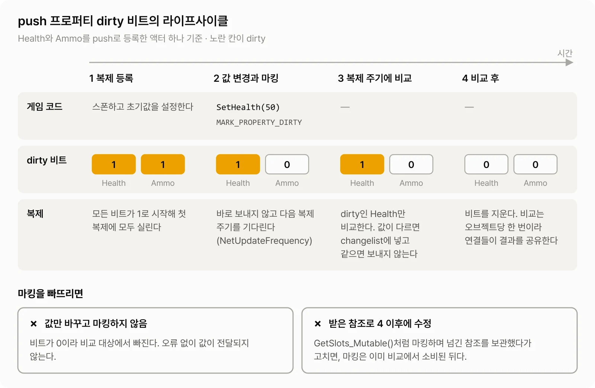

### 마킹은 비트 하나를 세운다

```cpp
void AMyActor::SetHealth(float NewHealth)
{
	COMPARE_ASSIGN_AND_MARK_PROPERTY_DIRTY(AMyActor, Health, NewHealth, this);
}
```

`MARK_PROPERTY_DIRTY_FROM_NAME`은 UHT가 생성한 `ENetFields_Private`로 프로퍼티의 RepIndex를 컴파일 시간에 구하고, 오브젝트의 push 상태에 비트 하나를 세운다(`Net/Core/Private/Net/Core/PushModel/PushModel.cpp`의 `MarkPropertyDirty`). 값을 읽는 것은 복제 시점이므로 대입과 마킹의 순서는 상관없다. 같은 프레임에 여러 번 마킹해도 결과는 같다. 비교하는 값도 복제 시점의 마지막 값이라 복제 주기 사이의 중간 값은 클라이언트에 가지 않는다. `COMPARE_ASSIGN_AND_MARK_PROPERTY_DIRTY`는 새 값이 기존 값과 다를 때만 대입하고 마킹한다. 엔진의 `AController::SetPawn_Direct`도 이 매크로를 쓴다.

`int32 Values[4]` 같은 고정 크기 배열은 원소마다 RepIndex가 따로 있다. 원소 하나는 `MARK_PROPERTY_DIRTY_FROM_NAME_STATIC_ARRAY_INDEX`로, 배열 전체는 `MARK_PROPERTY_DIRTY_FROM_NAME_STATIC_ARRAY`로 마킹한다. 뒤의 매크로는 `WITH_PUSH_MODEL`이 꺼진 빌드에서 인자 수가 달라진다. 켜진 쪽은 `(ClassName, PropertyName, Object)` 3개, 꺼진 쪽의 빈 매크로는 `ArrayIndex`가 낀 4개다(`PushModel.h`). 에디터에서 문제없던 호출이 `bWithPushModel`이 꺼진 타깃에서는 인자 수가 맞지 않게 된다. 이 때문에 컴파일이 실패한다는 보고가 2026년 3월 수정 PR과 함께 포럼에 올라와 Epic이 접수했고([포럼 글](https://forums.unrealengine.com/t/discrepancy-in-mark-property-dirty-from-name-static-array-causes-compile-failures/2715469)), 5.8.3 소스에는 아직 그대로 남아 있다. 원소 수만큼 `_STATIC_ARRAY_INDEX`를 부르면 피할 수 있다.

오브젝트가 아직 복제 등록 전이면 마킹은 아무 일도 하지 않는다. 대신 처음 등록될 때 모든 프로퍼티가 dirty인 상태로 시작한다(`Net/Core/Private/Net/Core/PushModel/Types/PushModelPerObjectState.h`의 생성자가 `DirtiedThisFrame`을 `true`로 채운다). 그래서 스폰 직후에 설정한 값은 마킹이 없어도 첫 복제에 실린다.

### 비교 단계에서 dirty가 아닌 push 프로퍼티만 건너뛴다

```cpp
// Engine/Private/RepLayout.cpp
static bool IsPropertyDirty(...)
{
	return SharedParams.bForceCompareProperties ||
		!(*SharedParams.PushModelProperties)[ParentIndex] || // non-push model properties are always considered dirty
		SharedParams.PushModelState->IsPropertyDirty(ParentIndex) ||
		(bRecentlyCollectedGarbage &&
			EnumHasAnyFlags(SharedParams.Parents[ParentIndex].Flags, ERepParentFlags::HasObjectProperties | ERepParentFlags::IsNetSerialize));
}
```

push 기반이 아닌 프로퍼티는 항상 dirty로 취급되어 매번 비교한다. push 기반 프로퍼티는 마킹됐을 때만 비교한다. 예외는 GC 직후다. 오브젝트 참조를 가지거나 `NetSerialize`를 쓰는 프로퍼티는 GC가 끝난 다음 비교에서 마킹과 상관없이 비교한다.

Full 클래스는 이 판정조차 프로퍼티마다 하지 않는다. dirty 비트가 켜진 인덱스만 순회한다(`RepLayout.cpp`의 `CompareParentProperties`, `TConstSetBitIterator`). 바뀐 것이 없으면 비교 루프가 거의 돌지 않는다.

### dirty여도 비교는 한다

마킹은 "보내라"가 아니라 "비교해 봐라"는 표시다. dirty 프로퍼티도 `PropertiesAreIdentical`로 shadow state와 비교하고 같으면 changelist에 넣지 않는다. 같은 값으로 마킹하면 비교 비용만 들고 아무것도 전송되지 않는다.

이 때문에 `REPNOTIFY_Always`도 Push Model과 무관하게 동작한다. 엔진은 이 값을 다음과 같이 정의한다.

> `REPNOTIFY_Always`: Always Call the property's RepNotify function when it is received from the server
>
> `CoreUObject/Public/UObject/CoreNetTypes.h`

조건은 "서버에서 받았을 때"다. 받은 값이 클라이언트의 로컬 값과 같아도 RepNotify를 부른다는 수신 쪽 규칙이고(`RepLayout.cpp`의 `ReceivePropertyHelper`), 서버가 무엇을 보낼지에는 관여하지 않는다. 서버가 같은 값을 다시 마킹해도 보낸 것이 없으므로 클라이언트에서 RepNotify는 불리지 않는다. 처음에 나는 이 경우 RepNotify가 불릴 거라고 생각했는데, 보내는 쪽과 받는 쪽의 규칙을 섞어서 본 것이었다.

비교가 끝나면 그 오브젝트의 dirty 비트는 지워진다. 비교는 오브젝트당 한 번이고 결과는 연결들이 공유한다. 그래서 dirty 비트도 연결마다 따로 두지 않는다. 조건부 프로퍼티는 비교 단계에서 조건을 보지 않고 모두 비교한 뒤 연결별로 걸러 낸다.

대신 NetDriver마다는 따로 둔다. 마킹은 오브젝트의 비트 배열에 먼저 쌓이고, NetDriver가 그 오브젝트를 읽을 때 NetDriver별 사본으로 옮겨진다(`PushModelPerObjectState.h`의 `PushDirtyStateToNetDrivers`). 리플레이를 녹화하는 DemoNetDriver가 게임 NetDriver와 함께 돌아도 각자 자기 사본을 비교하고 지우므로 한쪽이 다른 쪽의 변경을 지우지 않는다.

### 언제 복제할지는 바꾸지 않는다

Push Model은 무엇을 비교할지만 바꾼다. 액터를 언제 복제 검토 대상으로 볼지는 `NetUpdateFrequency`, `ForceNetUpdate`, Dormancy, 관련성 검사가 그대로 정한다. 마킹은 `ForceNetUpdate`를 부르지 않으므로 마킹한 값도 다음 복제 주기를 기다린다. 바로 보내야 하는 변경이라면 마킹과 함께 `ForceNetUpdate`를 부른다. `ForceNetUpdate`는 잠든 액터의 Dormancy도 flush한다(`Engine/Private/Actor.cpp`). Dormancy와 Push Model을 같은 조건에서 비교한 결과는 [측정 절](#dormancy와-비교하면)에 있다.

## 오브젝트를 통째로 건너뛰는 `net.PushModelSkipUndirtiedReplication`

Push Model만 켜면 연결별 작업은 그대로 남는다. 바뀐 것이 없어도 각 연결의 replicator는 changelist를 확인한다. `net.PushModelSkipUndirtiedReplication`(기본값 `false`)을 켜면 replicator가 이 확인을 건너뛸 수 있다. 판정은 `FObjectReplicator::CanSkipUpdate`(`Engine/Private/DataReplication.cpp`)가 한다.

skip 대상이 되려면 먼저 replicator를 초기화할 때 클래스가 `FullPushProperties`여야 하고 FastArray 같은 CustomDelta 프로퍼티가 없어야 한다. FastArray가 있는 클래스는 FastArray 프로퍼티도 push로 등록하고 CVar를 하나 더 켜야 한다.

```ini
[SystemSettings]
net.PushModelSkipUndirtiedReplication=1
; FastArray가 있는 클래스도 skip 대상에 넣는다 (기본값 0)
net.PushModelSkipUndirtiedFastArrays=1
```

그다음 매번 다음 조건을 모두 통과해야 한다.

- 이 연결로 초기 복제(NetInitial) 중이 아니다.
- RepFlags가 지난번과 같다.
- NAK이 없고, changelist history가 모두 ACK됐고, 이 연결에서 이미 두 번 이상 비교했다.
- 아직 보내지 않은 changelist가 없다.
- 리플레이 재전송 중이 아니고, 채널에 강제 비교가 걸려 있지 않다.
- CustomDelta 변경이 없다.
- dirty 프로퍼티가 없다.
- 큐에 쌓인 RPC가 없다.

마지막 조건에 함정이 있다.

```cpp
// Engine/Private/DataReplication.cpp, FObjectReplicator::CanSkipUpdate
const bool bHasRPCQueued = RemoteFunctions && RemoteFunctions->GetNumBits() >= 0;
if (bHasRPCQueued)
{
	return false;
}
```

unreliable multicast RPC는 바로 보내지지 않고 replicator의 `RemoteFunctions`에 쌓였다가 다음 프로퍼티 복제 때 함께 나간다(`Engine/Private/NetDriver.cpp`의 `ProcessRemoteFunctionForChannelPrivate`). `RemoteFunctions`는 처음 쌓을 때 할당되고 전송한 뒤에는 `Reset()`만 하고 해제하지 않는다. 비트 수가 0이 되어도 `GetNumBits() >= 0`은 여전히 참이다. 그래서 unreliable multicast를 한 번이라도 보낸 액터는 그 연결에서 다시는 skip되지 않는다. 아래 실험에서 그대로 재현됐다.

skip CVar가 건너뛰는 범위도 생각보다 좁다.

```cpp
// Engine/Private/DataChannel.cpp, UActorChannel::ReplicateActor
const bool bCanSkipUpdate = ActorReplicator->CanSkipUpdate(RepFlags);

if (UE::Net::bPushModelValidateSkipUpdate || !bCanSkipUpdate)
{
	bWroteSomethingImportant |= ActorReplicator->ReplicateProperties(Bunch, RepFlags);
}

bWroteSomethingImportant |= DoSubObjectReplication(Bunch, RepFlags);
// ...
bWroteSomethingImportant |= UpdateDeletedSubObjects(Bunch);
```

skip CVar는 액터 본체의 `ReplicateProperties` 호출 하나만 건너뛴다. `ReplicateActor` 호출 자체, 서브오브젝트 복제, 삭제된 서브오브젝트 확인은 매번 돈다. 반면 서브오브젝트(복제 컴포넌트 등)는 각자의 replicator에서 같은 판정을 하고 skip되면 그 서브오브젝트의 처리를 일찍 끝낸다(`DataChannel.cpp`의 `UActorChannel::WriteSubObjectInBunch`).

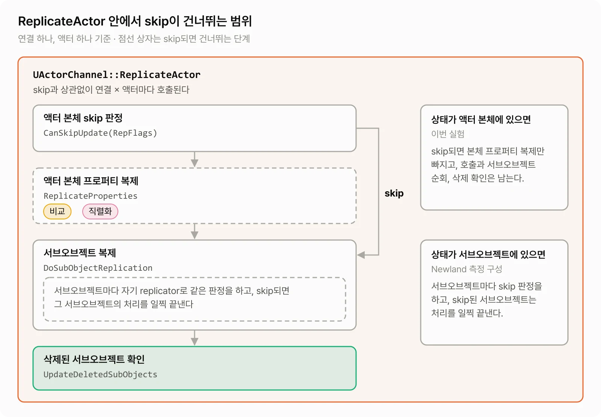

FastArray가 있는 클래스를 skip 대상에 넣을 때 FastArray는 따로 마킹하지 않아도 된다. `MarkItemDirty`와 `MarkArrayDirty`가 `IncrementArrayReplicationKey`에서 FastArray 프로퍼티를 마킹한다(`Net/Core/Classes/Net/Serialization/FastArraySerializer.h`). 마킹할 오브젝트와 RepIndex는 처음 직렬화할 때 기억하므로(`RepLayout.cpp`의 `CachePushModelState`) 첫 복제 전의 호출은 마킹하지 않는다. 첫 복제는 앞에서 본 대로 모든 비트가 dirty인 상태라 문제가 없다.

레거시 복제에서 FastArray는 마킹과 상관없이 skip되지 않은 갱신마다 delta 직렬화를 거친다. 마킹은 skip 판정에만 쓰인다. GAS의 `UAbilitySystemComponent::GetLifetimeReplicatedProps`에는 FastArray가 push를 쓰지 않으니 플래그는 무시된다는 주석이 남아 있는데, 비교 단계만 보면 맞는 말이다.

## 엔진 클래스는 이미 push 기반인가

skip CVar는 Full 클래스에서만 동작한다. Full 클래스가 되려면 부모 클래스에서 물려받은 복제 프로퍼티까지 모두 push 기반이어야 하므로 어떤 엔진 클래스를 상속하느냐가 중요하다. 5.8.3에서 엔진 클래스의 상태는 다음과 같다.

| 클래스 | 복제 프로퍼티의 push 등록 | 이 클래스만 놓고 본 분류 |
| --- | --- | --- |
| `AActor` | 10개 모두 push (`Engine/Private/ActorReplication.cpp`) | Full |
| `UActorComponent`, `USceneComponent` | 모두 push | Full |
| `APlayerState` | 모두 push | Full |
| `APawn` | `PlayerState`, `Controller` 등을 `DOREPLIFETIME`으로 등록 | Partial |
| `ACharacter` | 모두 `DOREPLIFETIME_CONDITION` | Partial |
| `AGameStateBase` | push 파라미터를 만들고도 `DOREPLIFETIME`으로 등록 | Partial |
| `AController`, `APlayerController` | 아래 CVar를 켤 때만 push | 기본 Partial |

컨트롤러는 CVar로 push 등록을 켤 수 있다. 등록은 `GetLifetimeReplicatedProps`에서 하므로 시작 전에 설정한다.

```ini
[SystemSettings]
; AController의 복제 프로퍼티를 push로 등록한다 (기본값 0)
Controller.IsPushBased=1
; APlayerController의 복제 프로퍼티를 push로 등록한다 (기본값 0)
PlayerController.IsPushBased=1
```

`AActor`를 직접 상속한 액터는 자기 프로퍼티를 모두 push로 등록하면 Full이 된다. `ACharacter`를 상속한 캐릭터는 무엇을 추가해도 Full이 될 수 없다. 추가한 push 프로퍼티의 비교 비용은 줄지만 skip은 받지 못한다.

GAS의 `UAbilitySystemComponent`는 부모인 `UGameplayTasksComponent`까지 포함해 복제 프로퍼티를 모두 push로 등록하고, 값을 바꿀 때는 `GetRepAnimMontageInfo_Mutable()`처럼 마킹하고 참조를 돌려주는 getter를 쓴다. AttributeSet은 프로젝트가 정의하므로 push 등록 여부도 프로젝트가 정한다. GAS가 attribute 값을 쓰는 경로(`FGameplayAttribute::SetNumericValueChecked`)가 `MARK_PROPERTY_DIRTY`를 부르므로 attribute를 `bIsPushBased`로 등록해도 GameplayEffect로 바꾼 값은 전달된다. 다만 `GAMEPLAYATTRIBUTE_VALUE_INITTER`가 만드는 `InitHealth` 같은 함수는 값을 직접 쓰고 마킹하지 않는다.

Epic의 Lyra 샘플(5.8.3)도 `ALyraPlayerState`의 프로퍼티 대부분을 push로 등록해 두었다. 하지만 Target.cs에 `bWithPushModel`이 없고 `DefaultEngine.ini`에 `net.IsPushModelEnabled`도 없다. 그대로 빌드하면 에디터와 패키지 빌드 모두 폴링으로 돈다. 코드가 Push Model을 쓰는 모양이라고 해서 프로젝트에서 켜져 있다는 뜻은 아니다.

`AActor::ReplicatedMovement`는 push 기반이지만, 물리 시뮬레이션이 아닌 액터에서는 `GatherCurrentMovement`가 값이 같아도 매번 마킹한다.

```cpp
// Engine/Private/ActorReplication.cpp, AActor::GatherCurrentMovement
// Technically, the values might have stayed the same, but we'll just assume they've changed.
bWasRepMovementModified = true;
// ...
if (bWasRepMovementModified)
{
	MARK_PROPERTY_DIRTY_FROM_NAME(AActor, ReplicatedMovement, this);
}
```

움직임을 복제하는 액터는 Push Model을 켜도 `ReplicatedMovement`를 매번 비교한다. 템플릿 캐릭터만 있는 상태로도 재 봤다. `ServerReplicateActors`는 Push + Skip일 때와 모두 껐을 때 둘 다 0.09 ms로 차이가 없었다.

## Blueprint 복제 변수

Blueprint에서 선언한 복제 변수는 체크박스 없이 Push Model 대상이 된다. `UBlueprintGeneratedClass`가 lifetime 프로퍼티를 만들 때 `PUSH_MAKE_BP_PROPERTIES_PUSH_MODEL()`을 넘긴다. 이 매크로는 `Net.IsPushModelEnabled`와 `Net.MakeBpPropertiesPushModel`(기본값 `true`)이 모두 켜져 있으면 참이다. Blueprint 컴파일러는 Set 노드와 참조로 넘기는 함수 호출 뒤에 `MarkPropertyDirtyFromRepIndex` 호출을 자동으로 넣는다.

이 자동 마킹은 Blueprint에서 선언한 변수에만 붙지 않는다. Set 노드는 프로퍼티에 `CPF_Net` 플래그가 있는지만 보므로(`Engine/Source/Editor/BlueprintGraph/Private/VariableSetHandler.cpp`, `UK2Node_VariableSet::IsNetProperty`) C++에서 `BlueprintReadWrite`로 연 push 프로퍼티도 Set 노드로 바꾸면 마킹된다. 반대로 Blueprint에서 C++의 `BlueprintCallable` setter를 부를 때는 그 C++ 함수 안에서 마킹해야 한다.

다만 참조로 값을 바꾸는 Set by-ref 계열 노드는 마킹하지 않는다는 이슈가 등록돼 있다([UE-194745](https://issues.unrealengine.com/issue/UE-194745)). Blueprint 변수가 클라이언트에 반영되지 않는다면 이 경로를 먼저 의심할 만하다.

## ThirdPerson 템플릿으로 측정하기

### 실험 구성

템플릿 캐릭터만으로는 측정할 대상이 거의 없어서 별도 액터를 추가했다. 대표 코드는 다음과 같다.

```cpp
UCLASS()
class APushLabActor : public AActor
{
	GENERATED_BODY()

public:
	APushLabActor()
	{
		bReplicates = true;
		bAlwaysRelevant = true;
		SetReplicatingMovement(false);
		SetNetUpdateFrequency(100.0f);
	}

	virtual void GetLifetimeReplicatedProps(TArray<FLifetimeProperty>& OutLifetimeProps) const override
	{
		Super::GetLifetimeReplicatedProps(OutLifetimeProps);

		FDoRepLifetimeParams Params;
		Params.bIsPushBased = true;
		DOREPLIFETIME_WITH_PARAMS_FAST(APushLabActor, Int00, Params);
		// ... int32 8개, float 4개, FVector 4개
	}

	UFUNCTION(NetMulticast, Unreliable)
	void MulticastPing();

protected:
	UPROPERTY(Replicated) int32 Int00 = 0;
	// ...
};
```

- 액터 클래스는 세 가지다. 16개를 모두 push로 등록한 Full 클래스, 여기에 바뀌지 않는 폴링 프로퍼티 하나를 더한 Partial 클래스, 그리고 Carrier 클래스다. Carrier 클래스는 액터 본체에 폴링 프로퍼티 하나만 두고, 16개 프로퍼티는 Full 컴포넌트에 담아 붙였다.
- 서버는 액터 1000개를 스폰하고, 매 프레임 "초당 변경 비율 × 액터 수 × DeltaTime"을 누적해 1이 넘을 때마다 무작위 액터의 무작위 프로퍼티 하나에 새 값을 쓰고 마킹한다. 액터는 중복을 허용해 고르므로 변경 비율은 "액터당 평균 초당 쓰기 횟수"다. 1%면 액터 하나가 평균 100초에 한 번, 3000%면 평균 초당 30번 바뀐다. 난수 시드는 고정했다.
- 클라이언트가 모두 접속하면 20초 워밍업 뒤 30초를 측정한다. 측정 구간에는 CSV 캡처와 Insights 리전 `PushLab.Measure`를 건다.
- 서버는 에디터 바이너리를 `-server`로 띄웠다. 런처판 5.8에서는 Push Model이 켜진 Server 타깃을 빌드할 수 없어서다. 클라이언트는 렌더링 없이 띄웠다.
- Ryzen 9 5950X에서 서버는 논리 코어 0번부터 15번에, 클라이언트는 16번부터 31번에 고정했다. 같은 조건을 반복했을 때 실행마다 결과가 ±10%가량 흔들려서, 서로 간섭하는 요인을 줄이려는 설정이다.
- 연결 대역폭 제한을 100 MB/s로 올렸다. 기본값(100 KB/s)에서는 3000% 조건에서 연결이 포화되어 연결당 프레임마다 처리하는 액터가 1000개에서 24개로 줄었다. 그 상태에서는 CPU가 아니라 대역폭 한계를 재게 된다.
- 서버 최대 틱은 30 Hz로 두었다. 실제로는 실행에 따라 프레임당 33~47 ms(약 21~30 Hz)로 돌았고, 그에 따라 연결당 프레임마다 처리한 액터 수도 774~1,005개로 달라졌다. 프레임당 시간으로 나눠도 프레임마다 한 일의 양까지 같아지지는 않으므로, 메인 조건은 `ReplicateActor` 1회당 시간으로도 함께 비교했다.

서버와 클라이언트는 다음처럼 띄웠다. 실험용 인자(액터 수, 변경 비율 등)는 뺐다.

```powershell
# 데디케이티드 서버: 에디터 바이너리로 uncooked 실행
UnrealEditor.exe ThirdPerson.uproject /Game/ThirdPerson/Lvl_ThirdPerson -server -log -NoVerifyGC

# 클라이언트: 렌더링과 사운드 없이 접속
UnrealEditor.exe ThirdPerson.uproject 127.0.0.1 -game -nullrhi -nosound -log
```

대역폭 제한 설정은 다음과 같다. 클라이언트가 요청하는 속도와 서버가 허용하는 속도를 모두 올려야 하므로 서버와 클라이언트 양쪽에 적용한다.

```ini
[/Script/Engine.Player]
; 클라이언트가 요청하는 연결 속도 (bytes/s, 기본값 100000)
ConfiguredInternetSpeed=100000000
ConfiguredLanSpeed=100000000

[/Script/OnlineSubsystemUtils.IpNetDriver]
; 서버가 연결마다 허용하는 최대 속도 (bytes/s, 기본값 100000)
MaxClientRate=100000000
MaxInternetClientRate=100000000
```

조건마다 서버를 새로 띄우고 `Net.IsPushModelEnabled`와 `net.PushModelSkipUndirtiedReplication`만 바꿨다. 같은 바이너리를 쓰므로 빌드 차이는 결과에 섞이지 않는다.

### 측정 전 예측

측정 전에 나는 Push 끔, Push 켬, Push + Skip의 비율을 100 : 95 : 90 정도로 예상했다. 프로퍼티 비교는 원래 싼 작업이고, 복제 비용의 대부분은 관련성 검사, 우선순위 계산, 직렬화 같은 다른 곳에서 나올 거라고 봤다.

### 메인 조건의 측정 결과

메인 조건(Full 클래스 1000개, 초당 1% 변경, 클라이언트 2개)을 조건당 5회씩 번갈아 실행하는 세트를 두 번 돌렸다. 첫 세트의 프레임 시간이 실행마다 33~47 ms로 흔들려서 둘째 세트를 추가했는데, 둘째 세트도 42~47 ms로 흔들렸다. 표의 평균은 10회 평균이다.

| 조건 | 1차 5회 `ServerReplicateActors` (ms) | 2차 5회 (ms) | 10회 평균 | 비율 | `ReplicateActor` 1회당 (10회) | 비율 |
| --- | --- | --- | --- | --- | --- | --- |
| Push 끔 | 4.91 / 4.17 / 4.05 / 4.77 / 4.97 | 4.80 / 5.28 / 4.42 / 4.22 / 4.16 | 4.57 | 100 | 2.36 µs | 100 |
| Push 켬 | 4.19 / 3.66 / 3.76 / 3.96 / 4.32 | 4.52 / 4.04 / 3.94 / 3.82 / 3.43 | 3.97 | 87 | 2.08 µs | 88 |
| Push + Skip | 3.31 / 3.02 / 3.62 / 3.72 / 3.27 | 4.06 / 3.29 / 3.12 / 3.43 / 2.81 | 3.36 | 74 | 1.71 µs | 73 |

프레임당 시간으로는 100 : 87 : 74로, 예상한 100 : 95 : 90보다 이득이 컸다. 프레임 시간이 흔들리면 프레임마다 처리한 액터 수도 달라지므로 `ReplicateActor` 1회당 시간으로도 비교했는데, 10회 평균의 비율은 100 : 88 : 73으로 거의 같았다. 다만 5회 세트 하나만 보면 Push 켬의 1회당 비율은 93과 83 사이를 오갔다. Push Model만 켰을 때의 13%는 ±5포인트쯤의 해상도로 읽어야 한다. skip CVar까지 켠 쪽은 두 세트와 두 지표에서 모두 71~74 사이였다. 다만 "비교는 원래 싸다"는 판단 자체는 맞았다. 아래 Insights 시간 분해에서 비교는 전체의 14%였다. 차이는 skip CVar가 비교가 아니라 연결별 작업을 줄이는 데서 나왔다.

### Unreal Insights로 시간 분해하기

서버를 다음 인자로 띄워 트레이스를 기록하고 Unreal Insights로 열었다.

```powershell
UnrealEditor.exe ThirdPerson.uproject /Game/ThirdPerson/Lvl_ThirdPerson -server -log `
    -trace=cpu,frame,bookmark,region,log `
    -statnamedevents `
    -tracefile="D:/Traces/main_off.utrace"
```

`-statnamedevents`가 있어야 `STAT_` 계열 스코프가 Timing 뷰에 이벤트로 나온다. `region` 채널은 서버 코드에서 `TRACE_BEGIN_REGION(TEXT("PushLab.Measure"))`로 건 측정 구간을 기록한다.

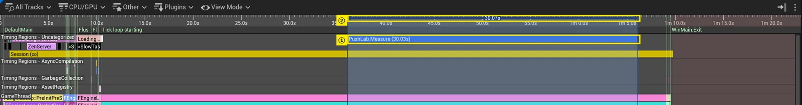

① 서버 코드에서 건 `PushLab.Measure` 리전이 Timing Regions 트랙에 30초 막대로 나온다. ② 눈금자에서 이 막대의 양끝을 드래그해 같은 범위를 선택하면 Timers와 Callees 패널이 선택 구간만 집계한다. 타이머 검색창에 `Replicat`을 넣고 `ServerReplicateActors Time`을 고르면 Callees 패널에 하위 호출 트리가 나온다.

Push Model을 끈 상태다.

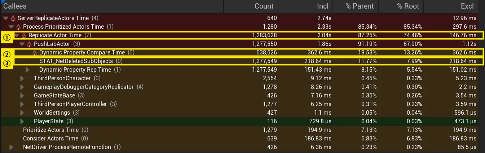

- ① `Replicate Actor Time`은 30초 동안 1,283,628회 불렸다. 액터 1000개 × 연결 2개 × 프레임 640개와 거의 같다.
- ② `Dynamic Property Compare Time`은 638,526회로 그 절반이다. 연결이 2개여도 비교는 오브젝트당 한 번이라는 앞의 설명이 호출 수로 확인된다. 합계는 362.6 ms다.
- ③ `STAT_NetDeletedSubObjects`가 1,277,549회, 218.64 ms다. `ReplicateActor`마다 삭제된 서브오브젝트를 확인하는 연결별 작업으로, 비교 시간의 60%에 이른다.

Push Model을 켰다.

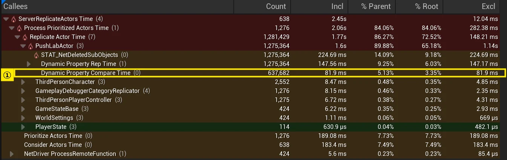

① 비교 호출 수는 637,682회로 그대로이고 합계가 81.9 ms로 줄었다. 호출은 오브젝트마다 하지만 dirty 비트가 없으면 바로 빠져나온다. 나머지 행은 거의 변하지 않았다.

skip CVar까지 켰다.

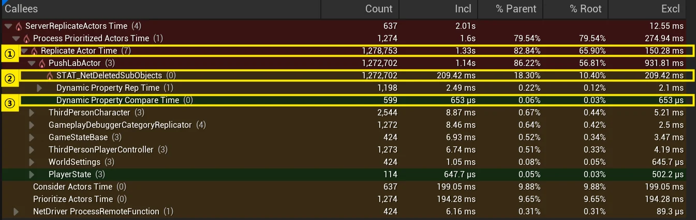

- ① `Replicate Actor Time` 호출은 1,278,753회로 그대로 남았다. skip은 이 함수 안에서 일어난다.
- ② `STAT_NetDeletedSubObjects`도 209.42 ms로 남았다. 앞의 소스대로 skip과 상관없이 매번 실행된다.
- ③ 비교는 599회로 줄었다. 실제로 값이 바뀐 액터만 비교한다. 직렬화(`Dynamic Property Rep Time`)도 1,198회, 2.49 ms로 거의 사라졌다.

같은 트레이스에서 타이머별 exclusive 시간을 CSV로 내보내 프레임당 값으로 나눴다. Insights는 UI 없이 트레이스를 분석한 뒤 명령을 실행할 수 있고, `-region`과 `-threads`로 측정 구간과 스레드를 지정할 수 있다.

```powershell
UnrealInsights.exe -OpenTraceFile="D:/Traces/main_off.utrace" -AutoQuit -NoUI `
    -ExecOnAnalysisCompleteCmd="TimingInsights.ExportTimerStatistics D:/Traces/main_off.timers.csv -region=PushLab.Measure -threads=GameThread"
```

결과는 다음과 같다. 트레이스를 기록한 1회 실행의 값이라 앞의 CSV 10회 평균과 합계가 조금 다르다.

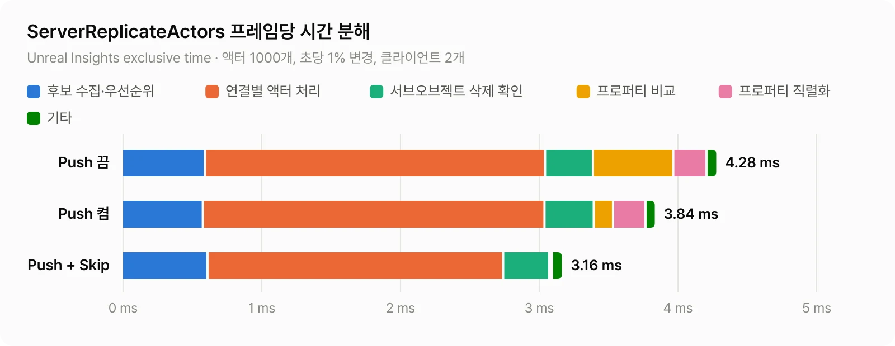

| 항목 (ms/프레임) | Push 끔 | Push 켬 | Push + Skip |
| --- | --- | --- | --- |
| 후보 수집·우선순위 (`Consider`, `Prioritize`) | 0.60 | 0.58 | 0.62 |
| 연결별 액터 처리 (`ReplicateActor`, 클래스 스코프, `Process Prioritized` exclusive) | 2.45 | 2.46 | 2.13 |
| 서브오브젝트 삭제 확인 | 0.35 | 0.36 | 0.33 |
| 프로퍼티 비교 | 0.58 | 0.14 | 0.01 |
| 프로퍼티 직렬화 | 0.24 | 0.23 | 0.01 |
| 합계 | 4.28 | 3.84 | 3.16 |

합계는 `ServerReplicateActors` 전체 시간이고, 위 다섯 항목에 넣지 않은 작은 스코프가 0.06 ms가량 더 들어 있다.

Push Model은 비교 칸을 0.58 ms에서 0.14 ms로 줄였다. 비교는 처음부터 전체의 14%였으므로 Push Model 단독으로 줄일 수 있는 폭도 그 정도다. skip CVar는 직렬화 칸과 연결별 액터 처리 칸의 일부를 줄였다. 가장 큰 칸인 연결별 액터 처리는 skip CVar를 켜도 2.13 ms가 남는다.

> `-statnamedevents`는 µs 단위 스코프마다 이벤트를 기록하므로 측정값을 부풀릴 수 있다. 같은 조건에서 추적 없이 CSV만 기록한 10회 평균은 4.57 ms, 추적한 실행 1회는 4.28 ms였다. 추적 실행이 1회뿐이고 그 값이 추적 없는 실행의 범위(4.05~5.28 ms) 안에 있어서, 이번 비교로는 추적 비용과 실행 간 편차를 분리하지 못했다. 분해 표는 세 조건의 상대 비교에만 쓴다.

호출 하나하나의 길이도 봤다. `TimingInsights.ExportTimingEvents`로 이벤트를 내보내 분포를 만들었다. 명령은 response file(`main_off.events.rsp`)에 쓰고 `@=` 접두사로 넘긴다.

```text
TimingInsights.ExportTimingEvents "D:/Traces/main_off.events.csv" -columns="TimerName,Duration" -threads="GameThread" -timers="Replicate Actor Time,Dynamic Property Compare Time" -region="PushLab.Measure"
```

```powershell
UnrealInsights.exe -OpenTraceFile="D:/Traces/main_off.utrace" -AutoQuit -NoUI `
    -ExecOnAnalysisCompleteCmd="@=D:/Traces/main_off.events.rsp"
```

> 타이머 이름처럼 공백이 든 인자는 명령줄에서 따옴표가 겹치므로 response file로 넘긴다. 파일 안의 경로는 슬래시로 쓴다. 역슬래시는 이스케이프로 처리되어 사라진다.

| 조건 | `Replicate Actor Time` p50 / p90 / p99 | 비교 호출 수 (GameThread 전체) | 비교 p50 |
| --- | --- | --- | --- |
| Push 끔 | 1.5 / 2.4 / 3.6 µs | 642,335 | 0.5 µs |
| Push 켬 | 1.2 / 2.0 / 2.9 µs | 641,992 | 0.1 µs |
| Push + Skip | 0.9 / 1.5 / 2.1 µs | 4,906 | 1.2 µs |

skip CVar를 켜면 `ReplicateActor`의 61%가 1 µs 미만에 모인다. 비교 호출 수에는 캐릭터와 컨트롤러 같은 다른 액터도 포함된다. Push + Skip 조건에서 남은 비교는 실제로 바뀐 오브젝트의 비교라서 1회당 시간은 오히려 길다.

### 값을 바꾸는 빈도에 따른 차이

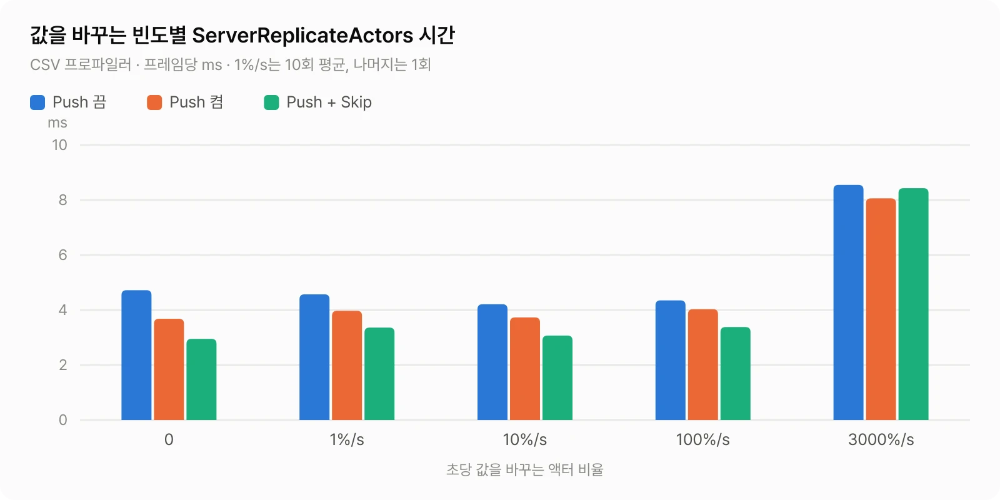

| 초당 변경 비율 | Push 끔 | Push 켬 | Push + Skip | skip된 replicator/프레임 |
| --- | --- | --- | --- | --- |
| 0 | 4.72 | 3.68 | 2.95 | 2,000 |
| 1% (10회 평균) | 4.57 | 3.97 | 3.36 | 1,998 |
| 10% | 4.21 | 3.73 | 3.07 | 1,978 |
| 100% | 4.35 | 4.03 | 3.38 | 1,820 |
| 3000% (액터당 초당 30회) | 8.55 | 8.06 | 8.43 | 118 |

1%를 뺀 나머지는 1회씩 측정했으므로 ±10% 안의 차이는 잡음으로 본다. 100%까지는 Push + Skip이 꾸준히 25% 안팎 앞섰다. 액터당 초당 30회 바뀌는 조건에서는 한 프레임에 액터 대부분이 한 번 이상 바뀌어 skip할 replicator가 거의 없고, skip CVar의 효과가 사라졌다. 이때도 Push Model을 켠 쪽이 끈 쪽보다 느리지는 않았다.

### 연결 수에 따른 차이

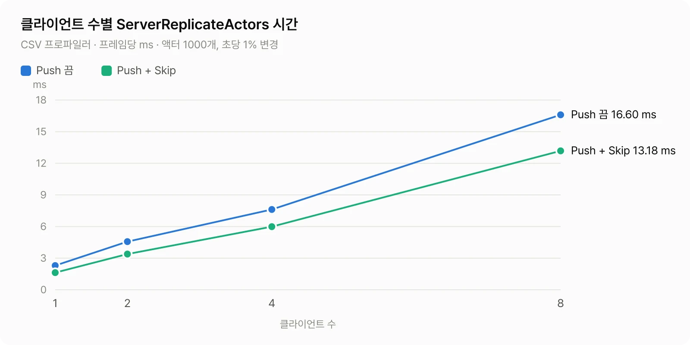

| 클라이언트 | Push 끔 | Push + Skip | 감소 |
| --- | --- | --- | --- |
| 1 | 2.30 ms | 1.63 ms | 29% |
| 2 | 4.57 ms | 3.36 ms | 26% |
| 4 | 7.62 ms | 5.99 ms | 21% |
| 8 | 16.60 ms | 13.18 ms | 21% |

비교를 연결들이 공유하는데도 전체 시간은 연결 수에 거의 비례해 늘었다. 복제 비용의 대부분이 연결별 작업이라는 뜻이다. skip CVar가 줄이는 몫도 그 연결별 작업의 일부다. 연결이 늘수록 감소율이 조금 낮아진 것은 skip CVar가 건드리지 않는 연결별 작업이 함께 늘기 때문으로 보인다.

### Partial 클래스와 컴포넌트로 옮기기

| 조건 | `ServerReplicateActors` | skip된 replicator/프레임 |
| --- | --- | --- |
| Full, Push + Skip | 3.36 ms | 1,998 |
| Partial, Push 켬 | 3.80 ms | 0 |
| Partial, Push + Skip | 3.79 ms | 0.1 |
| Carrier, Push 끔 | 6.24 ms | 0 |
| Carrier, Push 켬 | 5.80 ms | 0 |
| Carrier, Push + Skip | 5.10 ms | 1,998 |

폴링 프로퍼티 하나가 섞인 Partial 클래스는 skip CVar를 켜도 skip되지 않았다. `ACharacter`를 상속한 캐릭터가 이 경우다.

그래서 캐릭터처럼 Partial일 수밖에 없는 액터라면 자주 바뀌지 않는 상태를 Full 컴포넌트로 옮겨 그 컴포넌트만이라도 skip을 받게 하면 되지 않을까 생각했다. Carrier 클래스가 그 구성이다. 컴포넌트는 실제로 skip됐지만(프레임당 1,998회) 전체는 5.10 ms로 Partial(3.79 ms)보다 35% 느렸다. 액터마다 replicator가 하나 더 생기고 서브오브젝트 처리 비용이 붙는 것이 skip으로 아끼는 몫보다 컸다. 이 측정에서는 skip을 노리고 상태를 쪼개는 것이 손해였다.

### unreliable multicast 한 번이 skip을 끈다

워밍업 중간에 모든 액터에서 `MulticastPing()`을 한 번씩 호출한 뒤 같은 조건으로 측정했다.

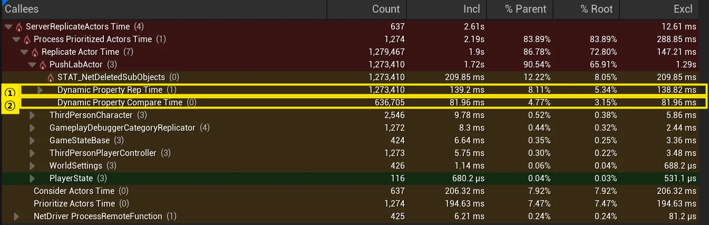

skip CVar를 켰는데도 ① 직렬화가 1,273,410회 돌고 ② 비교도 636,705회 돈다. skip된 replicator는 프레임당 1,998개에서 0.1개로 떨어졌고 `ServerReplicateActors`는 3.74 ms로 Push Model만 켠 수준이 됐다. 앞에서 본 `GetNumBits() >= 0` 조건 그대로다. multicast를 보낸 것은 측정 시작 10초 전이었고, 그 뒤로는 RPC를 보내지 않았다.

### 대역폭은 바뀌지 않는다

Push Model이 네트워크 트래픽을 줄인다는 설명도 있어서 Networking Insights로 확인했다. 서버를 다음처럼 띄우면 패킷과 프로퍼티 단위의 비트 수가 기록된다.

```powershell
UnrealEditor.exe ThirdPerson.uproject /Game/ThirdPerson/Lvl_ThirdPerson -server -log `
    -trace=net,frame,bookmark,region,log `
    -NetTrace=2 `
    -tracefile="D:/Traces/rate1_off_net.utrace"
```

`-NetTrace`는 net trace의 상세 수준이다(0 꺼짐, 1 Trace, 2 Verbose, 3 VeryVerbose). net trace는 기록량이 많아서 이 실행은 CPU 수치 비교에는 쓰지 않았다.

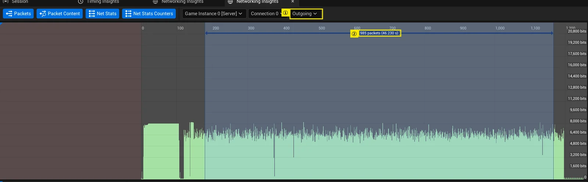

① 서버 인스턴스의 Connection 0에서 방향을 Outgoing으로 바꾸고, ② 패킷 막대를 클릭한 뒤 Shift-클릭해 초기 복제 이후의 패킷 985개를 골랐다. 초당 100%의 액터 값이 바뀌는 조건이다. 시드가 고정되어 있어서 두 실행은 같은 순서로 값을 쓴다.

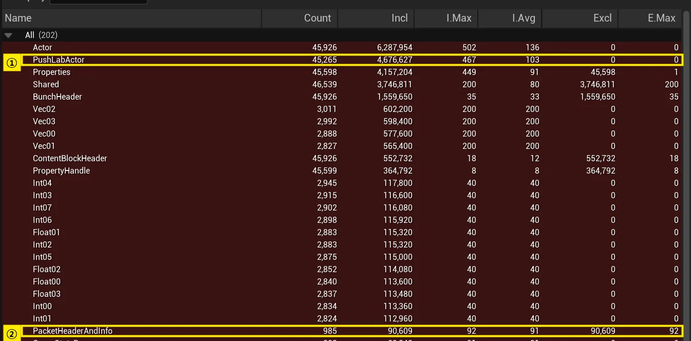

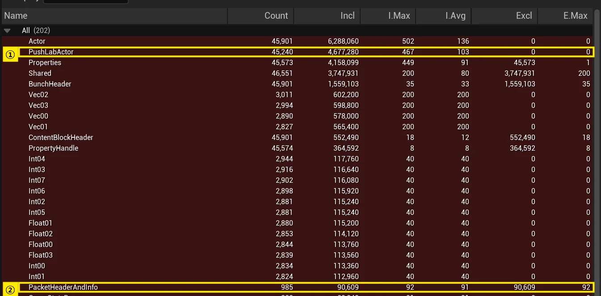

| | ① `PushLabActor` 업데이트 | 비트 합계 | 업데이트당 평균 | ② 패킷 |
| --- | --- | --- | --- | --- |
| Push 끔 | 45,265 | 4,676,627 | 103 bits | 985 |
| Push 켬 | 45,240 | 4,677,280 | 103 bits | 985 |

폴링이든 push든 보내는 것은 바뀐 프로퍼티뿐이므로 송신 내용은 같다. `FVector` 프로퍼티는 200 bits, `int32`와 `float`은 40 bits로 두 실행이 같았다. 3000% 조건의 CSV에서도 프레임당 송신량은 37.26 KB, 37.27 KB, 37.24 KB로 같았다. Push Model이 줄이는 것은 서버 CPU다.

### Network Profiler로 비교 횟수 세기

Networking Insights 이전부터 있던 Network Profiler도 5.8.3에 남아 있다. Shipping과 Test가 아닌 빌드에서 동작하고(`USE_NETWORK_PROFILER`), 서버 명령줄에 `networkprofiler=true`를 주거나 콘솔에서 `netprofile enable`을 실행하면 `Saved/Profiling`에 `.nprof` 파일이 기록된다. 파일은 `Engine/Binaries/DotNET/NetworkProfiler.exe`로 연다. 런처로 설치한 5.8에는 이 실행 파일이 없어서 소스 빌드에서 만든 것을 썼다.

이 도구에는 Insights에 없는 값이 두 가지 있다. 하나는 오브젝트와 프로퍼티별 비교 횟수이고, 다른 하나는 액터별 Waste다. 비교 횟수는 `Net.ProfilerUseComparisonTracking`(기본값 0)을 켜야 기록된다. 이번에는 메인 조건(액터 1000개, 클라이언트 2개, 초당 1%)에서 30초 측정 구간에만 기록이 걸리도록 하네스가 다음 콘솔 명령을 실행했다.

```
Net.ProfilerUseComparisonTracking 1
netprofile enable
; 30초 측정
netprofile disable
```

프로파일러는 복제할 때마다 기록을 남기므로 이 실행의 시간 값에는 기록 비용이 들어 있다. 시간은 세 조건끼리만 비교하고 앞의 CPU 측정과는 섞지 않는다.

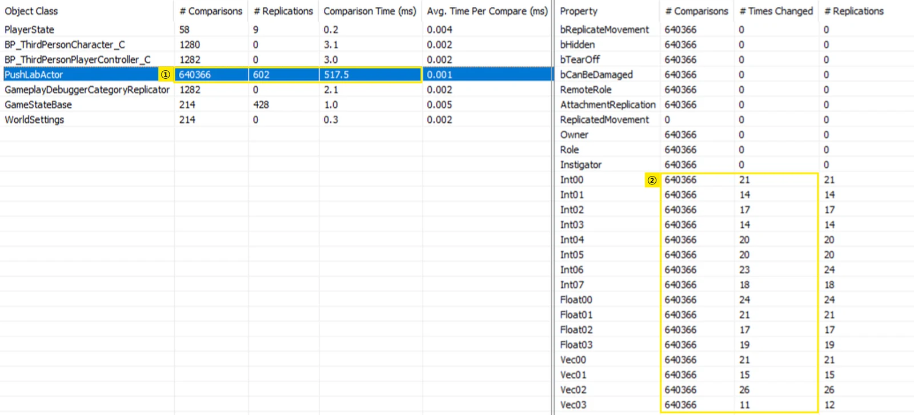

All Objects 탭의 왼쪽은 클래스별 합계, 오른쪽은 선택한 클래스의 프로퍼티별 횟수다. Push Model을 끄면 ① `PushLabActor`의 비교가 640,366회, 비교 시간이 517.5 ms다. 프레임마다 액터 1000개를 한 번씩 비교한 횟수로, 클라이언트가 2개여도 두 배가 되지 않는다. 비교는 오브젝트당 한 번이고 결과를 연결들이 공유한다는 앞의 설명과 맞는다. ② 프로퍼티도 모두 640,366회씩 비교했지만 실제로 바뀐 것은 프로퍼티마다 11~26회였다.

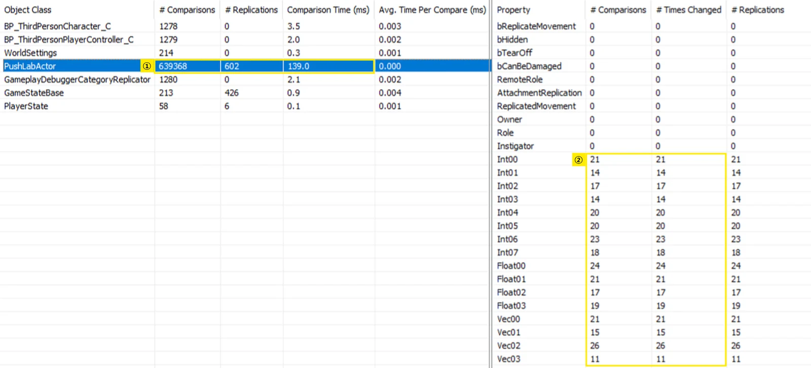

Push Model을 켜도 ① 오브젝트 단위 비교 호출은 639,368회로 거의 같다. Full 클래스라도 skip CVar가 없으면 매 프레임 비교 함수에 들어가기 때문이다. 대신 비교 시간은 139.0 ms로 줄었다. ② 프로퍼티별 비교 횟수가 바뀐 횟수와 같아졌고, `AActor`에서 물려받은 프로퍼티는 한 번도 비교하지 않았다. dirty가 아닌 push 프로퍼티를 건너뛰는 동작이 이 숫자로 그대로 보인다.

| 조건 | ① `PushLabActor` 비교 호출 | 비교 시간 | ② `Int00` 비교 | `Int00` 변경 |
| --- | --- | --- | --- | --- |
| Push 끔 | 640,366 | 517.5 ms | 640,366 | 21 |
| Push 켬 | 639,368 | 139.0 ms | 21 | 21 |
| Push + Skip | 601 | 0.5 ms | 21 | 21 |

skip CVar까지 켜면 오브젝트 단위 비교 호출이 601회로 줄어든다. dirty가 없는 액터는 `ReplicateProperties`에 들어가지 않으므로 비교 함수도 부르지 않는다. 시드가 고정되어 있어서 세 실행의 프로퍼티별 변경 횟수는 같았다.

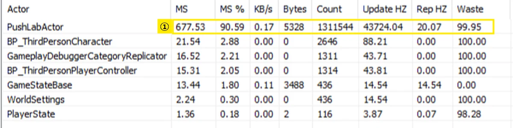

Waste는 `ReplicateActor`를 부른 횟수 중 아무것도 보내지 않은 비율이다. 뷰어는 `100 - Rep HZ / Update HZ × 100`으로 계산한다(`Engine/Source/Programs/NetworkProfiler/NetworkProfiler/PartialNetworkStream.cs`). ① Push + Skip에서 `PushLabActor`는 초당 43,724회 처리되었고 그중 20.07회만 무언가를 보냈다. Waste는 99.95다.

| 조건 | MS | Update HZ | Rep HZ | Waste |
| --- | --- | --- | --- | --- |
| Push 끔 | 3,766.40 | 42,698.61 | 20.07 | 99.95 |
| Push 켬 | 3,473.96 | 42,660.81 | 20.08 | 99.95 |
| Push + Skip | 677.53 | 43,724.04 | 20.07 | 99.95 |

Waste는 세 조건에서 같았다. Push Model은 보낼지 판단하는 방법을 바꿀 뿐 보내는 내용을 바꾸지 않는다. skip으로 건너뛴 호출도 `TrackReplicateActor`로 기록되므로(`Engine/Private/DataChannel.cpp`의 `ReplicateActor`) 분모에서 빠지지 않는다. 그래서 Waste가 그대로라고 Push Model이 효과가 없다고 읽으면 안 된다. 효과는 `ReplicateActor`에 쓴 시간인 MS 열에서 보인다. Push Model만 켜면 8% 줄었고 skip CVar까지 켜면 82% 줄었다. 앞의 CPU 측정보다 감소율이 훨씬 큰 데는 두 가지 이유가 있다. MS 열은 `ServerReplicateActors` 전체가 아니라 `ReplicateActor` 안쪽만 재므로 skip CVar가 건드리지 않는 후보 수집과 우선순위 계산이 빠져 있고, 비교와 직렬화마다 프로파일러가 기록을 남기므로 skip으로 건너뛴 호출에서는 그 기록 비용까지 함께 사라진다. 이 열은 세 조건의 상대 비교에만 쓴다.

### Dormancy와 비교하면

시간 분해에서 가장 큰 칸은 연결별 액터 처리였고, Push + Skip에서도 2.13 ms가 남았다. 이 칸은 액터가 `ReplicateActor`에 들어가는 한 남는다. 액터를 복제 검토 대상에서 아예 빼는 기능은 Dormancy다. `DORM_DormantAll`인 액터는 모든 연결에서 채널이 닫히면 활성 네트워크 오브젝트 목록에서 빠지고, `FlushNetDormancy`나 `ForceNetUpdate`로 깨울 때만 다시 복제된다.

같은 실험에 Dormancy 조건을 더했다. 워밍업 5초 시점에 액터 1000개를 모두 `DORM_DormantAll`로 바꾸고, 값을 쓸 때마다 먼저 깨운 뒤 값을 바꾸고 마킹했다.

```cpp
// 깨운 다음에 바꾼다
Actor->FlushNetDormancy();
Actor->SetHealth(NewHealth); // 내부에서 마킹한다
```

메인 조건(초당 1% 변경)을 조건당 3회 측정한 평균은 다음과 같다.

| 조건 | `ServerReplicateActors` |
| --- | --- |
| 깨어 있음, Push + Skip (앞의 10회 평균) | 3.36 ms |
| Dormancy, Push 끔 | 0.16 ms |
| Dormancy, Push 켬 | 0.16 ms |
| Dormancy, Push + Skip | 0.17 ms |

Push + Skip의 약 5%다. 측정 중 활성 네트워크 오브젝트는 프레임당 평균 10.9개였다. 잠든 액터는 비교도 직렬화도 하지 않으므로 Push Model과 skip CVar 설정에 따른 차이도 사라졌다.

값을 바꾸는 빈도를 올리면 결과가 뒤집힌다.

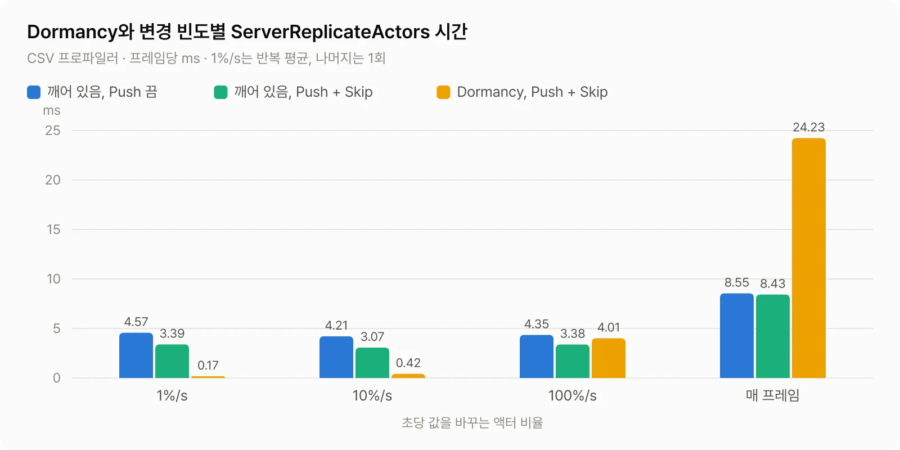

| 초당 변경 비율 | 깨어 있음, Push 끔 | 깨어 있음, Push + Skip | Dormancy, Push + Skip | 활성 오브젝트/프레임 |
| --- | --- | --- | --- | --- |
| 1% | 4.57 | 3.36 | 0.17 | 10.9 |
| 10% | 4.21 | 3.07 | 0.42 | 19.3 |
| 100% | 4.35 | 3.38 | 4.01 | 97.8 |
| 3000% (액터당 초당 30회) | 8.55 | 8.43 | 24.23 | 833.7 |

활성 오브젝트는 Dormancy 조건의 값이다. Push Model을 끈 Dormancy는 0.16, 0.42, 4.14, 24.91 ms로 Push + Skip과 비슷했다.

액터가 평균 10초에 한 번 바뀌는(10%) 조건까지는 Dormancy가 크게 앞섰다. 1초에 한 번(100%)이면 Push + Skip이 앞섰고, 초당 30회(3000%)면 Dormancy가 약 3배 느렸다.

같은 100% 조건의 트레이스에서 차이가 난 곳은 직렬화였다. 깨어 있는 Push + Skip에서 `Dynamic Property Rep Time`은 호출당 0.75 µs, 프레임당 0.12 ms였다. Dormancy에서는 호출당 9.84 µs, 프레임당 2.09 ms였다. 깨어난 액터는 채널을 새로 열고(채널 생성이 프레임당 85.6회), 호출당 시간이 13배인 것으로 보아 바뀐 프로퍼티 하나가 아니라 상태 전체를 다시 직렬화하는 것으로 보인다. 송신 패킷도 프레임당 2.0개에서 17.4개로 늘었고, 3000% 조건의 프레임당 송신량은 37.2 KB에서 80.1 KB가 됐다.

표의 수치 밖에서 드는 비용도 있다. `ServerReplicateActors` 다음에 도는 `UNetConnection::Tick`의 채널 Tick(`STAT_NetConnection_TickChannels`)이 깨어 있을 때 0.004 ms에서 0.92 ms로 늘었고, 게임 코드에서 부른 `FlushNetDormancy`에 0.25 ms가 더 들었다.

깨우는 순서는 Epic의 [Actor Network Dormancy](https://dev.epicgames.com/documentation/en-us/unreal-engine/actor-network-dormancy-in-unreal-engine) 문서를 따랐다. 문서는 깨울 때 shadow state를 현재 값으로 다시 만들기 때문에 깨운 다음에 바꾸라고 한다. 순서를 바꿔 값을 먼저 바꾸고 flush하는 probe도 돌려 봤는데, 이번 실험의 일반 프로퍼티는 1000개 모두 전달됐다. 문서는 이 동작을 기대면 안 되는 구현 세부로 보고, FastArray는 이 순서에서 변경이 전달되지 않을 수 있다고 적는다. 다음 절에서 볼 [UE-226689](https://issues.unrealengine.com/issue/UE-226689)도 Dormancy 해제와 마킹이 엮인 문제다.

### 다른 측정과 비교하면

영어권에 공개된 측정으로는 Kieran Newland의 글이 있다([Push Model Networking](https://www.kierannewland.co.uk/push-model-networking-unreal-engine/), UE 5.3.2). 그 측정에서는 Push Model만 켰을 때 -17%, skip CVar까지 켰을 때 -54%였다. 이번 측정의 -13%와 -26%보다 skip CVar의 효과가 훨씬 크다.

그 측정은 X와 Y로 20칸씩 도는 격자에 액터를 스폰하고(글의 `TotalRowsCols` 값이 20이라 20×20으로 보인다), 액터마다 컴포넌트 20개를 붙여 컴포넌트마다 float 하나를 복제하는 구성이다. 클라이언트는 4개이고, 값은 약 200 ms 구간의 `NetBroadcastTickTime`이다. 복제 대상 대부분이 서브오브젝트다. 서브오브젝트는 skip되면 그 서브오브젝트의 처리를 일찍 끝내지만, 액터 본체는 `ReplicateProperties` 한 줄만 건너뛰고 나머지 연결별 작업이 남는다. 이번 실험은 프로퍼티가 액터 본체에 있는 구성이라 남는 몫이 컸다. 같은 CVar의 효과가 -54%와 -26%로 갈린 것도 그 때문으로 보인다. 두 숫자 중 어느 한쪽이 맞다기보다, skip CVar의 효과는 상태가 액터 본체에 있는지 서브오브젝트에 있는지에 따라 달라진다고 본다.

## 마킹을 빠뜨리면

push 프로퍼티를 바꾸고 마킹을 빠뜨리면 아무 오류 없이 값이 전달되지 않는다. 측정 중 5초 시점에 서버에서 1000개 액터의 `Int00`을 777로 바꾸되 마킹하지 않고, 15초 시점에 같은 액터들의 `Int01`을 바꾸고 마킹했다. 클라이언트는 2초마다 `Int00 == 777`인 액터 수를 로그로 남겼다.

```text
// Push Model 켬: 30초 동안 매번 같은 결과
LogPushLab: Display: Client probe: 0 / 1000 lab actors have Int00=777

// Push Model 끔: 다음 확인에서 모두 반영
LogPushLab: Display: Client probe: 0 / 1000 lab actors have Int00=777
LogPushLab: Display: Client probe: 1000 / 1000 lab actors have Int00=777
```

같은 액터의 다른 프로퍼티가 마킹되어 액터가 복제돼도 `Int00`은 따라가지 않는다. dirty가 아닌 push 프로퍼티는 비교 대상에서 빠지기 때문이다. Dormancy와 겹치면 더 나빠진다. 마킹하지 않은 값이 Dormancy 해제 때 전송은 되지만 shadow state에는 기록되지 않아서, 나중에 값을 원래대로 되돌리면 그 변경을 감지하지 못한다. 이 이슈는 아직 열려 있다([UE-226689](https://issues.unrealengine.com/issue/UE-226689)).

이 확인은 초기 복제가 끝난 뒤에 해야 한다. 스폰 직후에 바꾼 값은 모든 비트가 dirty인 상태에서 첫 복제에 실리므로 마킹을 빠뜨려도 전달된다. 포럼의 "마킹하지 않았는데 복제된다"는 질문도 원인이 이것이었다([포럼 글](https://forums.unrealengine.com/t/properties-using-push-model-replicate-without-being-manually-marked-as-dirty/483647)). 이 실험의 probe도 측정 시작 5초 뒤에 값을 바꿨다.

### 마킹 누락을 막는 구조

복제 프로퍼티를 private으로 두고 값을 바꾸는 경로를 setter로 모으면 마킹을 빠뜨릴 자리가 setter 안으로 줄어든다. `FInventorySlot`은 `ItemId`와 `Count`를 가진 `USTRUCT`다. `Health`와 `Slots`는 앞에서 본 것처럼 `bIsPushBased`로 등록했다고 가정한다.

```cpp
UCLASS()
class AInventoryActor : public AActor
{
	GENERATED_BODY()

public:
	void SetHealth(float NewHealth)
	{
		// 값이 다를 때만 대입하고 마킹한다
		COMPARE_ASSIGN_AND_MARK_PROPERTY_DIRTY(AInventoryActor, Health, NewHealth, this);
	}

	void SetSlotCount(int32 SlotIndex, int32 NewCount)
	{
		// 배열 원소는 직접 비교하고, 바뀌었으면 배열 프로퍼티 전체를 마킹한다
		FInventorySlot& Slot = Slots[SlotIndex];
		if (Slot.Count != NewCount)
		{
			Slot.Count = NewCount;
			MARK_PROPERTY_DIRTY_FROM_NAME(AInventoryActor, Slots, this);
		}
	}

	// 여러 원소를 한 번에 고쳐야 할 때는 참조를 넘기는 순간 마킹한다
	TArray<FInventorySlot>& GetSlots_Mutable()
	{
		MARK_PROPERTY_DIRTY_FROM_NAME(AInventoryActor, Slots, this);
		return Slots;
	}

private:
	UPROPERTY(Replicated) float Health = 100.0f;
	UPROPERTY(Replicated) TArray<FInventorySlot> Slots;
};
```

Push Model에서는 프로퍼티 단위로 마킹하므로 배열 원소 하나를 바꿔도 배열 프로퍼티 전체가 다음 비교 대상이 된다. 실제로 보내는 원소는 비교에서 달라진 것뿐이다. `GetSlots_Mutable()`처럼 참조를 넘기면서 마킹하는 방식은 엔진도 쓴다. `AActor::GetReplicatedMovement_Mutable()`이 `ReplicatedMovement`를 마킹한 뒤 참조를 돌려준다(`Engine/Private/Actor.cpp`). 값을 바꾸지 않고 마킹만 해도 비교 비용만 들고 전송은 없다는 것은 앞에서 확인했다.

클래스 이름과 `this`를 매번 적는 게 번거롭다면 프로젝트 공용 헤더에 래퍼 매크로를 둘 수 있다. `ThisClass`는 `GENERATED_BODY()`가 클래스마다 선언하는 별칭이다.

```cpp
#define MARK_DIRTY(PropertyName) MARK_PROPERTY_DIRTY_FROM_NAME(ThisClass, PropertyName, this)
#define SET_AND_MARK(PropertyName, NewValue) COMPARE_ASSIGN_AND_MARK_PROPERTY_DIRTY(ThisClass, PropertyName, NewValue, this)

// 앞의 AInventoryActor::SetHealth를 매크로로 줄이면 다음과 같다
void SetHealth(float NewHealth)
{
	SET_AND_MARK(Health, NewHealth);
}
```

이 매크로는 부모 클래스에서 선언한 프로퍼티에 쓸 때 함정이 있다. 마킹 매크로는 RepIndex를 `ThisClass::ENetFields_Private`에서 읽는데, UHT는 복제 프로퍼티가 있는 클래스마다 자기 프로퍼티만 담은 `ENetFields_Private`를 만든다. 자식 클래스에 복제 프로퍼티가 없으면 enum이 없으니 부모의 enum을 찾아가서 컴파일된다. 자식에 복제 프로퍼티를 하나라도 추가하는 순간 자식의 enum이 부모의 enum을 가리고, 멀쩡하던 마킹 코드가 컴파일 오류로 바뀐다. ThirdPerson 프로젝트에서 두 경우를 빌드해 확인했다. 부모 프로퍼티는 선언한 클래스 이름을 직접 적거나 부모의 setter를 거쳐 마킹한다.

다만 `GetSlots_Mutable()`로 받은 참조를 보관했다가 다음 프레임 이후에 고치는 경우는 이 구조로도 막지 못한다. 마킹은 이미 비교에서 소비된 뒤라 변경이 전달되지 않는다. 이런 경로는 검증용 CVar로 찾는다.

### 검증 CVar

개발 중에는 켜 두고, 성능을 잴 때는 끈다.

```ini
[SystemSettings]
; 모든 push 프로퍼티를 비교해서 마킹되지 않은 변경이 있으면 경고한다 (기본값 0)
; 모든 프로퍼티를 비교하므로 켠 상태로는 Push Model의 이득이 사라진다
net.PushModelValidateProperties=1
; skip할 수 있다고 판단한 오브젝트가 실제로 데이터를 썼는지 검사한다 (기본값 0)
; 검사하려고 skip하지 않고 복제하므로 이것도 측정 때는 끈다
net.PushModelValidateSkipUpdate=1
```

`net.PushModelValidateProperties`는 Shipping과 Test 빌드에는 들어가지 않는다(`Net/Core/Public/Net/Core/PushModel/PushModelMacros.h`의 `WITH_PUSH_VALIDATION_SUPPORT`).

## Iris: push를 더 적극적으로 쓰는 차세대 복제 시스템

Iris(`net.Iris.UseIrisReplication`, 5.8.3 기본값 0)는 push 정보를 레거시보다 적극적으로 쓰도록 설계됐다. `net.Iris.PushModelMode`의 기본값이 2(켜짐)라서, `Net.IsPushModelEnabled`와 `WITH_PUSH_MODEL`만 켜져 있으면 Iris는 기본으로 Push Model을 쓴다(`Net/Iris/Private/Iris/ReplicationSystem/LegacyPushModel.h`의 `IsIrisPushModelEnabled`). 다만 Push Model이 필수는 아니다. 두 스위치가 꺼져 있으면 모든 오브젝트의 상태 전체를 폴링하고(`FObjectPoller::ForcePollObject`), 켜져 있어도 push 기반이 아닌 멤버는 매번 폴링한다.

Iris에서 Push Model이 동작하는 데 필요한 스위치만 추리면 다음과 같다.

```ini
[SystemSettings]
; Iris 사용 (5.8.3 기본값 0)
net.Iris.UseIrisReplication=1
; 레거시와 같은 Push Model 스위치. 꺼져 있으면 Iris는 모든 상태를 폴링한다
net.IsPushModelEnabled=1
; 기본값 2(켜짐, 런타임에 바꿀 수 있음). 적지 않아도 된다
; net.Iris.PushModelMode=2
```

패키지 빌드라면 [앞에서 본 것처럼](#1-컴파일-스위치-bwithpushmodel) Target.cs의 `bWithPushModel = true`도 필요하다. 이 예시는 push 관련 스위치만 모은 것이다. Iris 자체를 켜려면 Iris 플러그인과 모듈의 `SetupIrisSupport(Target)` 같은 준비가 더 필요하므로 Epic의 [Migrate to Iris](https://dev.epicgames.com/documentation/en-us/unreal-engine/migrate-to-iris-in-unreal-engine) 문서를 따른다. 이번 실험은 Iris를 켜고 측정하지 않았다.

레거시와 가장 다른 점은 push 정보를 쓰는 단계다. Iris는 복제 전에 오브젝트 값을 내부 상태로 복사하는 폴링 단계(`FObjectPoller`)를 거친다. Full push 오브젝트(모든 멤버가 push 기반인 오브젝트)는 dirty가 아니고 GC의 영향도 받지 않았다면 폴링 루프에 들어가기 전에 목록에서 빠진다(`ObjectPoller.cpp`, `net.Iris.Poll.FilterOutNonDirtyPushBasedObjects` 기본값 `true`). 레거시가 비교 단계에서 프로퍼티를 건너뛴다면, Iris는 그보다 앞에서 오브젝트 단위로 걸러 낸다. 기본 설정에서는 마킹된 오브젝트가 `NetUpdateFrequency`로 정해진 폴링 주기를 기다리지 않고 그 프레임에 폴링된다는 점도 다르다. Epic도 Iris 개발 과정을 다룬 [Unreal Fest Orlando 2025 발표](https://www.youtube.com/watch?v=K472O2rVvG0)의 성능 팁에서 프로퍼티에 Push Model을 쓰라고 권했다. 특히 폴링 단계에서 시간을 많이 아낀다는 설명이었다.

엔진 설정에는 Iris에서 Full push를 유지해야 하는 클래스 목록이 있다(`Config/BaseEngine.ini`의 `EnsureFullyPushModelClassNames`). 목록에는 `SceneComponent`, `StaticMeshComponent`, `CapsuleComponent` 같은 컴포넌트와 `WorldDataLayers`만 있고 Actor, Pawn, Character는 없다. Iris로 옮겨도 캐릭터는 Partial로 남는다.

## Push Model 적용 기준

새 프로젝트에서 기본으로 하는 것은 세 가지다.

- 직접 관리하는 복제 프로퍼티는 push로 등록하고 skip CVar를 켠다. 이번에 측정한 조건에서는 Push Model을 켠 쪽이 실행 간 편차를 넘어 느려진 경우가 없었다. 다만 측정한 것은 수치형 프로퍼티 16개짜리 액터이고, 엔진 헤더가 적어 둔 메모리 비용(`TargetRules.cs`의 `bWithPushModel` 주석)은 재지 않았다. skip CVar는 Full 클래스에서만 동작하므로 한 클래스 안에서 섞어 쓸 이유는 없다. 값을 바꾸는 경로를 통제하기 어려운 코드는 따로 검토한다.
- 값을 바꾸는 경로는 setter로 모은다([마킹 누락을 막는 구조](#마킹-누락을-막는-구조)).
- 패키지 빌드의 Target.cs에 `bWithPushModel = true`가 있는지 확인한다. 없으면 PIE에서 본 동작과 다르게 조용히 폴링으로 돈다.

Push Model로 이득을 기대하기 전에는 다음을 확인한다.

- unreliable multicast를 보내는 액터인가. 한 번이라도 보내면 그 연결에서 skip이 영구히 꺼진다. 자주 skip되어야 하는 액터라면 그 RPC를 다른 액터로 옮길지 따져 본다.
- 엔진 부모 클래스 때문에 Partial 클래스인가. 캐릭터가 그렇다. 이때는 비교 비용 감소까지만 기대한다.
- skip을 노리고 상태를 컴포넌트로 쪼개려는가. 이번 측정에서는 replicator가 늘어나는 비용이 더 커서 오히려 35% 느려졌다.

Push Model은 Dormancy를 대신하지 않는다. 값이 몇 초에 한 번 바뀔까 말까 한 액터라면 Dormancy를 먼저 검토하고, Push Model은 깨어 있는 액터의 비교 비용을 줄이는 데 쓴다. 이번 측정에서는 액터마다 초당 한 번 바뀌는 지점에서 둘의 순서가 뒤집혔다. 그 경계는 액터의 프로퍼티 수와 연결 수에 따라 달라질 것이므로 프로젝트에서 직접 재 보는 편이 낫다.

엔진 헤더도 이 기능의 한계를 적어 두었다.

> While the theoretical gains for Push Model are good, in practice the gains seen haven't been as good as expected.
>
> `Net/Core/Public/Net/Core/PushModel/PushModel.h`

이번 측정의 26%도 그 문장과 크게 다르지 않다. 그래도 측정한 조건 안에서는 손해 보는 경우를 찾지 못했고, 마킹을 강제하는 구조가 값을 바꾸는 경로를 한곳으로 모으는 효과도 있다. 수치형 프로퍼티 위주의 실험이라 다른 구성에서는 결과가 다를 수 있지만, 새 프로젝트에서 직접 관리하는 프로퍼티를 push로 등록하는 것을 기본 선택으로 삼기에는 충분하다고 본다.

## 참고 자료

- Unreal Engine 5.8.3 소스: `Net/Core/Public/Net/Core/PushModel/PushModel.h`, `Net/Core/Private/Net/Core/PushModel/PushModel.cpp`, `Engine/Private/RepLayout.cpp`, `Engine/Private/DataReplication.cpp`, `Engine/Private/DataChannel.cpp`, `Engine/Private/ActorReplication.cpp`, `Engine/Private/NetConnection.cpp`, `Net/Core/Classes/Net/Serialization/FastArraySerializer.h`, `Engine/Public/Net/UnrealNetwork.h`, `CoreUObject/Public/UObject/CoreNet.h`, `Net/Core/Private/Net/Core/Misc/NetCVars.cpp`, `Engine/Private/NetworkProfiler.cpp`, `Engine/Source/Editor/BlueprintGraph/Private/VariableSetHandler.cpp`, `Engine/Source/Programs/NetworkProfiler/NetworkProfiler/PartialNetworkStream.cs`, `Programs/UnrealBuildTool/Configuration/Rules/TargetRules.cs`
- [Replicating UObjects in Unreal Engine](https://dev.epicgames.com/documentation/en-us/unreal-engine/replicating-uobjects-in-unreal-engine)
- [Actor Network Dormancy in Unreal Engine](https://dev.epicgames.com/documentation/en-us/unreal-engine/actor-network-dormancy-in-unreal-engine)
- [Developing and Launching a New Replication System, Unreal Fest Orlando 2025](https://www.youtube.com/watch?v=K472O2rVvG0)
- [Migrate to Iris in Unreal Engine](https://dev.epicgames.com/documentation/en-us/unreal-engine/migrate-to-iris-in-unreal-engine)
- [Kieran Newland, Push Model Networking](https://www.kierannewland.co.uk/push-model-networking-unreal-engine/)
- [hzFishy's Game Dev Notes, Push Model](https://notes.hzfishy.fr/Unreal-Engine/Networking/Core/Push-Model)
- [Sneaky Kitty Game Dev, Unreal Engine Networking: Push Model](https://www.youtube.com/watch?v=hDIU4I8k-28)
- [enigma tutorials, UPROPERTY Replication (Normal & Push)](https://www.youtube.com/watch?v=NWAdK2ndYWc)
- [UE-194745](https://issues.unrealengine.com/issue/UE-194745), [UE-226689](https://issues.unrealengine.com/issue/UE-226689)
- [Push Model Networking, Epic Developer Community Forums](https://forums.unrealengine.com/t/push-model-networking/510684)
