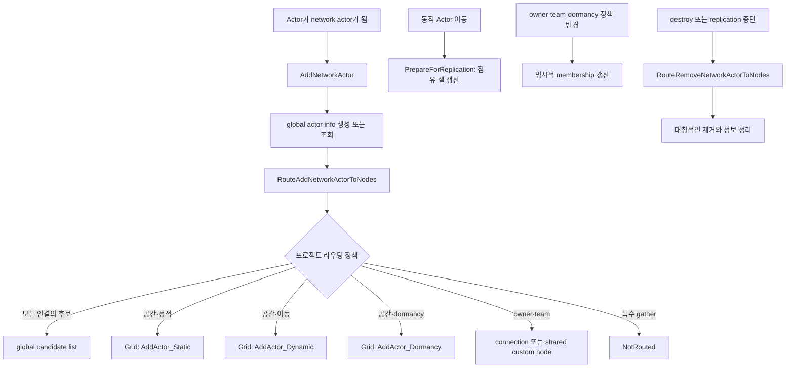
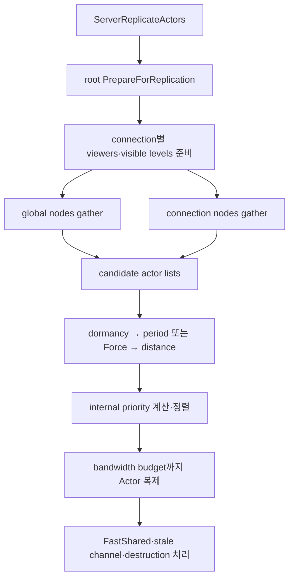

멀티플레이 서버는 각 연결에 대해 “이번 프레임에 어떤 Actor를 복제 후보로 볼 것인가”를 결정해야 한다. Actor와 연결 수가 모두 커지면, 모든 조합에 대해 관련성을 다시 계산하는 방식은 실제로 보낼 데이터가 많지 않아도 서버 CPU를 크게 사용한다.

**Replication Graph**는 이 후보 탐색을 지속적인 Actor 목록과 재사용 가능한 노드로 바꾸는 `UReplicationDriver` 구현이다. 공간 셀, 모든 연결용 목록, 특정 연결용 목록, 팀별 공유 노드처럼 게임의 관련성 규칙을 자료구조로 유지하고, 각 연결은 필요한 노드에서 후보 목록만 모은다.

다만 Replication Graph가 Actor의 프로퍼티를 더 작게 직렬화하거나 네트워크 대역폭을 자동으로 줄여 주는 것은 아니다. 노드가 돌려준 것은 최종 송신 목록도 아니다. 후보 수집 뒤에도 dormancy, 복제 주기, 거리, 우선순위, 연결의 bit budget이 적용된다.

## 기본 Replication Driver와 Replication Graph

| 선택지            | 잘 맞는 경우                                                                 | 관련성·우선순위 확장 방식                      | 주의점                                                    |
| ----------------- | ---------------------------------------------------------------------------- | ---------------------------------------------- | --------------------------------------------------------- |
| 기본 Driver       | Actor·연결 수가 비교적 작고 기본 `IsNetRelevantFor` 계약으로 충분한 프로젝트 | Actor virtual function과 NetDriver 기본 처리   | Actor × connection 후보 검사가 규모에 따라 비싸질 수 있다 |
| Replication Graph | 많은 Actor와 연결에서 공간·소유자·팀 규칙을 명시적인 목록으로 재사용할 때    | global/connection/custom node와 class settings | C++ 정책 코드와 membership 수명주기를 프로젝트가 책임진다 |

Replication Graph 경로에서는 Actor의 `IsNetRelevantFor`와 `GetNetPriority`가 관련성·우선순위의 중심이 아니다. 노드 membership과 gather 결과, `FGlobalActorReplicationInfo`, `FConnectionReplicationActorInfo`, RepGraph 내부 우선순위 계산이 그 역할을 나눠 맡는다. 따라서 기존 Actor override를 그대로 둔 채 driver만 교체하면 같은 결과가 나온다고 기대해서는 안 된다.

먼저 기본 driver의 Actor별 관련성 판단으로 충분한지, 아니면 게임 규칙에 맞는 persistent list를 직접 관리할지 결정한 뒤 코드를 설계해야 한다.

## Replication Graph가 실제로 줄이는 비용

기본적인 관련성 검사는 개념적으로 Actor와 connection의 조합을 반복해 살핀다. 규모가 커지면 대부분이 “관련 없음”으로 끝나더라도 검사 자체가 비용이다. RepGraph는 자주 바뀌지 않는 분류를 persistent list에 보관한다.

- 멀리 떨어진 Actor는 2D grid의 다른 셀에 두어 애초에 후보 목록에 넣지 않는다.
- `GameState`처럼 모든 연결이 고려해야 할 Actor는 하나의 global list로 공유한다.
- `PlayerController`나 소유 Pawn처럼 특정 연결만 고려할 Actor는 connection node에 둔다.
- 팀 시야처럼 여러 연결이 같은 목록을 공유하면 custom team node 하나를 여러 connection에 연결할 수 있다.
- 이동 Actor는 grid의 `PrepareForReplication` 단계에서 점유 셀을 갱신한다.

핵심은 매 프레임 관련성 규칙을 처음부터 재평가하는 대신, **Actor의 수명주기와 정책 이벤트가 목록을 유지하고 replication frame은 목록을 읽는 것**이다. 그 대가로 잘못된 라우팅, 제거 누락, owner·team·dormancy 변경 처리 누락이 곧 네트워크 버그가 된다.

## 세 층의 상태

RepGraph를 이해할 때 다음 세 층을 분리하면 좋다.

| 층                      | 대표 데이터·객체                  | 책임                                                                                 |
| ----------------------- | --------------------------------- | ------------------------------------------------------------------------------------ |
| 클래스 기본값           | `FClassReplicationInfo`           | cull distance, replication period, priority scale 등 class 단위 정책                 |
| Actor 전역 상태         | `FGlobalActorReplicationInfo`     | cached location, global settings, force/dormancy 상태, dependent actor 등            |
| Actor × connection 상태 | `FConnectionReplicationActorInfo` | channel, per-connection dormancy, 다음 replication frame, connection별 cull distance |

그래프 노드는 이 데이터를 모두 대체하지 않는다. 노드는 “이 연결이 검토할 Actor 목록”을 제공하고, class/global/connection 정보는 이후의 scheduling과 필터링에 쓰인다.

## Actor가 노드에 들어가고 나오는 흐름

Actor가 추가되고 제거될 때의 흐름은 다음과 같다.



일반 replicated property가 바뀌었다고 `RouteAddNetworkActorToNodes`가 다시 호출되는 것은 아니다. 그 변화는 Actor가 최종 후보로 선택된 뒤 channel의 dirty state 직렬화 단계에서 처리된다. 반면 team, owner, dormancy처럼 **어느 목록에 속해야 하는지**를 바꾸는 상태는 프로젝트나 노드가 이벤트를 받아 membership을 직접 갱신해야 한다.

`RouteRemoveNetworkActorToNodes`는 add 정책의 정확한 역연산이어야 한다. Actor를 여러 노드에 넣었다면 모두에서 제거해야 한다. 중복 반환 자체는 허용되고 같은 frame에 이미 복제한 Actor는 실제 복제 루프에서 건너뛰지만, gather와 sort 비용은 남으므로 의도하지 않은 중복은 줄인다.

## 최소 활성화 방법

### 1. 플러그인과 모듈 의존성

프로젝트의 Plugins 창 또는 `.uproject`에서 **Replication Graph** 플러그인을 켠다. 게임 모듈 구현에서만 RepGraph 타입을 쓴다면 private dependency로 충분하다.

```csharp
// MyGame.Build.cs
PrivateDependencyModuleNames.AddRange(
    new string[]
    {
        "ReplicationGraph",
    });
```

public header가 RepGraph 타입을 노출한다면 `PublicDependencyModuleNames`로 옮긴다. 단순히 플러그인을 켜는 것만으로 driver가 교체되지는 않는다.

### 2. 먼저 `UBasicReplicationGraph`로 연결 확인

custom graph를 작성하기 전에 driver 설정과 접속이 정상인지 확인하려면 공식 최소 구현을 사용할 수 있다.

```ini
[/Script/OnlineSubsystemUtils.IpNetDriver]
ReplicationDriverClassName="/Script/ReplicationGraph.BasicReplicationGraph"
```

[`UBasicReplicationGraph`](https://dev.epicgames.com/documentation/en-us/unreal-engine/API/Plugins/ReplicationGraph/UBasicReplicationGraph)는 `NetCullDistanceSquared`, `bAlwaysRelevant`, `bOnlyRelevantToOwner`만 지원하고 이 값을 Actor별 runtime에 바꿀 수 없다. 따라서 smoke test와 작은 prototype에는 유용하지만, owner나 relevancy가 바뀌는 실제 게임의 완성형 정책으로 보기는 어렵다.

### 3. custom graph 지정

프로젝트 graph를 만들었다면 실제 사용하는 NetDriver의 config section에 class를 지정한다.

```ini
[/Script/OnlineSubsystemUtils.IpNetDriver]
ReplicationDriverClassName="/Script/MyGame.MyReplicationGraph"
```

Steam이나 별도 NetDriver를 사용하면 예제의 `IpNetDriver` section을 그대로 복사하지 말고 **그 driver의 section**을 설정해야 한다. 맵, 모드, URL 또는 driver에 따라 graph를 동적으로 선택해야 한다면 `UReplicationDriver::CreateReplicationDriverDelegate`를 binding하는 방식도 있다.

```cpp
UReplicationDriver::CreateReplicationDriverDelegate().BindLambda(
    [](UNetDriver* ForNetDriver, const FURL& URL, UWorld* World)
        -> UReplicationDriver*
    {
        return NewObject<UMyReplicationGraph>(GetTransientPackage());
    });
```

정적 config와 delegate를 무작정 함께 쓰지 말고, 어느 경로가 driver를 만드는지 프로젝트 시작 코드와 NetDriver별로 한 곳에서 관리한다. 공식 [Replication Graph 시작 문서](https://dev.epicgames.com/documentation/unreal-engine/replication-graph-in-unreal-engine)도 config와 delegate 두 방식을 설명한다.

## custom graph의 다섯 가지 핵심 hook

`UReplicationGraph`는 완성된 게임 정책이 아니라 확장을 위한 기반이다. 보통 다음 함수를 재정의한다.

| hook                             | 하는 일                                                             | 실수하기 쉬운 부분                                                 |
| -------------------------------- | ------------------------------------------------------------------- | ------------------------------------------------------------------ |
| `InitGlobalActorClassSettings`   | `FClassReplicationInfo`와 class별 routing 정책의 기본값 구성        | 모든 class를 반드시 eager scan해야 한다고 가정하지 않기            |
| `InitGlobalGraphNodes`           | grid, global actor list, frequency limiter 같은 root node 생성·등록 | global node를 “모든 Actor를 항상 전송”으로 해석하지 않기           |
| `InitConnectionGraphNodes`       | connection마다 필요한 node를 생성하거나 shared node 연결            | `Super`를 호출해 기본 tear-off connection node 유지                |
| `RouteAddNetworkActorToNodes`    | 새 network Actor를 class·상태에 맞는 하나 이상의 node에 추가        | moving Actor를 static grid route에 넣거나 runtime 정책 변경을 누락 |
| `RouteRemoveNetworkActorToNodes` | add와 같은 정책으로 모든 node에서 제거                              | add/remove 분기가 달라 stale pointer나 잘못된 후보를 남기지 않기   |

class별 정책을 enum으로 정규화하면 add와 remove가 같은 결정을 공유하기 쉽다.

```cpp
enum class EMyClassRepPolicy : uint8
{
    NotRouted,
    RelevantAllConnections,
    Spatialize_Static,
    Spatialize_Dynamic,
    Spatialize_Dormancy,
};
```

이 enum은 엔진이 요구하는 이름이 아니라 프로젝트 설계 패턴이다. base class에서 상속되는 정책, runtime 변경 가능 여부, dormancy 사용 여부를 한 곳에서 계산하고, add와 remove 함수가 동일한 결과를 사용하게 만든다.

`InitGlobalActorClassSettings`는 모든 class를 무조건 미리 열거하는 의무가 아니다. 기본값을 설정하고, 필요한 class는 lazy initialization으로 처리할 수도 있다. 프로젝트가 loaded class scan을 사용한다면 Blueprint class가 나중에 load될 때도 올바른 설정을 얻는지 확인한다.

## Global node와 connection node의 정확한 의미

**Global graph node**는 모든 connection의 gather 과정에서 호출되는 root node다. “그 안의 모든 Actor를 모든 client에 매 frame 보낸다”는 뜻이 아니다. `UReplicationGraphNode_GridSpatialization2D`도 global node지만, connection viewer의 위치에 따라 다른 셀 목록을 낸다.

**Connection graph node**는 특정 connection의 gather 과정에만 참여한다. 해당 connection의 controller, pawn, view target, owner-only Actor, visible streaming level Actor를 관리하는 데 적합하다. 여러 connection이 같은 팀 목록을 봐야 한다면 custom node 하나를 공유해 각 connection에 붙일 수도 있다.

노드가 반환한 Actor도 replication period나 dormancy, distance, bandwidth 때문에 그 frame에 전송되지 않을 수 있다. 그러므로 여기서 말하는 “always relevant”는 **항상 후보가 될 정책**에 가깝지 “매 frame 패킷을 보낸다”는 보장이 아니다.

## 연결 하나가 후보를 모아 전송하기까지

`ServerReplicateActors`는 RepGraph의 replication frame마다 실행된다. 게임 tick과 흔히 같은 속도로 보일 수 있지만 의미상 “매 게임 tick에 반드시 한 번”이라고 계약하면 안 된다. 연결별 전체 흐름은 다음과 같다.



단계를 더 정확히 읽으면 다음과 같다.

1. 요청한 root node가 `PrepareForReplication`에서 frame 공통 상태를 갱신한다. dynamic grid는 이때 이동 Actor의 셀을 갱신한다.
2. connection의 viewer와 view target, visible streaming level을 준비한다.
3. 모든 global root node와 해당 connection의 node에 `GatherActorListsForConnection`을 호출한다.
4. 모은 default 후보에 connection dormancy, `ReplicationPeriodFrame` 또는 `ForceNetUpdate`, 최종 distance cull을 적용한다.
5. class bias, 거리, starvation, pending dormancy, viewer/view target 같은 입력으로 내부 priority를 계산해 정렬한다.
6. connection의 bandwidth budget이 허용하는 순서대로 Actor channel을 열거나 갱신한다. 포화되면 남은 후보는 starved 처리된다.
7. 설정된 경우 FastShared 후보를 별도 budget으로 처리한 뒤 stale channel과 destruction info를 정리한다.

`GatherActorListsForConnection`은 3단계까지만 책임진다. 따라서 gather log에 Actor가 보인다는 사실과 실제 packet에 property가 실렸다는 사실을 구분해야 한다. 반대로 `ForceNetUpdate`는 관련 없는 Actor를 관련 있게 만들지 않는다. 이미 관련성 후보가 된 Actor의 schedule을 앞당기는 기능이다.

## 서로 다른 네 가지 축을 한 설정처럼 다루지 않기

grid, static/dynamic route, frequency bucket은 비슷해 보이지만 서로 다른 축이다.

| 축            | 질문                                                 | 대표 수단                                                                                       |
| ------------- | ---------------------------------------------------- | ----------------------------------------------------------------------------------------------- |
| 후보 관련성   | 이 connection이 이 Actor를 검토해야 하는가?          | node membership, grid cell, global list, owner/team connection node, streaming-level visibility |
| 업데이트 빈도 | 관련 있는 Actor를 어느 frame에 다시 검토할 것인가?   | `ReplicationPeriodFrame`, `NextReplicationFrameNum`, `ForceNetUpdate`                           |
| 우선순위      | 후보가 많을 때 누구부터 보낼 것인가?                 | class bias, distance scale, starvation, viewer/view target, pending dormancy                    |
| 실제 송신량   | 이번 connection budget으로 무엇이 packet에 실리는가? | dirty state, actor channel, bandwidth/bit budget, FastShared 경로                               |

한 축을 바꿔 다른 축의 문제를 해결하려 하면 기대와 다른 결과가 나온다. 예를 들어 replication period를 짧게 해도 grid 밖의 Actor가 후보가 되지 않으며, 모든 connection 후보 목록에 넣었다고 매 frame dirty property가 생기는 것도 아니다.

## 주요 노드와 올바른 사용 범위

### `UReplicationGraphNode_ActorList`

명시적인 Actor 목록을 보관하는 기본 building block이다. global root로 등록하면 모든 connection이 이 목록을 gather할 수 있다. 게임 전체에서 고려할 `GameState`류를 담을 수 있지만, 실제 전송 주기와 bandwidth 검사는 뒤에 남아 있다.

### `UReplicationGraphNode_AlwaysRelevant_ForConnection`

특정 connection의 controller, pawn, view target, owner-only 또는 connection별 streaming actor처럼 그 connection이 항상 고려해야 하는 Actor에 사용한다. owner가 runtime에 바뀌면 이전 connection과 새 connection의 membership을 함께 고쳐야 한다.

### `UReplicationGraphNode_GridSpatialization2D`

월드를 2D cell로 나누고 connection의 viewer 주변 cell만 gather한다. cell은 connection마다 따로 소유하는 목록이 아니라 **global persistent grid의 child node**다.

Actor는 위치와 cull radius가 덮는 여러 cell에 들어갈 수 있다. 그래서 cell gather에는 실제 cull distance 밖의 false positive가 포함될 수 있고, 뒤의 distance check가 이를 제거한다. route는 움직임 특성에 맞아야 한다.

- `AddActor_Static`: 위치가 변하지 않는 Actor. 이동 Actor를 넣으면 cell membership이 낡는다.
- `AddActor_Dynamic`: `PrepareForReplication`에서 위치를 추적해야 하는 Actor.
- `AddActor_Dormancy`: dormancy 전환과 spatial membership을 함께 관리하는 Actor.

grid의 cell size와 spatial bias는 월드 크기, Actor 밀도, 일반적인 cull radius로 측정해 정한다. cell이 너무 크면 후보 감소 효과가 약하고, 너무 작으면 큰 cull radius의 Actor가 많은 cell에 중복돼 memory와 gather 비용이 늘어난다.

### `UReplicationGraphNode_ActorListFrequencyBuckets`

비스트리밍 Actor 목록을 여러 bucket으로 나누고 frame마다 일부 bucket을 gather하는 coarse load balancer다. 개별 Actor의 `ReplicationPeriodFrame` 검사와는 별도 단계다. bucket 수를 늘리면 한 frame의 gather 부하는 줄 수 있지만 가장 늦게 다시 고려되는 시간도 늘어난다.

### `UReplicationGraphNode_DynamicSpatialFrequency`

connection viewer와의 거리에 따라 Actor의 update frequency를 동적으로 선택하는 별도 노드다. “grid에서 어느 Actor를 후보로 찾을지”와 “찾은 Actor를 얼마나 자주 갱신할지”를 분리하고 싶을 때 검토한다.

### custom team 또는 gameplay node

팀 시야, 파티 공유 정보, objective phase처럼 공간만으로 표현하기 어려운 정책은 custom node가 알맞다. graph가 gameplay 객체를 매 frame 전역 검색하는 대신 팀 가입·탈퇴, phase 전환 이벤트를 구독해 목록을 갱신한다. 프로젝트 코드가 graph의 세부 타입에 광범위하게 의존하지 않게, 좁은 notification interface나 subsystem을 경계로 두는 편이 유지보수에 유리하다.

## Dormancy와 dependent Actor

Dormancy는 “grid에 들어갈 것인가”와 별개로 connection별 전송을 멈추는 상태다. `Spatialize_Dormancy` route는 dormancy 변화에 맞춰 spatial node가 membership과 flush를 다루도록 하기 위한 정책이지, dormancy 자체를 대체하지 않는다. 상태를 변경할 때는 엔진의 dormancy API와 graph node가 기대하는 notification 경로를 사용한다.

`FGlobalActorReplicationInfo`의 dependent actor 관계는 parent가 복제될 때 child를 바로 이어서 고려하게 한다. 하지만 다음을 보장하지 않는다.

- parent와 child가 같은 packet에 반드시 들어감
- child의 visible level, period, channel, bandwidth 조건을 무시함
- child가 다른 node에 별도로 라우팅되지 않음

무기와 소유 캐릭터의 갱신 순서를 가깝게 만들 수는 있지만, gameplay correctness를 packet 동시성에 의존하면 안 된다. 반드시 함께 성립해야 하는 값은 한 replicated state나 명시적인 revision/invariant로 설계한다.

## 샘플 구현에서 배울 패턴

엔진에 포함된 `BasicReplicationGraph`와 ShooterGame의 `ShooterReplicationGraph`는 최소 구성과 게임별 확장을 비교할 수 있는 출발점이다. source와 module dependency가 있다는 사실만으로 runtime에 RepGraph가 활성화됐다고 판단하면 안 된다. 실제 NetDriver 설정도 함께 확인한다.

샘플 구현에서 참고할 만한 패턴은 다음과 같다.

- class route를 `NotRouted`, all-connections, static, dynamic, dormancy 정책으로 분류한다.
- global grid와 global actor list를 분리한다.
- connection별 viewer, view target, controller, pawn, visible streaming actor를 별도 node에서 모은다.
- PlayerState처럼 공간화하기 어렵고 수가 많은 Actor는 custom frequency limiter로 frame 부하를 분산한다.
- `InitConnectionGraphNodes`에서 base 구현을 호출해 tear-off node를 유지한다.
- 프로젝트 debug command로 class routing 결과를 출력한다.

샘플의 cell size, bucket 수, FastShared 설정은 정답이 아니다. 각 샘플의 Actor 밀도와 게임 규칙에서 나온 출발점일 뿐이므로 자기 프로젝트 trace로 다시 정한다.

## 디버깅은 membership부터 packet까지 단계별로

“클라이언트에 값이 안 온다”는 증상만으로 property replication부터 의심하면 RepGraph 버그를 찾기 어렵다. 다음 순서로 좁힌다.

1. **driver 확인:** 해당 NetDriver가 기본 driver와 RepGraph 중 무엇을 실제로 만들었는지 log와 config로 확인한다.
2. **class policy 확인:** 예상한 route가 상속·lazy class initialization 뒤에도 유지되는지 본다.
3. **membership 확인:** add가 호출됐는지, 올바른 node/cell/connection에 들어갔는지, remove가 너무 일찍 호출되지 않았는지 본다.
4. **gather 확인:** viewer 위치, streaming-level visibility, team·owner node가 connection 후보에 Actor를 넣는지 본다.
5. **후속 필터 확인:** dormancy, period, cull distance, channel 상태가 후보를 제거하는지 본다.
6. **포화 확인:** priority가 낮아 계속 starved 되는지 connection bandwidth와 prioritized list를 본다.
7. **dirty state 확인:** Actor가 실제로 복제됐지만 보낼 property 변화가 없거나 condition 때문에 빠진 것은 아닌지 확인한다.

사용 중인 엔진 branch에 따라 명령 이름과 지원 범위가 다를 수 있지만, 대표적인 RepGraph 디버깅 명령은 다음과 같다.

```text
Net.RepGraph.PrintGraph nclass
Net.RepGraph.PrintAll 5 0 nclass
Net.RepGraph.PrioritizedLists.Print 0
Net.RepGraph.Debug.Start
Net.RepGraph.PrintAllActorInfo <ActorMatchString>
Net.RepGraph.PrintCullDistances
Net.RepGraph.PrintCullDistancesForConnection
Net.RepGraph.Spatial.CellInfo
Net.RepGraph.Lists.Stats
```

[`AReplicationGraphDebugActor`](https://dev.epicgames.com/documentation/en-us/unreal-engine/API/Plugins/ReplicationGraph/AReplicationGraphDebugActor)는 connection별 cell·cull·Actor 정보를 조회하는 debug 경로를 제공하며 shipping build에는 생성되지 않는다. `LogReplicationGraph` category도 함께 사용한다.

`Net.RepDriver.Enable 0/1`로 기존 replication driver와 A/B 비교할 때는 같은 bot 수, 같은 view path, 같은 Actor spawn 패턴을 재현한다. 서버 frame time만 보지 말고 다음을 함께 측정한다.

- gather된 Actor와 최종 prioritized Actor 수
- replication에 사용한 server CPU time
- 열린 actor channel 수와 churn
- connection별 포화·starvation
- 실제 송수신 bytes와 packet loss
- graph node와 grid가 유지하는 memory

[Network Insights](https://dev.epicgames.com/documentation/en-us/unreal-engine/network-insights-in-unreal-engine)를 사용하면 trace에서 packet과 replicated object를 확인할 수 있다. RepGraph 적용 뒤 CPU는 줄었지만 bytes가 그대로인 결과도 정상이다. 그것은 후보 탐색 최적화와 payload 최적화가 다른 문제라는 뜻이다.

## 자주 생기는 설계 오류

| 오류                                                   | 실제 결과                                                       | 수정 방향                                                              |
| ------------------------------------------------------ | --------------------------------------------------------------- | ---------------------------------------------------------------------- |
| global node를 매 frame 전송 보장으로 이해              | period, dormancy, priority, budget 때문에 송신되지 않을 수 있음 | “모든 connection에서 gather할 root”와 최종 송신을 분리                 |
| gather 목록을 packet 목록으로 이해                     | 후속 filter·sort·budget 단계를 놓침                             | candidate → filter → priority → send 순서로 debug                      |
| 움직이는 Actor를 static grid route에 추가              | Actor가 예전 cell에 남아 잘못 보이거나 사라짐                   | dynamic route와 `PrepareForReplication` 위치 갱신 사용                 |
| owner·team·dormancy 값만 바꾸고 node를 갱신하지 않음   | 이전 connection에 남거나 새 connection에서 누락                 | 정책 변경 이벤트로 membership을 대칭 갱신                              |
| `ForceNetUpdate`로 관련성까지 바뀐다고 기대            | 후보가 아닌 Actor는 계속 제외됨                                 | node relevancy를 먼저 고치고 Force는 scheduling에만 사용               |
| dependent Actor가 parent와 반드시 함께 전송된다고 가정 | level, period, bandwidth에 따라 child가 늦어질 수 있음          | gameplay invariant를 packet 동시성 대신 replicated state로 표현        |
| Basic graph에서 runtime relevancy 변경                 | 공식 최소 구현이 변경을 지원하지 않음                           | custom graph와 명시적 routing 작성                                     |
| 여러 node의 의도하지 않은 중복을 방치                  | 실제 중복 송신은 피하더라도 gather·sort 비용 증가               | 필요한 중복만 남기고 routing debug 출력 추가                           |
| RepGraph가 bandwidth도 자동 절감한다고 기대            | 후보 CPU만 줄고 dirty payload bytes는 그대로일 수 있음          | update frequency, quantization, conditions, payload 구조를 별도 최적화 |

## 도입 체크리스트

- 목표 NetDriver가 실제로 프로젝트의 RepGraph class를 생성하는가?
- class별 route가 static, dynamic, dormancy, all-connections, special gather를 정확히 구분하는가?
- add와 remove가 동일한 정책으로 모든 membership을 대칭 처리하는가?
- owner, team, dormancy, streaming level 같은 runtime 변화에 명시적인 갱신 경로가 있는가?
- `InitConnectionGraphNodes`에서 base tear-off node를 유지했는가?
- grid cell size와 cull radius 중복을 실제 Actor 분포로 측정했는가?
- gather 수, prioritized 수, bytes, starvation, channel churn, memory를 함께 비교했는가?
- client 수가 늘어날 때 CPU가 어떻게 증가하는지 dedicated server 조건으로 검증했는가?
- shipping build와 목표 플랫폼에서 필요한 debug·splitscreen·console 제약을 확인했는가?

목표 플랫폼과 splitscreen 지원 여부는 사용하는 엔진 branch의 문서와 실제 packaged build에서 확인해야 한다.

## RepGraph 밖의 두 가지 최적화 메모

Gameplay Tag와 movement replication은 RepGraph의 node 설계와는 별개의 최적화다.

- Gameplay Tags의 **Fast Replication**은 tag 이름 대신 공통 dictionary의 index를 전송한다. server와 client의 tag 목록이 완전히 같아야 하므로 build/content 버전이 다른 client를 섞지 말고, [`UGameplayTagsSettings`](https://dev.epicgames.com/documentation/en-us/unreal-engine/API/Runtime/GameplayTags/UGameplayTagsSettings)와 프로젝트 설정에서 관리한다.
- `bReplicateMovement`는 engine movement state를 client에 보낼 필요가 없을 때만 끈다. “지금 움직이지 않는다”는 사실만으로 초기 transform이나 향후 이동 동기화까지 불필요하다고 결론 내리지 않는다.

[Performance and Bandwidth Tips](https://dev.epicgames.com/documentation/en-us/unreal-engine/performance-and-bandwidth-tips-for-unreal-engine)는 update frequency, dormancy, relevancy, quantization, RPC와 property payload를 함께 보라고 권한다. RepGraph는 그중 대규모 **후보 선택**을 구조화하는 도구다.

## 결론

Replication Graph의 핵심은 “그래프 모양”이 아니라 **목록의 수명주기**다. Actor가 생길 때 적절한 node에 넣고, 이동·owner·team·dormancy 변화에 맞춰 membership을 갱신하고, 사라질 때 정확히 제거한다. 각 connection은 그 persistent list를 재사용해 후보를 모은다.

그 뒤에야 period, distance, priority, bandwidth, dirty property가 실제 송신을 결정한다. 이 경계를 지키면 “노드에 있는데 왜 안 오지?”와 “항상 relevant인데 왜 매 frame 안 오지?” 같은 혼란을 단계별로 진단할 수 있다. 반대로 routing을 property replication처럼 생각하거나 샘플의 grid 숫자를 그대로 복사하면 규모가 커질수록 버그와 비용도 함께 커진다.

작게 시작하려면 `UBasicReplicationGraph`로 driver 교체를 확인하고, custom graph에서는 all-connections와 connection-owned Actor부터 명시적으로 분리한다. 그다음 실제 trace에서 공간 후보가 병목임을 확인한 뒤 grid와 frequency node를 추가하는 순서가 안전하다.

## 참고 자료

- [Epic Games: Replication Graph](https://dev.epicgames.com/documentation/unreal-engine/replication-graph-in-unreal-engine)
- [Epic Games: Replication Graph plugin API](https://dev.epicgames.com/documentation/unreal-engine/API/PluginIndex/ReplicationGraph)
- [Epic Games: `UReplicationGraph` API](https://dev.epicgames.com/documentation/unreal-engine/API/Plugins/ReplicationGraph/UReplicationGraph)
- [Epic Games: `FGlobalActorReplicationInfo`](https://dev.epicgames.com/documentation/en-us/unreal-engine/API/Plugins/ReplicationGraph/FGlobalActorReplicationInfo)
- [Epic Games: `FClassReplicationInfo`](https://dev.epicgames.com/documentation/unreal-engine/API/Plugins/ReplicationGraph/FClassReplicationInfo)
- [Epic Games: `UReplicationGraphNode_GridSpatialization2D`](https://dev.epicgames.com/documentation/unreal-engine/API/Plugins/ReplicationGraph/UReplicationGraphNode_GridSpatia-)
- [Epic Games: `UReplicationGraphNode_ActorListFrequencyBuckets`](https://dev.epicgames.com/documentation/unreal-engine/API/Plugins/ReplicationGraph/UReplicationGraphNode_ActorListF-)
- [Epic Games: `UReplicationGraphNode_DynamicSpatialFrequency`](https://dev.epicgames.com/documentation/unreal-engine/API/Plugins/ReplicationGraph/UReplicationGraphNode_DynamicSpa-)
- [Epic Games: Network Insights](https://dev.epicgames.com/documentation/en-us/unreal-engine/network-insights-in-unreal-engine)
- [Epic Games: Replication Graph overview and proper replication methods](https://www.unrealengine.com/en-US/tech-blog/replication-graph-overview-and-proper-replication-methods)
- [MazyModz: UE4 Replication Graph example](https://github.com/MazyModz/UE4-DAReplicationGraphExample)
