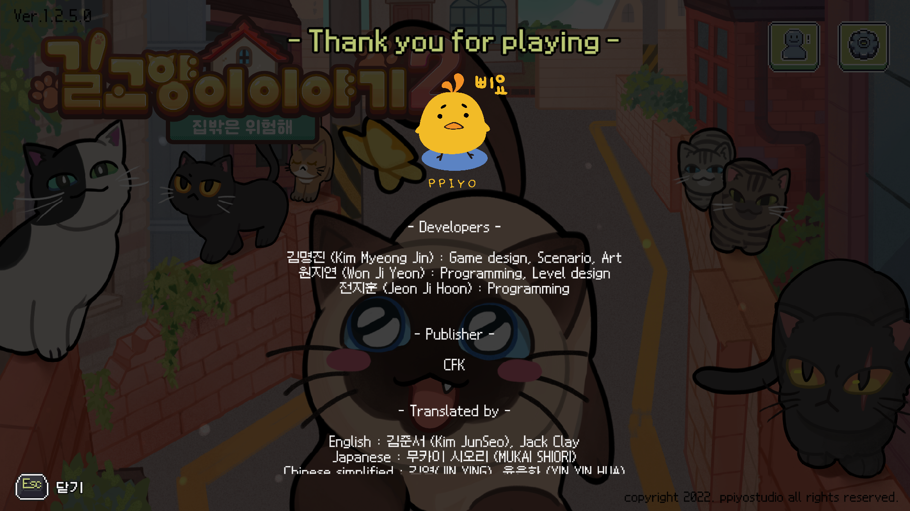
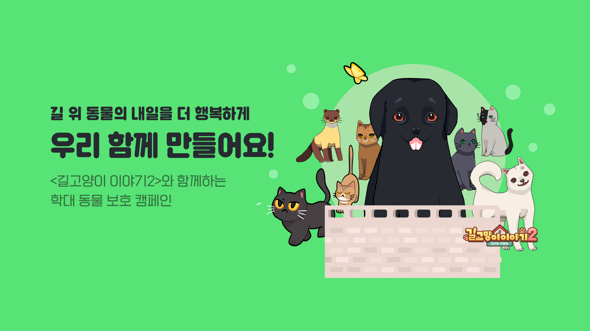
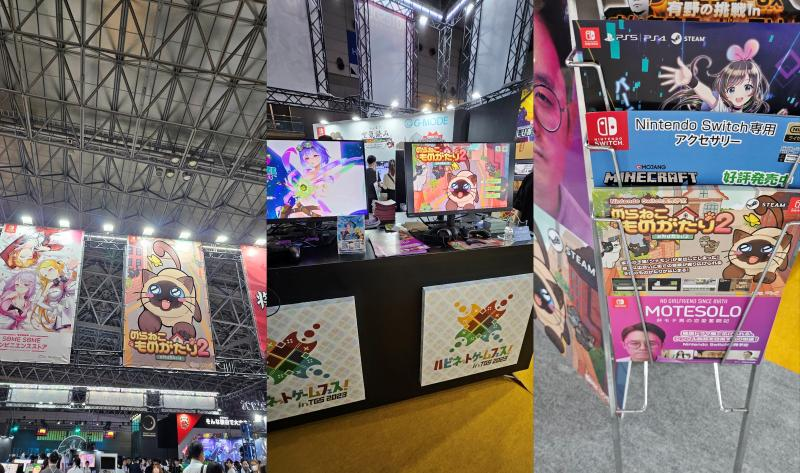
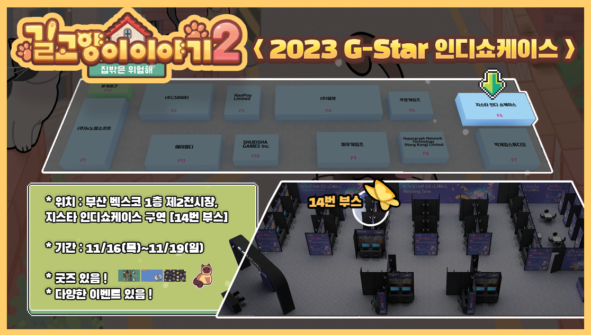
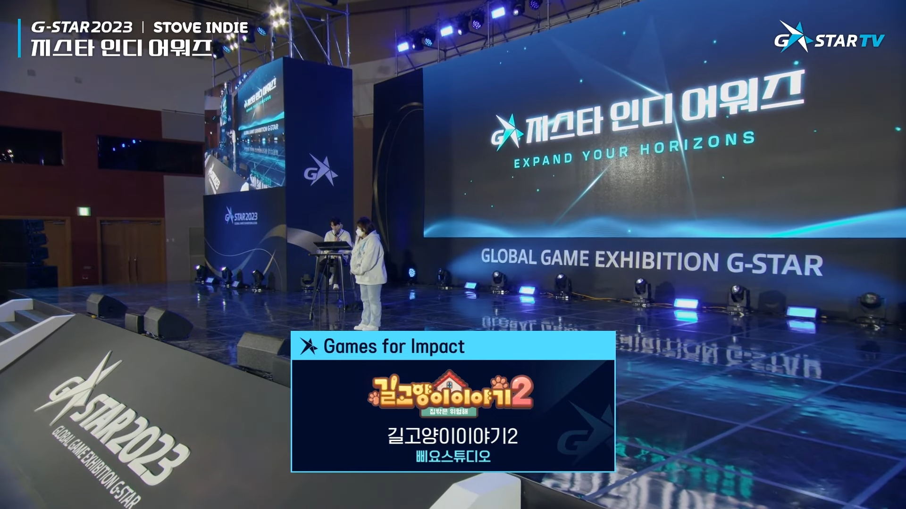

| 항목 | 내용 |
| --- | --- |
| 기간 | 2021.10 - 2023.12 |
| 소속 | 삐요 스튜디오 |
| 역할 | 클라이언트 프로그래머 |
| 기술 | Unity, C#, DevOps |

<iframe class="video-embed" src="https://www.youtube.com/embed/CkWISiLW1p0" title="길고양이 이야기 2 영상 1" loading="lazy" allow="accelerometer; autoplay; clipboard-write; encrypted-media; gyroscope; picture-in-picture; web-share" referrerpolicy="strict-origin-when-cross-origin" allowfullscreen></iframe>

### 텀블벅 펀딩 목표 금액 초과 달성 (**7,846,024 원, 156%)**

[텀블벅 펀딩](https://www.tumblbug.com/astreetcatstale2)

### 스토브 인디 얼리억세스 출시 (2023.02.20)

[스토브 인디 상점](https://store.onstove.com/ko/games/1654/)

### 학대 동물 보호 캠페인 참가 (2023.02.20)

[학대 동물 보호 캠페인](https://www.smilegatefoundation.org/hope/giveDetail?seq=680)

### 스팀 윈도우/맥 정식출시 (2023.06.02)

[Steam 상점](https://store.steampowered.com/app/2356450/__2/)

### 도쿄 게임쇼 참가 (2023.09.21 - 2023.09.24)

### G-Star 2023 인디 쇼케이스 전시 및 인디 어워즈 수상 (2023.11.16 - 2023.11.19)

<iframe class="video-embed" src="https://www.youtube.com/embed/loIGaQyzFPc" title="길고양이 이야기 2 영상 2" loading="lazy" allow="accelerometer; autoplay; clipboard-write; encrypted-media; gyroscope; picture-in-picture; web-share" referrerpolicy="strict-origin-when-cross-origin" allowfullscreen></iframe>

- Unity엔진과 C#을 2D 퍼즐 어드벤처 '길고양이 이야기 2' 개발
- Synology NAS에 GitLab 레포지토리 서버 구축
- 게임 주요 시스템 구현 (세이브로드, 퀘스트, 대화, 이동, 컷씬 등)
- 주요 컨트롤러(플레이스테이션, 닌텐도 스위치, 엑스박스) 입력 대응
- 스팀 윈도우/맥, 스토브 플랫폼 출시
- SteamWroks SDK를 활용하여 업적 시스템 구현
- StoveSDK를 활용하여 구매 인증 구현
- G-Star 2023 인디 쇼케이스 전시 및 인디 어워즈 수상
