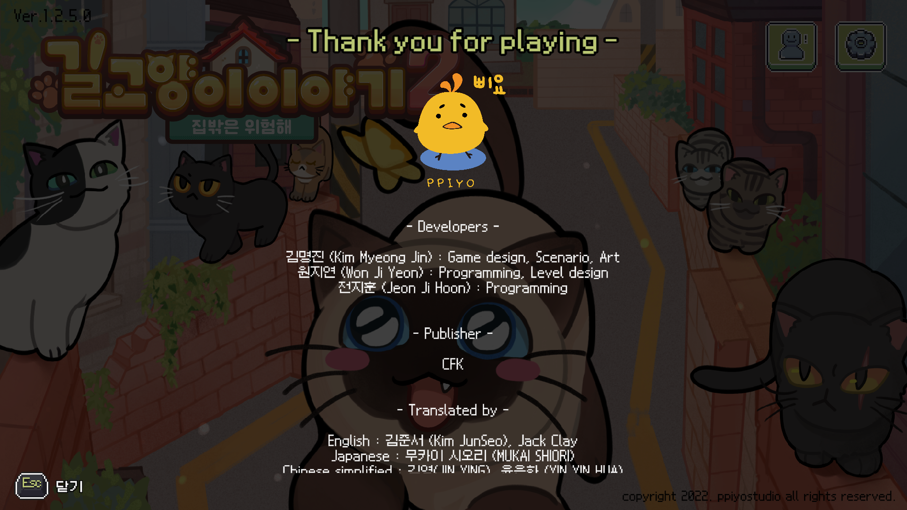
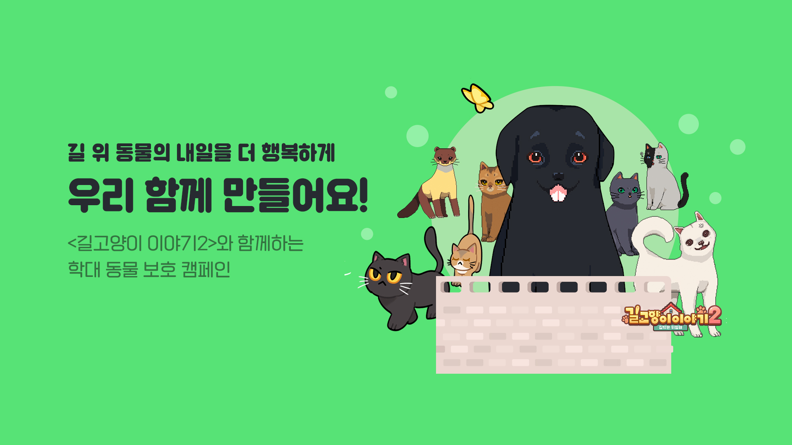
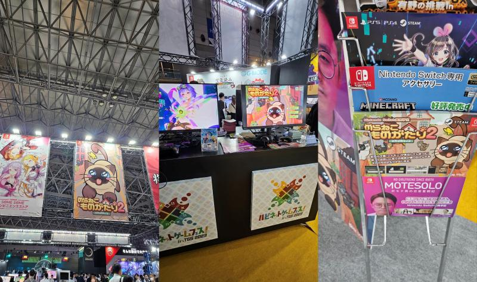
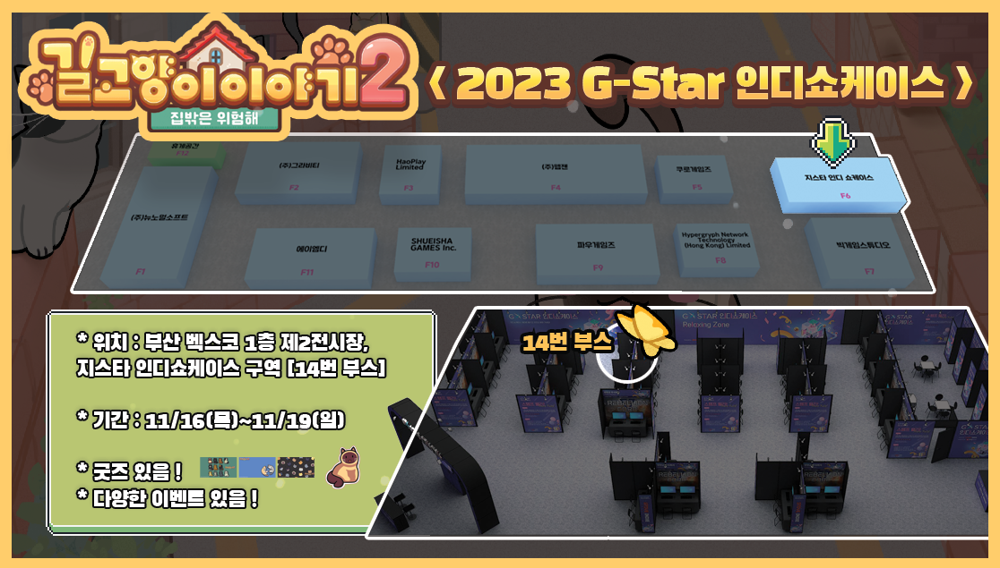

| 항목 | 내용 |
| --- | --- |
| 기간 | 2021.10 - 2023.12 |
| 소속 | 삐요 스튜디오 |
| 참여 형태 | 비고용 팀 활동, 정규직과 병행 |
| 역할 | 클라이언트 프로그래머 |
| 기술 | Unity, C#, Steamworks, STOVE SDK, GitLab |

<iframe class="video-embed" src="https://www.youtube.com/embed/CkWISiLW1p0" title="길고양이 이야기 2 영상 1" loading="lazy" allow="accelerometer; autoplay; clipboard-write; encrypted-media; gyroscope; picture-in-picture; web-share" referrerpolicy="strict-origin-when-cross-origin" allowfullscreen></iframe>

## 프로젝트와 담당 역할

길고양이 이야기 2는 삐요 스튜디오가 Unity와 C#으로 개발한 2D 퍼즐 어드벤처다. 길고양이의 시점으로 마을을 탐험하며 퍼즐을 풀고 이야기를 진행한다. 정규직과 병행하는 비고용 팀 활동으로 2021년 10월부터 2023년 12월까지 클라이언트 개발에 참여했고, 2023년 PC 출시와 전시까지 함께했다.

## 담당 업무

- 세이브와 로드, 퀘스트, 대화, 이동, 컷신, 환경설정과 UI 등 주요 게임 시스템 구현
- PlayStation, Nintendo Switch, Xbox 컨트롤러 입력 대응
- Steamworks SDK 업적 시스템과 STOVE SDK 구매 인증 구현
- STOVE와 Steam 스토어 등록부터 다국어 빌드 준비, 출시 빌드 검수와 업로드까지 Windows, macOS 출시 작업 전담
- Synology NAS에 GitLab 저장소 서버 구축

## 출시와 전시 기록

### 텀블벅 펀딩 목표 초과 달성 (7,846,024원, 156%)

[텀블벅 펀딩](https://www.tumblbug.com/astreetcatstale2)

### 스토브 인디 얼리 액세스 출시 (2023.02.20)

[스토브 인디 상점](https://store.onstove.com/ko/games/1654/)

### 학대 동물 보호 캠페인 참가 (2023.02.20)

[학대 동물 보호 캠페인](https://www.smilegatefoundation.org/hope/giveDetail?seq=680)

### Steam Windows, macOS 정식 출시 (2023.06.02)

[Steam 상점](https://store.steampowered.com/app/2356450/__2/)

### 도쿄 게임쇼 2023 참가 (2023.09.21 - 2023.09.24)

### G-STAR 2023 인디 쇼케이스 전시와 Indie Awards 수상 (2023.11.16 - 2023.11.19)

G-STAR 2023 인디 쇼케이스에 전시했고, 스토브인디가 주최한 지스타 인디 어워즈에서 Games for Impact 부문을 수상했다.

<iframe class="video-embed" src="https://www.youtube.com/embed/loIGaQyzFPc" title="길고양이 이야기 2 영상 2" loading="lazy" allow="accelerometer; autoplay; clipboard-write; encrypted-media; gyroscope; picture-in-picture; web-share" referrerpolicy="strict-origin-when-cross-origin" allowfullscreen></iframe>
