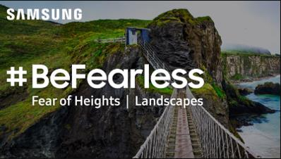
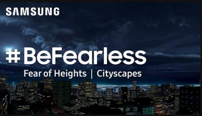

| 항목 | 내용 |
| --- | --- |
| 기간 | 2016.06 - 2016.12 |
| 소속 | 클릭트 |
| 역할 | 클라이언트 프로그래머 |
| 기술 | Unity, C#, Oculus |

<iframe class="video-embed" src="https://www.youtube.com/embed/NxXbrohI-l4" title="#BeFearless - Fear of Heights 영상 1" loading="lazy" allow="accelerometer; autoplay; clipboard-write; encrypted-media; gyroscope; picture-in-picture; web-share" referrerpolicy="strict-origin-when-cross-origin" allowfullscreen></iframe>

<iframe class="video-embed" src="https://www.youtube.com/embed/mGcAiwGojbs" title="#BeFearless - Fear of Heights 영상 2" loading="lazy" allow="accelerometer; autoplay; clipboard-write; encrypted-media; gyroscope; picture-in-picture; web-share" referrerpolicy="strict-origin-when-cross-origin" allowfullscreen></iframe>

- 삼성의 외주로 #BeFearless 켐페인을 위해 제작한 고소공포증 치료 VR 어플리케이션
- Landscapses / Citiscapes 두 가지의 빌드로 제작
- 삼성의 스마트워치 기어 S2를 연동하여 심박수 데이터를 전송
- 다국어 지원을 위한 시스템 개발
- GearVR과 Oculus Go 지원
- Oculus Store에 어플리케이션 등록 (Landscapes, Cityscapes)
