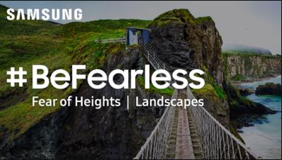
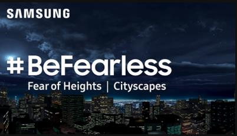

| 항목 | 내용 |
| --- | --- |
| 기간 | 2016.07 - 2016.12 |
| 소속 | 클릭트 |
| 역할 | 클라이언트 프로그래머 |
| 기술 | Unity, C#, Gear VR, Oculus Go, Gear S2 |

<iframe class="video-embed" src="https://www.youtube.com/embed/NxXbrohI-l4" title="#BeFearless - Fear of Heights 영상 1" loading="lazy" allow="accelerometer; autoplay; clipboard-write; encrypted-media; gyroscope; picture-in-picture; web-share" referrerpolicy="strict-origin-when-cross-origin" allowfullscreen></iframe>

<iframe class="video-embed" src="https://www.youtube.com/embed/mGcAiwGojbs" title="#BeFearless - Fear of Heights 영상 2" loading="lazy" allow="accelerometer; autoplay; clipboard-write; encrypted-media; gyroscope; picture-in-picture; web-share" referrerpolicy="strict-origin-when-cross-origin" allowfullscreen></iframe>

## 프로젝트와 담당 역할

삼성의 #BeFearless 캠페인을 위해 클릭트가 외주로 제작한 고소공포증 훈련 VR 앱이다. 자연 풍경을 다룬 Landscapes와 도시 풍경을 다룬 Cityscapes 두 빌드로 구성했고, Gear VR과 Oculus Go를 지원해 Oculus Store에 두 앱을 등록했다.

## 담당 업무

- 삼성 스마트워치 Gear S2와 연동해 심박수 데이터를 앱으로 전송
- 다국어 지원 시스템 개발
- Gear VR과 Oculus Go 대응 및 Oculus Store 등록 지원
