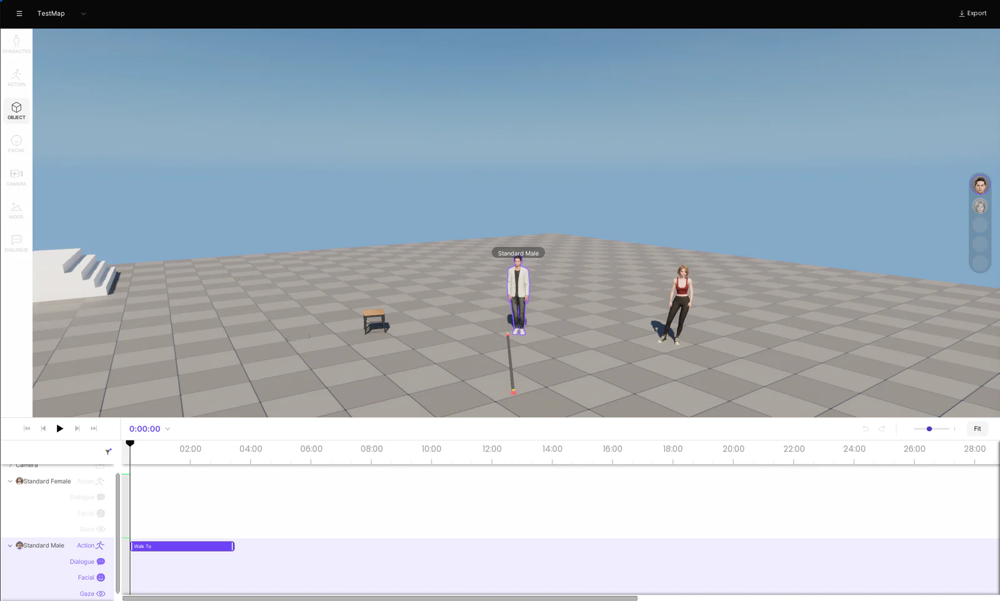
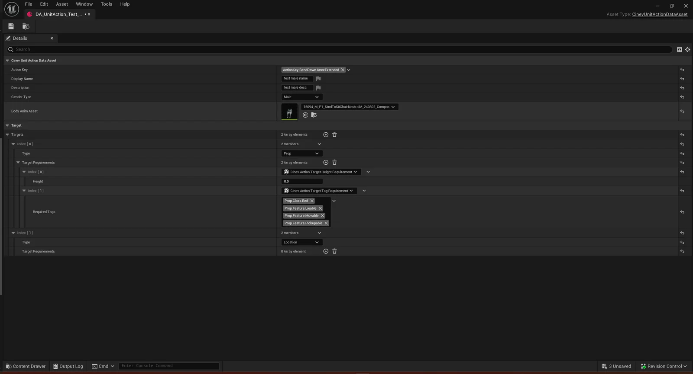
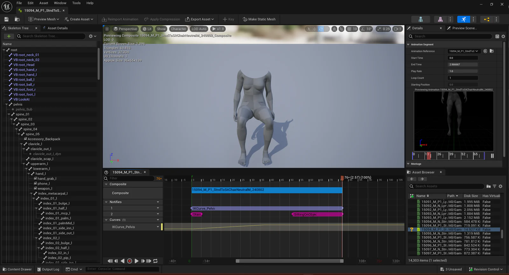

## 프로젝트와 담당 역할

**CINEV**는 사용자가 입력한 이야기를 바탕으로 캐릭터·배경·행동·대사·카메라를 구성하는 AI 애니메이션 제작 서비스다. **이야기 입력 → AI 장면 구성 → Studio 편집 → 영상 출력**으로 이어진다.

**CINEVStudio**는 이 흐름에서 3D 장면 제작과 연출을 담당하는 **Unreal Engine 5** 기반 도구다. 사용자는 AI가 구성한 장면에서 캐릭터의 배치·행동·표정·대사·립싱크, 소품과의 상호작용, 카메라와 타임라인을 조정하고 편집한 장면을 영상으로 출력한다.

콘텐츠팀은 Studio에서 사용할 액션의 조건과 이벤트를 Unreal Editor의 에셋으로 작성한다. 사용자가 Studio에서 그 데이터를 바탕으로 장면을 편집하는 작업과는 구분된다. 나는 데이터 작성 도구와 작성한 데이터를 실행·편집하는 경로를 함께 다뤘다.

### 참여 기간과 대표 기여

시나몬에서 **2024년 6월부터 2026년 4월까지 클라이언트 프로그래머**로 참여했다. 액션 데이터 입력 구조와 AI 결과의 해석·적용, 편집 UI와 공통 서비스, Shot 상태 모델을 개발했다.

- **액션 조건을 타입별 입력 구조로 전환했다.** 사람이 문서와 대조하며 맞추던 조건·이벤트 관계를 에셋 구조에 반영하고, 필요한 조건만 추가해 값을 입력하도록 했다.
- **AI 생성 모션을 선택·편집·저장까지 연결했다.** 비동기 생성 결과를 현재 장면에 적용하고, 편집 명령과 프로젝트 저장·복원 경로에 통합했다.
- **샷 초기 상태의 소유권과 복원 경로를 정리했다.** 독립 Shot 모델이 초기 상태를 관리하게 하고, 실행 중 객체 참조와 저장용 식별자를 연결했다.

### 제품 화면과 실제 제작 사례

<iframe class="video-embed" src="https://www.youtube.com/embed/8Pq8nM0Rm-w" title="CINEV Build Storyboard 튜토리얼" loading="lazy" allow="accelerometer; autoplay; clipboard-write; encrypted-media; gyroscope; picture-in-picture; web-share" referrerpolicy="strict-origin-when-cross-origin" allowfullscreen></iframe>

*장면 편집과 영상 제작 흐름을 보여주는 제품 튜토리얼.*



*중앙 뷰포트에서 장면을 확인하고 하단 타임라인에서 편집한다. 화면과 콘텐츠는 팀의 결과물이다.*

<iframe class="video-embed" src="https://www.youtube.com/embed/NQJT8oN7NGg" title="CINEV Studio를 활용한 무조건 이혼한다 애니메이션 제작 과정" loading="lazy" allow="accelerometer; autoplay; clipboard-write; encrypted-media; gyroscope; picture-in-picture; web-share" referrerpolicy="strict-origin-when-cross-origin" allowfullscreen></iframe>

*CINEVStudio로 [『무조건 이혼한다』](https://m.comic.naver.com/webtoon/list?titleId=842623)를 애니메이션화하는 과정. [완성 영상 · 네이버 컷츠 1화](https://comic.naver.com/cuts/embed?id=KW-cuts:0-cuts_6502-1).*

### 담당 업무와 활용 기술

| 담당 영역 | 주요 변경 | 활용한 기술 |
|---|---|---|
| [액션 데이터 입력](#data-authoring) | 타입별 조건과 이벤트 설정을 계층적으로 작성 | `DataAsset`, Instanced Struct·`UObject`, `AnimComposite` |
| [AI 행동 해석](#action-interpreter) | 외부 행동 지시를 월드 문맥과 실행 가능한 액션으로 변환 | `Actor`·`Component`, `GameplayTag`, `Executor` |
| [AI 모션 연동](#motion-integration) | 비동기 생성 결과를 타임라인 편집·저장에 통합 | HTTP/JSON, `Delegate`, 약한 `UObject` 참조 |
| [Shot 모델](#shot-model) | 샷 상태의 소유권과 저장·복원 경로 재구성 | `UObject`, `TWeakObjectPtr`, `FGuid`, `FFrameNumber` |
| [UI 상태 관리](#ui-state) | 화면 구성·선택·입력 처리를 편집 상태별로 분리 | `UUserWidget`, `LayoutSpec`, 자체 `Blackboard` |
| [Subsystem](#subsystems) | 공통 서비스의 수명과 메시지 구독 계약 정리 | `UGameInstanceSubsystem`, `GameplayTag`, 리스너 핸들 |

아래 코드는 프로젝트에서 적용한 설계를 중심으로 이름과 구조를 일반화했다. 핵심을 보여주기 위해 주변 구현은 생략했다.

<a id="data-authoring"></a>

## 1. DataTable 중심 입력을 계층형 액션 에셋으로 전환

액션 하나에는 재생할 애니메이션과 구간, 대상 조건, 상호작용 시점이 함께 필요했다. 기존 `DataTable`에서는 애니메이션 ID와 시작·끝 프레임을 입력하고, `Notify`와 테이블의 상호작용 설정을 타입·인덱스로 맞췄다. 문자열 배열인 Context Params에 넣을 값은 별도 소품 설계 문서와 대조해야 했다.

개편의 목표는 콘텐츠 제작자가 기억하고 맞춰야 했던 관계를 입력 구조에 반영하는 것이었다. 모든 조건을 펼쳐 두고 사용 여부를 지정하던 방식에서, 액션에 필요한 조건만 추가하는 방식으로 바꿨다.

### 조건 데이터와 동작 설정에 다른 표현 사용

액션 정의는 `UDataAsset`으로 분리하고 대상별 요구조건은 `TInstancedStruct` 배열로 구성했다. 서로 다른 조건 타입을 한 목록에 조합하면서 각 타입에 필요한 필드를 편집하도록 했다.

`Notify`와 `NotifyState`에는 Instanced `UObject`인 `Modifier`를 두었다. `DefaultToInstanced`·`EditInlineNew`와 `UPROPERTY(Instanced)`를 사용해 이벤트의 시점과 동작별 설정을 같은 위치에서 편집하게 했다. 조건 값의 조합에는 Struct를, 객체별 동작 확장에는 `UObject`를 사용했다.

<details>
<summary>조건 데이터의 조합과 이벤트 객체의 소유 구조</summary>

```cpp nocollapse wrap title="계층형 입력 구조의 핵심 선언"
USTRUCT()
struct FTargetRequirement
{
    GENERATED_BODY()
};

USTRUCT()
struct FDistanceRequirement : public FTargetRequirement
{
    GENERATED_BODY()

    UPROPERTY(EditAnywhere, meta = (ClampMin = "0"))
    float MaxDistance = 100.f;
};

UCLASS()
class UActionDefinition : public UDataAsset
{
    GENERATED_BODY()
public:
    UPROPERTY(EditAnywhere, meta = (ExcludeBaseStruct))
    TArray<TInstancedStruct<FTargetRequirement>> Requirements;
};

UCLASS(Abstract, EditInlineNew, DefaultToInstanced)
class UActionModifier : public UObject
{
    GENERATED_BODY()
};

UCLASS()
class UActionEvent : public UAnimNotify
{
    GENERATED_BODY()
public:
    UPROPERTY(EditAnywhere, Instanced)
    TObjectPtr<UActionModifier> Modifier;
};
```

조건 배열에는 거리·자세 등 필요한 Struct 타입을 추가한다. 이벤트에는 구체적인 `UActionModifier` 파생 객체를 인라인으로 생성해 설정한다. 조건 목록과 이벤트 객체는 각각 필요한 위치에서 소유한다.

</details>



*액션 → 대상 → 요구조건으로 이어지는 입력 구조. 화면의 프로토타입은 `UObject` 기반 조건이며, 이후 구현에서는 `TInstancedStruct`를 사용했다.*

### 작성한 데이터를 실행용 에셋으로 통합

애니메이션 구간과 `Notify`·Curve는 `AnimComposite`에서 편집하게 했다. 원본 `AnimSequence`는 공유하고 액션별 구간과 이벤트는 Composite에 두어, 공유 원본을 수정하지 않고 액션별 설정을 작성하도록 했다.



*테이블에 프레임 값을 따로 기입하던 작업을 애니메이션을 보며 편집하는 위치로 옮겼다.*

| 작성 목적 | 데이터 구조 |
|---|---|
| 액션별 대상·조건 조합 | `DataAsset` + Instanced Struct |
| 이벤트의 동작 설정 | `Notify` + Instanced `UObject` `Modifier` |
| 구간·`Notify`·Curve 편집 | `AnimComposite` |
| 메타데이터 일괄 편집 | `DataTable` 유지 |

이렇게 작성한 데이터를 Generated Data Asset으로 모아 실행 경로에 연결했다. 애니메이션 메타데이터와 이벤트 시각·길이·`Modifier`를 생성 단계에서 정리해 런타임이 해당 정보를 읽기 위해 애니메이션 에셋에 접근하던 부분을 분리했다.


[액션 데이터 도식 원본 확대](/diagrams/cinev-studio/authoring.svg)

*작성 목적에 맞춰 데이터를 나누고 생성 단계에서 실행용 정보로 모은다.*

데이터 타입과 실행 경로 전환, 변환기 구현을 담당하고 전환 절차를 문서화했다. 동료와 도구 작업을 분담했으며 후속 콘텐츠팀 제작 가이드에도 에셋 작성과 생성 데이터 구축 절차가 반영됐다. 필요한 조건만 조합하고 타입별 필드로 값을 입력하는 흐름을 만들었고 소품별 값과 컴포넌트 선택에 필요한 문서 참조는 유지했다.

`Unit Action Data Validator`를 개발해 액션 데이터 검증을 수행하고 더 이상 사용하지 않는 로직과 데이터 구조를 조사해 제거했다. FBX 로우 데이터에서 `Root Motion Start Transform`을 자동 추출하는 프로세스도 구현해 수동으로 입력하던 정보를 가져오도록 했다.

<a id="action-interpreter"></a>

## 2. AI 결과를 해석하고 편집 가능한 장면으로 연결

### AI 행동 지시의 해석·실행 계층

외부 AI 서비스가 행동명과 대상을 지정해도 클라이언트에서는 현재 장면에서 실행 가능한 액션을 판단해야 했다. 같은 지시라도 캐릭터의 자세, 소품과 컴포넌트, 점유 상태와 프레임 문맥에 따라 후보가 달라졌다.

팀의 **S2M(Story-to-Movie)** 파이프라인에서 액션 해석·실행 계층의 설계와 구현, 파싱 구조 개선을 담당했다. S2M에 결합된 `MetaAction` 처리를 분리하고, 액션 문맥과 `Executor`를 중심으로 처리 단계를 정리했다.

서비스의 대상 참조를 실제 `Actor`·`Component` 문맥으로 채우고 `GameplayTag`로 식별한 행동과 액션별 요구조건을 현재 월드 상태와 대조했다. 자세·대상·점유 상태와 `NavMesh` 경로를 종합 평가하는 `Strategy`/`Functor` 기반 선택 파이프라인을 구현했다. 후보를 걸러내는 조건 검사와 점수 평가를 `Functor` 단위로 나눈 뒤, 선택한 액션을 `Executor`와 시퀀스 생성에 연결했다.


[AI 행동 해석 도식 원본 확대](/diagrams/cinev-studio/interpreter.svg)

*행동 지시를 파싱한 뒤 대상 문맥 구성, 후보 평가, 실행으로 이어지는 처리 흐름.*

#### 평가 경로 통합과 판단 과정 추적

액션 시작 위치 검증과 경로 길이 스코어링을 단일 파이프라인으로 통합해 중복 순회를 제거했다. 후보 탈락 사유와 점수 기여도를 추적하는 디버깅 기능도 구축했다. 후보가 조건 검사에서 제외됐는지, 점수 평가에서 어떤 항목이 영향을 줬는지를 확인할 수 있도록 했다.

<details>
<summary>시작 위치 검증과 경로 점수 평가</summary>

```cpp nocollapse wrap title="후보별 검증 결과와 경로 평가"
TMap<FName, float> PathLengths;
TMap<FName, FString> Rejected;

for (const FActionCandidate& Candidate : Candidates)
{
    const FStartValidation Start = ValidateStart(Candidate, Context);
    if (!Start.bValid)
    {
        Rejected.Add(Candidate.Id, Start.Reason);
        continue;
    }

    // 검증으로 확정한 위치를 그대로 사용한다.
    const TOptional<float> Length =
        FindPathLength(Context.ActorLocation, Start.Location);
    if (!Length.IsSet())
    {
        Rejected.Add(Candidate.Id, TEXT("No reachable path"));
        continue;
    }

    PathLengths.Add(Candidate.Id, Length.GetValue());
}

// 점수 계산에는 저장한 길이를 사용한다. 경로를 다시 탐색하지 않는다.
const TMap<FName, float> Scores = NormalizePathScores(PathLengths);
Trace.Record(TEXT("PathLength"), Scores, Rejected);
```

`ValidateStart`·`FindPathLength`·`Trace`는 평가 흐름을 보여주기 위한 자체 함수와 기록기다. 점수 정규화와 자세별 예외 처리는 생략했다. 핵심은 검증과 평가가 같은 시작 위치를 사용하고, 탈락 사유도 결과로 남기는 데 있다.

</details>

샷 JSON 파서도 초기 상태·카메라·블록·섹션 단위로 나누고 타입 검사와 `TOptional` 반환을 도입했다. 외부 입력을 읽는 처리와 월드 상태를 판단하는 처리의 책임을 구분해 조건 평가와 실행 로직을 개별적으로 확장할 수 있도록 했다.

<a id="motion-integration"></a>

### AI 모션 생성 결과를 편집기에 통합

**T2M(Text-to-Motion)** 요청은 비동기로 완료되고 여러 요청 중 일부만 성공할 수 있었다. 응답의 본 데이터는 프로젝트의 스켈레톤 표현으로 변환해야 했고 요청이 끝나기 전에 화면이나 프로젝트가 바뀌는 경우도 다뤄야 했다.

#### 생성 요청과 런타임 애니메이션 변환

HTTP/JSON API를 연동하고 생성 요청을 성별과 설정 가능한 배치 크기로 나눠 처리했다. 일부 요청이 실패해도 성공한 결과는 보존했다. 반환된 ONNX 본 구조를 프로젝트의 스켈레톤 표현으로 변환하고 `Root Motion`을 보정해 런타임 애니메이션에 적용했다. S2M 입력의 비동기 씬 구성까지 이어지는 처리도 구현했다.

생성 상태와 결과 목록을 관리하는 계층을 구성하고 약한 `UObject` 참조 기반 콜백과 `Delegate`로 결과를 편집기에 전달했다. 결과 조회 API와 선택 UI를 연결해 사용자가 생성된 모션을 고르고 타임라인에 적용하게 했다.


[AI 모션 연동 도식 원본 확대](/diagrams/cinev-studio/motion.svg)

*성공한 결과의 변환·적용과 실패 처리를 나누고 편집 흐름에 연결한다.*

<details>
<summary>비동기 응답의 수명 관리와 부분 성공 처리</summary>

```cpp nocollapse wrap title="생성 결과를 편집 상태에 전달하는 콜백"
const TWeakObjectPtr<UMotionWorkspace> WeakOwner(this);

Client.GenerateBatch(Requests,
    [WeakOwner](FMotionBatchResult Result)
    {
        // 전송 계층의 콜백 스레드와 UObject 접근을 분리한다.
        AsyncTask(ENamedThreads::GameThread,
            [WeakOwner, Result = MoveTemp(Result)]() mutable
            {
                UMotionWorkspace* Owner = WeakOwner.Get();
                if (!Owner)
                {
                    return;
                }

                for (FMotionResponse& Item : Result.Items)
                {
                    if (Item.bSucceeded)
                    {
                        Owner->GeneratedMotions.Add(MoveTemp(Item.Motion));
                    }
                    else
                    {
                        Owner->GenerationErrors.Add(MoveTemp(Item.Error));
                    }
                }
                Owner->OnResultsChanged.Broadcast();
            });
    });
```

`Client`와 응답 타입은 일반화한 전송 계층이며 응답에는 값 데이터만 담는 것으로 표현했다. 성공 결과와 오류를 각각 누적하고, 살아 있는 편집 객체에만 변경을 알리는 부분이다. 본 변환과 저장 로직은 별도 단계에서 처리한다.

</details>

#### 생성 결과를 선택·편집·저장하는 흐름

`MotionSet` 데이터 모델과 프로젝트 저장·복원 기능을 구축했다. `ViewModel` 기반 `Prompt Workspace`, `Asset Picker`, `SidePanel` UI를 구현해 모션 생성부터 결과 선택과 편집까지 연결했다.

결과 저장과 Undo/Redo는 프로젝트의 편집 명령 스택에 통합했다. 생성 모션도 다른 편집 작업처럼 적용을 취소하고 다시 적용할 수 있게 했다. API 응답을 받는 것부터 사용자가 선택·편집·저장하는 과정까지 담당했다.

사용 흐름으로 보면, 생성 결과 목록에서 모션을 고른 뒤 타임라인에 적용하고 필요하면 Undo/Redo로 적용을 취소하거나 다시 적용한다. 선택·편집한 결과는 프로젝트의 `MotionSet` 저장·복원 경로로 이어진다. 원격 응답을 받는 기능을 편집기의 작업 단위와 데이터 모델에 연결한 것이다.

<a id="shot-model"></a>

## 3. Shot 상태 모델과 저장·복원 구조 개편

샷의 초기 상태가 샷 객체와 타임라인 섹션에 나뉘어 있으면 검색·동기화·저장 복원이 복잡해진다. 타임라인의 표시 방식과 별개로 초기 Transform·Visibility·자세·참조 상태를 관리할 주체가 필요했다.

`ShotManager`와 독립 샷 모델을 도입하고 초기 상태의 저장과 조회를 재구성했다. 팀과 진행한 구조 전환에서 샷 관리, 상태 저장·조회, 프레임 문맥과 재계산 흐름을 담당했다.

실행 중 객체 참조는 `TWeakObjectPtr`로 유지하고 저장할 때는 `FGuid`로 기록해 로드 시 객체 참조로 복원했다. `UObject`로 관리하는 샷 모델과 `MovieScene`/`Sequencer`의 타임라인 표현 사이에서 책임을 나눈 것이다.


[Shot 모델 도식 원본 확대](/diagrams/cinev-studio/shot.svg)

*샷 모델이 초기 상태를 관리하고 런타임 참조와 저장용 식별자를 연결한다.*

`FFrameNumber` 기반 프레임 문맥과 범위별 링크 재계산을 샷 단위로 연결하고 기존 저장 데이터를 읽기 위한 이관 작업도 진행했다. 샷 초기 상태를 관리하는 주체와 참조의 복원 경로를 정리하면서 기존 프로젝트를 새 상태 모델에 연결했다.

### 섹션 사이의 빈 구간과 샷 경계 처리

`MovieScene`/`Sequencer`를 확장해 애니메이션·`Transform`·`Property`·`Attach` 섹션 사이의 빈 구간을 자동 구성했다. Shot 경계와 P2P 전환에서 캐릭터와 Prop의 상태가 이어지도록 처리했다. 샷 모델이 관리하는 초기 상태와 함께, 타임라인의 구간 사이에서 이어져야 할 상태도 다뤘다.

편집 중에는 섹션이 없는 구간과 샷 경계에서 이어질 캐릭터·Prop 상태를 처리하고, 프로젝트를 다시 열 때는 저장한 `FGuid`를 객체 참조로 복원한다. 구간 사이의 재생 상태와 저장 후 참조 복원을 각각 담당하는 경로를 구분했다.

### 복합 편집 작업과 재계산 시점 관리

타임라인 편집에는 GUID 기반 객체 추적과 `Command` 패턴을 적용해 여러 변경을 하나의 Undo/Redo 단위로 묶고, 중간 상태에서 불필요한 Link 재계산이 발생하지 않도록 했다. 타임라인 공통 편집 경로에서 객체 추적과 갱신 시점을 함께 관리했다.

<details>
<summary>복합 편집의 Undo와 갱신 시점 제어</summary>

```cpp nocollapse wrap title="복합 명령의 Undo와 갱신 범위"
bool FCompoundEdit::Undo()
{
    bool bSucceeded = true;
    for (int32 Index = Commands.Num() - 1; Index >= 0; --Index)
    {
        // 하나가 실패해도 나머지 명령의 Undo는 수행한다.
        const bool bUndone = Commands[Index]->Undo();
        bSucceeded = bUndone && bSucceeded;
    }
    return bSucceeded;
}

bool UndoAndRefresh(FCompoundEdit& Edit, FTimelineModel& Timeline)
{
    bool bSucceeded;
    {
        // 스코프 종료 시 이전 억제 상태를 복원한다.
        TGuardValue<bool> Guard(Timeline.bSuppressLinkInvalidation, true);
        bSucceeded = Edit.Undo();
    }

    if (!Timeline.bSuppressLinkInvalidation)
    {
        Timeline.RebuildAffectedLinks();
    }
    return bSucceeded;
}
```

`FCompoundEdit`와 `FTimelineModel`은 명령 묶음과 갱신 제어를 축약한 타입이다. 게임 스레드에서 수행하며, 각 명령이 기록한 영향 범위를 마지막에 재계산하는 것으로 표현했다. Undo를 역순으로 수행하는 것과 중간 갱신을 억제하는 것은 별개의 책임이다. 실패 시 자동 롤백까지 수행하는 트랜잭션을 의미하지는 않는다.

</details>

## 편집기를 지탱하는 UI와 공통 서비스

<a id="ui-state"></a>

### UI 상태별로 화면·선택·입력 처리 분리

일반 상태에서 뷰포트를 클릭하면 캐릭터를 선택하지만, 액션 타깃 지정 중에는 상호작용 대상을 선택해야 한다. 팀이 **CommonUI**의 레이어·스택 접근을 참고해 만든 `UUserWidget` 기반 UI 위에서, 나는 UI Controller와 편집 State로 화면 구성과 상태 전환 책임을 나눴다.

`LayoutSpec`과 `GameplayTag` 기반 위젯 Registry로 화면을 구성하고, 이전 State의 `Exit()` 뒤에 새 State의 `Enter()`를 호출해 레이아웃·선택 모드·입력 전략을 설정했다. 기존 동작을 유지하며 상태별 처리를 옮겼고, 새 편집 기능도 큰 위젯의 분기 대신 상태 단위로 추가하도록 했다.

선택은 `SelectionManager`, UI 공유 상태는 자체 `Blackboard`의 변경 알림으로 관리했다. `Common Button`·`Common Modal`·`Common Context Menu`도 공통 모듈로 개발했다. 화면 구성과 입력 동작의 처리 위치를 나누는 작업과 재사용할 UI 컴포넌트를 만드는 작업을 함께 맡았다.

<details>
<summary>UI 상태 전환 도식</summary>


[UI 도식 원본 확대](/diagrams/cinev-studio/ui.svg)

</details>

<a id="subsystems"></a>

### Subsystem과 구독자의 수명 구분

저장·로드 요청과 샷 변경 이벤트를 전달하기 위해 `UGameInstanceSubsystem` 기반 메시지 서비스를 도입했다. `GameplayTag` 채널과 구조체 payload로 연결하고 런타임 타입 검사, 약한 `UObject` 참조, 해제용 리스너 핸들을 제공했다.

서비스보다 UI Controller가 먼저 사라질 수 있으므로 초기화·종료에 구독 등록·해제를 맞췄다. 재초기화 전에도 기존 핸들을 해제해 중복 구독을 막았다. 저장·로드 요청과 샷 이벤트를 이관하고 토스트는 별도 `GameInstance` 서비스로 분리했다. `GameInstance`의 공통 서비스, `LocalPlayer`의 UI, `World`의 디버그 도구처럼 기능이 필요한 수명 범위에 맞춰 Subsystem을 활용했다.

<details>
<summary>메시지 전달과 구독 수명 도식</summary>


[Subsystem 도식 원본 확대](/diagrams/cinev-studio/subsystems.svg)

</details>

## 개발 환경과 협업

### 빌드·패키징과 오류 추적

**GitLab Runner** 기반 Unreal Engine 빌드·패키징 환경을 구축·운영했다. Artifact와 DDC 관리, **Symbol Store**·**Sentry** 연동, Slack 알림을 구성하고 `UnrealBuildTool` 실행을 최적화했다. 개발 빌드 아티팩트와 다운로드 안내를 제공해 기획·QA가 빌드를 직접 받아 검증할 수 있도록 했다.

Unreal Engine 5.3 → 5.7 마이그레이션에서는 API 변경과 서드파티 플러그인 호환성 문제를 해결했다. Shared DDC와 크래시 로그 수집·분석 환경을 구성하고 엔진 전환에 필요한 대응도 진행했다.

### 개발 도구 활용과 협업

기획·애니메이션·TA·QA와 데이터 규칙과 전환 절차를 공유했다. **JetBrains Rider** 사용을 지속적으로 권장해 팀 대부분이 Visual Studio에서 Rider로 전환했고 AI 보조 개발 도구의 활용 경험과 작업 방식을 팀에 공유했다. 연말 타운홀에서는 ‘GitLab 개발왕’으로 선정됐다.
