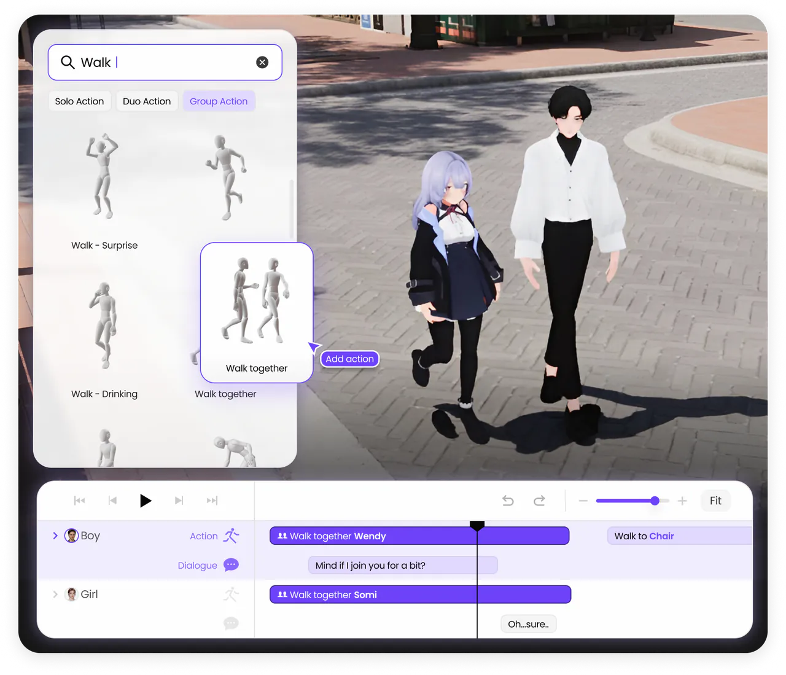
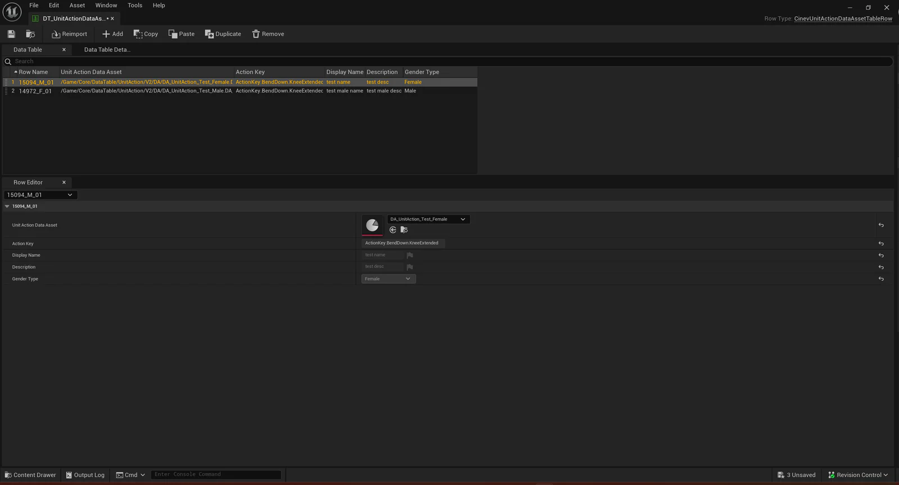
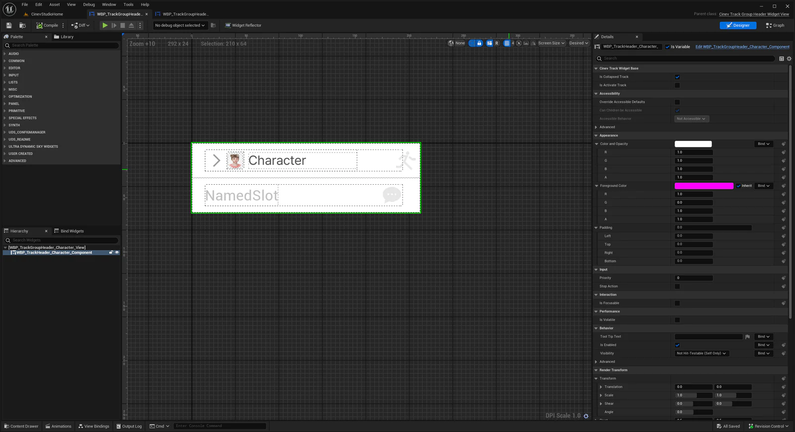
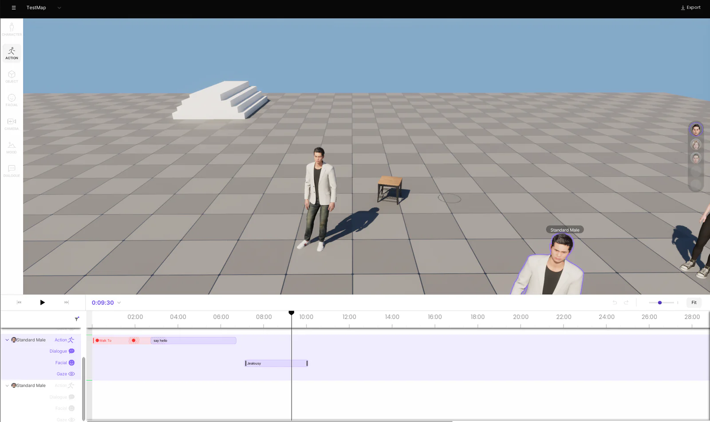
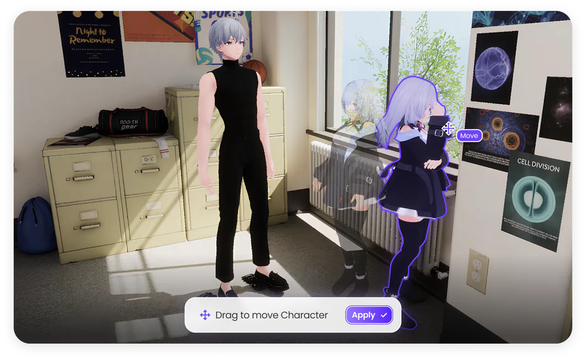

## CINEV와 CINEV Studio

CINEV는 사용자가 입력한 이야기를 바탕으로 캐릭터, 배경, 행동, 대사, 카메라를 구성하는 AI 영상 제작 서비스다. 스토리를 해석해 만든 타임라인을 3D 장면에서 재생하고, 사용자가 연출 요소를 개별적으로 수정하는 제작 흐름을 제공했다. 캐릭터의 행동이나 카메라 구도를 바꾸면 편집한 장면을 다시 렌더링할 수 있다.

CINEV Studio는 이 흐름에서 3D 장면을 확인하고 수정하는 Unreal Engine 기반 시네마틱 편집기다. 사용자는 캐릭터와 소품을 배치하고, 행동·표정·카메라 클립을 타임라인에 올려 위치와 재생 시간을 조정한다. AI가 구성한 결과를 사용자의 의도에 맞게 편집하는 작업이 여기서 이루어진다.


*CINEV의 제작 흐름. 강조한 Studio 클라이언트에서 액션 데이터·편집 UI·모션·카메라를 담당했다.*


중앙 뷰포트에서 장면을 확인하고, 하단 타임라인에서 캐릭터별 클립을 편집한다. 아래 공식 기능 소개 이미지에는 행동 라이브러리에서 선택한 액션을 타임라인에 배치하는 흐름이 나타나 있다.




*장면의 시간대를 바꿔 조명을 조정하는 공식 시연. 캐릭터·배경과 시각 자료는 팀의 결과물이다.*

C++과 UMG를 중심으로 Action·Prop 시스템과 편집 UI를 개발하고, Sequencer·MovieScene의 애니메이션·카메라 재생을 편집 조작에 연결했다. 생성 모션을 가져오는 비동기 연동, 저장·내보내기, headless 실행과 빌드 자동화도 담당했다. 콘텐츠 제작자의 입력 오류를 줄이는 작업부터 편집 결과를 안정적으로 재생하고 출력하는 경로까지 개발 범위를 맡았다.

## 액션 데이터 작성 과정의 휴먼 에러 줄이기

Unit Action은 애니메이션을 장면에서 재생할 수 있는 행동으로 정의한 데이터다. 의자에 앉는 액션이라면 재생할 모션과 구간, 타깃으로 받을 소품, 상호작용 조건과 시점을 함께 구성해야 한다. 콘텐츠 제작자는 이 정보를 조합해 사용자가 라이브러리에서 선택할 액션을 만든다.

기존 DataTable 방식에서는 제작자가 데이터 사이의 관계를 직접 맞춰야 했다. 애니메이션 테이블의 키와 시작·끝 프레임을 입력하고, 타깃에 포함된 요구 조건을 일일이 켜거나 껐다. 문자열 파라미터에 어떤 값을 넣어야 하는지는 외부 설계 문서와 대조했다. 입력할 수 있는 값은 많았지만, 현재 액션에 필요한 값이 무엇인지는 작성자가 판단해야 했다.

액션 수가 늘어나면서 이 수작업이 반복됐다. 키를 잘못 연결하거나 프레임 정보를 다르게 적는 문제, 필요 없는 타깃 조건을 남기는 문제를 작성 과정에서 줄일 필요가 있었다. 개편의 목표는 **데이터의 관계와 입력 규칙을 편집 화면에 반영해, 제작자가 기억하고 대조해야 하는 일을 줄이는 것**이었다.

### 선택에 따라 입력 폼이 바뀌는 DataAsset

액션 정의를 `UnitActionDataAsset`으로 분리하고, 선택한 타깃과 요구 조건에 따라 Details 패널의 입력 항목이 달라지도록 설계했다. 모든 조건을 펼쳐 놓고 사용 여부를 판단하던 방식에서, 해당 액션에 필요한 조건 객체만 추가하는 방식으로 바꿨다.

예를 들어 소품을 대상으로 하는 Prop 타깃에는 소품에 필요한 요구 조건을 설정한다. 위치를 지정하는 Location 타깃에서는 그 입력 항목을 숨긴다. 요구 조건별 파라미터도 각 타입의 필드로 표현해, 문자열 배열의 순서와 의미를 문서에서 찾아 입력하던 부담을 줄였다.

아래 선언은 이 입력 규칙을 표현한 개발 프로토타입이다. `TargetRequirements`를 Prop 타깃에서만 편집하도록 하고, 다른 타입에서는 항목 자체를 숨긴다.

```cpp title="Unit Action Data 입력 폼 · 프로토타입 선언 발췌"
UPROPERTY(EditAnywhere)
ECinevActionTargetType Type;

UPROPERTY(instanced, EditAnywhere, meta=(
    EditCondition="Type == ECinevActionTargetType::Prop",
    EditConditionHides))
TArray<TObjectPtr<UCinevActionTargetRequirement>> TargetRequirements;
```

`instanced`로 타깃별 요구 조건 객체를 구성하고, `EditCondition`과 `EditConditionHides`로 데이터의 조건을 입력 화면에 반영한다. 작성자는 현재 선택에 필요한 항목에 집중할 수 있다. 이는 작성 단계의 실수를 줄이는 장치이며, 저장된 데이터의 유효성 검증은 별도로 필요하다.


테이블은 액션 목록과 에셋 참조를 관리하고, 상세 설정은 각 DataAsset에서 편집하도록 역할을 나눴다. 여러 액션을 수정할 때는 콘텐츠 브라우저의 필터와 일괄 편집을 사용해 개별 에셋을 반복해서 여는 작업을 줄였다. 프로토타입에서는 에셋을 선택하면 ActionKey·표시 이름·설명·성별 정보를 가져와 테이블에 표시했다. 같은 정보를 목록에 다시 적는 대신, 에셋에서 가져온 내용을 확인하는 흐름이다.



### 모션을 보면서 재생 구간과 상호작용 시점 편집

애니메이션 설정에는 `AnimComposite`를 사용했다. Composite에서 원본 모션을 확인하며 재생 구간과 Notify·Curve를 구성하고, 액션 데이터는 해당 Composite를 참조하도록 했다. 프레임 숫자와 애니메이션을 따로 대조하던 작업을 시각적으로 편집할 수 있는 위치로 모은 것이다.

예를 들어 같은 원본 모션을 여러 액션에서 사용하더라도 재생 구간이나 상호작용 시점은 다를 수 있다. 원본 `AnimSequence`는 공유하고, 액션별 설정은 별도의 Composite에서 관리하도록 분리했다. 한 액션의 설정을 수정하기 위해 공유 원본의 Notify·Curve를 함께 바꾸지 않아도 된다.


액션 설정에 입력하던 애니메이션 테이블 키·시작 프레임·끝 프레임은 Composite 참조로 대체했다. **애니메이션 연결에 필요한 입력을 3개에서 1개로 줄이고, 두 곳의 프레임 값을 맞추는 작업을 제거했다.** 재생 구간은 Composite에서 계속 편집하므로, 이 수치는 전체 제작 단계가 아닌 액션 설정의 중복 입력에 대한 변화다.

### 작성 속도와 데이터 품질에 미친 효과

개편 뒤에는 제작자가 문서를 읽고 값을 옮기는 작업이 줄었다. 타깃을 고르면 필요한 입력 항목이 나타나고, 조건의 타입에 맞게 값을 설정하며, 애니메이션은 재생 화면과 타임라인을 보면서 구성하게 됐다. 데이터의 관계를 작성자 개인의 기억에 맡기던 부분을 입력 폼과 에셋 참조로 옮긴 것이다.

이 변화로 액션 데이터 작성 과정의 많은 휴먼 에러를 해소했고, 생성 속도도 개선됐다. 작업 경험을 기준으로 생성 속도는 기존 대비 약 3~4배 빨라진 것으로 추정한다. 동일 조건에서 계측한 수치는 아니며, 오류 감소율을 산출할 수 있는 건수 기록은 없다.

## 화면·편집 모드·입력 처리를 상태별로 분리하기

Studio에서 같은 뷰포트 클릭은 현재 작업에 따라 다른 의미를 갖는다. 일반 상태에서는 캐릭터를 선택하지만, 액션 타깃을 지정할 때는 상호작용 대상을 선택한다. 화면에 보이는 패널과 활성 편집 모드, 키보드·마우스 입력 전략이 함께 바뀌어야 한다.

초기에는 `UCinevStoryEditorWidget`과 큰 Widget Blueprint에 화면 구성과 제어 역할이 모여 있었다. 새 편집 기능을 넣을 때 어떤 화면을 표시할지뿐 아니라 기존 선택·입력 처리가 언제 종료되는지도 함께 다뤄야 했다. 팀의 UI 개편에서는 Base·Component·View를 나눴고, 나는 StoryEditor의 상태 전환과 위젯 인스턴스 관리를 분리했다.



`UIController`는 현재 상태와 상태별 인스턴스를 보관하고, 전환 시 기존 상태의 `Exit()`와 새 상태의 `Enter()`를 호출한다. Layout과 위젯 Registry는 별도 객체로 참조한다. 화면 구성과 상태의 수명을 한 객체에 모두 맡기지 않도록 나눈 것이다.

```cpp title="CinevStoryEditorUIController.h · 상태 관리"
UPROPERTY(Transient)
TMap<ECinevStoryEditorUIStateType, TObjectPtr<UCinevStoryEditorUIStateBase>> StateInstanceMap;

UPROPERTY(Transient)
TObjectPtr<UCinevStoryEditorUIStateBase> CurrentState;

TWeakObjectPtr<UCinevUILayout> LayoutWeakPtr;

TWeakObjectPtr<UCinevTaggedWidgetInstanceRegistry> WidgetInstanceRegistryWeakPtr;
```

상태 인스턴스는 `UPROPERTY`로 보관하고, 외부에서 전달받는 Layout과 Registry는 약한 참조로 유지한다. 상태 객체는 필요한 위젯을 Registry에서 Gameplay Tag로 조회해 레이아웃을 구성한다.

### 진입 처리를 세 가지 책임으로 고정

상태마다 화면, 편집 모드, 입력 전략을 설정해야 한다는 공통점이 있었다. 이를 각 상태의 긴 `Enter()` 안에 반복해서 구성하는 대신, Base State에서 호출 순서를 정하고 하위 상태가 각 단계를 구현하도록 바꿨다.

```cpp title="CinevStoryEditorUIStateBase.cpp · 상태 진입"
void UCinevStoryEditorUIStateBase::Enter()
{
    SetupViewportOnEnter();
    SetupEditModeOnEnter();
    SetupInputStrategyOnEnter();
}
```

공통 진입 처리에서는 위 세 함수를 Base State의 가상 함수로 선언하고 Default State에 적용했다. Default State는 필요한 뷰포트 위젯을 배치하고, 선택 편집 모드에 진입한 뒤 기본 키보드 전략을 설정한다.


변경의 가치는 편집 모드별 처리 위치와 진입 순서를 명시한 데 있다. 레이아웃 문제는 뷰포트 설정에서, 선택 동작 문제는 편집 모드에서, 단축키 문제는 입력 전략에서 추적할 수 있다. 새 상태도 같은 세 가지 책임을 구현하므로 기존의 큰 위젯 안에 분기를 계속 추가하던 범위를 나눌 수 있다.

전환은 단계적으로 진행했다. 최초 커밋에는 Default State만 연결해 기존 동작을 유지했고, 이후 상태별 처리와 공통 진입 절차를 옮겼다. 기존 편집 흐름을 유지하면서 상태별 구현을 옮길 수 있도록 전환 단위를 나눴다.



상태 전환을 검증할 때도 패널 표시, 선택 상태, 입력 전략을 함께 확인했다. 화면을 닫는 동작과 편집 모드를 종료하는 동작을 구분하고, 전환에 사용한 입력이 다음 상태의 동작까지 실행하지 않는지 확인하는 방식이다.

## 애니메이션과 카메라 편집

타임라인에서 액션의 재생 속도나 반복 횟수, 시작 프레임을 바꾸면 캐릭터의 이동도 해당 편집 조건에 맞아야 한다. Root Motion을 액터 공간 기준으로 베이크하고, 속도·loop·frame offset이 바뀔 때 이동 키를 다시 계산하도록 구현했다. 애니메이션의 재생 구간과 장면 안에서의 실제 이동을 함께 갱신하는 방식이다.

FBX에서는 루트의 시작 Transform을 추출해 수동 입력하던 정보를 가져오도록 했다. Action·Prop의 데이터 규칙과 Root Motion·IK의 실행 흐름을 연결하고, 기획·TA·QA와 반복적으로 확인하던 데이터 조건을 공통 규칙과 검증 도구에 반영했다.



카메라에서는 타깃 주위를 회전하는 orbit 동작을 수정했다. Quaternion 기반 구면 이동에 충돌 처리와 극점 부근의 회전 제한을 적용해, 회전 중 반경이 줄어들거나 수직 방향을 넘을 때 화면이 뒤집히는 문제를 해결했다.

## 생성 모션을 편집 가능한 애니메이션으로 연결

Text-to-Motion 연동은 원격 생성 요청부터 결과를 캐릭터에 적용하는 과정까지 담당했다. Story-to-Movie JSON의 요청을 성별과 설정 가능한 배치 크기로 나누고 서버에 병렬로 전송했다. 일부 요청이 실패하더라도 이미 성공한 결과는 보존하도록 처리했다.

반환된 ONNX 출력을 프로젝트에서 사용하는 스켈레톤 형식으로 변환해 런타임 애니메이션에 적용했다. 생성 결과를 받은 뒤에도 Studio의 타임라인에서 배치하고 편집·재생할 수 있도록 기존 액션 실행 흐름에 연결했다.

## 저장 호환성과 내보내기 추적

모션 메타데이터와 중첩 애니메이션을 JSON으로 저장·복원하는 경로를 구현했다. 표시 이름 필드가 없는 이전 저장 파일은 기존 프롬프트를 사용해 복원하도록 처리해, 새 데이터 구조에서도 이전 프로젝트를 읽을 수 있게 했다.

내보내기에는 Shot ID, Character·Camera Sequence와 Action의 출처를 결정적으로 기록했다. 출력 결과에 문제가 생겼을 때 어떤 입력과 편집 상태에서 만들어진 결과인지 추적할 수 있도록 했다.

## 프로젝트 생성·실행과 개발 빌드 자동화

S2M JSON으로 프로젝트를 만들고 Shot을 편집하는 headless Commandlet을 개발하고, Unreal Remote Control API를 연동했다. UI를 직접 조작하지 않고도 프로젝트 생성·편집·렌더링 워크플로를 실행할 수 있도록 구성했다.

Shipping 빌드에서는 외부 `Game.ini` override가 제한되고 검증에 실패한 설정이 삭제되는 문제를 추적했다. `Dev.ini`를 기준으로 임시 `UserDir` 실행 환경을 만드는 런처를 구현해, 실행별 설정을 적용하면서 원본 설정을 보존했다.

GitLab CI에는 개발 빌드 아티팩트와 다운로드 안내를 구성했다. 기획·QA가 develop 빌드를 직접 받아 검증할 수 있게 하고, runner에 종속된 경로와 렌더링 후처리 병목을 정리했다. Unreal Engine 버전 전환, Shared DDC와 Sentry 연동도 진행해 개발 환경과 오류 추적 경로를 관리했다.
