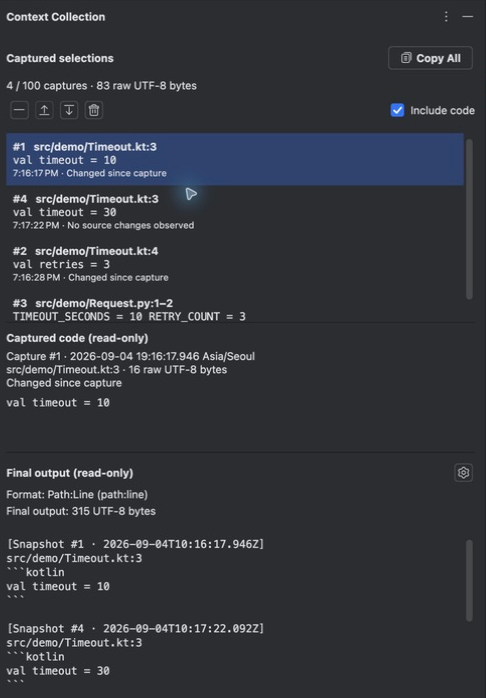

AI에게 코드를 전달할 때는 코드 조각뿐 아니라 파일 경로와 줄 범위도 필요하다. 여러 파일이 관련된 문제라면 각 위치와 코드를 따로 복사해 하나의 설명으로 모아야 한다.

Copy Selection Context는 이 작업을 IDE 안에서 처리하는 JetBrains 플러그인이다. 선택 영역의 경로·줄 번호·코드를 한 번에 복사하고, 여러 파일에서 수집한 문맥을 검토한 뒤 함께 전달할 수 있도록 구현했다.

## 구현 범위

Kotlin과 IntelliJ Platform을 기반으로 에디터 액션, 설정 화면, 복사 기록, 상태 표시줄과 컬렉션 도구 창을 구현했다. IntelliJ Platform 2024.3 이상을 대상으로 하며, JetBrains Marketplace와 GitHub Releases에서 배포한다.

단축키 복사는 상대·절대 경로와 코드 포함 여부를 선택할 수 있다. 출력은 Claude Code 참조 형식, `Path:Line`, 사용자 지정 템플릿을 지원한다. 예를 들어 프로젝트 상대 경로를 사용하면 다음과 같이 코드 위치를 전달한다.

```text
@src/main/kotlin/App.kt#L42-53
```

여러 파일을 다룰 때는 선택 영역을 컬렉션에 담고 도구 창에서 내용을 확인하거나 순서를 바꾼 뒤 전체를 복사한다. 단일 영역을 바로 복사하는 흐름과 문맥을 모아 검토하는 흐름을 각각 제공한다.

## 코드와 위치가 어긋나지 않도록

복사된 줄 범위는 사용자가 선택한 코드와 일치해야 한다. IntelliJ의 선택 영역 끝은 마지막 문자의 다음 위치를 가리키므로 `selectionEnd - 1`을 기준으로 마지막 줄을 계산한다. 다음 줄의 시작점까지 선택해도 불필요한 줄이 포함되지 않도록 했으며, 여러 커서를 사용하는 경우에는 각 영역을 독립적으로 처리한다.

컬렉션에는 수집 당시의 코드와 경로, 줄 범위를 스냅샷으로 보관한다. 원본을 수정하거나 삭제해도 수집한 코드는 유지된다. 같은 위치의 코드가 바뀌면 별도 스냅샷으로 남겨 수정 전후를 함께 전달할 수 있다. 컬렉션은 프로젝트 세션 안에서만 유지하고 영구 저장하지 않는다.



GitHub·GitLab permalink는 현재 문서와 HEAD의 내용이 다를 수 있다는 점을 별도로 다뤘다. Git 조회는 백그라운드에서 실행하고, 문서가 HEAD와 다르면 확인을 거쳐 해당 커밋의 링크를 복사한다. 줄 번호를 임의로 보정하거나 파일을 저장·커밋하지 않는다.

## 검증과 배포

테스트는 순수 로직을 다루는 단위 테스트와 실제 IntelliJ 에디터·액션·클립보드를 사용하는 플랫폼 테스트로 나눴다. 플랫폼 상태를 사용하는 테스트는 JVM을 분리해 실행한다. CI에서는 테스트와 플러그인 구조·호환성 검증, 패키징을 수행한다.

릴리스에는 배포 ZIP의 체크섬과 GitHub artifact attestation을 제공한다. 내려받은 파일이 릴리스 워크플로에서 만든 산출물인지 확인할 수 있도록 했다.

[소스 코드와 사용법](https://github.com/hon454/copy-selection-context) · [빌드·테스트 구성](https://github.com/hon454/copy-selection-context/blob/main/build.gradle.kts) · [JetBrains Marketplace](https://plugins.jetbrains.com/plugin/30262-copy-selection-context)
