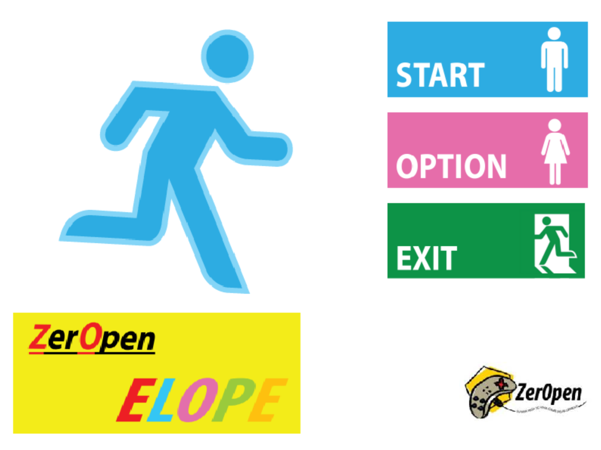
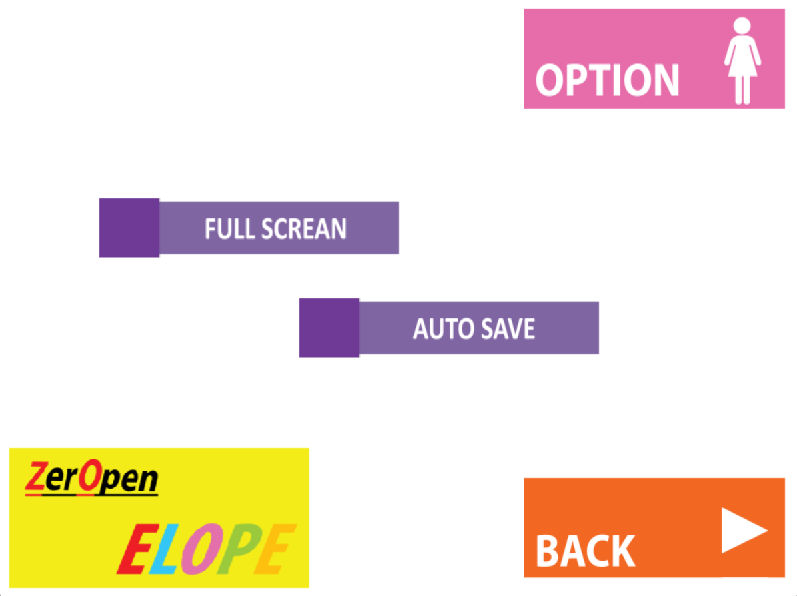
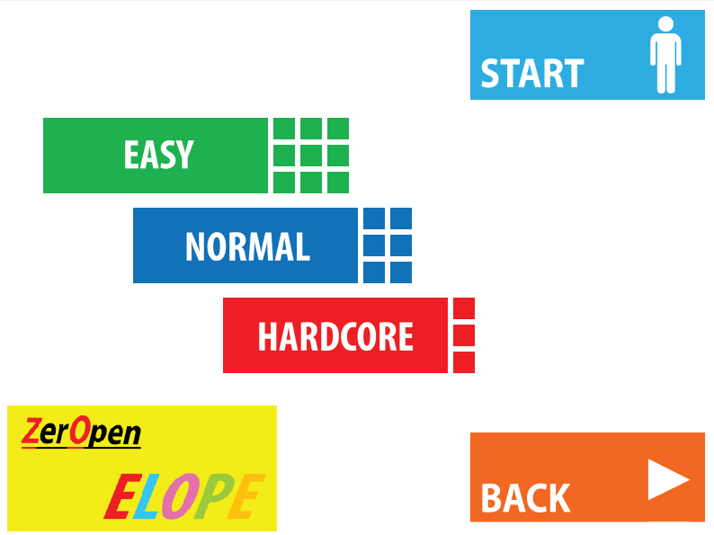
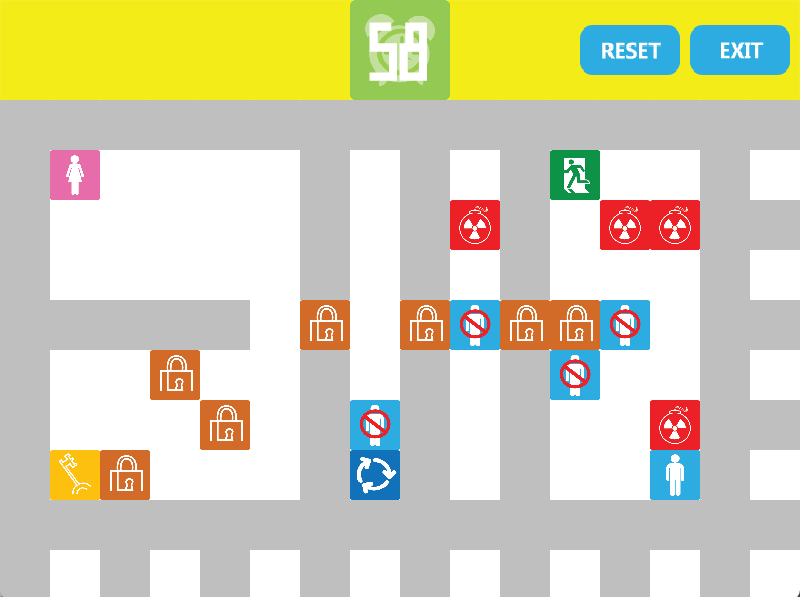
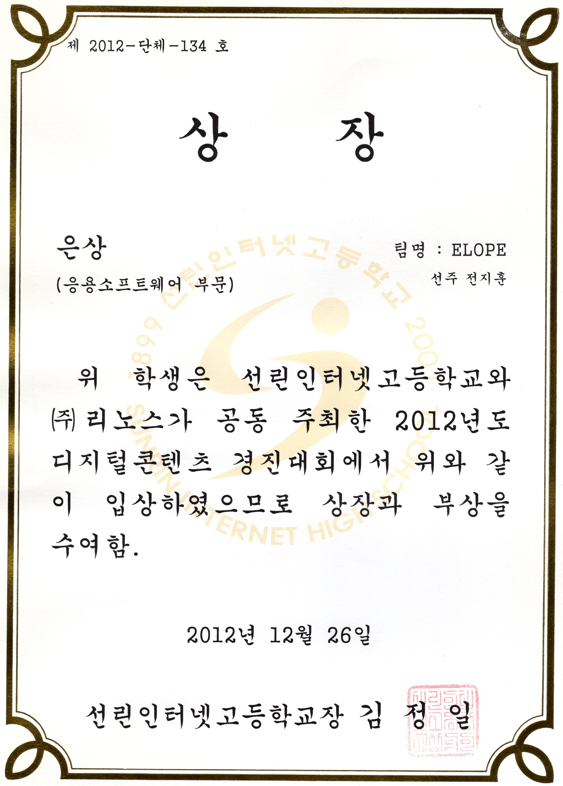

| 항목 | 내용 |
| --- | --- |
| 기간 | 2012.10 - 2012.12 |
| 소속 | 선린인터넷고등학교 |
| 역할 | 기획, 클라이언트 프로그래머 |
| 기술 | DirectX, C++ |

## 프로젝트 소개

조작 입력 시 남자 블록과 여자 블록이 각각 반대 방향으로 움직이는 규칙으로 퍼즐을 풀어가는 게임이다. DirectX와 C++로 개발했으며, 2012년 선린인터넷고등학교 디지털 콘텐츠 경진대회 응용소프트웨어 부문에서 은상을 받았다.

- [실행 파일 다운로드 (DirectX)](https://drive.google.com/file/d/0BzRVCdwGHum_dDVqRWFkcWNsLWc/view?usp=drive_link&resourcekey=0-u84Y5T0b6tlvd66HOAp6Eg)
- [실행 파일 다운로드 (Java)](https://drive.google.com/file/d/0BzRVCdwGHum_d3g3ZVVmZG9kWlE/view?usp=drive_link&resourcekey=0-Hv5Z7hsX0AVJhZ0666zlZQ)
