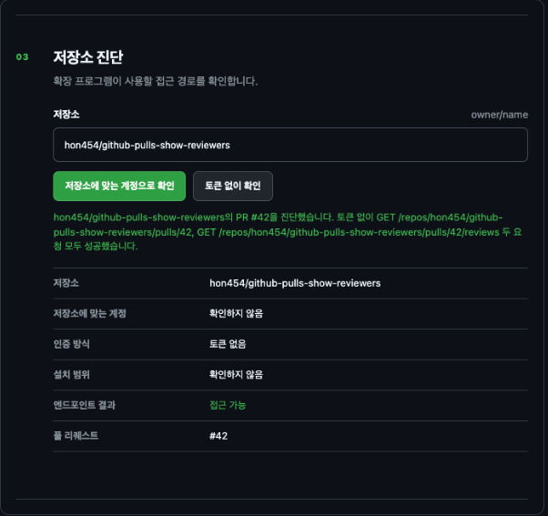

GitHub PR 목록에서는 제목과 작성자, 진행 상태를 훑어볼 수 있지만 리뷰 요청 대상과 리뷰어별 상태를 함께 확인하려면 각 PR을 열어보게 된다.

GitHub Pulls Show Reviewers는 이 정보를 목록에 표시하는 Chrome 확장 프로그램이다. 요청된 사용자와 팀, 승인·변경 요청 등의 리뷰 상태를 각 PR 행에 추가해 리뷰 현황을 목록에서 확인하도록 구현했다.

## 구현 범위

WXT, TypeScript와 React를 사용했다. 콘텐츠 스크립트가 GitHub의 PR 행을 찾고, 백그라운드 서비스 워커가 GitHub REST API에서 리뷰어 정보를 조회한다. 설정 화면에서는 표시 방식과 연결 계정, 저장소 접근 상태를 관리한다.

리뷰어는 아바타 또는 사용자 이름으로 표시하고, 관련 PR 검색으로 연결한다. 공개 저장소의 익명 조회와 GitHub App을 통한 비공개 저장소 조회를 지원하며, 개인·업무 계정을 함께 연결할 수 있다. 설정과 리뷰어 표시에는 한국어를 포함한 5개 언어를 제공한다.

## GitHub 화면 갱신과 리뷰 상태 처리

GitHub는 페이지 이동이나 목록 갱신 중에 PR 행의 DOM을 교체한다. 이때 확장 프로그램의 표시가 사라지거나 이전 요청의 결과가 새 화면에 붙지 않도록, 행과 페이지의 유효성을 확인하고 필요한 표시를 복원한다. 페이지 단위 메타데이터와 캐시를 재사용하며, 동시에 실행하는 요청 수를 제한한다.

리뷰 상태는 마지막 이벤트 하나만으로 결정하지 않는다. 승인 이후 댓글이 달려도 승인 상태가 사라지지 않도록 가장 최근의 댓글 외 리뷰를 우선하고, 해당 리뷰가 없을 때 댓글 상태를 사용한다.

조회에 실패했을 때는 PR마다 오류 문구를 붙이는 대신 페이지 단위 안내로 모은다. 이미 조회한 리뷰어 정보는 유지하고, 리뷰어가 없는 정상 응답과 조회 실패를 구분한다. 언어나 표시 설정을 바꾸는 작업은 기존 데이터를 다시 그리도록 해 API 재요청과 분리했다.

## 비공개 저장소와 인증 경계

GitHub App의 요청 권한은 `Pull requests: Read`로 제한했다. OAuth 처리와 인증된 API 요청, 자격 증명 저장은 백그라운드에서 맡는다. 콘텐츠 스크립트와 설정 화면에는 토큰 대신 계정 요약과 로그인 진행 상태만 전달한다.

여러 계정을 연결한 경우에는 앱의 설치 범위와 계정의 저장소 접근 권한을 함께 확인한다. 조직에 앱이 설치돼 있어도 연결한 사용자에게 접근 권한이 없을 수 있기 때문이다. 설정 화면의 저장소 진단에서는 실제 사용한 계정과 API 응답, 설치 범위와 요청 한도를 확인할 수 있다.

## 검증과 배포

Vitest와 Playwright를 사용해 로직과 브라우저 동작을 검증하는 테스트를 구성했다. 목록 갱신, 리뷰 상태 조합, 인증·접근 오류와 언어 변경 중 불필요한 요청이 발생하지 않는 경우를 회귀 테스트로 다룬다.

배포 패키지는 릴리스 검증과 ZIP 생성 과정을 거쳐 Chrome Web Store에 제공한다. 현재 지원·검증 대상 브라우저는 Chrome이다.

[소스 코드와 사용법](https://github.com/hon454/github-pulls-show-reviewers) · [구현 문서](https://github.com/hon454/github-pulls-show-reviewers/blob/main/docs/implementation-notes.md) · [Chrome Web Store](https://chromewebstore.google.com/detail/github-pulls-show-reviewe/hoocgjopdboeghdkfjlkngkkpbiljggk)
