| 항목 | 내용 |
| --- | --- |
| 기간 | 2021.01 - 2024.06 |
| 소속 | 작두 스튜디오 |
| 역할 | 클라이언트 프로그래머 |
| 기술 | Unreal, C++, DevOps, Dedicated Server |

[Steam 상점](https://store.steampowered.com/app/1377380/Night_of_the_Dead/)

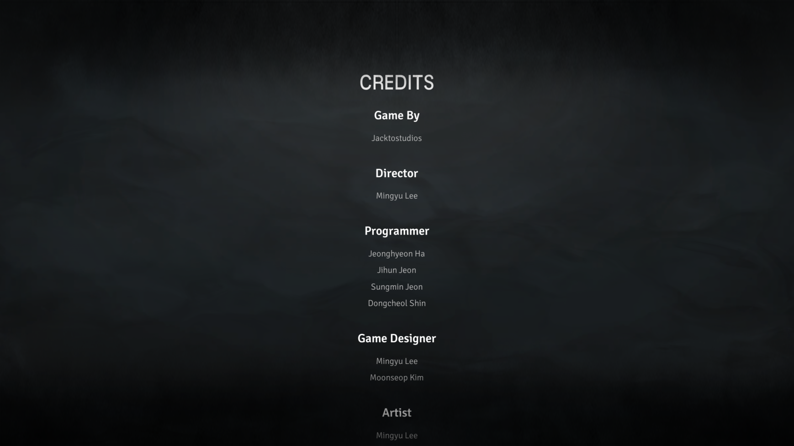

Unreal 엔진을 활용하여 오픈월드 생존 게임 `Night of the Dead` 개발 및 정식 출시

## 업데이트 별 주요 담당 업무

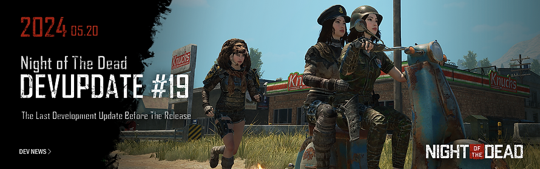

[개발 업데이트 #19](https://steamcommunity.com/games/1377380/announcements/detail/4174351800564228844?snr=1_2108_9__2107)

- 멀티플레이 개설 및 접속 과정 개편
- 추종자 일부 기능 구현
- 6지역 보스 좀비 구현
- 네트워크 최적화
- 자연물 리스폰 시스템 개선

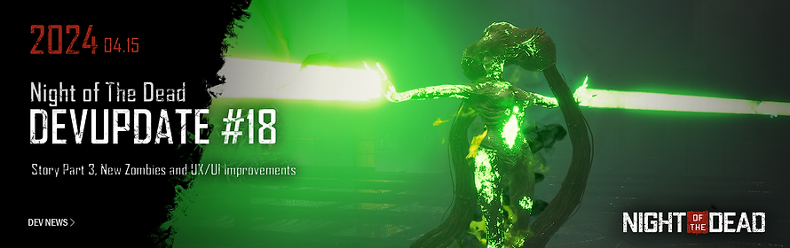

[개발 업데이트 #18](https://steamcommunity.com/games/1377380/announcements/detail/7675897515552221213?snr=1_5_9_)

- 5지역 보스 좀비 구현
- 추종자 일부 기능 구현

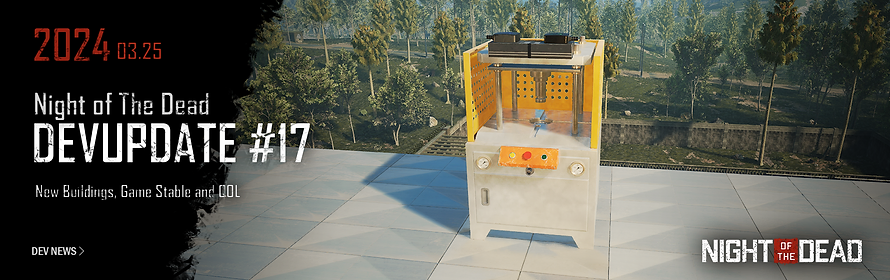

[개발 업데이트 #17](https://steamcommunity.com/games/1377380/announcements/detail/4101163232898580763?snr=1_5_9_)

- 좀비 AI 로직 개선
- 부활 시스템 개편

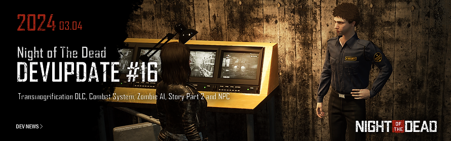

[개발 업데이트 #16](https://steamcommunity.com/games/1377380/announcements/detail/4177721893479578937?snr=1_5_9_)

- 형상변환(스킨) DLC 구현
- 4지역 보스 좀비 구현
- 고유 장비 재조립 구현
- 통합 게임 메뉴 구현

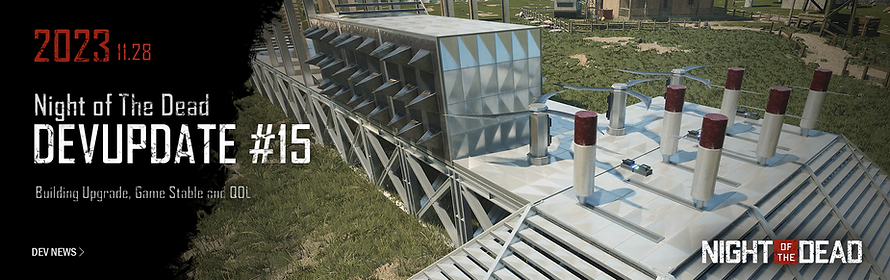

[개발 업데이트 #15](https://store.steampowered.com/news/app/1377380/view/3888357282609115394?l=koreana)

- 프로젝트 언리얼 엔진 5 마이그레이션 진행
- 리플리케이션 그래프 개편

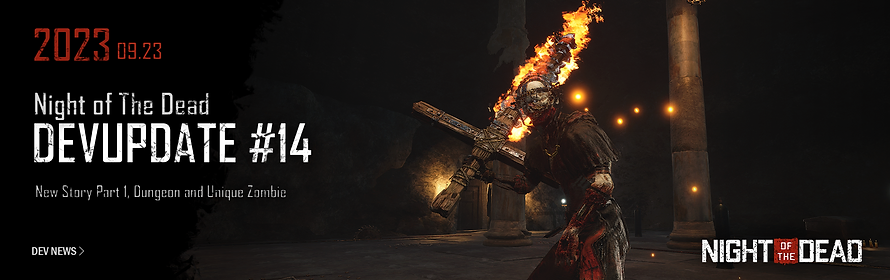

[개발 업데이트 #14](https://steamcommunity.com/games/1377380/announcements/detail/5560312482573003457?snr=1_5_9_)

- 1, 2, 3 지역 보스 좀비 구현
- AOE 공격 시스템 개편
- 엠비언트 사운드 시스템 개편

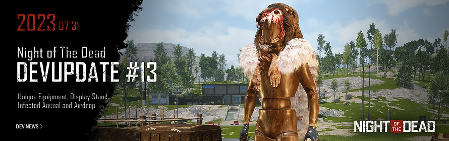

[개발 업데이트 #13](https://steamcommunity.com/games/1377380/announcements/detail/3684558705424158476?snr=1_5_9_)

- 장식대 구현 (방어구, 무기, 좀비, 동물, 수족관)
- 유니크 장비 구현
- 폴리지 리스폰 시스템 개편

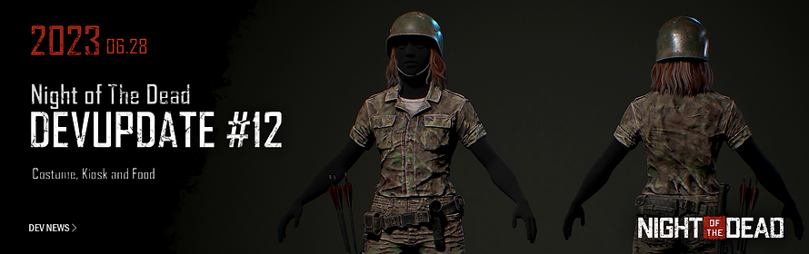

[개발 업데이트 #12](https://steamcommunity.com/games/1377380/announcements/detail/3684555534412335389?snr=1_5_9_)

- 월드 빌딩 개편
- 월드 도어 개편
- 키오스크 시스템 구현
- 좀비 무브먼트 개선
- 코스튬 (스킨) 구현

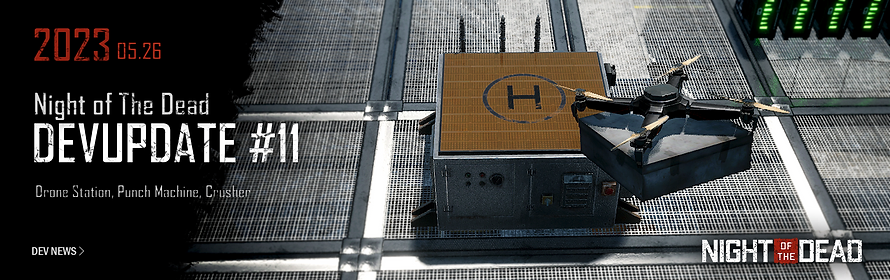

[개발 업데이트 #11](https://steamcommunity.com/games/1377380/announcements/detail/3716078195361732057?snr=2_groupannouncements_detail_)

- Tick 최적화
- 네트워크 최적화
- 서버 클라이언트 간 대용량 데이터 전송을 위해 RPC를 활용한 데이터 스트리밍 시스템 개발
- 애니메이션 최적화 (리플리케이션 그래프, 커스텀 NetSerialize, Fast TArray Replication 등 적용)
- 좀비 리더 시스템 개선
- 좀비 길찾기 개선

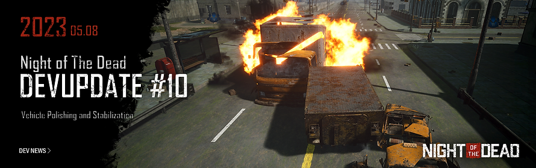

[개발 업데이트 #10](https://steamcommunity.com/games/1377380/announcements/detail/3711572693139781185?snr=1_5_9_)

- 전투 판정 개편
- 서버 세션 리스트 개편
- 좀비 최적화
- 네트워크 최적화 (리플리케이션 그래프, 커스텀 NetSerialize, Fast TArray Replication 등 적용)
- 디스트럭터블 매쉬 시스템 재구성
- 네비게이션 인보커 최적화
- 에셋 사전 로딩 시스템 구현
- 위젯 풀링 시스템 구현

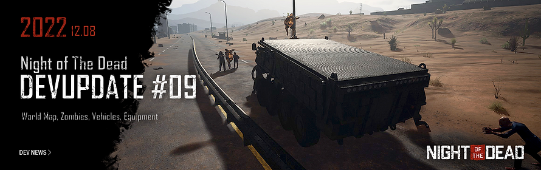

[개발 업데이트 #09](https://steamcommunity.com/games/1377380/announcements/detail/3632746453304905737?snr=1_5_9_)

- 신규 좀비 구현
- 웨이브 시스템 개편
- 장비 티어 시스템 구현
- 장비 내구도 시스템 구현
- 장비 파츠 개조 시스템 구현
- 총기 시스템 구현

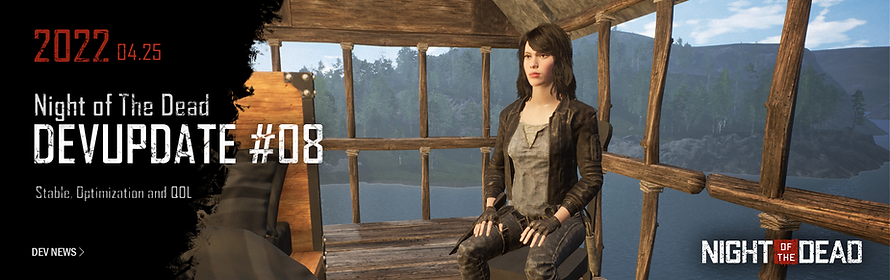

[개발 업데이트 #08](https://steamcommunity.com/games/1377380/announcements/detail/3210511728813822228?snr=1_5_9_)

- 휴식 시스템 구현
- 디스트럭터블 오브젝트 최적화

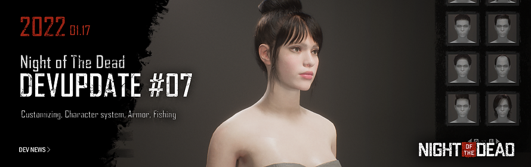

[개발 업데이트 #07](https://steamcommunity.com/games/1377380/announcements/detail/3130565222384389708?snr=1_5_9_)

- 캐릭터 레벨 시스템 구현
- 캐릭터 능력치 시스템 구현
- 장비 희귀도 시스템 구현
- 장비 재조립 시스템 구현
- 코일 개조 시스템 구현

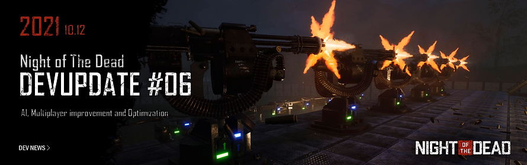

[개발 업데이트 #06](https://steamcommunity.com/games/1377380/announcements/detail/3019092467760502290?snr=1_5_9_)

- 좀비 AI 개선
- 좀비 최적화
- 아이템 최적화
- 트랩 최적화

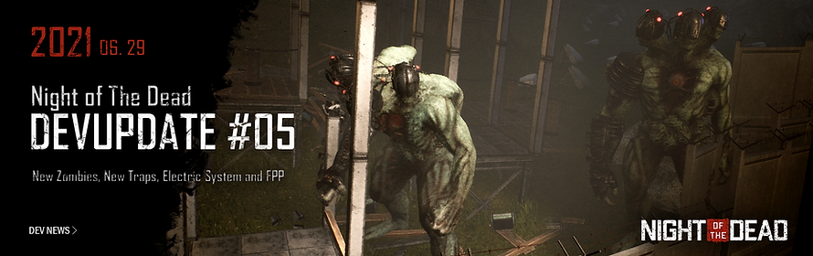

[개발 업데이트 #05](https://steamcommunity.com/games/1377380/announcements/detail/2988683441438443136?snr=1_5_9_)

- 신규 좀비 구현
- 함정 개조 장비 구현

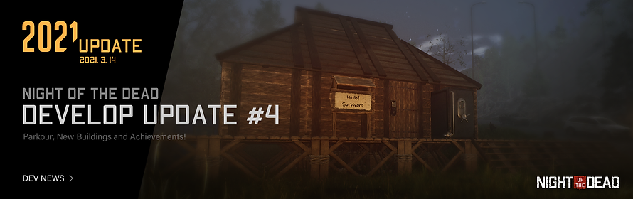

[개발 업데이트 #04](https://steamcommunity.com/games/1377380/announcements/detail/3044968289462619227?snr=1_5_9_)

- 신규 건물 구현
- 업적 시스템 구현

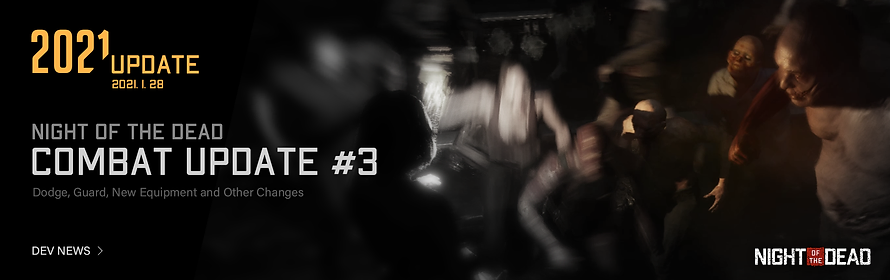

[개발 업데이트 #03](https://store.steampowered.com/news/app/1377380/view/3050593984714457440)

- 신규 연구 스킬 추가
- 전투 시스템 개선
- 전투 UI 개선

## 기타 담당 업무

- Jira, Confluence, Slack, GitLab, Space 등을 활용한 DevOps 구축
- Jetbrains TeamCity를 활용한 CI/CD 구축
- Nginx, Certbot 서비스를 통해 회사 서버에 공개 도메인 부여 및 인증서 관리

## 기술 심화 경험

### 물리 시스템 (Physics System)

- UE4 PhysX 기반 디스트럭터블 오브젝트 시스템 구현 및 최적화
- UE5 마이그레이션 시 Chaos Physics로의 전환 작업 수행
- Chaos Physics의 Destructible 시스템 성능 한계를 분석하고, **커스텀 디스트럭터블 시스템을 자체 설계 및 구현**하여 대규모 오브젝트 파괴 연출의 퍼포먼스 확보
- 환경 오브젝트 상호작용 시 물리 기반 반응 시스템 구현

### 애니메이션 시스템 (Animation System)

- 좀비 AI의 자연스러운 움직임을 위한 Animation 시스템 활용 및 최적화
- 네트워크 환경에서의 애니메이션 리플리케이션 최적화 (커스텀 NetSerialize, Fast TArray Replication)
- IK(역운동학) 시스템에 대한 기본 이해를 바탕으로 캐릭터/좀비 모션 품질 개선

### 게임플레이 어빌리티 시스템

- 캐릭터 능력치, 장비 효과, 전투 판정 등을 체계적으로 관리하기 위한 어빌리티 시스템 설계
- GAS(Gameplay Ability System)에 대한 기본 이해를 바탕으로 캐릭터 스킬 및 버프/디버프 시스템 구현 경험

### 장비 커스터마이징 시스템

- 장비 파츠 개조, 재조립, 고유 장비 시스템 등 **복잡한 아이템 분해/조립 시스템** 설계 및 구현
- 장비 티어, 희귀도, 내구도 등 다층적 아이템 속성 시스템 설계
- 코스튬(스킨) 및 형상변환 DLC 시스템 구현
