| 항목 | 내용 |
| --- | --- |
| 기간 | 2021.01 - 2024.06 |
| 소속 | 작두 스튜디오 |
| 역할 | 클라이언트 프로그래머 |
| 기술 | Unreal Engine 4/5, C++, Dedicated Server, DevOps |

## 프로젝트와 담당 역할

Night of the Dead는 밤마다 몰려오는 좀비에 대비해 방어 시설을 짓고 섬에서 살아남는 오픈월드 생존 게임이다. Unreal Engine과 C++로 개발했으며, Windows Server 기반 Dedicated Server에서 멀티플레이를 지원한다. 얼리 액세스 기간의 업데이트부터 2024년 5월 1.0 정식 출시까지 클라이언트 프로그래머로 참여했다.

전투와 장비, 보스 및 일반 좀비 AI, 월드 상호작용 같은 게임플레이와 함께 멀티플레이 동기화, 다수 좀비의 실행 비용 최적화, 엔진 이전과 개발 인프라를 담당했다. 동기화의 적용 방식은 [멀티플레이 동기화](#network-sync)에 정리했다.

[Steam 상점](https://store.steampowered.com/app/1377380/Night_of_the_Dead/)

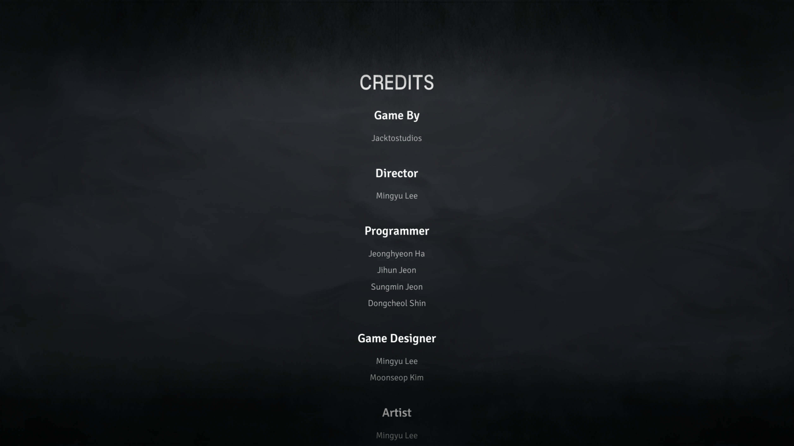

## 업데이트별 주요 담당 업무

공개된 개발 업데이트 공지를 기준으로 각 업데이트에서 담당한 작업을 정리했다. 항목은 팀 업데이트 중 내가 구현하거나 개편한 범위다.

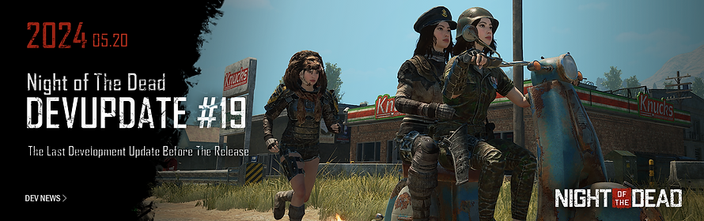

[개발 업데이트 #19](https://steamcommunity.com/games/1377380/announcements/detail/4174351800564228844?snr=1_2108_9__2107)

- 멀티플레이 개설 및 접속 과정 개편
- 추종자 일부 기능 구현
- 6지역 보스 좀비 구현
- 네트워크 최적화
- 자연물 리스폰 시스템 개선

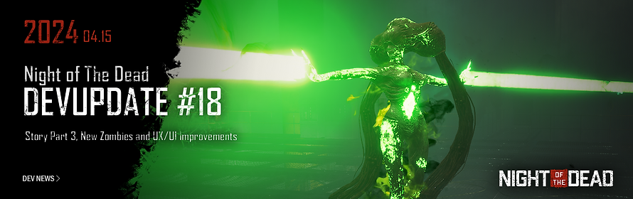

[개발 업데이트 #18](https://steamcommunity.com/games/1377380/announcements/detail/7675897515552221213?snr=1_5_9_)

- 5지역 보스 좀비 구현
- 추종자 일부 기능 구현

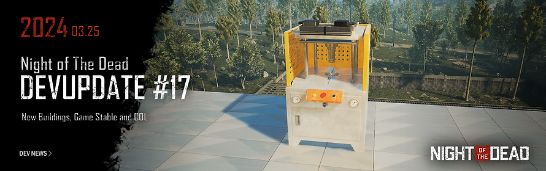

[개발 업데이트 #17](https://steamcommunity.com/games/1377380/announcements/detail/4101163232898580763?snr=1_5_9_)

- 좀비 AI 로직 개선
- 부활 시스템 개편

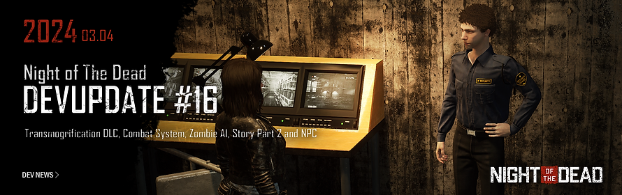

[개발 업데이트 #16](https://steamcommunity.com/games/1377380/announcements/detail/4177721893479578937?snr=1_5_9_)

- 형상변환(스킨) DLC 구현
- 4지역 보스 좀비 구현
- 고유 장비 재조립 구현
- 통합 게임 메뉴 구현

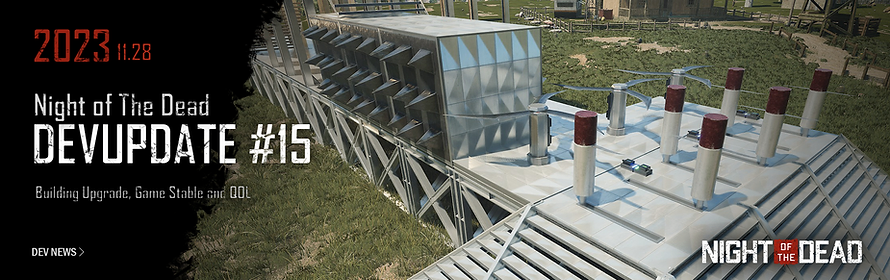

[개발 업데이트 #15](https://store.steampowered.com/news/app/1377380/view/3888357282609115394?l=koreana)

- 프로젝트 Unreal Engine 5 이전 주도
- Replication Graph 개편

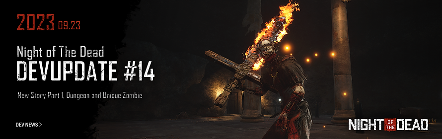

[개발 업데이트 #14](https://steamcommunity.com/games/1377380/announcements/detail/5560312482573003457?snr=1_5_9_)

- 1, 2, 3지역 보스 좀비 구현
- AOE 공격 시스템 개편
- 앰비언트 사운드 시스템 개편

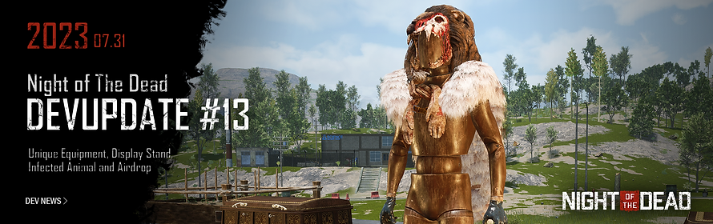

[개발 업데이트 #13](https://steamcommunity.com/games/1377380/announcements/detail/3684558705424158476?snr=1_5_9_)

- 장식대 구현 (방어구, 무기, 좀비, 동물, 수족관)
- 고유 장비 구현
- 폴리지 리스폰 시스템 개편

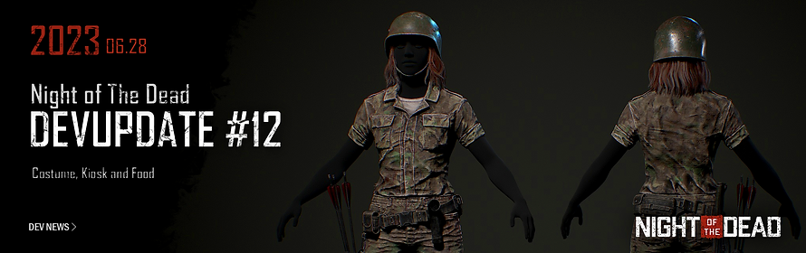

[개발 업데이트 #12](https://steamcommunity.com/games/1377380/announcements/detail/3684555534412335389?snr=1_5_9_)

- 월드 빌딩 개편
- 월드 도어 개편
- 키오스크 시스템 구현
- 좀비 무브먼트 개선
- 코스튬(스킨) 구현

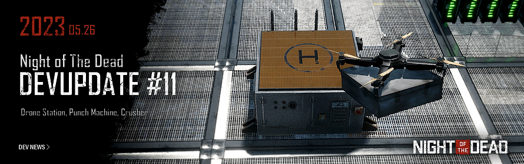

[개발 업데이트 #11](https://steamcommunity.com/games/1377380/announcements/detail/3716078195361732057?snr=2_groupannouncements_detail_)

- Tick 최적화
- 네트워크 최적화
- 서버와 클라이언트 간 대용량 데이터 전송을 위한 RPC 기반 데이터 스트리밍 시스템 개발
- 애니메이션 업데이트 비용 최적화
- 좀비 리더 시스템 개선
- 좀비 길찾기 개선

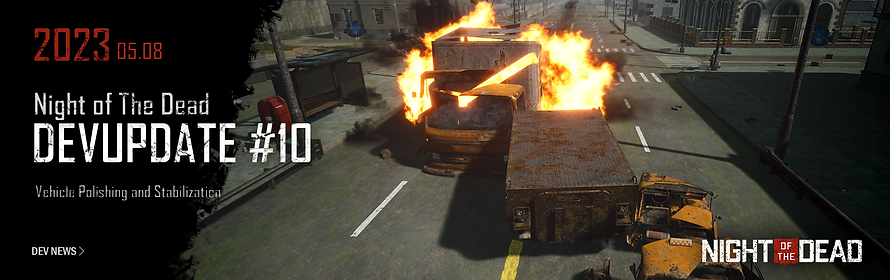

[개발 업데이트 #10](https://steamcommunity.com/games/1377380/announcements/detail/3711572693139781185?snr=1_5_9_)

- 전투 판정 개편
- 서버 세션 리스트 개편
- 좀비 최적화
- 네트워크 최적화 (Replication Graph, Net Dormancy, 커스텀 NetSerialize, RPC 스트리밍 적용)
- Destructible Mesh 시스템 재구성
- 네비게이션 인보커 최적화
- 에셋 사전 로딩 시스템 구현
- 위젯 풀링 시스템 구현

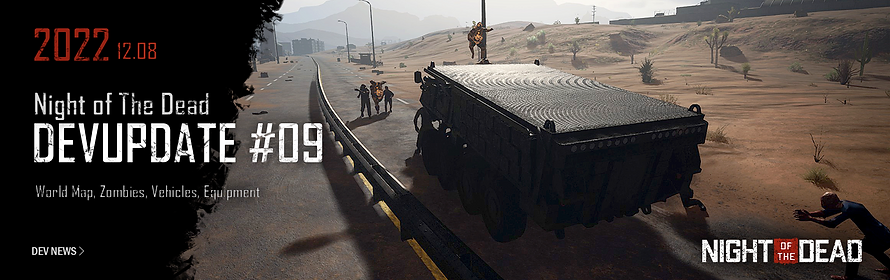

[개발 업데이트 #09](https://steamcommunity.com/games/1377380/announcements/detail/3632746453304905737?snr=1_5_9_)

- 신규 좀비 구현
- 웨이브 시스템 개편
- 장비 티어 시스템 구현
- 장비 내구도 시스템 구현
- 장비 파츠 개조 시스템 구현
- 총기 시스템 구현

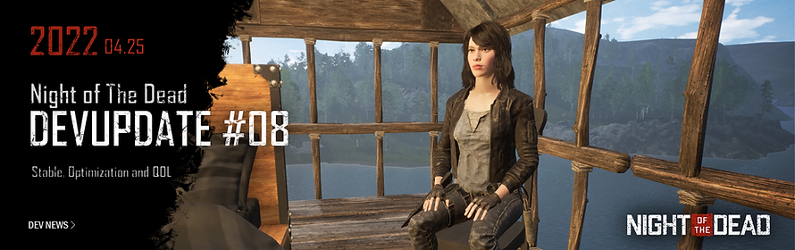

[개발 업데이트 #08](https://steamcommunity.com/games/1377380/announcements/detail/3210511728813822228?snr=1_5_9_)

- 휴식 시스템 구현
- Destructible 오브젝트 최적화

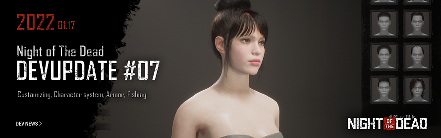

[개발 업데이트 #07](https://steamcommunity.com/games/1377380/announcements/detail/3130565222384389708?snr=1_5_9_)

- 캐릭터 레벨 시스템 구현
- 캐릭터 능력치 시스템 구현
- 장비 희귀도 시스템 구현
- 장비 재조립 시스템 구현
- 코일 개조 시스템 구현

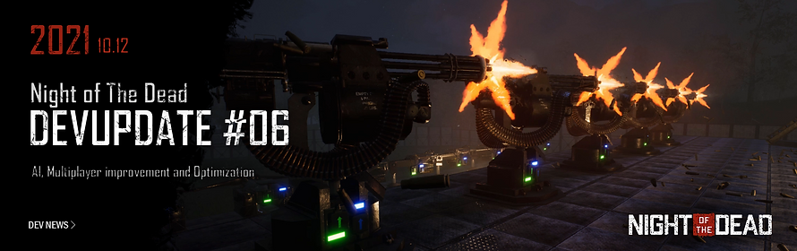

[개발 업데이트 #06](https://steamcommunity.com/games/1377380/announcements/detail/3019092467760502290?snr=1_5_9_)

- 좀비 AI 개선
- 좀비 최적화
- 아이템 최적화
- 트랩 최적화

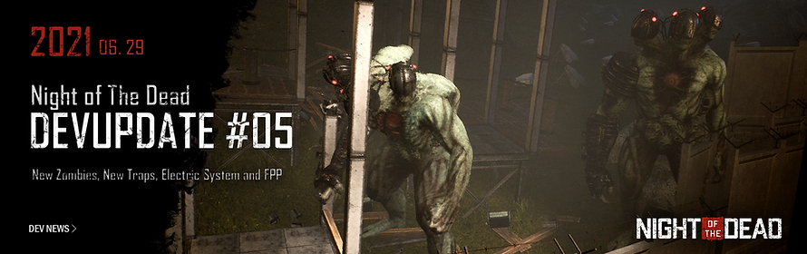

[개발 업데이트 #05](https://steamcommunity.com/games/1377380/announcements/detail/2988683441438443136?snr=1_5_9_)

- 신규 좀비 구현
- 함정 개조 장비 구현

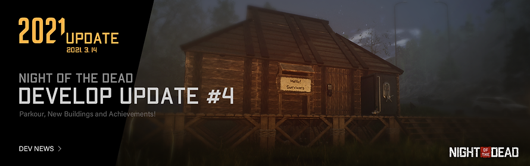

[개발 업데이트 #04](https://steamcommunity.com/games/1377380/announcements/detail/3044968289462619227?snr=1_5_9_)

- 신규 건물 구현
- 업적 시스템 구현

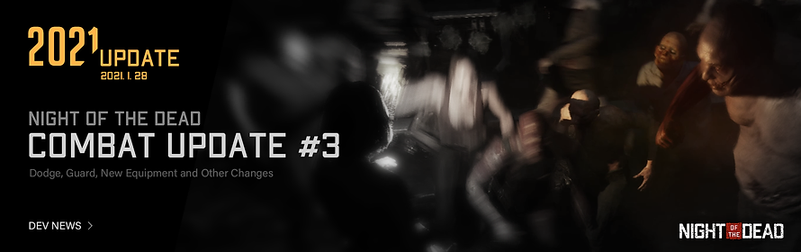

[개발 업데이트 #03](https://store.steampowered.com/news/app/1377380/view/3050593984714457440)

- 신규 연구 스킬 추가
- 전투 시스템 개선
- 전투 UI 개선

## 개발 인프라

- Jira, Confluence, Slack을 대체하기 위해 JetBrains Space On-Premise 서버를 구축하고 운영했다.
- TeamCity On-Premise로 빌드와 패키징 자동화를 구성하고 Shared DDC를 운영했다.
- Nginx와 Certbot으로 회사 서버에 공개 도메인을 부여하고 인증서를 관리했다.
- Epic Online Services 세션을 멀티플레이 개설과 접속 과정에 연결하고 Steamworks 업적을 연동했다.

## 기술별 담당 내용

### 멀티플레이 동기화

Windows Server 기반 Dedicated Server를 Unreal Insights로 분석하며 복제 대상 선정, 전송 데이터와 전송 경로를 나눠 최적화했다. 공간상 가까운 액터 외에도 소유 관계에 따라 전달해야 하는 상태가 있어 복제 조건을 나눴다.

Replication Graph에서 공간과 거리로 연결별 후보를 수집하고, 오너와 팀, 그룹에 종속된 액터는 해당 연결에 거리와 무관하게 포함했다. 장착 장비와 무기 부속품, 고용한 NPC, 탑승물과 그 위의 건물은 Dependent Actor로 묶어 부모 액터가 복제될 때 함께 검토하도록 구성했다. 전역 매니저는 Always Relevant 노드에, 휴면 액터는 별도 노드에 두어 상태에 맞게 처리했다. 상태가 드물게 바뀌는 아이템, 문, 풀링 좀비는 Net Dormancy로 휴면시켰다. 구성 방식은 [멀티플레이 최적화 돌아보기의 복제 대상](/posts/notd-multiplayer-optimization-overview/#복제-대상)에 정리했다.

퀘스트, 마커, NPC 퀘스트처럼 데이터 테이블에서 온 값을 가진 구조체는 이름 대신 ID를 담은 복제용 구조체로 분리하고, 커스텀 NetSerialize로 필요한 필드만 직렬화했다. 클라이언트는 `OnRep`에서 테이블을 조회해 복원한다. 접속 시 보내는 레벨 스트리밍 상태는 패키지 경로를 `int16` 코드와 비트 플래그로 압축했다. 자세한 구조는 [오픈월드의 오브젝트를 액터 대신 데이터로 두기](/posts/notd-world-objects-as-data/)와 [접속 시 레벨 스트리밍 상태 RPC 줄이기](/posts/notd-level-streaming-status-rpc/)에 정리했다.

퀘스트 진행도, 지도 마커, 지도 안개처럼 접속 시 한꺼번에 보내야 하는 데이터는 레코드 단위 RPC로 나눠 보내는 스트리밍을 구현했다([Reliable 버퍼 상태를 보고 대용량 데이터 나눠 보내기](/posts/notd-reliable-rpc-data-streaming/)). Epic Online Services 세션은 멀티플레이 개설 및 접속 과정에 연결했다.

### 물리와 파괴 오브젝트

UE4의 PhysX 기반 Destructible 오브젝트를 구현하고 최적화했다. APEX Destruction에서 원인을 알 수 없는 에러가 잦아, 직접 제어할 수 있도록 최소 기능의 커스텀 Destructible 시스템으로 교체했다. Blender에서 미리 나눈 조각 StaticMesh를 파괴 시점에 만들어 물리 시뮬레이션하고 일정 시간 뒤 제거하는 구조이며, 교체 후 렉이 크게 줄었다. UE5 이전에서 Chaos Physics로 전환할 때는 당시 다루기 어렵고 성능 문제가 있던 Chaos Destruction 대신 이 시스템을 유지했다. 환경 오브젝트 상호작용의 물리 기반 반응도 함께 다뤘다. 구조와 엔진 Destructible과의 비교는 [엔진 Destructible 대신 조각 메시로 파괴 오브젝트 처리하기](/posts/notd-custom-destructible/)에 정리했다.

### 애니메이션

다수 좀비의 애니메이션 부하를 줄이기 위해 Significance Manager로 계산한 중요도를 Animation Budget Allocator에 전달해 캐릭터의 애니메이션 갱신을 예산 안에서 조절하고, ACL로 애니메이션 데이터를 압축했다. 수족관 물고기와 캐릭터 전시물처럼 여럿 배치되는 장식 개체에는 평균 프레임률이 기준보다 낮을 때만 엔진의 Update Rate Optimization을 켜는 컴포넌트를 따로 만들어 붙였다. 좀비의 이동, 동기화와 길찾기 비용까지 포함한 전체 구조는 [다수 좀비의 서버 비용과 전송량 줄이기](/posts/notd-zombie-horde-cost/)에 정리했다. 캐릭터와 좀비 모션의 품질을 개선하는 과정에서 IK를 활용했다.

### 능력치와 전투 판정

캐릭터 능력치, 장비 효과, 전투 판정을 관리하는 어빌리티 구조를 설계하고 캐릭터 스킬과 버프, 디버프 시스템을 구현했다. Gameplay Ability System의 구성 방식을 참고했다. 근거리, 원거리, 투척 무기의 장착 구조와 능력치를 구현하고 던전과 전투 UI를 개발했다.

### 장비 커스터마이징

장비 파츠 개조, 재조립과 고유 장비처럼 아이템을 분해하고 조합하는 시스템을 설계하고 구현했다. 티어, 희귀도, 내구도 등 여러 속성이 겹치는 아이템 구조를 정리하고 코스튬(스킨)과 형상변환 DLC를 구현했다.
