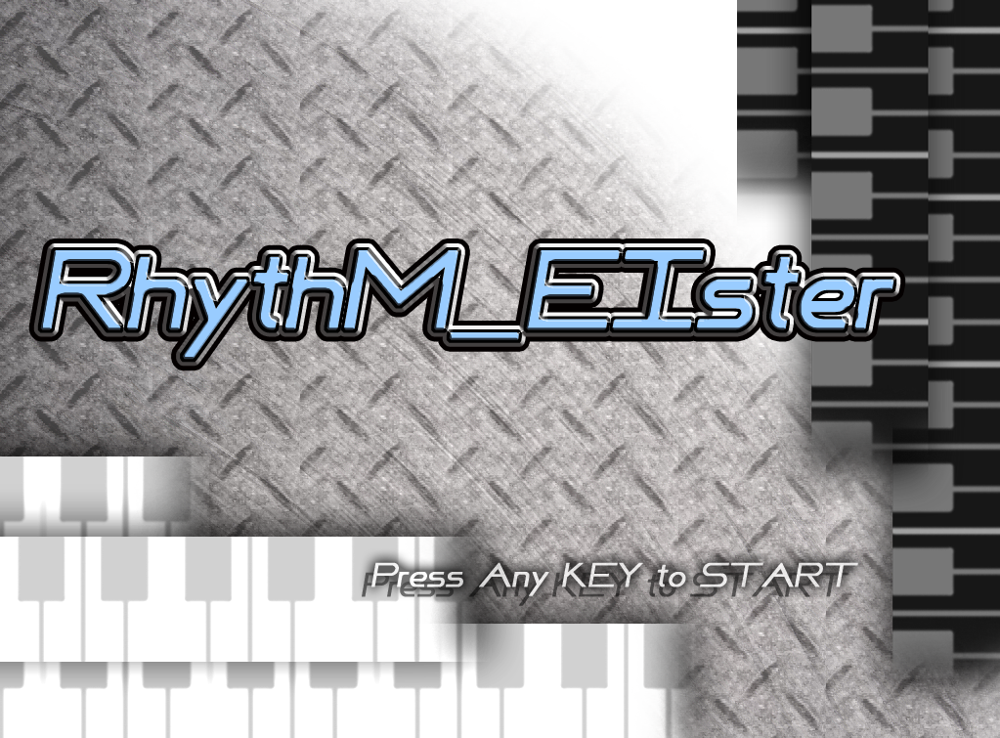
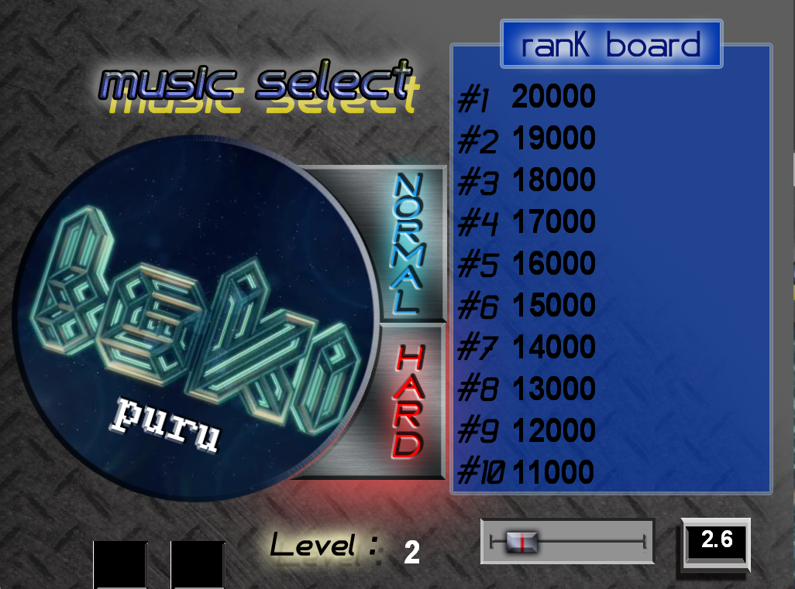
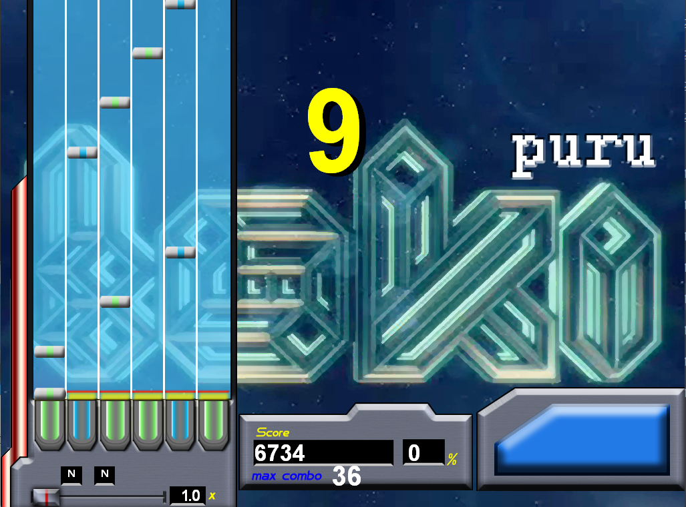
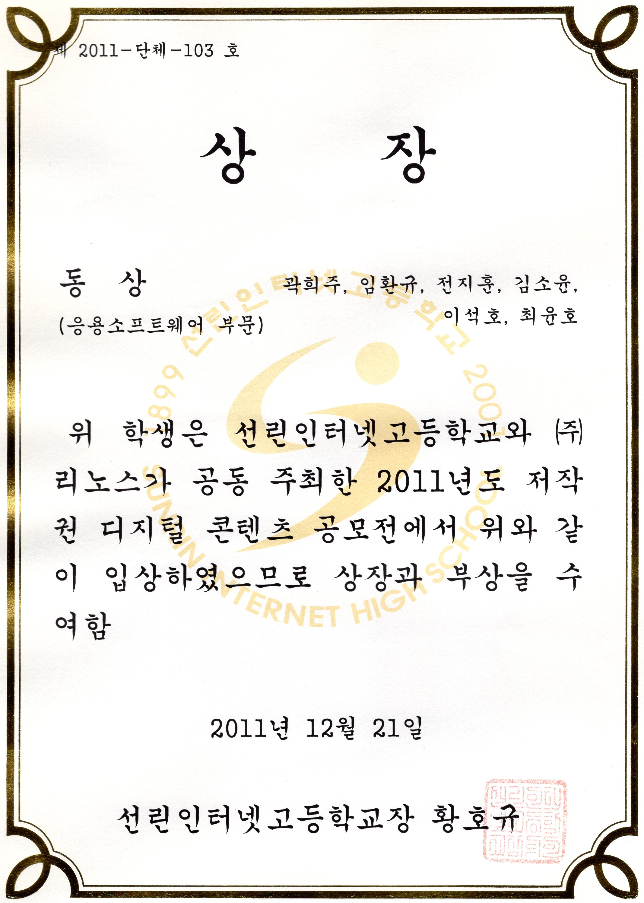

| 항목 | 내용 |
| --- | --- |
| 기간 | 2011.10 - 2011.12 |
| 소속 | 선린인터넷고등학교 |
| 역할 | 기획, 클라이언트 프로그래머 |
| 기술 | DirectX, C++ |

- 2011년도 선린인터넷고등학교 디지털 콘텐츠 경진대회 응용소프트웨어 부문 동상 수상
- BMS파일에 기반한 리듬게임
- 노트 제작이 가능하도록 에디터 구현
- [실행 파일 다운로드](https://drive.google.com/file/d/0BzRVCdwGHum_ZVFsQjVVTTJIZUE/view?usp=drive_link&resourcekey=0-8s69WJ3_oFlChYLc-Pr5Ig)
