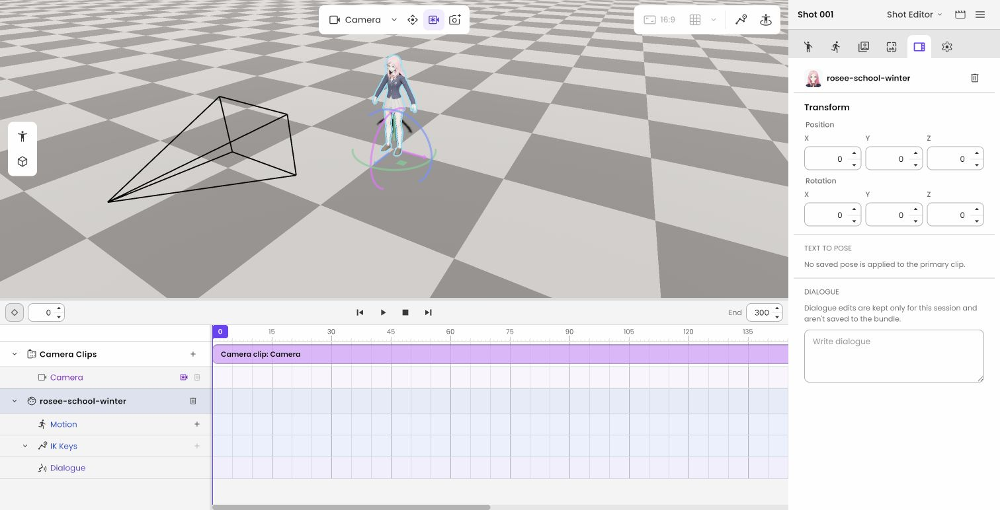
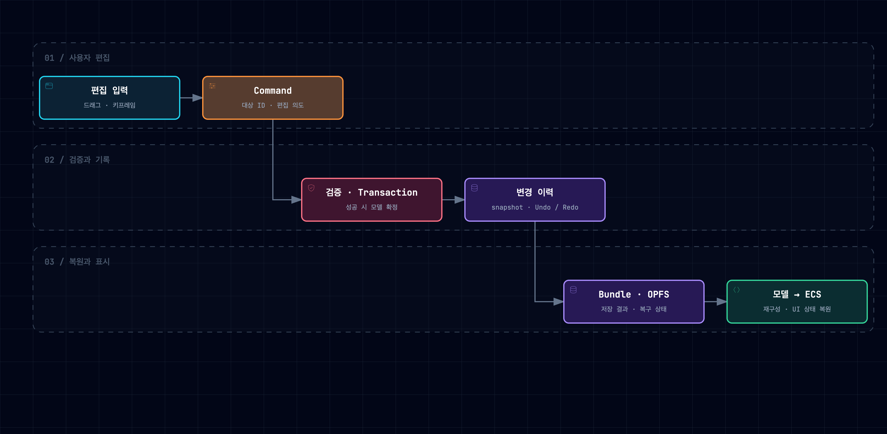
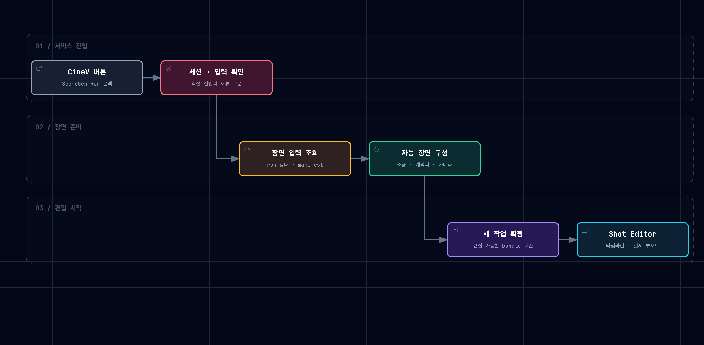
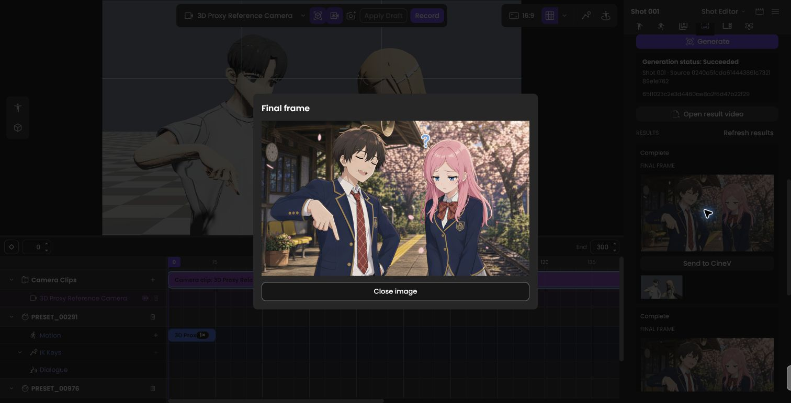
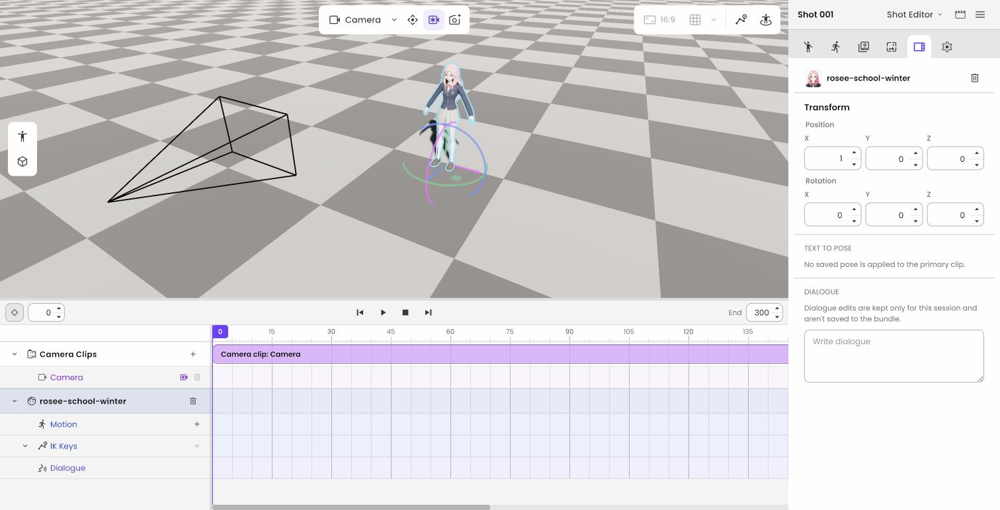
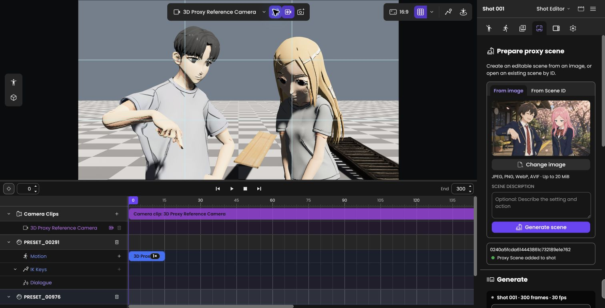
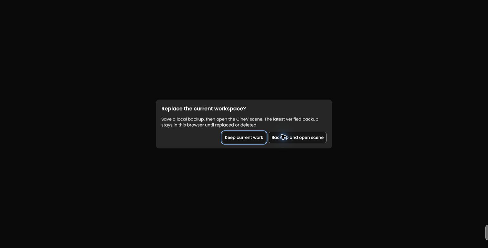

Shotloom은 생성형 영상 제작에 사용할 장면을 브라우저에서 편집하는 3D 도구다. 캐릭터를 가져와 배치하고 포즈와 카메라를 조정한 뒤, 그 구도를 다음 생성 단계로 전달한다. CineV의 이미지에서 편집기로 진입하고, 편집한 장면으로 새 샷을 만들어 CineV로 돌려보내는 흐름을 실제 배포 환경에서 확인했다.

나는 Unreal Engine 기반 CINEVStudio 개발에 이어, Rust·Bevy 환경에서 캐릭터 로딩, 편집 모델, Undo/Redo, 저장·복구, 타임라인과 생성 서비스 연동을 구현했다. 사용자의 조작이 UI·런타임·저장 데이터에 일관되게 반영되고, 작업을 다시 열거나 생성 결과를 이어 편집할 수 있는 구조를 만드는 일을 맡았다.


| 구분 | 내용 |
|---|---|
| 제품 | CineV 제작 흐름에 연결한 브라우저 3D 샷 편집기 |
| 주요 환경 | Rust, Bevy, WebAssembly, WebGPU, React, TypeScript |
| 직접 맡은 범위 | 캐릭터·자산, 편집·저장, 카메라·포즈·타임라인, 생성 파이프라인, 서비스 통합과 검증 |
| 팀과의 역할 구분 | 기술 스택 선정과 초기 scaffold는 팀이 담당. 나는 선택된 환경에서 구현·통합·검증을 진행 |

[코드 예제 다운로드](/projects/shotloom/editor-reliability-labs.zip) · [세부 구현](#전체-구현-사례) · [이력서](/resume/)

## Unreal 경험을 새 실행 환경으로 옮기기

CINEVStudio에서는 당시 Unreal Engine 기반 개발 프로세스의 반복 속도 때문에 AI 에이전트의 발전을 실제 개발 속도 향상으로 연결하기 어려웠다. Shotloom에서는 제품 모델과 실행 경로를 텍스트 기반 코드·계약·테스트로 다루며 개발 루프를 개선하고자 했다.

초기에는 T2M(Text to Motion)으로 움직이는 소스를 구성하는 접근을 다뤘다. 이후에는 영상 생성에 넘길 입력으로 포즈와 카메라 구도가 정해진 대표 샷을 제공하는 데 무게가 실렸다. 포즈 후보 선택, 캐릭터 배치, 카메라 편집과 이미지 생성이 하나의 사용자 흐름이 됐고, T2M 저작은 별도의 MotionSet 경계로 발전했다.

Unreal에서 다뤘던 좌표계, 애니메이션, 카메라와 에셋 로딩을 Rust의 소유권, Bevy의 ECS 생명주기, 브라우저의 비동기 로딩과 저장 제약에 맞춰 구현했다.

## 1. 화면에 보이는 장면과 저장할 문서를 구분하기

캐릭터가 움직이는 화면을 만드는 것과 편집기를 만드는 것은 요구가 다르다. 편집기에서는 같은 캐릭터를 뷰포트, Inspector, 타임라인과 저장 파일이 함께 가리켜야 한다. 사용자가 되돌리기를 누르면 화면만 움직이거나 모델만 복원되는 상태가 남아서는 안 된다.

Shotloom에서는 React가 저작 UI를, Rust 코어가 제품 모델과 검증을, Bevy가 실행과 렌더링을 맡는다. UI는 편집 의도를 command로 보내고, 확정된 결과는 event로 받는다. ECS의 entity와 component를 저장 형식으로 삼지 않고 shot·clip·asset을 표현하는 BundleModel을 유지했다.


[아키텍처 SVG 원본](/projects/shotloom/diagrams/02-architecture.svg)

### 캐릭터 로딩은 선택과 저장까지 이어져야 한다

VRM 로딩에서는 파일을 읽어 mesh를 띄우는 단계에 더해, AssetRef로 자산을 식별하고 Bevy entity로 구성하는 경로를 구현했다. 뷰포트 picking과 이동·회전 기즈모는 같은 제품 ID를 통해 Inspector와 연결했다. 가져오기 후보도 모두 영구 자산으로 저장하지 않고, 실제 저작 데이터에서 참조하는 시점에 프로젝트 자산으로 확정하는 경계를 다뤘다.

좌표 정규화에서는 모델의 방향만 맞추는 것으로 끝나지 않았다. backward VRM을 Y축 기준 180도 회전시키는 경로에서 SpringBone의 sphere·capsule collider와 중력 방향도 같은 좌표 변환을 받아야 했다. 누락된 보조 데이터를 해당 변환 범위의 노드에 맞춰 수정했다. 렌더링 외형과 물리 입력을 함께 확인해야 했던 사례다.



GPU를 사용하는 작은 기능도 별도의 생명주기가 필요했다. 캐릭터 헤드샷은 전용 카메라와 readback 경로에서 만들고, 자산 내용과 촬영 recipe가 달라지면 캐시를 구분하도록 했다. 썸네일을 만들었다는 이유로 사용자의 문서가 수정 상태가 되지 않도록 저작 상태와도 분리했다.

## 2. 드래그 한 번을 Undo 한 번으로 만들기

드래그 중에는 수많은 위치 값이 지나간다. 이를 모두 변경 이력으로 쌓으면 사용자는 한 번의 이동을 되돌리기 위해 여러 번 Undo를 눌러야 한다. 반대로 마지막 모델 값만 저장하면 취소와 검증 실패 때 돌아갈 기준이 없다.

BundleEditor의 mutation 경계에 검증, DirtySet과 snapshot 생명주기를 모았다. 연속 조작은 하나의 transaction으로 처리하고, 검증에 실패하면 부분 변경을 남기지 않도록 했다. persistent collection은 snapshot 사이의 구조 공유에 사용했다. 변경 이력의 의미와 모델→ECS 복원이 연결되어야 사용자가 기대하는 되돌리기가 된다.



아래는 이 경계를 작은 모델로 재작성한 예제다. 실제 제품은 Rust 기반이며, 여기서는 조작 단위의 이력을 설명하기 위해 TypeScript를 사용했다.

```ts title="드래그 여러 단계, Undo 한 번"
import { DocumentSession } from "./src/document-session.ts";

const editor = new DocumentSession({ items: [{ id: "actor", x: 0 }] });
editor.begin();
for (const x of [1, 2, 3]) {
  editor.edit(() => ({ items: [{ id: "actor", x }] }));
}
editor.finish(true);
editor.undo(); // x = 0
```

예제는 작은 문서를 복사·동결하고, 제품은 persistent collection으로 snapshot의 구조를 공유한다. 검증 실패 시 현재 상태 유지, 취소 시 시작 상태 복원, Undo 이후 새 편집의 redo 분기 정리를 검증한다.

### 저장 성공과 복구 가능성도 별개다

저장·복구에서는 파일 저장 결과를 UI에 정확히 돌려주고 OPFS 복구 상태를 표현했다. 선택 대상 같은 화면 상태는 문서의 저작 데이터와 구분했다. CineV에서 같은 생성 작업을 다시 열 때는 저장된 편집본을 복원하고, 다른 작업으로 교체할 때는 기존 작업의 백업이 완료된 뒤 교체하도록 했다.

```ts title="같은 작업 복원과 다른 작업 교체"
const previous = await store.read();
if (previous?.run === run) return previous;

const next = { run, content: await compose() };
if (previous) await store.backup(previous);
await store.replace(next);
```

이 순서의 전제는 호출자가 워크스페이스의 소유권 잠금을 갖고 있고, `backup`이 저장과 검증을 완료해야 성공한다는 것이다. 공개 예제에서는 저장 어댑터를 주입해 백업 실패가 기존 문서를 지우지 않는지 확인한다.


## 3. 카메라와 포즈의 회전 의미를 다르게 다루기

카메라를 0도에서 720도로 회전시키는 의도는 시작과 끝이 같은 방향이라는 이유로 사라지면 안 된다. 반면 bone pose는 두 방향 사이의 안정적인 회전 보간이 필요하다. 두 데이터를 같은 방식으로 다루면 저작자가 입력한 의미를 잃는다.

schema 4 전환에서는 프레임과 독립적인 key ID를 두고, camera의 unbounded Euler scalar와 bone별 quaternion pose를 구분했다. 키를 다른 프레임으로 옮겨도 같은 키로 식별하고, 위치·회전의 일부 채널만 편집할 수 있도록 모델·평가기·writer와 UI를 연결했다.

```ts title="회전 횟수와 회전 방향"
import { scalarCameraAngle, poseRotation } from "./src/animation.ts";

scalarCameraAngle(0, 720, 0.5); // 360: 두 바퀴 회전 의도 보존
poseRotation([0, 0, 0, 1], [0, 0, 0, -1], 0.5);
// quaternion의 부호가 반대여도 같은 방향
```

이 기능은 평가기를 바꾸는 것으로 끝나지 않았다. 구조화된 키 복사·붙여넣기, 카메라 rebake의 사전 검증, 이전 schema의 업그레이드와 복구까지 함께 다뤘다. 붙여넣기는 일부 키만 반영된 상태를 남기지 않아야 하고, 업그레이드는 원본을 보존한 복사본에서 검증할 수 있어야 했다.

### 비동기 편집 요청의 순서를 지키기

UI가 재시도한 요청을 새 편집으로 처리하면 키가 두 번 바뀔 수 있다. 오래된 화면이 보낸 명령이 최신 상태를 덮어쓰는 문제도 있다. shot revision과 transaction ID를 검사하고, 이미 처리한 동일 요청에는 같은 결과를 반환하도록 했다. 같은 ID에 다른 내용을 넣는 경우는 거부했다.

```ts title="같은 요청의 재전송"
import { RevisionGate } from "./src/revision-gate.ts";

const gate = new RevisionGate("document-a");
const command = { id: "edit-1", epoch: "document-a", revision: 0, payload: "move:3" };
let applied = 0;
const first = gate.execute(command, () => { applied += 1; });
const retry = gate.execute(command, () => { applied += 1; });
console.assert(first === retry && applied === 1);
```

중복 이력은 메모리에 무제한으로 쌓지 않는다. 제품에서는 epoch와 4,096개 FIFO 경계를 명시했다. 공개 예제 역시 bounded cache를 사용하며, 프로세스가 재시작돼도 유지되는 exactly-once 보장을 제공하지는 않는다.


## 4. 느린 런타임에 입력을 끝없이 쌓지 않기

타임라인 scrub에서는 사용자의 입력 속도가 실제 처리를 앞설 수 있다. 모든 중간 프레임을 순서대로 실행하면 포인터가 멈춘 뒤에도 화면이 뒤늦게 따라오고, 처리하지 못한 요청이 누적된다.

이 문제에서 보존해야 할 것은 지나간 모든 입력보다 현재 사용자의 의도였다. 진행 중인 작업 하나와 최신 대기 입력 하나를 유지하는 방식으로 입력 누적을 줄였다. manual scrub·play·pause·stop은 대기 drag를 대체하고, shot을 바꾼 뒤 이전 shot의 intent가 적용되지 않도록 했다.

공개 예제는 그중 하나의 비동기 실행기와 최신 의도를 다룬다. 실패하면 호출자에게 오류를 돌려주고, 종료할 때는 진행 중인 작업이 끝날 때까지 기다린다.

```ts title="최신 입력 하나만 대기시키기"
import { LatestIntent } from "./src/latest-intent.ts";

const applied: number[] = [];
const scrub = new LatestIntent<number>(async frame => { applied.push(frame); });
const requests = [10, 20, 30].map(frame => scrub.submit(frame));
await Promise.all(requests);
console.assert(applied.at(-1) === 30);
await scrub.close();
```

수정 후 50회 반복 scrub에서 점진적인 지연과 선형 RSS 증가가 재현되지 않았고, 30개 CameraKey를 둔 Pilot의 최종 frame 정합성을 확인했다. 일반화 예제에는 별도로 10,000개 입력을 주입해 처리 중인 요청과 마지막 의도만 전달되는지 검증하는 테스트를 두었다.

## 5. 생성 입력과 실제 결과물이 같은 작업을 가리키게 하기

S2M 결과에는 인물, shot, camera와 외부 자산 참조가 함께 들어온다. 이 입력을 브라우저와 CLI에서 각각 해석하면 같은 작업이 서로 다른 장면이 될 수 있다. production bundle compiler를 호스트 중립 Rust 코드로 모으고, 파일·네트워크 I/O는 호스트 어댑터에 두었다. 자산 준비와 검증을 거친 결과가 제품 번들로 확정되도록 구성했다.


포즈 생성에서도 provider 정책과 transport를 분리했다. preview는 본문 데이터와 함께 보존하되, 부가 preview가 손상됐다는 이유만으로 유효한 문서 전체를 열지 못하게 하지 않았다.


### hash를 계산한 입력으로 실제 렌더하기

검증한 파일과 renderer가 읽은 파일이 다르면 결과의 출처를 설명할 수 없다. 같은 URL도 다시 읽는 시점에는 다른 내용일 수 있다. render provenance에서는 입력 bytes를 캡처하고, 그 bytes의 hash와 실제 renderer가 소비하는 입력을 연결했다.

```ts title="한 번 캡처한 입력의 출처 기록"
import { renderCaptured } from "./src/artifact-pipeline.ts";

const input = new Uint8Array([1, 2, 3]);
const result = await renderCaptured(input, async bytes => bytes.slice());
console.assert(result.digest.length === 64); // SHA-256
```

위 예제의 renderer는 입력을 복사하는 합성 어댑터다. 테스트에서는 캡처 직후 원본 배열을 바꿔도 hash와 renderer 입력이 같은 캡처에서 나오는지 확인한다.

출력 단계에도 완료의 기준이 필요했다. 카메라 출력은 WebM 성공 이후 첫·마지막 PNG를 만들고 패키지로 발행하는 순서로 구성했다. PNG 추출이나 발행만 실패하면 앞서 성공한 렌더를 다시 수행하지 않도록 재시도 범위를 나눴다.


API의 성공 상태만으로도 충분하지 않았다. 과거 배포 검증에서는 64×32 회색 대체 이미지와 실제 1280×720 렌더를 구분했고, 부분 오류를 포함한 상태도 그대로 기록했다. 파일이 있다는 사실과 사용자가 기대한 장면이 있다는 사실을 각각 확인했다.

## 6. CineV에서 들어와 추가 샷으로 돌아가기

사용자가 원래 작업하던 서비스에서 편집기를 열 수 있어야 통합이 완성된다. CineV의 SceneGen 작업 문맥을 받아 입력 상태를 검증하고, 캐릭터·소품·카메라를 편집 가능한 장면으로 구성하는 진입 흐름을 구현했다. 같은 작업을 다시 여는 경우와 다른 작업으로 교체하는 경우는 저장·복구 정책으로 구분했다.



Chrome의 CineV 배포 환경에서 다음 사용자 흐름을 확인했다.

1. CineV 스토리보드의 기존 이미지에서 **Edit 3D Shot → Open in Shotloom**을 선택했다.
2. 앱의 백업 후 열기 흐름으로 기존 작업을 보존하고 새 proxy 장면을 가져왔다.
3. 카메라 FOV를 26에서 34로 바꿨다.
4. 새 샷 하나를 생성하고 실제 이미지 내용을 확인했다.
5. **Send to CineV**를 누른 뒤 **Sent to CineV** 상태를 확인했다.
6. CineV를 다시 불러와 새 **SceneGen result** 카드 한 개를 확인했다.




검증 환경은 `dev.cinev.com`과 `shotloom-dev.cinev.com`이다.

## 7. AI 에이전트의 구현을 제품 검증으로 연결하기

AI 에이전트가 구현할 변경 범위와 계약이 불분명하면 각 작업이 서로 다른 가정을 세울 수 있다. 큰 기능을 독립적으로 검토할 수 있는 단위로 나누고, 선행 조건과 완료 기준을 함께 정의했다.

Shotloom의 초기 저장소 탐색 경로와 문서 기반은 팀이 만들었다. 나는 그 위에서 Spec·ADR·계약을 작업과 연결하고, 큰 변경을 독립적으로 구현·검토 가능한 단위로 진행했다. schema 4 전환은 문서와 계약, 모델·평가기, transaction, bridge, UI, 붙여넣기, rebake, 복구와 활성화를 12개 의존 작업으로 나눈 사례다.


구현과 독립 리뷰를 분리하고 검토한 commit과 실제 반영할 commit이 같은지 확인했다. 코드가 바뀌면 검토를 갱신했다. 런타임 검증에서도 `engine_ready` 이후의 오류를 감지하도록 smoke를 보완해, 준비 이벤트를 받은 직후 GPU 오류가 발생했는데도 성공으로 끝나는 문제를 수정했다.

모델과 추론 수준은 문서·커뮤니티의 활용 방법과 실제 작업 결과를 바탕으로 조정했다. 컴파일과 단위 테스트, 실제 브라우저 실행, 입력·렌더 결과 대조를 서로 다른 검증 단계로 두었다.

## 코드 예제

[Editor Reliability Labs](/projects/shotloom/editor-reliability-labs.zip)는 편집·회전·비동기 처리·복구 로직을 합성 데이터로 일반화한 독립 예제다. Node.js 24 이상에서 설치 없이 실행할 수 있다.

```sh
node --test test/*.test.ts
node demo.ts
```

| 모듈 | 읽을 내용 |
|---|---|
| `document-session.ts` | 후보 검증, transaction, Undo/Redo와 immutable snapshot |
| `latest-intent.ts` | 진행 중 하나와 최신 대기 입력 하나, 종료와 실패 처리 |
| `revision-gate.ts` | stale revision, 동일 요청 재전송, ID 충돌과 bounded dedupe |
| `animation.ts` | 카메라 다회전, quaternion 보간과 키 식별 |
| `asset-boundaries.ts` | 업로드 제한, 좌표 변환, 중복 로딩과 캐시 |
| `selection.ts` | 정확한 대상 선택과 optional preview 실패 격리 |
| `artifact-pipeline.ts` | 입력 bytes 고정, 단계별 출력과 재시도 |
| `recovery.ts` | 같은 작업 복원, 백업 후 다른 작업으로 교체 |

2026년 9월 11일 Node.js 24.15.0에서 테스트 17개를 통과했고 TypeScript 5.9.3 strict 검사를 완료했다. [README](/projects/shotloom/code-labs/README.md)에 어댑터의 전제와 생략한 범위를, [테스트 코드](/projects/shotloom/code-labs/test/reliability.test.ts)에 실패 주입 사례를 남겼다. 프로세스를 넘는 내구성, 실제 GPU renderer와 파일시스템의 원자적 발행은 이 샘플의 구현 범위 밖이다.

### 로컬 검증의 제한

로컬에서 VRM import, 포즈 후보 생성·할당, 카메라 키, 저장 후 재열기를 확인했다. Export는 초기 준비 단계의 `INITIAL_READINESS_FAILED`로 실패해 출력 완료를 확인하지 못했다. 초기 실행의 `wgpu createBuffer RangeError`도 원인 확인이 남아 있다.

## 전체 구현 사례

캐릭터 로딩부터 편집 모델, 타임라인, 생성 파이프라인과 서비스 통합까지 구현한 세부 기능이다.

<div class="project-cases">

### 캐릭터를 편집 가능한 3D 자산으로 가져오기

<details id="case-01"><summary>01. VRM 로딩과 프로젝트 자산 참조 연결</summary>

VRM 캐릭터를 화면에 표시한 뒤에도 편집기가 계속 다룰 수 있어야 했다. 파일을 가져오는 과정, 프로젝트 안에서 자산을 식별하는 과정, Bevy가 캐릭터 entity를 만드는 과정이 이어져야 선택과 타임라인 기능도 같은 대상을 참조한다.

VRM 로드 시스템과 `AssetRef` 기반 런타임 로딩 파이프라인을 구현했다. 파일과 자산의 식별을 ECS에서의 실체화와 연결해, 가져온 캐릭터를 이후 배치·선택·변환 기능에서 사용하는 기반을 마련했다.


</details>

<details id="case-02"><summary>02. VRM 방향 정규화에 SpringBone 데이터 포함</summary>

backward VRM을 Y축으로 180도 회전해도 SpringBone의 collider와 중력 방향이 그대로면 머리카락과 의상 움직임이 모델 방향과 어긋난다. 외형이 바르게 보이는지만 확인해서는 놓치는 문제였다.

180Y 정규화에서 빠진 SpringBone 보조 데이터를 수정했다. sphere·capsule collider와 gravity 방향에도 변환을 적용하되, 해당 변환 범위에 속하는 노드를 기준으로 처리했다. 모델의 회전과 물리 입력이 같은 좌표계를 사용하도록 맞췄다.

```ts title="일반화 코드 예제"
const collider = rotateY180([1, 0, 2]);
const gravity = rotateY180([0, -1, 0]);
// collider: [-1, 0, -2], gravity: [0, -1, 0]
```

[구현 코드](/projects/shotloom/code-labs/src/asset-boundaries.ts)

</details>

<details id="case-03"><summary>03. VRM 로딩 전에 업로드 용량 검사</summary>

사용자 파일을 메모리에 쌓은 뒤 크기 문제로 실패하면 실제 자산 로딩에 도달하기 전부터 런타임이 압박을 받는다. 실패할 입력을 어디까지 받아들일지 업로드 단계에서 결정할 필요가 있었다.

VRM upload staging에 용량 제한과 preflight 검사를 적용했다. 실제 자산 로딩으로 넘기기 전에 허용 가능 여부를 판단하고, 제한을 넘은 입력에는 오류를 반환하도록 구성했다. 파일 입력과 런타임 로딩 사이에 자원 사용을 제한하는 경계를 뒀다.

```ts title="일반화 코드 예제"
admitSizes([4, 4], 5, 8); // 허용
admitSizes([4, 5], 5, 8); // 누적 예산 초과 → 예외
```

[구현 코드](/projects/shotloom/code-labs/src/asset-boundaries.ts)

</details>

<details id="case-04"><summary>04. 뷰포트 선택·기즈모·Inspector의 상태 일치</summary>

뷰포트에서 선택한 캐릭터, Inspector가 보여주는 대상, 저장되는 transform이 다르면 사용자는 어느 상태가 맞는지 알 수 없다. 기즈모 입력을 화면에 반영하는 것과 문서에 남기는 것을 함께 다뤄야 했다.

캐릭터 picking과 이동·회전 기즈모를 구현하고 모델→ECS 동기화 기반에 연결했다. 편집 대상을 안정적인 제품 ID로 식별해 UI와 런타임이 같은 선택·변환을 표현하도록 구성했다. 화면 조작이 영속 모델과 연결되는 편집 경로를 만들었다.



</details>

### 문서 변경·Undo·저장에 공통 규칙 두기

<details id="case-05"><summary>05. 제품 번들 모델과 구조를 공유하는 snapshot</summary>

ECS 내부 구조를 그대로 저장하면 엔진 구현이 파일 형식과 Undo 이력에 묶인다. 문서 snapshot을 만들 때 큰 컬렉션을 매번 전부 복사하는 방식도 편집 데이터가 늘어날수록 부담이 된다.

제품 번들 모델과 persistent collection 도입을 담당했다. shot·clip·asset을 제품 데이터로 유지하고, 구조를 공유하는 컬렉션을 Undo/Redo snapshot 기반에 적용했다. 엔진 상태와 문서 상태를 분리하고, 변경하지 않은 컬렉션은 snapshot 사이에서 공유하도록 했다.

</details>

<details id="case-06"><summary>06. 검증·DirtySet·snapshot을 하나의 변경 경계로 통합</summary>

명령마다 모델을 직접 수정하면 validation에 실패한 뒤 부분 변경이 남거나, 실제 데이터와 dirty 표시·Undo snapshot이 어긋날 수 있다. 수정 이후의 정리 작업을 각 호출자가 빠짐없이 수행하기도 어렵다.

`BundleEditor` mutation facade와 `DirtySet`을 구현해 모델 변경을 검증된 경로로 모았다. 실패 시 rollback과 dirty·snapshot의 생명주기를 함께 다뤘다. 변경 명령이 공통 경계를 통과하도록 만들어 검증 결과와 편집 이력을 일관되게 처리했다.

```ts title="일반화 코드 예제"
editor.begin();
editor.edit(() => ({ items: [{ id: "actor", x: 3 }] }));
editor.finish(true); // 검증을 통과한 조작만 이력으로 확정
```

[구현 코드](/projects/shotloom/code-labs/src/document-session.ts)

</details>

<details id="case-07"><summary>07. 연속 드래그를 한 번에 되돌리는 Undo/Redo</summary>

드래그 중 발생한 모든 프레임이 Undo 한 칸씩 쌓이면 사용자가 수행한 조작 단위와 이력이 맞지 않는다. 모델을 되돌려도 ECS가 이전 상태를 계속 표시한다면 화면 역시 복원되지 않는다.

Undo/Redo의 하위 구현을 관리하고 모델 snapshot과 ECS 재동기화를 연결했다. transaction의 시작·확정·취소와 history entry의 의미를 구분해, 연속 입력을 하나의 편집 조작으로 다룰 기반을 만들었다. 되돌리기를 이력 저장과 런타임 복원의 문제로 함께 처리했다.

```ts title="일반화 코드 예제"
editor.begin();
for (const x of [1, 2, 3]) {
  editor.edit(() => ({ items: [{ id: "actor", x }] }));
}
editor.finish(true);
editor.undo(); // 드래그 시작 전 위치로 한 번에 복원
```

[구현 코드](/projects/shotloom/code-labs/src/document-session.ts)

</details>

<details id="case-08"><summary>08. 미리보기 후보와 확정된 프로젝트 자산 분리</summary>

검색하거나 미리 보는 후보가 곧바로 프로젝트 자산이 되면 취소한 입력도 번들에 남을 수 있다. 파일을 다운로드한 상태와 사용자가 그 결과를 편집에 채택한 상태를 구분해야 했다.

저장 기반과 생성 모션의 프로젝트 자산 등록 작업에서 임시 후보와 실제 authored reference가 생긴 상태를 나눴다. 생성 결과를 선택하고 clip이 참조하는 시점을 영속 모델에 연결했다. 후보를 살펴보는 과정과 문서에 확정하는 과정의 책임을 분리했다.

</details>

<details id="case-09"><summary>09. 명시적 저장과 OPFS 복구 상태 구분</summary>

사용자가 저장한 파일과 브라우저의 복구 snapshot은 보존 범위가 다르다. 저장 API 호출이 끝났다는 이유만으로 모든 작업이 보존됐다고 표시하면, 실패 후 사용자가 선택할 행동도 불분명해진다.

OPFS recovery 상태와 재시도 UX를 구현하고 Bundle Save Result 계약을 정리했다. 저장과 복구가 보장하는 범위를 결과에 드러내고 실패 시 재시도할 경로를 마련했다. 저장 버튼 이후의 성공·실패·복구 상태를 편집기 기능으로 다뤘다.

```ts title="일반화 코드 예제"
const document = await enterWorkspace(runId, store, compose);
// 같은 run: restore
// 다른 run: compose → backup 성공 → replace
```

[구현 코드](/projects/shotloom/code-labs/src/recovery.ts)


</details>

<details id="case-10"><summary>10. 문서와 별개로 선택·패널 상태 복원</summary>

선택한 캐릭터와 패널 상태는 작업을 이어가는 데 필요하지만 shot 내용 자체와 같은 데이터는 아니다. 편집 맥락을 본문 변경과 섞으면 dirty와 Undo 정책이 복잡해지고, 사라진 선택 대상 때문에 문서 로드까지 실패할 수 있다.

`editor_state.json`의 soft state 저장·복원을 구현했다. `selected_ids` 같은 편집 맥락을 보존하면서 복원할 수 없는 참조가 문서 로드를 막지 않도록 했다. 문서의 의미를 갖는 데이터와 사용 환경의 편의를 위한 상태를 구분했다.

</details>

<details id="case-11"><summary>11. 번들 내부 경로의 읽기 범위 검증</summary>

가져온 번들에 적힌 asset 경로를 그대로 신뢰하면 번들 밖의 파일을 참조할 수 있다. 모델에서 유효하다고 받아들인 경로와 실제 파일 reader가 읽는 범위가 일치해야 했다.

`BundleManifest`와 asset reader의 path traversal 검증을 강화했다. 번들이 선언하는 상대 경로를 검사하고 잘못된 경로는 거부하도록 구성했다. 외부 콘텐츠를 프로젝트 자산으로 받아들이는 과정에서, 파일을 읽는 경계까지 검증 대상에 포함했다.

</details>

### 생성 결과를 미리 보고 편집 데이터로 확정하기

<details id="case-12"><summary>12. 편집 장면을 건드리지 않는 헤드샷 썸네일</summary>

캐릭터를 파일명으로만 보여주면 자산을 고르기 어렵다. 썸네일을 만들기 위해 편집 카메라나 조명을 바꾸거나 문서에 dirty 상태를 남기는 방식도 적절하지 않았다.

전용 256×256 캡처 rig, head bone 기반 framing, GPU readback과 PNG 생성 경로를 구현했다. React는 요청·표시를 맡고 실제 렌더는 Bevy가 담당하게 했다. 모델과 캡처 조건을 반영한 cache key로 결과를 재사용하며, 편집 문서와 썸네일 생성의 상태를 분리했다.

```ts title="일반화 코드 예제"
const cacheKey = thumbnailKey("content-digest", "head-rig-v2", 256);
const thumbnail = await cache.get(cacheKey, renderHeadshot);
// 실패한 promise는 캐시에서 제거되어 다음 요청이 재시도할 수 있다.
```

[구현 코드](/projects/shotloom/code-labs/src/asset-boundaries.ts)


</details>

<details id="case-13"><summary>13. 생성 모션을 저장·재사용 가능한 자산으로 등록</summary>

T2M 서비스에서 받은 모션을 한 번 재생하는 것과 프로젝트에 저장해 여러 clip에서 사용하는 것은 별도 작업이다. 외부 생성 결과가 타임라인에 배치된 뒤에도 프로젝트 내부에서 같은 자산으로 식별돼야 했다.

T2M motion set을 프로젝트 자산으로 등록하고 사용하는 흐름을 구현했다. 서비스의 생성 결과와 프로젝트 내부 참조를 연결해 타임라인 편집과 저장·재사용에 참여하도록 했다. 생성 기능의 범위를 응답 수신에서 자산의 생명주기까지 이어 붙였다.

</details>

<details id="case-14"><summary>14. Text2Pose 공통 정책과 host별 통신 분리</summary>

브라우저와 네이티브가 생성 응답을 각각 해석하면 같은 입력도 다르게 허용할 수 있다. 임시 preview와 확정된 포즈를 판단하는 정책도 실행 환경에 따라 갈라지지 않아야 했다.

공유 Rust T2P provider pipeline과 Web transport adapter를 구현했다. 응답 parsing과 적용 정책은 공통 경로에 모으고, 요청을 전달하는 host별 transport를 분리했다. 로컬 개발에서는 browser-direct adapter로 요청을 전달하고 공통 provider 정책을 검증했다.


</details>

<details id="case-15"><summary>15. 포즈 preview 보존과 부분 손상 격리</summary>

생성 결과를 선택한 뒤 작업을 다시 열었을 때 preview가 사라지면 당시의 선택 맥락을 잃는다. 반대로 선택적인 preview 데이터의 손상 때문에 핵심 편집 데이터까지 열리지 않아서도 안 된다.

검증된 Text2Pose preview를 bundle에 보존하는 persistence를 구현했다. 저장 가능한 snapshot과 부가 preview의 복원 실패를 구분해 처리했다. 선택적 데이터가 손상돼도 주된 작업은 열 수 있도록 복원 범위를 나눴다.

```ts title="일반화 코드 예제"
const preview = optionalPreview(decodeThumbnail);
if (preview.kind === "unavailable") showPlaceholder();
// preview 실패는 문서의 검증 결과와 분리한다.
```

[구현 코드](/projects/shotloom/code-labs/src/selection.ts)


</details>

<details id="case-16"><summary>16. S2M 원본을 편집 가능한 shot 구조로 변환</summary>

storyboard 생성 결과의 인물·shot·camera template는 그대로 편집기 모델이 되지 않는다. 입력을 해석하면서 아직 해결하지 못한 clip을 조용히 버리면 원본과 편집 결과의 관계도 끊어진다.

S2M dry import 기반과 resolved camera template 적용을 구현했다. 원본 parsing, 미해결 clip 표현, 결정적인 shot scaffold 생성을 분리했다. 외부 생성 결과를 내부 번들로 옮기면서 해결된 입력과 아직 남은 입력을 구분해 보존하도록 구성했다.

</details>

<details id="case-17"><summary>17. Web·CLI가 공유하는 번들 컴파일러</summary>

브라우저 import와 서비스의 native 생성 경로가 별도 로직으로 자라면 같은 S2M 입력에서도 서로 다른 번들이 나올 수 있다. IO 환경의 차이와 번들을 구성하는 정책을 구분할 필요가 있었다.

target-neutral Rust production compiler를 구현하고 `PreparedBundleArtifacts`와 host IO 경계를 분리했다. 자산 해석·컴파일·finalization을 나누고, Asset Library와 연결되는 최종 번들 반영을 트랜잭션 경계에서 처리했다. 실행 환경이 달라도 번들 구성의 공통 판단은 공유하도록 했다.

</details>

### 요청한 장면과 실제 렌더 결과를 일치시키기

<details id="case-18"><summary>18. 렌더할 shot·clip·camera를 명시적으로 선택</summary>

첫 shot이나 첫 camera를 암묵적으로 선택하면 요청은 성공해도 사용자가 원한 결과와 다를 수 있다. 이름이 중복되는 입력에서는 단일 식별자로 대상을 고르는 것도 충분하지 않았다.

shot·clip·camera exact tuple selector와 representative frame을 구현했다. 서비스 입력은 명시적인 source scene/shot pair로 선택하도록 했다. 로컬의 실제 CLI로 첫 번째가 아닌 shot의 round-trip을 실행해, 요청한 대상이 번들 구성부터 렌더까지 이어지는지 검증했다.

```ts title="일반화 코드 예제"
const selected = selectExact(shots, {
  scene: "scene-b", shot: "shot-1", camera: "wide",
}); // 정확히 하나가 아니면 실패
```

[구현 코드](/projects/shotloom/code-labs/src/selection.ts)

</details>

<details id="case-19"><summary>19. 실제 렌더 입력 bytes와 출처 기록 연결</summary>

이미지의 입력 출처를 남겨도 해시를 계산할 때 읽은 파일과 renderer가 읽은 파일이 달라지면 재현 근거가 되지 못한다. 출처 기록이 실제 실행에 사용한 데이터와 일치해야 했다.

source artifact registry, 공유 bundle-description projector, authored camera의 `render_input` provenance를 구현했다. 렌더에 쓰는 불변 payload bytes와 해시를 연결해 기록과 실행 입력의 일치를 다뤘다. 파일을 확인한 시점과 사용하는 시점 사이의 차이까지 고려했다.

```ts title="일반화 코드 예제"
const receipt = await renderCaptured(inputBytes, render);
console.log(receipt.digest); // 렌더에 사용한 캡처의 SHA-256
writeImage(receipt.image);
```

[구현 코드](/projects/shotloom/code-labs/src/artifact-pipeline.ts)

</details>

<details id="case-20"><summary>20. 모든 카메라 이미지를 하나의 결과 집합으로 확정</summary>

여러 authored camera를 순서대로 렌더하다 중간에 실패하면 일부 파일만 남는다. 소비자가 그 디렉터리를 완성 결과로 읽으면 누락된 카메라를 정상 출력으로 오해할 수 있다.

CLI `render images`에서 all-camera artifact set을 원자적으로 생성하는 경로를 구현했다. 전체 결과를 준비하는 단계와 외부에 완료 결과로 노출하는 단계를 분리했다. 개별 이미지 파일이 생겼다는 사실과 요청한 결과 집합이 완성됐다는 사실을 구분했다.

```ts title="일반화 코드 예제"
const output = new OutputSession({
  renderVideo, extractFrames, publish,
});
await output.run(); // 모든 선행 단계가 성공해야 publish 호출
```

[구현 코드](/projects/shotloom/code-labs/src/artifact-pipeline.ts)

</details>

<details id="case-21"><summary>21. 서비스 상태와 실제 이미지 내용을 따로 검증</summary>

API가 성공을 반환하고 이미지 파일이 있어도 실제 장면을 렌더했다고 단정할 수 없다. 기존 경로의 64×32 회색 대체 이미지와 캐릭터·장면이 담긴 결과를 구분해야 했다.

수정 배포 후 Public Shotloom previz의 실제 artifact를 재검증했다. 1280×720 이미지에 캐릭터와 장면이 렌더된 것을 확인했다. 해당 run에는 `succeeded_with_errors` 상태가 남아 있어 실렌더 결과와 부분 오류를 함께 기록했다.

</details>

### 키프레임의 의미를 보존하며 편집·변환·출력하기

<details id="case-22"><summary>22. 카메라·포즈 키프레임을 typed leaf channel로 전환</summary>

키를 프레임 번호나 큰 묶음 값으로만 식별하면 시간을 옮기거나 일부 축을 편집할 때 정체성과 의미가 불안정해진다. 여러 바퀴 도는 카메라 회전과 bone pose에도 같은 보간 규칙을 적용할 수 없었다.

schema 4 전환을 관리하고 typed leaf channel 모델·평가기·writer 활성화를 구현했다. 프레임과 독립적인 key ID, 카메라의 unbounded Euler scalar, bone별 quaternion pose를 구분했다. 0→720→-720도 같은 회전 저작 의도를 파일 모델과 평가 과정에 보존하도록 설계했다.

```ts title="일반화 코드 예제"
scalarCameraAngle(0, 720, 0.5); // 360°, 두 바퀴 의도 보존
poseRotation([0, 0, 0, 1], [0, 0, 0, -1], 0.5);
// quaternion 부호가 반대여도 같은 회전
```

[구현 코드](/projects/shotloom/code-labs/src/animation.ts)


</details>

<details id="case-23"><summary>23. revision·idempotency로 중복 키 편집 제어</summary>

UI의 재시도나 중복 전달은 같은 편집을 두 번 적용할 수 있다. 오래된 화면에서 보낸 명령이 더 최근 shot 상태를 수정하는 문제도 구분해서 처리해야 했다.

shot revision과 idempotent leaf-key transaction을 구현했다. 동일 transaction ID·payload의 재전송은 중복으로 처리하고, 같은 ID에 다른 payload를 보내면 거부했다. epoch와 4096개 FIFO 이력 경계를 명시해 중복 판정의 범위를 정했다.

```ts title="일반화 코드 예제"
const command = { id: "edit-1", epoch: "doc-a", revision: 0, payload: "move:3" };
const first = gate.execute(command, applyAtomically);
const retry = gate.execute(command, applyAtomically);
console.assert(first === retry); // 부작용은 한 번
```

[구현 코드](/projects/shotloom/code-labs/src/revision-gate.ts)

</details>

<details id="case-24"><summary>24. 타입·rig·용량을 검사하는 키 복사·붙여넣기</summary>

키를 다른 clip에 붙일 때 타입이나 rig가 맞지 않으면 일부 키만 반영된 채 실패할 수 있다. 대량 붙여넣기에서도 허용량과 변경 원자성을 함께 보장해야 했다.

typed structured copy/paste를 구현했다. 세션 clipboard에서 타입과 rig 호환성을 검사하고 최대 4096개 키·1MiB payload를 허용하며 원자적인 replace를 수행했다. 복사 데이터는 편집기 세션 안에서 유지하고, 호환되는 타입과 rig에만 붙여넣도록 했다.

</details>

<details id="case-25"><summary>25. 카메라 모드 변경 전에 구도 보존 여부 검사</summary>

Absolute와 Target 카메라는 저장한 값의 의미가 다르다. 모드만 바꾸면 기존 카메라의 화면 구도가 달라질 수 있어, 전환 후 평가 결과를 확인할 과정이 필요했다.

모드 변경을 preflight rebake로 구현했다. 전환 가능 여부와 오류를 먼저 확인하고 허용 오차를 평가한 뒤 확정하도록 구성했다. 위치 1e-4와 각도 0.01도를 검증 기준에 포함해, 표현 방식을 바꾸는 과정에서 기존 결과가 유지되는지 판단하도록 했다.

</details>

<details id="case-26"><summary>26. schema 4 업그레이드 시 원본과 복구 사본 보존</summary>

새 keyframe schema를 활성화하며 기존 번들을 바로 덮어쓰면 변환 실패나 재열기 실패가 원본 손실로 이어질 수 있다. 변환 결과를 만드는 것뿐 아니라 이전 작업으로 돌아갈 경로가 필요했다.

schema 4 Upgrade Copy와 검증된 OPFS recovery snapshot 경로를 구현했다. 원본을 보존한 사본을 업그레이드하고 변환 결과를 검증하도록 했다. 파일 형식을 바꾸는 작업에 원본 보존과 복구 경로를 함께 포함했다.

</details>

<details id="case-27"><summary>27. WebM·대표 PNG 출력의 단계별 재시도와 취소</summary>

카메라 출력은 프레임 렌더·인코딩·대표 PNG·파일 발행이 이어지는 작업이다. PNG나 발행만 실패했는데 성공한 영상을 다시 만들면 비용이 낭비되고, 취소 뒤 늦게 끝나는 작업도 정리해야 한다.

Shot Camera Output Package 작업을 관리·구현했다. WebM 이후 첫·마지막 PNG 생성, PNG-only·publish-only 재시도, 취소 시 진행 작업 정리와 기존 파일 보호를 다뤘다. 구현 당시 실제 Chromium 렌더와 5프레임·1프레임 경계, 실패·취소에 따른 작업 상태를 검증하고 수동 파일 선택기 종료 동작을 확인했다.

```ts title="일반화 코드 예제"
try { await output.run(); }
catch (error) { showRetry(error); }
await output.run(); // 실패가 PNG 단계였다면 video를 재사용
```

[구현 코드](/projects/shotloom/code-labs/src/artifact-pipeline.ts)

</details>

### 런타임 오류와 개발 도구의 잘못된 성공 잡기

<details id="case-28"><summary>28. WebGPU 준비 신호 이후의 오류도 smoke 실패로 판정</summary>

`engine_ready` 이벤트를 받는 즉시 smoke를 통과시키면 직후 `createBuffer` panic이 발생해도 CI는 성공으로 끝날 수 있다. 엔진 시작 신호와 실제로 렌더를 계속할 수 있는 상태를 구분해야 했다.

WebGPU `createBuffer` panic과 smoke의 잘못된 성공 판정을 함께 수정했다. 브라우저 실행 중 발생하는 오류를 판정에 반영하도록 바꿨다. 테스트가 준비 이벤트 수신에서 멈추지 않고 이후의 렌더 안정성도 확인하도록 했다.

</details>

<details id="case-29"><summary>29. 반복 스크럽 입력을 최신 의도로 제한</summary>

Pilot에서 반복 스크럽하면 입력이 쌓이며 반응성이 나빠지고 renderer RSS가 선형으로 증가했다. 연속 drag scrub을 진행 중 1개와 최신 대기 intent 1개로 제한하고, manual scrub·play·pause·stop은 대기 drag를 대체하게 했다. shot 변경 뒤 이전 intent가 적용되는 경우도 차단했다.

수정 후 50-cycle stress에서 점진적 지연과 선형 RSS 증가가 재현되지 않았고 working set 회수가 확인됐다. 30 CameraKey + Pilot 조건에서도 마지막 입력과 최종 frame이 일치하는지 검증했다.

```ts title="일반화 코드 예제"
const scrub = new LatestIntent<number>(sendFrame);
const completion = scrub.submit(10);
scrub.submit(20);
scrub.submit(30);
await completion; // 마지막 입력까지 처리한 뒤 완료
```

[구현 코드](/projects/shotloom/code-labs/src/latest-intent.ts)

</details>

<details id="case-30"><summary>30. 명령 거부 코드의 사용자 표시 정책 중앙화</summary>

각 UI가 rejection code를 자체적으로 toast로 바꾸면 같은 오류가 서로 다르게 보인다. 사용자가 해결할 수 없는 내부 상태를 반복해서 노출하거나, 패널에 남겨야 할 오류를 일시적인 알림으로 흘려보낼 수도 있다.

`CommandRejectionCode`의 presentation 정책을 중앙화했다. toast·silent·panel·diagnostic 처리 기준을 한곳에서 관리하고, 코드가 추가될 때 표시 정책의 누락을 발견할 수 있도록 정리했다. 명령 실패의 분류와 사용자에게 보이는 처리 방식을 연결했다.

</details>

<details id="case-31"><summary>31. Web Tests 측정과 node·jsdom 실행 환경 분리</summary>

Web Tests가 5분 timeout에 가까워졌고 순수 TypeScript 테스트도 jsdom에서 실행하고 있었다. 구간별 timing을 노출한 뒤 pure TS와 DOM 의존 테스트를 node·jsdom suite로 나눴다. 이후 잘못된 환경 배정을 탐지하는 routing drift guard도 추가했다.

당시 main CI의 `test:web`는 232~252초에서 199.01초·205.47초로 줄었다. 전체 Web Tests job은 약 3분 57초·4분 3초였다.

</details>

<details id="case-32"><summary>32. 에이전트 shell 실행에 도구 버전 정책 적용</summary>

고정된 pnpm 버전을 쓰라고 문서에 적어도 에이전트가 다른 실행 경로를 선택하면 환경이 달라진다. 복합 shell 명령을 단순 문자열 검사로 판단하는 방식도 실제 실행 의도를 파악하는 데 한계가 있었다.

Codex 세션에서 Corepack 경유 pnpm을 강제하는 실행 전 정책과 `mvdan/sh` 기반 shell policy analyzer를 도입했다. shell AST를 기준으로 명령을 검사하고 workspace dependency 설치 전에도 정책이 동작하도록 했다. 저장소의 도구 사용 규칙을 실제 명령 실행에 적용했다.

</details>

<details id="case-33"><summary>33. 설계 결정·작업 상태·검증 근거의 기록 위치 구분</summary>

작업자가 바뀔 때마다 의사결정과 진행 상황을 다시 해석하면 오래된 이슈나 임시 상태가 현재 설계로 취급된다. 에이전트가 이어서 일할 때도 지속되는 결정과 일시적인 실행 상태를 구분할 정보 구조가 필요했다.

Symphony 도입 파일럿을 설계하고 schema 4 작업을 단계별로 분해했다. 장기 유지 문서가 작업 번호만으로 내용을 대신하지 않도록 검사를 추가했다. Spec·ADR에는 설계 결정, 작업 관리에는 진행 상태, 코드 검토에는 구현과 검증 결과를 남겨 에이전트가 판단 근거를 따라갈 수 있도록 구성했다.

</details>

### CineV의 장면을 열고 사용자의 편집을 이어가기

<details id="case-34"><summary>34. CineV SceneGen Run에서 Shotloom 장면 자동 구성</summary>

독립 편집기가 동작해도 CineV에서 사용하던 장면을 다시 수동으로 구성해야 한다면 서비스 흐름이 끊긴다. SceneGen Run을 받아 Shotloom 모델로 구성하는 진입 경로와 배포 환경 연결이 필요했다.

자동 장면 구성과 환경 연결을 다루고 실제 버튼 진입을 검증했다. 로그인된 빈 새 탭에서 소품 4개·캐릭터 2개·카메라·타임라인이 수동 추가 없이 구성되는 흐름을 확인했다. CineV에서 사용하던 장면을 Shotloom으로 넘겨 바로 편집할 수 있는 진입 흐름을 연결했다.

```ts title="일반화 코드 예제"
await enterWorkspace(sourceRun, store, async () => {
  return composeSceneFromValidatedInput();
}); // 소유권 잠금은 호출자가 보유한 상태
```

[구현 코드](/projects/shotloom/code-labs/src/recovery.ts)



</details>

<details id="case-35"><summary>35. 같은 장면의 편집 복원과 작업 교체 전 백업</summary>

같은 SceneGen Run으로 다시 들어올 때 초기 생성 결과를 덮어쓰면 사용자가 수정한 작업이 사라진다. 같은 작업을 복원하는 경우와 다른 작업으로 교체하는 경우를 구분하고, 교체 전에는 기존 workspace를 보존해야 했다.

동일 Run의 저장된 편집 상태를 이어 열고 다른 장면으로 전환하기 전에 백업하는 흐름을 구현했다. 같은 작업에서는 초기 합성 결과 대신 저장된 편집본을 사용하고, 다른 작업으로 바꿀 때는 백업이 성공한 뒤 workspace를 교체하도록 했다. 백업에 실패하면 교체를 중단해 기존 작업을 남긴다.

```ts title="일반화 코드 예제"
const previous = await store.read();
const next = { run: "new-run", content: await compose() };
if (previous) await store.backup(previous); // 실패하면 중단
await store.replace(next);
```

[구현 코드](/projects/shotloom/code-labs/src/recovery.ts)



</details>

</div>

## 관련 프로젝트와 코드

- [CINEVStudio에서 Shotloom으로 전환한 배경](/posts/from-cinev-studio-to-shotloom/)
- [Rust와 AI 에이전틱 코딩에서 다시 본 TDD](/posts/tdd-game-development-rust-ai-agent/)
- [일반화 코드 ZIP](/projects/shotloom/editor-reliability-labs.zip)
- [이력서](/resume/)
