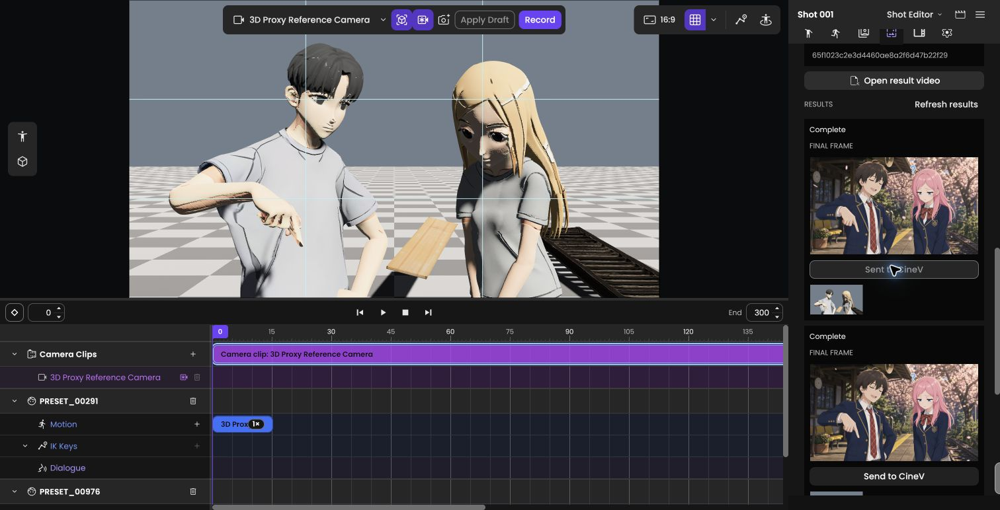
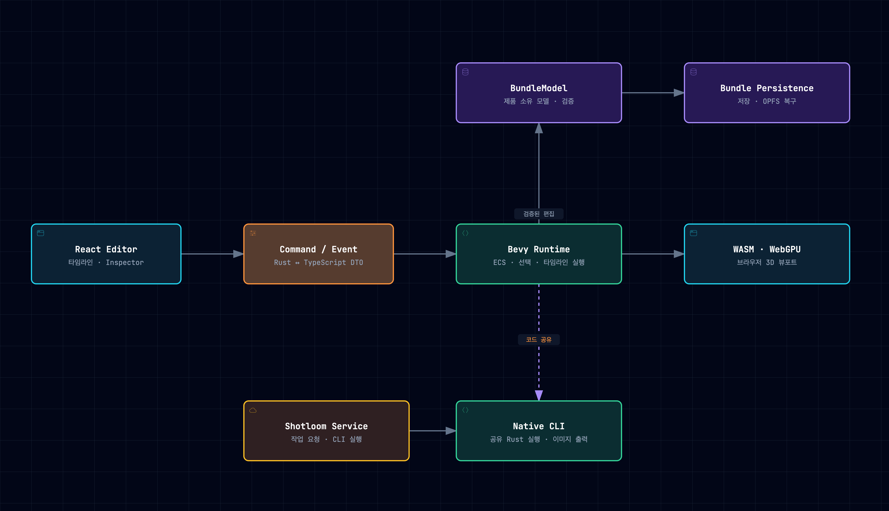
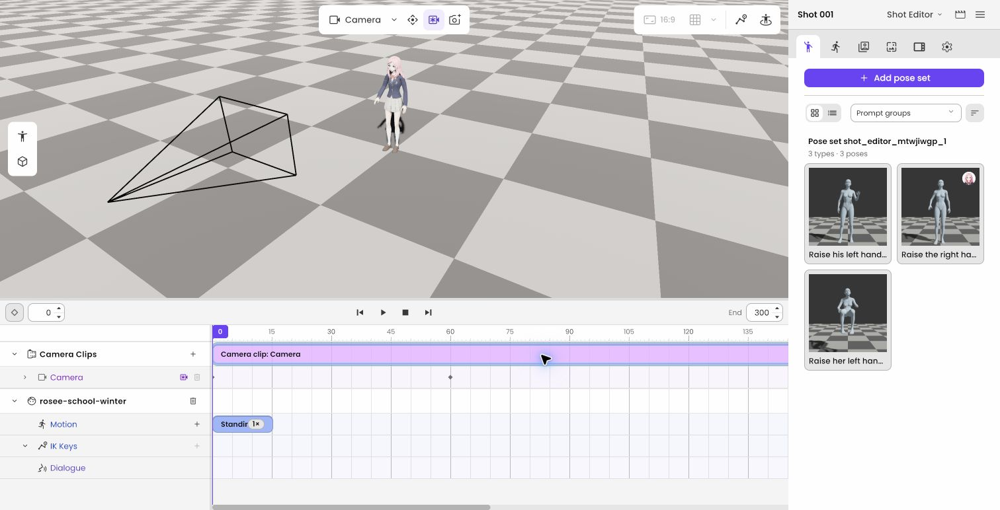
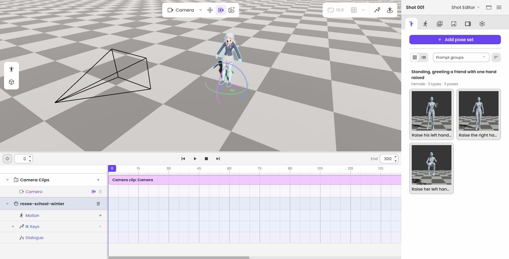
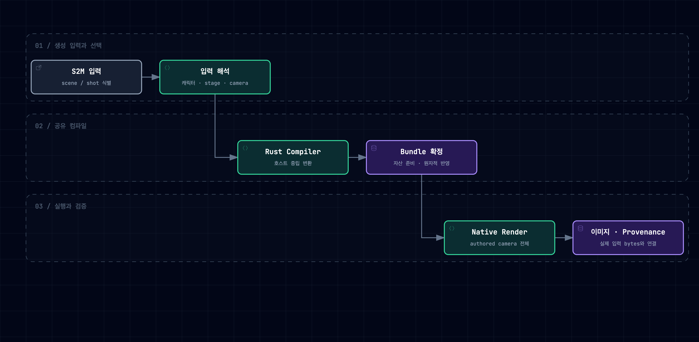
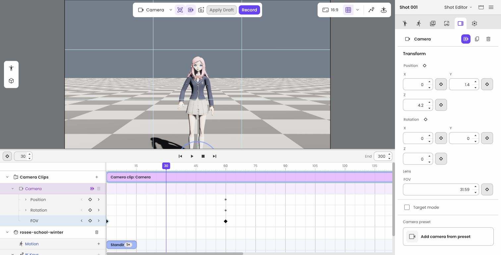
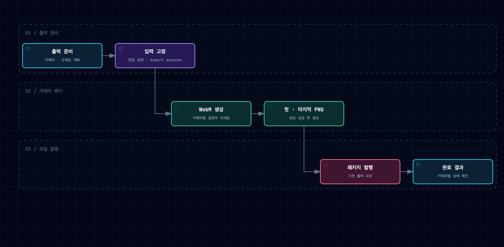
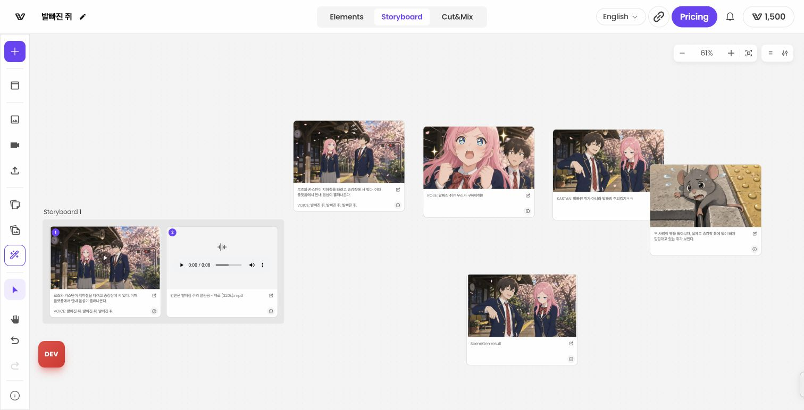

Shotloom은 생성형 영상 제작에 사용할 장면을 브라우저에서 구성하고 편집하는 3D 도구다. 캐릭터를 배치하고 포즈와 카메라 구도를 조정한 뒤, 편집한 장면을 이미지 생성의 입력으로 사용한다.

나는 Rust·Bevy와 React 환경에서 캐릭터 가져오기, 편집 데이터 모델, 저장과 되돌리기, 카메라·포즈 저작 기능을 구현했다. 이후 생성 서비스의 결과를 편집 가능한 장면으로 변환하고, 편집 결과를 CineV의 제작 흐름으로 연결하는 작업을 맡았다.

> **CineV와 Shotloom**
>
> CineV는 영상 제작 서비스이고, Shotloom은 그 제작 흐름에서 3D 장면을 편집하는 도구다. CineV의 장면을 Shotloom에서 열어 구도를 수정하고, 이를 바탕으로 생성한 이미지를 CineV로 돌려보낸다.

- **주요 환경:** Rust, Bevy, WebAssembly, WebGPU, React, TypeScript
- **담당 범위:** 3D 편집기 기반, 편집·저장 구조, 생성 데이터 변환, 카메라·포즈 저작과 출력, CineV 통합
- **협업 범위:** 기술 스택 선정과 초기 저장소·문서 기반은 팀이 담당. 나는 그 위에서 기능 설계·구현·통합·검증을 진행

이전에는 Unreal Engine 기반의 CINEVStudio를 개발했다. Shotloom에서는 그때 다뤘던 좌표계, 애니메이션, 카메라와 자산 로딩을 Rust의 소유권, Bevy의 ECS 구조, 브라우저의 비동기 실행과 저장 환경에 맞춰 구현했다. 초기의 모션 중심 편집에서 포즈와 카메라 구도를 정해 이미지 생성에 전달하는 방향으로 제품이 발전하면서, 담당 범위도 편집기 내부 기능에서 생성 파이프라인과 서비스 통합으로 넓어졌다.

## 1. 캐릭터를 가져와 조작하는 3D 편집기 기반

첫 단계에서는 사용자가 VRM 캐릭터를 가져와 장면에 배치하고, 선택한 캐릭터를 화면과 속성 패널에서 편집할 수 있게 했다. 파일을 읽는 로더부터 Bevy 런타임의 캐릭터 생성, 뷰포트 선택, 이동·회전 기즈모와 패널 동기화까지 연결했다.

이 흐름을 만들려면 각 계층이 같은 캐릭터를 식별해야 했다. 파일을 가리키는 자산 참조인 `AssetRef`와 장면에 배치된 캐릭터의 ID를 구분하고, 편집 대상의 ID로 뷰포트·패널·타임라인을 연결했다. 같은 자산을 사용하더라도 장면 안의 편집 대상은 독립적으로 다룰 수 있는 구조다.

편집 문서 모델인 `BundleModel`에는 샷·클립·캐릭터·카메라·자산을 표현했다. React는 편집 의도를 명령으로 보내고 확정된 결과를 이벤트로 받으며, Rust 코어는 문서와 검증을, Bevy는 실행과 렌더링을 맡는다. 엔진 내부 객체를 그대로 파일에 저장하지 않고 문서 모델에서 런타임을 구성하도록 했다.

3D 자산을 다루는 과정에서는 렌더링 외형과 보조 데이터도 함께 확인했다. 예를 들어 방향을 보정하기 위해 VRM을 Y축으로 180도 회전할 때, 머리카락과 의상 움직임에 쓰이는 SpringBone의 충돌체와 중력 방향에도 같은 좌표 변환이 필요했다. 누락된 데이터를 해당 변환 범위에 맞춰 수정해 모델 방향과 물리 입력을 정렬했다.

이렇게 가져온 캐릭터가 이후의 선택·변형·타임라인 편집에 같은 대상으로 참여하도록 만든 것이 편집기 기반 작업의 범위였다.

## 2. 작업을 저장하고 다시 이어가는 편집 구조

캐릭터와 카메라를 배치한 뒤에는 작업을 저장하고 다시 열 수 있어야 했다. 번들 저장·불러오기, 불러온 문서의 런타임 복원, 되돌리기와 다시 실행을 하나의 편집 흐름으로 연결했다. 저장된 데이터가 복원되어도 화면이나 타임라인이 이전 상태를 표시하면 작업을 이어갈 수 없기 때문이다.

문서 변경은 `BundleEditor`라는 공통 편집 경로로 모았다. 이 경로에서 입력 검증, 변경된 항목을 추적하는 `DirtySet`, 되돌리기에 사용할 스냅샷을 함께 처리했다. 문서를 복원한 뒤에는 모델의 상태를 Bevy 런타임에 반영하도록 연결했다.

### 사용자의 조작 단위로 변경을 확정하기

드래그 중에는 많은 위치 값이 지나가지만 사용자가 한 일은 한 번의 이동이다. 조작 시작 상태를 보존하고, 중간 입력은 미리보기에 반영한 뒤, 확정한 결과만 하나의 트랜잭션으로 기록했다. 취소하면 시작 상태로 돌아가고, 되돌리기를 실행하면 해당 조작 전의 문서와 화면을 복원한다.

자산을 가져오는 과정에도 같은 기준을 적용했다. 파일을 다운로드하거나 후보를 살펴보는 동작은 문서 변경으로 기록하지 않는다. 사용자가 캐릭터를 배치하거나 클립에서 자산을 참조할 때 프로젝트 자산으로 확정하고, 자산 등록과 편집 대상 생성을 같은 트랜잭션에 넣었다. 이를 되돌릴 때 참조와 자산이 따로 남지 않도록 했다.

스냅샷은 변경하지 않은 데이터를 공유하는 영속 자료구조로 구성했다. 문서 전체를 매번 복사하는 비용을 줄이면서, 조작 전후의 상태를 되돌리기에 사용할 수 있게 했다.

### 문서 저장과 편집 환경의 복원

명시적인 파일 저장과 브라우저의 복구 데이터는 보존 범위가 다르므로 결과와 오류를 구분해 표시했다. 브라우저 내부 파일 저장소인 OPFS에는 복구 상태와 재시도 흐름을 연결했다. 선택한 캐릭터나 패널 상태는 문서 본문과 분리해 저장하고, 사라진 선택 대상을 복원하지 못해도 문서 자체는 열 수 있도록 했다.

로컬에서 캐릭터, 포즈 후보와 할당한 클립, 카메라 키를 저장한 뒤 페이지를 다시 열어 편집 상태가 복원되는 것을 확인했다.

## 3. 생성 결과를 편집 가능한 장면과 자산으로 변환

생성 서비스가 제공하는 데이터를 Shotloom의 편집 모델로 옮기는 작업도 맡았다. 스토리보드에서 나온 인물·샷·카메라 정보를 장면으로 구성하고, 검색하거나 생성한 포즈를 선택해 클립에 적용하고 저장하는 흐름이다.

> **S2M과 Text2Pose**
>
> S2M 입력은 스토리보드의 인물·샷·카메라 등 장면 구성 정보를 담는다. Text2Pose는 텍스트 조건으로 포즈 후보를 얻는 서비스다. Shotloom은 이 결과를 내부 문서와 자산으로 변환해 편집에 사용한다.

Text2Pose에서는 요청과 응답을 연결하는 데 더해, 포즈 후보를 묶은 포즈 세트의 등록·목록·선택·클립 적용을 구현했다. 생성 결과와 미리보기 이미지를 저장한 뒤 다시 열 수 있도록 연결하고, 부가 미리보기가 손상된 경우에는 유효한 포즈 데이터까지 열리지 않는 일이 없도록 실패 범위를 나눴다.

### 장면 구성 정책을 공유 Rust 코드로 모으기

S2M 처리에서는 원본 파싱, 편집 문서의 기본 구조 생성, 카메라 템플릿 적용을 거쳐 실제 자산과 연결되는 번들 컴파일러를 구현했다. 컴파일러는 생성 입력과 준비된 자산으로 저장·불러오기에 사용할 번들을 만드는 역할이다.

브라우저와 명령행 도구가 서로 다른 규칙으로 입력을 해석하지 않도록 장면 구성과 검증 정책을 공통 Rust 코드에 모았다. 네트워크와 파일 접근은 실행 환경별 어댑터에 두었다. 필요한 자산을 확인하고 완성된 임시 문서를 검증한 뒤 결과를 확정해, 처리 중 실패한 일부 데이터가 기존 문서나 공개 출력에 섞이지 않도록 했다.

네이티브 명령행 경로에서는 작성한 카메라들의 이미지를 하나의 완성된 결과 집합으로 생성하는 데까지 연결했다. 렌더에 실제로 사용한 입력 바이트와 해시를 함께 기록해, 결과 이미지의 출처를 같은 입력으로 추적하도록 했다. 이 단계의 완료 범위는 공유 컴파일러와 네이티브 출력이며, 브라우저의 전체 가져오기·저장 경로와 실행 결과를 대조하는 검증은 별도 범위로 남겼다.

## 4. 카메라와 포즈를 저작하고 결과를 출력하는 기능

장면을 영상 생성의 입력으로 사용하려면 제작자가 카메라 구도와 인물 포즈를 직접 조정할 수 있어야 했다. 카메라·포즈 키프레임의 데이터 모델부터 평가기, 명령, 편집 UI, 저장 형식 이전까지 함께 전환했다. 재생과 탐색, 다시 열기, 출력에서도 같은 저작 의도가 유지되는 것이 목표였다.

### 키프레임의 식별과 회전 의미를 보존하기

키프레임을 프레임 번호로 식별하면 시간을 옮겼을 때 선택 대상을 잃기 쉽다. 위치와 회전을 큰 묶음으로 저장하면 일부 축만 편집하기도 어렵다. 저장 형식 버전 4에서는 프레임과 독립적인 키 ID를 두고, 속성별로 키를 다루도록 모델과 UI를 연결했다.

카메라와 관절의 회전은 표현을 구분했다. 카메라를 0도에서 720도로 돌리는 조작에는 두 바퀴 회전한다는 의미가 있다. 시작과 끝의 방향만 저장하면 이 의도가 사라지므로, 카메라는 회전 횟수를 유지하는 오일러 각으로 보간했다. 포즈의 관절 회전에는 방향 사이의 보간을 위한 쿼터니언을 사용했다.

편집 명령에는 문서의 변경 버전과 트랜잭션 ID를 검사하는 경로를 붙였다. 오래된 화면의 요청과 중복 전송을 구분하고, 같은 요청이 두 번 적용되거나 일부 키만 저장되는 상황을 막도록 했다. 키 복사·붙여넣기의 타입 검사, 카메라 모드 전환 시 구도 보존 검사, 이전 저장 형식의 원본을 남기는 업그레이드도 이 전환에 포함했다.

이 전환은 AI 에이전트와 작업하면서 설계 문서·모델·명령·UI·복구·최종 활성화를 12개 의존 작업으로 나눠 진행했다. 각 작업의 입력과 완료 기준을 정하고, 구현과 독립 검토를 분리했다. 단위 테스트와 실제 브라우저 실행을 별도로 확인해 여러 계층의 변경을 하나의 저작 기능으로 통합했다.

### 재생 반응성과 출력 완료까지 다루기

타임라인을 드래그하며 탐색하는 스크럽에서는 입력이 처리 속도를 앞지를 수 있었다. 진행 중인 요청 하나와 최신 대기 입력 하나만 유지하고, 재생·일시정지·정지와 샷 전환이 오래된 입력을 대체하도록 했다. 수정 후 50회 반복 스크럽에서 점진적인 지연과 선형 메모리 증가가 재현되지 않았고, 카메라 키 30개를 둔 카메라 시점 뷰에서도 마지막 입력과 최종 프레임이 일치하는지 확인했다.

출력은 동일한 장면 스냅샷에서 영상과 첫·마지막 프레임 이미지를 만드는 흐름으로 구성했다. WebM 저장이 성공한 뒤 PNG 두 개를 생성하고, 모든 결과가 준비되면 출력 패키지를 확정한다. 이미지 생성이나 최종 저장만 실패했을 때는 성공한 영상 렌더를 다시 수행하지 않도록 재시도 범위를 나눴다. 취소 시 진행 중인 작업을 정리하고 기존 출력 파일을 보호하는 처리도 포함했다.[^export-verification]

## 5. CineV에서 시작해 편집 결과를 돌려보내는 서비스 통합

편집기 기능을 CineV의 실제 제작 과정에 연결했다. CineV가 전달한 생성 작업을 Shotloom에서 열면 인물·소품·카메라가 편집 가능한 장면으로 구성되고, 제작자는 구도와 포즈를 조정한 뒤 그 장면으로 새 이미지를 생성한다. 생성 결과를 확인하고 선택한 이미지를 CineV에 보내는 흐름이다.

장면 진입에서는 전달받은 작업 ID와 입력을 검증하고, 런타임과 자산 준비가 끝난 뒤 장면을 구성하도록 했다. 준비 중에는 충돌하는 편집을 막고, 이전 요청이 늦게 끝나도 다른 작업의 장면을 바꾸지 않도록 했다. 기존 작업 공간의 교체와 실패 처리는 편집기의 저장 상태와 연결했다.[^cinev-workspace]

결과 반환에서는 생성 이미지와 서버의 생성 이력, 결과별 저장 상태를 편집기에 연결했다. 이미지 생성과 CineV 저장을 별도 작업으로 다뤄, 저장이 실패했을 때 같은 결과를 다시 보낼 수 있게 했다. 이 통합의 저장 대상은 생성 이미지이며, 편집 가능한 3D 번들을 CineV 서버에 저장하고 다시 여는 기능은 후속 범위다.

개발 배포 환경에서 실제 CineV 버튼을 통해 진입해 인물 2명과 소품 4개, 카메라와 타임라인이 자동으로 구성되는 것을 확인했다. 이후 카메라 구도를 바꾸고 새 이미지를 생성해 CineV로 보낸 뒤, 원래 스토리보드에 추가 결과가 반영되는 흐름도 확인했다.

## 용어집

- **CineV:** Shotloom에서 편집할 장면의 출발점이자 생성 결과 이미지를 돌려보내는 영상 제작 서비스.
- **CINEVStudio:** Shotloom 이전에 개발에 참여한 Unreal Engine 기반 제작 도구.
- **S2M:** 스토리보드의 인물·샷·카메라 등 장면 구성 정보를 제공하는 입력. Shotloom은 이를 편집 문서로 변환한다.
- **Text2Pose:** 텍스트 조건으로 포즈 후보를 얻는 서비스. 후보를 포즈 세트로 관리하고 클립에 적용한다.
- **VRM:** 캐릭터 모델을 가져올 때 사용하는 아바타 파일 형식. 이 프로젝트에서는 VRM 1.0 로딩과 편집 연결을 다뤘다.
- **샷·클립:** 샷은 장면과 타임라인을 담는 편집 단위이고, 클립은 그 안에서 특정 시간 구간에 적용되는 퍼포먼스나 카메라 편집 단위다.
- **번들·`BundleModel`:** 번들은 문서와 자산을 함께 보존하는 프로젝트 저장 단위다. `BundleModel`은 그 문서를 표현하는 Rust 데이터 모델이다.
- **ECS:** 객체와 속성 데이터, 처리 로직을 분리하는 엔진 구성 방식. Bevy 런타임에서 문서의 캐릭터와 카메라를 실행 가능한 상태로 구성할 때 사용한다.
- **OPFS:** 브라우저가 사이트별로 제공하는 내부 파일 저장소. 편집 문서의 자동 저장과 복구 데이터에 사용한다.

## 관련 글

- [CINEVStudio에서 Shotloom으로 전환한 배경](/posts/from-cinev-studio-to-shotloom/)
- [Rust와 AI 에이전틱 코딩에서 다시 본 TDD](/posts/tdd-game-development-rust-ai-agent/)
- [이력서](/resume/)

[^export-verification]: 출력 기능 구현 당시 실제 Chromium에서 1·5프레임 출력과 실패·취소 경계를 검증했다. 별도로 본문 화면을 확보한 로컬 실행에서는 내보내기가 초기 준비 단계의 `INITIAL_READINESS_FAILED`로 실패했고, 시작 시 `wgpu createBuffer RangeError`도 관찰했다. 해당 로컬 실행에서 출력 완료를 확인한 것은 아니다.

[^cinev-workspace]: CineV 진입 정책은 개발 중 변경됐다. 현재 구현은 기존 작업의 백업이나 교체 확인 없이 새 장면을 열며, 백업 지원은 후속 범위다. 교체 전 실패는 기존 저장소를 유지하지만, 교체 후 실패에서 이전 작업의 복원을 보장하지 않는다.
