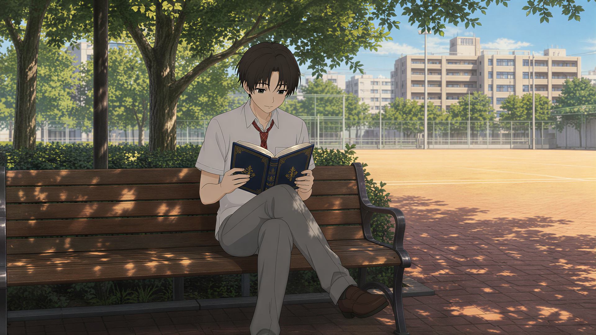
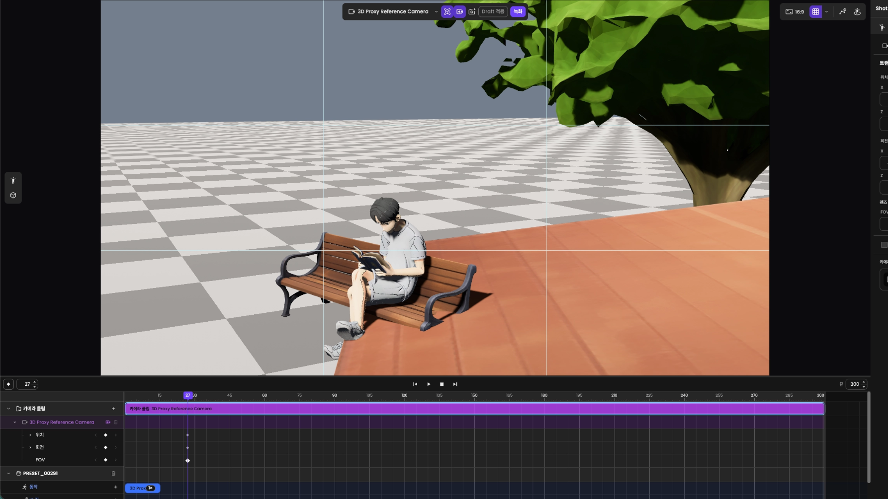

## 프로젝트와 담당 역할

`Shotloom`은 캐릭터·소품을 배치하고 동작과 카메라 구도를 타임라인에서 편집하는 브라우저 기반 3D 연출 도구다. 편집한 장면은 이미지·영상으로 출력하거나 `SceneGen`의 영상 생성에 사용한다.

| 구분 | 내용 |
| --- | --- |
| 담당 기능 | 캐릭터 가져오기, 편집 데이터 모델, 저장·복원과 되돌리기, 카메라·포즈 저작과 출력 |
| 서비스 연동 | 생성 결과를 편집 가능한 장면·자산으로 변환하고, 편집 결과를 `CineV` 제작 흐름에 연결 |
| 팀과의 역할 분담 | 팀이 기술 스택 선정과 초기 저장소·문서 구성을 맡았고, 나는 위 편집 기능과 서비스 연동을 개발 |
| 주요 환경 | `Rust`, `Bevy`, `WebAssembly`, `WebGPU`, `React`, `TypeScript` |

이전에 개발한 `Unreal Engine` 기반 `CINEVStudio`의 좌표계·애니메이션·카메라·자산 로딩 경험을 바탕으로, `Rust`의 소유권과 `Bevy`의 `ECS`, 브라우저의 비동기 실행·저장 환경에 맞춰 구현했다. 담당 범위도 편집기 내부에서 생성 파이프라인과 서비스 통합으로 넓어졌다.

## 대표 제작 결과

### 하나의 샷에서 다른 구도의 장면으로

스토리보드에서 인물을 가까이 담은 샷을 3D 장면으로 열고, 주변 공간이 함께 보이도록 카메라 구도를 바꾼 사례다. 아래 영상은 편집한 장면을 바탕으로 `SceneGen`에서 생성한 결과다.

<iframe class="video-embed" src="https://www.youtube.com/embed/P-CnmKYDoxg" title="Shotloom에서 연출한 장면을 바탕으로 SceneGen에서 생성한 결과 영상" loading="lazy" allow="accelerometer; autoplay; clipboard-write; encrypted-media; gyroscope; picture-in-picture; web-share" referrerpolicy="strict-origin-when-cross-origin" allowfullscreen></iframe>

*장면 연출 이후 `SceneGen`으로 생성한 결과. 제품 화면과 콘텐츠는 팀의 결과물이며, 내가 맡은 편집기 구현 범위는 아래에 정리했다.*

## 장면 연출부터 제작 결과까지

`CineV`는 스토리보드의 샷을 관리하는 영상 제작 서비스이고, `Shotloom`은 그 샷의 동작과 구도를 편집하는 도구다. `SceneGen`은 편집한 장면과 생성 조건을 바탕으로 영상을 만든다.

1. **장면 준비:** `CineV`의 샷에서 3D 씬을 생성해 `Shotloom`으로 열거나, `Shotloom`에서 직접 캐릭터와 소품을 배치한다.
2. **동작과 카메라 편집:** 생성한 모션 후보를 비교해 캐릭터의 클립에 적용하고, 서로 다른 프레임에 카메라 키를 저장해 구도와 움직임을 구성한다.
3. **재생과 수정:** 타임라인을 재생하며 동작과 카메라를 확인한다. 편집 내용은 번들로 보관해 다시 열 수 있다.
4. **생성과 다음 샷:** `SceneGen`에서 영상을 생성하고, 선택한 결과의 마지막 프레임 이미지를 `CineV` 스토리보드에 추가한다. 이 이미지를 다음 3D 장면의 입력으로 사용해 편집을 이어간다.

### 포즈·동작·카메라를 편집하는 과정

<iframe class="video-embed" src="https://www.youtube.com/embed/7tAEuFip6nA" title="Shotloom의 포즈·동작·카메라 편집부터 SceneGen 영상 생성까지의 제작 과정" loading="lazy" allow="accelerometer; autoplay; clipboard-write; encrypted-media; gyroscope; picture-in-picture; web-share" referrerpolicy="strict-origin-when-cross-origin" allowfullscreen></iframe>

*포즈와 동작을 적용하고 카메라 구도를 편집한 뒤 `SceneGen`으로 영상을 생성하는 과정.*

- **모션:** 후보 미리보기와 타임라인 적용을 구분한다. 후보를 확인한 뒤 대상 캐릭터와 구간을 정해 클립을 추가한다.
- **카메라:** 프레임별로 구도를 저장하고, 키 사이를 재생하며 움직임을 확인한다.

작업 보관·카메라 출력·생성 결과 전달은 각각 다른 결과물을 남긴다.

| 동작 | 남는 결과 |
| --- | --- |
| 파일 → 내보내기 | 다시 열어 편집할 수 있는 `.shotloom.zip` 번들 |
| 카메라 Export | 편집한 3D 장면의 첫·마지막 프레임 `PNG`와 무음 `WebM` |
| `SceneGen` 생성 | 장면과 생성 조건을 바탕으로 생성한 영상 |
| `CineV`로 보내기 | 선택한 생성 영상의 마지막 프레임 이미지가 추가된 스토리보드 |

## 1. 캐릭터를 가져와 조작하는 3D 편집기 기반

`VRM` 캐릭터를 가져와 배치하고, 뷰포트와 속성 패널에서 선택·이동·회전할 수 있게 했다.

| 구현 대상 | 구현 내용 |
| --- | --- |
| 가져오기와 조작 | 파일 로더 → `Bevy` 캐릭터 생성 → 뷰포트 선택 → 이동·회전 기즈모 → 패널 동기화 연결 |
| 편집 대상 식별 | 파일을 가리키는 `AssetRef`와 장면 속 캐릭터 ID를 분리. 같은 자산으로 만든 캐릭터도 독립적으로 편집하고, ID로 뷰포트·패널·타임라인 연결 |
| 편집 문서 | `BundleModel`에 샷·클립·캐릭터·카메라·자산 표현. 엔진 객체를 직접 저장하지 않고 문서에서 런타임 구성 |
| 계층별 책임 | `React`는 명령 전송·확정 이벤트 수신, `Rust` 코어는 문서·검증, `Bevy`는 실행·렌더링 담당 |

방향 보정을 위해 `VRM`을 Y축으로 180도 회전할 때는 외형뿐 아니라 머리카락·의상에 쓰이는 `SpringBone`의 충돌체와 중력 방향에도 같은 변환이 필요했다. 누락된 보조 데이터를 수정해 모델 방향과 물리 입력을 정렬했다.

## 2. 작업을 저장하고 다시 이어가는 편집 구조

번들 저장·불러오기, 런타임 복원, 되돌리기·다시 실행을 연결했다. 문서만 복원되고 화면이나 타임라인이 이전 상태에 머물지 않도록, 복원한 모델을 `Bevy` 런타임에도 반영했다.

### 사용자의 조작 단위로 변경을 확정하기

드래그 중에는 많은 위치 값이 지나가지만 사용자가 한 일은 한 번의 이동이다. 중간 입력은 미리보기로 처리하고, 확정한 결과만 하나의 트랜잭션으로 기록했다.

| 구현 대상 | 구현 내용 |
| --- | --- |
| 공통 변경 경로 | `BundleEditor`에서 입력 검증, 변경 항목을 추적하는 `DirtySet`, 되돌리기용 스냅샷 처리 |
| 취소·되돌리기 | 조작 시작 상태를 보존. 취소는 시작 상태로, 되돌리기는 조작 전 문서와 화면으로 복원 |
| 자산 확정 시점 | 다운로드·후보 미리보기는 문서를 변경하지 않음. 캐릭터 배치나 클립의 자산 참조 시 프로젝트 자산으로 확정 |
| 자산과 대상의 생명주기 | 자산 등록과 편집 대상 생성을 같은 트랜잭션으로 묶어, 되돌린 뒤 참조나 자산이 따로 남는 문제 방지 |
| 스냅샷 비용 | 변경하지 않은 데이터를 공유하는 영속 자료구조로 전체 복사를 줄이고 조작 전후 상태 보존 |

### 문서 저장과 편집 환경의 복원

| 저장 대상 | 복원·실패 처리 |
| --- | --- |
| 명시적 파일 저장·브라우저 복구 데이터 | 보존 범위가 달라 결과와 오류를 구분. 브라우저 내부 저장소 `OPFS`에 복구 상태·재시도 연결 |
| 선택한 캐릭터·패널 상태 | 문서 본문과 분리해 저장. 사라진 선택 대상을 복원하지 못해도 문서는 열 수 있도록 처리 |

**검증:** 로컬에서 저장 후 페이지를 다시 열어 다음 항목의 복원을 확인했다.

- 캐릭터, 포즈 후보와 할당한 클립
- 0·60프레임의 카메라 키

## 3. 생성 결과를 편집 가능한 장면과 자산으로 변환

스토리보드의 인물·샷·카메라 정보를 편집 가능한 장면으로 변환했다. 검색·생성한 포즈는 선택해 클립에 적용하고 저장하도록 연결했다.

> **`S2M`과 `Text2Pose`**
>
> `S2M` 입력은 스토리보드의 인물·샷·카메라 등 장면 구성 정보를 담는다. `Text2Pose`는 텍스트 조건으로 포즈 후보를 얻는 서비스다. `Shotloom`은 이 결과를 내부 문서와 자산으로 변환해 편집에 사용한다.

| `Text2Pose` 연동 | 구현 내용 |
| --- | --- |
| 요청·편집 연결 | 요청과 응답 연결, 후보를 묶은 포즈 세트의 등록·목록·선택·클립 적용 |
| 저장·다시 열기 | 생성 결과와 미리보기 이미지 보존 |
| 실패 범위 분리 | 부가 미리보기가 손상돼도 유효한 포즈 데이터는 열 수 있도록 처리 |

### 장면 구성 정책을 공유 Rust 코드로 모으기

브라우저와 명령행 도구가 같은 규칙으로 입력을 해석하도록 장면 구성·검증을 공통 `Rust` 코드에 모았다. 번들 컴파일러는 생성 입력과 준비된 자산을 저장·불러오기 가능한 번들로 변환한다.

| 구현 대상 | 구현 내용 |
| --- | --- |
| `S2M` 변환 | 원본 파싱 → 편집 문서 기본 구조 생성 → 카메라 템플릿 적용 → 실제 자산 연결 |
| 실행 환경 분리 | 장면 구성·검증은 공유 코어, 네트워크·파일 접근은 환경별 어댑터에서 처리 |
| 결과 확정 | 필요한 자산 확인과 완성된 임시 문서 검증 후 확정. 실패한 일부 데이터가 기존 문서나 공개 출력에 섞이지 않도록 처리 |
| 네이티브 출력 | 작성한 카메라들의 이미지를 하나의 완성된 결과 집합으로 생성 |
| 입력 출처 추적 | 렌더에 실제 사용한 입력 바이트와 해시를 기록해 결과 이미지와 연결 |

> **완료·검증 범위**
>
> 공유 컴파일러와 네이티브 출력까지 구현했다. 브라우저의 전체 가져오기·저장 경로와 실행 결과를 대조하는 검증은 별도 범위로 남겼다.

## 4. 카메라와 포즈를 저작하고 결과를 출력하는 기능

영상 생성에 사용할 카메라 구도와 인물 포즈를 직접 편집하도록, 키프레임 모델·평가기·명령·UI·저장 형식 이전을 함께 구현했다. 재생·탐색·다시 열기·출력에서도 같은 저작 의도가 유지되는 것이 목표였다.

### 키프레임의 식별과 회전 의미를 보존하기

카메라를 0도에서 720도로 돌리면 두 바퀴 회전해야 한다. 시작과 끝의 방향만 저장하면 이 의도가 사라지므로, 카메라와 관절의 회전 표현을 구분했다.

| 문제·조건 | 구현 내용 |
| --- | --- |
| 시간 이동 시 키 선택 유지 | 저장 형식 버전 4에서 프레임 번호와 독립적인 키 ID 도입 |
| 일부 축만 편집 | 위치·회전을 큰 묶음으로 다루던 모델과 UI를 속성별 키 편집으로 전환 |
| 카메라의 회전 횟수 | 오일러 각으로 보간해 0→720도 같은 다회전 의도 보존 |
| 포즈의 관절 회전 | 쿼터니언으로 방향 사이를 보간 |
| 오래된 요청·중복·부분 적용 | 문서 변경 버전과 트랜잭션 ID를 검사해 오래된 화면의 요청·중복 전송을 구분하고, 이중 적용·일부 키만 저장되는 상황 방지 |
| 복사·붙여넣기 | 키 타입 검사 |
| 카메라 모드 전환 | 구도 보존 검사 |
| 저장 형식 업그레이드 | 이전 형식의 원본 보존 |

**개발·검증 방식**

- AI 에이전트와 설계 문서·모델·명령·UI·복구·최종 활성화를 의존 관계가 있는 12개 작업으로 나눴다.
- 작업별 입력·완료 기준을 정하고, 구현과 독립 검토를 분리했다.
- 단위 테스트와 실제 브라우저 실행을 별도로 확인해 각 계층의 변경을 통합했다.

### 재생 반응성과 출력 완료까지 다루기

타임라인을 드래그하는 스크럽에서는 입력이 처리 속도를 앞지를 수 있었다. 요청을 모두 쌓지 않고 최신 입력을 반영하도록 처리했다.

| 구현 대상 | 구현 내용 |
| --- | --- |
| 스크럽 요청 | 진행 중인 요청 하나와 최신 대기 입력 하나만 유지 |
| 재생 상태·샷 변경 | 재생·일시정지·정지·샷 전환이 오래된 입력을 대체 |
| 출력 일관성 | 같은 장면 스냅샷으로 영상과 첫·마지막 프레임 이미지 생성 |
| 출력 확정 순서 | `WebM` 저장 성공 → `PNG` 두 개 생성 → 모든 결과가 준비되면 패키지 확정 |
| 실패·재시도 | 이미지 생성이나 최종 저장만 실패하면 성공한 영상 렌더는 반복하지 않도록 분리 |
| 취소 | 진행 중인 작업 정리와 기존 출력 파일 보호 |

**반응성 검증**

- 50회 반복 스크럽에서 점진적 지연과 선형 메모리 증가가 재현되지 않았다.
- 카메라 키 30개를 둔 카메라 시점 뷰에서 마지막 입력과 최종 프레임의 일치를 확인했다.

> **출력 검증 범위**
>
> 출력 기능 구현 당시 실제 `Chromium`에서 1·5프레임 출력과 실패·취소 경계를 검증했다. 별도로 본문 화면을 확보한 로컬 실행에서는 내보내기가 초기 준비 단계의 `INITIAL_READINESS_FAILED`로 실패했고, 시작 시 `wgpu createBuffer RangeError`도 관찰했다. 해당 로컬 실행에서 출력 완료를 확인한 것은 아니다.

## 5. CineV에서 시작해 편집 결과를 돌려보내는 서비스 통합

`CineV`에서 받은 생성 작업을 편집 가능한 인물·소품·카메라로 구성하고, `SceneGen` 생성 결과를 스토리보드로 돌려보내는 흐름을 연결했다.

| 통합 지점 | 구현 내용 |
| --- | --- |
| 장면 진입 | 작업 ID·입력 검증 후 런타임과 자산 준비를 기다려 장면 구성 |
| 편집·요청 충돌 | 준비 중 충돌하는 편집 차단. 늦게 끝난 이전 요청이 다른 작업의 장면을 바꾸지 않도록 처리 |
| 작업 공간 교체 | 교체·실패 처리를 편집기의 저장 상태와 연결 |
| 생성 결과 관리 | 생성 이미지, 서버의 생성 이력, 결과별 저장 상태를 편집기에 연결 |
| 결과 재전송 | 생성과 `CineV` 저장을 분리해, 저장 실패 시 재생성 없이 같은 결과 전송 |

> **장면 진입 정책의 변경**
>
> `CineV` 진입 정책은 개발 중 변경됐다. 본문의 초기 통합 검증 당시에는 기존 작업의 백업이나 교체 확인 없이 새 장면을 여는 범위였고, 교체 후 실패에서 이전 작업의 복원을 보장하지 않았다. 이후 구현에는 같은 Run의 저장 작업 이어하기와 다른 장면 진입 전 백업·교체 확인이 추가됐다. 초기 검증 기록과 이후의 구현 범위는 구분했다.

> **결과 반환 범위**
>
> 현재 `CineV`로 보내는 대상은 생성 영상의 마지막 프레임 이미지다. 편집 가능한 3D 번들을 `CineV` 서버에 저장하고 다시 여는 기능은 이 통합의 구현 범위에 포함하지 않았다.

**초기 통합 검증 — 개발 배포 환경**

- 실제 `CineV` 버튼으로 진입해 인물 2명·소품 4개·카메라·타임라인이 자동으로 구성되는 것을 확인했다.
- 카메라 구도 변경 → 새 이미지 생성 → `CineV` 전송 후, 원래 스토리보드에 추가 결과가 반영되는 것을 확인했다.

## 용어집

- **`CineV`:** `Shotloom`에서 편집할 장면의 출발점이자 생성 결과 이미지를 돌려보내는 영상 제작 서비스.
- **`SceneGen`:** 편집한 장면과 생성 조건을 바탕으로 영상을 생성하는 기능. 선택한 결과의 마지막 프레임을 `CineV`로 전달한다.
- **`CINEVStudio`:** `Shotloom` 이전에 개발에 참여한 `Unreal Engine` 기반 제작 도구.
- **`S2M`:** 스토리보드의 인물·샷·카메라 등 장면 구성 정보를 제공하는 입력. `Shotloom`은 이를 편집 문서로 변환한다.
- **`Text2Pose`:** 텍스트 조건으로 포즈 후보를 얻는 서비스. 후보를 포즈 세트로 관리하고 클립에 적용한다.
- **`VRM`:** 캐릭터 모델을 가져올 때 사용하는 아바타 파일 형식. 이 프로젝트에서는 `VRM` 1.0 로딩과 편집 연결을 다뤘다.
- **샷·클립:** 샷은 장면과 타임라인을 담는 편집 단위이고, 클립은 그 안에서 특정 시간 구간에 적용되는 퍼포먼스나 카메라 편집 단위다.
- **번들·`BundleModel`:** 번들은 문서와 자산을 함께 보존하는 프로젝트 저장 단위다. `BundleModel`은 그 문서를 표현하는 `Rust` 데이터 모델이다.
- **`ECS`:** 객체와 속성 데이터, 처리 로직을 분리하는 엔진 구성 방식. `Bevy` 런타임에서 문서의 캐릭터와 카메라를 실행 가능한 상태로 구성할 때 사용한다.
- **`OPFS`:** 브라우저가 사이트별로 제공하는 내부 파일 저장소. 편집 문서의 자동 저장과 복구 데이터에 사용한다.

## 관련 글

- [CINEVStudio에서 Shotloom으로 전환한 배경](/posts/from-cinev-studio-to-shotloom/)
- [Rust와 AI 에이전틱 코딩에서 다시 본 TDD](/posts/tdd-game-development-rust-ai-agent/)
- [이력서](/resume/)
